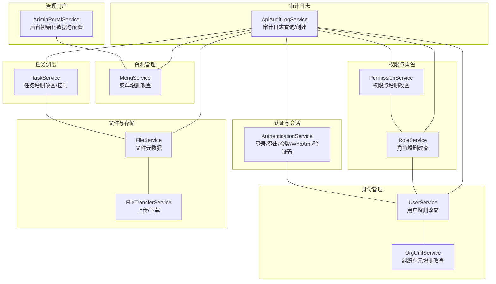
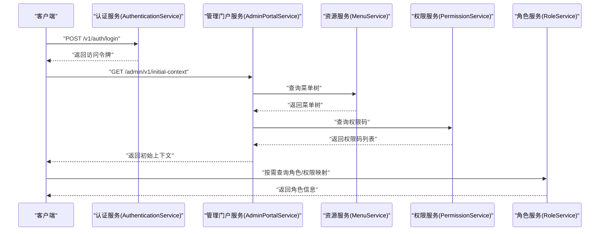
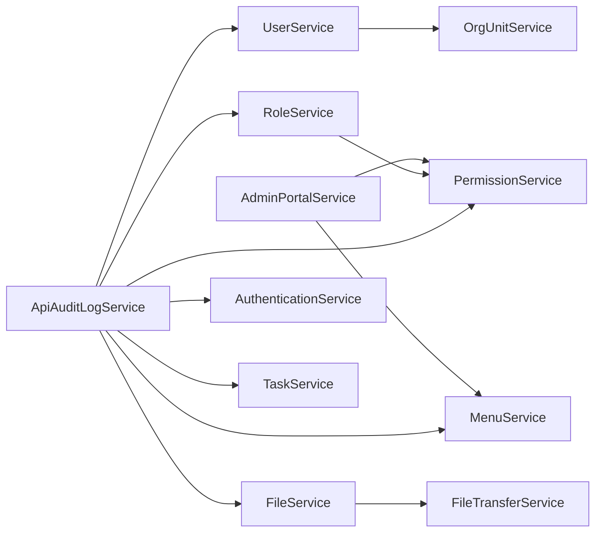

# API 接口文档

<cite>
**本文引用的文件**
- [i_admin_portal.proto](file://backend/api/protos/admin/service/v1/i_admin_portal.proto)
- [authentication.proto](file://backend/api/protos/authentication/protocol/authentication.proto)
- [user.proto](file://backend/api/protos/identity/service/v1/user.proto)
- [permission.proto](file://backend/api/protos/permission/service/v1/permission.proto)
- [role.proto](file://backend/api/protos/permission/service/v1/role.proto)
- [org_unit.proto](file://backend/api/protos/identity/service/v1/org_unit.proto)
- [menu.proto](file://backend/api/protos/resource/service/v1/menu.proto)
- [file.proto](file://backend/api/protos/storage/service/v1/file.proto)
- [file_transfer.proto](file://backend/api/protos/storage/service/v1/file_transfer.proto)
- [task.proto](file://backend/api/protos/task/service/v1/task.proto)
- [api_audit_log.proto](file://backend/api/protos/audit/service/v1/api_audit_log.proto)
</cite>

## 目录
1. [简介](#简介)
2. [项目结构](#项目结构)
3. [核心组件](#核心组件)
4. [架构总览](#架构总览)
5. [详细组件分析](#详细组件分析)
6. [依赖关系分析](#依赖关系分析)
7. [性能考量](#性能考量)
8. [故障排查指南](#故障排查指南)
9. [结论](#结论)
10. [附录](#附录)

## 简介
本文件为 GoWind Admin 提供完整的 API 接口文档，覆盖 RESTful 与 gRPC 两种协议形态。基于 Protobuf 协议定义，逐项说明各模块的接口规范，包括：
- HTTP 方法与 URL 模式
- 请求/响应模型
- 认证与鉴权要求
- 错误码与状态码含义
- 调用示例与返回说明
- 版本管理与向后兼容策略
- 测试与调试建议

## 项目结构
GoWind Admin 的 API 定义采用按领域划分的 Protobuf 结构，主要模块如下：
- 管理门户：后台前端初始化数据与配置
- 认证与会话：登录、登出、令牌管理、验证码
- 身份管理：用户、组织单元、岗位、用户档案
- 权限与角色：权限点、角色、权限映射
- 资源管理：菜单与路由
- 文件与存储：文件元数据与上传下载
- 任务调度：定时/延时/等待结果任务
- 审计日志：接口调用审计

图表来源
- [i_admin_portal.proto:11-32](file://backend/api/protos/admin/service/v1/i_admin_portal.proto#L11-L32)
- [authentication.proto:21-60](file://backend/api/protos/authentication/protocol/authentication.proto#L21-L60)
- [user.proto:15-38](file://backend/api/protos/identity/service/v1/user.proto#L15-L38)
- [org_unit.proto:13-34](file://backend/api/protos/identity/service/v1/org_unit.proto#L13-L34)
- [permission.proto:14-35](file://backend/api/protos/permission/service/v1/permission.proto#L14-L35)
- [role.proto:13-43](file://backend/api/protos/permission/service/v1/role.proto#L13-L43)
- [menu.proto:16-34](file://backend/api/protos/resource/service/v1/menu.proto#L16-L34)
- [file.proto:16-34](file://backend/api/protos/storage/service/v1/file.proto#L16-L34)
- [file_transfer.proto:12-21](file://backend/api/protos/storage/service/v1/file_transfer.proto#L12-L21)
- [task.proto:17-50](file://backend/api/protos/task/service/v1/task.proto#L17-L50)
- [api_audit_log.proto:19-28](file://backend/api/protos/audit/service/v1/api_audit_log.proto#L19-L28)

章节来源
- [i_admin_portal.proto:11-32](file://backend/api/protos/admin/service/v1/i_admin_portal.proto#L11-L32)
- [authentication.proto:21-60](file://backend/api/protos/authentication/protocol/authentication.proto#L21-L60)
- [user.proto:15-38](file://backend/api/protos/identity/service/v1/user.proto#L15-L38)
- [org_unit.proto:13-34](file://backend/api/protos/identity/service/v1/org_unit.proto#L13-L34)
- [permission.proto:14-35](file://backend/api/protos/permission/service/v1/permission.proto#L14-L35)
- [role.proto:13-43](file://backend/api/protos/permission/service/v1/role.proto#L13-L43)
- [menu.proto:16-34](file://backend/api/protos/resource/service/v1/menu.proto#L16-L34)
- [file.proto:16-34](file://backend/api/protos/storage/service/v1/file.proto#L16-L34)
- [file_transfer.proto:12-21](file://backend/api/protos/storage/service/v1/file_transfer.proto#L12-L21)
- [task.proto:17-50](file://backend/api/protos/task/service/v1/task.proto#L17-L50)
- [api_audit_log.proto:19-28](file://backend/api/protos/audit/service/v1/api_audit_log.proto#L19-L28)

## 核心组件
本节概述各服务的主要职责与典型交互。

- 管理门户服务（AdminPortalService）
  - 提供前端导航、权限码与初始上下文，支撑后台前端初始化。
- 认证服务（AuthenticationService）
  - 支持密码登录、登出、注册、令牌刷新、验证、WhoAmI、验证码生成与校验。
- 用户服务（UserService）
  - 用户列表/统计、详情查询、创建、批量创建、更新、删除、存在性检查。
- 组织单元服务（OrgUnitService）
  - 组织单元列表/统计、详情查询、创建、批量创建、更新、删除。
- 权限服务（PermissionService）
  - 权限点列表/统计、详情查询、创建、更新、删除、同步。
- 角色服务（RoleService）
  - 角色列表/统计、详情查询、创建、批量创建、更新、删除、角色码/ID互查。
- 菜单服务（MenuService）
  - 菜单列表/统计、详情查询、创建、更新、删除。
- 文件服务（FileService）
  - 文件列表/统计、详情查询、创建、更新、删除。
- 文件传输服务（FileTransferService）
  - 文件下载（支持预签名 URL）、上传（PUT/POST 流式）。
- 任务服务（TaskService）
  - 任务列表/统计、详情查询、创建、更新、删除、类型名列表、全量启停控。
- 审计日志服务（ApiAuditLogService）
  - 审计日志列表/详情查询、创建。

章节来源
- [i_admin_portal.proto:11-32](file://backend/api/protos/admin/service/v1/i_admin_portal.proto#L11-L32)
- [authentication.proto:21-60](file://backend/api/protos/authentication/protocol/authentication.proto#L21-L60)
- [user.proto:15-38](file://backend/api/protos/identity/service/v1/user.proto#L15-L38)
- [org_unit.proto:13-34](file://backend/api/protos/identity/service/v1/org_unit.proto#L13-L34)
- [permission.proto:14-35](file://backend/api/protos/permission/service/v1/permission.proto#L14-L35)
- [role.proto:13-43](file://backend/api/protos/permission/service/v1/role.proto#L13-L43)
- [menu.proto:16-34](file://backend/api/protos/resource/service/v1/menu.proto#L16-L34)
- [file.proto:16-34](file://backend/api/protos/storage/service/v1/file.proto#L16-L34)
- [file_transfer.proto:12-21](file://backend/api/protos/storage/service/v1/file_transfer.proto#L12-L21)
- [task.proto:17-50](file://backend/api/protos/task/service/v1/task.proto#L17-L50)
- [api_audit_log.proto:19-28](file://backend/api/protos/audit/service/v1/api_audit_log.proto#L19-L28)

## 架构总览
以下序列图展示从客户端到服务端的关键调用链路，涵盖认证、权限与资源访问。

图表来源
- [authentication.proto:21-60](file://backend/api/protos/authentication/protocol/authentication.proto#L21-L60)
- [i_admin_portal.proto:11-32](file://backend/api/protos/admin/service/v1/i_admin_portal.proto#L11-L32)
- [menu.proto:16-34](file://backend/api/protos/resource/service/v1/menu.proto#L16-L34)
- [permission.proto:14-35](file://backend/api/protos/permission/service/v1/permission.proto#L14-L35)
- [role.proto:13-43](file://backend/api/protos/permission/service/v1/role.proto#L13-L43)

## 详细组件分析

### 管理门户服务（AdminPortalService）
- 功能
  - 获取前端导航路由表
  - 获取当前用户的权限码列表
  - 一次性获取后台初始化上下文（菜单树 + 权限码）
- HTTP 接口
  - GET /admin/v1/routes → ListRouteResponse
  - GET /admin/v1/perm-codes → ListPermissionCodeResponse
  - GET /admin/v1/initial-context → InitialContextResponse
- 请求/响应要点
  - 请求均为无参数（Empty）
  - 响应包含菜单树与权限码集合
- 认证
  - 需要有效访问令牌
- 示例
  - 成功：返回包含菜单树与权限码的结构
  - 失败：如未认证或权限不足，返回相应错误码

章节来源
- [i_admin_portal.proto:11-32](file://backend/api/protos/admin/service/v1/i_admin_portal.proto#L11-L32)

### 认证服务（AuthenticationService）
- 功能
  - 登录、登出、注册
  - 刷新令牌、验证令牌
  - 获取访问令牌列表、按令牌撤销、拉黑/解封令牌
  - WhoAmI 获取当前用户身份
  - 验证码生成与校验
- HTTP 接口
  - POST /v1/auth/login → LoginResponse
  - POST /v1/auth/logout → Empty
  - POST /v1/auth/register → RegisterUserResponse
  - POST /v1/auth/refresh → LoginResponse
  - POST /v1/auth/validate → ValidateTokenResponse
  - GET /v1/auth/tokens → GetAccessTokensResponse
  - POST /v1/auth/revoke → Empty
  - POST /v1/auth/block → BlockTokenResponse
  - POST /v1/auth/unblock → Empty
  - GET /v1/auth/whoami → WhoAmIResponse
  - POST /v1/auth/captcha/generate → GenerateCaptchaResponse
  - POST /v1/auth/captcha/verify → VerifyCaptchaResponse
- 请求/响应要点
  - LoginRequest 支持多种授权类型与标识（用户名/邮箱/手机）
  - ValidateTokenRequest 支持跳过 Redis 校验与黑名单校验
  - BlockTokenRequest 支持按原始令牌或 JTI 拉黑，并可设置时长
- 认证
  - 多数接口需要 Bearer 令牌
  - WhoAmI 与验证码相关接口可能无需强认证或使用验证码流程
- 示例
  - 成功：登录返回 access_token、expires_in、可选 refresh_token
  - 失败：令牌无效、被拉黑、验证码不匹配等

章节来源
- [authentication.proto:21-60](file://backend/api/protos/authentication/protocol/authentication.proto#L21-L60)

### 用户服务（UserService）
- 功能
  - 用户列表/统计、详情查询、创建、批量创建、更新、删除、存在性检查
- HTTP 接口
  - GET /v1/users → ListUserResponse
  - GET /v1/users/count → CountUserResponse
  - GET /v1/users/{id|username} → User
  - POST /v1/users → Empty
  - POST /v1/users/batch-create → BatchCreateUsersResponse
  - PUT /v1/users → Empty
  - DELETE /v1/users/{id|username} → Empty
  - POST /v1/users/exists → UserExistsResponse
- 请求/响应要点
  - 支持 FieldMask 控制返回字段
  - UpdateUserRequest 支持 allow_missing 与 update_mask
  - 批量创建返回创建成功的用户 ID 列表
- 认证
  - 需要管理员或相应权限
- 示例
  - 成功：返回用户详情或创建成功的 ID 列表
  - 失败：参数缺失、资源不存在、权限不足

章节来源
- [user.proto:15-38](file://backend/api/protos/identity/service/v1/user.proto#L15-L38)

### 组织单元服务（OrgUnitService）
- 功能
  - 组织单元列表/统计、详情查询、创建、批量创建、更新、删除
- HTTP 接口
  - GET /v1/org-units → ListOrgUnitResponse
  - GET /v1/org-units/count → CountOrgUnitResponse
  - GET /v1/org-units/{id} → OrgUnit
  - POST /v1/org-units → Empty
  - POST /v1/org-units/batch-create → BatchCreateOrgUnitsResponse
  - PUT /v1/org-units → Empty
  - DELETE /v1/org-units/{id} → Empty
- 请求/响应要点
  - 支持 FieldMask 控制返回字段
  - 批量创建返回创建成功的组织单元 ID 列表
- 认证
  - 需要管理员或相应权限
- 示例
  - 成功：返回组织单元详情或创建成功的 ID 列表
  - 失败：参数缺失、资源不存在、权限不足

章节来源
- [org_unit.proto:13-34](file://backend/api/protos/identity/service/v1/org_unit.proto#L13-L34)

### 权限服务（PermissionService）
- 功能
  - 权限点列表/统计、详情查询、创建、更新、删除、同步
- HTTP 接口
  - GET /v1/permissions → ListPermissionResponse
  - GET /v1/permissions/count → CountPermissionResponse
  - GET /v1/permissions/{id|code} → Permission
  - POST /v1/permissions → Empty
  - PUT /v1/permissions → Empty
  - DELETE /v1/permissions/{id|code|group_id} → Empty
  - POST /v1/permissions/sync → Empty
- 请求/响应要点
  - 支持按 ID 或 code 查询
  - 支持 FieldMask 控制返回字段
- 认证
  - 需要管理员或相应权限
- 示例
  - 成功：返回权限点详情或空响应
  - 失败：参数缺失、资源不存在、权限不足

章节来源
- [permission.proto:14-35](file://backend/api/protos/permission/service/v1/permission.proto#L14-L35)

### 角色服务（RoleService）
- 功能
  - 角色列表/统计、详情查询、创建、批量创建、更新、删除
  - 角色码/ID 互查
- HTTP 接口
  - GET /v1/roles → ListRoleResponse
  - GET /v1/roles/count → CountRoleResponse
  - GET /v1/roles/{id|name|code} → Role
  - POST /v1/roles → Empty
  - POST /v1/roles/batch-create → BatchCreateRolesResponse
  - PUT /v1/roles → Empty
  - DELETE /v1/roles/{id} → Empty
  - GET /v1/roles/codes-by-ids → GetRoleCodesByRoleIdsResponse
  - GET /v1/roles/by-codes → ListRoleResponse
  - GET /v1/roles/by-ids → ListRoleResponse
- 请求/响应要点
  - 支持按 ID/名称/编码查询
  - 支持 FieldMask 控制返回字段
- 认证
  - 需要管理员或相应权限
- 示例
  - 成功：返回角色详情或创建成功的 ID 列表
  - 失败：参数缺失、资源不存在、权限不足

章节来源
- [role.proto:13-43](file://backend/api/protos/permission/service/v1/role.proto#L13-L43)

### 菜单服务（MenuService）
- 功能
  - 菜单列表/统计、详情查询、创建、更新、删除
- HTTP 接口
  - GET /v1/menus → ListMenuResponse
  - GET /v1/menus/count → CountMenuResponse
  - GET /v1/menus/{id} → Menu
  - POST /v1/menus → Empty
  - PUT /v1/menus → Empty
  - DELETE /v1/menus/{id} → Empty
- 请求/响应要点
  - 支持 FieldMask 控制返回字段
- 认证
  - 需要管理员或相应权限
- 示例
  - 成功：返回菜单详情
  - 失败：参数缺失、资源不存在、权限不足

章节来源
- [menu.proto:16-34](file://backend/api/protos/resource/service/v1/menu.proto#L16-L34)

### 文件服务（FileService）
- 功能
  - 文件列表/统计、详情查询、创建、更新、删除
- HTTP 接口
  - GET /v1/files → ListFileResponse
  - GET /v1/files/count → CountFileResponse
  - GET /v1/files/{id} → File
  - POST /v1/files → Empty
  - PUT /v1/files → Empty
  - DELETE /v1/files/{id} → Empty
- 请求/响应要点
  - 支持 FieldMask 控制返回字段
- 认证
  - 需要管理员或相应权限
- 示例
  - 成功：返回文件详情
  - 失败：参数缺失、资源不存在、权限不足

章节来源
- [file.proto:16-34](file://backend/api/protos/storage/service/v1/file.proto#L16-L34)

### 文件传输服务（FileTransferService）
- 功能
  - 下载文件（支持预签名 URL）
  - 上传文件（PUT/POST 流式）
- HTTP 接口
  - GET /v1/files/download → Stream HttpBody
  - PUT /v1/files/upload → UploadFileResponse
  - POST /v1/files/upload → UploadFileResponse
- 请求/响应要点
  - DownloadFileRequest 支持按 file_id、存储对象或直链下载，支持 Range 与预签名偏好
  - UploadFileRequest 支持内联字节或预签名上传
- 认证
  - 需要有效访问令牌
- 示例
  - 成功：下载返回流式内容或预签名 URL；上传返回对象键或预签名 URL
  - 失败：文件不存在、权限不足、预签名不可用

章节来源
- [file_transfer.proto:12-21](file://backend/api/protos/storage/service/v1/file_transfer.proto#L12-L21)

### 任务服务（TaskService）
- 功能
  - 任务列表/统计、详情查询、创建、更新、删除
  - 任务类型名列表、全量启停控
- HTTP 接口
  - GET /v1/tasks → ListTaskResponse
  - GET /v1/tasks/count → CountTaskResponse
  - GET /v1/tasks/{id|type_name} → Task
  - POST /v1/tasks → Empty
  - PUT /v1/tasks → Empty
  - DELETE /v1/tasks/{id} → Empty
  - GET /v1/tasks/type-names → ListTaskTypeNameResponse
  - POST /v1/tasks/restart-all → RestartAllTaskResponse
  - POST /v1/tasks/start-all → Empty
  - POST /v1/tasks/stop-all → Empty
  - POST /v1/tasks/control → Empty
- 请求/响应要点
  - ControlTaskRequest 支持 Start/Stop/Restart
- 认证
  - 需要管理员或相应权限
- 示例
  - 成功：返回任务详情或空响应
  - 失败：参数缺失、资源不存在、权限不足

章节来源
- [task.proto:17-50](file://backend/api/protos/task/service/v1/task.proto#L17-L50)

### 审计日志服务（ApiAuditLogService）
- 功能
  - 审计日志列表/详情查询、创建
- HTTP 接口
  - GET /v1/audit/logs → ListApiAuditLogResponse
  - GET /v1/audit/logs/{id} → ApiAuditLog
  - POST /v1/audit/logs → Empty
- 请求/响应要点
  - 支持 FieldMask 控制返回字段
- 认证
  - 需要管理员或相应权限
- 示例
  - 成功：返回审计日志详情或空响应
  - 失败：参数缺失、资源不存在、权限不足

章节来源
- [api_audit_log.proto:19-28](file://backend/api/protos/audit/service/v1/api_audit_log.proto#L19-L28)

## 依赖关系分析
- 服务间耦合
  - 管理门户依赖菜单服务与权限服务
  - 用户服务与组织单元服务存在实体关联
  - 角色服务与权限服务共同构成权限体系
  - 文件传输服务依赖文件服务
  - 审计日志服务横切多个服务
- 数据模型依赖
  - MenuRouteItem 依赖 MenuMeta 与 Menu
  - File 依赖 OSSProvider
  - Task 依赖 TaskOption
- 错误与异常
  - 多数服务使用通用错误模型（参见各服务错误定义文件）

图表来源
- [i_admin_portal.proto:11-32](file://backend/api/protos/admin/service/v1/i_admin_portal.proto#L11-L32)
- [menu.proto:16-34](file://backend/api/protos/resource/service/v1/menu.proto#L16-L34)
- [permission.proto:14-35](file://backend/api/protos/permission/service/v1/permission.proto#L14-L35)
- [user.proto:15-38](file://backend/api/protos/identity/service/v1/user.proto#L15-L38)
- [org_unit.proto:13-34](file://backend/api/protos/identity/service/v1/org_unit.proto#L13-L34)
- [role.proto:13-43](file://backend/api/protos/permission/service/v1/role.proto#L13-L43)
- [file.proto:16-34](file://backend/api/protos/storage/service/v1/file.proto#L16-L34)
- [file_transfer.proto:12-21](file://backend/api/protos/storage/service/v1/file_transfer.proto#L12-L21)
- [task.proto:17-50](file://backend/api/protos/task/service/v1/task.proto#L17-L50)
- [api_audit_log.proto:19-28](file://backend/api/protos/audit/service/v1/api_audit_log.proto#L19-L28)

## 性能考量
- 分页与字段裁剪
  - 使用分页请求与 FieldMask 控制返回字段，降低网络与序列化开销
- 流式传输
  - 文件下载采用流式 HttpBody，避免大对象内存占用
- 预签名 URL
  - 大文件下载优先使用预签名 URL，减轻服务端压力
- 缓存与索引
  - 建议对常用查询（如权限码、菜单树）进行缓存
- 并发与限流
  - 对高频接口（如登录、验证码）实施限流与熔断

## 故障排查指南
- 认证相关
  - 令牌无效或过期：检查 access_token 与 refresh_token 生命周期
  - 令牌被拉黑：检查黑名单状态与原因
  - WhoAmI 失败：确认令牌有效且未被撤销
- 权限相关
  - 403：核对用户权限码与资源权限映射
  - 角色/权限变更未生效：确认同步策略与缓存刷新
- 文件相关
  - 下载失败：检查预签名 URL 有效期与存储路径
  - 上传失败：确认 MIME 类型与大小限制
- 任务相关
  - 任务未执行：检查任务启用状态与类型名
  - 全量启停无效：确认任务类型名列表与控制参数
- 审计日志
  - 查询不到日志：确认查询条件与时间范围
  - 数字签名/哈希校验失败：核对日志完整性

章节来源
- [authentication.proto:262-329](file://backend/api/protos/authentication/protocol/authentication.proto#L262-L329)
- [file_transfer.proto:23-71](file://backend/api/protos/storage/service/v1/file_transfer.proto#L23-L71)
- [task.proto:281-302](file://backend/api/protos/task/service/v1/task.proto#L281-L302)
- [api_audit_log.proto:194-213](file://backend/api/protos/audit/service/v1/api_audit_log.proto#L194-L213)

## 结论
本接口文档基于 Protobuf 定义，系统梳理了 GoWind Admin 的 RESTful 与 gRPC 接口，明确了各模块职责、调用流程、认证要求与错误处理策略。建议在生产环境中结合缓存、限流与预签名 URL 等手段优化性能，并完善审计与监控体系。

## 附录

### 版本管理与向后兼容
- 版本策略
  - 采用语义化版本（主.次.修订），在包名中体现 v1 等版本号
- 向后兼容
  - 字段新增使用可选字段，避免破坏既有序列化
  - 不移除或重用已弃用字段，保持历史兼容
  - 通过 FieldMask 控制字段可见性，避免破坏性变更
- 迁移建议
  - 新增字段时提供默认值与兼容逻辑
  - 逐步替换旧字段，提供过渡期的双写与回退

### 调用示例与返回说明（示例性描述）
- 登录
  - 请求：用户名/邮箱/手机 + 密码
  - 成功：返回 access_token、expires_in、可选 refresh_token
  - 失败：用户名或密码错误、账户状态异常
- 获取初始上下文
  - 请求：无
  - 成功：返回菜单树与权限码
  - 失败：未认证或权限不足
- 上传文件
  - 请求：流式 HttpBody 或预签名
  - 成功：返回对象键或预签名 URL
  - 失败：MIME 类型不支持、大小超限、权限不足

### 错误码与状态码含义（示例性描述）
- 400：请求参数错误或格式不合法
- 401：未认证或令牌无效
- 403：权限不足
- 404：资源不存在
- 429：请求过于频繁（限流）
- 500：服务器内部错误
- 503：服务不可用