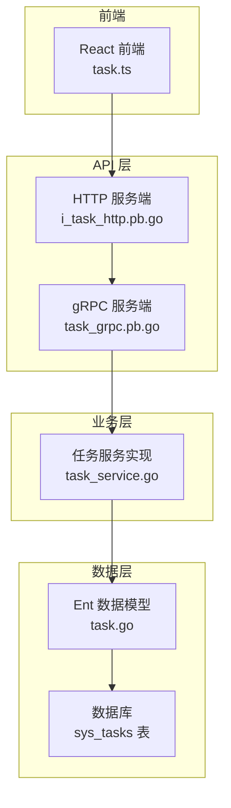
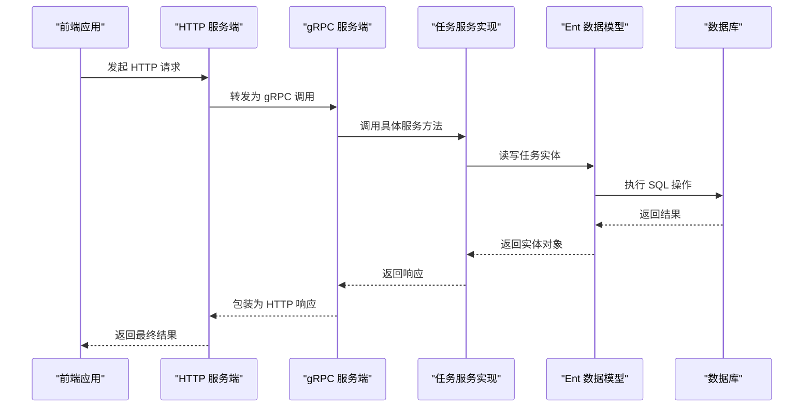
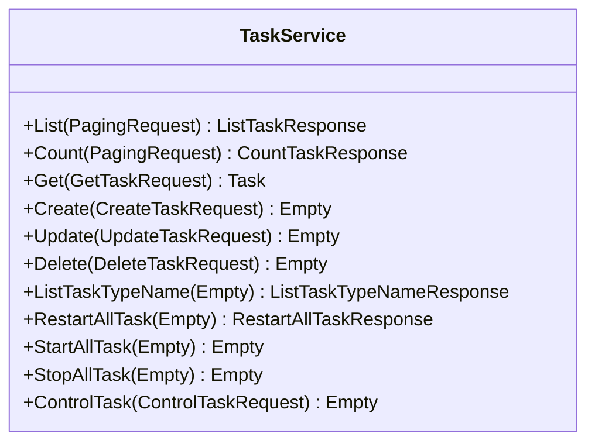
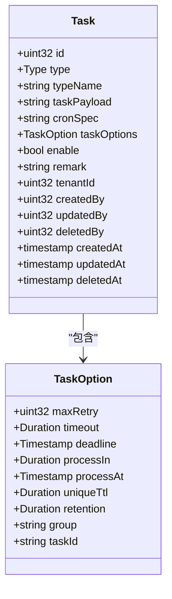
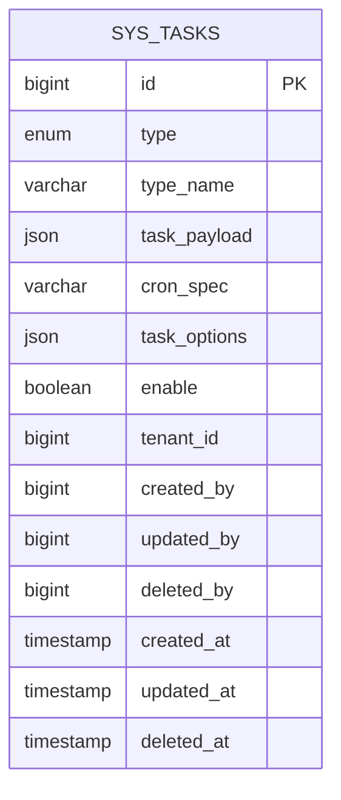
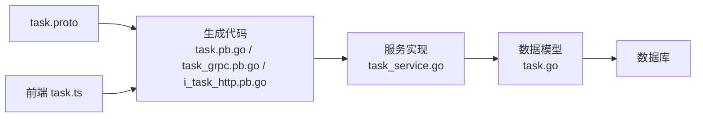

# 任务管理 API

<cite>
**本文引用的文件**
- [task.proto](file://backend/api/protos/task/service/v1/task.proto)
- [task_error.proto](file://backend/api/protos/task/service/v1/task_error.proto)
- [task.pb.go](file://backend/api/gen/go/task/service/v1/task.pb.go)
- [task_grpc.pb.go](file://backend/api/gen/go/task/service/v1/task_grpc.pb.go)
- [i_task_http.pb.go](file://backend/api/gen/go/admin/service/v1/i_task_http.pb.go)
- [task.go](file://backend/app/admin/service/internal/data/ent/schema/task.go)
- [task_service.go](file://backend/app/admin/service/internal/service/task_service.go)
- [task.ts](file://frontend/admin/react/src/api/service/task.ts)
</cite>

## 目录
1. [简介](#简介)
2. [项目结构](#项目结构)
3. [核心组件](#核心组件)
4. [架构概览](#架构概览)
5. [详细组件分析](#详细组件分析)
6. [依赖分析](#依赖分析)
7. [性能考虑](#性能考虑)
8. [故障排查指南](#故障排查指南)
9. [结论](#结论)

## 简介
本文件为 GoWind Admin 的任务管理 API 文档，覆盖定时任务、异步任务及任务监控相关接口。内容包括任务创建、调度配置、执行状态跟踪与结果获取的完整流程；详细说明任务队列管理、优先级设置与任务重试机制；提供任务暂停、恢复、取消与批量操作的 API 示例；解释任务依赖关系、并发控制与资源限制策略；并包含任务统计、性能监控与故障排查接口。

## 项目结构
任务管理模块由以下关键部分组成：
- 协议定义：使用 Protocol Buffers 定义任务服务接口与消息格式
- 生成代码：gRPC/HTTP 服务端与客户端代码
- 数据模型：基于 Ent 的任务实体定义与数据库索引
- 前端封装：React 前端对任务服务的调用封装
- 服务实现：后端服务逻辑（接口定义与实现分离）

**图表来源**
- [task_grpc.pb.go:23-35](file://backend/api/gen/go/task/service/v1/task_grpc.pb.go#L23-L35)
- [i_task_http.pb.go:59-72](file://backend/api/gen/go/admin/service/v1/i_task_http.pb.go#L59-L72)
- [task_service.go](file://backend/app/admin/service/internal/service/task_service.go)
- [task.go:16-115](file://backend/app/admin/service/internal/data/ent/schema/task.go#L16-L115)

**章节来源**
- [task.proto:17-50](file://backend/api/protos/task/service/v1/task.proto#L17-L50)
- [task_grpc.pb.go:23-35](file://backend/api/gen/go/task/service/v1/task_grpc.pb.go#L23-L35)
- [i_task_http.pb.go:59-72](file://backend/api/gen/go/admin/service/v1/i_task_http.pb.go#L59-L72)
- [task.go:16-115](file://backend/app/admin/service/internal/data/ent/schema/task.go#L16-L115)

## 核心组件
- 任务服务接口：提供任务的增删改查、批量启停控、类型名枚举与统计功能
- 任务消息模型：包含任务类型、执行类型名、负载数据、cron 表达式、任务选项等
- 任务选项：支持最大重试次数、超时时间、截止时间、延迟处理、唯一锁定、结果保留、分组与任务 ID
- 错误码体系：统一的任务系统错误码定义，便于前后端一致化处理

**章节来源**
- [task.proto:17-50](file://backend/api/protos/task/service/v1/task.proto#L17-L50)
- [task.proto:52-125](file://backend/api/protos/task/service/v1/task.proto#L52-L125)
- [task_error.proto:8-145](file://backend/api/protos/task/service/v1/task_error.proto#L8-L145)

## 架构概览
任务管理采用 gRPC + HTTP 的双栈设计，通过 OpenAPI 注解生成 HTTP 接口，同时保持 gRPC 的高性能特性。服务端通过 Ent 访问数据库，前端通过 React 封装的客户端进行调用。

**图表来源**
- [i_task_http.pb.go:74-91](file://backend/api/gen/go/admin/service/v1/i_task_http.pb.go#L74-L91)
- [task_grpc.pb.go:277-293](file://backend/api/gen/go/task/service/v1/task_grpc.pb.go#L277-L293)
- [task_service.go](file://backend/app/admin/service/internal/service/task_service.go)

## 详细组件分析

### 任务服务接口定义
- 列表查询：支持分页请求，返回任务列表与总数
- 数量统计：根据分页请求统计任务数量
- 获取详情：支持按 ID 或类型名查询，支持字段过滤
- 创建任务：提交任务定义
- 更新任务：支持字段选择性更新
- 删除任务：按 ID 删除
- 类型名枚举：列出所有已存在的任务类型名
- 全局启停控：支持启动、停止、重启全部任务
- 单任务控制：按类型名启动、停止、重启指定任务

**图表来源**
- [task.proto:17-50](file://backend/api/protos/task/service/v1/task.proto#L17-L50)

**章节来源**
- [task.proto:17-50](file://backend/api/protos/task/service/v1/task.proto#L17-L50)

### 任务消息模型与选项
- 任务类型：周期性、延时、等待结果
- 任务选项：重试、超时、截止、延迟、唯一锁定、结果保留、分组、任务 ID
- 任务实体：包含类型、类型名、负载、cron 表达式、启用状态、备注、租户与操作者信息、时间戳等

**图表来源**
- [task.proto:127-208](file://backend/api/protos/task/service/v1/task.proto#L127-L208)
- [task.proto:52-125](file://backend/api/protos/task/service/v1/task.proto#L52-L125)

**章节来源**
- [task.proto:127-208](file://backend/api/protos/task/service/v1/task.proto#L127-L208)
- [task.proto:52-125](file://backend/api/protos/task/service/v1/task.proto#L52-L125)

### 数据库模型与索引
- 实体表：sys_tasks
- 字段：类型、类型名、任务负载(JSON)、cron 表达式、任务选项(JSON)、启用状态
- 索引：按租户+类型名唯一、租户+类型、租户+启用+创建时间、租户+创建者+创建时间、租户+创建时间

**图表来源**
- [task.go:16-115](file://backend/app/admin/service/internal/data/ent/schema/task.go#L16-L115)

**章节来源**
- [task.go:16-115](file://backend/app/admin/service/internal/data/ent/schema/task.go#L16-L115)

### 前端调用封装
- 提供任务服务客户端的单例封装
- 支持列表、详情、创建、更新、删除等常用操作
- 使用分页查询参数进行列表查询

**章节来源**
- [task.ts:12-38](file://frontend/admin/react/src/api/service/task.ts#L12-L38)

### HTTP 与 gRPC 映射
- HTTP 路由映射：REST 风格路径与 gRPC 方法一一对应
- 中间件：HTTP 层注入中间件处理鉴权、日志等
- gRPC 方法：每个 HTTP 路由对应一个 gRPC 方法描述

**章节来源**
- [i_task_http.pb.go:59-72](file://backend/api/gen/go/admin/service/v1/i_task_http.pb.go#L59-L72)
- [task_grpc.pb.go:23-35](file://backend/api/gen/go/task/service/v1/task_grpc.pb.go#L23-L35)

## 依赖分析
- 协议依赖：task.proto 依赖分页、时间戳、持续时间、字段掩码等通用定义
- 生成代码依赖：gRPC/HTTP 服务端与客户端代码依赖于 task.proto 生成
- 业务依赖：服务实现依赖 Ent 数据模型与数据库
- 前端依赖：React 前端依赖生成的 TypeScript 客户端

**图表来源**
- [task.proto:1-15](file://backend/api/protos/task/service/v1/task.proto#L1-L15)
- [task_grpc.pb.go:9-16](file://backend/api/gen/go/task/service/v1/task_grpc.pb.go#L9-L16)
- [i_task_http.pb.go:59-72](file://backend/api/gen/go/admin/service/v1/i_task_http.pb.go#L59-L72)
- [task.go:3-14](file://backend/app/admin/service/internal/data/ent/schema/task.go#L3-L14)

**章节来源**
- [task.proto:1-15](file://backend/api/protos/task/service/v1/task.proto#L1-L15)
- [task_grpc.pb.go:9-16](file://backend/api/gen/go/task/service/v1/task_grpc.pb.go#L9-L16)
- [i_task_http.pb.go:59-72](file://backend/api/gen/go/admin/service/v1/i_task_http.pb.go#L59-L72)
- [task.go:3-14](file://backend/app/admin/service/internal/data/ent/schema/task.go#L3-L14)

## 性能考虑
- 索引优化：针对租户维度的关键查询建立复合索引，提升分页与过滤性能
- JSON 字段：任务负载与选项使用 JSON/JSONB 存储，便于灵活扩展但需注意查询限制
- 并发控制：通过任务唯一锁定与唯一 TTL 控制重复执行
- 超时与重试：合理设置任务超时与最大重试次数，避免资源耗尽
- 批量操作：提供全量启停控接口，减少频繁小操作带来的开销

## 故障排查指南
- 错误码对照：参考任务系统错误码定义，快速定位问题类型
- 日志追踪：结合 gRPC/HTTP 中间件日志，定位请求处理链路
- 数据一致性：检查数据库索引与唯一约束，确保类型名在租户内唯一
- 超时与重试：确认任务超时与重试配置是否合理，避免无限重试或过早放弃

**章节来源**
- [task_error.proto:8-145](file://backend/api/protos/task/service/v1/task_error.proto#L8-L145)

## 结论
GoWind Admin 的任务管理 API 通过清晰的协议定义、完善的生成代码与数据模型，提供了从创建到监控的全生命周期任务管理能力。配合前端封装与双栈接口，既保证了易用性也兼顾了性能与可维护性。建议在生产环境中结合索引策略、超时与重试配置以及监控告警，确保任务系统的稳定运行。