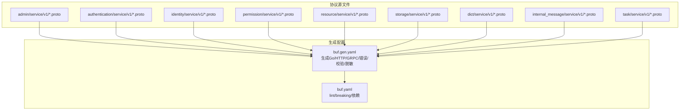
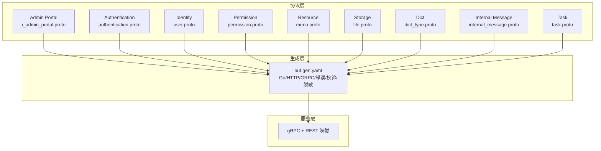
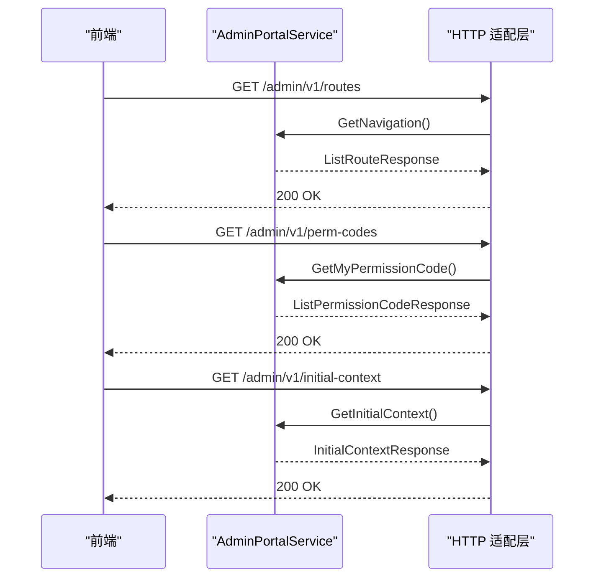
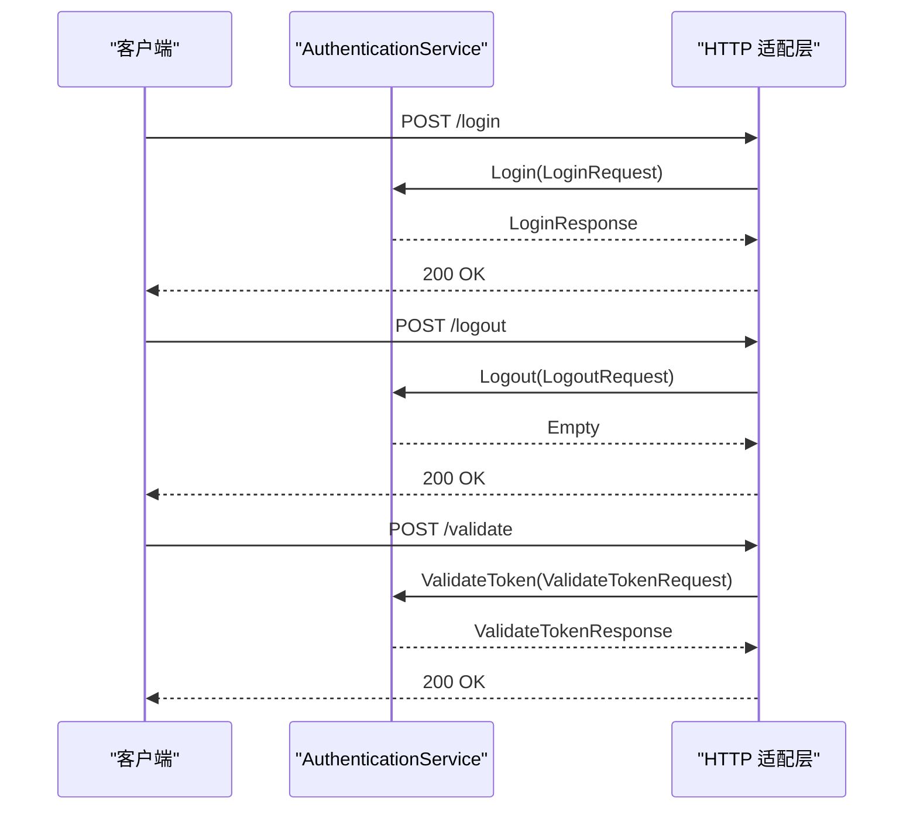
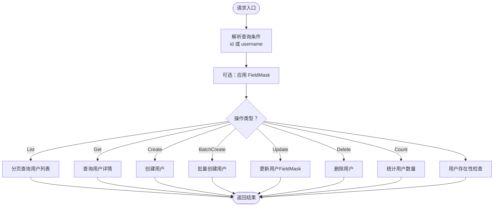
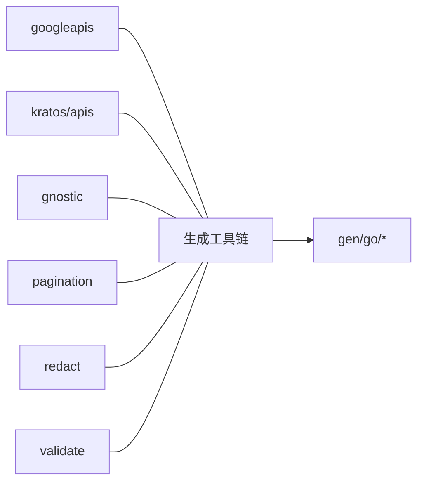

# 协议定义与规范

<cite>
**本文引用的文件**
- [backend/api/buf.yaml](file://backend/api/buf.yaml)
- [backend/api/buf.gen.yaml](file://backend/api/buf.gen.yaml)
- [backend/api/protos/admin/service/v1/i_admin_portal.proto](file://backend/api/protos/admin/service/v1/i_admin_portal.proto)
- [backend/api/protos/authentication/service/v1/authentication.proto](file://backend/api/protos/authentication/service/v1/authentication.proto)
- [backend/api/protos/identity/service/v1/user.proto](file://backend/api/protos/identity/service/v1/user.proto)
- [backend/api/protos/permission/service/v1/permission.proto](file://backend/api/protos/permission/service/v1/permission.proto)
- [backend/api/protos/resource/service/v1/menu.proto](file://backend/api/protos/resource/service/v1/menu.proto)
- [backend/api/protos/storage/service/v1/file.proto](file://backend/api/protos/storage/service/v1/file.proto)
- [backend/api/protos/dict/service/v1/dict_type.proto](file://backend/api/protos/dict/service/v1/dict_type.proto)
- [backend/api/protos/internal_message/service/v1/internal_message.proto](file://backend/api/protos/internal_message/service/v1/internal_message.proto)
- [backend/api/protos/task/service/v1/task.proto](file://backend/api/protos/task/service/v1/task.proto)
</cite>

## 目录
1. [引言](#引言)
2. [项目结构](#项目结构)
3. [核心组件](#核心组件)
4. [架构总览](#架构总览)
5. [详细组件分析](#详细组件分析)
6. [依赖分析](#依赖分析)
7. [性能考量](#性能考量)
8. [故障排查指南](#故障排查指南)
9. [结论](#结论)
10. [附录](#附录)

## 引言
本文件面向 GoWind Admin 项目的 Protobuf 协议设计与实现，系统性阐述消息模型、服务接口、字段约束与数据类型规范，明确版本管理策略、命名约定与模块化组织结构，并给出协议编译配置、代码生成规则与跨语言兼容性考虑。同时总结协议演进的最佳实践，包括向后兼容性保障与废弃字段处理策略，并结合仓库中的具体 Protobuf 文件与生成的 Go 代码结构，帮助开发者高效协作与维护。

## 项目结构
- 协议源文件集中于 backend/api/protos 下，按业务域划分目录，每个域包含若干 service/v1 子目录，对应 v1 版本的服务与消息定义。
- 编译与生成配置位于 backend/api/buf.gen.yaml，统一管理生成目标、插件与 go_package 前缀及按目录覆盖。
- 版本与风格检查配置位于 backend/api/buf.yaml，采用标准 lint 与 breaking 规则，确保演进一致性。

图表来源
- [backend/api/buf.gen.yaml:1-96](file://backend/api/buf.gen.yaml#L1-L96)
- [backend/api/buf.yaml:1-26](file://backend/api/buf.yaml#L1-L26)

章节来源
- [backend/api/buf.yaml:1-26](file://backend/api/buf.yaml#L1-L26)
- [backend/api/buf.gen.yaml:1-96](file://backend/api/buf.gen.yaml#L1-L96)

## 核心组件
- 服务接口与消息模型：各业务域均采用 service/v1 的版本化命名，服务方法遵循 CRUD 语义，配合分页请求与字段掩码，确保灵活查询与最小化传输。
- 字段约束与 OpenAPI 注解：广泛使用 gnostic/openapi/v3/annotations 与 google/api/field_behavior，对字段行为、JSON 名称与 OpenAPI 属性进行显式标注，提升跨语言互操作性与文档质量。
- 生成工具链：通过本地 protoc-gen-* 插件生成 Go 代码、gRPC 服务桩、REST 映射、Kratos 错误与校验/脱敏代码，统一输出至 gen/go 并按目录覆盖 go_package。

章节来源
- [backend/api/protos/admin/service/v1/i_admin_portal.proto:1-48](file://backend/api/protos/admin/service/v1/i_admin_portal.proto#L1-L48)
- [backend/api/protos/authentication/service/v1/authentication.proto:1-551](file://backend/api/protos/authentication/service/v1/authentication.proto#L1-L551)
- [backend/api/protos/identity/service/v1/user.proto:1-450](file://backend/api/protos/identity/service/v1/user.proto#L1-L450)
- [backend/api/protos/permission/service/v1/permission.proto:1-172](file://backend/api/protos/permission/service/v1/permission.proto#L1-L172)
- [backend/api/protos/resource/service/v1/menu.proto:1-435](file://backend/api/protos/resource/service/v1/menu.proto#L1-L435)
- [backend/api/protos/storage/service/v1/file.proto:1-208](file://backend/api/protos/storage/service/v1/file.proto#L1-L208)
- [backend/api/protos/dict/service/v1/dict_type.proto:1-135](file://backend/api/protos/dict/service/v1/dict_type.proto#L1-L135)
- [backend/api/protos/internal_message/service/v1/internal_message.proto:1-241](file://backend/api/protos/internal_message/service/v1/internal_message.proto#L1-L241)
- [backend/api/protos/task/service/v1/task.proto:1-315](file://backend/api/protos/task/service/v1/task.proto#L1-L315)

## 架构总览
- 协议层：按模块化组织，每个模块独立定义 service/v1，避免耦合。
- 生成层：统一通过 buf.gen.yaml 配置生成 Go 代码与相关桩代码，按目录覆盖 go_package，确保包导入路径清晰。
- 服务层：服务方法通过 google.api.http 注解映射 REST，结合 gRPC 提供高性能 RPC。

图表来源
- [backend/api/buf.gen.yaml:56-96](file://backend/api/buf.gen.yaml#L56-L96)
- [backend/api/protos/admin/service/v1/i_admin_portal.proto:1-48](file://backend/api/protos/admin/service/v1/i_admin_portal.proto#L1-L48)
- [backend/api/protos/authentication/service/v1/authentication.proto:1-551](file://backend/api/protos/authentication/service/v1/authentication.proto#L1-L551)
- [backend/api/protos/identity/service/v1/user.proto:1-450](file://backend/api/protos/identity/service/v1/user.proto#L1-L450)
- [backend/api/protos/permission/service/v1/permission.proto:1-172](file://backend/api/protos/permission/service/v1/permission.proto#L1-L172)
- [backend/api/protos/resource/service/v1/menu.proto:1-435](file://backend/api/protos/resource/service/v1/menu.proto#L1-L435)
- [backend/api/protos/storage/service/v1/file.proto:1-208](file://backend/api/protos/storage/service/v1/file.proto#L1-L208)
- [backend/api/protos/dict/service/v1/dict_type.proto:1-135](file://backend/api/protos/dict/service/v1/dict_type.proto#L1-L135)
- [backend/api/protos/internal_message/service/v1/internal_message.proto:1-241](file://backend/api/protos/internal_message/service/v1/internal_message.proto#L1-L241)
- [backend/api/protos/task/service/v1/task.proto:1-315](file://backend/api/protos/task/service/v1/task.proto#L1-L315)

## 详细组件分析

### Admin Portal 服务（后台门户）
- 服务职责：提供前端初始化所需的导航、权限码与上下文信息。
- 关键接口：GetNavigation、GetMyPermissionCode、GetInitialContext。
- 输出消息：ListRouteResponse、ListPermissionCodeResponse、InitialContextResponse。
- REST 映射：通过 google.api.http 注解将 RPC 映射到 /admin/v1/* 路径。

图表来源
- [backend/api/protos/admin/service/v1/i_admin_portal.proto:11-32](file://backend/api/protos/admin/service/v1/i_admin_portal.proto#L11-L32)

章节来源
- [backend/api/protos/admin/service/v1/i_admin_portal.proto:1-48](file://backend/api/protos/admin/service/v1/i_admin_portal.proto#L1-L48)

### Authentication 服务（认证）
- 服务职责：登录、登出、注册、令牌刷新、验证、令牌列表、撤销、拉黑/解封、验证码生成与校验。
- 关键枚举：GrantType、TokenType、ClientType、TokenCategory。
- 请求/响应：LoginRequest/LoginResponse、ValidateTokenRequest/ValidateTokenResponse、RegisterUserRequest/RegisterUserResponse、GetAccessTokensRequest/GetAccessTokensResponse、BlockTokenRequest/BlockTokenResponse、RevokeTokenByIdRequest 等。
- 安全与隐私：使用 redact 注解对敏感字段进行脱敏标记；支持跳过 Redis 校验与黑名单校验的开关。

图表来源
- [backend/api/protos/authentication/service/v1/authentication.proto:21-60](file://backend/api/protos/authentication/service/v1/authentication.proto#L21-L60)

章节来源
- [backend/api/protos/authentication/service/v1/authentication.proto:1-551](file://backend/api/protos/authentication/service/v1/authentication.proto#L1-L551)

### Identity 服务（身份）
- 服务职责：用户列表、统计、详情、创建、批量创建、更新、删除、存在性检查。
- 关键模型：User（含性别、状态、组织/职位/角色关联、时间戳与审计字段）、UserExistsRequest/UserExistsResponse。
- 字段掩码：支持 FieldMask 控制返回字段，减少冗余数据。

图表来源
- [backend/api/protos/identity/service/v1/user.proto:15-38](file://backend/api/protos/identity/service/v1/user.proto#L15-L38)

章节来源
- [backend/api/protos/identity/service/v1/user.proto:1-450](file://backend/api/protos/identity/service/v1/user.proto#L1-L450)

### Permission 服务（权限）
- 服务职责：权限点的增删改查与同步。
- 关键模型：Permission（含状态、分组、菜单/接口关联、审计字段）。
- 字段掩码：GetPermissionRequest 支持 view_mask 控制返回字段。

章节来源
- [backend/api/protos/permission/service/v1/permission.proto:1-172](file://backend/api/protos/permission/service/v1/permission.proto#L1-L172)

### Resource/Menu 服务（资源与菜单）
- 服务职责：菜单的增删改查与统计。
- 关键模型：Menu（含类型、状态、路由元信息 Meta、父子关系）、MenuRouteItem（轻量路由项）。
- 路由元信息：支持图标、标签页、面包屑、权限、KeepAlive 等前端渲染相关属性。

章节来源
- [backend/api/protos/resource/service/v1/menu.proto:1-435](file://backend/api/protos/resource/service/v1/menu.proto#L1-L435)

### Storage/File 服务（存储）
- 服务职责：文件的增删改查与统计。
- 关键模型：File（含 OSS 供应商、桶名、目录、GUID、原始名、扩展名、大小、链接、内容哈希、租户与审计字段）。
- 枚举：OSSProvider 支持多家云厂商与本地存储。

章节来源
- [backend/api/protos/storage/service/v1/file.proto:1-208](file://backend/api/protos/storage/service/v1/file.proto#L1-L208)

### Dict/DictType 服务（数据字典）
- 服务职责：字典类型的增删改查与统计。
- 关键模型：DictType（含类型编码/名称、启用状态、排序、租户与审计字段）。

章节来源
- [backend/api/protos/dict/service/v1/dict_type.proto:1-135](file://backend/api/protos/dict/service/v1/dict_type.proto#L1-L135)

### Internal Message 服务（站内信）
- 服务职责：消息的增删改查、发送与撤销。
- 关键模型：InternalMessage（含状态、类型、发送者、分类、租户与审计字段）。
- 发送流程：SendMessageRequest/Response，支持定向发送与全员发送。

章节来源
- [backend/api/protos/internal_message/service/v1/internal_message.proto:1-241](file://backend/api/protos/internal_message/service/v1/internal_message.proto#L1-L241)

### Task 服务（调度任务）
- 服务职责：任务的增删改查、类型名列表、全量启停与控制。
- 关键模型：Task（含类型、类型名、负载、cron 表达式、选项 TaskOption、启用状态与审计字段）。
- 选项：TaskOption 支持重试、超时、截止时间、延迟、唯一锁、保留时长与分组等。

章节来源
- [backend/api/protos/task/service/v1/task.proto:1-315](file://backend/api/protos/task/service/v1/task.proto#L1-L315)

## 依赖分析
- 依赖模块：buf.yaml 中声明了 googleapis、kratos/apis、gnostic、pagination、menta2k-org/redact、envoyproxy/protoc-gen-validate 等依赖，确保标准注解与校验/脱敏能力可用。
- 生成插件：本地 protoc-gen-go、protoc-gen-go-grpc、protoc-gen-go-http、protoc-gen-go-errors、protoc-gen-validate、protoc-gen-redact。
- 包路径覆盖：按模块目录覆盖 go_package，统一前缀 go-wind-admin/api/gen/go，并为各域设置短包名（如 adminpb、authenticationpb 等）。

图表来源
- [backend/api/buf.yaml:11-18](file://backend/api/buf.yaml#L11-L18)
- [backend/api/buf.gen.yaml:56-96](file://backend/api/buf.gen.yaml#L56-L96)

章节来源
- [backend/api/buf.yaml:1-26](file://backend/api/buf.yaml#L1-L26)
- [backend/api/buf.gen.yaml:1-96](file://backend/api/buf.gen.yaml#L1-L96)

## 性能考量
- 字段掩码：通过 FieldMask 精准控制返回字段，降低序列化与网络传输开销。
- 分页请求：统一使用 pagination.PagingRequest，避免一次性返回大量数据。
- 轻量路由项：MenuRouteItem 仅包含前端渲染所需字段，减少冗余。
- 选项化字段：Many messages 使用 optional 字段，便于演进与兼容。

## 故障排查指南
- 字段行为与注解：若出现 JSON 名称不一致或 OpenAPI 文档异常，检查 gnostic/openapi/v3/annotations 与 google/api/field_behavior 的标注。
- 脱敏与隐私：敏感字段使用 redact 注解，若日志或导出出现明文，请确认脱敏插件已启用且生效。
- 校验与错误：使用 protoc-gen-validate 生成的校验代码，若请求校验失败，检查 validate 注解与字段约束。
- 生成路径：若 Go 包导入路径异常，检查 buf.gen.yaml 的 go_package_prefix 与按目录覆盖配置。

章节来源
- [backend/api/protos/identity/service/v1/user.proto:7-12](file://backend/api/protos/identity/service/v1/user.proto#L7-L12)
- [backend/api/protos/authentication/service/v1/authentication.proto:14-18](file://backend/api/protos/authentication/service/v1/authentication.proto#L14-L18)
- [backend/api/buf.gen.yaml:17-55](file://backend/api/buf.gen.yaml#L17-L55)

## 结论
本项目采用模块化的 Protobuf 设计，结合统一的生成配置与严格的字段标注，实现了高内聚、低耦合的协议体系。通过 REST+gRPC 的双栈映射与完善的校验/脱敏机制，既满足前端与移动端的跨语言需求，又保障了服务间的稳定演进与安全性。建议在后续迭代中持续遵循现有命名与版本策略，谨慎处理字段变更与弃用流程，确保向后兼容性。

## 附录

### 版本管理策略
- 版本号：服务定义置于 service/v1 目录，v1 为当前稳定版本。
- 演进原则：新增字段使用 optional，避免破坏已有序列化；禁止删除/重排已存在字段；必要时引入新版本目录（如 service/v2）。
- 兼容性：通过 google.api.http 与 gRPC 的向后兼容特性，确保接口稳定。

章节来源
- [backend/api/buf.yaml:1-26](file://backend/api/buf.yaml#L1-L26)

### 命名约定
- 包名：package 采用小写域名反写加业务域与版本，如 admin.service.v1。
- 服务名：Service 名以 Service 结尾，如 AdminPortalService、AuthenticationService。
- 消息名：采用名词短语，首字母大写，如 ListUserResponse、MenuRouteItem。
- 字段名：采用驼峰命名，尽量语义明确，配合 json_name 保持 JSON 一致性。

章节来源
- [backend/api/protos/admin/service/v1/i_admin_portal.proto:3-4](file://backend/api/protos/admin/service/v1/i_admin_portal.proto#L3-L4)
- [backend/api/protos/authentication/service/v1/authentication.proto:3-4](file://backend/api/protos/authentication/service/v1/authentication.proto#L3-L4)

### 模块化组织结构
- 按业务域划分：admin、authentication、identity、permission、resource、storage、dict、internal_message、task。
- 每个域下 service/v1 对应版本化服务与消息，便于独立演进与测试。

章节来源
- [backend/api/protos/admin/service/v1/i_admin_portal.proto:1-48](file://backend/api/protos/admin/service/v1/i_admin_portal.proto#L1-L48)
- [backend/api/protos/authentication/service/v1/authentication.proto:1-551](file://backend/api/protos/authentication/service/v1/authentication.proto#L1-L551)
- [backend/api/protos/identity/service/v1/user.proto:1-450](file://backend/api/protos/identity/service/v1/user.proto#L1-L450)
- [backend/api/protos/permission/service/v1/permission.proto:1-172](file://backend/api/protos/permission/service/v1/permission.proto#L1-L172)
- [backend/api/protos/resource/service/v1/menu.proto:1-435](file://backend/api/protos/resource/service/v1/menu.proto#L1-L435)
- [backend/api/protos/storage/service/v1/file.proto:1-208](file://backend/api/protos/storage/service/v1/file.proto#L1-L208)
- [backend/api/protos/dict/service/v1/dict_type.proto:1-135](file://backend/api/protos/dict/service/v1/dict_type.proto#L1-L135)
- [backend/api/protos/internal_message/service/v1/internal_message.proto:1-241](file://backend/api/protos/internal_message/service/v1/internal_message.proto#L1-L241)
- [backend/api/protos/task/service/v1/task.proto:1-315](file://backend/api/protos/task/service/v1/task.proto#L1-L315)

### 协议编译配置与代码生成
- 生成目标：gen/go，相对路径输出。
- 插件清单：protoc-gen-go、protoc-gen-go-grpc、protoc-gen-go-http、protoc-gen-go-errors、protoc-gen-validate、protoc-gen-redact。
- 包路径覆盖：按模块目录覆盖 go_package，统一前缀与短包名，便于 Go 导入与模块化管理。

章节来源
- [backend/api/buf.gen.yaml:17-55](file://backend/api/buf.gen.yaml#L17-L55)
- [backend/api/buf.gen.yaml:56-96](file://backend/api/buf.gen.yaml#L56-L96)

### 跨语言兼容性考虑
- JSON 映射：通过 json_name 与 google.api.http 注解，确保 REST 与 JSON 交互一致。
- 字段行为：使用 google.api.field_behavior 标注 REQUIRED/OPTIONAL，提升跨语言工具链的准确性。
- OpenAPI 注解：gnostic/openapi/v3/annotations 提升文档质量与 SDK 生成体验。

章节来源
- [backend/api/protos/authentication/service/v1/authentication.proto:5-12](file://backend/api/protos/authentication/service/v1/authentication.proto#L5-L12)
- [backend/api/protos/identity/service/v1/user.proto:5-12](file://backend/api/protos/identity/service/v1/user.proto#L5-L12)
- [backend/api/protos/resource/service/v1/menu.proto:5-13](file://backend/api/protos/resource/service/v1/menu.proto#L5-L13)

### 协议演进最佳实践
- 向后兼容：新增字段使用 optional；避免删除/重排既有字段；必要时引入新版本目录。
- 字段弃用：通过注释与文档明确弃用计划，逐步迁移；避免在同一版本内删除字段。
- 校验与脱敏：对敏感字段启用 redact；对输入启用 validate；确保生成代码正确集成。
- 文档与测试：结合 OpenAPI 注解与 REST 映射，完善接口文档与自动化测试。

章节来源
- [backend/api/buf.yaml:8-11](file://backend/api/buf.yaml#L8-L11)
- [backend/api/buf.gen.yaml:84-96](file://backend/api/buf.gen.yaml#L84-L96)