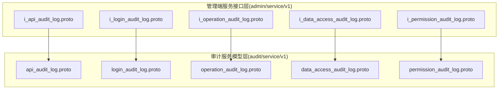
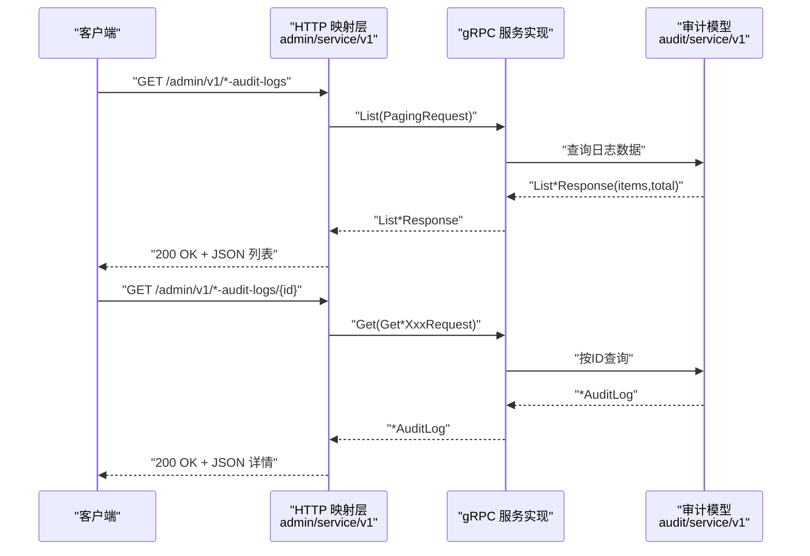
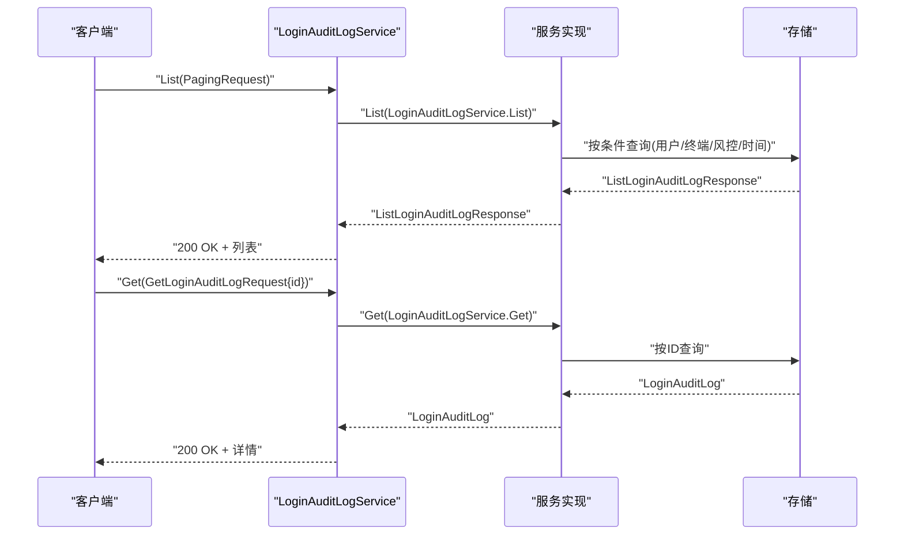
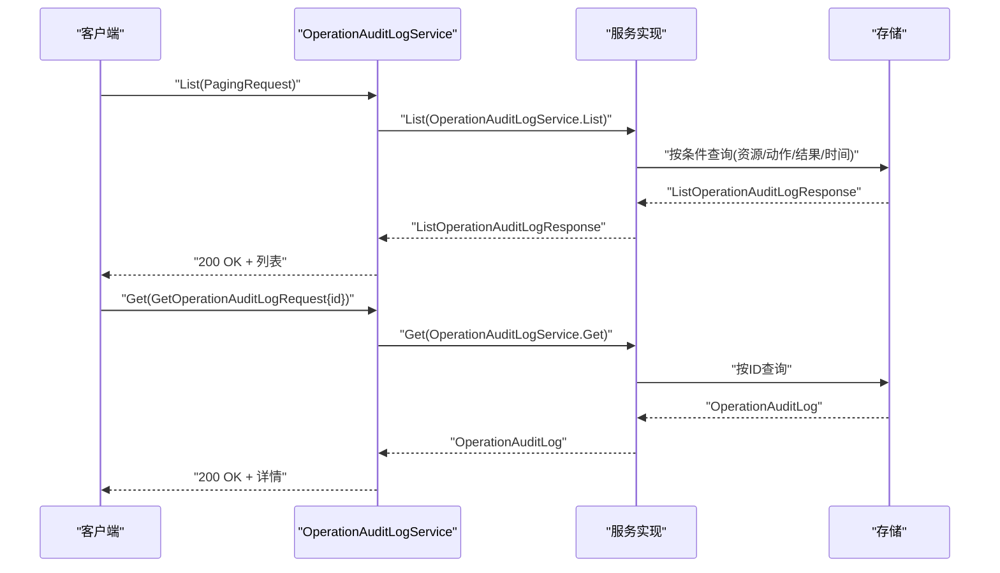
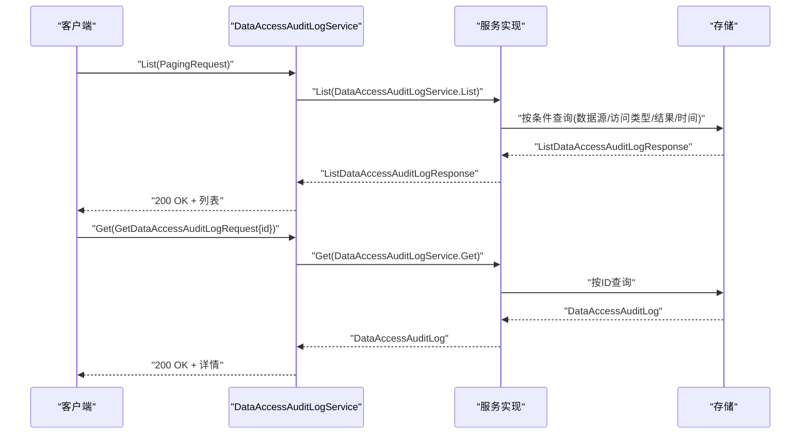
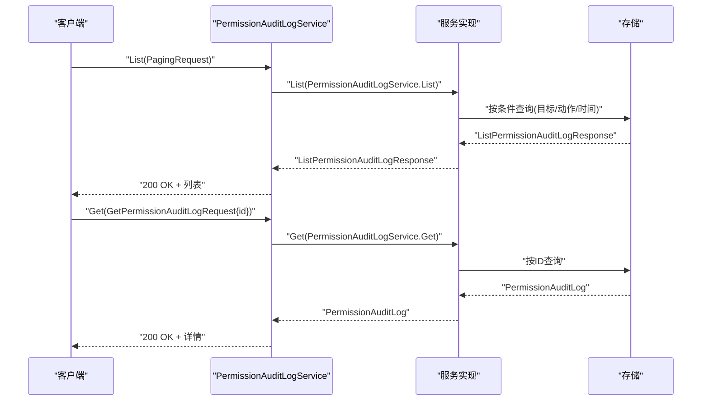
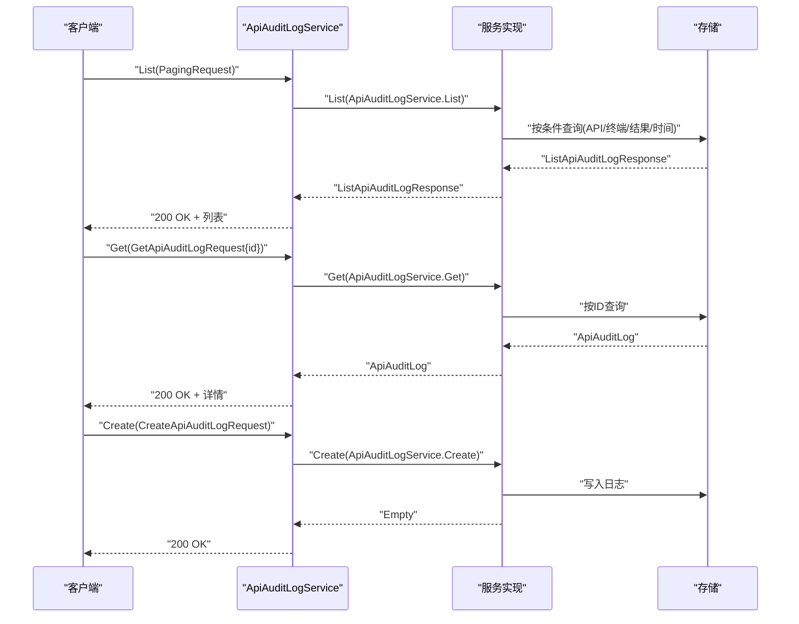
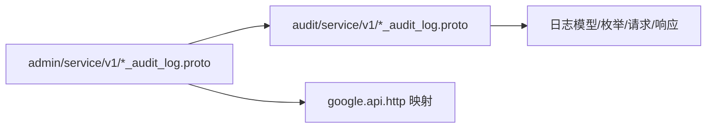

# 审计日志 API

<cite>
**本文引用的文件**
- [i_api_audit_log.proto](file://backend/api/protos/admin/service/v1/i_api_audit_log.proto)
- [api_audit_log.proto](file://backend/api/protos/audit/service/v1/api_audit_log.proto)
- [i_login_audit_log.proto](file://backend/api/protos/admin/service/v1/i_login_audit_log.proto)
- [login_audit_log.proto](file://backend/api/protos/audit/service/v1/login_audit_log.proto)
- [i_operation_audit_log.proto](file://backend/api/protos/admin/service/v1/i_operation_audit_log.proto)
- [operation_audit_log.proto](file://backend/api/protos/audit/service/v1/operation_audit_log.proto)
- [i_data_access_audit_log.proto](file://backend/api/protos/admin/service/v1/i_data_access_audit_log.proto)
- [data_access_audit_log.proto](file://backend/api/protos/audit/service/v1/data_access_audit_log.proto)
- [i_permission_audit_log.proto](file://backend/api/protos/admin/service/v1/i_permission_audit_log.proto)
- [permission_audit_log.proto](file://backend/api/protos/audit/service/v1/permission_audit_log.proto)
</cite>

## 目录
1. [简介](#简介)
2. [项目结构](#项目结构)
3. [核心组件](#核心组件)
4. [架构总览](#架构总览)
5. [详细组件分析](#详细组件分析)
6. [依赖关系分析](#依赖关系分析)
7. [性能考量](#性能考量)
8. [故障排查指南](#故障排查指南)
9. [结论](#结论)
10. [附录](#附录)

## 简介
本文件面向 GoWind Admin 的审计日志能力，系统性梳理并规范以下日志类型的 API：登录日志、操作日志、数据访问日志、权限变更日志与 API 调用日志。文档覆盖：
- 查询、过滤与导出能力
- 清理与归档策略建议
- 日志级别配置、敏感信息脱敏与隐私保护机制
- 实时订阅、日志聚合分析与异常告警的 API 示例思路
- 存储优化、查询性能与大数据量处理方案

## 项目结构
审计日志相关接口由两层协议文件构成：
- 管理端服务接口层（admin/service/v1）：定义 HTTP 映射与管理端可用的 RPC 方法
- 审计服务模型层（audit/service/v1）：定义各审计日志的数据模型、枚举与请求/响应消息

图表来源
- [i_api_audit_log.proto:11-26](file://backend/api/protos/admin/service/v1/i_api_audit_log.proto#L11-L26)
- [api_audit_log.proto:18-28](file://backend/api/protos/audit/service/v1/api_audit_log.proto#L18-L28)
- [i_login_audit_log.proto:12-27](file://backend/api/protos/admin/service/v1/i_login_audit_log.proto#L12-L27)
- [login_audit_log.proto:16-26](file://backend/api/protos/audit/service/v1/login_audit_log.proto#L16-L26)
- [i_operation_audit_log.proto:11-26](file://backend/api/protos/admin/service/v1/i_operation_audit_log.proto#L11-L26)
- [operation_audit_log.proto:16-26](file://backend/api/protos/audit/service/v1/operation_audit_log.proto#L16-L26)
- [i_data_access_audit_log.proto:11-26](file://backend/api/protos/admin/service/v1/i_data_access_audit_log.proto#L11-L26)
- [data_access_audit_log.proto:18-28](file://backend/api/protos/audit/service/v1/data_access_audit_log.proto#L18-L28)
- [i_permission_audit_log.proto:10-25](file://backend/api/protos/admin/service/v1/i_permission_audit_log.proto#L10-L25)
- [permission_audit_log.proto:14-24](file://backend/api/protos/audit/service/v1/permission_audit_log.proto#L14-L24)

章节来源
- [i_api_audit_log.proto:1-27](file://backend/api/protos/admin/service/v1/i_api_audit_log.proto#L1-L27)
- [i_login_audit_log.proto:1-28](file://backend/api/protos/admin/service/v1/i_login_audit_log.proto#L1-L28)
- [i_operation_audit_log.proto:1-27](file://backend/api/protos/admin/service/v1/i_operation_audit_log.proto#L1-L27)
- [i_data_access_audit_log.proto:1-27](file://backend/api/protos/admin/service/v1/i_data_access_audit_log.proto#L1-L27)
- [i_permission_audit_log.proto:1-26](file://backend/api/protos/admin/service/v1/i_permission_audit_log.proto#L1-L26)

## 核心组件
- 登录审计日志服务：提供登录/登出、会话过期、强制下线、密码重置后的登出等事件的查询与详情获取能力
- 操作审计日志服务：记录用户对资源的增删改查、分配/取消分配、导入/导出等动作
- 数据访问审计日志服务：记录对数据库/缓存/搜索引擎等数据源的访问与变更，支持 SQL/命令摘要与影响行数
- 权限变更审计日志服务：记录权限/角色的授予、回收、更新、重置、分配/取消分配、批量操作、到期/暂停/恢复、回滚等
- API 审计日志服务：记录 API 请求/响应的关键信息，包括耗时、状态码、请求头/体、响应等，并支持创建接口

章节来源
- [i_login_audit_log.proto:12-27](file://backend/api/protos/admin/service/v1/i_login_audit_log.proto#L12-L27)
- [login_audit_log.proto:16-190](file://backend/api/protos/audit/service/v1/login_audit_log.proto#L16-L190)
- [i_operation_audit_log.proto:11-26](file://backend/api/protos/admin/service/v1/i_operation_audit_log.proto#L11-L26)
- [operation_audit_log.proto:16-150](file://backend/api/protos/audit/service/v1/operation_audit_log.proto#L16-L150)
- [i_data_access_audit_log.proto:11-26](file://backend/api/protos/admin/service/v1/i_data_access_audit_log.proto#L11-L26)
- [data_access_audit_log.proto:18-195](file://backend/api/protos/audit/service/v1/data_access_audit_log.proto#L18-L195)
- [i_permission_audit_log.proto:10-25](file://backend/api/protos/admin/service/v1/i_permission_audit_log.proto#L10-L25)
- [permission_audit_log.proto:14-138](file://backend/api/protos/audit/service/v1/permission_audit_log.proto#L14-L138)
- [i_api_audit_log.proto:12-26](file://backend/api/protos/admin/service/v1/i_api_audit_log.proto#L12-L26)
- [api_audit_log.proto:18-185](file://backend/api/protos/audit/service/v1/api_audit_log.proto#L18-L185)

## 架构总览
审计日志 API 采用“管理端接口 + 审计模型”的分层设计，管理端通过 HTTP 映射到 gRPC 服务，审计模型统一定义各日志的数据结构与合规字段。

图表来源
- [i_api_audit_log.proto:14-25](file://backend/api/protos/admin/service/v1/i_api_audit_log.proto#L14-L25)
- [i_login_audit_log.proto:15-26](file://backend/api/protos/admin/service/v1/i_login_audit_log.proto#L15-L26)
- [i_operation_audit_log.proto:14-25](file://backend/api/protos/admin/service/v1/i_operation_audit_log.proto#L14-L25)
- [i_data_access_audit_log.proto:14-25](file://backend/api/protos/admin/service/v1/i_data_access_audit_log.proto#L14-L25)
- [i_permission_audit_log.proto:13-24](file://backend/api/protos/admin/service/v1/i_permission_audit_log.proto#L13-L24)

## 详细组件分析

### 登录审计日志 API
- 端点
  - GET /admin/v1/login-audit-logs
  - GET /admin/v1/login-audit-logs/{id}
- 支持字段与过滤
  - 用户维度：tenant_id、user_id、username
  - 终端维度：ip_address、session_id、device_info、geo_location
  - 行为维度：action_type（登录/登出/会话过期/强制下线/密码重置）、status（成功/失败/部分成功/锁定）、failure_reason、mfa_status、login_method
  - 风控维度：risk_score、risk_level、risk_factors
  - 合规字段：log_hash、signature、created_at
- 导出与订阅
  - 支持分页与排序；建议结合 created_at 范围进行增量导出
  - 实时订阅可基于 created_at 时间轮询或服务端推送（建议在服务端实现 SSE/长连接）

图表来源
- [i_login_audit_log.proto:14-26](file://backend/api/protos/admin/service/v1/i_login_audit_log.proto#L14-L26)
- [login_audit_log.proto:193-213](file://backend/api/protos/audit/service/v1/login_audit_log.proto#L193-L213)

章节来源
- [i_login_audit_log.proto:12-27](file://backend/api/protos/admin/service/v1/i_login_audit_log.proto#L12-L27)
- [login_audit_log.proto:28-190](file://backend/api/protos/audit/service/v1/login_audit_log.proto#L28-L190)

### 操作审计日志 API
- 端点
  - GET /admin/v1/operation-audit-logs
  - GET /admin/v1/operation-audit-logs/{id}
- 支持字段与过滤
  - 资源维度：resource_type、resource_id
  - 动作维度：action（创建/更新/删除/读取/分配/取消分配/导出/导入/其他）、success、failure_reason
  - 终端维度：ip_address、geo_location
  - 合规字段：log_hash、signature、created_at
- 导出与订阅
  - 建议按 action、resource_type、success 进行多维过滤
  - 订阅可基于 created_at 增量拉取

图表来源
- [i_operation_audit_log.proto:14-25](file://backend/api/protos/admin/service/v1/i_operation_audit_log.proto#L14-L25)
- [operation_audit_log.proto:153-173](file://backend/api/protos/audit/service/v1/operation_audit_log.proto#L153-L173)

章节来源
- [i_operation_audit_log.proto:11-26](file://backend/api/protos/admin/service/v1/i_operation_audit_log.proto#L11-L26)
- [operation_audit_log.proto:28-150](file://backend/api/protos/audit/service/v1/operation_audit_log.proto#L28-L150)

### 数据访问审计日志 API
- 端点
  - GET /admin/v1/data-access-audit-logs
  - GET /admin/v1/data-access-audit-logs/{id}
- 支持字段与过滤
  - 数据源维度：data_source（如 mysql/redis/mongodb/es）、table_name、data_id
  - 访问维度：access_type（SELECT/INSERT/UPDATE/DELETE/VIEW/BULK_READ/EXPORT/IMPORT/DDL_*等）、sql_digest/sql_text、affected_rows、latency_ms、success
  - 敏感度：sensitive_level、data_masked、masking_rules
  - 合规字段：log_hash、signature、created_at
- 导出与订阅
  - 建议按 data_source、access_type、success、latency_ms 过滤
  - 对大体量 SQL/命令文本，优先使用摘要与脱敏文本

图表来源
- [i_data_access_audit_log.proto:14-25](file://backend/api/protos/admin/service/v1/i_data_access_audit_log.proto#L14-L25)
- [data_access_audit_log.proto:198-218](file://backend/api/protos/audit/service/v1/data_access_audit_log.proto#L198-L218)

章节来源
- [i_data_access_audit_log.proto:11-26](file://backend/api/protos/admin/service/v1/i_data_access_audit_log.proto#L11-L26)
- [data_access_audit_log.proto:30-195](file://backend/api/protos/audit/service/v1/data_access_audit_log.proto#L30-L195)

### 权限变更审计日志 API
- 端点
  - GET /admin/v1/permission-audit-logs
  - GET /admin/v1/permission-audit-logs/{id}
- 支持字段与过滤
  - 目标维度：target_type、target_id、target_name
  - 变更维度：action（授予/回收/更新/重置/创建/删除/分配/取消分配/批量/到期/暂停/恢复/回滚/其他）、old_value、new_value
  - 合规字段：log_hash、signature、created_at
- 导出与订阅
  - 建议按 action、target_type、created_at 过滤
  - 订阅可基于 created_at 增量拉取

图表来源
- [i_permission_audit_log.proto:13-24](file://backend/api/protos/admin/service/v1/i_permission_audit_log.proto#L13-L24)
- [permission_audit_log.proto:141-161](file://backend/api/protos/audit/service/v1/permission_audit_log.proto#L141-L161)

章节来源
- [i_permission_audit_log.proto:10-25](file://backend/api/protos/admin/service/v1/i_permission_audit_log.proto#L10-L25)
- [permission_audit_log.proto:26-138](file://backend/api/protos/audit/service/v1/permission_audit_log.proto#L26-L138)

### API 审计日志 API
- 端点
  - GET /admin/v1/api-audit-logs
  - GET /admin/v1/api-audit-logs/{id}
  - POST /admin/v1/api-audit-logs（创建）
- 支持字段与过滤
  - 终端维度：ip_address、geo_location、device_info、referer、app_version
  - API 维度：http_method、path、request_uri、api_module、api_operation、api_description、request_id、trace_id、span_id、latency_ms、success、status_code、reason
  - 内容维度：request_header（脱敏后）、request_body（脱敏后）、response（脱敏后）
  - 合规字段：log_hash、signature、created_at
- 导出与订阅
  - 建议按 http_method、status_code、success、latency_ms、created_at 过滤
  - 订阅可基于 created_at 增量拉取

图表来源
- [i_api_audit_log.proto:14-26](file://backend/api/protos/admin/service/v1/i_api_audit_log.proto#L14-L26)
- [api_audit_log.proto:187-214](file://backend/api/protos/audit/service/v1/api_audit_log.proto#L187-L214)

章节来源
- [i_api_audit_log.proto:11-26](file://backend/api/protos/admin/service/v1/i_api_audit_log.proto#L11-L26)
- [api_audit_log.proto:30-185](file://backend/api/protos/audit/service/v1/api_audit_log.proto#L30-L185)

## 依赖关系分析
- 管理端接口层依赖审计模型层的消息定义
- 审计模型层统一了合规字段（log_hash、signature）与时间字段（created_at），便于跨日志类型的一致性处理
- HTTP 映射层通过 google.api.annotations 将 gRPC 映射为 REST 风格端点

图表来源
- [i_api_audit_log.proto:5-9](file://backend/api/protos/admin/service/v1/i_api_audit_log.proto#L5-L9)
- [api_audit_log.proto:5-16](file://backend/api/protos/audit/service/v1/api_audit_log.proto#L5-L16)
- [i_login_audit_log.proto:5-9](file://backend/api/protos/admin/service/v1/i_login_audit_log.proto#L5-L9)
- [login_audit_log.proto:5-14](file://backend/api/protos/audit/service/v1/login_audit_log.proto#L5-L14)
- [i_operation_audit_log.proto:5-9](file://backend/api/protos/admin/service/v1/i_operation_audit_log.proto#L5-L9)
- [operation_audit_log.proto:5-14](file://backend/api/protos/audit/service/v1/operation_audit_log.proto#L5-L14)
- [i_data_access_audit_log.proto:5-9](file://backend/api/protos/admin/service/v1/i_data_access_audit_log.proto#L5-L9)
- [data_access_audit_log.proto:5-15](file://backend/api/protos/audit/service/v1/data_access_audit_log.proto#L5-L15)
- [i_permission_audit_log.proto:5-7](file://backend/api/protos/admin/service/v1/i_permission_audit_log.proto#L5-L7)
- [permission_audit_log.proto:5-11](file://backend/api/protos/audit/service/v1/permission_audit_log.proto#L5-L11)

章节来源
- [i_api_audit_log.proto:1-27](file://backend/api/protos/admin/service/v1/i_api_audit_log.proto#L1-L27)
- [api_audit_log.proto:1-214](file://backend/api/protos/audit/service/v1/api_audit_log.proto#L1-L214)
- [i_login_audit_log.proto:1-28](file://backend/api/protos/admin/service/v1/i_login_audit_log.proto#L1-L28)
- [login_audit_log.proto:1-219](file://backend/api/protos/audit/service/v1/login_audit_log.proto#L1-L219)
- [i_operation_audit_log.proto:1-27](file://backend/api/protos/admin/service/v1/i_operation_audit_log.proto#L1-L27)
- [operation_audit_log.proto:1-179](file://backend/api/protos/audit/service/v1/operation_audit_log.proto#L1-L179)
- [i_data_access_audit_log.proto:1-27](file://backend/api/protos/admin/service/v1/i_data_access_audit_log.proto#L1-L27)
- [data_access_audit_log.proto:1-224](file://backend/api/protos/audit/service/v1/data_access_audit_log.proto#L1-L224)
- [i_permission_audit_log.proto:1-26](file://backend/api/protos/admin/service/v1/i_permission_audit_log.proto#L1-L26)
- [permission_audit_log.proto:1-167](file://backend/api/protos/audit/service/v1/permission_audit_log.proto#L1-L167)

## 性能考量
- 查询性能
  - 建议在常用过滤字段（如 user_id、tenant_id、created_at、status_code、success、risk_level、access_type）上建立复合索引
  - 使用分页与范围查询（created_at 起止时间）避免全表扫描
  - 对高频查询字段（如 path、api_module、username、ip_address）建立二级索引
- 存储优化
  - 对超长字段（如 request_body、response、sql_text）采用摘要/脱敏存储，必要时落盘压缩
  - 按时间分区（天/周/月）或分表，定期归档历史数据
- 大数据量处理
  - 导出采用分批游标/时间窗口，避免一次性拉取大量数据
  - 异步任务 + 消息队列处理批量导出与归档
- 缓存与热点
  - 对近期活跃用户的登录/操作日志做短期缓存，降低读压力

## 故障排查指南
- 常见问题
  - 查询无结果：检查过滤条件是否正确，确认 created_at 范围与索引命中
  - 字段缺失：确认 FieldMask 是否限制了返回字段
  - 性能抖动：检查是否存在全表扫描或未命中索引的查询
- 定位手段
  - 通过 trace_id/ request_id 关联链路日志
  - 使用 latency_ms、status_code、success 快速定位异常
  - 对高风险登录/异常数据访问进行告警联动
- 合规核验
  - 校验 log_hash 与 signature，确保日志完整性与不可抵赖性

章节来源
- [api_audit_log.proto:169-184](file://backend/api/protos/audit/service/v1/api_audit_log.proto#L169-L184)
- [login_audit_log.proto:173-189](file://backend/api/protos/audit/service/v1/login_audit_log.proto#L173-L189)
- [operation_audit_log.proto:133-149](file://backend/api/protos/audit/service/v1/operation_audit_log.proto#L133-L149)
- [data_access_audit_log.proto:178-194](file://backend/api/protos/audit/service/v1/data_access_audit_log.proto#L178-L194)
- [permission_audit_log.proto:121-137](file://backend/api/protos/audit/service/v1/permission_audit_log.proto#L121-L137)

## 结论
本方案以清晰的分层协议定义了登录、操作、数据访问、权限变更与 API 调用五类审计日志的查询与详情接口，并统一了合规字段与关键维度。通过合理的索引、分区与导出策略，可在保证合规与性能的前提下支撑大规模审计需求。建议结合实时订阅与异常告警机制，构建完整的审计闭环。

## 附录

### 日志级别配置与敏感信息脱敏
- 日志级别
  - 建议按风险等级（低/中/高）分级存储与告警，高风险登录/访问应触发实时告警
- 敏感信息脱敏
  - 请求头/请求体/响应体中的敏感字段应在入库前进行脱敏（如掩码、哈希、替换）
  - 数据访问日志中的 SQL/命令文本建议保留摘要与脱敏文本
- 隐私保护
  - 严格遵循最小可见原则，通过 FieldMask 控制返回字段
  - 对涉及个人数据的操作日志，确保脱敏与合规字段齐全

章节来源
- [api_audit_log.proto:152-165](file://backend/api/protos/audit/service/v1/api_audit_log.proto#L152-L165)
- [data_access_audit_log.proto:148-156](file://backend/api/protos/audit/service/v1/data_access_audit_log.proto#L148-L156)

### 日志清理与归档策略
- 清理策略
  - 按时间阈值（如 90/180/365 天）清理低价值日志
  - 对高风险日志延长保留期并加强备份
- 归档策略
  - 周/月/季度归档至低成本存储，保留摘要与关键字段
  - 归档数据仍需满足查询与合规要求

### 实时订阅、聚合分析与异常告警示例
- 实时订阅
  - 基于 created_at 增量轮询或服务端推送（SSE/长连接）
- 聚合分析
  - 按用户/租户/模块/风险等级/访问类型统计趋势与异常
- 异常告警
  - 高风险登录（risk_level=HIGH）、异常数据访问（latency_ms 超阈值、失败率上升）、权限异常变更（批量授予/回收）触发告警