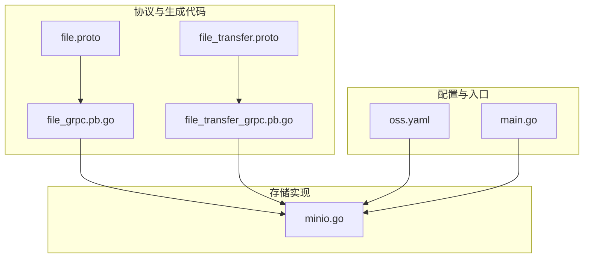
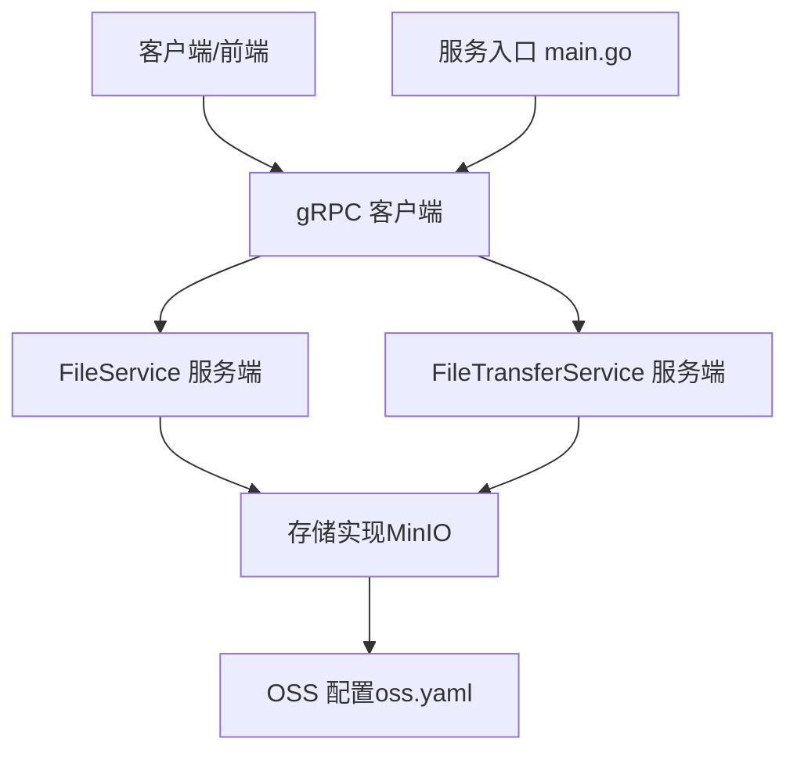
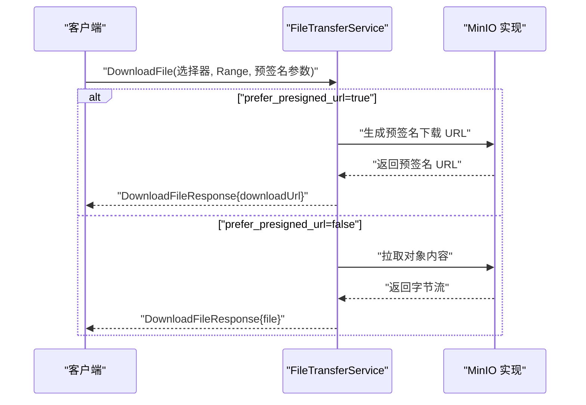
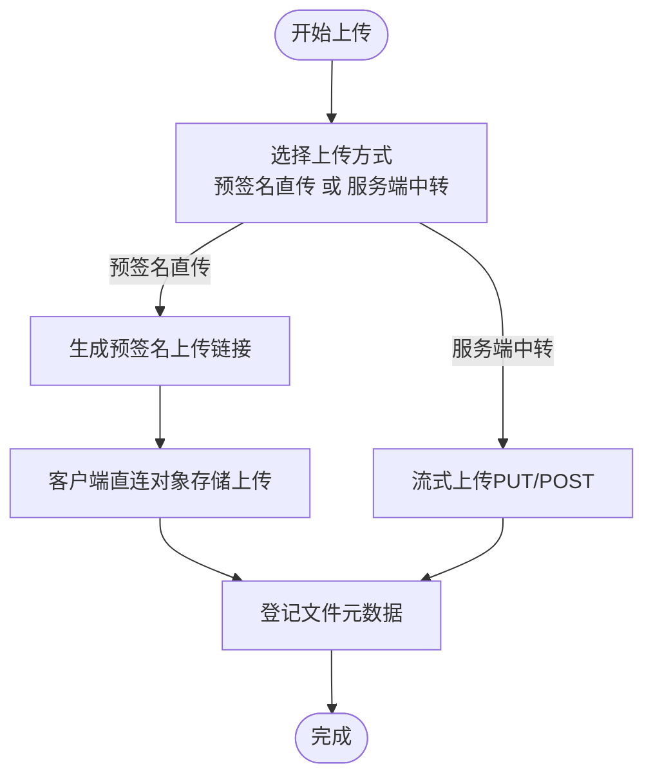
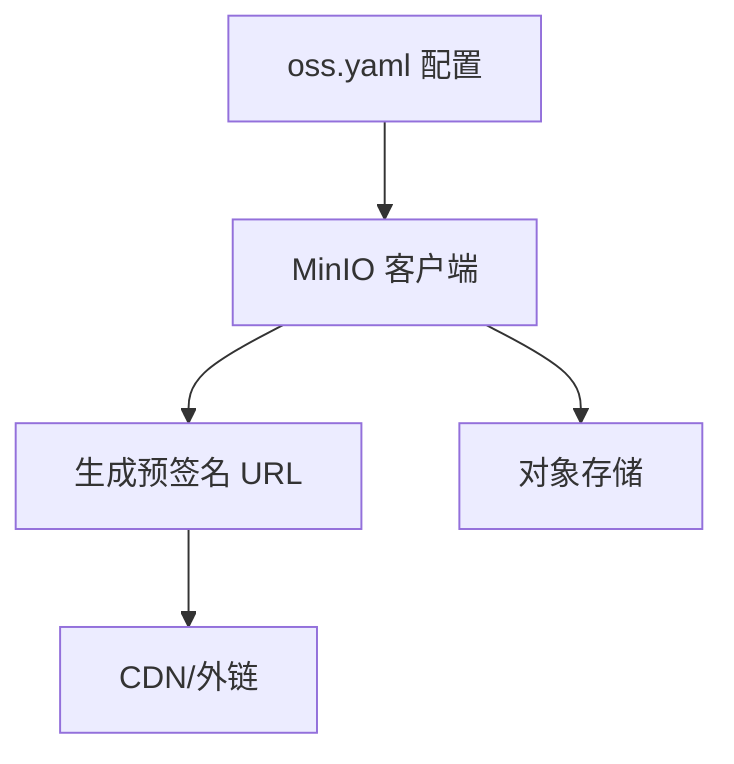
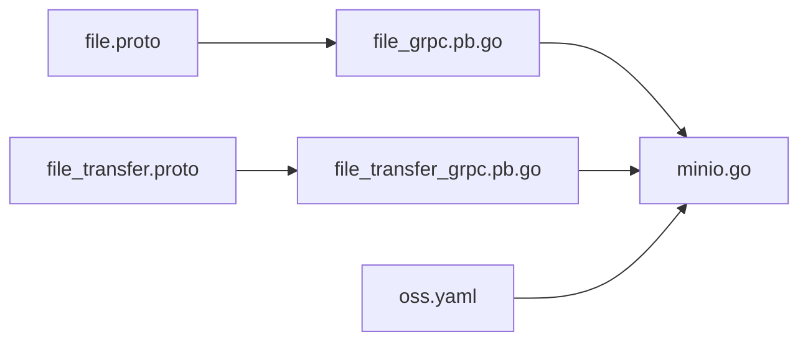

# 文件管理 API

<cite>
**本文引用的文件**
- [file.proto](file://backend/api/protos/storage/service/v1/file.proto)
- [file_transfer.proto](file://backend/api/protos/storage/service/v1/file_transfer.proto)
- [file_grpc.pb.go](file://backend/api/gen/go/storage/service/v1/file_grpc.pb.go)
- [file_transfer_grpc.pb.go](file://backend/api/gen/go/storage/service/v1/file_transfer_grpc.pb.go)
- [minio.go](file://backend/pkg/oss/minio.go)
- [oss.yaml](file://backend/app/admin/service/configs/oss.yaml)
- [main.go](file://backend/app/admin/service/cmd/server/main.go)
</cite>

## 目录
1. [简介](#简介)
2. [项目结构](#项目结构)
3. [核心组件](#核心组件)
4. [架构总览](#架构总览)
5. [详细组件分析](#详细组件分析)
6. [依赖分析](#依赖分析)
7. [性能考虑](#性能考虑)
8. [故障排查指南](#故障排查指南)
9. [结论](#结论)
10. [附录](#附录)

## 简介
本文件管理 API 文档面向 GoWind Admin 后端的存储与文件传输能力，覆盖以下主题：
- 文件上传、下载、删除与元数据管理
- 分片上传、断点续传与大文件处理机制
- 文件元数据、分类与标签体系
- 文件预览、缩略图生成与安全检查
- 对象存储集成（MinIO）、CDN 配置与访问权限控制
- 文件迁移、备份恢复与存储统计

文档基于仓库中的协议定义与实现进行梳理，并提供可视化流程与时序图帮助理解。

## 项目结构
围绕文件管理的关键文件与模块如下：
- 协议层：storage/service/v1 下的 file.proto 与 file_transfer.proto
- 生成代码：对应 Go 的 gRPC 客户端/服务端桩代码
- 存储实现：pkg/oss/minio.go 中对 MinIO 的封装
- 配置：app/admin/service/configs/oss.yaml
- 服务入口：app/admin/service/cmd/server/main.go

图表来源
- [file.proto:1-208](file://backend/api/protos/storage/service/v1/file.proto#L1-L208)
- [file_transfer.proto:1-164](file://backend/api/protos/storage/service/v1/file_transfer.proto#L1-L164)
- [file_grpc.pb.go:1-330](file://backend/api/gen/go/storage/service/v1/file_grpc.pb.go#L1-L330)
- [file_transfer_grpc.pb.go:1-198](file://backend/api/gen/go/storage/service/v1/file_transfer_grpc.pb.go#L1-L198)
- [minio.go:1-467](file://backend/pkg/oss/minio.go#L1-L467)
- [oss.yaml:1-10](file://backend/app/admin/service/configs/oss.yaml#L1-L10)
- [main.go:1-76](file://backend/app/admin/service/cmd/server/main.go#L1-L76)

章节来源
- [file.proto:1-208](file://backend/api/protos/storage/service/v1/file.proto#L1-L208)
- [file_transfer.proto:1-164](file://backend/api/protos/storage/service/v1/file_transfer.proto#L1-L164)
- [file_grpc.pb.go:1-330](file://backend/api/gen/go/storage/service/v1/file_grpc.pb.go#L1-L330)
- [file_transfer_grpc.pb.go:1-198](file://backend/api/gen/go/storage/service/v1/file_transfer_grpc.pb.go#L1-L198)
- [minio.go:1-467](file://backend/pkg/oss/minio.go#L1-L467)
- [oss.yaml:1-10](file://backend/app/admin/service/configs/oss.yaml#L1-L10)
- [main.go:1-76](file://backend/app/admin/service/cmd/server/main.go#L1-L76)

## 核心组件
- 文件服务（FileService）
  - 列表查询、数量统计、详情获取、创建、更新、删除
- 文件传输服务（FileTransferService）
  - 下载文件（支持预签名 URL 与流式直返）
  - 上传文件（PUT/POST 流式上传，支持预签名上传）

章节来源
- [file.proto:16-34](file://backend/api/protos/storage/service/v1/file.proto#L16-L34)
- [file_grpc.pb.go:36-50](file://backend/api/gen/go/storage/service/v1/file_grpc.pb.go#L36-L50)
- [file_transfer.proto:12-21](file://backend/api/protos/storage/service/v1/file_transfer.proto#L12-L21)
- [file_transfer_grpc.pb.go:28-40](file://backend/api/gen/go/storage/service/v1/file_transfer_grpc.pb.go#L28-L40)

## 架构总览
文件管理由“协议定义 + 生成代码 + 存储实现 + 配置”构成，gRPC 提供跨语言的服务契约，MinIO 封装负责对象存储交互。

图表来源
- [file_grpc.pb.go:120-139](file://backend/api/gen/go/storage/service/v1/file_grpc.pb.go#L120-L139)
- [file_transfer_grpc.pb.go:95-108](file://backend/api/gen/go/storage/service/v1/file_transfer_grpc.pb.go#L95-L108)
- [minio.go:1-467](file://backend/pkg/oss/minio.go#L1-L467)
- [oss.yaml:1-10](file://backend/app/admin/service/configs/oss.yaml#L1-L10)
- [main.go:46-57](file://backend/app/admin/service/cmd/server/main.go#L46-L57)

## 详细组件分析

### 文件服务（FileService）
- 支持的 RPC
  - List、Count、Get、Create、Update、Delete
- 数据模型 File 字段涵盖：提供商、存储桶、目录、GUID、保存名、原始名、扩展名、大小、链接、哈希、租户与创建/更新/删除信息等
- 典型用法
  - 列表与统计：结合分页请求进行查询
  - 更新：通过 FieldMask 指定更新字段，支持 allow_missing

图表来源
- [file.proto:52-145](file://backend/api/protos/storage/service/v1/file.proto#L52-L145)
- [file_grpc.pb.go:36-50](file://backend/api/gen/go/storage/service/v1/file_grpc.pb.pb.go#L36-L50)

章节来源
- [file.proto:16-34](file://backend/api/protos/storage/service/v1/file.proto#L16-L34)
- [file.proto:52-145](file://backend/api/protos/storage/service/v1/file.proto#L52-L145)
- [file_grpc.pb.go:36-50](file://backend/api/gen/go/storage/service/v1/file_grpc.pb.go#L36-L50)

### 文件传输服务（FileTransferService）
- 下载
  - 支持按 file_id、storage_object 或 download_url 选择
  - 支持 Range 分段下载
  - 支持 prefer_presigned_url 与 presign_expire_seconds
  - 返回内容可为字节流或预签名 URL
- 上传
  - PUT/POST 流式上传
  - 支持 presign 选项以获取预签名上传链接
  - 返回 object_name 与 presigned_url

图表来源
- [file_transfer.proto:23-71](file://backend/api/protos/storage/service/v1/file_transfer.proto#L23-L71)
- [file_transfer_grpc.pb.go:100-107](file://backend/api/gen/go/storage/service/v1/file_transfer_grpc.pb.go#L100-L107)
- [minio.go:317-364](file://backend/pkg/oss/minio.go#L317-L364)

章节来源
- [file_transfer.proto:12-21](file://backend/api/protos/storage/service/v1/file_transfer.proto#L12-L21)
- [file_transfer.proto:23-71](file://backend/api/protos/storage/service/v1/file_transfer.proto#L23-L71)
- [file_transfer_grpc.pb.go:28-40](file://backend/api/gen/go/storage/service/v1/file_transfer_grpc.pb.go#L28-L40)
- [minio.go:317-364](file://backend/pkg/oss/minio.go#L317-L364)

### 分片上传、断点续传与大文件处理
- 协议支持
  - 上传采用流式 RPC（PutUploadFile/PostUploadFile），适合大文件与分片场景
  - 可通过 presign 选项获取预签名上传链接，便于前端直接上传到对象存储
- 实现要点
  - 服务端可生成预签名 URL 并返回给客户端，客户端直连对象存储完成上传
  - 服务端可接收上传结果并登记文件元数据
- 大文件建议
  - 使用分片上传 + 断点续传（由前端实现），服务端提供预签名 URL 与分片落盘策略

图表来源
- [file_transfer.proto:119-163](file://backend/api/protos/storage/service/v1/file_transfer.proto#L119-L163)
- [file_transfer_grpc.pb.go:32-40](file://backend/api/gen/go/storage/service/v1/file_transfer_grpc.pb.go#L32-L40)
- [minio.go:86-163](file://backend/pkg/oss/minio.go#L86-L163)

章节来源
- [file_transfer.proto:119-163](file://backend/api/protos/storage/service/v1/file_transfer.proto#L119-L163)
- [file_transfer_grpc.pb.go:32-40](file://backend/api/gen/go/storage/service/v1/file_transfer_grpc.pb.go#L32-L40)
- [minio.go:86-163](file://backend/pkg/oss/minio.go#L86-L163)

### 文件元数据管理、分类与标签
- 元数据
  - File 模型包含：原始名、保存名、扩展名、大小、链接、内容哈希、租户信息、创建/更新/删除人与时间戳
- 分类与标签
  - 协议未内置标签字段，可通过扩展 File 字段或引入独立标签/分类实体进行管理
  - 建议在业务侧维护标签与分类映射，配合 FileService 的查询与更新能力

章节来源
- [file.proto:52-145](file://backend/api/protos/storage/service/v1/file.proto#L52-L145)

### 文件预览、缩略图生成与安全检查
- 预览与缩略图
  - 服务端可基于 Accept-Mime 与对象存储内容类型返回合适的内容
  - 缩略图生成建议在对象存储侧配置处理规则或在服务端生成后回写
- 安全检查
  - 建议在上传前进行类型检测与病毒扫描，下载时校验哈希与范围参数

章节来源
- [file_transfer.proto:67-71](file://backend/api/protos/storage/service/v1/file_transfer.proto#L67-L71)
- [minio.go:317-364](file://backend/pkg/oss/minio.go#L317-L364)

### 对象存储集成、CDN 配置与访问权限控制
- 对象存储集成
  - MinIO 客户端封装了桶存在性检查、创建、列举、删除、上传、下载、预签名 URL 生成等
- CDN 配置
  - 通过 oss.yaml 配置 endpoint、upload_host、download_host 等，支持替换主机头以适配 CDN
- 访问权限控制
  - 通过预签名 URL 控制访问时效与权限
  - 建议结合租户维度与鉴权中间件实现细粒度访问控制

图表来源
- [oss.yaml:1-10](file://backend/app/admin/service/configs/oss.yaml#L1-L10)
- [minio.go:86-163](file://backend/pkg/oss/minio.go#L86-L163)
- [minio.go:317-364](file://backend/pkg/oss/minio.go#L317-L364)

章节来源
- [oss.yaml:1-10](file://backend/app/admin/service/configs/oss.yaml#L1-L10)
- [minio.go:86-163](file://backend/pkg/oss/minio.go#L86-L163)
- [minio.go:317-364](file://backend/pkg/oss/minio.go#L317-L364)

### 文件迁移、备份恢复与存储统计
- 迁移与备份
  - 可通过列举对象、逐个下载与上传至目标存储桶实现迁移
  - 建议使用批量任务与并发策略提升效率
- 存储统计
  - 可通过 Count 与 List 结合业务维度统计文件数量与容量

章节来源
- [file.proto:18-21](file://backend/api/protos/storage/service/v1/file.proto#L18-L21)
- [file.proto:148-151](file://backend/api/protos/storage/service/v1/file.proto#L148-L151)
- [minio.go:165-181](file://backend/pkg/oss/minio.go#L165-L181)

## 依赖分析
- 协议到实现的依赖
  - file.proto 与 file_transfer.proto 定义服务契约
  - 生成的 gRPC 代码绑定到具体服务端实现
  - 存储实现依赖 MinIO SDK 与配置

图表来源
- [file.proto:1-208](file://backend/api/protos/storage/service/v1/file.proto#L1-L208)
- [file_transfer.proto:1-164](file://backend/api/protos/storage/service/v1/file_transfer.proto#L1-L164)
- [file_grpc.pb.go:1-330](file://backend/api/gen/go/storage/service/v1/file_grpc.pb.go#L1-L330)
- [file_transfer_grpc.pb.go:1-198](file://backend/api/gen/go/storage/service/v1/file_transfer_grpc.pb.go#L1-L198)
- [minio.go:1-467](file://backend/pkg/oss/minio.go#L1-L467)
- [oss.yaml:1-10](file://backend/app/admin/service/configs/oss.yaml#L1-L10)

章节来源
- [file_grpc.pb.go:295-329](file://backend/api/gen/go/storage/service/v1/file_grpc.pb.go#L295-L329)
- [file_transfer_grpc.pb.go:172-197](file://backend/api/gen/go/storage/service/v1/file_transfer_grpc.pb.go#L172-L197)
- [minio.go:1-467](file://backend/pkg/oss/minio.go#L1-L467)

## 性能考虑
- 大文件下载
  - 优先使用预签名 URL，减少服务端带宽压力
  - 支持 Range 分段下载，提升稳定性与可控性
- 上传优化
  - 预签名直传可显著降低服务端负载
  - 建议前端实现断点续传与并发分片
- 存储统计
  - 使用 Count 与分页查询避免一次性加载过多数据

## 故障排查指南
- 下载失败
  - 检查存储对象是否存在与权限是否有效
  - 若使用预签名 URL，确认过期时间与主机头替换
- 上传失败
  - 检查桶是否存在与写入权限
  - 确认预签名参数与对象名
- 服务未实现
  - 某些场景（如按 file_id 下载）可能尚未实现，需按协议扩展

章节来源
- [minio.go:50-84](file://backend/pkg/oss/minio.go#L50-L84)
- [minio.go:183-199](file://backend/pkg/oss/minio.go#L183-L199)
- [minio.go:358-364](file://backend/pkg/oss/minio.go#L358-L364)

## 结论
本文件管理 API 通过清晰的协议与生成代码，结合 MinIO 的强大能力，提供了上传、下载、删除与元数据管理的基础能力。针对大文件与高并发场景，推荐采用预签名直传与分片上传策略，并结合 CDN 与权限控制保障性能与安全。后续可在协议层扩展标签与分类字段，完善文件治理能力。

## 附录
- 服务启动入口
  - 通过 main.go 初始化应用并注册服务
- 配置参考
  - oss.yaml 中包含 MinIO 的端点与主机头配置

章节来源
- [main.go:46-57](file://backend/app/admin/service/cmd/server/main.go#L46-L57)
- [oss.yaml:1-10](file://backend/app/admin/service/configs/oss.yaml#L1-L10)