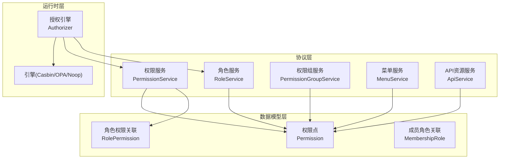
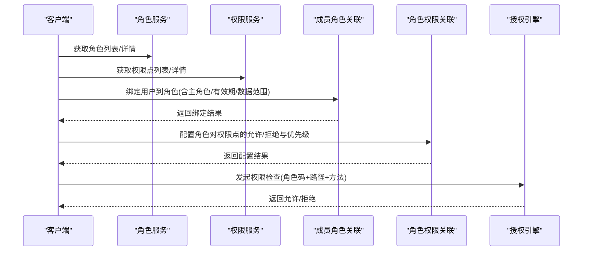
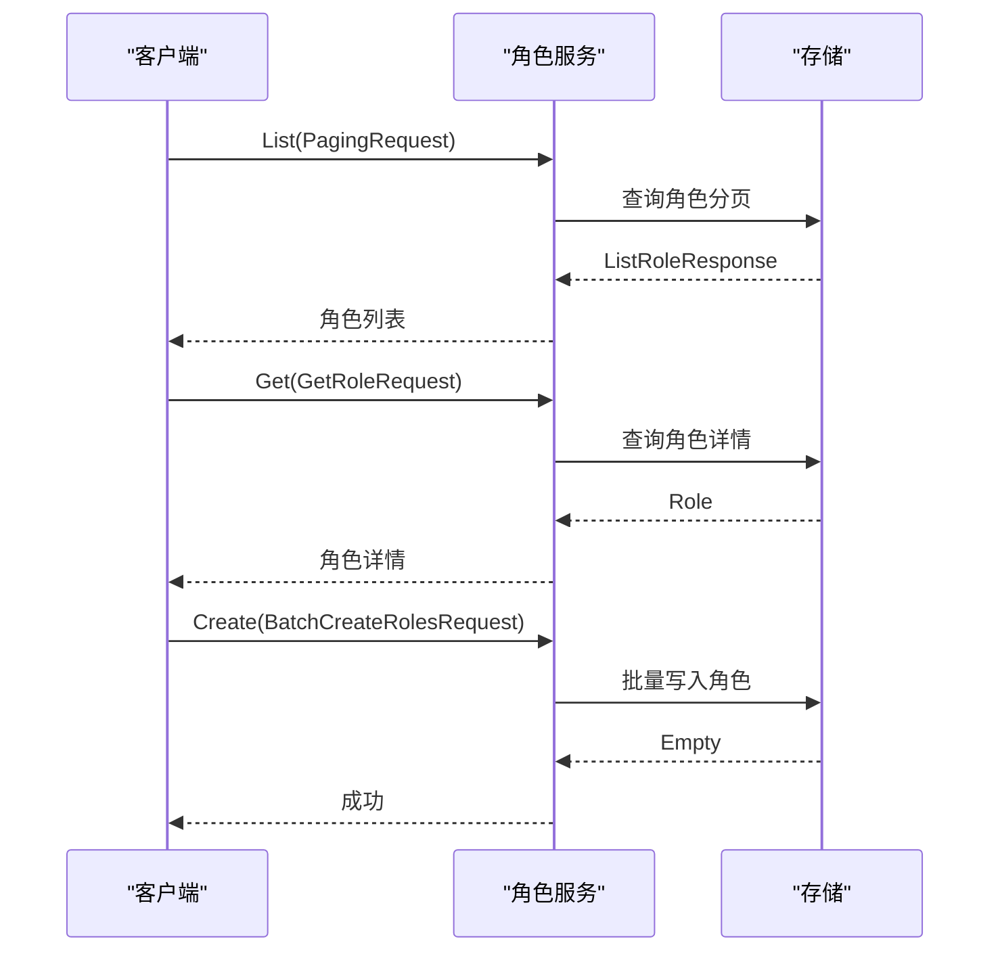
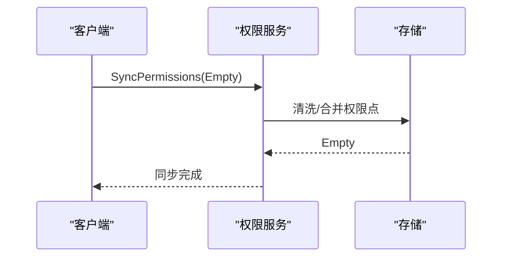
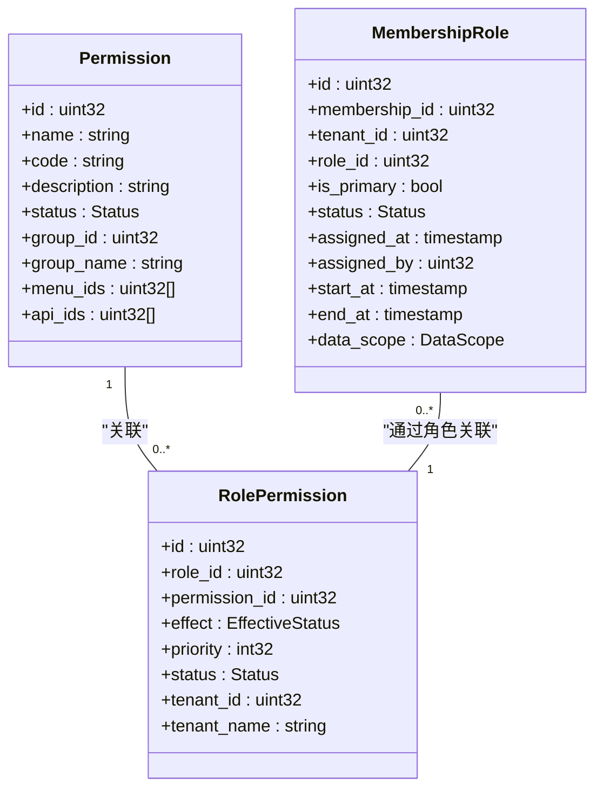
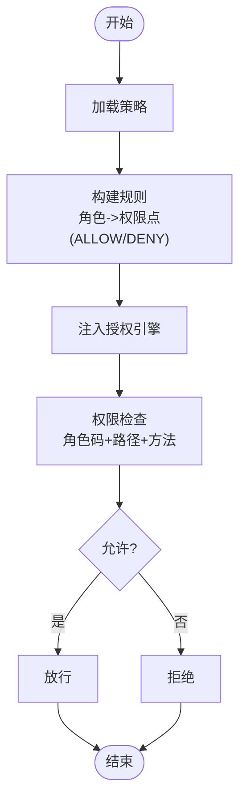
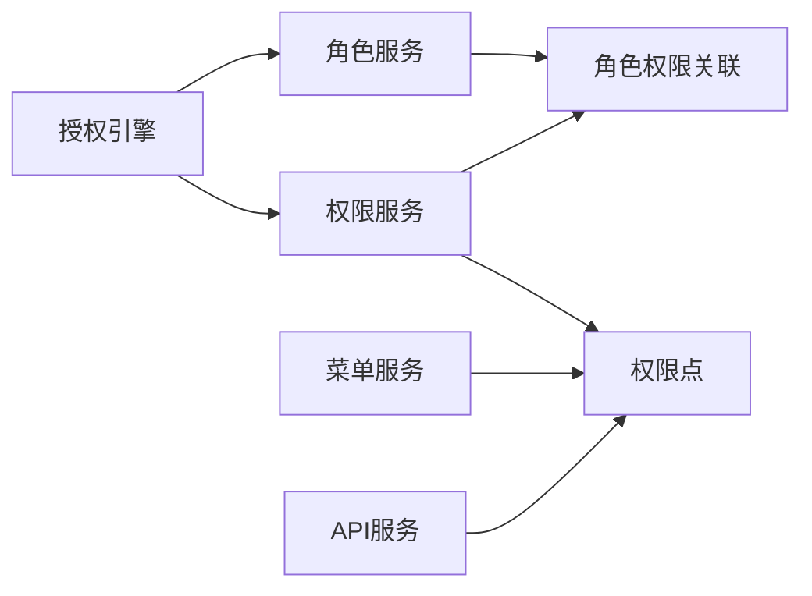

# 权限管理 API

<cite>
**本文引用的文件**
- [role_grpc.pb.go](file://backend/api/gen/go/permission/service/v1/role_grpc.pb.go)
- [permission_grpc.pb.go](file://backend/api/gen/go/permission/service/v1/permission_grpc.pb.go)
- [menu_grpc.pb.go](file://backend/api/gen/go/resource/service/v1/menu_grpc.pb.go)
- [api_grpc.pb.go](file://backend/api/gen/go/resource/service/v1/api_grpc.pb.go)
- [permission.pb.go](file://backend/api/gen/go/permission/service/v1/permission.pb.go)
- [role_permission.pb.go](file://backend/api/gen/go/permission/service/v1/role_permission.pb.go)
- [membership_role.pb.go](file://backend/api/gen/go/permission/service/v1/membership_role.pb.go)
- [permission_group_grpc.pb.go](file://backend/api/gen/go/permission/service/v1/permission_group_grpc.pb.go)
- [permission.go](file://backend/pkg/constants/permission.go)
- [role.go](file://backend/pkg/constants/role.go)
- [authorizer.go](file://backend/pkg/authorizer/authorizer.go)
</cite>

## 目录
1. [简介](#简介)
2. [项目结构](#项目结构)
3. [核心组件](#核心组件)
4. [架构总览](#架构总览)
5. [详细组件分析](#详细组件分析)
6. [依赖关系分析](#依赖关系分析)
7. [性能考虑](#性能考虑)
8. [故障排查指南](#故障排查指南)
9. [结论](#结论)

## 简介
本文件面向 GoWind Admin 的权限管理子系统，系统性梳理并说明基于 RBAC 的权限模型在后端的 API 实现与使用方式。内容覆盖：
- 角色管理：CRUD、批量创建、查询映射
- 权限点管理：CRUD、同步、树形结构化组织
- 菜单与接口资源：资源发现、路由同步
- 用户角色绑定与主角色机制
- 权限继承与优先级、生效方式
- 权限检查、资源访问控制与数据权限过滤
- 权限批量操作、权限转移与回收
- 权限缓存策略、权限变更通知与审计日志

## 项目结构
权限相关能力由多层协议与运行时共同构成：
- 协议层：通过 protobuf 定义的 gRPC 服务接口，统一暴露角色、权限、菜单、API 等能力
- 数据模型层：定义权限点、角色权限关联、成员角色关联等实体结构
- 运行时层：授权引擎（Casbin/OPA/Noop）与策略提供器，负责策略生成与执行
- 常量层：系统内置权限与角色代码规范，确保一致性与可审计性

图表来源
- [role_grpc.pb.go:23-34](file://backend/api/gen/go/permission/service/v1/role_grpc.pb.go#L23-L34)
- [permission_grpc.pb.go:23-31](file://backend/api/gen/go/permission/service/v1/permission_grpc.pb.go#L23-L31)
- [permission_group_grpc.pb.go:23-30](file://backend/api/gen/go/permission/service/v1/permission_group_grpc.pb.go#L23-L30)
- [menu_grpc.pb.go:23-30](file://backend/api/gen/go/resource/service/v1/menu_grpc.pb.go#L23-L30)
- [api_grpc.pb.go:23-32](file://backend/api/gen/go/resource/service/v1/api_grpc.pb.go#L23-L32)
- [permission.pb.go:76-96](file://backend/api/gen/go/permission/service/v1/permission.pb.go#L76-L96)
- [role_permission.pb.go:122-141](file://backend/api/gen/go/permission/service/v1/role_permission.pb.go#L122-L141)
- [membership_role.pb.go:83-105](file://backend/api/gen/go/permission/service/v1/membership_role.pb.go#L83-L105)
- [authorizer.go:18-24](file://backend/pkg/authorizer/authorizer.go#L18-L24)

章节来源
- [role_grpc.pb.go:23-490](file://backend/api/gen/go/permission/service/v1/role_grpc.pb.go#L23-L490)
- [permission_grpc.pb.go:23-370](file://backend/api/gen/go/permission/service/v1/permission_grpc.pb.go#L23-L370)
- [permission_group_grpc.pb.go:23-331](file://backend/api/gen/go/permission/service/v1/permission_group_grpc.pb.go#L23-L331)
- [menu_grpc.pb.go:23-330](file://backend/api/gen/go/resource/service/v1/menu_grpc.pb.go#L23-L330)
- [api_grpc.pb.go:23-410](file://backend/api/gen/go/resource/service/v1/api_grpc.pb.go#L23-L410)

## 核心组件
- 角色服务 RoleService：提供角色的分页查询、统计、详情、创建、批量创建、更新、删除，以及角色码/ID 互查等能力
- 权限服务 PermissionService：提供权限点的分页查询、统计、详情、创建、更新、删除、同步
- 权限组服务 PermissionGroupService：提供权限组的分页查询、统计、详情、创建、更新、删除
- 菜单服务 MenuService：提供菜单的分页查询、统计、详情、创建、更新、删除
- API 资源服务 ApiService：提供 API 资源的分页查询、统计、详情、创建、更新、删除、同步、路由数据查询
- 权限模型 Permission/RolePermission/MembershipRole：定义权限点、角色权限关联、成员角色关联的数据结构
- 授权引擎 Authorizer：根据配置选择授权引擎，加载策略并执行权限检查

章节来源
- [role_grpc.pb.go:40-62](file://backend/api/gen/go/permission/service/v1/role_grpc.pb.go#L40-L62)
- [permission_grpc.pb.go:37-53](file://backend/api/gen/go/permission/service/v1/permission_grpc.pb.go#L37-L53)
- [permission_group_grpc.pb.go:36-50](file://backend/api/gen/go/permission/service/v1/permission_group_grpc.pb.go#L36-L50)
- [menu_grpc.pb.go:36-50](file://backend/api/gen/go/resource/service/v1/menu_grpc.pb.go#L36-L50)
- [api_grpc.pb.go:38-56](file://backend/api/gen/go/resource/service/v1/api_grpc.pb.go#L38-L56)
- [permission.pb.go:76-96](file://backend/api/gen/go/permission/service/v1/permission.pb.go#L76-L96)
- [role_permission.pb.go:122-141](file://backend/api/gen/go/permission/service/v1/role_permission.pb.go#L122-L141)
- [membership_role.pb.go:83-105](file://backend/api/gen/go/permission/service/v1/membership_role.pb.go#L83-L105)
- [authorizer.go:18-24](file://backend/pkg/authorizer/authorizer.go#L18-L24)

## 架构总览
RBAC 权限模型通过“角色-权限”关联实现权限继承与组合；“成员-角色”关联实现用户到角色的绑定，并支持主角色与数据权限范围。授权引擎负责将策略注入并执行。

图表来源
- [role_grpc.pb.go:40-62](file://backend/api/gen/go/permission/service/v1/role_grpc.pb.go#L40-L62)
- [permission_grpc.pb.go:37-53](file://backend/api/gen/go/permission/service/v1/permission_grpc.pb.go#L37-L53)
- [membership_role.pb.go:83-105](file://backend/api/gen/go/permission/service/v1/membership_role.pb.go#L83-L105)
- [role_permission.pb.go:122-141](file://backend/api/gen/go/permission/service/v1/role_permission.pb.go#L122-L141)
- [authorizer.go:58-60](file://backend/pkg/authorizer/authorizer.go#L58-L60)

## 详细组件分析

### 角色管理 API
- 列表/统计/详情：支持分页请求，返回角色集合与总数
- 创建/更新/删除：标准 CRUD
- 批量创建：支持一次性创建多个角色
- 角色码/ID 映射：支持按 ID 列表获取角色码，或按角色码获取角色列表

图表来源
- [role_grpc.pb.go:23-34](file://backend/api/gen/go/permission/service/v1/role_grpc.pb.go#L23-L34)
- [role_grpc.pb.go:72-170](file://backend/api/gen/go/permission/service/v1/role_grpc.pb.go#L72-L170)

章节来源
- [role_grpc.pb.go:40-62](file://backend/api/gen/go/permission/service/v1/role_grpc.pb.go#L40-L62)

### 权限点管理 API
- 列表/统计/详情：支持分页请求，返回权限点集合与总数
- 创建/更新/删除：标准 CRUD
- 同步：用于从资源侧同步权限点，保证权限点与资源一致

图表来源
- [permission_grpc.pb.go:23-31](file://backend/api/gen/go/permission/service/v1/permission_grpc.pb.go#L23-L31)
- [permission_grpc.pb.go:123-131](file://backend/api/gen/go/permission/service/v1/permission_grpc.pb.go#L123-L131)

章节来源
- [permission_grpc.pb.go:37-53](file://backend/api/gen/go/permission/service/v1/permission_grpc.pb.go#L37-L53)

### 权限组管理 API
- 列表/统计/详情：支持分页请求，返回权限组集合与总数
- 创建/更新/删除：标准 CRUD

章节来源
- [permission_group_grpc.pb.go:36-50](file://backend/api/gen/go/permission/service/v1/permission_group_grpc.pb.go#L36-L50)

### 菜单资源 API
- 列表/统计/详情：支持分页请求，返回菜单集合与总数
- 创建/更新/删除：标准 CRUD

章节来源
- [menu_grpc.pb.go:36-50](file://backend/api/gen/go/resource/service/v1/menu_grpc.pb.go#L36-L50)

### 接口资源 API
- 列表/统计/详情：支持分页请求，返回 API 资源集合与总数
- 创建/更新/删除：标准 CRUD
- 同步：用于从路由扫描同步 API 资源
- 路由数据：提供可步行路由数据查询（用于前端导航）

章节来源
- [api_grpc.pb.go:38-56](file://backend/api/gen/go/resource/service/v1/api_grpc.pb.go#L38-L56)

### 权限模型与数据结构
- 权限点 Permission：包含名称、编码、描述、状态、分组、关联菜单与 API 资源等
- 角色权限关联 RolePermission：定义角色对权限点的允许/拒绝、优先级、状态、租户维度
- 成员角色关联 MembershipRole：定义成员到角色的绑定、主角色标记、有效期、数据权限范围

图表来源
- [permission.pb.go:76-96](file://backend/api/gen/go/permission/service/v1/permission.pb.go#L76-L96)
- [role_permission.pb.go:122-141](file://backend/api/gen/go/permission/service/v1/role_permission.pb.go#L122-L141)
- [membership_role.pb.go:83-105](file://backend/api/gen/go/permission/service/v1/membership_role.pb.go#L83-L105)

章节来源
- [permission.pb.go:76-96](file://backend/api/gen/go/permission/service/v1/permission.pb.go#L76-L96)
- [role_permission.pb.go:122-141](file://backend/api/gen/go/permission/service/v1/role_permission.pb.go#L122-L141)
- [membership_role.pb.go:83-105](file://backend/api/gen/go/permission/service/v1/membership_role.pb.go#L83-L105)

### RBAC 权限模型与 API 实现
- 角色到权限：通过 RolePermission 将角色与权限点关联，支持 ALLOW/DENY 与优先级
- 成员到角色：通过 MembershipRole 将成员绑定到角色，支持主角色、有效期与数据权限范围
- 权限检查：授权引擎根据策略进行匹配，返回允许/拒绝
- 资源访问控制：结合 API 资源与菜单资源，形成完整的前端与后端访问矩阵
- 数据权限过滤：通过数据权限范围限制用户可见数据集

图表来源
- [authorizer.go:111-160](file://backend/pkg/authorizer/authorizer.go#L111-L160)
- [role_permission.pb.go:26-47](file://backend/api/gen/go/permission/service/v1/role_permission.pb.go#L26-L47)

章节来源
- [authorizer.go:58-109](file://backend/pkg/authorizer/authorizer.go#L58-L109)

### 权限批量操作、转移与回收
- 批量创建角色：RoleService 支持批量创建
- 批量绑定/解绑角色：通过成员角色关联接口实现批量绑定与解除
- 权限转移：通过更新角色权限关联（调整 effect/priority/status）实现转移
- 权限回收：通过 DENY 或删除关联实现回收

章节来源
- [role_grpc.pb.go:50-51](file://backend/api/gen/go/permission/service/v1/role_grpc.pb.go#L50-L51)
- [membership_role.pb.go:83-105](file://backend/api/gen/go/permission/service/v1/membership_role.pb.go#L83-L105)
- [role_permission.pb.go:122-141](file://backend/api/gen/go/permission/service/v1/role_permission.pb.go#L122-L141)

### 权限缓存策略、变更通知与审计日志
- 缓存策略：建议在授权引擎层引入缓存（如内存缓存/分布式缓存），降低重复计算成本
- 变更通知：权限/角色/成员角色变更后，触发重载策略流程，确保缓存与引擎一致
- 审计日志：建议在授权引擎与业务层分别记录操作审计与策略变更审计，便于追踪与合规

章节来源
- [authorizer.go:62-109](file://backend/pkg/authorizer/authorizer.go#L62-L109)

## 依赖关系分析
- 服务间依赖：角色服务与权限服务相互配合，菜单与 API 资源服务为权限点提供来源
- 数据模型依赖：权限点作为权限服务的核心实体，被角色权限关联与资源服务引用
- 运行时依赖：授权引擎依赖策略提供器提供的策略数据

图表来源
- [role_grpc.pb.go:40-62](file://backend/api/gen/go/permission/service/v1/role_grpc.pb.go#L40-L62)
- [permission_grpc.pb.go:37-53](file://backend/api/gen/go/permission/service/v1/permission_grpc.pb.go#L37-L53)
- [menu_grpc.pb.go:36-50](file://backend/api/gen/go/resource/service/v1/menu_grpc.pb.go#L36-L50)
- [api_grpc.pb.go:38-56](file://backend/api/gen/go/resource/service/v1/api_grpc.pb.go#L38-L56)
- [role_permission.pb.go:122-141](file://backend/api/gen/go/permission/service/v1/role_permission.pb.go#L122-L141)
- [authorizer.go:58-60](file://backend/pkg/authorizer/authorizer.go#L58-L60)

章节来源
- [role_grpc.pb.go:40-62](file://backend/api/gen/go/permission/service/v1/role_grpc.pb.go#L40-L62)
- [permission_grpc.pb.go:37-53](file://backend/api/gen/go/permission/service/v1/permission_grpc.pb.go#L37-L53)
- [menu_grpc.pb.go:36-50](file://backend/api/gen/go/resource/service/v1/menu_grpc.pb.go#L36-L50)
- [api_grpc.pb.go:38-56](file://backend/api/gen/go/resource/service/v1/api_grpc.pb.go#L38-L56)

## 性能考虑
- 策略预热：启动时加载策略，避免首次请求冷启动开销
- 缓存命中：对热点角色/权限点查询结果进行缓存，减少数据库压力
- 分页与字段裁剪：使用分页与字段掩码减少传输与处理开销
- 引擎选择：根据场景选择合适的授权引擎（Casbin/OPA/Noop），权衡灵活性与性能

## 故障排查指南
- 授权不生效：确认策略已重载、缓存已刷新
- 权限点不同步：检查同步接口调用与资源侧路由变化
- 角色绑定异常：核对成员角色关联的有效期与状态
- 权限优先级冲突：检查角色权限关联的优先级与生效方式

章节来源
- [authorizer.go:62-109](file://backend/pkg/authorizer/authorizer.go#L62-L109)

## 结论
GoWind Admin 的权限管理以 RBAC 为核心，通过协议层清晰定义角色、权限、菜单与 API 资源的管理接口，并以授权引擎实现灵活的策略执行。结合常量层的角色与权限代码规范，可实现稳定、可审计、可扩展的权限体系。建议在生产环境中完善缓存、变更通知与审计日志机制，确保系统的安全性与可观测性。