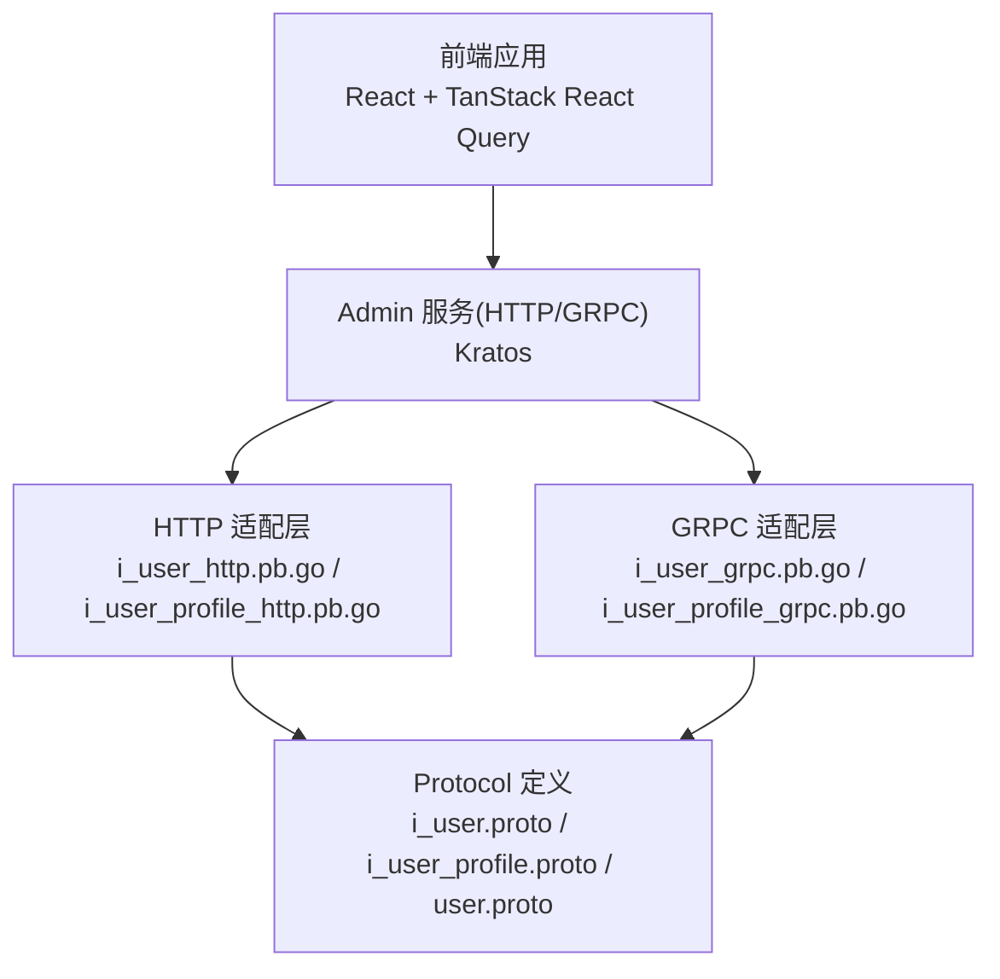
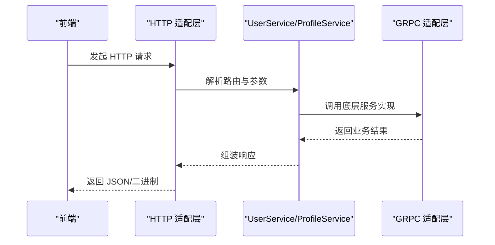
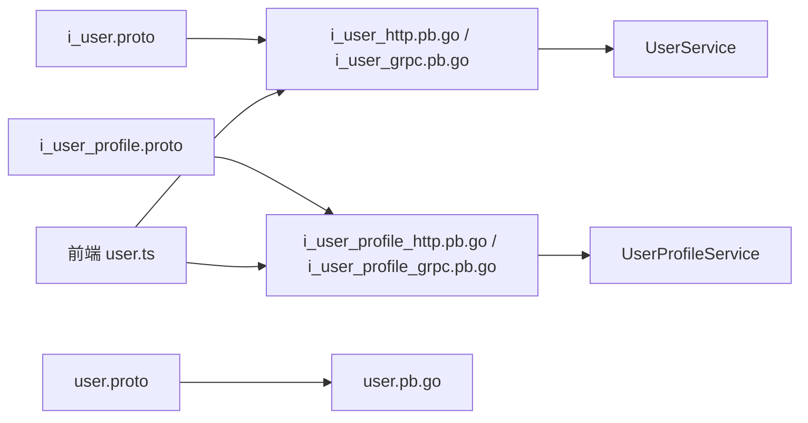

# 用户管理 API

<cite>
**本文引用的文件**
- [i_user.proto](file://backend/api/protos/admin/service/v1/i_user.proto)
- [i_user_profile.proto](file://backend/api/protos/admin/service/v1/i_user_profile.proto)
- [user.proto](file://backend/api/protos/identity/service/v1/user.proto)
- [user.pb.go](file://backend/api/gen/go/identity/service/v1/user.pb.go)
- [i_user.pb.go](file://backend/api/gen/go/admin/service/v1/i_user.pb.go)
- [i_user_http.pb.go](file://backend/api/gen/go/admin/service/v1/i_user_http.pb.go)
- [i_user_grpc.pb.go](file://backend/api/gen/go/admin/service/v1/i_user_grpc.pb.go)
- [i_user_profile_http.pb.go](file://backend/api/gen/go/admin/service/v1/i_user_profile_http.pb.go)
- [i_user_profile_grpc.pb.go](file://backend/api/gen/go/admin/service/v1/i_user_profile_grpc.pb.go)
- [main.go](file://backend/app/admin/service/cmd/server/main.go)
- [user.ts](file://frontend/admin/react/src/api/service/user.ts)
- [user.ts（hooks）](file://frontend/admin/react/src/api/hooks/user.ts)
</cite>

## 目录
1. [简介](#简介)
2. [项目结构](#项目结构)
3. [核心组件](#核心组件)
4. [架构总览](#架构总览)
5. [详细组件分析](#详细组件分析)
6. [依赖关系分析](#依赖关系分析)
7. [性能考虑](#性能考虑)
8. [故障排查指南](#故障排查指南)
9. [结论](#结论)
10. [附录](#附录)

## 简介
本文件为 GoWind Admin 的“用户管理 API”技术文档，覆盖用户 CRUD、状态管理、密码管理、用户配置与个人资料、批量操作与导入导出能力，并提供搜索过滤、分页查询、排序与字段选择等高级查询能力的接口说明。文档以仓库中的 Protocol Buffers 定义与生成的 HTTP/GRPC 适配层为基础，结合前端调用示例，帮助开发者快速理解与集成。

## 项目结构
- 后端采用 Kratos 架构，Admin 服务作为入口，通过 HTTP/GRPC 提供用户管理能力。
- 用户管理 API 由两套协议定义：
  - 管理侧用户服务：面向管理员的用户管理与密码修改
  - 个人资料服务：面向用户的个人信息、密码与头像等操作
- 前端基于 React + TanStack React Query 调用后端生成的客户端，封装分页、过滤与排序参数。

图表来源
- [i_user_http.pb.go:1-200](file://backend/api/gen/go/admin/service/v1/i_user_http.pb.go#L1-L200)
- [i_user_profile_http.pb.go:1-200](file://backend/api/gen/go/admin/service/v1/i_user_profile_http.pb.go#L1-L200)
- [i_user.proto:1-75](file://backend/api/protos/admin/service/v1/i_user.proto#L1-L75)
- [i_user_profile.proto:1-64](file://backend/api/protos/admin/service/v1/i_user_profile.proto#L1-L64)
- [user.proto:1-450](file://backend/api/protos/identity/service/v1/user.proto#L1-L450)

章节来源
- [main.go:1-76](file://backend/app/admin/service/cmd/server/main.go#L1-L76)

## 核心组件
- 管理侧用户服务（UserService）
  - 列表、详情、创建、更新、删除、存在性检查、强制改密
- 个人资料服务（UserProfileService）
  - 自身信息查看与更新、修改密码、头像上传/删除、绑定/校验联系方式
- 用户模型（User）
  - 包含组织、岗位、角色、状态、时间戳、敏感字段脱敏等

章节来源
- [i_user.proto:14-74](file://backend/api/protos/admin/service/v1/i_user.proto#L14-L74)
- [i_user_profile.proto:11-63](file://backend/api/protos/admin/service/v1/i_user_profile.proto#L11-L63)
- [user.proto:40-211](file://backend/api/protos/identity/service/v1/user.proto#L40-L211)

## 架构总览
后端服务通过 HTTP/GRPC 将 Protocol 定义映射为 RESTful 接口，前端通过生成的客户端发起请求；用户模型与请求/响应消息由 Protobuf 生成的 Go 结构体承载。

图表来源
- [i_user_http.pb.go:1-200](file://backend/api/gen/go/admin/service/v1/i_user_http.pb.go#L1-L200)
- [i_user_grpc.pb.go:1-200](file://backend/api/gen/go/admin/service/v1/i_user_grpc.pb.go#L1-L200)
- [i_user_profile_http.pb.go:1-200](file://backend/api/gen/go/admin/service/v1/i_user_profile_http.pb.go#L1-L200)
- [i_user_profile_grpc.pb.go:1-200](file://backend/api/gen/go/admin/service/v1/i_user_profile_grpc.pb.go#L1-L200)

## 详细组件分析

### 管理侧用户服务（UserService）
- 列表查询
  - 方法：List
  - 路径：GET /admin/v1/users
  - 分页：支持分页请求（来自公共分页定义）
  - 返回：ListUserResponse（包含 items 与 total）
- 单个查询
  - 方法：Get
  - 路径：GET /admin/v1/users/{id} 或 GET /admin/v1/users/username/{username}
  - 支持按 id 或 username 查询
- 创建用户
  - 方法：Create
  - 路径：POST /admin/v1/users
  - 请求体：CreateUserRequest（包含 User 数据与密码）
- 更新用户
  - 方法：Update
  - 路径：PUT /admin/v1/users/{id}
  - 请求体：UpdateUserRequest（包含 id、data、可选 password、updateMask、allowMissing）
- 删除用户
  - 方法：Delete
  - 路径：DELETE /admin/v1/users/{id} 或 DELETE /admin/v1/users/username/{username}
- 存在性检查
  - 方法：UserExists
  - 路径：GET /admin/v1/users:exists
- 强制修改密码
  - 方法：EditUserPassword
  - 路径：POST /admin/v1/users/{user_id}/password

字段与行为要点
- 支持 FieldMask 控制返回字段（GetUserRequest.view_mask）
- Update 支持 updateMask 精准更新字段，允许 allow_missing 实现“不存在即插入”
- 密码字段仅在请求中出现，不回显

章节来源
- [i_user.proto:14-74](file://backend/api/protos/admin/service/v1/i_user.proto#L14-L74)
- [user.proto:213-324](file://backend/api/protos/identity/service/v1/user.proto#L213-L324)
- [user.proto:251-278](file://backend/api/protos/identity/service/v1/user.proto#L251-L278)
- [user.proto:280-293](file://backend/api/protos/identity/service/v1/user.proto#L280-L293)
- [user.proto:295-312](file://backend/api/protos/identity/service/v1/user.proto#L295-L312)
- [user.proto:330-345](file://backend/api/protos/identity/service/v1/user.proto#L330-L345)

### 个人资料服务（UserProfileService）
- 获取自身信息
  - 方法：GetUser
  - 路径：GET /admin/v1/me
- 更新自身信息
  - 方法：UpdateUser
  - 路径：PUT /admin/v1/me
- 修改自身密码
  - 方法：ChangePassword
  - 路径：POST /admin/v1/me/password
- 上传头像
  - 方法：UploadAvatar
  - 路径：POST /admin/v1/me/avatar
- 删除头像
  - 方法：DeleteAvatar
  - 路径：DELETE /admin/v1/me/avatar
- 绑定联系方式
  - 方法：BindContact
  - 路径：POST /admin/v1/me/contact
- 验证联系方式
  - 方法：VerifyContact
  - 路径：POST /admin/v1/me/contact/verify

章节来源
- [i_user_profile.proto:11-63](file://backend/api/protos/admin/service/v1/i_user_profile.proto#L11-L63)

### 用户模型与字段定义
- 关键字段
  - 标识：id、username、realname、nickname、avatar
  - 联系：email、mobile、telephone、address、region
  - 组织/岗位/角色：org_unit_id(s)/name(s)、position_id(s)/name(s)、role_id(s)/roles/role_names
  - 状态：status（枚举）、locked_until
  - 登录：last_login_at、last_login_ip
  - 时间戳：created_at、updated_at、deleted_at
  - 操作人：created_by、updated_by、deleted_by
- 字段验证与约束
  - Get/Update/Delete 支持按 id 或 username 查询/匹配
  - Update 支持 FieldMask 精准更新
  - Password 仅在请求中出现，不回显
  - 邮箱字段在 Protobuf 层具备脱敏标注

章节来源
- [user.proto:40-211](file://backend/api/protos/identity/service/v1/user.proto#L40-L211)
- [user.pb.go:140-182](file://backend/api/gen/go/identity/service/v1/user.pb.go#L140-L182)

### 批量操作与导入导出
- 批量创建
  - 方法：BatchCreate（在身份服务定义中）
  - 请求：BatchCreateUsersRequest（items: User[]）
  - 返回：BatchCreateUsersResponse（createdIds: int32[]）
- 导入/导出
  - 当前协议未直接暴露导入/导出端点；建议通过管理侧用户列表与批量创建配合实现导入，或在业务侧扩展相应端点

章节来源
- [user.proto:314-324](file://backend/api/protos/identity/service/v1/user.proto#L314-L324)

### 搜索过滤、分页与排序
- 分页
  - 使用分页请求（来自公共分页定义），在 List 接口生效
- 过滤与排序
  - 前端通过 PaginationQuery 将排序、偏移、限制、过滤表达式等参数转换为 HTTP 请求
  - 具体过滤语法与表达式请参考前端分页工具与后端适配层约定

章节来源
- [user.ts:21-35](file://frontend/admin/react/src/api/service/user.ts#L21-L35)
- [user.ts（hooks）:31-50](file://frontend/admin/react/src/api/hooks/user.ts#L31-L50)

### 密码管理
- 管理员强制改密
  - EditUserPassword：无需旧密码，直接设置新密码
  - 路径：POST /admin/v1/users/{user_id}/password
- 用户自身改密
  - ChangePassword：需提供旧密码与新密码
  - 路径：POST /admin/v1/me/password

章节来源
- [i_user.proto:67-73](file://backend/api/protos/admin/service/v1/i_user.proto#L67-L73)
- [i_user_profile.proto:27-33](file://backend/api/protos/admin/service/v1/i_user_profile.proto#L27-L33)
- [user.proto:330-345](file://backend/api/protos/identity/service/v1/user.proto#L330-L345)
- [user.proto:348-363](file://backend/api/protos/identity/service/v1/user.proto#L348-L363)

### 用户状态管理
- 状态枚举（Status）
  - DISABLED、NORMAL、PENDING、LOCKED、EXPIRED、CLOSED
- 锁定截止时间：locked_until
- 管理员可通过更新接口将用户状态置为 NORMAL/DISABLED/PENDING/EXPIRED/CLOSED；LOCKED 通常由系统策略触发

章节来源
- [user.proto:49-57](file://backend/api/protos/identity/service/v1/user.proto#L49-L57)
- [user.proto:194-202](file://backend/api/protos/identity/service/v1/user.proto#L194-L202)

### 用户配置与个人资料
- 个人资料读写
  - GetUser/UpdateUser：获取与更新自身信息
- 头像管理
  - UploadAvatar/ DeleteAvatar：支持 Base64 或 URL 两种来源
- 联系方式绑定与校验
  - BindContact/VerifyContact：支持手机与邮箱绑定与校验

章节来源
- [i_user_profile.proto:11-63](file://backend/api/protos/admin/service/v1/i_user_profile.proto#L11-L63)
- [user.proto:365-384](file://backend/api/protos/identity/service/v1/user.proto#L365-L384)
- [user.proto:386-417](file://backend/api/protos/identity/service/v1/user.proto#L386-L417)

## 依赖关系分析
- 协议到实现
  - i_user.proto 与 i_user_profile.proto 通过 HTTP/GRPC 适配层映射到具体服务
  - user.proto 定义了用户实体与请求/响应消息
- 前端到后端
  - 前端通过生成的客户端调用后端服务，统一处理分页、过滤与排序参数

图表来源
- [i_user.proto:1-75](file://backend/api/protos/admin/service/v1/i_user.proto#L1-L75)
- [i_user_profile.proto:1-64](file://backend/api/protos/admin/service/v1/i_user_profile.proto#L1-L64)
- [user.proto:1-450](file://backend/api/protos/identity/service/v1/user.proto#L1-L450)
- [i_user_http.pb.go:1-200](file://backend/api/gen/go/admin/service/v1/i_user_http.pb.go#L1-L200)
- [i_user_profile_http.pb.go:1-200](file://backend/api/gen/go/admin/service/v1/i_user_profile_http.pb.go#L1-L200)
- [user.pb.go:1-200](file://backend/api/gen/go/identity/service/v1/user.pb.go#L1-L200)
- [user.ts:1-51](file://frontend/admin/react/src/api/service/user.ts#L1-L51)

章节来源
- [i_user_http.pb.go:1-200](file://backend/api/gen/go/admin/service/v1/i_user_http.pb.go#L1-L200)
- [i_user_profile_http.pb.go:1-200](file://backend/api/gen/go/admin/service/v1/i_user_profile_http.pb.go#L1-L200)
- [user.ts:1-51](file://frontend/admin/react/src/api/service/user.ts#L1-L51)

## 性能考虑
- 分页与过滤
  - 使用分页请求避免一次性加载大量数据
  - 建议在后端实现索引与查询优化，确保过滤与排序高效
- 字段选择
  - 通过 FieldMask 仅返回必要字段，减少序列化与传输开销
- 并发与缓存
  - 对高频读取的用户信息可引入缓存层，降低数据库压力
- 批量操作
  - 批量创建时建议分批提交，避免单次请求过大

## 故障排查指南
- 常见问题
  - 参数缺失：确认请求体中包含必需字段（如 Update 的 data、FieldMask）
  - 身份认证：确保前端携带有效 Token，后端鉴权中间件正常工作
  - 路径错误：区分管理端与个人端路径（/admin/v1/users vs /admin/v1/me）
- 日志与追踪
  - 后端服务启动入口位于 Admin 服务主程序，可结合日志与追踪中间件定位问题

章节来源
- [main.go:59-75](file://backend/app/admin/service/cmd/server/main.go#L59-L75)

## 结论
本文档基于仓库中的 Protocol 定义与生成的 HTTP/GRPC 适配层，系统梳理了用户管理 API 的接口规范、数据模型与调用流程。结合前端调用示例，开发者可快速完成用户 CRUD、状态管理、密码管理与个人资料维护等核心功能的集成。

## 附录

### API 一览（按模块）

- 管理侧用户服务（UserService）
  - GET /admin/v1/users
  - GET /admin/v1/users/{id}
  - GET /admin/v1/users/username/{username}
  - POST /admin/v1/users
  - PUT /admin/v1/users/{id}
  - DELETE /admin/v1/users/{id}
  - DELETE /admin/v1/users/username/{username}
  - GET /admin/v1/users:exists
  - POST /admin/v1/users/{user_id}/password

- 个人资料服务（UserProfileService）
  - GET /admin/v1/me
  - PUT /admin/v1/me
  - POST /admin/v1/me/password
  - POST /admin/v1/me/avatar
  - DELETE /admin/v1/me/avatar
  - POST /admin/v1/me/contact
  - POST /admin/v1/me/contact/verify

章节来源
- [i_user.proto:14-74](file://backend/api/protos/admin/service/v1/i_user.proto#L14-L74)
- [i_user_profile.proto:11-63](file://backend/api/protos/admin/service/v1/i_user_profile.proto#L11-L63)