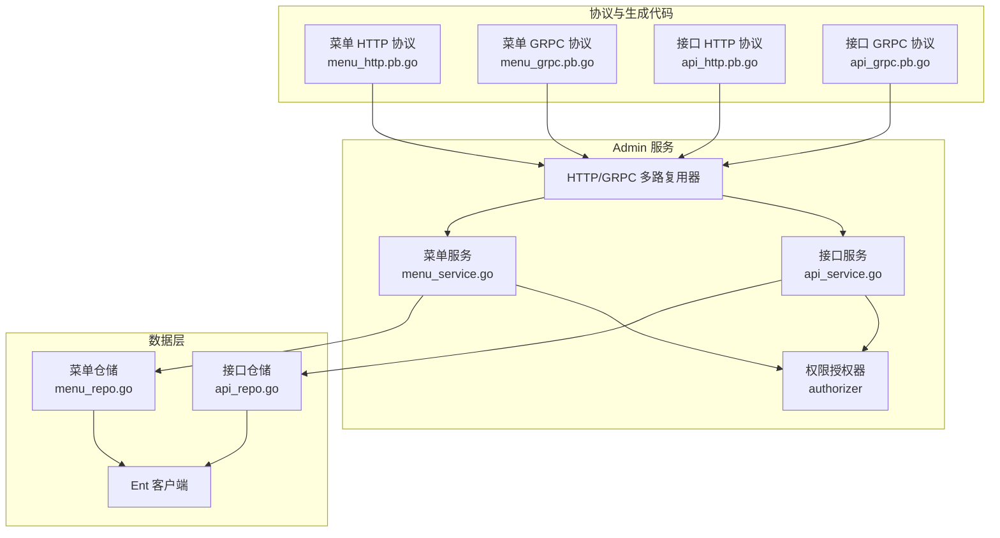
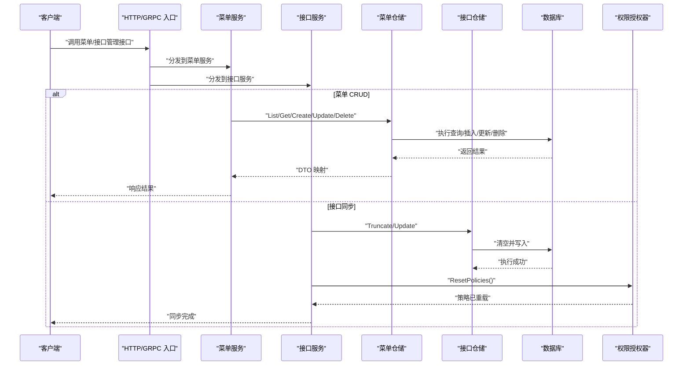
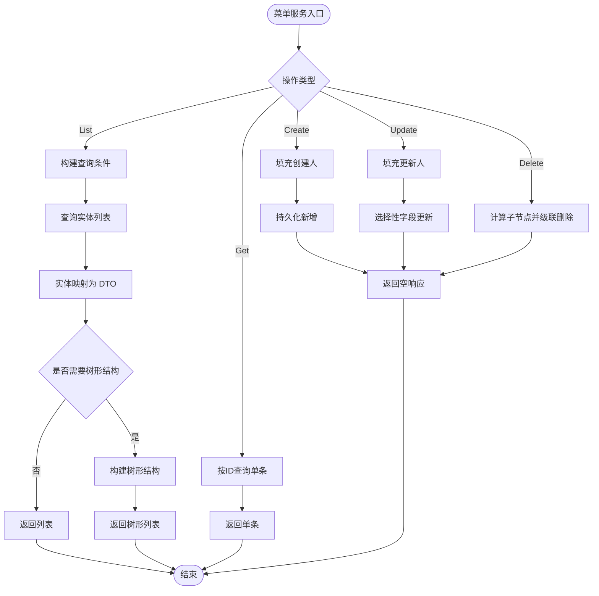
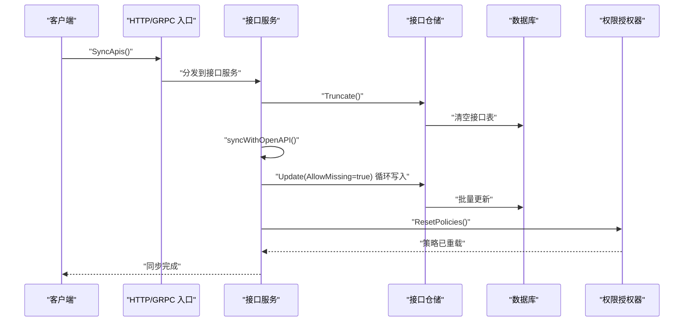
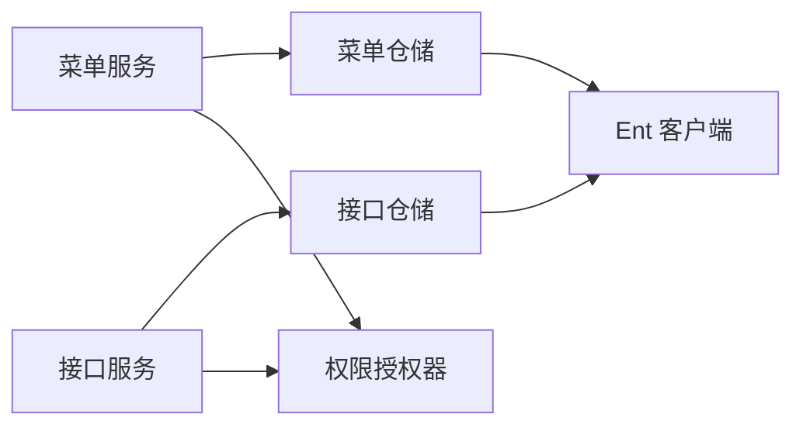

# 系统管理 API

<cite>
**本文引用的文件**
- [main.go](file://backend/app/admin/service/cmd/server/main.go)
- [menu_service.go](file://backend/app/admin/service/internal/service/menu_service.go)
- [menu_repo.go](file://backend/app/admin/service/internal/data/menu_repo.go)
- [default_data.go](file://backend/pkg/constants/default_data.go)
- [api_service.go](file://backend/app/admin/service/internal/service/api_service.go)
- [api_repo.go](file://backend/app/admin/service/internal/data/api_repo.go)
- [i_menu_http.pb.go](file://backend/api/gen/go/admin/service/v1/i_menu_http.pb.go)
- [i_menu_grpc.pb.go](file://backend/api/gen/go/admin/service/v1/i_menu_grpc.pb.go)
- [menu_grpc.pb.go](file://backend/api/gen/go/resource/service/v1/menu_grpc.pb.go)
- [menu_http.pb.go](file://backend/api/gen/go/resource/service/v1/menu_http.pb.go)
- [i_api_http.pb.go](file://backend/api/gen/go/admin/service/v1/i_api_http.pb.go)
- [i_api_grpc.pb.go](file://backend/api/gen/go/admin/service/v1/i_api_grpc.pb.go)
- [api_grpc.pb.go](file://backend/api/gen/go/resource/service/v1/api_grpc.pb.go)
- [api_http.pb.go](file://backend/api/gen/go/resource/service/v1/api_http.pb.go)
</cite>

## 目录
1. [简介](#简介)
2. [项目结构](#项目结构)
3. [核心组件](#核心组件)
4. [架构总览](#架构总览)
5. [详细组件分析](#详细组件分析)
6. [依赖分析](#依赖分析)
7. [性能考虑](#性能考虑)
8. [故障排查指南](#故障排查指南)
9. [结论](#结论)
10. [附录](#附录)

## 简介
本文件为 GoWind Admin 的“系统管理 API”技术文档，聚焦以下能力：
- 菜单管理：支持菜单的增删改查、树形结构构建与层级关系维护
- 接口管理：支持接口资源的自动发现与同步、接口与权限策略联动
- 字典管理：基于字典类型与字典项的多语言与业务参数支撑
- 系统配置：默认菜单、权限、角色、语言等初始化数据
- 权限配置：菜单与接口权限绑定、权限策略重载
- API 资源管理：接口资源的持久化与查询
- 接口文档自动生成：基于 OpenAPI 文档的接口清单同步
- 前端菜单生成机制：后端菜单数据与前端路由的衔接
- 系统监控与运维：服务启动、健康检查与运维脚本

## 项目结构
后端采用 Kratos 应用框架，Admin 服务作为系统管理模块入口，通过 HTTP/GRPC 提供菜单与接口管理能力，并集成权限授权器进行策略重载。

**图表来源**
- [main.go:46-75](file://backend/app/admin/service/cmd/server/main.go#L46-L75)
- [menu_service.go:22-39](file://backend/app/admin/service/internal/service/menu_service.go#L22-L39)
- [api_service.go:31-55](file://backend/app/admin/service/internal/service/api_service.go#L31-L55)
- [menu_repo.go:27-57](file://backend/app/admin/service/internal/data/menu_repo.go#L27-L57)
- [api_repo.go:25-55](file://backend/app/admin/service/internal/data/api_repo.go#L25-L55)

**章节来源**
- [main.go:1-76](file://backend/app/admin/service/cmd/server/main.go#L1-L76)

## 核心组件
- 菜单服务：负责菜单的 CRUD、树形构建与默认菜单初始化
- 菜单仓储：封装 Ent 查询、映射与更新逻辑
- 接口服务：负责接口资源的查询、创建、更新、删除与同步
- 接口仓储：封装接口资源的持久化与批量写入
- 权限授权器：在接口变更后重置策略，确保权限生效
- 默认数据常量：内置默认菜单、权限、角色、语言等初始化数据

**章节来源**
- [menu_service.go:48-139](file://backend/app/admin/service/internal/service/menu_service.go#L48-L139)
- [menu_repo.go:91-308](file://backend/app/admin/service/internal/data/menu_repo.go#L91-L308)
- [api_service.go:68-295](file://backend/app/admin/service/internal/service/api_service.go#L68-L295)
- [api_repo.go:92-326](file://backend/app/admin/service/internal/data/api_repo.go#L92-L326)
- [default_data.go:277-790](file://backend/pkg/constants/default_data.go#L277-L790)

## 架构总览
系统管理 API 通过 HTTP/GRPC 对外暴露菜单与接口管理能力，内部以服务层协调仓储层完成数据持久化；接口同步流程结合 OpenAPI 文档与路由遍历两种方式，确保接口资源与实际路由一致；权限策略在接口资源变更后自动重载，保障鉴权一致性。

**图表来源**
- [menu_service.go:48-139](file://backend/app/admin/service/internal/service/menu_service.go#L48-L139)
- [menu_repo.go:91-308](file://backend/app/admin/service/internal/data/menu_repo.go#L91-L308)
- [api_service.go:144-221](file://backend/app/admin/service/internal/service/api_service.go#L144-L221)
- [api_repo.go:318-326](file://backend/app/admin/service/internal/data/api_repo.go#L318-L326)

## 详细组件分析

### 菜单管理 API
- 功能范围
  - 列表与树形构建：支持分页查询与父子关系转树形
  - 单条查询：按 ID 获取菜单详情
  - 新增：记录创建人并持久化
  - 更新：支持字段选择性更新与 JSON 子字段增量更新
  - 删除：级联删除子节点
  - 初始化：首次启动时根据默认菜单常量创建基础菜单
- 关键实现要点
  - 服务层从请求上下文提取操作人信息，填充创建/更新字段
  - 仓储层使用 Ent 与通用仓库封装，支持枚举转换与时间戳转换
  - 树形构建通过工具函数将线性列表转为树结构
- 前端菜单生成机制
  - 默认菜单常量中包含前端路由元信息（标题、图标、权限、是否隐藏等）
  - 前端根据后端返回的菜单树渲染导航与页面路由

**图表来源**
- [menu_service.go:48-139](file://backend/app/admin/service/internal/service/menu_service.go#L48-L139)
- [menu_repo.go:91-308](file://backend/app/admin/service/internal/data/menu_repo.go#L91-L308)

**章节来源**
- [menu_service.go:48-139](file://backend/app/admin/service/internal/service/menu_service.go#L48-L139)
- [menu_repo.go:91-308](file://backend/app/admin/service/internal/data/menu_repo.go#L91-L308)
- [default_data.go:277-790](file://backend/pkg/constants/default_data.go#L277-L790)

### 接口管理 API
- 功能范围
  - 列表与单条查询：支持分页与按 ID 查询
  - 新增/更新/删除：支持选择性更新与存在即更新
  - 同步接口资源：两种同步方式
    - 基于 OpenAPI 文档：解析文档中的路径与操作，生成接口资源
    - 基于路由遍历：遍历服务路由，生成接口资源
  - 策略重载：接口资源变更后重置权限策略
- 关键实现要点
  - 服务层在新增/更新/删除后触发授权器重载
  - 仓储层支持批量写入与清空表
  - OpenAPI 同步会读取内置 OpenAPI 数据并解析标签作为模块信息

**图表来源**
- [api_service.go:144-221](file://backend/app/admin/service/internal/service/api_service.go#L144-L221)
- [api_repo.go:318-326](file://backend/app/admin/service/internal/data/api_repo.go#L318-L326)

**章节来源**
- [api_service.go:68-295](file://backend/app/admin/service/internal/service/api_service.go#L68-L295)
- [api_repo.go:92-326](file://backend/app/admin/service/internal/data/api_repo.go#L92-L326)

### 字典管理与系统配置 API
- 字典类型与字典项
  - 字典类型与字典项由独立的服务定义，支持多语言与状态控制
  - 字典项与字典类型关联，用于业务参数与国际化文案
- 国际化配置
  - 默认语言常量包含多种语言及其排序、默认状态
  - 前端通过语言切换与字典项实现多语言展示
- 系统参数设置
  - 默认菜单常量中包含系统模块的菜单树，涵盖系统管理、租户管理、权限管理、审计日志、文件管理、任务管理、登录策略、语言管理等
  - 菜单元信息包含权限码数组，用于前端/后端权限控制

**章节来源**
- [default_data.go:266-275](file://backend/pkg/constants/default_data.go#L266-L275)
- [default_data.go:277-790](file://backend/pkg/constants/default_data.go#L277-L790)

### 权限配置与接口文档自动生成
- 权限配置
  - 菜单与接口权限通过权限授权器统一管理
  - 接口资源变更后自动重载策略，确保权限即时生效
- 接口文档自动生成
  - 支持基于 OpenAPI 文档的同步，自动提取路径、方法、模块与描述
  - 支持基于路由遍历的同步，便于在未提供 OpenAPI 的场景下使用

**章节来源**
- [api_service.go:94-141](file://backend/app/admin/service/internal/service/api_service.go#L94-L141)
- [api_service.go:163-221](file://backend/app/admin/service/internal/service/api_service.go#L163-L221)

### 前端菜单生成机制
- 后端默认菜单常量中包含前端路由元信息（标题、图标、权限、是否隐藏、是否缓存等）
- 前端根据后端返回的菜单树渲染导航与页面路由，实现“后端驱动前端菜单”的机制

**章节来源**
- [default_data.go:277-790](file://backend/pkg/constants/default_data.go#L277-L790)

## 依赖分析
- 组件耦合
  - 服务层依赖仓储层，仓储层依赖 Ent 客户端
  - 接口服务依赖权限授权器，在资源变更后触发策略重载
- 外部依赖
  - Kratos HTTP/GRPC 框架
  - Ent ORM
  - OpenAPI 解析库
  - 通用 CRUD 工具与枚举转换器

**图表来源**
- [menu_service.go:22-39](file://backend/app/admin/service/internal/service/menu_service.go#L22-L39)
- [api_service.go:31-55](file://backend/app/admin/service/internal/service/api_service.go#L31-L55)
- [menu_repo.go:27-57](file://backend/app/admin/service/internal/data/menu_repo.go#L27-L57)
- [api_repo.go:25-55](file://backend/app/admin/service/internal/data/api_repo.go#L25-L55)

**章节来源**
- [menu_service.go:22-39](file://backend/app/admin/service/internal/service/menu_service.go#L22-L39)
- [api_service.go:31-55](file://backend/app/admin/service/internal/service/api_service.go#L31-L55)

## 性能考虑
- 批量写入：接口同步支持批量写入，减少多次往返
- 分页查询：列表接口支持分页，避免一次性加载过多数据
- 选择性更新：更新接口支持字段选择性更新，降低写放大
- 策略重载：仅在接口资源发生变更时重载策略，避免频繁重载

## 故障排查指南
- OpenAPI 文档加载失败
  - 现象：同步接口资源时报错，提示加载失败或文档为空
  - 排查：确认内置 OpenAPI 数据是否存在且格式正确
- 路由遍历不可用
  - 现象：基于路由遍历的同步报错，提示路由遍历器为空
  - 排查：确认服务启动时已注册路由遍历器
- 权限策略未生效
  - 现象：接口资源已更新但权限仍按旧策略执行
  - 排查：确认接口服务在变更后已调用授权器重载策略
- 菜单树形结构异常
  - 现象：前端菜单显示层级错误
  - 排查：确认菜单父 ID 与 ID 匹配关系正确，以及树形构建逻辑正常

**章节来源**
- [api_service.go:163-179](file://backend/app/admin/service/internal/service/api_service.go#L163-L179)
- [api_service.go:224-247](file://backend/app/admin/service/internal/service/api_service.go#L224-L247)
- [menu_repo.go:117-125](file://backend/app/admin/service/internal/data/menu_repo.go#L117-L125)

## 结论
本系统管理 API 通过清晰的服务-仓储分层、完善的菜单与接口管理能力、自动化的接口文档同步与权限策略重载，实现了对系统配置、菜单与接口资源的高效管理。配合默认数据常量与前端菜单生成机制，能够快速搭建并维护后台管理系统的导航与权限体系。

## 附录

### API 定义与协议
- 菜单管理
  - HTTP 协议：菜单 HTTP 协议生成文件
  - GRPC 协议：菜单 GRPC 协议生成文件
- 接口管理
  - HTTP 协议：接口 HTTP 协议生成文件
  - GRPC 协议：接口 GRPC 协议生成文件

**章节来源**
- [i_menu_http.pb.go](file://backend/api/gen/go/admin/service/v1/i_menu_http.pb.go)
- [i_menu_grpc.pb.go](file://backend/api/gen/go/admin/service/v1/i_menu_grpc.pb.go)
- [menu_grpc.pb.go](file://backend/api/gen/go/resource/service/v1/menu_grpc.pb.go)
- [menu_http.pb.go](file://backend/api/gen/go/resource/service/v1/menu_http.pb.go)
- [i_api_http.pb.go](file://backend/api/gen/go/admin/service/v1/i_api_http.pb.go)
- [i_api_grpc.pb.go](file://backend/api/gen/go/admin/service/v1/i_api_grpc.pb.go)
- [api_grpc.pb.go](file://backend/api/gen/go/resource/service/v1/api_grpc.pb.go)
- [api_http.pb.go](file://backend/api/gen/go/resource/service/v1/api_http.pb.go)