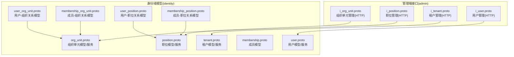
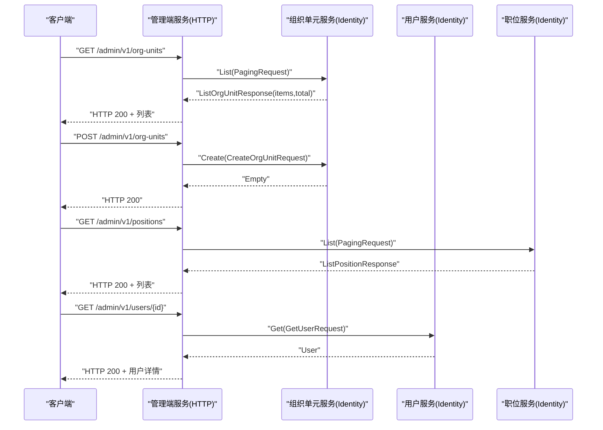
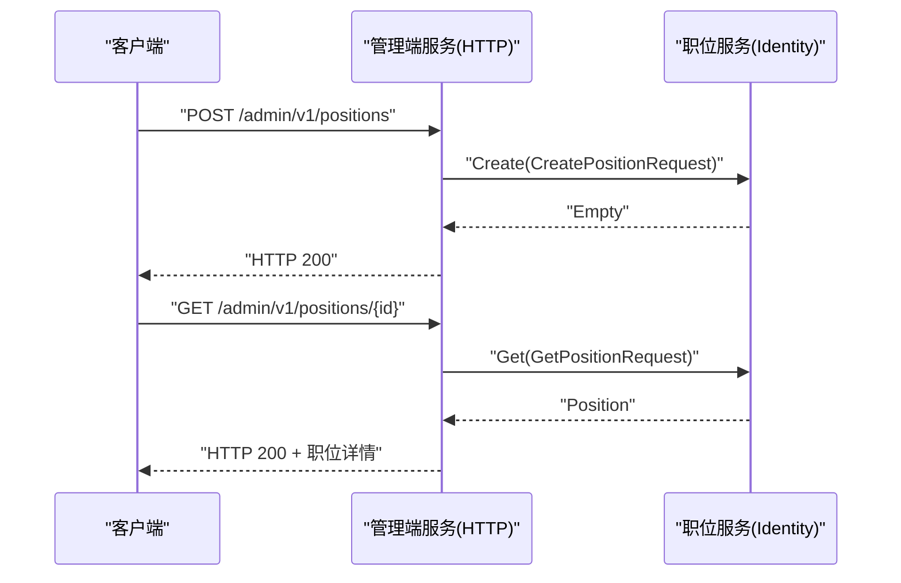
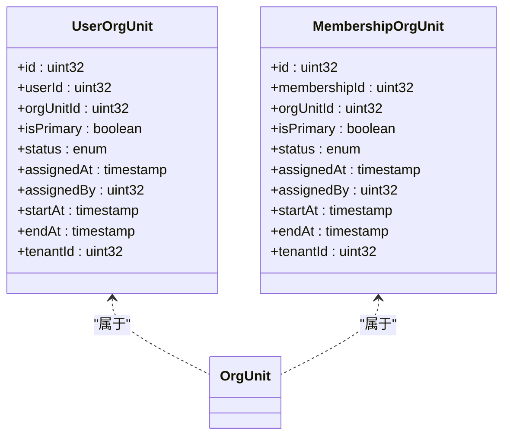
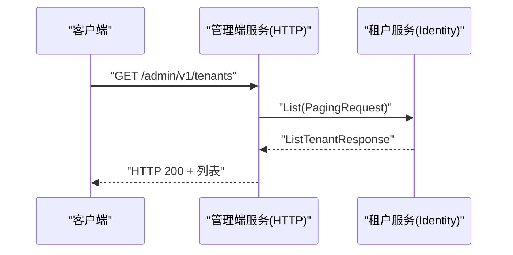
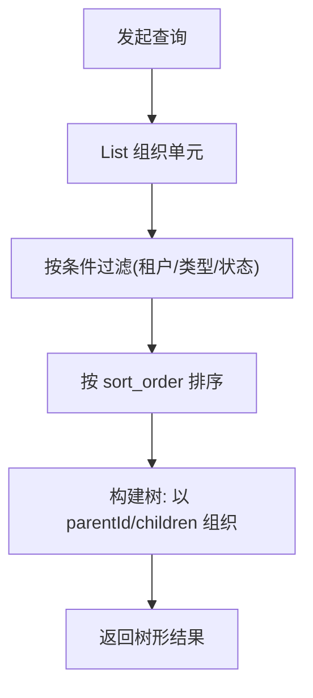
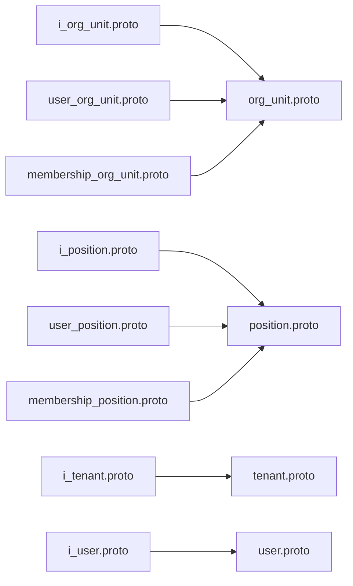

# 组织管理 API

<cite>
**本文引用的文件**
- [i_org_unit.proto](file://backend/api/protos/admin/service/v1/i_org_unit.proto)
- [org_unit.proto](file://backend/api/protos/identity/service/v1/org_unit.proto)
- [membership_org_unit.proto](file://backend/api/protos/identity/service/v1/membership_org_unit.proto)
- [user_org_unit.proto](file://backend/api/protos/identity/service/v1/user_org_unit.proto)
- [i_position.proto](file://backend/api/protos/admin/service/v1/i_position.proto)
- [position.proto](file://backend/api/protos/identity/service/v1/position.proto)
- [membership_position.proto](file://backend/api/protos/identity/service/v1/membership_position.proto)
- [user_position.proto](file://backend/api/protos/identity/service/v1/user_position.proto)
- [i_tenant.proto](file://backend/api/protos/admin/service/v1/i_tenant.proto)
- [tenant.proto](file://backend/api/protos/identity/service/v1/tenant.proto)
- [i_user.proto](file://backend/api/protos/admin/service/v1/i_user.proto)
- [user.proto](file://backend/api/protos/identity/service/v1/user.proto)
- [membership.proto](file://backend/api/protos/identity/service/v1/membership.proto)
- [membership_role.proto](file://backend/api/protos/permission\service\v1/membership_role.proto)
</cite>

## 目录
1. [简介](#简介)
2. [项目结构](#项目结构)
3. [核心组件](#核心组件)
4. [架构总览](#架构总览)
5. [详细组件分析](#详细组件分析)
6. [依赖分析](#依赖分析)
7. [性能考虑](#性能考虑)
8. [故障排查指南](#故障排查指南)
9. [结论](#结论)
10. [附录](#附录)

## 简介
本文件面向 GoWind Admin 的组织管理能力，聚焦以下目标：
- 租户管理、组织单元管理、部门管理、职位管理的接口定义与使用说明
- 组织架构树形结构操作、层级关系维护与组织单元 CRUD
- 用户组织关系管理、部门成员管理、职位分配机制
- 组织架构查询、组织树构建与组织关系分析的 API 示例
- 组织数据隔离、多租户支持与组织权限控制策略

## 项目结构
组织管理相关 API 主要由两层协议定义组成：
- 管理端对外接口：位于 admin/service/v1，提供 /admin/v1 前缀的 HTTP 映射
- 身份域内部模型与服务：位于 identity/service/v1，提供通用的组织、用户、职位、成员关系等数据模型与 RPC 定义



图表来源
- [i_org_unit.proto:12-49](file://backend/api/protos/admin/service/v1/i_org_unit.proto#L12-L49)
- [org_unit.proto:13-34](file://backend/api/protos/identity/service/v1/org_unit.proto#L13-L34)
- [i_position.proto:13-50](file://backend/api/protos/admin/service/v1/i_position.proto#L13-L50)
- [position.proto](file://backend/api/protos/identity/service/v1/position.proto)
- [i_tenant.proto](file://backend/api/protos/admin/service/v1/i_tenant.proto)
- [tenant.proto](file://backend/api/protos/identity/service/v1/tenant.proto)
- [i_user.proto](file://backend/api/protos/admin/service/v1/i_user.proto)
- [user.proto](file://backend/api/protos/identity/service/v1/user.proto)
- [user_org_unit.proto:9-75](file://backend/api/protos/identity/service/v1/user_org_unit.proto#L9-L75)
- [membership_org_unit.proto:9-75](file://backend/api/protos/identity/service/v1/membership_org_unit.proto#L9-L75)
- [user_position.proto](file://backend/api/protos/identity/service/v1/user_position.proto)
- [membership_position.proto](file://backend/api/protos/identity/service/v1/membership_position.proto)
- [membership.proto](file://backend/api/protos/identity/service/v1/membership.proto)

章节来源
- [i_org_unit.proto:1-50](file://backend/api/protos/admin/service/v1/i_org_unit.proto#L1-L50)
- [i_position.proto:1-51](file://backend/api/protos/admin/service/v1/i_position.proto#L1-L51)
- [org_unit.proto:1-257](file://backend/api/protos/identity/service/v1/org_unit.proto#L1-L257)
- [position.proto](file://backend/api/protos/identity/service/v1/position.proto)
- [user_org_unit.proto:1-76](file://backend/api/protos/identity/service/v1/user_org_unit.proto#L1-L76)
- [membership_org_unit.proto:1-75](file://backend/api/protos/identity/service/v1/membership_org_unit.proto#L1-L75)
- [user_position.proto](file://backend/api/protos/identity/service/v1/user_position.proto)
- [membership_position.proto](file://backend/api/protos/identity/service/v1/membership_position.proto)
- [membership.proto](file://backend/api/protos/identity/service/v1/membership.proto)
- [i_tenant.proto](file://backend/api/protos/admin/service/v1/i_tenant.proto)
- [tenant.proto](file://backend/api/protos/identity/service/v1/tenant.proto)
- [i_user.proto](file://backend/api/protos/admin/service/v1/i_user.proto)
- [user.proto](file://backend/api/protos/identity/service/v1/user.proto)

## 核心组件
- 组织单元管理（Admin 对外 + Identity 内部）
  - 管理端 HTTP 接口：列出、查询、创建、更新、删除组织单元
  - 内部模型：组织单元实体、树形结构、状态与类型枚举、租户关联、扩展属性、地理与时间信息等
- 职位管理（Admin 对外 + Identity 内部）
  - 管理端 HTTP 接口：列出、查询、创建、更新、删除职位
  - 内部模型：职位实体、状态与等级、与组织单元的映射关系
- 用户与组织/职位关系
  - 用户-组织关系：用户在组织中的主/非主归属、生效/失效时间、分配者、状态
  - 成员-组织关系：成员到组织的关联，支持主组织标记与时间窗口
  - 用户-职位关系：用户在组织内的职位分配、生效/失效时间、分配者、状态
  - 成员-职位关系：成员到职位的关联，支持时间窗口与状态
- 租户管理（Admin 对外 + Identity 内部）
  - 管理端 HTTP 接口：租户的增删改查
  - 内部模型：租户实体、标识与元数据
- 权限与角色（间接支撑）
  - 成员-角色关系：用于组织维度的权限控制与继承

章节来源
- [i_org_unit.proto:12-49](file://backend/api/protos/admin/service/v1/i_org_unit.proto#L12-L49)
- [org_unit.proto:37-182](file://backend/api/protos/identity/service/v1/org_unit.proto#L37-L182)
- [i_position.proto:13-50](file://backend/api/protos/admin/service/v1/i_position.proto#L13-L50)
- [position.proto](file://backend/api/protos/identity/service/v1/position.proto)
- [user_org_unit.proto:9-75](file://backend/api/protos/identity/service/v1/user_org_unit.proto#L9-L75)
- [membership_org_unit.proto:9-75](file://backend/api/protos/identity/service/v1/membership_org_unit.proto#L9-L75)
- [user_position.proto](file://backend/api/protos/identity/service/v1/user_position.proto)
- [membership_position.proto](file://backend/api/protos/identity/service/v1/membership_position.proto)
- [membership_role.proto](file://backend/api/protos/permission\service\v1/membership_role.proto)
- [i_tenant.proto](file://backend/api/protos/admin/service/v1/i_tenant.proto)
- [tenant.proto](file://backend/api/protos/identity/service/v1/tenant.proto)
- [i_user.proto](file://backend/api/protos/admin/service/v1/i_user.proto)
- [user.proto](file://backend/api/protos/identity/service/v1/user.proto)

## 架构总览
下图展示管理端 HTTP 接口与身份域内部服务之间的调用关系，以及组织树、用户-组织/职位关系的数据流。



图表来源
- [i_org_unit.proto:14-18](file://backend/api/protos/admin/service/v1/i_org_unit.proto#L14-L18)
- [org_unit.proto:14-15](file://backend/api/protos/identity/service/v1/org_unit.proto#L14-L15)
- [i_position.proto:15-19](file://backend/api/protos/admin/service/v1/i_position.proto#L15-L19)
- [position.proto](file://backend/api/protos/identity/service/v1/position.proto)
- [i_user.proto](file://backend/api/protos/admin/service/v1/i_user.proto)
- [user.proto](file://backend/api/protos/identity/service/v1/user.proto)

## 详细组件分析

### 组织单元管理（组织树与 CRUD）
- HTTP 接口
  - 列表：GET /admin/v1/org-units
  - 详情：GET /admin/v1/org-units/{id}
  - 新增：POST /admin/v1/org-units（body 透传）
  - 更新：PUT /admin/v1/org-units/{id}（body 透传）
  - 删除：DELETE /admin/v1/org-units/{id}
- 数据模型要点
  - 树形结构：包含父节点与子节点，支持路径 path 与排序 order
  - 类型枚举：公司、分部、部门、团队、项目、委员会、区域、子公司、分支机构等
  - 状态枚举：启用/禁用
  - 扩展属性：业务范围、法定主体、联系方式、时区、国家、经纬度、生效时间窗、自定义属性等
  - 租户字段：tenant_id/tenant_name 支持多租户隔离
- 关键流程
  - 创建/更新时可指定 FieldMask 控制更新字段
  - 支持批量创建组织单元
  - 支持统计数量

```mermaid
flowchart TD
Start(["请求进入"]) --> Method{"HTTP 方法"}
Method --> |GET /admin/v1/org-units| List["调用组织单元服务 List"]
Method --> |GET /admin/v1/org-units/{id}| Get["调用组织单元服务 Get"]
Method --> |POST /admin/v1/org-units| Create["调用组织单元服务 Create"]
Method --> |PUT /admin/v1/org-units/{id}| Update["调用组织单元服务 Update<br/>支持 FieldMask"]
Method --> |DELETE /admin/v1/org-units/{id}| Delete["调用组织单元服务 Delete"]
List --> Resp["返回列表与总数"]
Get --> Resp
Create --> Ok["返回空响应"]
Update --> Ok
Delete --> Ok
Resp --> End(["完成"])
Ok --> End
```

图表来源
- [i_org_unit.proto:14-48](file://backend/api/protos/admin/service/v1/i_org_unit.proto#L14-L48)
- [org_unit.proto:14-34](file://backend/api/protos/identity/service/v1/org_unit.proto#L14-L34)
- [org_unit.proto:208-230](file://backend/api/protos/identity/service/v1/org_unit.proto#L208-L230)

章节来源
- [i_org_unit.proto:12-49](file://backend/api/protos/admin/service/v1/i_org_unit.proto#L12-L49)
- [org_unit.proto:37-182](file://backend/api/protos/identity/service/v1/org_unit.proto#L37-L182)
- [org_unit.proto:208-230](file://backend/api/protos/identity/service/v1/org_unit.proto#L208-L230)

### 职位管理（职位 CRUD）
- HTTP 接口
  - 列表：GET /admin/v1/positions
  - 详情：GET /admin/v1/positions/{id}
  - 新增：POST /admin/v1/positions（body 透传）
  - 更新：PUT /admin/v1/positions/{id}（body 透传）
  - 删除：DELETE /admin/v1/positions/{id}
- 数据模型要点
  - 职位实体包含状态、等级、与组织单元的映射关系
  - 支持生效/失效时间窗、分配者、创建/更新/删除元数据



图表来源
- [i_position.proto:15-26](file://backend/api/protos/admin/service/v1/i_position.proto#L15-L26)
- [position.proto](file://backend/api/protos/identity/service/v1/position.proto)

章节来源
- [i_position.proto:13-50](file://backend/api/protos/admin/service/v1/i_position.proto#L13-L50)
- [position.proto](file://backend/api/protos/identity/service/v1/position.proto)

### 用户组织关系管理（部门成员与主组织）
- 关系模型
  - 用户-组织关系：用户在组织中的主/非主归属、状态、生效/失效时间、分配者
  - 成员-组织关系：成员到组织的关联，支持主组织标记与时间窗口
- 字段要点
  - is_primary：是否主组织
  - status：激活/待激活/非激活/暂停/已过期
  - assigned_at/assigned_by：分配时间与分配者
  - start_at/end_at：生效/失效时间窗
  - tenant_id：租户隔离
- 使用场景
  - 将用户加入某部门，并标记为主组织
  - 设置成员在组织内的生效时间窗
  - 查询用户当前有效的组织归属



图表来源
- [user_org_unit.proto:9-75](file://backend/api/protos/identity/service/v1/user_org_unit.proto#L9-L75)
- [membership_org_unit.proto:9-75](file://backend/api/protos/identity/service/v1/membership_org_unit.proto#L9-L75)
- [org_unit.proto:37-182](file://backend/api/protos/identity/service/v1/org_unit.proto#L37-L182)

章节来源
- [user_org_unit.proto:9-75](file://backend/api/protos/identity/service/v1/user_org_unit.proto#L9-L75)
- [membership_org_unit.proto:9-75](file://backend/api/protos/identity/service/v1/membership_org_unit.proto#L9-L75)
- [org_unit.proto:37-182](file://backend/api/protos/identity/service/v1/org_unit.proto#L37-L182)

### 用户职位分配机制
- 关系模型
  - 用户-职位关系：用户在组织内的职位分配、生效/失效时间、分配者、状态
  - 成员-职位关系：成员到职位的关联，支持时间窗口与状态
- 字段要点
  - is_primary：是否主组织（与职位分配配合使用）
  - status：状态枚举
  - start_at/end_at：生效/失效时间窗
  - assigned_by：分配者
- 使用场景
  - 为用户分配职位，限定生效时间窗
  - 查询用户在组织内的所有有效职位


图表来源
- [user_position.proto](file://backend/api/protos/identity/service/v1/user_position.proto)
- [membership_position.proto](file://backend/api/protos/identity/service/v1/membership_position.proto)
- [position.proto](file://backend/api/protos/identity/service/v1/position.proto)

章节来源
- [user_position.proto](file://backend/api/protos/identity/service/v1/user_position.proto)
- [membership_position.proto](file://backend/api/protos/identity/service/v1/membership_position.proto)
- [position.proto](file://backend/api/protos/identity/service/v1/position.proto)

### 租户管理与多租户支持
- 管理端接口
  - 租户 CRUD：通过 /admin/v1/tenants 下的 HTTP 接口进行
- 内部模型
  - 租户实体包含标识与元数据
  - 组织单元与用户关系模型均包含 tenant_id 字段，确保数据隔离
- 多租户策略
  - 所有组织、用户、职位、关系模型均携带租户标识
  - 查询与写入操作应按当前租户上下文过滤或校验



图表来源
- [i_tenant.proto](file://backend/api/protos/admin/service/v1/i_tenant.proto)
- [tenant.proto](file://backend/api/protos/identity/service/v1/tenant.proto)

章节来源
- [i_tenant.proto](file://backend/api/protos/admin/service/v1/i_tenant.proto)
- [tenant.proto](file://backend/api/protos/identity/service/v1/tenant.proto)
- [org_unit.proto:85-86](file://backend/api/protos/identity/service/v1/org_unit.proto#L85-L86)
- [user_org_unit.proto:30-33](file://backend/api/protos/identity/service/v1/user_org_unit.proto#L30-L33)

### 组织架构查询、组织树构建与关系分析
- 组织树构建
  - 依据组织单元的父子关系与 path 字段，可从根到叶逐级构建树
  - 支持按 sort_order 排序，保证同级顺序
- 关系分析
  - 用户-组织关系：可查询用户的主组织与所有有效组织归属
  - 用户-职位关系：可查询用户在组织内的有效职位集合
  - 成员-组织/职位关系：支持成员维度的聚合与时间窗分析
- 查询示例
  - 列出组织单元：GET /admin/v1/org-units
  - 获取组织详情（含子树）：GET /admin/v1/org-units/{id}
  - 过滤字段：通过请求参数控制返回字段（参考内部模型中的视图字段过滤器）



图表来源
- [i_org_unit.proto:14-18](file://backend/api/protos/admin/service/v1/i_org_unit.proto#L14-L18)
- [org_unit.proto:172-173](file://backend/api/protos/identity/service/v1/org_unit.proto#L172-L173)
- [org_unit.proto:70-73](file://backend/api/protos/identity/service/v1/org_unit.proto#L70-L73)

章节来源
- [i_org_unit.proto:14-25](file://backend/api/protos/admin/service/v1/i_org_unit.proto#L14-L25)
- [org_unit.proto:172-182](file://backend/api/protos/identity/service/v1/org_unit.proto#L172-L182)
- [user_org_unit.proto:30-33](file://backend/api/protos/identity/service/v1/user_org_unit.proto#L30-L33)

### 权限控制与组织权限策略
- 成员-角色关系
  - 通过成员-角色关系实现基于组织的权限继承与覆盖
  - 可结合组织树与职位映射角色，形成灵活的权限矩阵
- 策略建议
  - 在用户登录后，加载其主组织与有效组织集合，再叠加职位角色
  - 对敏感操作进行“组织范围”校验，确保仅对当前租户与有效组织内的对象执行

章节来源
- [membership_role.proto](file://backend/api/protos/permission\service\v1/membership_role.proto)
- [membership.proto](file://backend/api/protos/identity/service/v1/membership.proto)

## 依赖分析
- 管理端对外接口依赖身份域内部服务与模型
- 组织树与用户/职位关系通过关系模型解耦，便于横向扩展
- 多租户通过租户字段贯穿组织、用户、职位与关系模型



图表来源
- [i_org_unit.proto:8-10](file://backend/api/protos/admin/service/v1/i_org_unit.proto#L8-L10)
- [org_unit.proto](file://backend/api/protos/identity/service/v1/org_unit.proto#L10)
- [i_position.proto:8-10](file://backend/api/protos/admin/service/v1/i_position.proto#L8-L10)
- [position.proto](file://backend/api/protos/identity/service/v1/position.proto)
- [i_tenant.proto](file://backend/api/protos/admin/service/v1/i_tenant.proto)
- [tenant.proto](file://backend/api/protos/identity/service/v1/tenant.proto)
- [i_user.proto](file://backend/api/protos/admin/service/v1/i_user.proto)
- [user.proto](file://backend/api/protos/identity/service/v1/user.proto)
- [user_org_unit.proto:1-76](file://backend/api/protos/identity/service/v1/user_org_unit.proto#L1-L76)
- [membership_org_unit.proto:1-75](file://backend/api/protos/identity/service/v1/membership_org_unit.proto#L1-L75)
- [user_position.proto](file://backend/api/protos/identity/service/v1/user_position.proto)
- [membership_position.proto](file://backend/api/protos/identity/service/v1/membership_position.proto)

章节来源
- [i_org_unit.proto:8-10](file://backend/api/protos/admin/service/v1/i_org_unit.proto#L8-L10)
- [org_unit.proto](file://backend/api/protos/identity/service/v1/org_unit.proto#L10)
- [i_position.proto:8-10](file://backend/api/protos/admin/service/v1/i_position.proto#L8-L10)
- [position.proto](file://backend/api/protos/identity/service/v1/position.proto)
- [user_org_unit.proto:1-76](file://backend/api/protos/identity/service/v1/user_org_unit.proto#L1-L76)
- [membership_org_unit.proto:1-75](file://backend/api/protos/identity/service/v1/membership_org_unit.proto#L1-L75)
- [user_position.proto](file://backend/api/protos/identity/service/v1/user_position.proto)
- [membership_position.proto](file://backend/api/protos/identity/service/v1/membership_position.proto)

## 性能考虑
- 分页与字段裁剪
  - 使用分页请求与视图字段过滤器减少传输与处理开销
- 树构建优化
  - 优先按 sort_order 与 path 进行索引，避免深度递归导致的 N+1 查询
- 时间窗过滤
  - 在查询用户组织/职位关系时，利用生效/失效时间窗进行预过滤
- 批量操作
  - 使用批量创建组织单元接口降低网络往返

## 故障排查指南
- 常见问题
  - 404：组织/职位/用户不存在或已被删除
  - 400：请求体格式错误、字段缺失或非法
  - 403：无权限访问目标租户或组织
  - 409：违反唯一性约束（如组织编码、外部 ID）
- 排查步骤
  - 确认租户上下文与请求头中的租户标识一致
  - 检查组织/职位的状态与生效时间窗
  - 校验用户-组织/职位关系的时间窗与状态
  - 查看日志与审计记录定位异常点

## 结论
GoWind Admin 的组织管理 API 通过清晰的管理端 HTTP 接口与身份域内部模型，实现了：
- 组织单元的树形结构与 CRUD
- 职位的全生命周期管理
- 用户与组织/职位的关系管理与时间窗控制
- 多租户隔离与权限控制的基础支撑

建议在生产环境中结合分页、字段裁剪、时间窗过滤与批量接口，以获得更优的性能与稳定性。

## 附录
- API 列表概览
  - 组织单元：GET/POST/GET(PK)/PUT(PK)/DELETE(PK)
  - 职位：GET/POST/GET(PK)/PUT(PK)/DELETE(PK)
  - 租户：由管理端租户接口提供（参见租户模型）
  - 用户：由管理端用户接口提供（参见用户模型）
- 关键字段速查
  - 组织单元：id、name、code、type、path、parent_id、children、sort_order、status、tenant_id、business_scopes、attributes、permission_tags、start_at、end_at
  - 用户-组织：user_id、org_unit_id、is_primary、status、assigned_at、assigned_by、start_at、end_at、tenant_id
  - 用户-职位：user_id、position_id、org_unit_id、status、assigned_at、assigned_by、start_at、end_at、tenant_id
  - 租户：tenant_id、tenant_name（贯穿组织/用户/职位/关系模型）