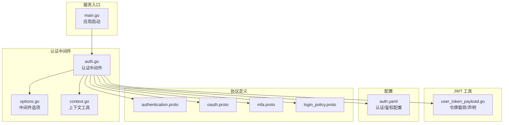
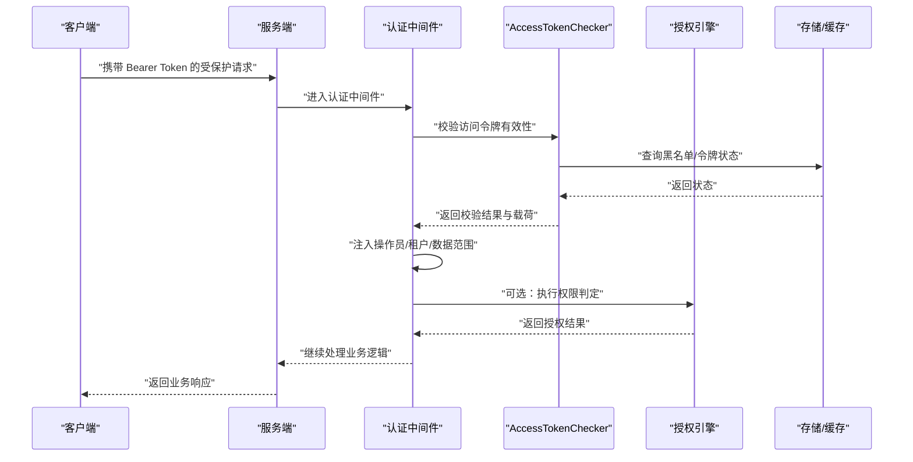
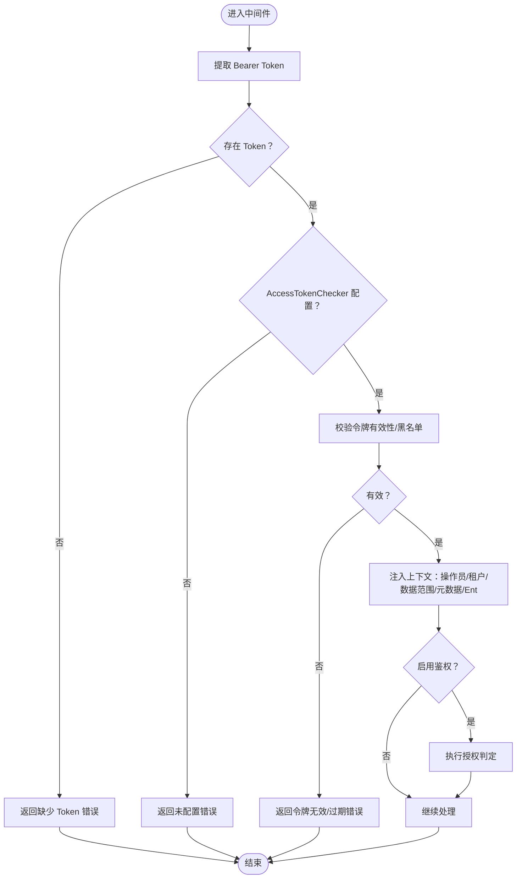
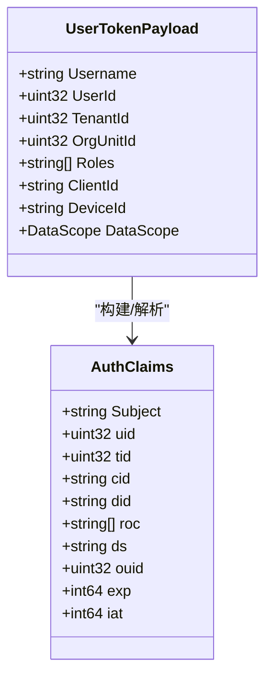
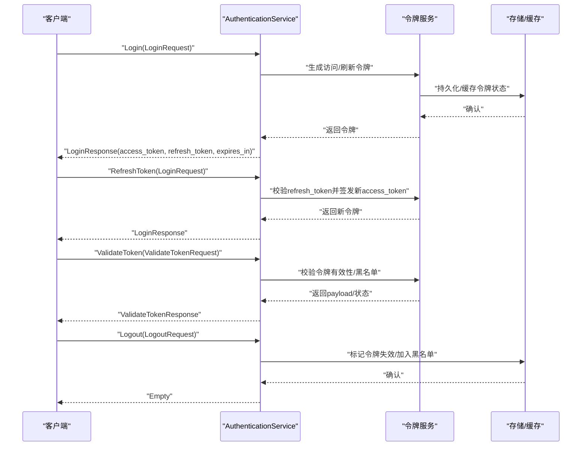
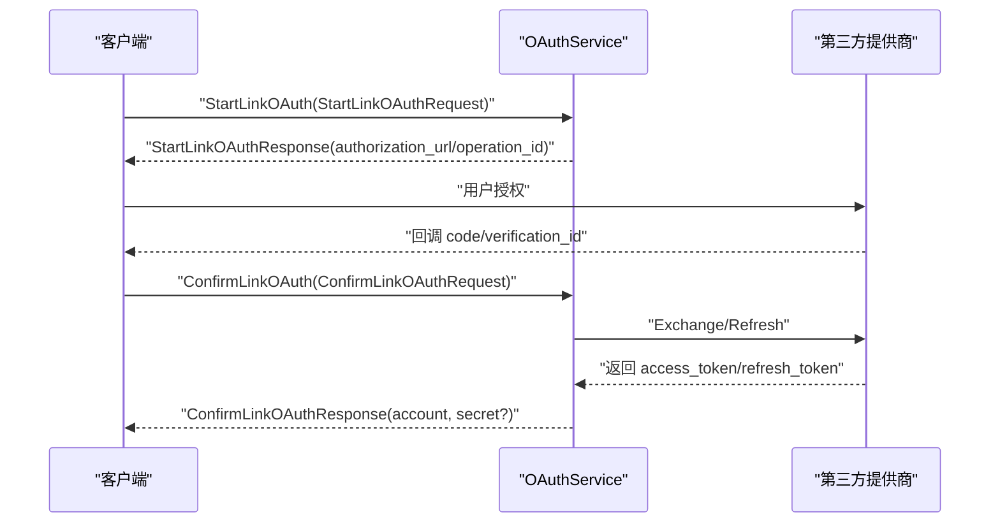
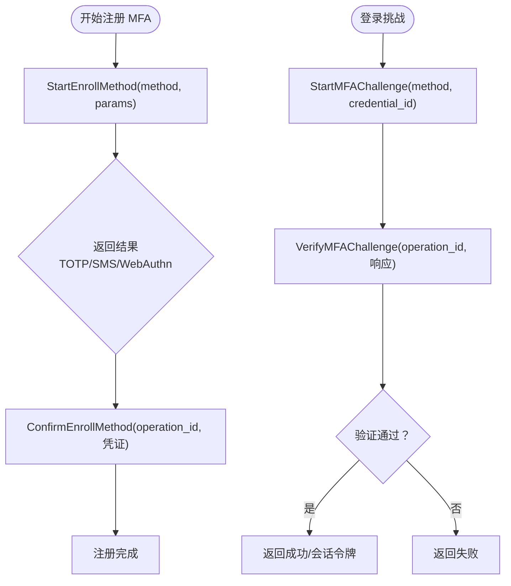
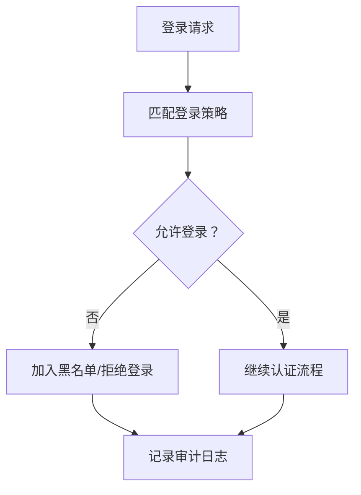
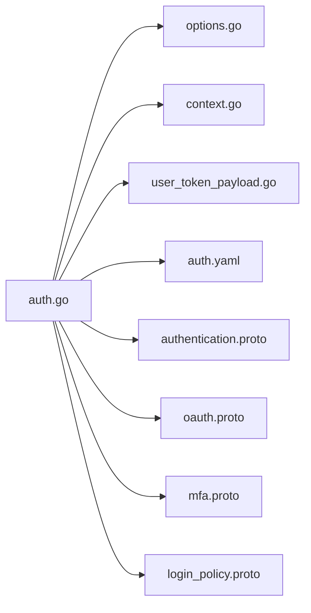

# 认证授权 API

<cite>
**本文引用的文件**
- [main.go](file://backend/app/admin/service/cmd/server/main.go)
- [auth.go](file://backend/pkg/middleware/auth/auth.go)
- [options.go](file://backend/pkg/middleware/auth/options.go)
- [context.go](file://backend/pkg/middleware/auth/context.go)
- [user_token_payload.go](file://backend/pkg/jwt/user_token_payload.go)
- [auth.yaml](file://backend/app/admin/service/configs/auth.yaml)
- [authentication.proto](file://backend/api/protos/authentication/service/v1/authentication.proto)
- [oauth.proto](file://backend/api/protos/authentication/service/v1/oauth.proto)
- [mfa.proto](file://backend/api/protos/authentication/service/v1/mfa.proto)
- [login_policy.proto](file://backend/api/protos/authentication/service/v1/login_policy.proto)
</cite>

## 目录
1. [简介](#简介)
2. [项目结构](#项目结构)
3. [核心组件](#核心组件)
4. [架构总览](#架构总览)
5. [详细组件分析](#详细组件分析)
6. [依赖分析](#依赖分析)
7. [性能考虑](#性能考虑)
8. [故障排查指南](#故障排查指南)
9. [结论](#结论)
10. [附录](#附录)

## 简介
本文件面向 GoWind Admin 的认证授权 API，覆盖用户登录、Token 管理、OAuth2 集成与多因素认证（MFA）等能力。文档重点说明：
- 登录认证流程与 JWT Token 生成/刷新机制
- 会话管理与登出接口
- 认证中间件配置、权限验证流程与安全策略
- 请求/响应示例场景：成功登录、Token 过期处理、权限不足、验证码等
- 登录策略配置、账户锁定机制与安全审计日志

## 项目结构
认证授权相关代码主要分布在以下模块：
- 服务入口与运行时：backend/app/admin/service/cmd/server/main.go
- 认证中间件：backend/pkg/middleware/auth/*
- JWT 令牌载荷与声明：backend/pkg/jwt/user_token_payload.go
- 配置：backend/app/admin/service/configs/auth.yaml
- 协议定义（Proto）：backend/api/protos/authentication/service/v1/*

**图表来源**
- [main.go:1-76](file://backend/app/admin/service/cmd/server/main.go#L1-L76)
- [auth.go:1-122](file://backend/pkg/middleware/auth/auth.go#L1-L122)
- [options.go:1-146](file://backend/pkg/middleware/auth/options.go#L1-L146)
- [context.go:1-26](file://backend/pkg/middleware/auth/context.go#L1-L26)
- [user_token_payload.go:1-279](file://backend/pkg/jwt/user_token_payload.go#L1-L279)
- [auth.yaml:1-37](file://backend/app/admin/service/configs/auth.yaml#L1-L37)
- [authentication.proto:1-551](file://backend/api/protos/authentication/service/v1/authentication.proto#L1-L551)
- [oauth.proto:1-230](file://backend/api/protos/authentication/service/v1/oauth.proto#L1-L230)
- [mfa.proto:1-227](file://backend/api/protos/authentication/service/v1/mfa.proto#L1-L227)
- [login_policy.proto:1-178](file://backend/api/protos/authentication/service/v1/login_policy.proto#L1-L178)

**章节来源**
- [main.go:1-76](file://backend/app/admin/service/cmd/server/main.go#L1-L76)
- [auth.go:1-122](file://backend/pkg/middleware/auth/auth.go#L1-L122)
- [options.go:1-146](file://backend/pkg/middleware/auth/options.go#L1-L146)
- [context.go:1-26](file://backend/pkg/middleware/auth/context.go#L1-L26)
- [user_token_payload.go:1-279](file://backend/pkg/jwt/user_token_payload.go#L1-L279)
- [auth.yaml:1-37](file://backend/app/admin/service/configs/auth.yaml#L1-L37)
- [authentication.proto:1-551](file://backend/api/protos/authentication/service/v1/authentication.proto#L1-L551)
- [oauth.proto:1-230](file://backend/api/protos/authentication/service/v1/oauth.proto#L1-L230)
- [mfa.proto:1-227](file://backend/api/protos/authentication/service/v1/mfa.proto#L1-L227)
- [login_policy.proto:1-178](file://backend/api/protos/authentication/service/v1/login_policy.proto#L1-L178)

## 核心组件
- 认证中间件：负责从请求中提取 Bearer Token、校验有效性、注入操作员/租户/组织单元/数据范围等上下文，并可选执行鉴权。
- JWT 工具：封装用户令牌载荷与声明的构建、解析与过期判断。
- 配置：定义认证类型（JWT/OIDC/Preshared）、鉴权类型（CASBin/OPA/Zanzibar/NoOp）以及 OIDC/JWT 参数。
- 协议定义：暴露登录、登出、令牌管理、OAuth2、MFA、登录策略等接口。

关键职责与交互：
- 中间件从传输层上下文提取 Token，委托 AccessTokenChecker 校验有效性与黑名单状态。
- 若启用鉴权，进一步结合授权引擎进行权限判定。
- 注入元数据与 Ent Viewer，便于后续业务层按用户维度进行数据隔离与审计。

**章节来源**
- [auth.go:24-121](file://backend/pkg/middleware/auth/auth.go#L24-L121)
- [options.go:11-146](file://backend/pkg/middleware/auth/options.go#L11-L146)
- [context.go:15-25](file://backend/pkg/middleware/auth/context.go#L15-L25)
- [user_token_payload.go:39-182](file://backend/pkg/jwt/user_token_payload.go#L39-L182)
- [auth.yaml:1-37](file://backend/app/admin/service/configs/auth.yaml#L1-L37)

## 架构总览
认证授权整体流程如下：

**图表来源**
- [auth.go:38-118](file://backend/pkg/middleware/auth/auth.go#L38-L118)
- [options.go:12-60](file://backend/pkg/middleware/auth/options.go#L12-L60)

## 详细组件分析

### 认证中间件
- 功能要点
  - 从请求上下文中提取 Bearer Token
  - 通过 AccessTokenChecker 校验令牌有效性与黑名单状态
  - 注入操作员ID、租户ID、组织单元ID、数据范围、元数据与 Ent Viewer
  - 可选启用授权判定
- 错误处理
  - 缺失传输上下文、缺失 Bearer Token、AccessTokenChecker 未配置、令牌无效或过期等
- 配置项
  - 注入开关：操作员ID、租户ID、Ent、元数据
  - 授权开关与作用域检查开关
  - 刷新令牌过期检查开关

**图表来源**
- [auth.go:38-118](file://backend/pkg/middleware/auth/auth.go#L38-L118)
- [options.go:62-75](file://backend/pkg/middleware/auth/options.go#L62-L75)

**章节来源**
- [auth.go:24-121](file://backend/pkg/middleware/auth/auth.go#L24-L121)
- [options.go:11-146](file://backend/pkg/middleware/auth/options.go#L11-L146)
- [context.go:15-25](file://backend/pkg/middleware/auth/context.go#L15-L25)

### JWT 令牌与载荷
- 令牌声明
  - 用户名、用户ID、租户ID、组织单元ID、角色码、客户端ID、设备ID、数据范围等
- 过期与生效时间
  - 默认访问令牌有效期、刷新令牌有效期、时间容差
- 工具函数
  - 构建用户令牌载荷
  - 从声明/MapClaims解析载荷
  - 判断令牌是否过期/未生效

**图表来源**
- [user_token_payload.go:39-100](file://backend/pkg/jwt/user_token_payload.go#L39-L100)
- [user_token_payload.go:102-182](file://backend/pkg/jwt/user_token_payload.go#L102-L182)
- [user_token_payload.go:184-246](file://backend/pkg/jwt/user_token_payload.go#L184-L246)
- [user_token_payload.go:248-279](file://backend/pkg/jwt/user_token_payload.go#L248-L279)

**章节来源**
- [user_token_payload.go:17-37](file://backend/pkg/jwt/user_token_payload.go#L17-L37)
- [user_token_payload.go:39-100](file://backend/pkg/jwt/user_token_payload.go#L39-L100)
- [user_token_payload.go:102-182](file://backend/pkg/jwt/user_token_payload.go#L102-L182)
- [user_token_payload.go:184-246](file://backend/pkg/jwt/user_token_payload.go#L184-L246)
- [user_token_payload.go:248-279](file://backend/pkg/jwt/user_token_payload.go#L248-L279)

### 登录认证与 Token 管理
- 登录接口
  - 支持密码模式、授权码模式、刷新令牌模式等
  - 支持设备ID、JTI（防重放）等增强安全字段
- 登出接口
  - 支持按用户/客户端类型登出
- 令牌管理
  - 刷新令牌、验证令牌、获取令牌列表、按ID撤销、拉黑/解封令牌
- WhoAmI
  - 获取当前用户身份信息
- 验证码
  - 生成与验证图形验证码

**图表来源**
- [authentication.proto:21-60](file://backend/api/protos/authentication/service/v1/authentication.proto#L21-L60)
- [authentication.proto:92-190](file://backend/api/protos/authentication/service/v1/authentication.proto#L92-L190)
- [authentication.proto:193-243](file://backend/api/protos/authentication/service/v1/authentication.proto#L193-L243)
- [authentication.proto:245-260](file://backend/api/protos/authentication/service/v1/authentication.proto#L245-L260)
- [authentication.proto:262-329](file://backend/api/protos/authentication/service/v1/authentication.proto#L262-L329)
- [authentication.proto:393-415](file://backend/api/protos/authentication/service/v1/authentication.proto#L393-L415)
- [authentication.proto:419-484](file://backend/api/protos/authentication/service/v1/authentication.proto#L419-L484)
- [authentication.proto:487-510](file://backend/api/protos/authentication/service/v1/authentication.proto#L487-L510)

**章节来源**
- [authentication.proto:21-60](file://backend/api/protos/authentication/service/v1/authentication.proto#L21-L60)
- [authentication.proto:92-190](file://backend/api/protos/authentication/service/v1/authentication.proto#L92-L190)
- [authentication.proto:193-243](file://backend/api/protos/authentication/service/v1/authentication.proto#L193-L243)
- [authentication.proto:245-260](file://backend/api/protos/authentication/service/v1/authentication.proto#L245-L260)
- [authentication.proto:262-329](file://backend/api/protos/authentication/service/v1/authentication.proto#L262-L329)
- [authentication.proto:393-415](file://backend/api/protos/authentication/service/v1/authentication.proto#L393-L415)
- [authentication.proto:419-484](file://backend/api/protos/authentication/service/v1/authentication.proto#L419-L484)
- [authentication.proto:487-510](file://backend/api/protos/authentication/service/v1/authentication.proto#L487-L510)

### OAuth2 集成
- 支持列出/获取/开始/确认/解除第三方账号关联
- 支持刷新 OAuth 令牌、交换授权码、撤销已关联账号
- 支持列出/获取提供商元信息（授权端点、Token 端点、默认 scope 等）

**图表来源**
- [oauth.proto:16-49](file://backend/api/protos/authentication/service/v1/oauth.proto#L16-L49)
- [oauth.proto:151-180](file://backend/api/protos/authentication/service/v1/oauth.proto#L151-L180)
- [oauth.proto:183-203](file://backend/api/protos/authentication/service/v1/oauth.proto#L183-L203)

**章节来源**
- [oauth.proto:16-49](file://backend/api/protos/authentication/service/v1/oauth.proto#L16-L49)
- [oauth.proto:151-180](file://backend/api/protos/authentication/service/v1/oauth.proto#L151-L180)
- [oauth.proto:183-203](file://backend/api/protos/authentication/service/v1/oauth.proto#L183-L203)

### 多因素认证（MFA）
- 支持查询/列出已注册方法、开始/确认注册、禁用/撤销凭证
- 支持登录时发起挑战与验证（TOTP/SMS/EMAIL/U2F/WebAuthn/备份码）
- 支持生成/列出备份码

**图表来源**
- [mfa.proto:12-42](file://backend/api/protos/authentication/service/v1/mfa.proto#L12-L42)
- [mfa.proto:94-147](file://backend/api/protos/authentication/service/v1/mfa.proto#L94-L147)
- [mfa.proto:165-193](file://backend/api/protos/authentication/service/v1/mfa.proto#L165-L193)
- [mfa.proto:196-210](file://backend/api/protos/authentication/service/v1/mfa.proto#L196-L210)

**章节来源**
- [mfa.proto:12-42](file://backend/api/protos/authentication/service/v1/mfa.proto#L12-L42)
- [mfa.proto:94-147](file://backend/api/protos/authentication/service/v1/mfa.proto#L94-L147)
- [mfa.proto:165-193](file://backend/api/protos/authentication/service/v1/mfa.proto#L165-L193)
- [mfa.proto:196-210](file://backend/api/protos/authentication/service/v1/mfa.proto#L196-L210)

### 登录策略与账户锁定
- 登录策略
  - 类型：黑名单/白名单
  - 方式：IP/MAC/地区/时间/设备
  - 支持按用户/租户维度配置
- 账户锁定与安全审计
  - 结合登录策略与登录审计日志，实现登录限制与风险控制
  - 黑名单/白名单策略可与令牌黑名单联动

**图表来源**
- [login_policy.proto:17-35](file://backend/api/protos/authentication/service/v1/login_policy.proto#L17-L35)
- [login_policy.proto:38-115](file://backend/api/protos/authentication/service/v1/login_policy.proto#L38-L115)

**章节来源**
- [login_policy.proto:17-35](file://backend/api/protos/authentication/service/v1/login_policy.proto#L17-L35)
- [login_policy.proto:38-115](file://backend/api/protos/authentication/service/v1/login_policy.proto#L38-L115)

## 依赖分析
- 认证中间件依赖
  - 传输层上下文提取 Token
  - AccessTokenChecker 接口（可由具体实现提供）
  - 注入元数据与 Ent Viewer
  - 可选授权引擎
- 配置依赖
  - auth.yaml 决定认证类型（JWT/OIDC/Preshared）与鉴权类型（CASBin/OPA/Zanzibar/NoOp）
- 协议依赖
  - authentication.proto、oauth.proto、mfa.proto、login_policy.proto 定义了对外 API

**图表来源**
- [auth.go:1-122](file://backend/pkg/middleware/auth/auth.go#L1-L122)
- [options.go:1-146](file://backend/pkg/middleware/auth/options.go#L1-L146)
- [context.go:1-26](file://backend/pkg/middleware/auth/context.go#L1-L26)
- [user_token_payload.go:1-279](file://backend/pkg/jwt/user_token_payload.go#L1-L279)
- [auth.yaml:1-37](file://backend/app/admin/service/configs/auth.yaml#L1-L37)
- [authentication.proto:1-551](file://backend/api/protos/authentication/service/v1/authentication.proto#L1-L551)
- [oauth.proto:1-230](file://backend/api/protos/authentication/service/v1/oauth.proto#L1-L230)
- [mfa.proto:1-227](file://backend/api/protos/authentication/service/v1/mfa.proto#L1-L227)
- [login_policy.proto:1-178](file://backend/api/protos/authentication/service/v1/login_policy.proto#L1-L178)

**章节来源**
- [auth.go:1-122](file://backend/pkg/middleware/auth/auth.go#L1-L122)
- [options.go:1-146](file://backend/pkg/middleware/auth/options.go#L1-L146)
- [context.go:1-26](file://backend/pkg/middleware/auth/context.go#L1-L26)
- [user_token_payload.go:1-279](file://backend/pkg/jwt/user_token_payload.go#L1-L279)
- [auth.yaml:1-37](file://backend/app/admin/service/configs/auth.yaml#L1-L37)
- [authentication.proto:1-551](file://backend/api/protos/authentication/service/v1/authentication.proto#L1-L551)
- [oauth.proto:1-230](file://backend/api/protos/authentication/service/v1/oauth.proto#L1-L230)
- [mfa.proto:1-227](file://backend/api/protos/authentication/service/v1/mfa.proto#L1-L227)
- [login_policy.proto:1-178](file://backend/api/protos/authentication/service/v1/login_policy.proto#L1-L178)

## 性能考虑
- Token 校验与黑名单查询
  - 建议将黑名单与常用令牌状态缓存至高性能存储，降低延迟
- 中间件注入成本
  - 注入 Ent Viewer 与元数据会增加少量上下文处理开销，建议按需开启
- 刷新令牌策略
  - 合理设置访问令牌与刷新令牌有效期，平衡安全性与用户体验
- 并发与连接池
  - 令牌服务与存储层应具备良好的并发与连接池配置

## 故障排查指南
- 常见错误与定位
  - 缺少传输上下文：检查请求是否正确传递到 Kratos 服务端
  - 缺失 Bearer Token：确认 Authorization 头格式与中间件配置一致
  - AccessTokenChecker 未配置：确保在初始化时注入有效的校验器
  - 令牌无效/过期：检查签名算法、密钥、时间同步与过期时间
  - 鉴权失败：核对角色/权限与授权策略配置
- 日志与审计
  - 中间件与服务端均输出关键错误日志，结合登录审计日志定位问题
  - 对于黑名单/拉黑/撤销等高风险操作，务必记录审计日志

**章节来源**
- [auth.go:42-61](file://backend/pkg/middleware/auth/auth.go#L42-L61)
- [options.go:51-60](file://backend/pkg/middleware/auth/options.go#L51-L60)

## 结论
GoWind Admin 的认证授权体系以中间件为核心，结合 JWT 令牌与可插拔的 AccessTokenChecker 实现灵活的安全控制。通过 Proto 定义清晰的 API，覆盖登录、登出、令牌管理、OAuth2、MFA 与登录策略等关键能力。配合合理的配置与审计日志，可在保证安全的同时提供良好的用户体验。

## 附录

### 请求/响应示例（路径参考）
- 成功登录
  - 请求：authentication.proto 中的 LoginRequest
  - 响应：authentication.proto 中的 LoginResponse
  - 参考路径：[authentication.proto:92-190](file://backend/api/protos/authentication/service/v1/authentication.proto#L92-L190)、[authentication.proto:193-243](file://backend/api/protos/authentication/service/v1/authentication.proto#L193-L243)
- Token 过期处理
  - 使用 RefreshToken 接口刷新访问令牌
  - 参考路径：[authentication.proto:32-33](file://backend/api/protos/authentication/service/v1/authentication.proto#L32-L33)
- 权限不足
  - 中间件在启用鉴权时返回授权失败
  - 参考路径：[auth.go:110-116](file://backend/pkg/middleware/auth/auth.go#L110-L116)
- 登出
  - 请求：LogoutRequest
  - 响应：Empty
  - 参考路径：[authentication.proto:245-260](file://backend/api/protos/authentication/service/v1/authentication.proto#L245-L260)
- OAuth2 关联第三方账号
  - StartLinkOAuth/ConfirmLinkOAuth
  - 参考路径：[oauth.proto:151-180](file://backend/api/protos/authentication/service/v1/oauth.proto#L151-L180)
- MFA 登录挑战
  - StartMFAChallenge/VerifyMFAChallenge
  - 参考路径：[mfa.proto:165-193](file://backend/api/protos/authentication/service/v1/mfa.proto#L165-L193)
- 登录策略
  - 列表/详情/创建/更新/删除
  - 参考路径：[login_policy.proto:17-35](file://backend/api/protos/authentication/service/v1/login_policy.proto#L17-L35)