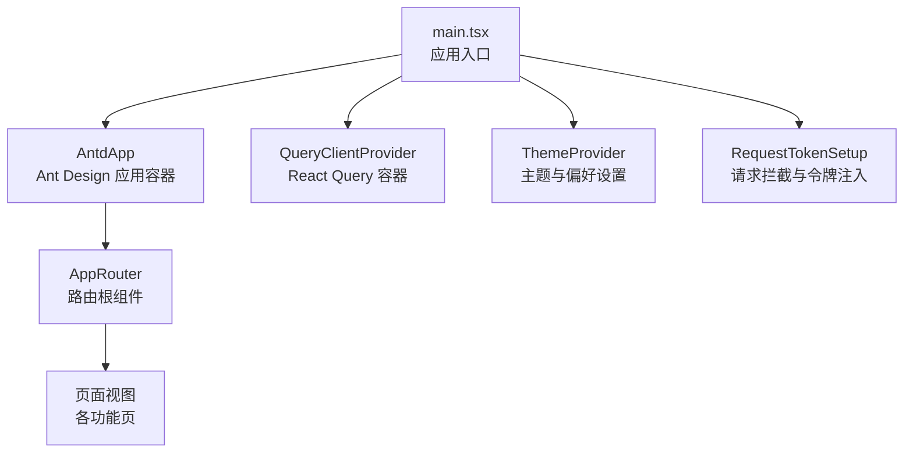
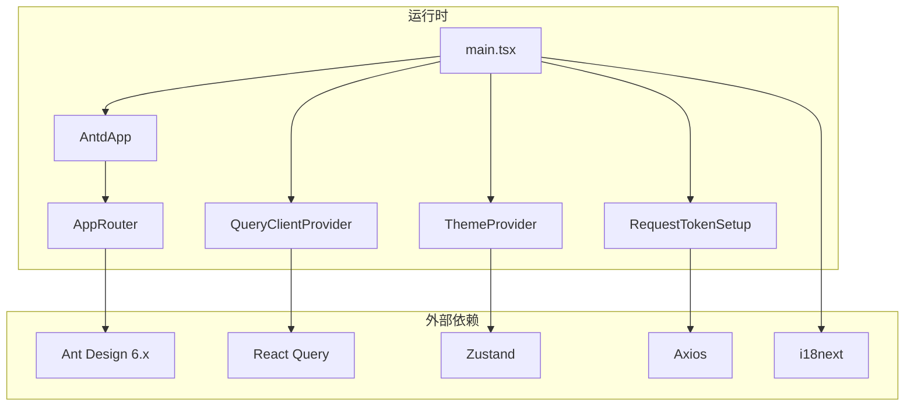
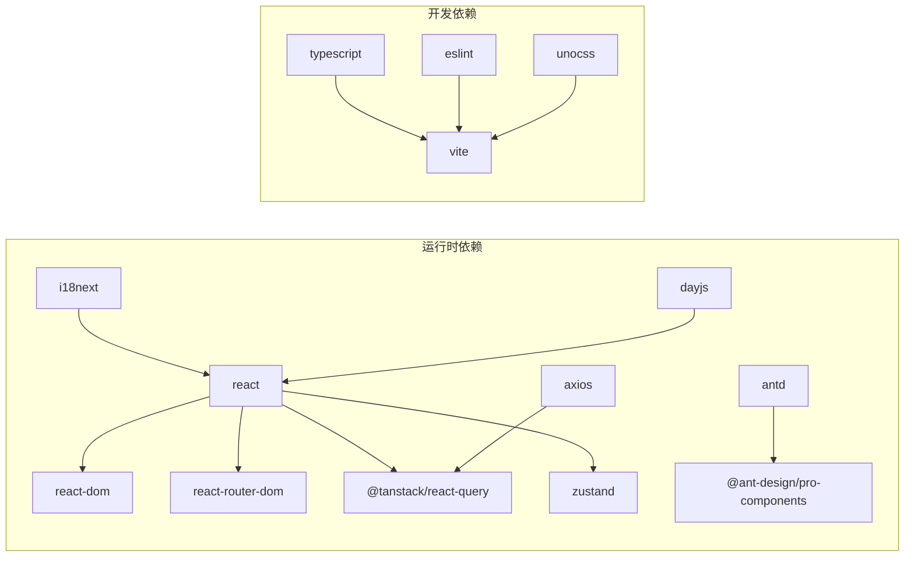

# React + Ant Design 框架

<cite>
**本文引用的文件**
- [frontend/admin/react/package.json](file://frontend/admin/react/package.json)
- [frontend/admin/react/vite.config.ts](file://frontend/admin/react/vite.config.ts)
- [frontend/admin/react/tsconfig.json](file://frontend/admin/react/tsconfig.json)
- [frontend/admin/react/src/app.tsx](file://frontend/admin/react/src/app.tsx)
- [frontend/admin/react/src/main.tsx](file://frontend/admin/react/src/main.tsx)
</cite>

## 目录
1. [简介](#简介)
2. [项目结构](#项目结构)
3. [核心组件](#核心组件)
4. [架构总览](#架构总览)
5. [详细组件分析](#详细组件分析)
6. [依赖分析](#依赖分析)
7. [性能考虑](#性能考虑)
8. [故障排查指南](#故障排查指南)
9. [结论](#结论)
10. [附录](#附录)

## 简介
本指南面向使用 React + Ant Design 的前端开发者，结合仓库中现有的前端工程化与基础架构，系统讲解组件架构设计（函数组件、Hooks 使用、状态管理）、Ant Design 组件库的应用（表单、表格、弹窗等）、TypeScript 配置与使用、路由与导航、最佳实践以及调试技巧。文档严格基于仓库现有文件进行分析与总结，避免臆造信息。

## 项目结构
该 React 前端工程位于 frontend/admin/react，采用 Vite 作为构建工具，配合 TypeScript、Ant Design 6.x、React Query、Zustand 等生态组件。入口文件负责全局初始化与 Provider 包裹，应用通过路由组件进行页面级导航。

图表来源
- [frontend/admin/react/src/main.tsx:1-46](file://frontend/admin/react/src/main.tsx#L1-L46)
- [frontend/admin/react/src/app.tsx:1-12](file://frontend/admin/react/src/app.tsx#L1-L12)

章节来源
- [frontend/admin/react/src/main.tsx:1-46](file://frontend/admin/react/src/main.tsx#L1-L46)
- [frontend/admin/react/src/app.tsx:1-12](file://frontend/admin/react/src/app.tsx#L1-L12)

## 核心组件
- 应用入口与 Provider 层
  - 全局初始化：执行 bootstrap 并挂载 StrictMode 根节点。
  - Provider 层：QueryClientProvider、ThemeProvider、AntdApp、RequestTokenSetup 逐层包裹，确保查询缓存、主题偏好、UI 容器与请求拦截生效。
  - 开发模式下按需加载 React Query Devtools，便于调试。
- 应用根组件
  - AppRouter 作为路由根组件，承载页面级导航与布局。
  - useLocaleSync 钩子用于同步语言偏好与国际化状态，保证界面语言一致性。

章节来源
- [frontend/admin/react/src/main.tsx:1-46](file://frontend/admin/react/src/main.tsx#L1-L46)
- [frontend/admin/react/src/app.tsx:1-12](file://frontend/admin/react/src/app.tsx#L1-L12)

## 架构总览
整体架构围绕“入口初始化 → Provider 包裹 → 路由导航”的主线展开，同时集成 Ant Design UI、国际化、请求拦截与主题偏好等横切能力。

图表来源
- [frontend/admin/react/src/main.tsx:1-46](file://frontend/admin/react/src/main.tsx#L1-L46)
- [frontend/admin/react/src/app.tsx:1-12](file://frontend/admin/react/src/app.tsx#L1-L12)
- [frontend/admin/react/package.json:13-38](file://frontend/admin/react/package.json#L13-L38)

## 详细组件分析

### 路由与导航
- 路由根组件
  - AppRouter 作为应用的路由入口，承载页面级导航与布局。
  - 页面视图通过路由配置进行渲染，支持嵌套路由与懒加载（如需）。
- 导航与布局
  - 布局组件负责侧边栏、面包屑、顶部栏等区域的组织与切换。
  - 布局与路由联动，实现菜单到页面的映射与权限控制。

章节来源
- [frontend/admin/react/src/app.tsx:1-12](file://frontend/admin/react/src/app.tsx#L1-L12)

### Ant Design 组件库应用
- 表单组件
  - 使用 ProForm、LoginForm、ModalForm 等高级表单组件，结合校验规则与受控/非受控模式，提升表单开发效率与一致性。
  - 与 React Hook Form 或内置校验体系配合，实现字段级与整表单级校验。
- 表格组件
  - 使用 ProTable 实现数据列表的增删改查、排序、筛选、分页与列配置。
  - 支持远程数据源、空态、加载态与错误态的统一处理。
- 弹窗组件
  - 使用 Modal、Drawer 等弹窗组件承载详情、编辑、确认等交互场景。
  - 结合表单组件与异步提交逻辑，实现弹窗内表单的提交与关闭流程。
- 图表组件
  - 使用 ECharts 与 echarts-for-react 进行可视化展示，结合响应式布局与主题适配。

章节来源
- [frontend/admin/react/package.json:13-38](file://frontend/admin/react/package.json#L13-L38)

### TypeScript 配置与使用
- 多 tsconfig 引用
  - 顶层 tsconfig.json 通过 references 引入 app 与 node 两套配置，分别用于应用编译与工具链运行时。
- 类型声明
  - 通过 @types/* 与自定义 d.ts 文件扩展第三方库与项目类型。
  - 在组件与工具函数中使用明确的接口与泛型约束，提升可维护性与 IDE 支持。

章节来源
- [frontend/admin/react/tsconfig.json:1-8](file://frontend/admin/react/tsconfig.json#L1-L8)

### 状态管理
- React Query
  - 通过 QueryClientProvider 提供全局查询客户端，统一管理服务端状态、缓存策略与错误处理。
  - 开发环境下按需加载 Devtools，便于观察查询状态与调试。
- Zustand
  - 通过 ThemeProvider 等模块化 Store 管理主题、语言偏好等跨组件共享状态。
  - Store 设计遵循最小必要状态原则，避免过度拆分导致的复杂度上升。

章节来源
- [frontend/admin/react/src/main.tsx:1-46](file://frontend/admin/react/src/main.tsx#L1-L46)
- [frontend/admin/react/package.json:17-37](file://frontend/admin/react/package.json#L17-L37)

### 国际化与本地化
- 语言同步
  - useLocaleSync 钩子用于同步用户偏好与 i18n 语言设置，确保界面语言与用户选择一致。
- 多语言资源
  - 通过 i18next 与浏览器语言探测器实现多语言资源加载与回退策略。

章节来源
- [frontend/admin/react/src/app.tsx:1-12](file://frontend/admin/react/src/app.tsx#L1-L12)
- [frontend/admin/react/package.json:25-27](file://frontend/admin/react/package.json#L25-L27)

### 请求拦截与令牌管理
- 请求拦截
  - RequestTokenSetup 负责在请求前注入令牌、处理通用头部与错误码映射。
- 传输层
  - Axios 作为 HTTP 客户端，与 REST 接口对接；结合 React Query 的查询与缓存策略，实现前后端一致的交互体验。

章节来源
- [frontend/admin/react/src/main.tsx:1-46](file://frontend/admin/react/src/main.tsx#L1-L46)
- [frontend/admin/react/package.json:19-19](file://frontend/admin/react/package.json#L19-L19)

## 依赖分析
- 前端核心依赖
  - React 19、Ant Design 6、@ant-design/pro-components 提供丰富的业务组件与布局能力。
  - React Router DOM 实现前端路由与导航。
  - React Query 管理服务端状态与缓存。
  - Zustand 提供轻量级状态管理。
  - Axios、i18next、dayjs 等辅助库完善网络、国际化与时间处理。
- 构建与开发工具
  - Vite 作为构建与开发服务器，支持热更新与代理配置。
  - TypeScript 与 ESLint、Prettier 等工具保障代码质量与风格一致性。

图表来源
- [frontend/admin/react/package.json:13-38](file://frontend/admin/react/package.json#L13-L38)

章节来源
- [frontend/admin/react/package.json:13-38](file://frontend/admin/react/package.json#L13-L38)

## 性能考虑
- 构建与打包
  - 使用 Vite 的原生 ESM 与按需加载特性，减少首屏体积与启动时间。
  - 通过别名与预构建优化第三方包的解析与缓存。
- 运行时性能
  - React Query 缓存策略与查询去重，降低重复请求与渲染成本。
  - Ant Design 组件按需加载与样式隔离，避免全局样式污染。
- 开发体验
  - HMR 与代理配置减少开发时的刷新与跨域问题。
  - Devtools 仅在开发环境加载，避免生产环境的额外开销。

## 故障排查指南
- 启动失败
  - 检查 Vite 配置与端口占用，确认代理与别名配置正确。
  - 确认 Node 版本与依赖安装完整。
- 国际化不生效
  - 校验 useLocaleSync 是否正确调用，检查 i18n 资源加载路径与语言回退策略。
- 请求异常
  - 检查 RequestTokenSetup 的令牌注入逻辑与后端 CORS 配置。
  - 使用 React Query Devtools 观察查询状态与错误信息。
- 样式问题
  - 确认 UnoCSS 与 Ant Design 样式的加载顺序，避免覆盖冲突。
  - 检查 Less 预处理器配置与变量覆盖。

章节来源
- [frontend/admin/react/vite.config.ts:1-47](file://frontend/admin/react/vite.config.ts#L1-L47)
- [frontend/admin/react/src/main.tsx:1-46](file://frontend/admin/react/src/main.tsx#L1-L46)

## 结论
本项目以 React + Ant Design 为核心，结合 React Query、Zustand、i18next 等生态组件，构建了具备良好扩展性与开发体验的前端框架。通过 Provider 层的统一管理与路由化的页面组织，能够快速搭建企业级后台管理系统的前端界面。建议在后续开发中持续完善组件库封装、状态模型设计与国际化资源治理，以进一步提升可维护性与团队协作效率。

## 附录
- 快速开始
  - 安装依赖：使用 pnpm 安装 package.json 中的依赖。
  - 启动开发：执行 npm 脚本 dev，访问本地开发地址。
  - 构建产物：执行 npm 脚本 build，生成静态资源。
- 常用脚本
  - dev：启动 Vite 开发服务器，启用 HMR 与代理。
  - build：先执行 TypeScript 编译，再进行 Vite 构建。
  - lint：运行 ESLint 检查代码规范。
  - preview：预览生产构建效果。

章节来源
- [frontend/admin/react/package.json:7-11](file://frontend/admin/react/package.json#L7-L11)