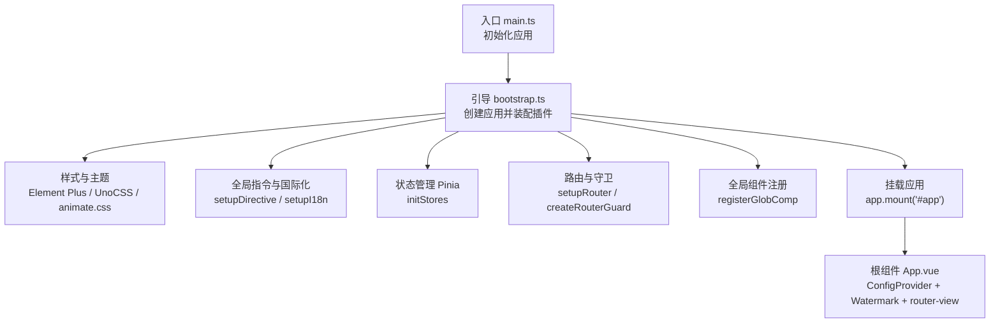
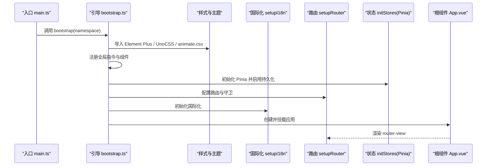
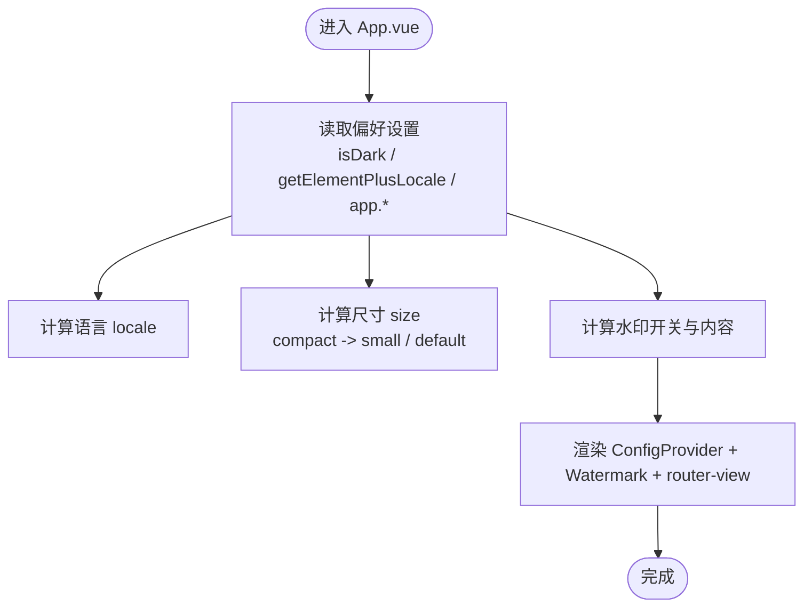
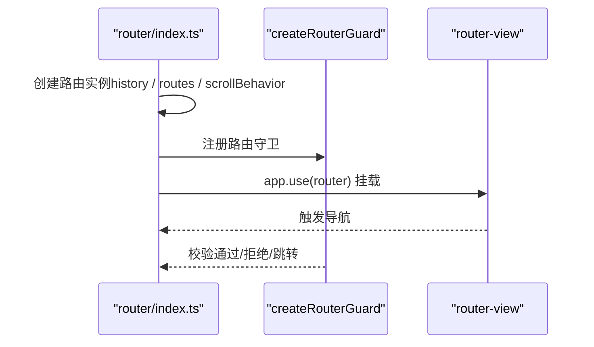
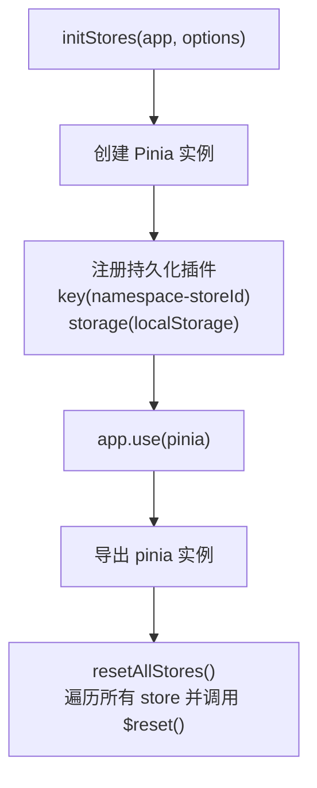
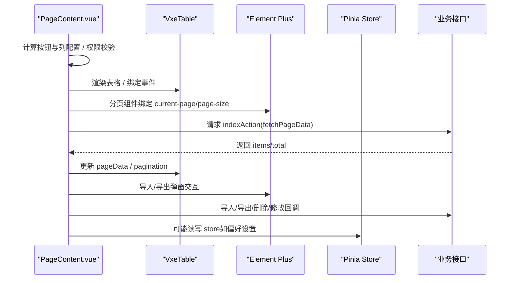
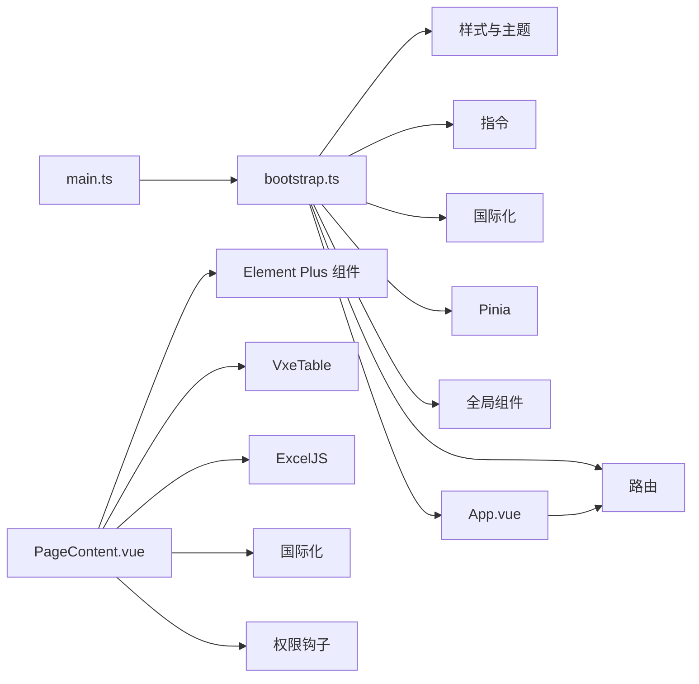

# Vue Element Plus 框架

<cite>
**本文引用的文件**
- [frontend/admin/vue-element/src/main.ts](file://frontend/admin/vue-element/src/main.ts)
- [frontend/admin/vue-element/src/bootstrap.ts](file://frontend/admin/vue-element/src/bootstrap.ts)
- [frontend/admin/vue-element/src/App.vue](file://frontend/admin/vue-element/src/App.vue)
- [frontend/admin/vue-element/src/router/index.ts](file://frontend/admin/vue-element/src/router/index.ts)
- [frontend/admin/vue-element/src/stores/setup.ts](file://frontend/admin/vue-element/src/stores/setup.ts)
- [frontend/admin/vue-element/src/components/CURD/PageContent.vue](file://frontend/admin/vue-element/src/components/CURD/PageContent.vue)
</cite>

## 目录
1. [简介](#简介)
2. [项目结构](#项目结构)
3. [核心组件](#核心组件)
4. [架构总览](#架构总览)
5. [详细组件分析](#详细组件分析)
6. [依赖关系分析](#依赖关系分析)
7. [性能考量](#性能考量)
8. [故障排查指南](#故障排查指南)
9. [结论](#结论)
10. [附录](#附录)

## 简介
本文件面向使用 Vue 3 + Element Plus 的前端开发团队，围绕项目中的 Element Plus 组件库应用、Composition API 使用、状态管理（Pinia）、路由与权限控制、组件开发最佳实践等方面进行系统化说明。文档以“可读性优先”的原则组织内容，既适合初学者快速上手，也为资深开发者提供深入的技术参考。

## 项目结构
前端采用多框架并存的布局：同时提供 React 和 Vue（含 Element Plus 与 Vben）两种技术栈。本文聚焦 Vue Element Plus 子项目，其核心启动流程如下：
- 入口文件负责应用初始化与命名空间拼装
- 引导文件负责样式、指令、国际化、路由、状态、全局组件注册与挂载
- 应用根组件通过 Element Plus ConfigProvider 提供统一语言与尺寸配置，并包裹水印与路由视图

图表来源
- [frontend/admin/vue-element/src/main.ts:11-25](file://frontend/admin/vue-element/src/main.ts#L11-L25)
- [frontend/admin/vue-element/src/bootstrap.ts:20-52](file://frontend/admin/vue-element/src/bootstrap.ts#L20-L52)
- [frontend/admin/vue-element/src/App.vue:1-37](file://frontend/admin/vue-element/src/App.vue#L1-L37)

章节来源
- [frontend/admin/vue-element/src/main.ts:1-25](file://frontend/admin/vue-element/src/main.ts#L1-L25)
- [frontend/admin/vue-element/src/bootstrap.ts:1-55](file://frontend/admin/vue-element/src/bootstrap.ts#L1-L55)
- [frontend/admin/vue-element/src/App.vue:1-37](file://frontend/admin/vue-element/src/App.vue#L1-L37)

## 核心组件
- 应用根组件 App.vue：通过 Element Plus ConfigProvider 设置语言与尺寸；基于偏好设置动态启用水印与水印文字；根据主题自动调整水印字体颜色。
- CURD 页面组件 PageContent.vue：封装了表格、分页、导入导出、筛选、批量操作等常用功能，内置权限控制与多种列模板（图片、链接、开关、输入框、日期、工具栏等），并提供暴露的方法用于外部调用刷新、导出、获取选中数据等。

章节来源
- [frontend/admin/vue-element/src/App.vue:15-36](file://frontend/admin/vue-element/src/App.vue#L15-L36)
- [frontend/admin/vue-element/src/components/CURD/PageContent.vue:1-1170](file://frontend/admin/vue-element/src/components/CURD/PageContent.vue#L1-L1170)

## 架构总览
下图展示应用启动到页面渲染的关键交互链路，涵盖样式注入、国际化、路由与守卫、状态持久化、全局组件注册等模块。

图表来源
- [frontend/admin/vue-element/src/main.ts:11-25](file://frontend/admin/vue-element/src/main.ts#L11-L25)
- [frontend/admin/vue-element/src/bootstrap.ts:20-52](file://frontend/admin/vue-element/src/bootstrap.ts#L20-L52)
- [frontend/admin/vue-element/src/App.vue:10-12](file://frontend/admin/vue-element/src/App.vue#L10-L12)

## 详细组件分析

### 应用根组件 App.vue
- 功能要点
  - 使用 Element Plus ConfigProvider 提供语言与尺寸配置，尺寸随偏好设置动态切换
  - 基于偏好设置决定是否显示水印与水印内容
  - 根据主题自动调整水印字体颜色
  - 包裹 router-view，承载页面路由视图

图表来源
- [frontend/admin/vue-element/src/App.vue:15-36](file://frontend/admin/vue-element/src/App.vue#L15-L36)

章节来源
- [frontend/admin/vue-element/src/App.vue:1-37](file://frontend/admin/vue-element/src/App.vue#L1-L37)

### 路由与守卫（router/index.ts）
- 路由历史模式由环境变量控制（hash 或 HTML5 History）
- 支持滚动行为与哈希定位
- 导出 resetRoutes 与 setupRouter，便于在运行时重置静态路由
- 创建路由守卫，确保导航安全与权限校验

图表来源
- [frontend/admin/vue-element/src/router/index.ts:11-38](file://frontend/admin/vue-element/src/router/index.ts#L11-L38)

章节来源
- [frontend/admin/vue-element/src/router/index.ts:1-38](file://frontend/admin/vue-element/src/router/index.ts#L1-L38)

### 状态管理（Pinia + 持久化）
- 初始化 Pinia 实例并启用持久化插件，持久化键以命名空间 + store id 组合
- 支持重置所有 store 的工具函数，便于登出或切换租户后清理状态

图表来源
- [frontend/admin/vue-element/src/stores/setup.ts:16-45](file://frontend/admin/vue-element/src/stores/setup.ts#L16-L45)

章节来源
- [frontend/admin/vue-element/src/stores/setup.ts:1-45](file://frontend/admin/vue-element/src/stores/setup.ts#L1-L45)

### CURD 页面组件 PageContent.vue
- 功能概览
  - 工具栏：左侧/右侧按钮、过滤弹窗、权限控制
  - 表格：VxeTable 集成，支持树形、多选、序号、排序、列显隐、列模板（图片、链接、开关、输入、日期、工具栏、自定义）
  - 分页：Element Plus Pagination，支持页大小与当前页变更
  - 导入导出：ExcelJS 导出、上传导入、模板下载、远程导出
  - 权限：基于权限代码的按钮与列渲染控制
  - 暴露方法：刷新、导出、获取筛选参数、获取选中数据、表格实例

图表来源
- [frontend/admin/vue-element/src/components/CURD/PageContent.vue:374-1039](file://frontend/admin/vue-element/src/components/CURD/PageContent.vue#L374-L1039)

章节来源
- [frontend/admin/vue-element/src/components/CURD/PageContent.vue:1-1170](file://frontend/admin/vue-element/src/components/CURD/PageContent.vue#L1-L1170)

## 依赖关系分析
- 启动阶段依赖关系
  - main.ts 依赖 bootstrap.ts
  - bootstrap.ts 依赖：样式、指令、国际化、路由、状态、全局组件
  - App.vue 依赖偏好设置与 Element Plus ConfigProvider
- 组件间依赖关系
  - PageContent.vue 依赖：Element Plus 表单/按钮/分页/对话框/上传；VxeTable；ExcelJS；国际化与权限钩子

图表来源
- [frontend/admin/vue-element/src/main.ts:11-25](file://frontend/admin/vue-element/src/main.ts#L11-L25)
- [frontend/admin/vue-element/src/bootstrap.ts:20-52](file://frontend/admin/vue-element/src/bootstrap.ts#L20-L52)
- [frontend/admin/vue-element/src/App.vue:10-12](file://frontend/admin/vue-element/src/App.vue#L10-L12)
- [frontend/admin/vue-element/src/components/CURD/PageContent.vue:374-1039](file://frontend/admin/vue-element/src/components/CURD/PageContent.vue#L374-L1039)

章节来源
- [frontend/admin/vue-element/src/main.ts:1-25](file://frontend/admin/vue-element/src/main.ts#L1-L25)
- [frontend/admin/vue-element/src/bootstrap.ts:1-55](file://frontend/admin/vue-element/src/bootstrap.ts#L1-L55)
- [frontend/admin/vue-element/src/App.vue:1-37](file://frontend/admin/vue-element/src/App.vue#L1-L37)
- [frontend/admin/vue-element/src/components/CURD/PageContent.vue:1-1170](file://frontend/admin/vue-element/src/components/CURD/PageContent.vue#L1-L1170)

## 性能考量
- 表格渲染
  - 使用 VxeTable 并开启 hover/current 行高亮，避免过多列与大数据量时的卡顿
  - 合理设置列宽、最小宽度与固定列数量，减少重排
- 分页与筛选
  - 仅在需要时启用分页，避免一次性加载大量数据
  - 使用防抖/节流处理筛选与分页变更事件
- 导入导出
  - 导出使用 ExcelJS 写缓冲区后一次性下载，避免大文件多次 IO
  - 导入解析建议限制文件大小与行数，必要时服务端异步处理
- 状态持久化
  - Pinia 持久化仅保留必要状态，避免将大对象写入 localStorage
- 主题与水印
  - 水印仅在开启时生效，避免对首屏渲染造成额外负担

## 故障排查指南
- 路由无法跳转或白屏
  - 检查路由历史模式配置与基础路径
  - 确认路由守卫逻辑与权限判定
- 表格不显示或列错位
  - 确认列配置的 prop 与 columnKey 一致
  - 检查列模板与权限渲染条件
- 导入失败或无数据
  - 核对文件格式与标题行映射
  - 检查导入 Action 与模板下载接口
- 分页不生效
  - 确认 indexAction 返回 total/items 结构
  - 检查请求参数 pageName/limitName 与后端一致
- 水印不显示或颜色异常
  - 检查偏好设置开关与主题状态
  - 确认 ConfigProvider locale/size 计算结果

章节来源
- [frontend/admin/vue-element/src/router/index.ts:11-38](file://frontend/admin/vue-element/src/router/index.ts#L11-L38)
- [frontend/admin/vue-element/src/components/CURD/PageContent.vue:942-1001](file://frontend/admin/vue-element/src/components/CURD/PageContent.vue#L942-L1001)
- [frontend/admin/vue-element/src/App.vue:15-36](file://frontend/admin/vue-element/src/App.vue#L15-L36)

## 结论
本项目以 Vue 3 + Element Plus 为基础，结合 VxeTable、ExcelJS、Pinia 持久化与完善的路由/权限体系，构建了可扩展的后台管理前端骨架。通过统一的启动流程、偏好设置驱动的主题与尺寸、以及高度可复用的 CURD 组件，开发者可以快速搭建功能完备的管理界面。建议在后续迭代中持续关注性能优化与可维护性，完善权限模型与国际化覆盖。

## 附录

### Vue 3 Composition API 使用要点
- 响应式数据
  - 使用 ref/reactive 管理本地状态（如 loading、pagination、表单数据）
  - 使用 computed 基于响应式数据派生视图状态（如 size、locale、水印开关）
- 计算属性与侦听器
  - computed 用于语言/尺寸/水印等派生值
  - watch/watchEffect 用于监听路由变化、筛选参数、分页参数并触发刷新
- 生命周期
  - 在 setup 中集中初始化状态、事件与副作用
  - 使用 defineExpose 暴露必要的方法给父组件调用

### Element Plus 组件应用清单
- 表单组件：表单、表单项、输入框、选择器、上传、对话框、滚动条
- 表格组件：表格、分页、弹窗、按钮、开关、链接、图片预览
- 导航组件：面包屑、命令面板、全屏、汉堡菜单等（位于 layouts 与 components 目录）

### 状态管理模式（Pinia）
- 初始化与持久化：在引导阶段创建 Pinia 并注册持久化插件，键规则包含命名空间
- 重置策略：提供 resetAllStores 工具函数，便于登出或切换租户后清理状态

### 路由与权限
- 路由历史：支持 hash 与 HTML5 History，由环境变量控制
- 守卫：在路由层统一处理权限校验与导航拦截
- 动态路由：提供 resetStaticRoutes 以在运行时重置静态路由

### 组件开发最佳实践
- 设计原则
  - 单一职责：每个组件专注一类能力（如表格、表单、弹窗）
  - 可配置性：通过 props 传入配置（columns、pagination、actions 等）
  - 可复用性：将通用逻辑抽取为 Composables 或工具函数
- 样式定制
  - 使用 CSS 变量与 Element Plus 主题变量保持一致性
  - 深度选择器用于覆盖第三方组件样式
- 国际化支持
  - 使用国际化钩子提供多语言文案
  - 文案键规范命名，便于翻译与维护

### 开发示例与调试技巧
- 快速集成 CURD 页面
  - 准备 columns/pagination/request/indexAction/deleteAction 等配置
  - 通过 PageContent.vue 的暴露方法实现刷新与导出
- 调试技巧
  - 使用浏览器开发者工具观察 Element Plus 组件状态与事件
  - 在控制台打印筛选参数与分页参数，核对请求体
  - 对导入/导出流程增加日志输出，定位解析与网络问题