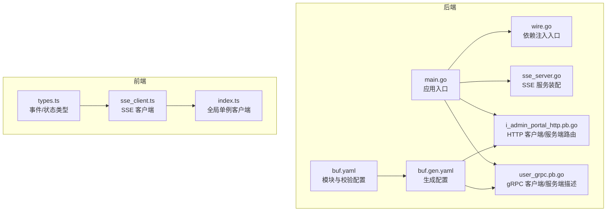
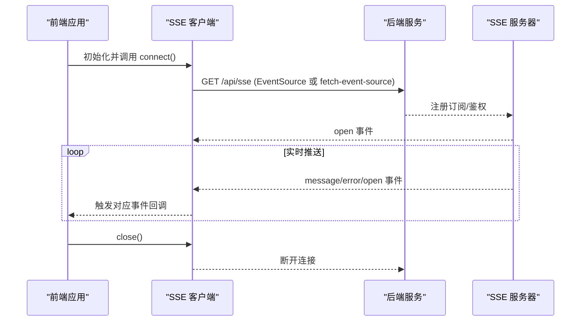
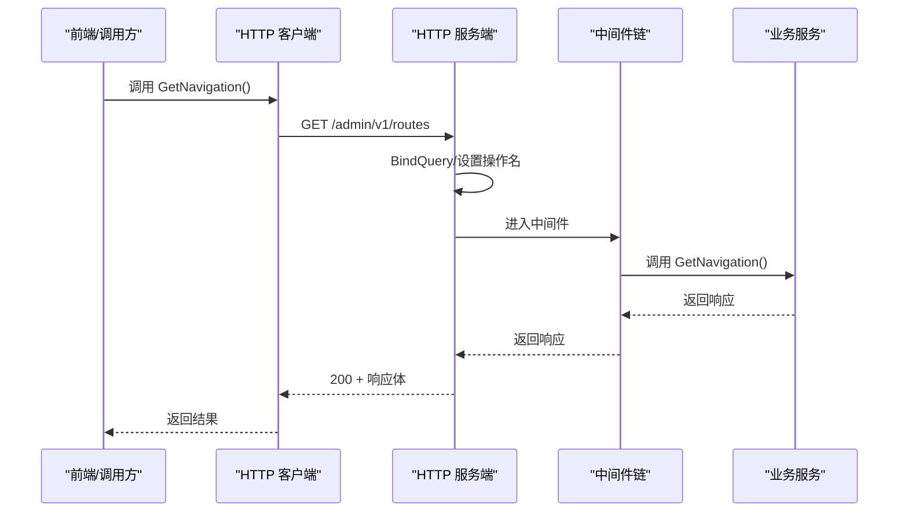
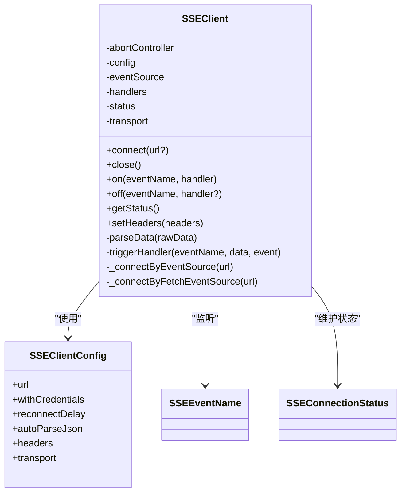
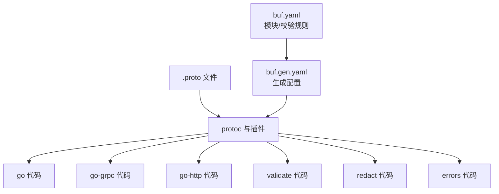
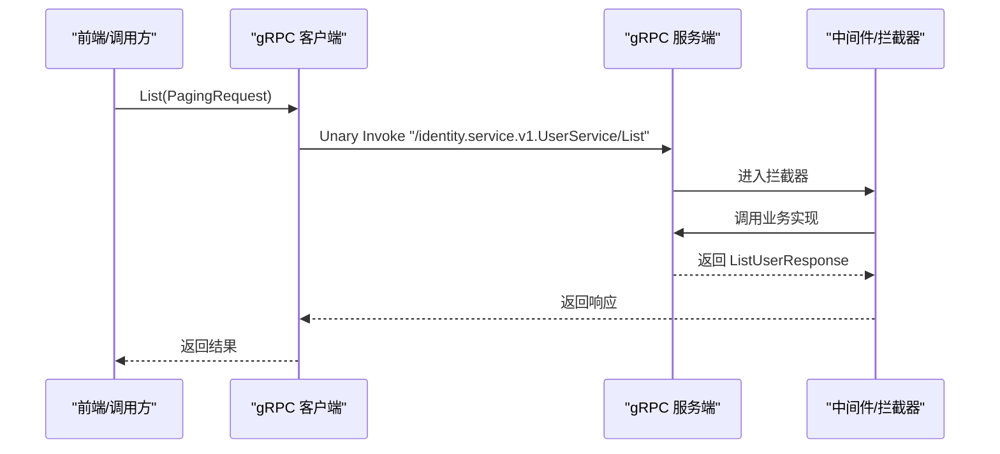
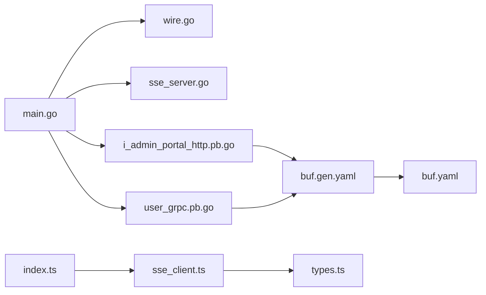

# API 客户端

<cite>
**本文引用的文件**
- [main.go](file://backend/app/admin/service/cmd/server/main.go)
- [wire.go](file://backend/app/admin/service/cmd/server/wire.go)
- [sse_server.go](file://backend/app/admin/service/internal/server/sse_server.go)
- [i_admin_portal_http.pb.go](file://backend/api/gen/go/admin/service/v1/i_admin_portal_http.pb.go)
- [user_grpc.pb.go](file://backend/api/gen/go/identity/service\v1/user_grpc.pb.go)
- [buf.gen.yaml](file://backend/api/buf.gen.yaml)
- [buf.yaml](file://backend/api/buf.yaml)
- [index.ts](file://frontend/admin/react/src/core/transport/sse/index.ts)
- [sse_client.ts](file://frontend/admin/react/src/core/transport/sse/sse_client.ts)
- [types.ts](file://frontend/admin/react/src/core/transport/sse/types.ts)
</cite>

## 目录
1. [引言](#引言)
2. [项目结构](#项目结构)
3. [核心组件](#核心组件)
4. [架构总览](#架构总览)
5. [组件详解](#组件详解)
6. [依赖关系分析](#依赖关系分析)
7. [性能与可靠性](#性能与可靠性)
8. [故障排查指南](#故障排查指南)
9. [结论](#结论)
10. [附录](#附录)

## 引言
本文件面向 Vben Admin 前后端协作场景，系统性梳理后端基于 Kratos 的 REST 与 SSE 能力、前端 React 客户端的 SSE 封装，以及基于 Protobuf 的 API 生成与类型安全机制。内容覆盖：
- RESTful API 客户端封装：请求/响应处理、拦截器与中间件、错误处理
- SSE 实时通信：连接管理、事件监听、断线重连策略
- API 生成机制：Protobuf 到 Go/HTTP/GRPC 的代码生成与包命名规范
- 最佳实践：请求缓存、并发控制、超时处理
- 示例与常见问题

## 项目结构
后端采用 Kratos 框架，结合自研引导器与传输层扩展，提供 HTTP、SSE、异步队列等能力；前端 React 使用 fetch-event-source 或原生 EventSource 订阅 SSE。

图表来源
- [main.go:1-76](file://backend/app/admin/service/cmd/server/main.go#L1-L76)
- [wire.go:1-47](file://backend/app/admin/service/cmd/server/wire.go#L1-L47)
- [sse_server.go:1-33](file://backend/app/admin/service/internal/server/sse_server.go#L1-L33)
- [i_admin_portal_http.pb.go:1-158](file://backend/api/gen/go/admin/service/v1/i_admin_portal_http.pb.go#L1-L158)
- [user_grpc.pb.go:1-410](file://backend/api/gen/go/identity/service/v1/user_grpc.pb.go#L1-L410)
- [buf.gen.yaml:1-96](file://backend/api/buf.gen.yaml#L1-L96)
- [buf.yaml:1-26](file://backend/api/buf.yaml#L1-L26)
- [sse_client.ts:1-272](file://frontend/admin/react/src/core/transport/sse/sse_client.ts#L1-L272)
- [types.ts:1-31](file://frontend/admin/react/src/core/transport/sse/types.ts#L1-L31)
- [index.ts:1-11](file://frontend/admin/react/src/core/transport/sse/index.ts#L1-L11)

章节来源
- [main.go:1-76](file://backend/app/admin/service/cmd/server/main.go#L1-L76)
- [wire.go:1-47](file://backend/app/admin/service/cmd/server/wire.go#L1-L47)
- [buf.gen.yaml:1-96](file://backend/api/buf.gen.yaml#L1-L96)
- [buf.yaml:1-26](file://backend/api/buf.yaml#L1-L26)

## 核心组件
- 后端应用入口与依赖注入
  - 应用入口负责初始化 Kratos App，并将 HTTP、异步队列、SSE 等组件注入
  - 依赖注入入口通过 Wire 组合 server、service、data ProviderSet，统一构建应用
- SSE 服务装配
  - 从引导配置读取 SSE 配置，注册订阅与鉴权函数，绑定内部消息发布器
- REST HTTP 客户端/服务端
  - 由 HTTP 生成器为 AdminPortalService 生成 HTTP 客户端与服务端路由映射
  - 支持查询参数绑定、中间件链路、操作名设置与结果返回
- gRPC 客户端/服务端
  - 由 gRPC 生成器为 UserService 生成客户端与服务端桩代码
  - 提供分页查询、计数、增删改查、存在性检查等接口
- 前端 SSE 客户端
  - 支持 EventSource 与 fetch-event-source 两种传输模式
  - 提供事件监听、状态管理、自动 JSON 解析、断线重连与手动关闭

章节来源
- [main.go:46-76](file://backend/app/admin/service/cmd/server/main.go#L46-L76)
- [wire.go:27-46](file://backend/app/admin/service/cmd/server/wire.go#L27-L46)
- [sse_server.go:12-33](file://backend/app/admin/service/internal/server/sse_server.go#L12-L33)
- [i_admin_portal_http.pb.go:23-158](file://backend/api/gen/go/admin/service/v1/i_admin_portal_http.pb.go#L23-L158)
- [user_grpc.pb.go:23-144](file://backend/api/gen/go/identity/service/v1/user_grpc.pb.go#L23-L144)
- [sse_client.ts:16-272](file://frontend/admin/react/src/core/transport/sse/sse_client.ts#L16-L272)
- [types.ts:1-31](file://frontend/admin/react/src/core/transport/sse/types.ts#L1-L31)
- [index.ts:1-11](file://frontend/admin/react/src/core/transport/sse/index.ts#L1-L11)

## 架构总览
后端通过 Kratos 提供 HTTP 与 SSE 传输层，前端通过 SSE 客户端订阅实时事件；API 通过 Protobuf 生成多语言客户端代码，确保类型安全与一致性。

图表来源
- [index.ts:6-11](file://frontend/admin/react/src/core/transport/sse/index.ts#L6-L11)
- [sse_client.ts:84-176](file://frontend/admin/react/src/core/transport/sse/sse_client.ts#L84-L176)
- [sse_server.go:13-33](file://backend/app/admin/service/internal/server/sse_server.go#L13-L33)

## 组件详解

### RESTful API 客户端与拦截器
- HTTP 生成器为 AdminPortalService 生成：
  - 服务端路由注册：/admin/v1/routes、/admin/v1/perm-codes、/admin/v1/initial-context
  - 客户端调用方法：GetNavigation、GetMyPermissionCode、GetInitialContext
- 请求处理流程
  - 查询参数绑定、设置操作名、执行中间件链、调用业务方法、返回 200 与响应体
- 中间件与拦截器
  - 通过 http.Context.Middleware 注入，可在请求进入业务逻辑前进行鉴权、日志、指标等横切处理
- 错误处理
  - 生成器在出错时直接返回错误，便于上层统一处理

图表来源
- [i_admin_portal_http.pb.go:36-98](file://backend/api/gen/go/admin/service/v1/i_admin_portal_http.pb.go#L36-L98)
- [i_admin_portal_http.pb.go:117-157](file://backend/api/gen/go/admin/service/v1/i_admin_portal_http.pb.go#L117-L157)

章节来源
- [i_admin_portal_http.pb.go:23-158](file://backend/api/gen/go/admin/service/v1/i_admin_portal_http.pb.go#L23-L158)

### SSE 实时通信
- 后端装配
  - 从配置读取 SSE 设置，注册订阅与鉴权函数，绑定内部消息发布器
- 前端客户端
  - 支持两种传输：EventSource 与 fetch-event-source
  - 状态机：disconnected → connecting → connected → error
  - 事件：open、message、error；支持自定义事件名
  - 自动 JSON 解析、断线重连、动态设置请求头（仅 fetch-event-source 生效）

图表来源
- [sse_client.ts:16-272](file://frontend/admin/react/src/core/transport/sse/sse_client.ts#L16-L272)
- [types.ts:19-31](file://frontend/admin/react/src/core/transport/sse/types.ts#L19-L31)

章节来源
- [sse_server.go:12-33](file://backend/app/admin/service/internal/server/sse_server.go#L12-L33)
- [index.ts:6-11](file://frontend/admin/react/src/core/transport/sse/index.ts#L6-L11)
- [sse_client.ts:84-176](file://frontend/admin/react/src/core/transport/sse/sse_client.ts#L84-L176)
- [types.ts:1-31](file://frontend/admin/react/src/core/transport/sse/types.ts#L1-L31)

### API 生成机制与类型安全
- 生成目标
  - Go 语言：proto → go、go-grpc、go-http、validate、redact、errors
- 包命名与目录映射
  - 通过 go_package_prefix 与按目录的 go_package 配置，确保生成包路径与 Go 模块一致
- 类型安全
  - Protobuf 定义强类型消息；生成的客户端/服务端在编译期保证参数与返回值类型一致
- 版本与兼容
  - buf.yaml 管理模块依赖与 lint/breaking 规则，保障演进过程中的稳定性

图表来源
- [buf.gen.yaml:56-96](file://backend/api/buf.gen.yaml#L56-L96)
- [buf.gen.yaml:25-55](file://backend/api/buf.gen.yaml#L25-L55)
- [buf.yaml:1-26](file://backend/api/buf.yaml#L1-L26)

章节来源
- [buf.gen.yaml:1-96](file://backend/api/buf.gen.yaml#L1-L96)
- [buf.yaml:1-26](file://backend/api/buf.yaml#L1-L26)

### gRPC 客户端与服务端
- 生成内容
  - UserService 提供 List/Count/Get/Create/BatchCreate/Update/Delete/UserExists 等方法
  - 服务端接口与默认未实现回退，便于按需实现
- 调用要点
  - 使用 Invoke 发起 Unary 调用，静态方法标记确保兼容性
  - 可通过 CallOption 传递额外参数（如超时、元数据）

图表来源
- [user_grpc.pb.go:66-144](file://backend/api/gen/go/identity/service/v1/user_grpc.pb.go#L66-L144)
- [user_grpc.pb.go:223-365](file://backend/api/gen/go/identity/service/v1/user_grpc.pb.go#L223-L365)

章节来源
- [user_grpc.pb.go:23-144](file://backend/api/gen/go/identity/service/v1/user_grpc.pb.go#L23-L144)

## 依赖关系分析
- 后端
  - main.go 作为应用入口，依赖 bootstrap 与 Kratos，注入 HTTP、异步队列、SSE
  - wire.go 通过 ProviderSet 组合 server、service、data 层，集中构建应用
  - sse_server.go 从配置读取 SSE 并注册订阅/鉴权函数
- 前端
  - sse_client.ts 提供统一的 SSE 客户端封装，index.ts 导出全局单例
  - types.ts 定义事件名、状态与配置类型，确保类型安全

图表来源
- [main.go:46-76](file://backend/app/admin/service/cmd/server/main.go#L46-L76)
- [wire.go:27-46](file://backend/app/admin/service/cmd/server/wire.go#L27-L46)
- [sse_server.go:12-33](file://backend/app/admin/service/internal/server/sse_server.go#L12-L33)
- [i_admin_portal_http.pb.go:23-158](file://backend/api/gen/go/admin/service/v1/i_admin_portal_http.pb.go#L23-L158)
- [user_grpc.pb.go:23-144](file://backend/api/gen/go/identity/service/v1/user_grpc.pb.go#L23-L144)
- [buf.gen.yaml:1-96](file://backend/api/buf.gen.yaml#L1-L96)
- [buf.yaml:1-26](file://backend/api/buf.yaml#L1-L26)
- [index.ts:1-11](file://frontend/admin/react/src/core/transport/sse/index.ts#L1-L11)
- [sse_client.ts:1-272](file://frontend/admin/react/src/core/transport/sse/sse_client.ts#L1-L272)
- [types.ts:1-31](file://frontend/admin/react/src/core/transport/sse/types.ts#L1-L31)

章节来源
- [main.go:1-76](file://backend/app/admin/service/cmd/server/main.go#L1-L76)
- [wire.go:1-47](file://backend/app/admin/service/cmd/server/wire.go#L1-L47)
- [buf.gen.yaml:1-96](file://backend/api/buf.gen.yaml#L1-L96)
- [buf.yaml:1-26](file://backend/api/buf.yaml#L1-L26)

## 性能与可靠性
- 请求缓存
  - 对于只读、低频变更的导航/权限数据，建议在前端实现 LRU 缓存与失效策略，避免重复请求
- 并发控制
  - 对高频接口（如分页查询）限制并发数，防止资源争用；可引入令牌桶或信号量
- 超时与重试
  - HTTP/GRPC 调用设置合理超时；对幂等请求可启用指数退避重试
- SSE 连接
  - 合理设置重连间隔与最大重试次数；在页面不可见时降低刷新频率或暂停非关键流
  - 使用 AbortController 主动取消挂起请求，避免内存泄漏

## 故障排查指南
- SSE 无法连接
  - 检查后端 SSE 配置是否加载成功，确认订阅/鉴权函数正确注册
  - 前端确认 transport 选择与 withCredentials、headers 设置
- 事件未触发
  - 确认事件名是否为自定义事件（非 open/message/error），必要时在 EventSource 模式下显式注册
  - 检查 autoParseJson 与数据格式
- 401/鉴权失败
  - 确认鉴权函数返回值与会话状态；检查跨域凭证与 Cookie 传播
- gRPC 调用异常
  - 检查 FullMethodName 与消息序列化；确认中间件链无异常
- HTTP 路由 404
  - 确认路由注册与路径模板一致；检查操作名设置与中间件链

章节来源
- [sse_server.go:17-33](file://backend/app/admin/service/internal/server/sse_server.go#L17-L33)
- [sse_client.ts:102-176](file://frontend/admin/react/src/core/transport/sse/sse_client.ts#L102-L176)
- [i_admin_portal_http.pb.go:36-98](file://backend/api/gen/go/admin/service/v1/i_admin_portal_http.pb.go#L36-L98)
- [user_grpc.pb.go:223-365](file://backend/api/gen/go/identity/service/v1/user_grpc.pb.go#L223-L365)

## 结论
本方案通过 Protobuf 生成多端一致的 API 客户端，结合 Kratos 的 HTTP/SSE 能力与前端 SSE 客户端封装，实现了类型安全、可扩展且可靠的前后端通信。建议在生产环境中配合缓存、限流、重试与可观测性策略，持续优化用户体验与系统稳定性。

## 附录
- API 调用示例（路径参考）
  - AdminPortalService
    - 获取导航：[i_admin_portal_http.pb.go:43-60](file://backend/api/gen/go/admin/service/v1/i_admin_portal_http.pb.go#L43-L60)
    - 获取权限码：[i_admin_portal_http.pb.go:62-79](file://backend/api/gen/go/admin/service/v1/i_admin_portal_http.pb.go#L62-L79)
    - 获取初始上下文：[i_admin_portal_http.pb.go:81-98](file://backend/api/gen/go/admin/service/v1/i_admin_portal_http.pb.go#L81-L98)
  - UserService（gRPC）
    - 列表/计数/获取：[user_grpc.pb.go:66-94](file://backend/api/gen/go/identity/service/v1/user_grpc.pb.go#L66-L94)
    - 创建/批量创建/更新/删除/存在性：[user_grpc.pb.go:96-144](file://backend/api/gen/go/identity/service/v1/user_grpc.pb.go#L96-L144)
- 前端 SSE 使用
  - 全局单例：[index.ts:6-11](file://frontend/admin/react/src/core/transport/sse/index.ts#L6-L11)
  - 客户端封装：[sse_client.ts:197-213](file://frontend/admin/react/src/core/transport/sse/sse_client.ts#L197-L213)
  - 类型定义：[types.ts:19-31](file://frontend/admin/react/src/core/transport/sse/types.ts#L19-L31)