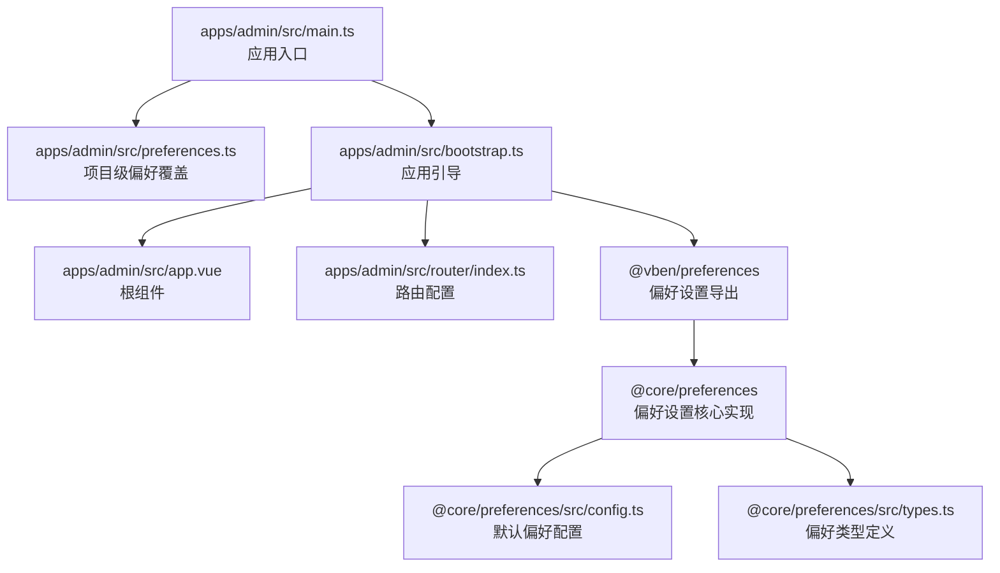
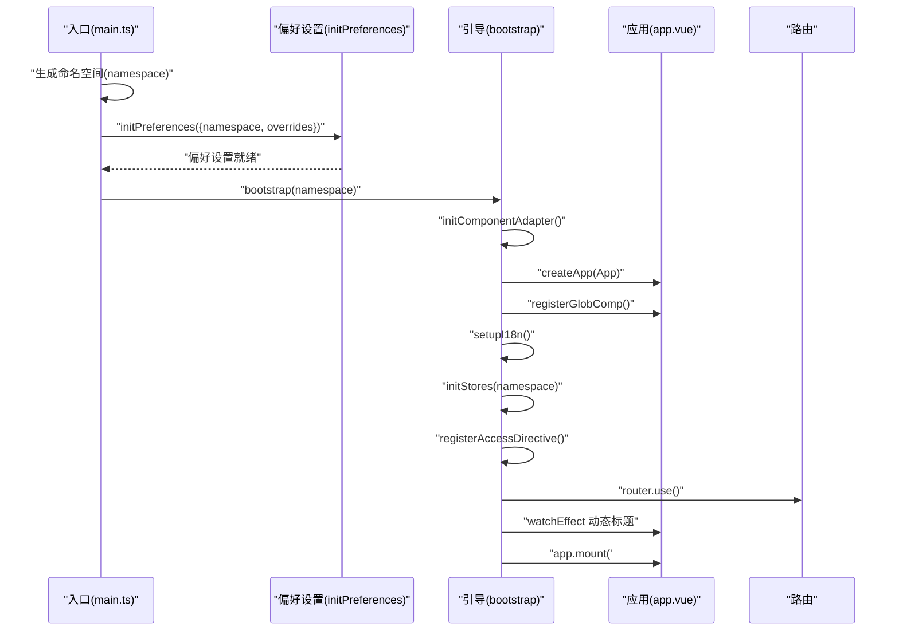
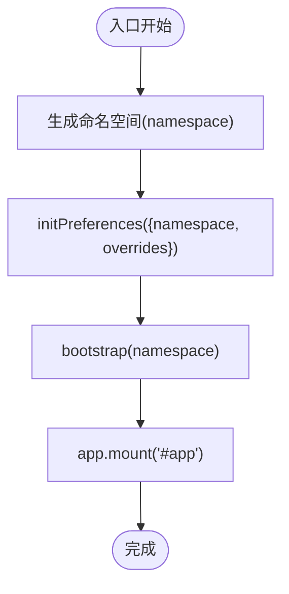
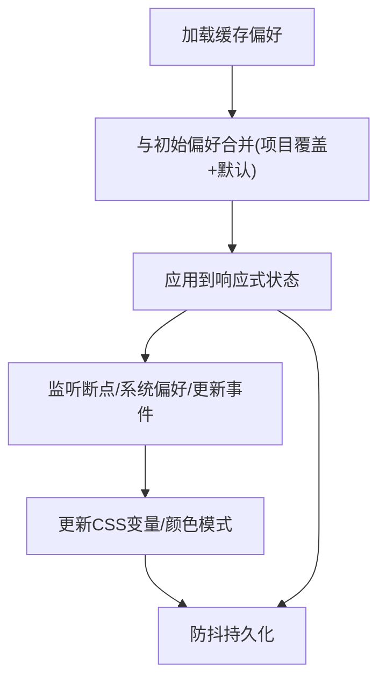
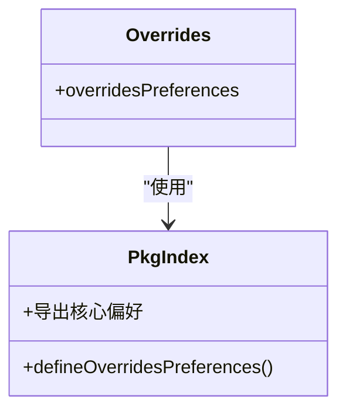
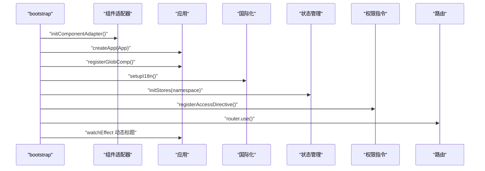
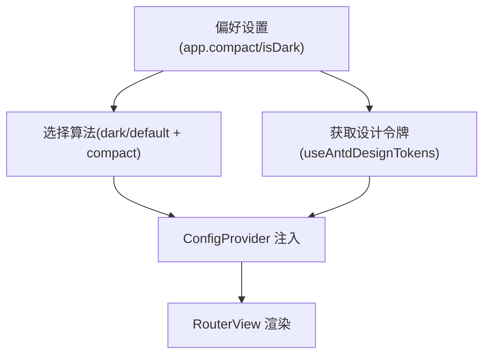
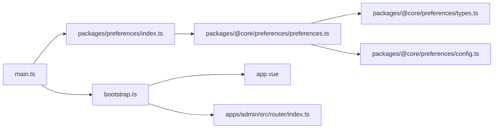

# Vben Admin 架构设计

<cite>
**本文引用的文件**
- [main.ts](file://frontend/admin/vue-vben/apps/admin/src/main.ts)
- [bootstrap.ts](file://frontend/admin/vue-vben/apps/admin/src/bootstrap.ts)
- [preferences.ts](file://frontend/admin/vue-vben/apps/admin/src/preferences.ts)
- [index.ts](file://frontend/admin/vue-vben/packages/preferences/src/index.ts)
- [preferences.ts](file://frontend/admin/vue-vben/packages/@core/preferences/src/preferences.ts)
- [types.ts](file://frontend/admin/vue-vben/packages/@core/preferences/src/types.ts)
- [config.ts](file://frontend/admin/vue-vben/packages/@core/preferences/src/config.ts)
- [index.ts](file://frontend/admin/vue-vben/packages/@core/preferences/src/index.ts)
- [app.vue](file://frontend/admin/vue-vben/apps/admin/src/app.vue)
- [index.ts](file://frontend/admin/vue-vben/apps/admin/src/router/index.ts)
</cite>

## 目录
1. [引言](#引言)
2. [项目结构](#项目结构)
3. [核心组件](#核心组件)
4. [架构总览](#架构总览)
5. [详细组件分析](#详细组件分析)
6. [依赖分析](#依赖分析)
7. [性能考虑](#性能考虑)
8. [故障排除指南](#故障排除指南)
9. [结论](#结论)

## 引言
本文件面向 Vben Admin 的前端架构设计，聚焦 Vue Vben 版本，系统性阐述应用初始化流程、偏好设置系统（含命名空间隔离与配置合并策略）、命名空间管理、以及从入口到引导完成的完整生命周期。文档同时提供架构图与组件关系图，帮助开发者快速理解系统设计思路与最佳实践。

## 项目结构
Vue Vben 应用采用多包/多应用的组织方式：应用层位于 apps/admin，偏好设置能力由 @core/preferences 提供，业务层通过 packages/preferences 进行二次封装与覆盖。入口文件负责初始化命名空间、偏好设置与引导应用；引导文件负责创建应用、注册全局组件、国际化、状态管理、权限指令与路由安装。

**图表来源**
- [main.ts:1-32](file://frontend/admin/vue-vben/apps/admin/src/main.ts#L1-L32)
- [bootstrap.ts:1-53](file://frontend/admin/vue-vben/apps/admin/src/bootstrap.ts#L1-L53)
- [preferences.ts:1-15](file://frontend/admin/vue-vben/apps/admin/src/preferences.ts#L1-L15)
- [index.ts:1-18](file://frontend/admin/vue-vben/packages/preferences/src/index.ts#L1-L18)
- [preferences.ts:1-229](file://frontend/admin/vue-vben/packages/@core/preferences/src/preferences.ts#L1-L229)
- [config.ts:1-116](file://frontend/admin/vue-vben/packages/@core/preferences/src/config.ts#L1-L116)
- [types.ts:1-282](file://frontend/admin/vue-vben/packages/@core/preferences/src/types.ts#L1-L282)
- [app.vue:1-40](file://frontend/admin/vue-vben/apps/admin/src/app.vue#L1-L40)
- [index.ts:1-38](file://frontend/admin/vue-vben/apps/admin/src/router/index.ts#L1-L38)

**章节来源**
- [main.ts:1-32](file://frontend/admin/vue-vben/apps/admin/src/main.ts#L1-L32)
- [bootstrap.ts:1-53](file://frontend/admin/vue-vben/apps/admin/src/bootstrap.ts#L1-L53)
- [preferences.ts:1-15](file://frontend/admin/vue-vben/apps/admin/src/preferences.ts#L1-L15)
- [index.ts:1-18](file://frontend/admin/vue-vben/packages/preferences/src/index.ts#L1-L18)
- [preferences.ts:1-229](file://frontend/admin/vue-vben/packages/@core/preferences/src/preferences.ts#L1-L229)
- [config.ts:1-116](file://frontend/admin/vue-vben/packages/@core/preferences/src/config.ts#L1-L116)
- [types.ts:1-282](file://frontend/admin/vue-vben/packages/@core/preferences/src/types.ts#L1-L282)
- [app.vue:1-40](file://frontend/admin/vue-vben/apps/admin/src/app.vue#L1-L40)
- [index.ts:1-38](file://frontend/admin/vue-vben/apps/admin/src/router/index.ts#L1-L38)

## 核心组件
- 应用入口与命名空间
  - 在入口文件中根据环境变量生成命名空间，并调用偏好设置初始化函数，随后异步引导应用。
- 偏好设置系统
  - 核心偏好管理器负责加载/合并/持久化偏好，支持响应式更新与主题/颜色模式联动。
  - 项目层通过覆盖函数对默认偏好进行增量覆盖。
- 应用引导
  - 引导阶段完成组件适配器初始化、全局组件注册、国际化、状态管理、权限指令与路由安装，并动态维护页面标题。
- 根组件与主题
  - 根组件基于 ConfigProvider 包裹，结合偏好设置与 Ant Design 设计令牌，按主题与紧凑模式动态计算主题配置。

**章节来源**
- [main.ts:9-29](file://frontend/admin/vue-vben/apps/admin/src/main.ts#L9-L29)
- [preferences.ts:161-187](file://frontend/admin/vue-vben/packages/@core/preferences/src/preferences.ts#L161-L187)
- [preferences.ts:8-14](file://frontend/admin/vue-vben/apps/admin/src/preferences.ts#L8-L14)
- [bootstrap.ts:18-49](file://frontend/admin/vue-vben/apps/admin/src/bootstrap.ts#L18-L49)
- [app.vue:13-30](file://frontend/admin/vue-vben/apps/admin/src/app.vue#L13-L30)

## 架构总览
下图展示从入口到引导完成的关键交互：命名空间生成 → 偏好设置初始化（含覆盖与合并）→ 组件适配器初始化 → 应用创建与插件安装 → 动态标题与挂载。

**图表来源**
- [main.ts:12-29](file://frontend/admin/vue-vben/apps/admin/src/main.ts#L12-L29)
- [bootstrap.ts:18-49](file://frontend/admin/vue-vben/apps/admin/src/bootstrap.ts#L18-L49)
- [app.vue:34-39](file://frontend/admin/vue-vben/apps/admin/src/app.vue#L34-L39)
- [index.ts:15-35](file://frontend/admin/vue-vben/apps/admin/src/router/index.ts#L15-L35)

## 详细组件分析

### 命名空间与应用初始化流程
- 命名空间生成
  - 基于环境与版本号拼接命名空间，确保不同项目、版本与环境下的偏好设置相互隔离。
- 初始化顺序
  - 先初始化偏好设置（含命名空间与覆盖），再引导应用，最后移除全局 loading。
- 生命周期要点
  - 异步加载避免阻塞首屏；命名空间贯穿后续所有偏好读写与持久化。

**图表来源**
- [main.ts:12-29](file://frontend/admin/vue-vben/apps/admin/src/main.ts#L12-L29)
- [bootstrap.ts:22-49](file://frontend/admin/vue-vben/apps/admin/src/bootstrap.ts#L22-L49)

**章节来源**
- [main.ts:12-29](file://frontend/admin/vue-vben/apps/admin/src/main.ts#L12-L29)

### 偏好设置系统：命名空间隔离与配置合并
- 命名空间隔离
  - 存储前缀以命名空间为准，确保不同应用/版本/环境的偏好数据互不干扰。
- 配置合并策略
  - 初始合并：项目覆盖 → 默认配置（项目覆盖优先）。
  - 运行时合并：用户更新与当前存储偏好合并，避免丢失用户设置。
- 响应式与联动
  - 主题变更 → CSS 变量同步；颜色模式变更 → DOM 类名切换；移动端断点监听 → 自动更新状态。
- 缓存与清理
  - 提供统一缓存键与清理接口，便于调试与迁移。

**图表来源**
- [preferences.ts:161-187](file://frontend/admin/vue-vben/packages/@core/preferences/src/preferences.ts#L161-L187)
- [preferences.ts:216-224](file://frontend/admin/vue-vben/packages/@core/preferences/src/preferences.ts#L216-L224)
- [config.ts:3-113](file://frontend/admin/vue-vben/packages/@core/preferences/src/config.ts#L3-L113)

**章节来源**
- [preferences.ts:161-187](file://frontend/admin/vue-vben/packages/@core/preferences/src/preferences.ts#L161-L187)
- [preferences.ts:216-224](file://frontend/admin/vue-vben/packages/@core/preferences/src/preferences.ts#L216-L224)
- [config.ts:3-113](file://frontend/admin/vue-vben/packages/@core/preferences/src/config.ts#L3-L113)

### 项目偏好覆盖与导出
- 项目覆盖
  - 仅需覆盖必要字段，未覆盖部分自动继承默认配置；覆盖对象通过封装函数导出，便于集中管理。
- 导出与复用
  - 通过统一导出函数暴露给入口文件，形成“项目配置”与“核心偏好”的解耦。

**图表来源**
- [preferences.ts:8-14](file://frontend/admin/vue-vben/apps/admin/src/preferences.ts#L8-L14)
- [index.ts:11-15](file://frontend/admin/vue-vben/packages/preferences/src/index.ts#L11-L15)

**章节来源**
- [preferences.ts:8-14](file://frontend/admin/vue-vben/apps/admin/src/preferences.ts#L8-L14)
- [index.ts:11-15](file://frontend/admin/vue-vben/packages/preferences/src/index.ts#L11-L15)

### 应用引导与插件安装
- 组件适配器初始化
  - 在应用创建前完成，保证后续组件注册与样式生效。
- 插件与配置
  - 国际化、状态管理、权限指令、路由安装与守卫创建均在引导阶段完成。
- 动态标题
  - 监听路由元信息与偏好设置，动态组合页面标题。

**图表来源**
- [bootstrap.ts:18-49](file://frontend/admin/vue-vben/apps/admin/src/bootstrap.ts#L18-L49)

**章节来源**
- [bootstrap.ts:18-49](file://frontend/admin/vue-vben/apps/admin/src/bootstrap.ts#L18-L49)

### 根组件与主题联动
- 主题计算
  - 基于偏好设置的紧凑模式与深色/浅色模式，动态选择算法与设计令牌。
- 国际化与容器
  - 根组件以 ConfigProvider 包裹，注入语言与主题配置，统一承载子组件。

**图表来源**
- [app.vue:13-30](file://frontend/admin/vue-vben/apps/admin/src/app.vue#L13-L30)

**章节来源**
- [app.vue:13-30](file://frontend/admin/vue-vben/apps/admin/src/app.vue#L13-L30)

## 依赖分析
- 入口对引导的依赖
  - 入口负责命名空间与偏好初始化，随后调用引导函数，形成清晰的职责边界。
- 引导对各模块的依赖
  - 引导阶段串联组件适配器、国际化、状态管理、权限指令与路由，体现“装配器”角色。
- 偏好系统内部依赖
  - 偏好管理器依赖默认配置、类型定义与工具库，形成稳定的配置内核。

**图表来源**
- [main.ts:1-32](file://frontend/admin/vue-vben/apps/admin/src/main.ts#L1-L32)
- [bootstrap.ts:1-53](file://frontend/admin/vue-vben/apps/admin/src/bootstrap.ts#L1-L53)
- [index.ts:1-18](file://frontend/admin/vue-vben/packages/preferences/src/index.ts#L1-L18)
- [preferences.ts:1-229](file://frontend/admin/vue-vben/packages/@core/preferences/src/preferences.ts#L1-L229)
- [types.ts:1-282](file://frontend/admin/vue-vben/packages/@core/preferences/src/types.ts#L1-L282)
- [config.ts:1-116](file://frontend/admin/vue-vben/packages/@core/preferences/src/config.ts#L1-L116)
- [app.vue:1-40](file://frontend/admin/vue-vben/apps/admin/src/app.vue#L1-L40)
- [index.ts:1-38](file://frontend/admin/vue-vben/apps/admin/src/router/index.ts#L1-L38)

**章节来源**
- [main.ts:1-32](file://frontend/admin/vue-vben/apps/admin/src/main.ts#L1-L32)
- [bootstrap.ts:1-53](file://frontend/admin/vue-vben/apps/admin/src/bootstrap.ts#L1-L53)
- [index.ts:1-18](file://frontend/admin/vue-vben/packages/preferences/src/index.ts#L1-L18)
- [preferences.ts:1-229](file://frontend/admin/vue-vben/packages/@core/preferences/src/preferences.ts#L1-L229)
- [types.ts:1-282](file://frontend/admin/vue-vben/packages/@core/preferences/src/types.ts#L1-L282)
- [config.ts:1-116](file://frontend/admin/vue-vben/packages/@core/preferences/src/config.ts#L1-L116)
- [app.vue:1-40](file://frontend/admin/vue-vben/apps/admin/src/app.vue#L1-L40)
- [index.ts:1-38](file://frontend/admin/vue-vben/apps/admin/src/router/index.ts#L1-L38)

## 性能考虑
- 防抖持久化
  - 对偏好更新进行防抖处理，降低频繁写入缓存的开销。
- 响应式与最小化更新
  - 仅在相关键变更时触发主题与颜色模式更新，减少不必要的 DOM 操作。
- 异步引导
  - 入口与引导阶段采用异步加载，避免阻塞首屏渲染。
- 缓存键分离
  - 将主题与语言独立缓存，便于按需清理与迁移。

## 故障排除指南
- 偏好设置未生效
  - 检查命名空间是否正确传入；确认覆盖配置是否正确导出；必要时清理缓存键后重试。
- 主题或颜色模式未更新
  - 确认偏好更新路径是否触发了主题与颜色模式处理逻辑；检查系统主题监听是否正常。
- 路由标题未动态更新
  - 确认路由元信息是否存在标题键；检查动态标题开关是否开启。

**章节来源**
- [preferences.ts:142-146](file://frontend/admin/vue-vben/packages/@core/preferences/src/preferences.ts#L142-L146)
- [bootstrap.ts:40-47](file://frontend/admin/vue-vben/apps/admin/src/bootstrap.ts#L40-L47)

## 结论
Vben Admin 的前端架构以“入口 → 偏好 → 引导 → 根组件”为主线，通过命名空间实现多项目/多版本隔离，通过覆盖与合并策略实现灵活配置，配合响应式与防抖持久化保障性能与体验。该设计既满足可扩展性，又保持了清晰的职责边界与良好的可维护性。