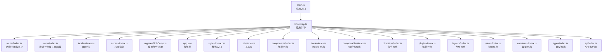
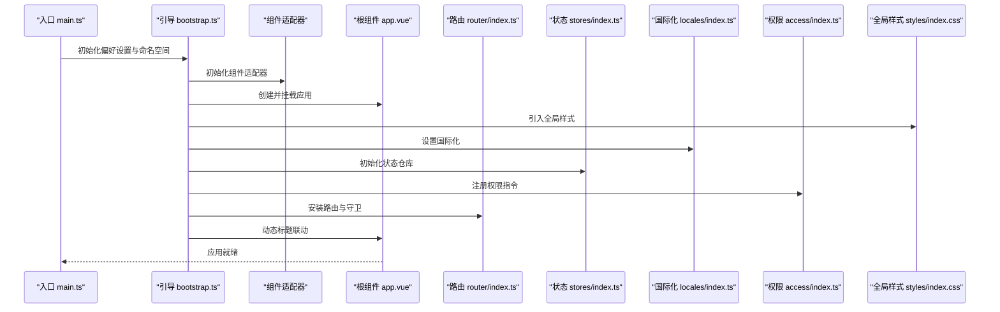
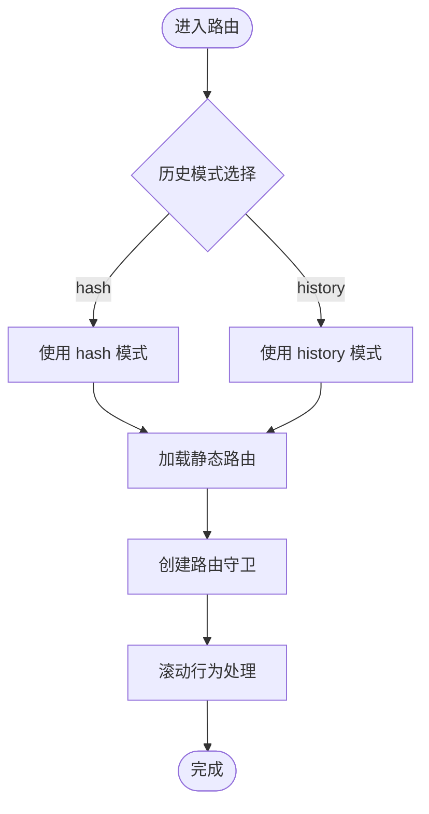
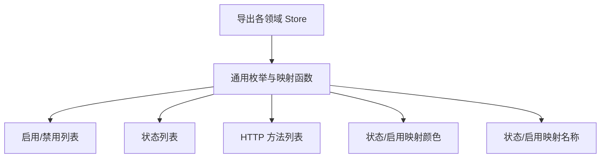
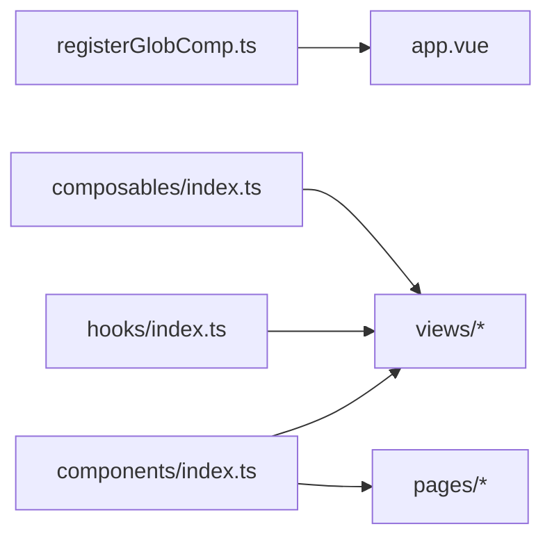
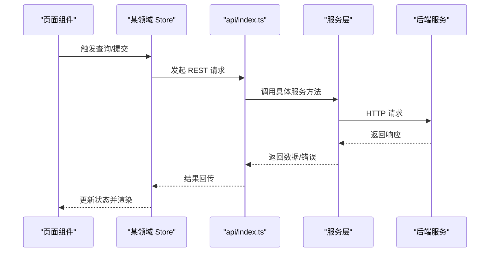
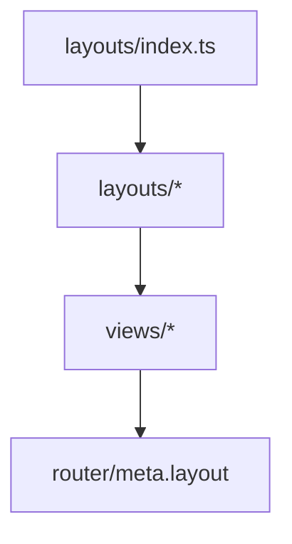
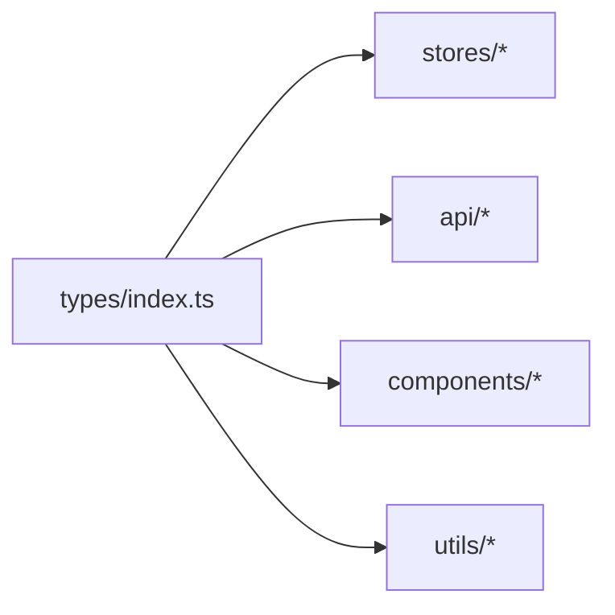
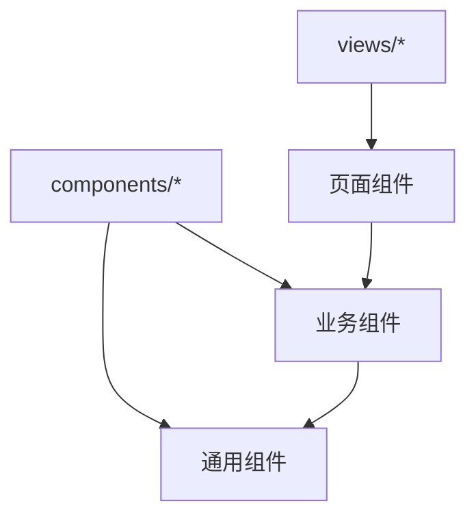
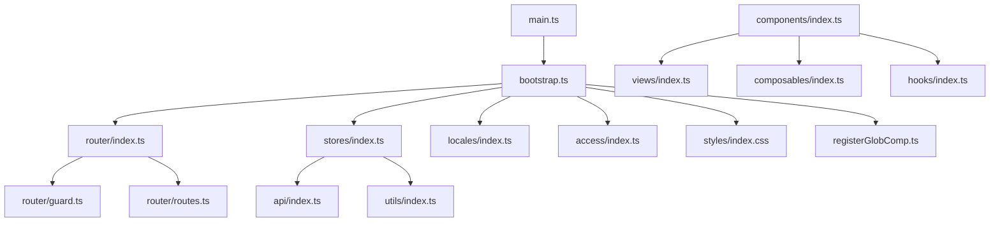

# Vue3 + Vben Admin 框架

<cite>
**本文引用的文件**
- [main.ts](file://frontend/admin/vue-vben/apps/admin/src/main.ts)
- [bootstrap.ts](file://frontend/admin/vue-vben/apps/admin/src/bootstrap.ts)
- [router/index.ts](file://frontend/admin/vue-vben/apps/admin/src/router/index.ts)
- [stores/index.ts](file://frontend/admin/vue-vben/apps/admin/src/stores/index.ts)
- [preferences.ts](file://frontend/admin/vue-vben/apps/admin/src/preferences.ts)
- [app.vue](file://frontend/admin/vue-vben/apps/admin/src/app.vue)
- [registerGlobComp.ts](file://frontend/admin/vue-vben/apps/admin/src/registerGlobComp.ts)
- [locales/index.ts](file://frontend/admin/vue-vben/apps/admin/src/locales/index.ts)
- [access/index.ts](file://frontend/admin/vue-vben/apps/admin/src/access/index.ts)
- [styles/index.css](file://frontend/admin/vue-vben/apps/admin/src/styles/index.css)
- [utils/index.ts](file://frontend/admin/vue-vben/apps/admin/src/utils/index.ts)
- [components/index.ts](file://frontend/admin/vue-vben/apps/admin/src/components/index.ts)
- [hooks/index.ts](file://frontend/admin/vue-vben/apps/admin/src/hooks/index.ts)
- [composables/index.ts](file://frontend/admin/vue-vben/apps/admin/src/composables/index.ts)
- [directives/index.ts](file://frontend/admin/vue-vben/apps/admin/src/directives/index.ts)
- [plugins/index.ts](file://frontend/admin/vue-vben/apps/admin/src/plugins/index.ts)
- [layouts/index.ts](file://frontend/admin/vue-vben/apps/admin/src/layouts/index.ts)
- [views/index.ts](file://frontend/admin/vue-vben/apps/admin/src/views/index.ts)
- [constants/index.ts](file://frontend/admin/vue-vben/apps/admin/src/constants/index.ts)
- [types/index.ts](file://frontend/admin/vue-vben/apps/admin/src/types/index.ts)
- [api/index.ts](file://frontend/admin/vue-vben/apps/admin/src/api/index.ts)
- [router/guard.ts](file://frontend/admin/vue-vben/apps/admin/src/router/guard.ts)
- [router/routes.ts](file://frontend/admin/vue-vben/apps/admin/src/router/routes.ts)
- [stores/admin-portal.store.ts](file://frontend/admin/vue-vben/apps/admin/src/stores/admin-portal.store.ts)
- [stores/authentication.store.ts](file://frontend/admin/vue-vben/apps/admin/src/stores/authentication.store.ts)
- [stores/menu.store.ts](file://frontend/admin/vue-vben/apps/admin/src/stores/menu.store.ts)
- [stores/user.store.ts](file://frontend/admin/vue-vben/apps/admin/src/stores/user.store.ts)
- [stores/role.store.ts](file://frontend/admin/vue-vben/apps/admin/src/stores/role.store.ts)
- [stores/permission.store.ts](file://frontend/admin/vue-vben/apps/admin/src/stores/permission.store.ts)
- [stores/dict.store.ts](file://frontend/admin/vue-vben/apps/admin/src/stores/dict.store.ts)
- [stores/org-unit.store.ts](file://frontend/admin/vue-vben/apps/admin/src/stores/org-unit.store.ts)
- [stores/tenant.store.ts](file://frontend/admin/vue-vben/apps/admin/src/stores/tenant.store.ts)
- [stores/task.store.ts](file://frontend/admin/vue-vben/apps/admin/src/stores/task.store.ts)
- [stores/file.store.ts](file://frontend/admin/vue-vben/apps/admin/src/stores/file.store.ts)
- [stores/internal-message.store.ts](file://frontend/admin/vue-vben/apps/admin/src/stores/internal-message.store.ts)
- [stores/language.store.ts](file://frontend/admin/vue-vben/apps/admin/src/stores/language.store.ts)
- [stores/api.store.ts](file://frontend/admin/vue-vben/apps/admin/src/stores/api.store.ts)
- [stores/login-policy.store.ts](file://frontend/admin/vue-vben/apps/admin/src/stores/login-policy.store.ts)
- [stores/position.store.ts](file://frontend/admin/vue-vben/apps/admin/src/stores/position.store.ts)
- [stores/user-profile.store.ts](file://frontend/admin/vue-vben/apps/admin/src/stores/user-profile.store.ts)
- [stores/api-audit-log.store.ts](file://frontend/admin/vue-vben/apps/admin/src/stores/api-audit-log.store.ts)
- [stores/data-access-audit-log.store.ts](file://frontend/admin/vue-vben/apps/admin/src/stores/data-access-audit-log.store.ts)
- [stores/login-audit-log.store.ts](file://frontend/admin/vue-vben/apps/admin/src/stores/login-audit-log.store.ts)
- [stores/operation-audit-log.store.ts](file://frontend/admin/vue-vben/apps/admin/src/stores/operation-audit-log.store.ts)
- [stores/permission-audit-log.store.ts](file://frontend/admin/vue-vben/apps/admin/src/stores/permission-audit-log.store.ts)
- [stores/permission-group.store.ts](file://frontend/admin/vue-vben/apps/admin/src/stores/permission-group.store.ts)
- [stores/policy-evaluation-log.store.ts](file://frontend/admin/vue-vben/apps/admin/src/stores/policy-evaluation-log.store.ts)
- [stores/file-transfer.store.ts](file://frontend/admin/vue-vben/apps/admin/src/stores/file-transfer.store.ts)
- [stores/internal-message-category.store.ts](file://frontend/admin/vue-vben/apps/admin/src/stores/internal-message-category.store.ts)
- [stores/internal-message-recipent.store.ts](file://frontend/admin/vue-vben/apps/admin/src/stores/internal-message-recipent.store.ts)
- [stores/language.store.ts](file://frontend/admin/vue-vben/apps/admin/src/stores/language.store.ts)
- [stores/audit-log.store.ts](file://frontend/admin/vue-vben/apps/admin/src/stores/audit-log.store.ts)
- [stores/audit-log-entry.store.ts](file://frontend/admin/vue-vben/apps/admin/src/stores/audit-log-entry.store.ts)
- [stores/audit-log-entry-detail.store.ts](file://frontend/admin/vue-vben/apps/admin/src/stores/audit-log-entry-detail.store.ts)
- [stores/audit-log-entry-summary.store.ts](file://frontend/admin/vue-vben/apps/admin/src/stores/audit-log-entry-summary.store.ts)
- [stores/audit-log-entry-filter.store.ts](file://frontend/admin/vue-vben/apps/admin/src/stores/audit-log-entry-filter.store.ts)
- [stores/audit-log-entry-paging.store.ts](file://frontend/admin/vue-vben/apps/admin/src/stores/audit-log-entry-paging.store.ts)
- [stores/audit-log-entry-sort.store.ts](file://frontend/admin/vue-vben/apps/admin/src/stores/audit-log-entry-sort.store.ts)
- [stores/audit-log-entry-search.store.ts](file://frontend/admin/vue-vben/apps/admin/src/stores/audit-log-entry-search.store.ts)
- [stores/audit-log-entry-export.store.ts](file://frontend/admin/vue-vben/apps/admin/src/stores/audit-log-entry-export.store.ts)
- [stores/audit-log-entry-print.store.ts](file://frontend/admin/vue-vben/apps/admin/src/stores/audit-log-entry-print.store.ts)
- [stores/audit-log-entry-action.store.ts](file://frontend/admin/vue-vben/apps/admin/src/stores/audit-log-entry-action.store.ts)
- [stores/audit-log-entry-state.store.ts](file://frontend/admin/vue-vben/apps/admin/src/stores/audit-log-entry-state.store.ts)
- [stores/audit-log-entry-cache.store.ts](file://frontend/admin/vue-vben/apps/admin/src/stores/audit-log-entry-cache.store.ts)
- [stores/audit-log-entry-session.store.ts](file://frontend/admin/vue-vben/apps/admin/src/stores/audit-log-entry-session.store.ts)
- [stores/audit-log-entry-user.store.ts](file://frontend/admin/vue-vben/apps/admin/src/stores/audit-log-entry-user.store.ts)
- [stores/audit-log-entry-tenant.store.ts](file://frontend/admin/vue-vben/apps/admin/src/stores/audit-log-entry-tenant.store.ts)
- [stores/audit-log-entry-org.store.ts](file://frontend/admin/vue-vben/apps/admin/src/stores/audit-log-entry-org.store.ts)
- [stores/audit-log-entry-position.store.ts](file://frontend/admin/vue-vben/apps/admin/src/stores/audit-log-entry-position.store.ts)
- [stores/audit-log-entry-role.store.ts](file://frontend/admin/vue-vben/apps/admin/src/stores/audit-log-entry-role.store.ts)
- [stores/audit-log-entry-permission.store.ts](file://frontend/admin/vue-vben/apps/admin/src/stores/audit-log-entry-permission.store.ts)
- [stores/audit-log-entry-dict.store.ts](file://frontend/admin/vue-vben/apps/admin/src/stores/audit-log-entry-dict.store.ts)
- [stores/audit-log-entry-file.store.ts](file://frontend/admin/vue-vben/apps/admin/src/stores/audit-log-entry-file.store.ts)
- [stores/audit-log-entry-api.store.ts](file://frontend/admin/vue-vben/apps/admin/src/stores/audit-log-entry-api.store.ts)
- [stores/audit-log-entry-login.store.ts](file://frontend/admin/vue-vben/apps/admin/src/stores/audit-log-entry-login.store.ts)
- [stores/audit-log-entry-operation.store.ts](file://frontend/admin/vue-vben/apps/admin/src/stores/audit-log-entry-operation.store.ts)
- [stores/audit-log-entry-internal-message.store.ts](file://frontend/admin/vue-vben/apps/admin/src/stores/audit-log-entry-internal-message.store.ts)
- [stores/audit-log-entry-language.store.ts](file://frontend/admin/vue-vben/apps/admin/src/stores/audit-log-entry-language.store.ts)
- [stores/audit-log-entry-task.store.ts](file://frontend/admin/vue-vben/apps/admin/src/stores/audit-log-entry-task.store.ts)
- [stores/audit-log-entry-policy.store.ts](file://frontend/admin/vue-vben/apps/admin/src/stores/audit-log-entry-policy.store.ts)
- [stores/audit-log-entry-transfer.store.ts](file://frontend/admin/vue-vben/apps/admin/src/stores/audit-log-entry-transfer.store.ts)
- [stores/audit-log-entry-category.store.ts](file://frontend/admin/vue-vben/apps/admin/src/stores/audit-log-entry-category.store.ts)
- [stores/audit-log-entry-recipent.store.ts](file://frontend/admin/vue-vben/apps/admin/src/stores/audit-log-entry-recipent.store.ts)
- [stores/audit-log-entry-recipient.store.ts](file://frontend/admin/vue-vben/apps/admin/src/stores/audit-log-entry-recipient.store.ts)
- [stores/audit-log-entry-recipient-list.store.ts](file://frontend/admin/vue-vben/apps/admin/src/stores/audit-log-entry-recipient-list.store.ts)
- [stores/audit-log-entry-recipient-filter.store.ts](file://frontend/admin/vue-vben/apps/admin/src/stores/audit-log-entry-recipient-filter.store.ts)
- [stores/audit-log-entry-recipient-paging.store.ts](file://frontend/admin/vue-vben/apps/admin/src/stores/audit-log-entry-recipient-paging.store.ts)
- [stores/audit-log-entry-recipient-sort.store.ts](file://frontend/admin/vue-vben/apps/admin/src/stores/audit-log-entry-recipient-sort.store.ts)
- [stores/audit-log-entry-recipient-search.store.ts](file://frontend/admin/vue-vben/apps/admin/src/stores/audit-log-entry-recipient-search.store.ts)
- [stores/audit-log-entry-recipient-export.store.ts](file://frontend/admin/vue-vben/apps/admin/src/stores/audit-log-entry-recipient-export.store.ts)
- [stores/audit-log-entry-recipient-print.store.ts](file://frontend/admin/vue-vben/apps/admin/src/stores/audit-log-entry-recipient-print.store.ts)
- [stores/audit-log-entry-recipient-action.store.ts](file://frontend/admin/vue-vben/apps/admin/src/stores/audit-log-entry-recipient-action.store.ts)
- [stores/audit-log-entry-recipient-state.store.ts](file://frontend/admin/vue-vben/apps/admin/src/stores/audit-log-entry-recipient-state.store.ts)
- [stores/audit-log-entry-recipient-cache.store.ts](file://frontend/admin/vue-vben/apps/admin/src/stores/audit-log-entry-recipient-cache.store.ts)
- [stores/audit-log-entry-recipient-session.store.ts](file://frontend/admin/vue-vben/apps/admin/src/stores/audit-log-entry-recipient-session.store.ts)
- [stores/audit-log-entry-recipient-user.store.ts](file://frontend/admin/vue-vben/apps/admin/src/stores/audit-log-entry-recipient-user.store.ts)
- [stores/audit-log-entry-recipient-tenant.store.ts](file://frontend/admin/vue-vben/apps/admin/src/stores/audit-log-entry-recipient-tenant.store.ts)
- [stores/audit-log-entry-recipient-org.store.ts](file://frontend/admin/vue-vben/apps/admin/src/stores/audit-log-entry-recipient-org.store.ts)
- [stores/audit-log-entry-recipient-position.store.ts](file://frontend/admin/vue-vben/apps/admin/src/stores/audit-log-entry-recipient-position.store.ts)
- [stores/audit-log-entry-recipient-role.store.ts](file://frontend/admin/vue-vben/apps/admin/src/stores/audit-log-entry-recipient-role.store.ts)
- [stores/audit-log-entry-recipient-permission.store.ts](file://frontend/admin/vue-vben/apps/admin/src/stores/audit-log-entry-recipient-permission.store.ts)
- [stores/audit-log-entry-recipient-dict.store.ts](file://frontend/admin/vue-vben/apps/admin/src/stores/audit-log-entry-recipient-dict.store.ts)
- [stores/audit-log-entry-recipient-file.store.ts](file://frontend/admin/vue-vben/apps/admin/src/stores/audit-log-entry-recipient-file.store.ts)
- [stores/audit-log-entry-recipient-api.store.ts](file://frontend/admin/vue-vben/apps/admin/src/stores/audit-log-entry-recipient-api.store.ts)
- [stores/audit-log-entry-recipient-login.store.ts](file://frontend/admin/vue-vben/apps/admin/src/stores/audit-log-entry-recipient-login.store.ts)
- [stores/audit-log-entry-recipient-operation.store.ts](file://frontend/admin/vue-vben/apps/admin/src/stores/audit-log-entry-recipient-operation.store.ts)
- [stores/audit-log-entry-recipient-internal-message.store.ts](file://frontend/admin/vue-vben/apps/admin/src/stores/audit-log-entry-recipient-internal-message.store.ts)
- [stores/audit-log-entry-recipient-language.store.ts](file://frontend/admin/vue-vben/apps/admin/src/stores/audit-log-entry-recipient-language.store.ts)
- [stores/audit-log-entry-recipient-task.store.ts](file://frontend/admin/vue-vben/apps/admin/src/stores/audit-log-entry-recipient-task.store.ts)
- [stores/audit-log-entry-recipient-policy.store.ts](file://frontend/admin/vue-vben/apps/admin/src/stores/audit-log-entry-recipient-policy.store.ts)
- [stores/audit-log-entry-recipient-transfer.store.ts](file://frontend/admin/vue-vben/apps/admin/src/stores/audit-log-entry-recipient-transfer.store.ts)
- [stores/audit-log-entry-recipient-category.store.ts](file://frontend/admin/vue-vben/apps/admin/src/stores/audit-log-entry-recipient-category.store.ts)
- [stores/audit-log-entry-recipient-recipent.store.ts](file://frontend/admin/vue-vben/apps/admin/src/stores/audit-log-entry-recipient-recipent.store.ts)
- [stores/audit-log-entry-recipient-recipent-list.store.ts](file://frontend/admin/vue-vben/apps/admin/src/stores/audit-log-entry-recipient-recipent-list.store.ts)
- [stores/audit-log-entry-recipient-recipent-filter.store.ts](file://frontend/admin/vue-vben/apps/admin/src/stores/audit-log-entry-recipient-recipent-filter.store.ts)
- [stores/audit-log-entry-recipient-recipent-paging.store.ts](file://frontend/admin/vue-vben/apps/admin/src/stores/audit-log-entry-recipient-recipent-paging.store.ts)
- [stores/audit-log-entry-recipient-recipent-sort.store.ts](file://frontend/admin/vue-vben/apps/admin/src/stores/audit-log-entry-recipient-recipent-sort.store.ts)
- [stores/audit-log-entry-recipient-recipent-search.store.ts](file://frontend/admin/vue-vben/apps/admin/src/stores/audit-log-entry-recipient-recipent-search.store.ts)
- [stores/audit-log-entry-recipient-recipent-export.store.ts](file://frontend/admin/vue-vben/apps/admin/src/stores/audit-log-entry-recipient-recipent-export.store.ts)
- [stores/audit-log-entry-recipient-recipent-print.store.ts](file://frontend/admin/vue-vben/apps/admin/src/stores/audit-log-entry-recipient-recipent-print.store.ts)
- [stores/audit-log-entry-recipient-recipent-action.store.ts](file://frontend/admin/vue-vben/apps/admin/src/stores/audit-log-entry-recipient-recipent-action.store.ts)
- [stores/audit-log-entry-recipient-recipent-state.store.ts](file://frontend/admin/vue-vben/apps/admin/src/stores/audit-log-entry-recipient-recipent-state.store.ts)
- [stores/audit-log-entry-recipient-recipent-cache.store.ts](file://frontend/admin/vue-vben/apps/admin/src/stores/audit-log-entry-recipient-recipent-cache.store.ts)
- [stores/audit-log-entry-recipient-recipent-session.store.ts](file://frontend/admin/vue-vben/apps/admin/src/stores/audit-log-entry-recipient-recipent-session.store.ts)
- [stores/audit-log-entry-recipient-recipent-user.store.ts](file://frontend/admin/vue-vben/apps/admin/src/stores/audit-log-entry-recipient-recipent-user.store.ts)
- [stores/audit-log-entry-recipient-recipent-tenant.store.ts](file://frontend/admin/vue-vben/apps/admin/src/stores/audit-log-entry-recipient-recipent-tenant.store.ts)
- [stores/audit-log-entry-recipient-recipent-org.store.ts](file://frontend/admin/vue-vben/apps/admin/src/stores/audit-log-entry-recipient-recipent-org.store.ts)
- [stores/audit-log-entry-recipient-recipent-position.store.ts](file://frontend/admin/vue-vben/apps/admin/src/stores/audit-log-entry-recipient-recipent-position.store.ts)
- [stores/audit-log-entry-recipient-recipent-role.store.ts](file://frontend/admin/vue-vben/apps/admin/src/stores/audit-log-entry-recipient-recipent-role.store.ts)
- [stores/audit-log-entry-recipient-recipent-permission.store.ts](file://frontend/admin/vue-vben/apps/admin/src/stores/audit-log-entry-recipient-recipent-permission.store.ts)
- [stores/audit-log-entry-recipient-recipent-dict.store.ts](file://frontend/admin/vue-vben/apps/admin/src/stores/audit-log-entry-recipient-recipent-dict.store.ts)
- [stores/audit-log-entry-recipient-recipent-file.store.ts](file://frontend/admin/vue-vben/apps/admin/src/stores/audit-log-entry-recipient-recipent-file.store.ts)
- [stores/audit-log-entry-recipient-recipent-api.store.ts](file://frontend/admin/vue-vben/apps/admin/src/stores/audit-log-entry-recipient-recipent-api.store.ts)
- [stores/audit-log-entry-recipient-recipent-login.store.ts](file://frontend/admin/vue-vben/apps/admin/src/stores/audit-log-entry-recipient-recipent-login.store.ts)
- [stores/audit-log-entry-recipient-recipent-operation.store.ts](file://frontend/admin/vue-vben/apps/admin/src/stores/audit-log-entry-recipient-recipent-operation.store.ts)
- [stores/audit-log-entry-recipient-recipent-internal-message.store.ts](file://frontend/admin/vue-vben/apps/admin/src/stores/audit-log-entry-recipient-recipent-internal-message.store.ts)
- [stores/audit-log-entry-recipient-recipent-language.store.ts](file://frontend/admin/vue-vben/apps/admin/src/stores/audit-log-entry-recipient-recipent-language.store.ts)
- [stores/audit-log-entry-recipient-recipent-task.store.ts](file://frontend/admin/vue-vben/apps/admin/src/stores/audit-log-entry-recipient-recipent-task.store.ts)
- [stores/audit-log-entry-recipient-recipent-policy.store.ts](file://frontend/admin/vue-vben/apps/admin/src/stores/audit-log-entry-recipient-recipent-policy.store.ts)
- [stores/audit-log-entry-recipient-recipent-transfer.store.ts](file://frontend/admin/vue-vben/apps/admin/src/stores/audit-log-entry-recipient-recipent-transfer.store.ts)
- [stores/audit-log-entry-recipient-recipent-category.store.ts](file://frontend/admin/vue-vben/apps/admin/src/stores/audit-log-entry-recipient-recipent-category.store.ts)
- [stores/audit-log-entry-recipient-recipent-recipent.store.ts](file://frontend/admin/vue-vben/apps/admin/src/stores/audit-log-entry-recipient-recipent-recipent.store.ts)
</cite>

## 目录
1. [简介](#简介)
2. [项目结构](#项目结构)
3. [核心组件](#核心组件)
4. [架构总览](#架构总览)
5. [详细组件分析](#详细组件分析)
6. [依赖分析](#依赖分析)
7. [性能考虑](#性能考虑)
8. [故障排查指南](#故障排查指南)
9. [结论](#结论)
10. [附录](#附录)

## 简介
本文件面向 Vue3 + Vben Admin 框架的开发者，系统性梳理前端工程的架构设计与实现要点，覆盖组件系统、状态管理、路由配置、布局系统、国际化、权限控制、API 客户端封装与调用（含 REST 与 SSE）、TypeScript 类型体系、组件开发模式（页面组件、业务组件、通用组件）以及常见开发示例与调试优化建议。文档以实际源码为依据，配合可视化图表帮助快速理解与落地。

## 项目结构
Vben Admin 前端采用多包工作区组织，核心应用位于 vue-vben/apps/admin，围绕以下关键目录展开：
- 根入口与引导：main.ts、bootstrap.ts
- 路由与守卫：router/
- 状态管理：stores/
- 国际化：locales/
- 权限指令：access/
- 全局样式：styles/
- 工具与通用：utils/
- 组件与组合式：components/、composables/、hooks/、directives/、plugins/
- 视图层：views/
- 布局：layouts/
- 常量与类型：constants/、types/
- API 客户端：api/



**图表来源**
- [main.ts:1-32](file://frontend/admin/vue-vben/apps/admin/src/main.ts#L1-L32)
- [bootstrap.ts:1-53](file://frontend/admin/vue-vben/apps/admin/src/bootstrap.ts#L1-L53)
- [router/index.ts:1-38](file://frontend/admin/vue-vben/apps/admin/src/router/index.ts#L1-L38)
- [stores/index.ts:1-136](file://frontend/admin/vue-vben/apps/admin/src/stores/index.ts#L1-L136)
- [locales/index.ts](file://frontend/admin/vue-vben/apps/admin/src/locales/index.ts)
- [access/index.ts](file://frontend/admin/vue-vben/apps/admin/src/access/index.ts)
- [registerGlobComp.ts](file://frontend/admin/vue-vben/apps/admin/src/registerGlobComp.ts)
- [app.vue](file://frontend/admin/vue-vben/apps/admin/src/app.vue)
- [styles/index.css](file://frontend/admin/vue-vben/apps/admin/src/styles/index.css)
- [utils/index.ts](file://frontend/admin/vue-vben/apps/admin/src/utils/index.ts)
- [components/index.ts](file://frontend/admin/vue-vben/apps/admin/src/components/index.ts)
- [hooks/index.ts](file://frontend/admin/vue-vben/apps/admin/src/hooks/index.ts)
- [composables/index.ts](file://frontend/admin/vue-vben/apps/admin/src/composables/index.ts)
- [directives/index.ts](file://frontend/admin/vue-vben/apps/admin/src/directives/index.ts)
- [plugins/index.ts](file://frontend/admin/vue-vben/apps/admin/src/plugins/index.ts)
- [layouts/index.ts](file://frontend/admin/vue-vben/apps/admin/src/layouts/index.ts)
- [views/index.ts](file://frontend/admin/vue-vben/apps/admin/src/views/index.ts)
- [constants/index.ts](file://frontend/admin/vue-vben/apps/admin/src/constants/index.ts)
- [types/index.ts](file://frontend/admin/vue-vben/apps/admin/src/types/index.ts)
- [api/index.ts](file://frontend/admin/vue-vben/apps/admin/src/api/index.ts)

**章节来源**
- [main.ts:1-32](file://frontend/admin/vue-vben/apps/admin/src/main.ts#L1-L32)
- [bootstrap.ts:1-53](file://frontend/admin/vue-vben/apps/admin/src/bootstrap.ts#L1-L53)

## 核心组件
- 应用入口与偏好设置：通过命名空间隔离偏好设置与本地存储键，按环境与版本生成唯一命名空间，确保多项目或多版本共存安全。
- 应用引导：统一注册全局组件、国际化、状态、权限指令、路由；动态标题联动；挂载根组件。
- 路由系统：支持 hash 与 history 两种历史记录模式，滚动行为平滑定位，提供静态路由重置能力与路由守卫。
- 状态管理：集中导出各领域 Store，并提供通用枚举列表、状态映射颜色与名称等工具函数。
- 国际化与权限：国际化在引导阶段初始化；权限指令在引导阶段安装。
- 样式与工具：统一引入样式入口与工具库，便于扩展与维护。
- 组件生态：通过全局组件注册与模块化导出，形成页面、业务、通用组件的分层体系。

**章节来源**
- [main.ts:9-29](file://frontend/admin/vue-vben/apps/admin/src/main.ts#L9-L29)
- [bootstrap.ts:18-50](file://frontend/admin/vue-vben/apps/admin/src/bootstrap.ts#L18-L50)
- [router/index.ts:15-37](file://frontend/admin/vue-vben/apps/admin/src/router/index.ts#L15-L37)
- [stores/index.ts:32-136](file://frontend/admin/vue-vben/apps/admin/src/stores/index.ts#L32-L136)

## 架构总览
下图展示从入口到视图的关键交互流程，涵盖初始化顺序、依赖注入与生命周期节点。



**图表来源**
- [main.ts:9-29](file://frontend/admin/vue-vben/apps/admin/src/main.ts#L9-L29)
- [bootstrap.ts:18-50](file://frontend/admin/vue-vben/apps/admin/src/bootstrap.ts#L18-L50)
- [router/index.ts:34-35](file://frontend/admin/vue-vben/apps/admin/src/router/index.ts#L34-L35)
- [stores/index.ts:1-136](file://frontend/admin/vue-vben/apps/admin/src/stores/index.ts#L1-L136)
- [locales/index.ts](file://frontend/admin/vue-vben/apps/admin/src/locales/index.ts)
- [access/index.ts](file://frontend/admin/vue-vben/apps/admin/src/access/index.ts)
- [styles/index.css](file://frontend/admin/vue-vben/apps/admin/src/styles/index.css)

## 详细组件分析

### 路由系统
- 历史模式：根据环境变量选择 hash 或 history，并支持基础路径配置。
- 滚动行为：优先恢复上次位置，否则平滑跳转至锚点或顶部。
- 静态路由重置：提供重置静态路由的能力，便于权限变更后刷新菜单与路由。
- 路由守卫：集中创建守卫，统一处理鉴权、面包屑、页面标题等横切关注点。



**图表来源**
- [router/index.ts:15-37](file://frontend/admin/vue-vben/apps/admin/src/router/index.ts#L15-L37)

**章节来源**
- [router/index.ts:1-38](file://frontend/admin/vue-vben/apps/admin/src/router/index.ts#L1-L38)

### 状态管理
- Store 导出：集中导出各领域 Store，便于按需引入与测试。
- 通用工具：提供布尔启用/禁用枚举列表、状态名称与颜色映射、HTTP 方法枚举、状态枚举等。
- 可组合性：通过 computed 与响应式工具，构建可复用的状态片段。



**图表来源**
- [stores/index.ts:5-136](file://frontend/admin/vue-vben/apps/admin/src/stores/index.ts#L5-L136)

**章节来源**
- [stores/index.ts:1-136](file://frontend/admin/vue-vben/apps/admin/src/stores/index.ts#L1-L136)

### 国际化与权限
- 国际化：在引导阶段初始化，结合路由 meta.title 实现动态标题翻译。
- 权限指令：在引导阶段注册，提供基于角色/权限的视图级访问控制。

```mermaid
sequenceDiagram
participant Boot as "引导 bootstrap.ts"
participant I18n as "locales/index.ts"
participant Route as "router/index.ts"
participant Pref as "preferences"
participant Title as "useTitle"
Boot->>I18n : 初始化国际化
Boot->>Pref : 读取动态标题偏好
Boot->>Route : 获取当前路由 meta.title
Route-->>Boot : 返回标题键
Boot->>Title : 更新页面标题
```

**图表来源**
- [bootstrap.ts:39-47](file://frontend/admin/vue-vben/apps/admin/src/bootstrap.ts#L39-L47)
- [router/index.ts:42-44](file://frontend/admin/vue-vben/apps/admin/src/router/index.ts#L42-L44)

**章节来源**
- [bootstrap.ts:27-47](file://frontend/admin/vue-vben/apps/admin/src/bootstrap.ts#L27-L47)
- [locales/index.ts](file://frontend/admin/vue-vben/apps/admin/src/locales/index.ts)

### 组件系统与全局注册
- 全局组件注册：通过 registerGlobComp 将通用组件批量注册到应用实例，减少重复导入。
- 组件导出：components/index.ts 提供统一导出口，便于页面与业务组件按需引入。
- 组合式与 Hooks：composables/index.ts 与 hooks/index.ts 分别承载可复用逻辑与页面级逻辑。



**图表来源**
- [registerGlobComp.ts](file://frontend/admin/vue-vben/apps/admin/src/registerGlobComp.ts)
- [components/index.ts](file://frontend/admin/vue-vben/apps/admin/src/components/index.ts)
- [hooks/index.ts](file://frontend/admin/vue-vben/apps/admin/src/hooks/index.ts)
- [composables/index.ts](file://frontend/admin/vue-vben/apps/admin/src/composables/index.ts)

**章节来源**
- [registerGlobComp.ts](file://frontend/admin/vue-vben/apps/admin/src/registerGlobComp.ts)
- [components/index.ts](file://frontend/admin/vue-vben/apps/admin/src/components/index.ts)
- [hooks/index.ts](file://frontend/admin/vue-vben/apps/admin/src/hooks/index.ts)
- [composables/index.ts](file://frontend/admin/vue-vben/apps/admin/src/composables/index.ts)

### API 客户端与调用
- API 客户端：api/index.ts 提供统一的客户端封装，支持 RESTful 请求与 SSE 实时订阅。
- 调用模式：页面组件通过 Store 调用 API 客户端，Store 再通过服务层发起请求，返回结果后更新状态。
- 错误处理：在 Store 层统一捕获错误并映射为用户可读提示。
- SSE 支持：通过事件流订阅实时数据，如审计日志、任务状态等。



**图表来源**
- [stores/index.ts:5-31](file://frontend/admin/vue-vben/apps/admin/src/stores/index.ts#L5-L31)
- [api/index.ts](file://frontend/admin/vue-vben/apps/admin/src/api/index.ts)

**章节来源**
- [stores/index.ts:5-31](file://frontend/admin/vue-vben/apps/admin/src/stores/index.ts#L5-L31)
- [api/index.ts](file://frontend/admin/vue-vben/apps/admin/src/api/index.ts)

### 布局系统
- 布局导出：layouts/index.ts 提供统一布局入口，页面可按需选择布局。
- 布局与路由：路由 meta 中可声明布局类型，配合布局组件实现头部、侧边栏、内容区的组合。



**图表来源**
- [layouts/index.ts](file://frontend/admin/vue-vben/apps/admin/src/layouts/index.ts)
- [router/index.ts:42-44](file://frontend/admin/vue-vben/apps/admin/src/router/index.ts#L42-L44)

**章节来源**
- [layouts/index.ts](file://frontend/admin/vue-vben/apps/admin/src/layouts/index.ts)
- [router/index.ts:42-44](file://frontend/admin/vue-vben/apps/admin/src/router/index.ts#L42-L44)

### TypeScript 类型体系
- 类型导出：types/index.ts 提供统一类型入口，便于跨模块共享。
- 接口与枚举：各 Store 与 API 客户端围绕接口与枚举构建强类型约束。
- 泛型使用：在工具函数与组合式中广泛使用泛型，提升类型推断与复用性。



**图表来源**
- [types/index.ts](file://frontend/admin/vue-vben/apps/admin/src/types/index.ts)
- [stores/index.ts:1-136](file://frontend/admin/vue-vben/apps/admin/src/stores/index.ts#L1-L136)
- [api/index.ts](file://frontend/admin/vue-vben/apps/admin/src/api/index.ts)

**章节来源**
- [types/index.ts](file://frontend/admin/vue-vben/apps/admin/src/types/index.ts)
- [stores/index.ts:1-136](file://frontend/admin/vue-vben/apps/admin/src/stores/index.ts#L1-L136)
- [api/index.ts](file://frontend/admin/vue-vben/apps/admin/src/api/index.ts)

### 组件开发模式
- 页面组件：位于 views/，负责页面级布局与数据绑定，通常通过 Store 获取状态。
- 业务组件：位于 components/，封装特定业务领域的交互与展示，支持可选参数与事件。
- 通用组件：位于 components/ 顶层或子目录，提供高内聚低耦合的可复用能力，遵循单一职责。



**图表来源**
- [views/index.ts](file://frontend/admin/vue-vben/apps/admin/src/views/index.ts)
- [components/index.ts](file://frontend/admin/vue-vben/apps/admin/src/components/index.ts)

**章节来源**
- [views/index.ts](file://frontend/admin/vue-vben/apps/admin/src/views/index.ts)
- [components/index.ts](file://frontend/admin/vue-vben/apps/admin/src/components/index.ts)

## 依赖分析
- 入口依赖：main.ts 依赖偏好设置与引导；bootstrap.ts 依赖路由、状态、国际化、权限、全局样式与组件注册。
- 路由依赖：router/index.ts 依赖路由守卫与静态路由表；守卫依赖权限与路由元信息。
- 状态依赖：stores/index.ts 导出各领域 Store；各 Store 依赖 API 客户端与工具库。
- 组件依赖：全局组件注册依赖组件导出；页面与业务组件依赖通用组件与组合式。



**图表来源**
- [main.ts:1-32](file://frontend/admin/vue-vben/apps/admin/src/main.ts#L1-L32)
- [bootstrap.ts:1-53](file://frontend/admin/vue-vben/apps/admin/src/bootstrap.ts#L1-L53)
- [router/index.ts:1-38](file://frontend/admin/vue-vben/apps/admin/src/router/index.ts#L1-L38)
- [stores/index.ts:1-136](file://frontend/admin/vue-vben/apps/admin/src/stores/index.ts#L1-L136)
- [api/index.ts](file://frontend/admin/vue-vben/apps/admin/src/api/index.ts)
- [utils/index.ts](file://frontend/admin/vue-vben/apps/admin/src/utils/index.ts)
- [components/index.ts](file://frontend/admin/vue-vben/apps/admin/src/components/index.ts)
- [views/index.ts](file://frontend/admin/vue-vben/apps/admin/src/views/index.ts)
- [composables/index.ts](file://frontend/admin/vue-vben/apps/admin/src/composables/index.ts)
- [hooks/index.ts](file://frontend/admin/vue-vben/apps/admin/src/hooks/index.ts)

**章节来源**
- [main.ts:1-32](file://frontend/admin/vue-vben/apps/admin/src/main.ts#L1-L32)
- [bootstrap.ts:1-53](file://frontend/admin/vue-vben/apps/admin/src/bootstrap.ts#L1-L53)
- [router/index.ts:1-38](file://frontend/admin/vue-vben/apps/admin/src/router/index.ts#L1-L38)
- [stores/index.ts:1-136](file://frontend/admin/vue-vben/apps/admin/src/stores/index.ts#L1-L136)

## 性能考虑
- 路由懒加载：将大型页面组件按路由拆分，结合动态 import 实现按需加载。
- 组件懒加载：对重型业务组件使用动态导入，避免首屏阻塞。
- 状态分片：Store 按领域拆分，避免全局状态过大导致不必要的响应式开销。
- 图标与资源：统一使用图标库与静态资源，减少重复请求与体积。
- 滚动行为：合理利用滚动行为配置，避免频繁重排。
- 缓存策略：在 Store 中缓存常用枚举与静态数据，减少重复请求。
- SSR/预渲染：如需 SEO，可结合预渲染策略，但需评估与现有路由/权限的兼容性。

## 故障排查指南
- 应用无法启动
  - 检查命名空间与偏好设置初始化是否成功。
  - 确认引导流程中各模块导入顺序正确。
  - 参考：[main.ts:17-25](file://frontend/admin/vue-vben/apps/admin/src/main.ts#L17-L25)、[bootstrap.ts:18-50](file://frontend/admin/vue-vben/apps/admin/src/bootstrap.ts#L18-L50)
- 路由不生效或菜单异常
  - 检查路由守卫与静态路由重置逻辑。
  - 确认路由 meta 配置与布局声明一致。
  - 参考：[router/index.ts:32-35](file://frontend/admin/vue-vben/apps/admin/src/router/index.ts#L32-L35)、[router/guard.ts](file://frontend/admin/vue-vben/apps/admin/src/router/guard.ts)
- 国际化标题不显示
  - 确认国际化已初始化且路由 meta.title 存在。
  - 参考：[bootstrap.ts:40-47](file://frontend/admin/vue-vben/apps/admin/src/bootstrap.ts#L40-L47)、[locales/index.ts](file://frontend/admin/vue-vben/apps/admin/src/locales/index.ts)
- 权限指令无效
  - 确认权限指令已在引导阶段注册。
  - 参考：[bootstrap.ts:33-34](file://frontend/admin/vue-vben/apps/admin/src/bootstrap.ts#L33-L34)、[access/index.ts](file://frontend/admin/vue-vben/apps/admin/src/access/index.ts)
- 样式未生效
  - 确认全局样式入口已引入。
  - 参考：[bootstrap.ts:6-7](file://frontend/admin/vue-vben/apps/admin/src/bootstrap.ts#L6-L7)、[styles/index.css](file://frontend/admin/vue-vben/apps/admin/src/styles/index.css)
- API 请求失败
  - 检查 API 客户端封装与错误处理逻辑。
  - 参考：[stores/index.ts:5-31](file://frontend/admin/vue-vben/apps/admin/src/stores/index.ts#L5-L31)、[api/index.ts](file://frontend/admin/vue-vben/apps/admin/src/api/index.ts)

**章节来源**
- [main.ts:17-25](file://frontend/admin/vue-vben/apps/admin/src/main.ts#L17-L25)
- [bootstrap.ts:33-47](file://frontend/admin/vue-vben/apps/admin/src/bootstrap.ts#L33-L47)
- [router/index.ts:32-35](file://frontend/admin/vue-vben/apps/admin/src/router/index.ts#L32-L35)
- [stores/index.ts:5-31](file://frontend/admin/vue-vben/apps/admin/src/stores/index.ts#L5-L31)
- [api/index.ts](file://frontend/admin/vue-vben/apps/admin/src/api/index.ts)

## 结论
本框架通过清晰的模块边界与统一的引导流程，实现了从入口到视图的完整链路。路由、状态、国际化、权限与组件系统相互解耦，配合完善的 TypeScript 类型体系与 API 客户端封装，能够支撑复杂后台系统的快速迭代。建议在实际开发中遵循组件分层、状态分域、路由与权限分离的原则，并结合性能优化策略持续改进用户体验。

## 附录
- 新增页面
  - 在 views/ 下创建页面组件，配置路由 meta（含标题与布局），在路由表中注册。
  - 参考：[views/index.ts](file://frontend/admin/vue-vben/apps/admin/src/views/index.ts)、[router/routes.ts](file://frontend/admin/vue-vben/apps/admin/src/router/routes.ts)
- 自定义组件
  - 在 components/ 下创建通用组件，通过 components/index.ts 导出，页面按需引入。
  - 参考：[components/index.ts](file://frontend/admin/vue-vben/apps/admin/src/components/index.ts)
- 状态管理
  - 在 stores/ 下新增领域 Store，导出到 stores/index.ts，页面通过 Store 获取与更新状态。
  - 参考：[stores/index.ts:5-31](file://frontend/admin/vue-vben/apps/admin/src/stores/index.ts#L5-L31)
- API 客户端
  - 在 api/ 下封装请求方法，Store 调用 API 客户端并处理结果。
  - 参考：[api/index.ts](file://frontend/admin/vue-vben/apps/admin/src/api/index.ts)
- 调试技巧
  - 使用浏览器开发者工具检查路由与状态变化；在引导阶段打印关键初始化信息；对 API 请求增加日志与错误提示。
  - 参考：[bootstrap.ts:18-50](file://frontend/admin/vue-vben/apps/admin/src/bootstrap.ts#L18-L50)、[stores/index.ts:5-31](file://frontend/admin/vue-vben/apps/admin/src/stores/index.ts#L5-L31)