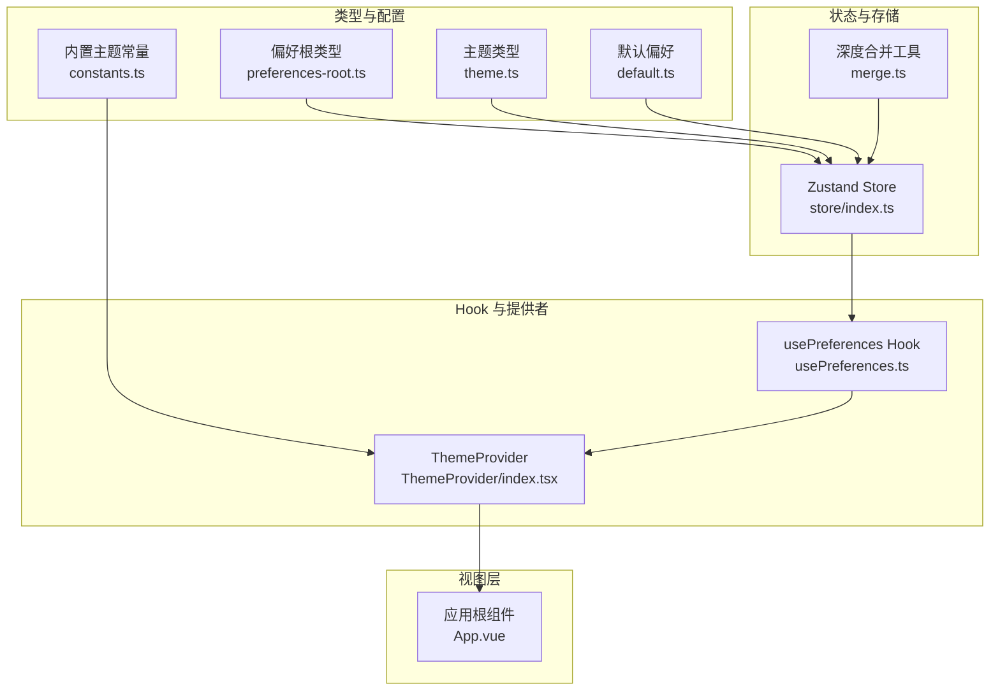
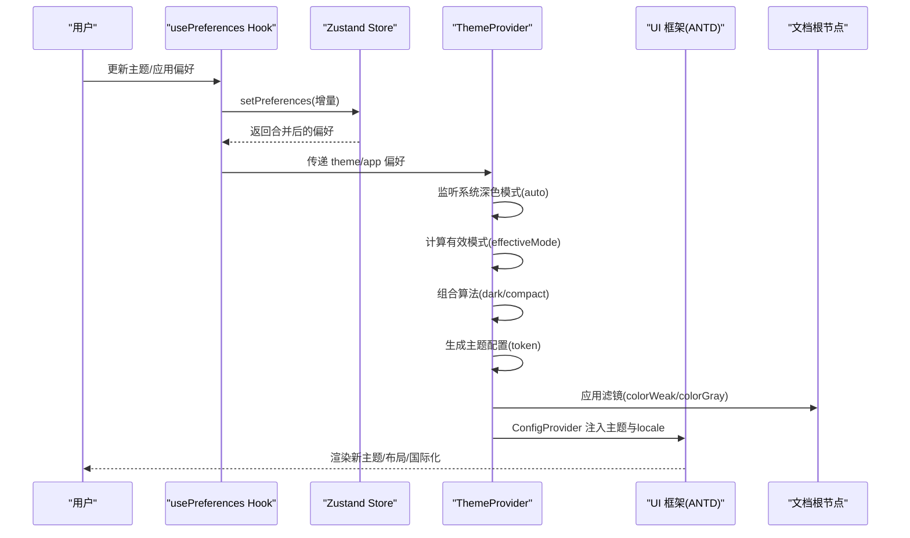
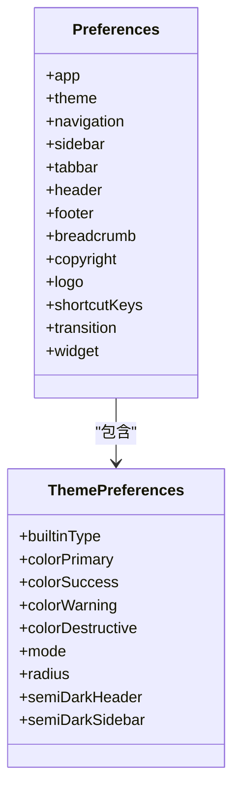
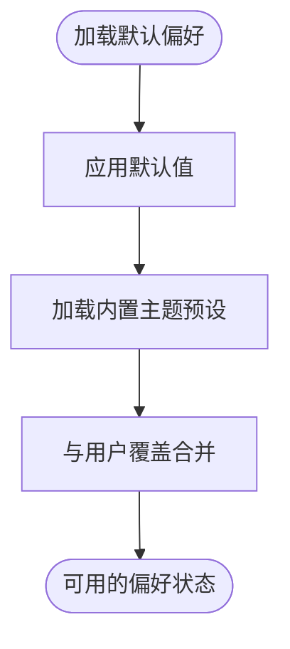
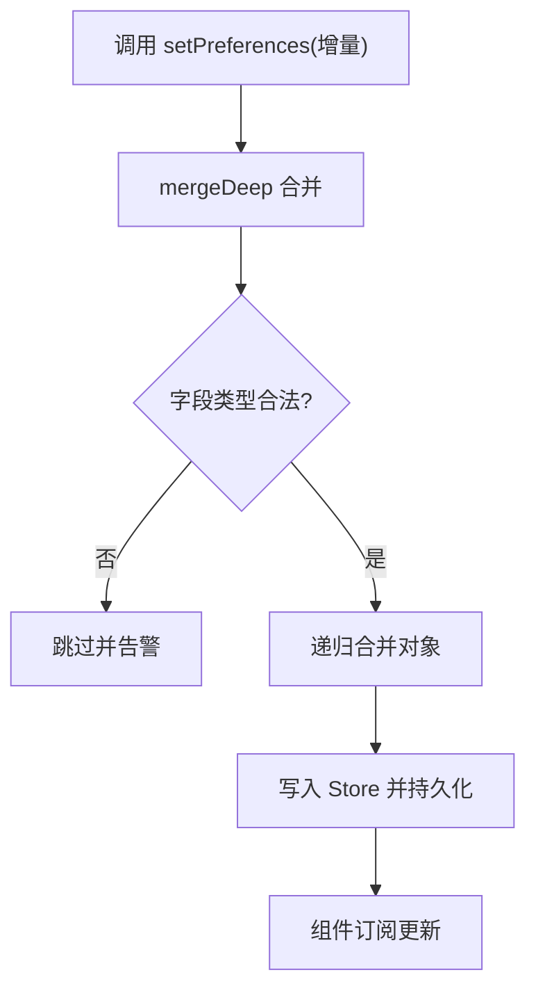
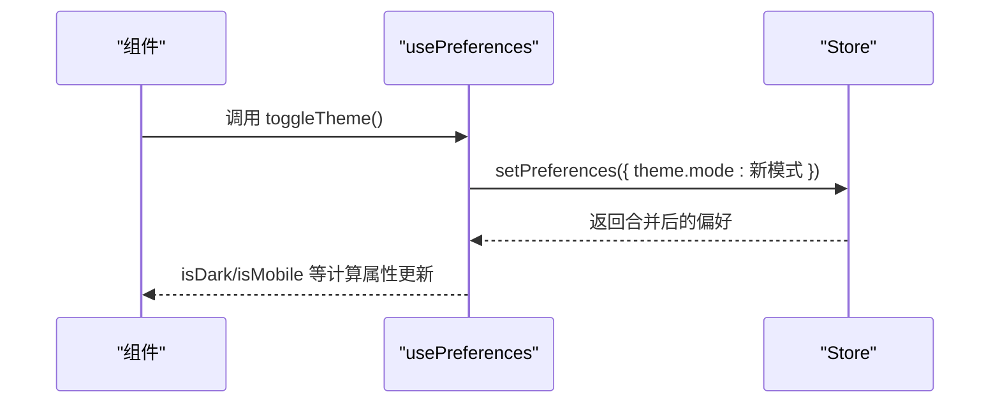
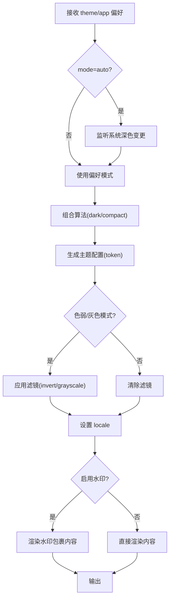
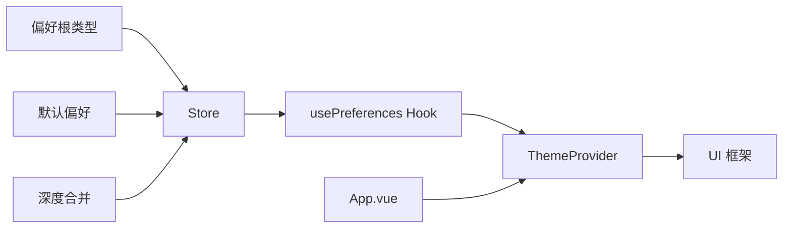

# 主题与偏好设置

<cite>
**本文引用的文件**
- [App.vue](file://frontend/admin/vue-element/src/App.vue)
- [usePreferences.ts](file://frontend/admin/react/src/core/preferences/hooks/usePreferences.ts)
- [preferences-root.ts](file://frontend/admin/react/src/core/preferences/types/preferences-root.ts)
- [theme.ts](file://frontend/admin/react/src/core/preferences/types/theme.ts)
- [default.ts](file://frontend/admin/react/src/core/preferences/config/default.ts)
- [constants.ts](file://frontend/admin/react/src/core/preferences/config/constants.ts)
- [store/index.ts](file://frontend/admin/react/src/core/preferences/store/index.ts)
- [merge.ts](file://frontend/admin/react/src/core/preferences/utils/merge.ts)
- [ThemeProvider/index.tsx](file://frontend/admin/react/src/core/preferences/components/ThemeProvider/index.tsx)
</cite>

## 目录
1. [简介](#简介)
2. [项目结构](#项目结构)
3. [核心组件](#核心组件)
4. [架构总览](#架构总览)
5. [详细组件分析](#详细组件分析)
6. [依赖关系分析](#依赖关系分析)
7. [性能考量](#性能考量)
8. [故障排查指南](#故障排查指南)
9. [结论](#结论)
10. [附录](#附录)

## 简介
本文件面向 Vben Admin 的主题与偏好设置系统，系统性阐述主题架构、样式变量、动态主题切换、偏好管理与持久化、以及主题定制与最佳实践。文档以 React 版本为核心参考，同时给出 Vue Element 版本的集成要点，帮助开发者快速理解并扩展主题与偏好功能。

## 项目结构
本主题与偏好系统主要由以下层次构成：
- 类型与配置层：定义偏好设置的数据结构、默认值与内置主题预设。
- 存储与状态层：基于 Zustand 的状态管理与持久化，支持深度合并与局部订阅。
- Hook 层：提供便捷的偏好读取、计算属性与更新方法。
- 主题提供者层：将偏好映射为 UI 框架主题配置、滤镜、国际化与水印等全局行为。
- 视图层：在应用根组件中注入主题提供者，并通过偏好控制组件尺寸、水印等。

图表来源
- [theme.ts:1-49](file://frontend/admin/react/src/core/preferences/types/theme.ts#L1-L49)
- [preferences-root.ts:1-60](file://frontend/admin/react/src/core/preferences/types/preferences-root.ts#L1-L60)
- [default.ts:1-118](file://frontend/admin/react/src/core/preferences/config/default.ts#L1-L118)
- [constants.ts:1-89](file://frontend/admin/react/src/core/preferences/config/constants.ts#L1-L89)
- [store/index.ts:1-41](file://frontend/admin/react/src/core/preferences/store/index.ts#L1-L41)
- [merge.ts:1-57](file://frontend/admin/react/src/core/preferences/utils/merge.ts#L1-L57)
- [usePreferences.ts:1-106](file://frontend/admin/react/src/core/preferences/hooks/usePreferences.ts#L1-L106)
- [ThemeProvider/index.tsx:1-107](file://frontend/admin/react/src/core/preferences/components/ThemeProvider/index.tsx#L1-L107)
- [App.vue:1-37](file://frontend/admin/vue-element/src/App.vue#L1-L37)

章节来源
- [preferences-root.ts:1-60](file://frontend/admin/react/src/core/preferences/types/preferences-root.ts#L1-L60)
- [default.ts:1-118](file://frontend/admin/react/src/core/preferences/config/default.ts#L1-L118)
- [store/index.ts:1-41](file://frontend/admin/react/src/core/preferences/store/index.ts#L1-L41)
- [usePreferences.ts:1-106](file://frontend/admin/react/src/core/preferences/hooks/usePreferences.ts#L1-L106)
- [ThemeProvider/index.tsx:1-107](file://frontend/admin/react/src/core/preferences/components/ThemeProvider/index.tsx#L1-L107)
- [App.vue:1-37](file://frontend/admin/vue-element/src/App.vue#L1-L37)

## 核心组件
- 偏好设置类型与分组：通过统一的偏好根类型定义 app、breadcrumb、copyright、footer、header、logo、navigation、shortcutKeys、sidebar、tabbar、theme、transition、widget 等分组，便于按需访问与更新。
- 默认偏好与内置主题：提供默认偏好值与内置主题预设集合，支持一键切换与自定义扩展。
- 状态与持久化：基于 Zustand 的 store 实现，结合持久化中间件，确保刷新后偏好不丢失；通过深度合并工具保证复杂对象的增量更新。
- 主题提供者：将偏好映射为 UI 框架主题配置（如 Ant Design），并处理系统深色模式、紧凑模式、滤镜（色弱/灰色）、国际化与水印等全局行为。
- 视图集成：在应用根组件中注入主题提供者，使全局主题与偏好生效。

章节来源
- [preferences-root.ts:1-60](file://frontend/admin/react/src/core/preferences/types/preferences-root.ts#L1-L60)
- [default.ts:1-118](file://frontend/admin/react/src/core/preferences/config/default.ts#L1-L118)
- [constants.ts:1-89](file://frontend/admin/react/src/core/preferences/config/constants.ts#L1-L89)
- [store/index.ts:1-41](file://frontend/admin/react/src/core/preferences/store/index.ts#L1-L41)
- [merge.ts:1-57](file://frontend/admin/react/src/core/preferences/utils/merge.ts#L1-L57)
- [ThemeProvider/index.tsx:1-107](file://frontend/admin/react/src/core/preferences/components/ThemeProvider/index.tsx#L1-L107)
- [App.vue:1-37](file://frontend/admin/vue-element/src/App.vue#L1-L37)

## 架构总览
下图展示从偏好到主题提供者的端到端流程，包括系统深色模式监听、主题算法组合、滤镜应用与国际化配置。

图表来源
- [usePreferences.ts:1-106](file://frontend/admin/react/src/core/preferences/hooks/usePreferences.ts#L1-L106)
- [store/index.ts:1-41](file://frontend/admin/react/src/core/preferences/store/index.ts#L1-L41)
- [ThemeProvider/index.tsx:1-107](file://frontend/admin/react/src/core/preferences/components/ThemeProvider/index.tsx#L1-L107)

## 详细组件分析

### 偏好设置类型与分组
- 偏好根类型定义了完整的偏好结构，包含 app、theme、navigation、sidebar、tabbar、header、footer、breadcrumb、copyright、logo、shortcutKeys、transition、widget 等分组，便于按域访问与更新。
- 主题类型定义了主题模式（auto/dark/light）与内置主题名称集合，支持自定义扩展。

图表来源
- [preferences-root.ts:1-60](file://frontend/admin/react/src/core/preferences/types/preferences-root.ts#L1-L60)
- [theme.ts:1-49](file://frontend/admin/react/src/core/preferences/types/theme.ts#L1-L49)

章节来源
- [preferences-root.ts:1-60](file://frontend/admin/react/src/core/preferences/types/preferences-root.ts#L1-L60)
- [theme.ts:1-49](file://frontend/admin/react/src/core/preferences/types/theme.ts#L1-L49)

### 默认偏好与内置主题
- 默认偏好提供了完整的初始值，涵盖应用行为、导航样式、主题主色与半暗配置、动画开关等。
- 内置主题常量提供多套预设主色与深浅主色映射，支持一键切换与扩展自定义主题。

图表来源
- [default.ts:1-118](file://frontend/admin/react/src/core/preferences/config/default.ts#L1-L118)
- [constants.ts:1-89](file://frontend/admin/react/src/core/preferences/config/constants.ts#L1-L89)

章节来源
- [default.ts:1-118](file://frontend/admin/react/src/core/preferences/config/default.ts#L1-L118)
- [constants.ts:1-89](file://frontend/admin/react/src/core/preferences/config/constants.ts#L1-L89)

### 状态与持久化（Zustand）
- Store 使用持久化中间件，仅持久化偏好部分，避免冗余数据。
- setPreferences 采用深度合并策略，跳过无效类型（React 元素、DOM、函数等），保证安全更新。
- 支持按需重置为默认偏好或获取单个偏好的值。

图表来源
- [store/index.ts:1-41](file://frontend/admin/react/src/core/preferences/store/index.ts#L1-L41)
- [merge.ts:1-57](file://frontend/admin/react/src/core/preferences/utils/merge.ts#L1-L57)

章节来源
- [store/index.ts:1-41](file://frontend/admin/react/src/core/preferences/store/index.ts#L1-L41)
- [merge.ts:1-57](file://frontend/admin/react/src/core/preferences/utils/merge.ts#L1-L57)

### Hook：usePreferences
- 提供便捷访问器（app、theme、navigation、sidebar、tabbar、header、footer、breadcrumb、copyright、logo、shortcutKeys、transition、widget）。
- 计算属性：isDark（自动模式下跟随系统深色）、isMobile（来自 app）。
- 更新方法：通用 updatePreferences 与分组更新（updateTheme、updateApp），以及主题切换（toggleTheme、setThemeMode）与语言切换（setLanguage）。

图表来源
- [usePreferences.ts:1-106](file://frontend/admin/react/src/core/preferences/hooks/usePreferences.ts#L1-L106)
- [store/index.ts:1-41](file://frontend/admin/react/src/core/preferences/store/index.ts#L1-L41)

章节来源
- [usePreferences.ts:1-106](file://frontend/admin/react/src/core/preferences/hooks/usePreferences.ts#L1-L106)

### 主题提供者：ThemeProvider
- 系统深色模式监听：当主题模式为 auto 时，监听系统 prefers-color-scheme 并计算有效模式。
- 算法组合：根据有效模式与紧凑模式选择算法，生成主题配置。
- 样式变量：将主题主色、成功色、警告色、破坏色与圆角映射到 UI 框架 token。
- 滤镜应用：根据应用偏好启用色弱 invert 或灰色 grayscale 滤镜。
- 国际化与水印：根据语言偏好设置 locale，并按开关生成水印文本。

图表来源
- [ThemeProvider/index.tsx:1-107](file://frontend/admin/react/src/core/preferences/components/ThemeProvider/index.tsx#L1-L107)

章节来源
- [ThemeProvider/index.tsx:1-107](file://frontend/admin/react/src/core/preferences/components/ThemeProvider/index.tsx#L1-L107)

### 视图层集成（Vue Element 示例）
- 在应用根组件中注入配置提供者与水印，读取偏好控制组件尺寸与水印显示。
- 将语言偏好映射到 UI 框架的 locale，实现国际化。

章节来源
- [App.vue:1-37](file://frontend/admin/vue-element/src/App.vue#L1-L37)

## 依赖关系分析
- 类型与配置层为上层提供契约与默认值，耦合度低、可扩展性强。
- Store 依赖默认偏好与合并工具，保持状态纯净与可预测。
- Hook 作为门面，解耦 UI 与状态逻辑，便于测试与复用。
- ThemeProvider 将偏好转化为 UI 行为，是连接状态与界面的关键桥梁。
- 视图层仅负责注入与读取，不参与业务逻辑，职责清晰。

图表来源
- [preferences-root.ts:1-60](file://frontend/admin/react/src/core/preferences/types/preferences-root.ts#L1-L60)
- [default.ts:1-118](file://frontend/admin/react/src/core/preferences/config/default.ts#L1-L118)
- [merge.ts:1-57](file://frontend/admin/react/src/core/preferences/utils/merge.ts#L1-L57)
- [store/index.ts:1-41](file://frontend/admin/react/src/core/preferences/store/index.ts#L1-L41)
- [usePreferences.ts:1-106](file://frontend/admin/react/src/core/preferences/hooks/usePreferences.ts#L1-L106)
- [ThemeProvider/index.tsx:1-107](file://frontend/admin/react/src/core/preferences/components/ThemeProvider/index.tsx#L1-L107)
- [App.vue:1-37](file://frontend/admin/vue-element/src/App.vue#L1-L37)

章节来源
- [preferences-root.ts:1-60](file://frontend/admin/react/src/core/preferences/types/preferences-root.ts#L1-L60)
- [default.ts:1-118](file://frontend/admin/react/src/core/preferences/config/default.ts#L1-L118)
- [store/index.ts:1-41](file://frontend/admin/react/src/core/preferences/store/index.ts#L1-L41)
- [usePreferences.ts:1-106](file://frontend/admin/react/src/core/preferences/hooks/usePreferences.ts#L1-L106)
- [ThemeProvider/index.tsx:1-107](file://frontend/admin/react/src/core/preferences/components/ThemeProvider/index.tsx#L1-L107)
- [App.vue:1-37](file://frontend/admin/vue-element/src/App.vue#L1-L37)

## 性能考量
- 局部订阅：在 ThemeProvider 中分别订阅 theme 与 app，减少无关更新导致的重渲染。
- 深度合并：仅对纯对象进行递归合并，跳过 React 元素、DOM、函数等，避免昂贵操作与副作用。
- 算法组合：按需启用 darkAlgorithm 与 compactAlgorithm，避免不必要的计算。
- 持久化粒度：仅持久化偏好部分，降低存储体积与序列化开销。
- 滤镜应用：在文档根节点一次性应用，避免在组件树中重复计算。

## 故障排查指南
- 主题未生效
  - 检查 ThemeProvider 是否包裹应用根组件。
  - 确认主题模式与系统深色模式监听逻辑是否符合预期。
  - 核对主题 token 映射是否正确（主色、半暗等）。
- 偏好未持久化
  - 确认持久化中间件已启用且命名空间正确。
  - 检查 setPreferences 是否传入了合法的增量对象。
- 水印/国际化异常
  - 检查应用偏好中的水印开关与语言设置。
  - 确认 ConfigProvider 已正确注入 locale 与主题配置。
- 性能问题
  - 避免在偏好更新中频繁触发非必要字段（如函数、DOM）。
  - 使用局部订阅与计算属性缓存，减少重渲染。

章节来源
- [ThemeProvider/index.tsx:1-107](file://frontend/admin/react/src/core/preferences/components/ThemeProvider/index.tsx#L1-L107)
- [store/index.ts:1-41](file://frontend/admin/react/src/core/preferences/store/index.ts#L1-L41)
- [merge.ts:1-57](file://frontend/admin/react/src/core/preferences/utils/merge.ts#L1-L57)
- [App.vue:1-37](file://frontend/admin/vue-element/src/App.vue#L1-L37)

## 结论
该主题与偏好系统以类型驱动、状态隔离、提供者桥接的方式实现了高内聚、低耦合的主题与偏好管理。通过内置主题预设、深度合并与局部订阅，既保证了易用性，也兼顾了性能与可扩展性。建议在实际项目中遵循本文档的最佳实践，确保主题与偏好的一致性与稳定性。

## 附录

### 主题定制与样式组织
- 使用内置主题预设作为起点，扩展自定义主题名称与主色映射。
- 通过主题提供者将主色、半暗、圆角等映射到 UI 框架 token，实现一致的视觉风格。
- 对于组件级主题，建议在组件内部维护独立的样式变量，并通过全局主题提供者进行覆盖。

### 主题开发最佳实践
- 类型先行：先定义类型与默认值，再实现逻辑，确保结构清晰。
- 深度合并：仅对纯对象进行增量更新，避免覆盖敏感字段。
- 局部订阅：在提供者中按需订阅关键偏好，减少重渲染。
- 可观测性：对非纯对象字段进行告警，便于定位问题。
- 国际化与无障碍：统一语言与滤镜策略，保障不同用户需求。

### 主题配置示例与自定义指南
- 示例位置
  - 默认偏好：[default.ts:1-118](file://frontend/admin/react/src/core/preferences/config/default.ts#L1-L118)
  - 内置主题预设：[constants.ts:1-89](file://frontend/admin/react/src/core/preferences/config/constants.ts#L1-L89)
  - 主题类型定义：[theme.ts:1-49](file://frontend/admin/react/src/core/preferences/types/theme.ts#L1-L49)
- 自定义步骤
  - 在内置主题预设中新增自定义主题条目。
  - 在偏好根类型中扩展相关字段（如自定义主色）。
  - 在 ThemeProvider 中映射新的 token 与算法。
  - 在 Hook 中提供便捷更新方法，并在视图中暴露切换入口。