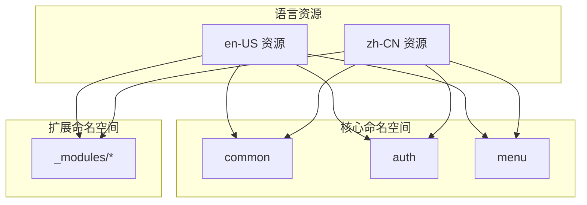
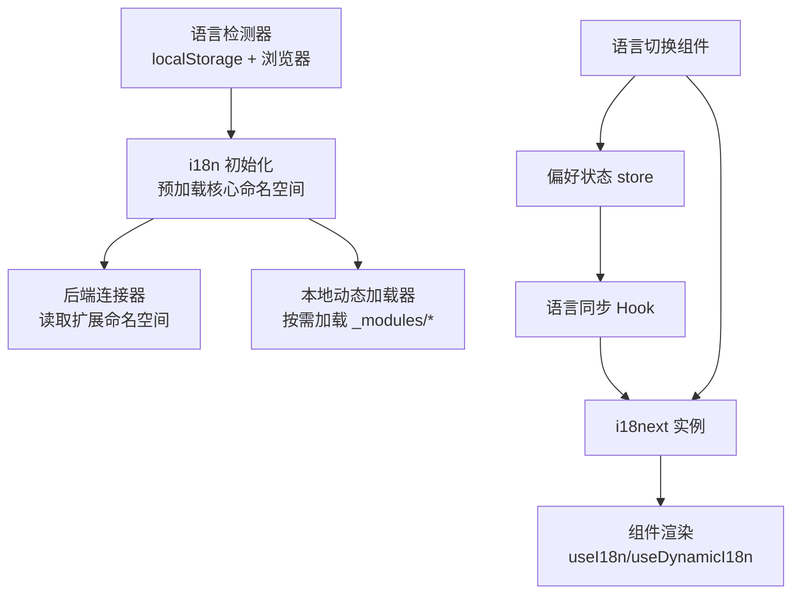
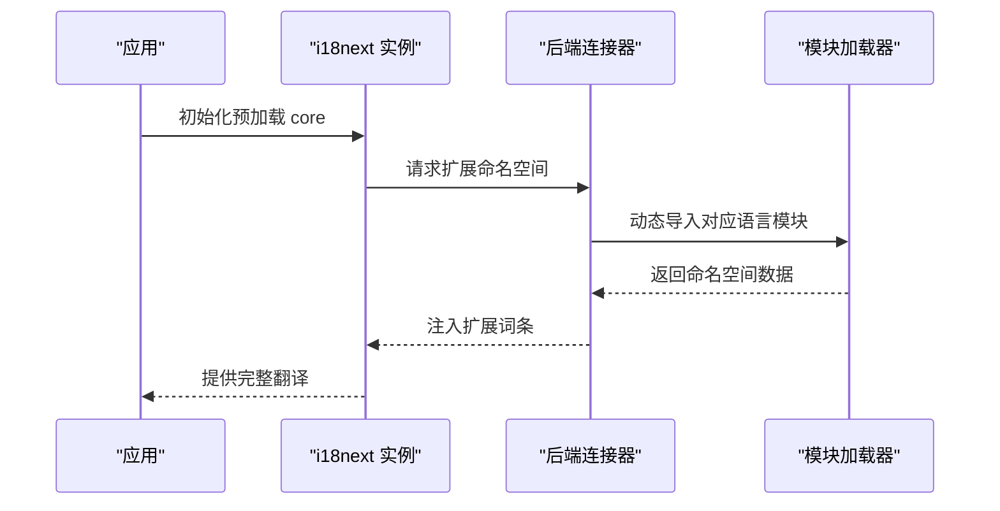
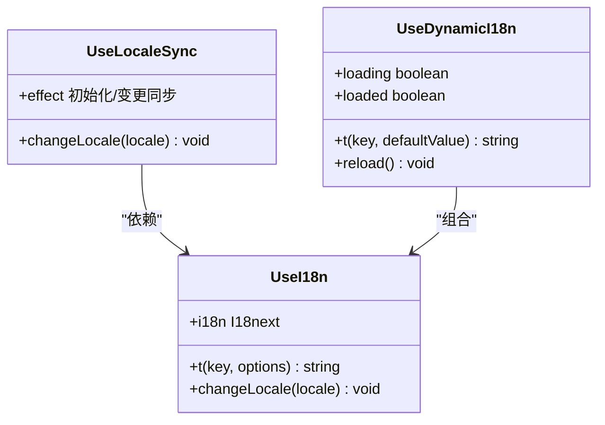
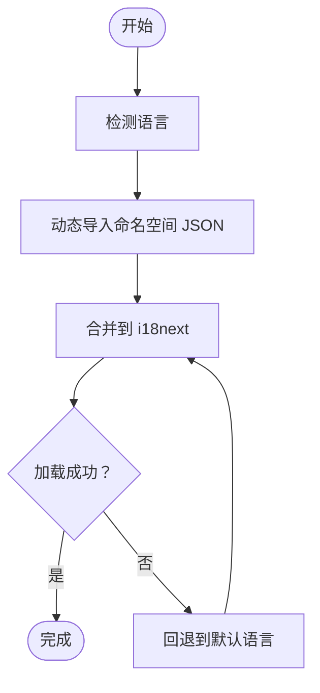
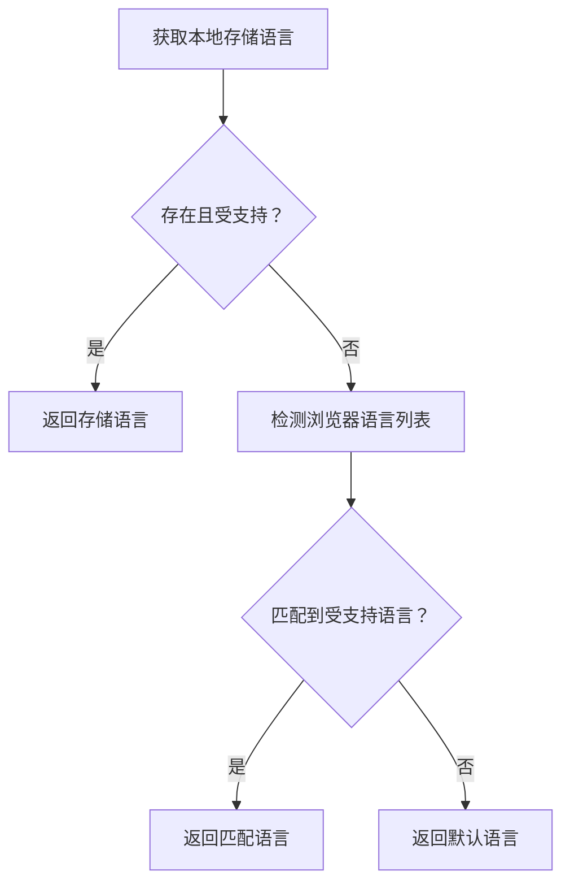
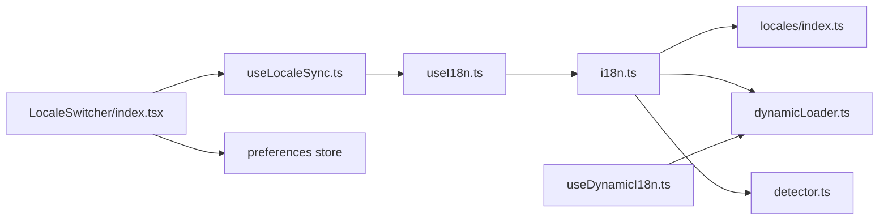

# 国际化系统

<cite>
**本文引用的文件**
- [frontend/admin/react/src/core/i18n/config/i18n.ts](file://frontend/admin/react/src/core/i18n/config/i18n.ts)
- [frontend/admin/react/src/core/i18n/hooks/useI18n.ts](file://frontend/admin/react/src/core/i18n/hooks/useI18n.ts)
- [frontend/admin/react/src/core/i18n/hooks/useLocaleSync.ts](file://frontend/admin/react/src/core/i18n/hooks/useLocaleSync.ts)
- [frontend/admin/react/src/core/i18n/hooks/useDynamicI18n.ts](file://frontend/admin/react/src/core/i18n/hooks/useDynamicI18n.ts)
- [frontend/admin/react/src/core/i18n/utils/detector.ts](file://frontend/admin/react/src/core/i18n/utils/detector.ts)
- [frontend/admin/react/src/core/i18n/utils/dynamicLoader.ts](file://frontend/admin/react/src/core/i18n/utils/dynamicLoader.ts)
- [frontend/admin/react/src/core/i18n/utils/formatter.ts](file://frontend/admin/react/src/core/i18n/utils/formatter.ts)
- [frontend/admin/react/src/core/i18n/components/LocaleSwitcher/index.tsx](file://frontend/admin/react/src/core/i18n/components/LocaleSwitcher/index.tsx)
- [frontend/admin/react/src/locales/index.ts](file://frontend/admin/react/src/locales/index.ts)
- [frontend/admin/react/src/locales/zh-CN/index.ts](file://frontend/admin/react/src/locales/zh-CN/index.ts)
- [frontend/admin/react/src/locales/en-US/index.ts](file://frontend/admin/react/src/locales/en-US/index.ts)
- [frontend/admin/react/src/locales/zh-CN/_core/auth.json](file://frontend/admin/react/src/locales/zh-CN/_core/auth.json)
- [frontend/admin/react/src/locales/zh-CN/_modules/dashboard.json](file://frontend/admin/react/src/locales/zh-CN/_modules/dashboard.json)
- [frontend/admin/vue-vben/apps/admin/src/locales/README.md](file://frontend/admin/vue-vben/apps/admin/src/locales/README.md)
</cite>

## 目录
1. [简介](#简介)
2. [项目结构](#项目结构)
3. [核心组件](#核心组件)
4. [架构总览](#架构总览)
5. [详细组件分析](#详细组件分析)
6. [依赖关系分析](#依赖关系分析)
7. [性能考量](#性能考量)
8. [故障排查指南](#故障排查指南)
9. [结论](#结论)
10. [附录](#附录)

## 简介
本文件面向 Vben Admin 的前端国际化体系，系统性阐述多语言支持的实现机制，涵盖语言包结构、动态加载策略、语言切换流程、本地化资源组织方式、国际化工具函数（文本翻译、日期/数字/货币/百分比、相对时间）、最佳实践与常见问题处理。文档同时给出可视化图示，帮助开发者快速理解与高效维护国际化能力。

## 项目结构
国际化相关代码主要集中在 React 前端工程中，采用“核心语言包 + 模块化语言包”的双层结构：
- 核心命名空间（common、auth、menu）在应用启动时预加载，保证首屏关键文案即时可用。
- 扩展命名空间（如 routes、dashboard、preferences 等）按需动态加载，降低首屏体积并提升加载性能。
- 语言包以 JSON 文件组织，并通过 TypeScript 类型导出，确保翻译键的类型安全。

图表来源
- [frontend/admin/react/src/locales/index.ts:1-36](file://frontend/admin/react/src/locales/index.ts#L1-L36)
- [frontend/admin/react/src/locales/zh-CN/index.ts:1-29](file://frontend/admin/react/src/locales/zh-CN/index.ts#L1-L29)
- [frontend/admin/react/src/locales/en-US/index.ts:1-29](file://frontend/admin/react/src/locales/en-US/index.ts#L1-L29)

章节来源
- [frontend/admin/react/src/locales/index.ts:1-36](file://frontend/admin/react/src/locales/index.ts#L1-L36)
- [frontend/admin/react/src/locales/zh-CN/index.ts:1-29](file://frontend/admin/react/src/locales/zh-CN/index.ts#L1-L29)
- [frontend/admin/react/src/locales/en-US/index.ts:1-29](file://frontend/admin/react/src/locales/en-US/index.ts#L1-L29)

## 核心组件
- i18n 初始化与动态加载：负责 i18next 初始化、核心命名空间预加载、扩展命名空间按需加载、缺失键处理与回退逻辑。
- 国际化 Hook：提供类型安全的翻译函数、语言切换能力与偏好同步。
- 动态加载工具：基于 Vite 动态导入本地 JSON，合并到 i18next 并支持回退到默认语言。
- 语言检测与持久化：根据浏览器语言与本地存储决定最终语言，支持校验与设置。
- 本地化格式化工具：提供日期、数字、货币、百分比、相对时间的格式化函数。
- 语言切换组件：下拉选择器，联动偏好状态与 i18n 实例。

章节来源
- [frontend/admin/react/src/core/i18n/config/i18n.ts:1-79](file://frontend/admin/react/src/core/i18n/config/i18n.ts#L1-L79)
- [frontend/admin/react/src/core/i18n/hooks/useI18n.ts:1-35](file://frontend/admin/react/src/core/i18n/hooks/useI18n.ts#L1-L35)
- [frontend/admin/react/src/core/i18n/hooks/useDynamicI18n.ts:1-95](file://frontend/admin/react/src/core/i18n/hooks/useDynamicI18n.ts#L1-L95)
- [frontend/admin/react/src/core/i18n/utils/dynamicLoader.ts:1-45](file://frontend/admin/react/src/core/i18n/utils/dynamicLoader.ts#L1-L45)
- [frontend/admin/react/src/core/i18n/utils/detector.ts:1-77](file://frontend/admin/react/src/core/i18n/utils/detector.ts#L1-L77)
- [frontend/admin/react/src/core/i18n/utils/formatter.ts:1-127](file://frontend/admin/react/src/core/i18n/utils/formatter.ts#L1-L127)
- [frontend/admin/react/src/core/i18n/components/LocaleSwitcher/index.tsx:1-26](file://frontend/admin/react/src/core/i18n/components/LocaleSwitcher/index.tsx#L1-L26)

## 架构总览
整体架构围绕 i18next 与 React 生态展开，结合 Vite 的动态导入能力，实现“预加载核心 + 按需扩展”的双轨策略。初始化阶段完成核心命名空间注入；运行时通过后端连接器或本地动态加载器补充扩展命名空间；偏好状态与 i18n 实例双向同步；格式化工具统一处理本地化显示。

图表来源
- [frontend/admin/react/src/core/i18n/config/i18n.ts:17-78](file://frontend/admin/react/src/core/i18n/config/i18n.ts#L17-L78)
- [frontend/admin/react/src/core/i18n/hooks/useLocaleSync.ts:1-44](file://frontend/admin/react/src/core/i18n/hooks/useLocaleSync.ts#L1-L44)
- [frontend/admin/react/src/core/i18n/utils/detector.ts:1-77](file://frontend/admin/react/src/core/i18n/utils/detector.ts#L1-L77)
- [frontend/admin/react/src/core/i18n/components/LocaleSwitcher/index.tsx:1-26](file://frontend/admin/react/src/core/i18n/components/LocaleSwitcher/index.tsx#L1-L26)

## 详细组件分析

### i18n 初始化与动态加载
- 预加载核心命名空间：在初始化时将 common、auth、menu 注入 i18next，确保首屏关键文案可用。
- 扩展命名空间按需加载：通过后端连接器的 read 回调拦截非核心命名空间请求，动态导入对应语言的模块加载器并返回翻译数据。
- 缺失键处理：开发环境下输出缺失键警告，便于发现未翻译项。
- 支持语言与回退：限定支持语言集，回退至默认语言，保证稳定性。

图表来源
- [frontend/admin/react/src/core/i18n/config/i18n.ts:17-78](file://frontend/admin/react/src/core/i18n/config/i18n.ts#L17-L78)

章节来源
- [frontend/admin/react/src/core/i18n/config/i18n.ts:1-79](file://frontend/admin/react/src/core/i18n/config/i18n.ts#L1-L79)

### 国际化 Hook 族
- useI18n：封装 useTranslation，提供类型安全的 t 函数与 changeLocale 方法，自动推导命名空间。
- useLocaleSync：将偏好状态与 i18n 实例双向同步，首次初始化时写入检测到的语言，变更时触发语言切换。
- useDynamicI18n：在组件内按需加载单个命名空间，支持自动加载、依赖变更重载、语言切换重载与回退策略。

图表来源
- [frontend/admin/react/src/core/i18n/hooks/useI18n.ts:1-35](file://frontend/admin/react/src/core/i18n/hooks/useI18n.ts#L1-L35)
- [frontend/admin/react/src/core/i18n/hooks/useLocaleSync.ts:1-44](file://frontend/admin/react/src/core/i18n/hooks/useLocaleSync.ts#L1-L44)
- [frontend/admin/react/src/core/i18n/hooks/useDynamicI18n.ts:1-95](file://frontend/admin/react/src/core/i18n/hooks/useDynamicI18n.ts#L1-L95)

章节来源
- [frontend/admin/react/src/core/i18n/hooks/useI18n.ts:1-35](file://frontend/admin/react/src/core/i18n/hooks/useI18n.ts#L1-L35)
- [frontend/admin/react/src/core/i18n/hooks/useLocaleSync.ts:1-44](file://frontend/admin/react/src/core/i18n/hooks/useLocaleSync.ts#L1-L44)
- [frontend/admin/react/src/core/i18n/hooks/useDynamicI18n.ts:1-95](file://frontend/admin/react/src/core/i18n/hooks/useDynamicI18n.ts#L1-L95)

### 动态加载与本地化格式化
- 本地动态加载：通过 Vite 动态导入本地 JSON，合并到 i18next；若当前语言失败则回退到默认语言。
- 批量加载：支持一次性加载多个命名空间。
- 本地化格式化：提供日期、数字、货币、百分比、相对时间的格式化函数，统一使用目标语言的 Intl 规则。

图表来源
- [frontend/admin/react/src/core/i18n/utils/dynamicLoader.ts:1-45](file://frontend/admin/react/src/core/i18n/utils/dynamicLoader.ts#L1-L45)

章节来源
- [frontend/admin/react/src/core/i18n/utils/dynamicLoader.ts:1-45](file://frontend/admin/react/src/core/i18n/utils/dynamicLoader.ts#L1-L45)
- [frontend/admin/react/src/core/i18n/utils/formatter.ts:1-127](file://frontend/admin/react/src/core/i18n/utils/formatter.ts#L1-L127)

### 语言检测与持久化
- 检测顺序：本地存储 > 浏览器语言列表 > 默认语言。
- 校验与设置：提供支持语言校验与本地存储设置能力，兼容隐私模式与存储不可用场景。

图表来源
- [frontend/admin/react/src/core/i18n/utils/detector.ts:1-77](file://frontend/admin/react/src/core/i18n/utils/detector.ts#L1-L77)

章节来源
- [frontend/admin/react/src/core/i18n/utils/detector.ts:1-77](file://frontend/admin/react/src/core/i18n/utils/detector.ts#L1-L77)

### 语言切换组件
- 下拉选择器展示支持语言，绑定偏好状态与 i18n 实例，实现一键切换。

章节来源
- [frontend/admin/react/src/core/i18n/components/LocaleSwitcher/index.tsx:1-26](file://frontend/admin/react/src/core/i18n/components/LocaleSwitcher/index.tsx#L1-L26)

### 语言包结构与组织
- 核心命名空间：common、auth、menu，随应用启动预加载。
- 扩展命名空间：routes、dashboard、preferences 等，按需加载。
- 语言包文件：以 JSON 形式存放，通过 TypeScript 类型导出，确保键的类型安全。

章节来源
- [frontend/admin/react/src/locales/zh-CN/_core/auth.json:1-32](file://frontend/admin/react/src/locales/zh-CN/_core/auth.json#L1-L32)
- [frontend/admin/react/src/locales/zh-CN/_modules/dashboard.json:1-58](file://frontend/admin/react/src/locales/zh-CN/_modules/dashboard.json#L1-L58)
- [frontend/admin/react/src/locales/index.ts:1-36](file://frontend/admin/react/src/locales/index.ts#L1-L36)
- [frontend/admin/react/src/locales/zh-CN/index.ts:1-29](file://frontend/admin/react/src/locales/zh-CN/index.ts#L1-L29)
- [frontend/admin/react/src/locales/en-US/index.ts:1-29](file://frontend/admin/react/src/locales/en-US/index.ts#L1-L29)

### Vue Vben 应用的国际化扩展
- 该应用的 locales 目录用于扩展 dayjs、Ant Design 组件库的多语言切换及应用自身的国际化文件，便于在不同框架间复用本地化能力。

章节来源
- [frontend/admin/vue-vben/apps/admin/src/locales/README.md:1-4](file://frontend/admin/vue-vben/apps/admin/src/locales/README.md#L1-L4)

## 依赖关系分析
- 初始化依赖：i18next、react-i18next、本地资源映射与支持语言集合。
- 运行时依赖：偏好状态 store、Ant Design Select 组件、Intl API。
- 动态加载依赖：Vite 动态导入语法与命名空间解析规则。

图表来源
- [frontend/admin/react/src/core/i18n/config/i18n.ts:1-79](file://frontend/admin/react/src/core/i18n/config/i18n.ts#L1-L79)
- [frontend/admin/react/src/core/i18n/hooks/useI18n.ts:1-35](file://frontend/admin/react/src/core/i18n/hooks/useI18n.ts#L1-L35)
- [frontend/admin/react/src/core/i18n/hooks/useLocaleSync.ts:1-44](file://frontend/admin/react/src/core/i18n/hooks/useLocaleSync.ts#L1-L44)
- [frontend/admin/react/src/core/i18n/hooks/useDynamicI18n.ts:1-95](file://frontend/admin/react/src/core/i18n/hooks/useDynamicI18n.ts#L1-L95)
- [frontend/admin/react/src/core/i18n/utils/dynamicLoader.ts:1-45](file://frontend/admin/react/src/core/i18n/utils/dynamicLoader.ts#L1-L45)
- [frontend/admin/react/src/core/i18n/utils/detector.ts:1-77](file://frontend/admin/react/src/core/i18n/utils/detector.ts#L1-L77)
- [frontend/admin/react/src/core/i18n/components/LocaleSwitcher/index.tsx:1-26](file://frontend/admin/react/src/core/i18n/components/LocaleSwitcher/index.tsx#L1-L26)

章节来源
- [frontend/admin/react/src/core/i18n/config/i18n.ts:1-79](file://frontend/admin/react/src/core/i18n/config/i18n.ts#L1-L79)
- [frontend/admin/react/src/core/i18n/hooks/useI18n.ts:1-35](file://frontend/admin/react/src/core/i18n/hooks/useI18n.ts#L1-L35)
- [frontend/admin/react/src/core/i18n/hooks/useLocaleSync.ts:1-44](file://frontend/admin/react/src/core/i18n/hooks/useLocaleSync.ts#L1-L44)
- [frontend/admin/react/src/core/i18n/hooks/useDynamicI18n.ts:1-95](file://frontend/admin/react/src/core/i18n/hooks/useDynamicI18n.ts#L1-L95)
- [frontend/admin/react/src/core/i18n/utils/dynamicLoader.ts:1-45](file://frontend/admin/react/src/core/i18n/utils/dynamicLoader.ts#L1-L45)
- [frontend/admin/react/src/core/i18n/utils/detector.ts:1-77](file://frontend/admin/react/src/core/i18n/utils/detector.ts#L1-L77)
- [frontend/admin/react/src/core/i18n/components/LocaleSwitcher/index.tsx:1-26](file://frontend/admin/react/src/core/i18n/components/LocaleSwitcher/index.tsx#L1-L26)

## 性能考量
- 首屏优化：核心命名空间预加载，减少白屏期；扩展命名空间按需加载，避免阻塞。
- 代码分割：动态导入本地 JSON，配合打包工具进行分包，降低单页体积。
- 缓存策略：利用 i18next 内部缓存与 isLocaleLoaded 检查，避免重复加载。
- 回退机制：加载失败时回退默认语言，保证稳定性与用户体验。
- 开发体验：缺失键告警有助于早期发现未翻译项，减少回归风险。

## 故障排查指南
- 未显示翻译或显示键名：检查命名空间是否正确、键是否存在；确认扩展命名空间是否已按需加载。
- 语言切换无效：确认偏好状态是否更新、useLocaleSync 是否监听到变更、i18n.changeLanguage 是否抛错。
- 动态加载失败：查看控制台错误日志，确认模块路径与命名空间拼写；检查回退逻辑是否生效。
- 本地存储异常：隐私模式或存储禁用会导致读写失败，应捕获异常并降级处理。
- 格式化异常：确认传入语言参数与 Intl 支持范围，必要时提供默认选项覆盖。

章节来源
- [frontend/admin/react/src/core/i18n/hooks/useDynamicI18n.ts:1-95](file://frontend/admin/react/src/core/i18n/hooks/useDynamicI18n.ts#L1-L95)
- [frontend/admin/react/src/core/i18n/utils/detector.ts:1-77](file://frontend/admin/react/src/core/i18n/utils/detector.ts#L1-L77)
- [frontend/admin/react/src/core/i18n/utils/formatter.ts:1-127](file://frontend/admin/react/src/core/i18n/utils/formatter.ts#L1-L127)

## 结论
Vben Admin 的国际化系统通过“核心预加载 + 扩展按需”的策略，在保证首屏性能的同时提供了灵活的扩展能力。借助完善的 Hook、动态加载与格式化工具，开发者可以高效地维护多语言资源并保障一致性与可维护性。建议在团队内建立统一的翻译规范与测试流程，持续完善本地化质量。

## 附录
- 国际化配置示例（路径）
  - [i18n 初始化配置:17-42](file://frontend/admin/react/src/core/i18n/config/i18n.ts#L17-L42)
  - [语言资源映射:4-16](file://frontend/admin/react/src/locales/index.ts#L4-L16)
  - [核心语言包示例（auth）:1-32](file://frontend/admin/react/src/locales/zh-CN/_core/auth.json#L1-L32)
  - [扩展语言包示例（dashboard）:1-58](file://frontend/admin/react/src/locales/zh-CN/_modules/dashboard.json#L1-L58)
- 最佳实践
  - 为每个页面/模块定义独立命名空间，避免键冲突。
  - 使用 useDynamicI18n 在组件粒度按需加载，减少全局加载压力。
  - 为常用格式化场景提供统一工具函数，集中维护显示规则。
  - 建立翻译清单与自动化检查，确保覆盖率与一致性。