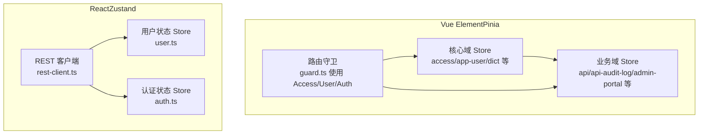
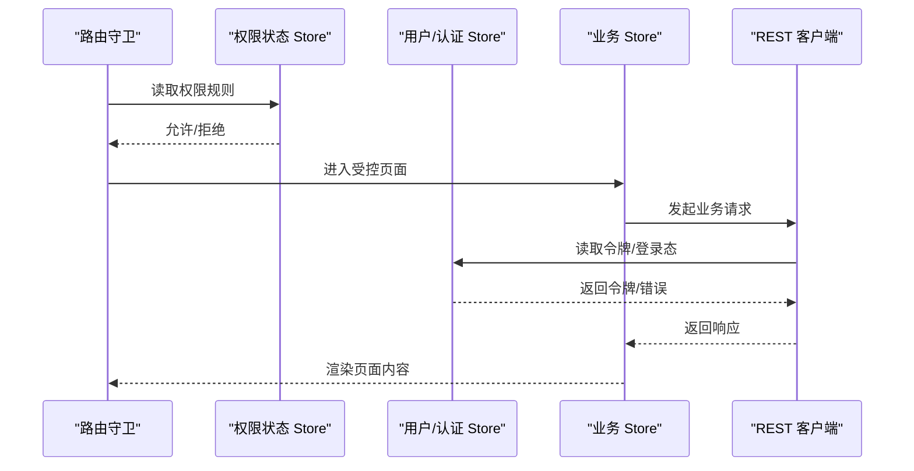
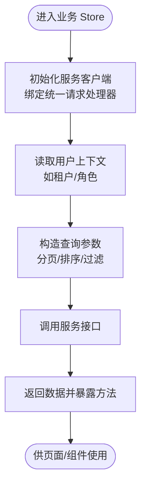
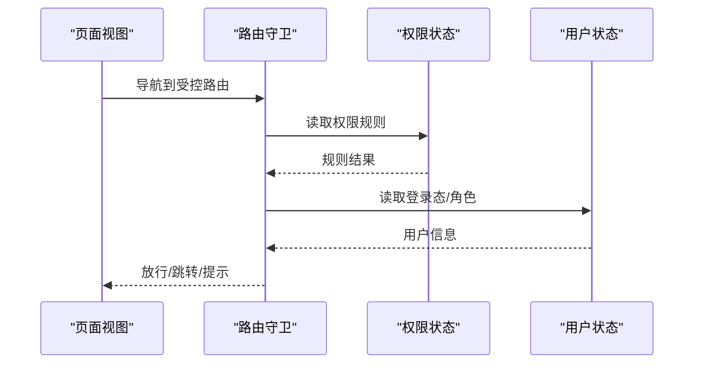
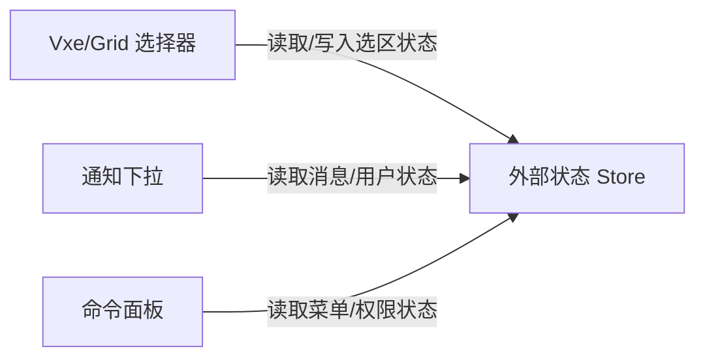
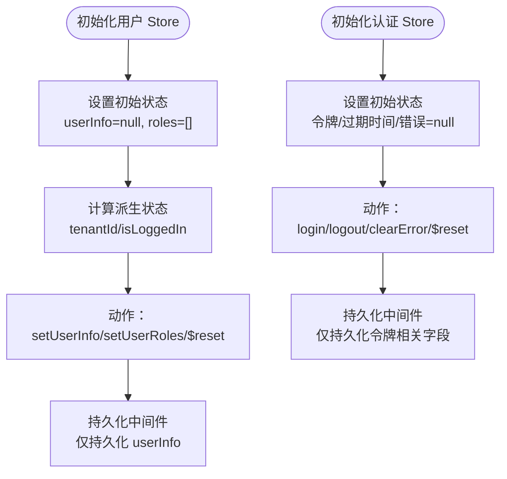
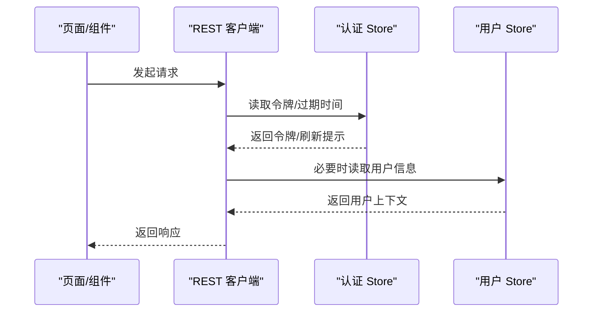
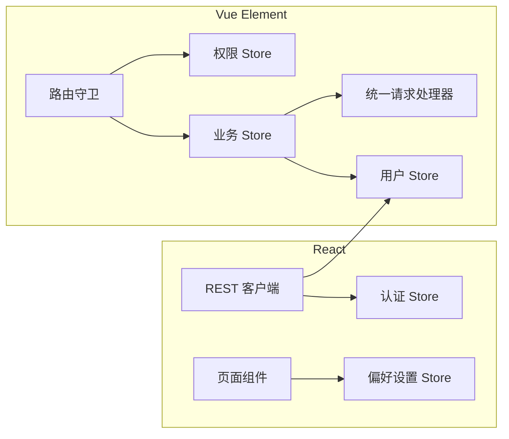

# 状态管理

<cite>
**本文引用的文件**
- [frontend/admin/vue-element/src/stores/modules/api/admin-portal.store.ts](file://frontend/admin/vue-element/src/stores/modules/api/admin-portal.store.ts)
- [frontend/admin/vue-element/src/stores/modules/api/api-audit-log.store.ts](file://frontend/admin/vue-element/src/stores/modules/api/api-audit-log.store.ts)
- [frontend/admin/vue-element/src/stores/modules/api/api.store.ts](file://frontend/admin/vue-element/src/stores/modules/api/api.store.ts)
- [frontend/admin/vue-element/src/core/access/use-access.ts](file://frontend/admin/vue-element/src/core/access/use-access.ts)
- [frontend/admin/vue-element/src/core/transport/rest/request.ts](file://frontend/admin/vue-element/src/core/transport/rest/request.ts)
- [frontend/admin/vue-element/src/router/guard.ts](file://frontend/admin/vue-element/src/router/guard.ts)
- [frontend/admin/vue-element/src/components/NoticeDropdown/useNotice.ts](file://frontend/admin/vue-element/src/components/NoticeDropdown/useNotice.ts)
- [frontend/admin/vue-element/src/components/CommandPalette/useCommandPalette.ts](file://frontend/admin/vue-element/src/components/CommandPalette/useCommandPalette.ts)
- [frontend/admin/vue-element/src/plugins/vxe-table/use-vxe-grid.ts](file://frontend/admin/vue-element/src/plugins/vxe-table/use-vxe-grid.ts)
- [frontend/admin/vue-element/src/plugins/vxe-table/api.ts](file://frontend/admin/vue-element/src/plugins/vxe-table/api.ts)
- [frontend/admin/react/src/stores/user.ts](file://frontend/admin/react/src/stores/user.ts)
- [frontend/admin/react/src/stores/auth.ts](file://frontend/admin/react/src/stores/auth.ts)
- [frontend/admin/react/src/core/transport/rest/rest-client.ts](file://frontend/admin/react/src/core/transport/rest/rest-client.ts)
- [frontend/admin/react/src/layouts/components/PageContainer/hooks/usePageTitle.ts](file://frontend/admin/react/src/layouts/components/PageContainer/hooks/usePageTitle.ts)
</cite>

## 目录
1. [引言](#引言)
2. [项目结构](#项目结构)
3. [核心组件](#核心组件)
4. [架构总览](#架构总览)
5. [详细组件分析](#详细组件分析)
6. [依赖分析](#依赖分析)
7. [性能考虑](#性能考虑)
8. [故障排查指南](#故障排查指南)
9. [结论](#结论)
10. [附录](#附录)

## 引言
本文件面向 Vben Admin 前端工程的状态管理开发，系统性梳理 Vue Element 与 React 两套实现中状态管理的设计与使用模式。重点覆盖：
- Pinia 模块化 Store 的设计原则与组织结构
- 核心 Store 的职责边界：用户状态、权限状态、应用配置等
- 业务模块 Store 的创建与使用范式
- 状态设计最佳实践：状态建模、异步操作处理、状态持久化策略
- 性能优化建议与常见问题排查

## 项目结构
本仓库包含多套前端实现（Vue Element、React），状态管理在不同框架下采用不同的技术栈：
- Vue Element：以 Pinia 为核心，按“核心域 + 业务域”分层组织 Store；核心域包含访问控制、用户、字典等；业务域包含各资源模块（如 API、审计日志、管理门户等）。
- React：采用 Zustand 管理轻量状态，并通过中间件实现持久化。

图示来源
- [frontend/admin/vue-element/src/router/guard.ts:1-20](file://frontend/admin/vue-element/src/router/guard.ts#L1-L20)
- [frontend/admin/vue-element/src/core/access/use-access.ts:1-20](file://frontend/admin/vue-element/src/core/access/use-access.ts#L1-L20)
- [frontend/admin/vue-element/src/stores/modules/api/api.store.ts:1-30](file://frontend/admin/vue-element/src/stores/modules/api/api.store.ts#L1-L30)
- [frontend/admin/react/src/stores/user.ts:1-30](file://frontend/admin/react/src/stores/user.ts#L1-L30)
- [frontend/admin/react/src/stores/auth.ts:240-277](file://frontend/admin/react/src/stores/auth.ts#L240-L277)
- [frontend/admin/react/src/core/transport/rest/rest-client.ts:80-100](file://frontend/admin/react/src/core/transport/rest/rest-client.ts#L80-L100)

章节来源
- [frontend/admin/vue-element/src/router/guard.ts:1-20](file://frontend/admin/vue-element/src/router/guard.ts#L1-L20)
- [frontend/admin/vue-element/src/core/access/use-access.ts:1-20](file://frontend/admin/vue-element/src/core/access/use-access.ts#L1-L20)
- [frontend/admin/vue-element/src/stores/modules/api/api.store.ts:1-30](file://frontend/admin/vue-element/src/stores/modules/api/api.store.ts#L1-L30)
- [frontend/admin/react/src/stores/user.ts:1-30](file://frontend/admin/react/src/stores/user.ts#L1-L30)
- [frontend/admin/react/src/stores/auth.ts:240-277](file://frontend/admin/react/src/stores/auth.ts#L240-L277)
- [frontend/admin/react/src/core/transport/rest/rest-client.ts:80-100](file://frontend/admin/react/src/core/transport/rest/rest-client.ts#L80-L100)

## 核心组件
本节聚焦两类核心状态域：用户与认证、访问控制与权限。

- 用户与认证（React）
  - 用户状态：包含用户基本信息、角色集合、登录态判断、租户标识等；支持持久化到本地存储，但仅持久化必要字段，避免状态不一致。
  - 认证状态：包含访问令牌、刷新令牌及其过期时间、登录加载态、错误信息等；持久化策略仅保留令牌相关字段，避免持久化敏感或易过期的运行时状态。
  
- 访问控制与权限（Vue Element）
  - 权限状态：在路由守卫中被广泛使用，用于判定页面访问权限、菜单渲染、指令级权限控制等。
  - 与 REST 请求集成：在请求拦截器中读取认证状态，注入鉴权头或刷新令牌流程。

章节来源
- [frontend/admin/react/src/stores/user.ts:1-74](file://frontend/admin/react/src/stores/user.ts#L1-L74)
- [frontend/admin/react/src/stores/auth.ts:240-277](file://frontend/admin/react/src/stores/auth.ts#L240-L277)
- [frontend/admin/vue-element/src/core/access/use-access.ts:1-20](file://frontend/admin/vue-element/src/core/access/use-access.ts#L1-L20)
- [frontend/admin/vue-element/src/core/transport/rest/request.ts:1-20](file://frontend/admin/vue-element/src/core/transport/rest/request.ts#L1-L20)

## 架构总览
下图展示 Vue Element 与 React 两端状态管理的关键交互路径：路由守卫基于权限状态进行决策；业务 Store 通过 REST 客户端发起请求；React 侧 REST 客户端依赖认证状态完成鉴权。

图示来源
- [frontend/admin/vue-element/src/router/guard.ts:1-20](file://frontend/admin/vue-element/src/router/guard.ts#L1-L20)
- [frontend/admin/vue-element/src/core/access/use-access.ts:1-20](file://frontend/admin/vue-element/src/core/access/use-access.ts#L1-L20)
- [frontend/admin/vue-element/src/core/transport/rest/request.ts:1-20](file://frontend/admin/vue-element/src/core/transport/rest/request.ts#L1-L20)
- [frontend/admin/vue-element/src/stores/modules/api/api.store.ts:1-30](file://frontend/admin/vue-element/src/stores/modules/api/api.store.ts#L1-L30)
- [frontend/admin/react/src/core/transport/rest/rest-client.ts:80-100](file://frontend/admin/react/src/core/transport/rest/rest-client.ts#L80-L100)

## 详细组件分析

### Vue Element：业务模块 Store（API、审计日志、管理门户）
这些 Store 采用组合式 API 风格定义，围绕“服务客户端 + 查询参数工具 + 用户上下文”的模式组织，职责清晰且可复用。

图示来源
- [frontend/admin/vue-element/src/stores/modules/api/api.store.ts:1-97](file://frontend/admin/vue-element/src/stores/modules/api/api.store.ts#L1-L97)
- [frontend/admin/vue-element/src/stores/modules/api/api-audit-log.store.ts:1-49](file://frontend/admin/vue-element/src/stores/modules/api/api-audit-log.store.ts#L1-L49)
- [frontend/admin/vue-element/src/stores/modules/api/admin-portal.store.ts:1-23](file://frontend/admin/vue-element/src/stores/modules/api/admin-portal.store.ts#L1-L23)

章节来源
- [frontend/admin/vue-element/src/stores/modules/api/api.store.ts:1-97](file://frontend/admin/vue-element/src/stores/modules/api/api.store.ts#L1-L97)
- [frontend/admin/vue-element/src/stores/modules/api/api-audit-log.store.ts:1-49](file://frontend/admin/vue-element/src/stores/modules/api/api-audit-log.store.ts#L1-L49)
- [frontend/admin/vue-element/src/stores/modules/api/admin-portal.store.ts:1-23](file://frontend/admin/vue-element/src/stores/modules/api/admin-portal.store.ts#L1-L23)

### Vue Element：权限与路由守卫
- 权限 Hook：封装对权限状态 Store 的读取与判断逻辑，便于在组件内复用。
- 路由守卫：在导航前读取权限规则，结合用户状态与业务 Store 的可用性决定放行或拦截。

图示来源
- [frontend/admin/vue-element/src/router/guard.ts:1-20](file://frontend/admin/vue-element/src/router/guard.ts#L1-L20)
- [frontend/admin/vue-element/src/core/access/use-access.ts:1-20](file://frontend/admin/vue-element/src/core/access/use-access.ts#L1-L20)

章节来源
- [frontend/admin/vue-element/src/router/guard.ts:1-20](file://frontend/admin/vue-element/src/router/guard.ts#L1-L20)
- [frontend/admin/vue-element/src/core/access/use-access.ts:1-20](file://frontend/admin/vue-element/src/core/access/use-access.ts#L1-L20)

### Vue Element：表格与选择器（TanStack/Vxe）
- 表格选择器：通过外部库的选择器能力与 Store 结合，实现跨页/跨筛选场景下的状态同步。
- 组件协作：Notice 下拉、命令面板等组件通过 Store 读取全局状态，驱动 UI 行为。

图示来源
- [frontend/admin/vue-element/src/plugins/vxe-table/use-vxe-grid.ts:1-20](file://frontend/admin/vue-element/src/plugins/vxe-table/use-vxe-grid.ts#L1-L20)
- [frontend/admin/vue-element/src/plugins/vxe-table/api.ts:1-20](file://frontend/admin/vue-element/src/plugins/vxe-table/api.ts#L1-L20)
- [frontend/admin/vue-element/src/components/NoticeDropdown/useNotice.ts:1-20](file://frontend/admin/vue-element/src/components/NoticeDropdown/useNotice.ts#L1-L20)
- [frontend/admin/vue-element/src/components/CommandPalette/useCommandPalette.ts:1-20](file://frontend/admin/vue-element/src/components/CommandPalette/useCommandPalette.ts#L1-L20)

章节来源
- [frontend/admin/vue-element/src/plugins/vxe-table/use-vxe-grid.ts:1-20](file://frontend/admin/vue-element/src/plugins/vxe-table/use-vxe-grid.ts#L1-L20)
- [frontend/admin/vue-element/src/plugins/vxe-table/api.ts:1-20](file://frontend/admin/vue-element/src/plugins/vxe-table/api.ts#L1-L20)
- [frontend/admin/vue-element/src/components/NoticeDropdown/useNotice.ts:1-20](file://frontend/admin/vue-element/src/components/NoticeDropdown/useNotice.ts#L1-L20)
- [frontend/admin/vue-element/src/components/CommandPalette/useCommandPalette.ts:1-20](file://frontend/admin/vue-element/src/components/CommandPalette/useCommandPalette.ts#L1-L20)

### React：用户与认证 Store（Zustand）
- 用户 Store：定义用户信息、角色、登录态、租户标识等；通过持久化中间件仅持久化必要字段，避免派生状态重复持久化。
- 认证 Store：定义令牌、过期时间、登录态、错误信息等；持久化策略严格限定字段，减少安全风险与数据不一致。

图示来源
- [frontend/admin/react/src/stores/user.ts:1-74](file://frontend/admin/react/src/stores/user.ts#L1-L74)
- [frontend/admin/react/src/stores/auth.ts:240-277](file://frontend/admin/react/src/stores/auth.ts#L240-L277)

章节来源
- [frontend/admin/react/src/stores/user.ts:1-74](file://frontend/admin/react/src/stores/user.ts#L1-L74)
- [frontend/admin/react/src/stores/auth.ts:240-277](file://frontend/admin/react/src/stores/auth.ts#L240-L277)

### React：REST 客户端与状态联动
- REST 客户端在发起请求前读取认证状态，注入鉴权头或触发刷新流程。
- 页面标题等布局组件通过偏好设置 Store 读取主题/语言等配置，间接体现应用配置状态。

图示来源
- [frontend/admin/react/src/core/transport/rest/rest-client.ts:80-100](file://frontend/admin/react/src/core/transport/rest/rest-client.ts#L80-L100)
- [frontend/admin/react/src/stores/auth.ts:240-277](file://frontend/admin/react/src/stores/auth.ts#L240-L277)
- [frontend/admin/react/src/stores/user.ts:1-74](file://frontend/admin/react/src/stores/user.ts#L1-L74)
- [frontend/admin/react/src/layouts/components/PageContainer/hooks/usePageTitle.ts:1-20](file://frontend/admin/react/src/layouts/components/PageContainer/hooks/usePageTitle.ts#L1-L20)

章节来源
- [frontend/admin/react/src/core/transport/rest/rest-client.ts:80-100](file://frontend/admin/react/src/core/transport/rest/rest-client.ts#L80-L100)
- [frontend/admin/react/src/stores/auth.ts:240-277](file://frontend/admin/react/src/stores/auth.ts#L240-L277)
- [frontend/admin/react/src/stores/user.ts:1-74](file://frontend/admin/react/src/stores/user.ts#L1-L74)
- [frontend/admin/react/src/layouts/components/PageContainer/hooks/usePageTitle.ts:1-20](file://frontend/admin/react/src/layouts/components/PageContainer/hooks/usePageTitle.ts#L1-L20)

## 依赖分析
- Vue Element
  - 业务 Store 依赖统一请求处理器与用户上下文 Store，形成“服务客户端 → 查询工具 → 用户上下文 → 业务方法”的链路。
  - 路由守卫依赖权限状态 Store，实现细粒度的访问控制。
- React
  - REST 客户端依赖认证与用户 Store，确保每次请求携带正确的鉴权信息。
  - 页面组件通过偏好设置 Store 读取应用配置，实现主题、语言等动态切换。

图示来源
- [frontend/admin/vue-element/src/router/guard.ts:1-20](file://frontend/admin/vue-element/src/router/guard.ts#L1-L20)
- [frontend/admin/vue-element/src/stores/modules/api/api.store.ts:1-30](file://frontend/admin/vue-element/src/stores/modules/api/api.store.ts#L1-L30)
- [frontend/admin/react/src/core/transport/rest/rest-client.ts:80-100](file://frontend/admin/react/src/core/transport/rest/rest-client.ts#L80-L100)

章节来源
- [frontend/admin/vue-element/src/router/guard.ts:1-20](file://frontend/admin/vue-element/src/router/guard.ts#L1-L20)
- [frontend/admin/vue-element/src/stores/modules/api/api.store.ts:1-30](file://frontend/admin/vue-element/src/stores/modules/api/api.store.ts#L1-L30)
- [frontend/admin/react/src/core/transport/rest/rest-client.ts:80-100](file://frontend/admin/react/src/core/transport/rest/rest-client.ts#L80-L100)

## 性能考虑
- 状态拆分与作用域隔离
  - 将用户、认证、权限、应用配置等核心状态独立为不同 Store，降低耦合并提升可维护性。
- 持久化策略
  - 仅持久化必要字段，避免持久化派生状态或易过期的运行时状态，减少存储体积与不一致风险。
- 异步操作批处理
  - 对高频请求进行去抖/节流或合并，减少不必要的网络与渲染开销。
- 计算属性与派生状态
  - 在 React 中使用派生状态函数而非冗余字段；在 Vue 中避免在模板中重复计算，将复杂计算前置到 Store 或 Composable。
- 选择器与订阅范围
  - 在 Vue 中使用细粒度订阅，仅订阅需要的数据片段；在 React 中避免不必要的全局订阅，使用局部状态或浅比较优化。

## 故障排查指南
- 登录后仍提示未授权
  - 检查认证 Store 是否正确持久化令牌；确认 REST 客户端在请求前读取了最新令牌。
  - 章节来源
    - [frontend/admin/react/src/stores/auth.ts:240-277](file://frontend/admin/react/src/stores/auth.ts#L240-L277)
    - [frontend/admin/react/src/core/transport/rest/rest-client.ts:80-100](file://frontend/admin/react/src/core/transport/rest/rest-client.ts#L80-L100)
- 页面无权限访问
  - 检查路由守卫与权限 Store 的规则匹配；确认用户角色与菜单/按钮权限一致。
  - 章节来源
    - [frontend/admin/vue-element/src/router/guard.ts:1-20](file://frontend/admin/vue-element/src/router/guard.ts#L1-L20)
    - [frontend/admin/vue-element/src/core/access/use-access.ts:1-20](file://frontend/admin/vue-element/src/core/access/use-access.ts#L1-L20)
- 数据未更新或缓存不一致
  - 检查业务 Store 的查询参数构造与分页/排序字段；确认调用 $reset 或刷新方法后视图已重新渲染。
  - 章节来源
    - [frontend/admin/vue-element/src/stores/modules/api/api.store.ts:1-97](file://frontend/admin/vue-element/src/stores/modules/api/api.store.ts#L1-L97)
    - [frontend/admin/vue-element/src/stores/modules/api/api-audit-log.store.ts:1-49](file://frontend/admin/vue-element/src/stores/modules/api/api-audit-log.store.ts#L1-L49)

## 结论
- Vue Element 采用 Pinia 的组合式 Store，围绕“服务客户端 + 查询工具 + 用户上下文”构建业务模块，配合路由守卫实现细粒度权限控制。
- React 采用 Zustand 管理用户与认证状态，通过持久化中间件约束持久化字段，确保安全性与一致性。
- 最佳实践强调：状态建模清晰、异步操作可控、持久化最小化、订阅范围最小化、计算属性前置化。

## 附录
- 状态持久化清单（建议）
  - 用户状态：userInfo（可选）、userRoles（可由 userInfo 派生，不建议持久化）
  - 认证状态：accessToken、refreshTokenValue、accessTokenExpireAt、refreshTokenExpireAt
  - 应用配置：主题、语言、布局偏好等（根据需要持久化）
- 异步操作处理建议
  - 使用统一的 loading/error 状态字段，避免在多个 Store 间分散管理
  - 对批量请求进行去抖/节流，减少重复请求
- 性能优化清单
  - 使用细粒度订阅与浅比较，避免不必要的重渲染
  - 将复杂计算移至 Store 或 Composable，减少模板中的重复计算
  - 合理拆分 Store，避免单 Store 过大导致的全量重渲染