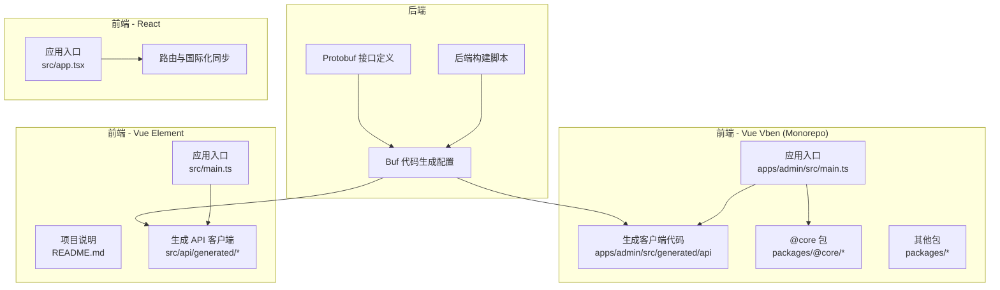
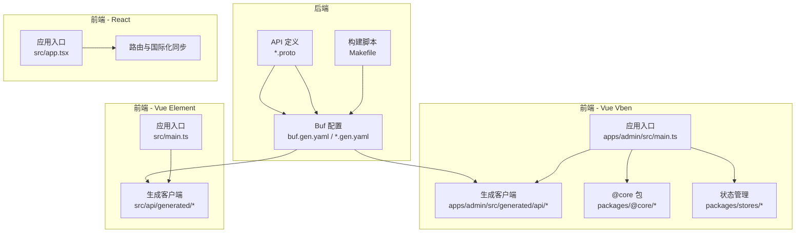
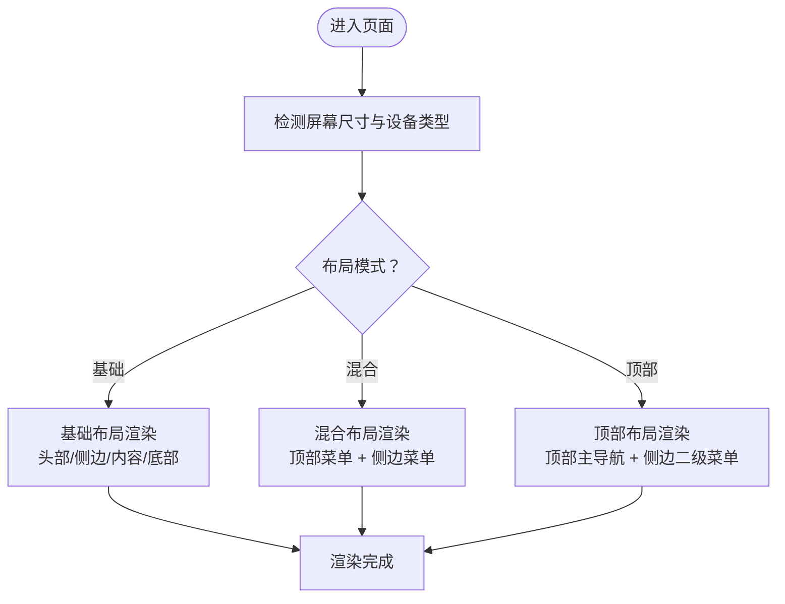
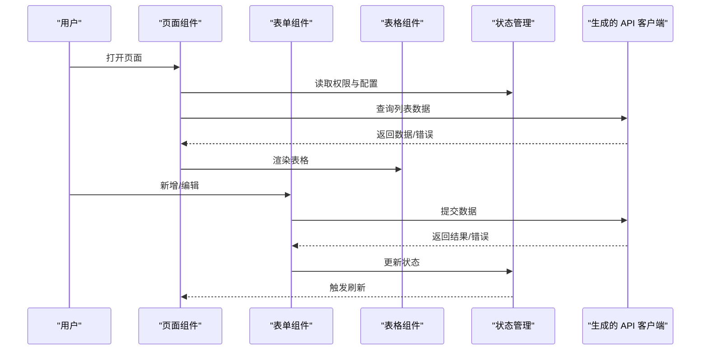
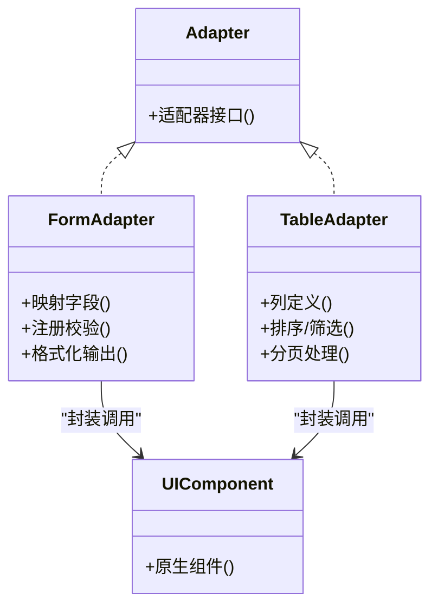
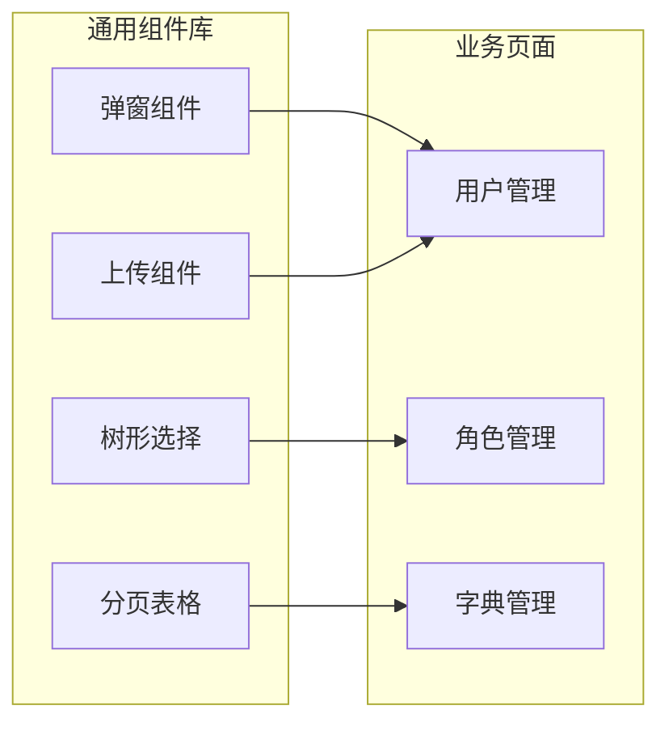
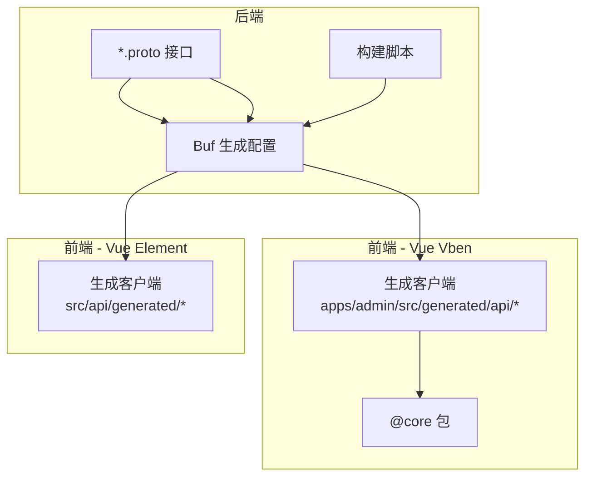

# 组件系统

<cite>
**本文引用的文件**
- [app.tsx](file://frontend/admin/react/src/app.tsx)
- [README.md](file://frontend/admin/vue-element/README.md)
- [frontend_authority.md](file://docs/frontend_authority.md)
- [buf.vue-vben.admin.typescript.gen.yaml](file://backend/api/buf.vue-vben.admin.typescript.gen.yaml)
- [buf.vue-element.admin.typescript.gen.yaml](file://backend/api/buf.vue-element.admin.typescript.gen.yaml)
- [Makefile](file://backend/Makefile)
</cite>

## 目录
1. [简介](#简介)
2. [项目结构](#项目结构)
3. [核心组件](#核心组件)
4. [架构总览](#架构总览)
5. [详细组件分析](#详细组件分析)
6. [依赖分析](#依赖分析)
7. [性能考虑](#性能考虑)
8. [故障排查指南](#故障排查指南)
9. [结论](#结论)
10. [附录](#附录)

## 简介
本文件面向 Vben Admin 组件系统的开发者与维护者，围绕布局组件、页面组件、适配器模式以及业务组件开发进行系统化梳理，并结合本仓库的实际工程配置（React/Vue Element/Vue Vben 多套前端实现）给出可落地的开发规范、最佳实践与性能优化建议。文档同时强调组件复用、组件通信与状态管理的工程化方法，帮助团队在多前端框架下保持一致的开发体验与质量标准。

## 项目结构
本仓库包含三套前端实现：React、Vue Element、Vue Vben。其中 Vue Vben 采用 monorepo 结构，通过内部工具链生成 API 客户端代码并与后端 protobuf 接口对接；Vue Element 提供基于 Element Plus 的企业级后台模板；React 应用作为入口示例展示路由与国际化同步机制。

图表来源
- [buf.vue-vben.admin.typescript.gen.yaml:1-40](file://backend/api/buf.vue-vben.admin.typescript.gen.yaml#L1-L40)
- [buf.vue-element.admin.typescript.gen.yaml:1-40](file://backend/api/buf.vue-element.admin.typescript.gen.yaml#L1-L40)
- [Makefile:100-120](file://backend/Makefile#L100-L120)

章节来源
- [app.tsx:1-12](file://frontend/admin/react/src/app.tsx#L1-L12)
- [README.md:1-50](file://frontend/admin/vue-element/README.md#L1-L50)
- [buf.vue-vben.admin.typescript.gen.yaml:1-40](file://backend/api/buf.vue-vben.admin.typescript.gen.yaml#L1-L40)
- [buf.vue-element.admin.typescript.gen.yaml:1-40](file://backend/api/buf.vue-element.admin.typescript.gen.yaml#L1-L40)
- [Makefile:100-120](file://backend/Makefile#L100-L120)

## 核心组件
- 布局组件
  - 基础布局：提供全局容器、侧边栏、头部、面包屑与内容区的统一结构，确保页面一致性与可扩展性。
  - 混合布局：在基础布局之上，支持顶部菜单与侧边菜单的切换，满足不同业务场景下的导航需求。
  - 顶部布局：以顶部导航为主，侧边区域用于二级菜单或功能分组，适合信息密度较高、需要快速切换的后台系统。
- 页面组件
  - 页面结构：遵循“容器 + 表单 + 列表”的常见组合，容器负责布局与权限控制，表单负责新增/编辑，列表负责查询与操作。
  - 数据获取：通过自动生成的 API 客户端发起请求，统一错误处理与加载态管理。
  - 状态管理：在 Vue Vben 中推荐使用 Pinia；在 React 中可采用 Zustand 或 Redux Toolkit；跨模块共享状态应集中管理并避免耦合。
- 适配器模式
  - 组件适配：对第三方 UI 组件库进行二次封装，屏蔽版本差异与 API 变化，保证调用方接口稳定。
  - 表单适配：将后端字段映射到表单控件，统一校验规则与默认值处理，减少重复逻辑。
  - 表格适配：抽象列定义、排序/筛选/分页参数，统一渲染策略与空态显示。
- 业务组件
  - 通用组件设计：高内聚、低耦合，通过插槽/属性/事件实现灵活扩展；提供完善的类型定义与文档示例。
  - 组件复用：优先抽取公共能力（如弹窗、上传、树形选择），形成组件库并在多页面共享。
  - 组件通信：父子通信使用属性与回调；兄弟/跨层通信使用事件总线或状态库；避免深层嵌套与循环依赖。

章节来源
- [frontend_authority.md:240-283](file://docs/frontend_authority.md#L240-L283)

## 架构总览
下图展示了前端与后端通过 Protobuf 接口对接的整体架构，以及各前端实现如何消费生成的 API 客户端：

图表来源
- [buf.vue-vben.admin.typescript.gen.yaml:1-40](file://backend/api/buf.vue-vben.admin.typescript.gen.yaml#L1-L40)
- [buf.vue-element.admin.typescript.gen.yaml:1-40](file://backend/api/buf.vue-element.admin.typescript.gen.yaml#L1-L40)
- [Makefile:100-120](file://backend/Makefile#L100-L120)

## 详细组件分析

### 布局组件设计模式
- 基础布局
  - 职责：承载全局导航、侧边菜单、主内容区与底部信息。
  - 设计要点：响应式断点、主题切换、语言切换、权限过滤菜单项。
- 混合布局
  - 职责：在顶部与侧边之间切换，兼顾移动端与桌面端体验。
  - 设计要点：菜单层级控制、面包屑动态生成、内容区滚动隔离。
- 顶部布局
  - 职责：顶部主导航，侧边二级菜单或功能面板。
  - 设计要点：紧凑空间内的信息密度控制、快捷操作入口、用户会话管理。

### 页面组件开发规范
- 页面结构
  - 容器：负责权限校验、面包屑、标题与操作按钮。
  - 表单：统一表单容器、提交/重置、校验与错误提示。
  - 列表：统一查询条件、表格列、分页、排序、批量操作。
- 数据获取
  - 使用生成的 API 客户端发起请求，统一封装错误处理与加载态。
  - 对高频请求启用缓存与防抖，避免重复请求。
- 状态管理
  - 在 Vue Vben 中使用 Pinia；在 React 中使用 Zustand/Redux Toolkit。
  - 将用户会话、权限、全局配置等状态集中管理，避免分散更新。

### 适配器模式应用
- 组件适配
  - 对 UI 库进行薄封装，暴露稳定接口，隐藏版本差异。
  - 通过适配器统一事件与属性命名，降低升级成本。
- 表单适配
  - 字段映射：后端字段名到表单控件的映射，支持默认值与格式化。
  - 校验规则：统一校验器注册与错误提示，支持异步校验。
- 表格适配
  - 列定义：统一列配置、排序/筛选参数、空态与加载态。
  - 分页与搜索：统一分页参数与查询参数，支持本地/远程模式。

### 业务组件开发指南
- 通用组件设计
  - 明确输入/输出：通过 props/attrs 定义清晰的接口。
  - 插槽与作用域：支持内容投影与上下文传递。
  - 类型约束：提供完整的 TS 类型定义，便于 IDE 提示与编译期检查。
- 组件复用
  - 抽象公共能力：弹窗、上传、树形选择、富文本等。
  - 组件库化：统一发布与版本管理，避免重复造轮子。
- 组件通信
  - 父子通信：属性向下，事件向上传递。
  - 兄弟/跨层通信：事件总线或状态库，避免深层回调地狱。

章节来源
- [frontend_authority.md:240-283](file://docs/frontend_authority.md#L240-L283)

## 依赖分析
- 前后端接口对接
  - 后端通过 Buf 工具链根据 Protobuf 定义生成前端 TypeScript 客户端代码，分别输出到 Vue Vben 与 Vue Element 的指定目录。
  - 构建脚本中包含生成命令，确保接口变更后能及时更新客户端代码。
- 前端实现差异
  - Vue Vben 采用 monorepo 与 @core 包，便于共享核心能力与工具函数。
  - Vue Element 与 React 作为独立应用，分别集成生成的 API 客户端。

图表来源
- [buf.vue-vben.admin.typescript.gen.yaml:1-40](file://backend/api/buf.vue-vben.admin.typescript.gen.yaml#L1-L40)
- [buf.vue-element.admin.typescript.gen.yaml:1-40](file://backend/api/buf.vue-element.admin.typescript.gen.yaml#L1-L40)
- [Makefile:100-120](file://backend/Makefile#L100-L120)

章节来源
- [buf.vue-vben.admin.typescript.gen.yaml:1-40](file://backend/api/buf.vue-vben.admin.typescript.gen.yaml#L1-L40)
- [buf.vue-element.admin.typescript.gen.yaml:1-40](file://backend/api/buf.vue-element.admin.typescript.gen.yaml#L1-L40)
- [Makefile:100-120](file://backend/Makefile#L100-L120)

## 性能考虑
- 组件懒加载与分割
  - 路由级懒加载，减少首屏体积；公共依赖抽离，提升缓存命中率。
- 请求优化
  - 合并请求、启用缓存、防抖与节流；对长列表使用虚拟滚动。
- 渲染优化
  - 合理使用计算属性与响应式数据，避免不必要的重渲染；对复杂列表使用 key 与分页。
- 图标与资源
  - SVG 内联或按需引入，图片懒加载与压缩；字体图标按需加载。
- 状态管理
  - 精简 Store，拆分模块，避免大对象深拷贝；合理使用持久化与增量更新。

## 故障排查指南
- 权限控制
  - 若按钮/菜单不可见，请确认当前用户角色是否满足访问条件；检查权限配置与指令绑定是否正确。
- API 客户端
  - 若接口调用失败，检查生成的客户端代码是否已更新；确认网络代理与跨域配置；查看后端日志定位问题。
- 国际化与主题
  - 若语言或主题不生效，检查偏好设置与本地存储；确认 i18n 资源加载顺序与回退策略。

章节来源
- [frontend_authority.md:240-283](file://docs/frontend_authority.md#L240-L283)

## 结论
通过对布局组件、页面组件、适配器模式与业务组件的系统化梳理，结合本仓库的多前端实现与后端接口生成流程，团队可以在不同技术栈下保持一致的开发范式与质量标准。建议在后续迭代中持续完善组件库、加强状态管理与性能监控，并通过自动化测试保障变更稳定性。

## 附录
- 快速开始
  - Vue Vben：安装依赖后运行开发服务器，访问生成的 API 文档与示例页面。
  - Vue Element：参考项目说明与示例，集成生成的 API 客户端。
  - React：启动应用，验证路由与国际化同步功能。

章节来源
- [README.md:1-50](file://frontend/admin/vue-element/README.md#L1-L50)
- [app.tsx:1-12](file://frontend/admin/react/src/app.tsx#L1-L12)