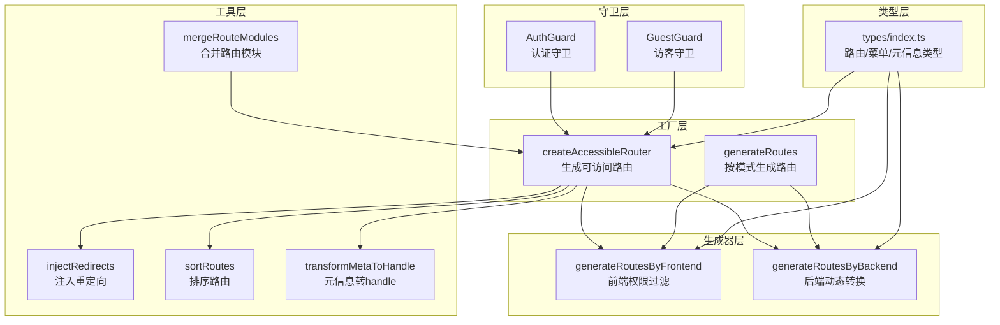
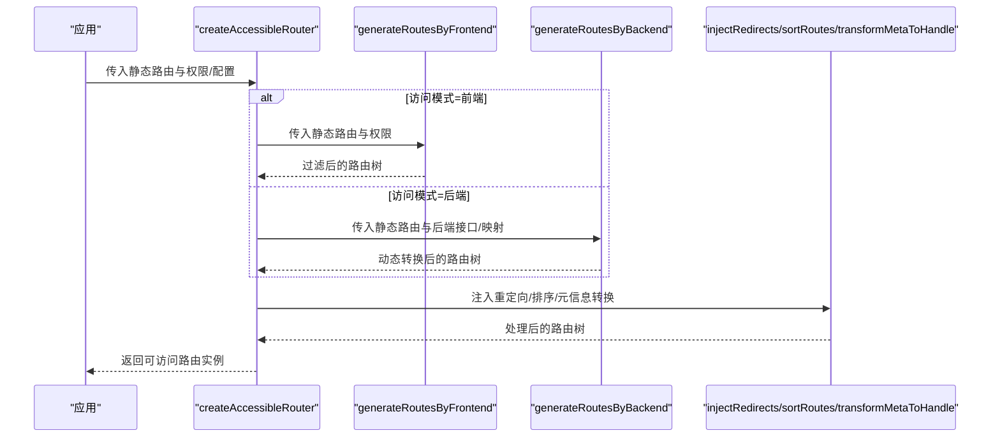
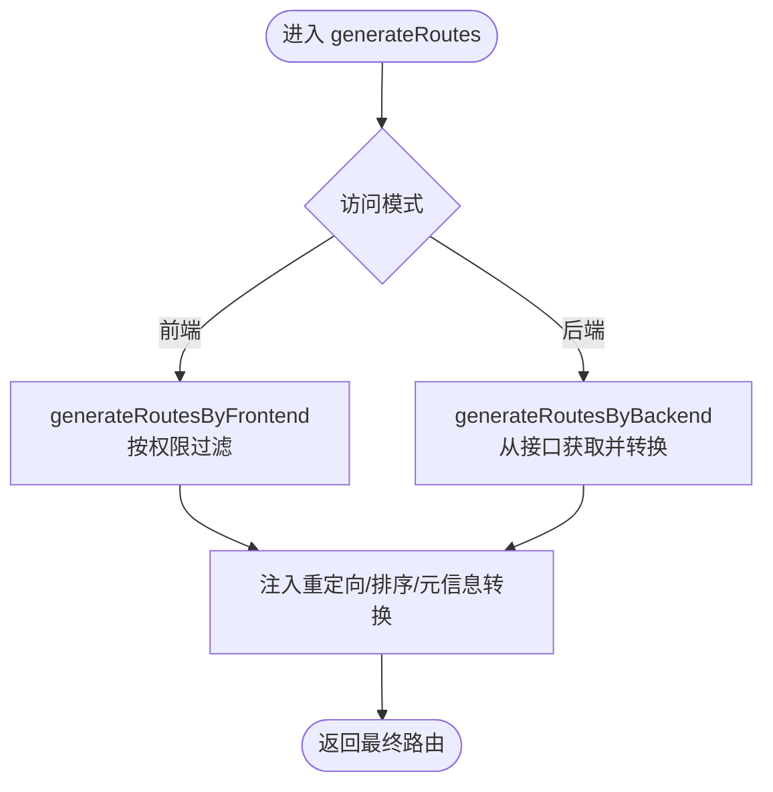
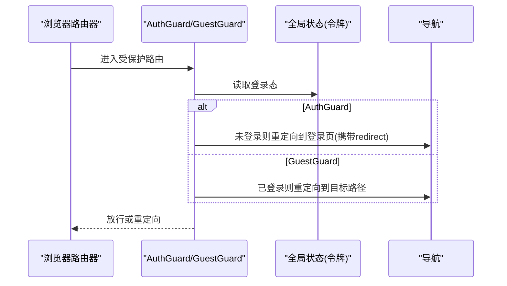
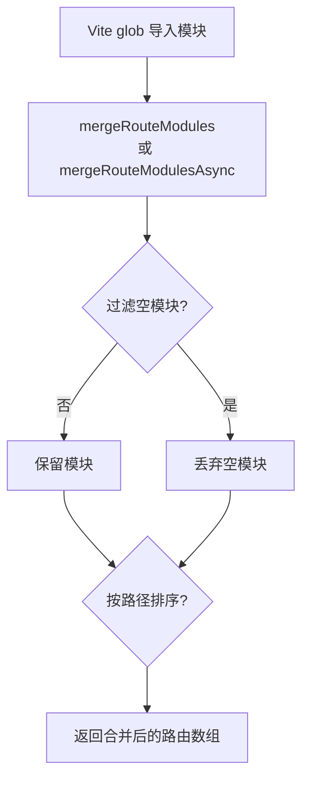
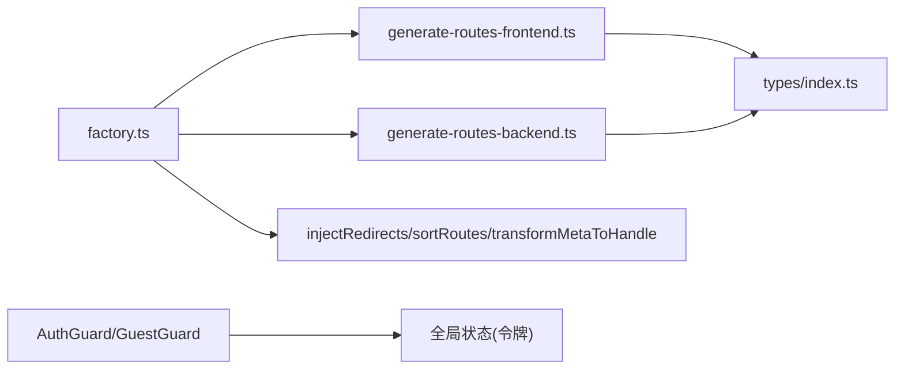

# 路由系统

<cite>
**本文引用的文件**
- [frontend/admin/react/src/core/router/index.ts](file://frontend/admin/react/src/core/router/index.ts)
- [frontend/admin/react/src/core/router/factory.ts](file://frontend/admin/react/src/core/router/factory.ts)
- [frontend/admin/react/src/core/router/generators/generate-routes-frontend.ts](file://frontend/admin/react/src/core/router/generators/generate-routes-frontend.ts)
- [frontend/admin/react/src/core/router/generators/generate-routes-backend.ts](file://frontend/admin/react/src/core/router/generators/generate-routes-backend.ts)
- [frontend/admin/react/src/core/router/guards/AuthGuard.tsx](file://frontend/admin/react/src/core/router/guards/AuthGuard.tsx)
- [frontend/admin/react/src/core/router/guards/GuestGuard.tsx](file://frontend/admin/react/src/core/router/guards/GuestGuard.tsx)
- [frontend/admin/react/src/core/router/types/index.ts](file://frontend/admin/react/src/core/router/types/index.ts)
- [frontend/admin/react/src/core/router/utils/merge-route-modules.ts](file://frontend/admin/react/src/core/router/utils/merge-route-modules.ts)
- [frontend/admin/react/src/router/config/auth.tsx](file://frontend/admin/react/src/router/config/auth.tsx)
- [frontend/admin/react/src/router/config/error-routes.tsx](file://frontend/admin/react/src/router/config/error-routes.tsx)
- [frontend/admin/react/mock/route.ts](file://frontend/admin/react/mock/route.ts)
</cite>

## 目录
1. [简介](#简介)
2. [项目结构](#项目结构)
3. [核心组件](#核心组件)
4. [架构总览](#架构总览)
5. [详细组件分析](#详细组件分析)
6. [依赖分析](#依赖分析)
7. [性能考虑](#性能考虑)
8. [故障排查指南](#故障排查指南)
9. [结论](#结论)
10. [附录](#附录)

## 简介
本文件面向 Vben Admin 前端（React 版本）的路由系统，提供从架构到实现细节的完整开发文档。内容涵盖：
- 路由配置结构：静态路由与动态路由的生成机制
- 路由守卫系统：认证守卫、访客守卫、导航拦截
- 路由模块化设计：业务模块路由的组织方式
- 最佳实践：懒加载、元信息配置、嵌套路由
- 示例与常见问题解决方案

## 项目结构
React 版本的路由系统位于前端工程的 core/router 目录下，采用“工厂 + 生成器 + 守卫 + 工具”的分层设计：
- 工厂层：统一创建可访问路由实例，负责流程编排与后处理（排序、重定向注入、元信息转换）
- 生成器层：根据访问模式（前端/后端）生成最终路由树
- 守卫层：认证与访客拦截，保障访问安全
- 类型层：统一定义路由、菜单、元信息等类型
- 工具层：模块合并、懒加载、菜单生成、重定向注入等

图表来源
- [frontend/admin/react/src/core/router/factory.ts:10-77](file://frontend/admin/react/src/core/router/factory.ts#L10-L77)
- [frontend/admin/react/src/core/router/generators/generate-routes-frontend.ts:12-37](file://frontend/admin/react/src/core/router/generators/generate-routes-frontend.ts#L12-L37)
- [frontend/admin/react/src/core/router/generators/generate-routes-backend.ts:12-41](file://frontend/admin/react/src/core/router/generators/generate-routes-backend.ts#L12-L41)
- [frontend/admin/react/src/core/router/guards/AuthGuard.tsx:11-24](file://frontend/admin/react/src/core/router/guards/AuthGuard.tsx#L11-L24)
- [frontend/admin/react/src/core/router/guards/GuestGuard.tsx:15-28](file://frontend/admin/react/src/core/router/guards/GuestGuard.tsx#L15-L28)
- [frontend/admin/react/src/core/router/utils/merge-route-modules.ts:14-70](file://frontend/admin/react/src/core/router/utils/merge-route-modules.ts#L14-L70)
- [frontend/admin/react/src/core/router/types/index.ts:11-314](file://frontend/admin/react/src/core/router/types/index.ts#L11-L314)

章节来源
- [frontend/admin/react/src/core/router/index.ts:1-6](file://frontend/admin/react/src/core/router/index.ts#L1-L6)
- [frontend/admin/react/src/core/router/factory.ts:10-77](file://frontend/admin/react/src/core/router/factory.ts#L10-L77)

## 核心组件
- 工厂函数 createAccessibleRouter：负责在给定静态路由基础上，结合权限与配置，生成可直接用于浏览器路由器的路由树，并进行必要的后处理（注入重定向、排序、元信息转换）。
- 工厂函数 generateRoutes：根据访问模式（前端/后端）选择不同的生成策略，返回最终路由数组。
- 生成器 generateRoutesByFrontend：基于静态路由与用户权限进行过滤，支持“菜单可见但禁止访问”场景的占位渲染。
- 生成器 generateRoutesByBackend：从后端接口拉取菜单树，将组件路径标准化并映射到页面/布局组件，支持 Suspense + lazy 的懒加载渲染。
- 守卫 AuthGuard/GuestGuard：在路由层级进行认证与访客拦截，处理登录态与重定向。
- 类型系统：统一定义 AppRoute/AppRouteObject/RouteMeta/BackendRoute 等，确保路由配置的一致性与可维护性。
- 工具函数：mergeRouteModules/mergeRouteModulesAsync 合并动态路由模块；injectRedirects/sortRoutes/transformMetaToHandle 提供路由树的增强与标准化。

章节来源
- [frontend/admin/react/src/core/router/factory.ts:10-77](file://frontend/admin/react/src/core/router/factory.ts#L10-L77)
- [frontend/admin/react/src/core/router/generators/generate-routes-frontend.ts:12-93](file://frontend/admin/react/src/core/router/generators/generate-routes-frontend.ts#L12-L93)
- [frontend/admin/react/src/core/router/generators/generate-routes-backend.ts:12-127](file://frontend/admin/react/src/core/router/generators/generate-routes-backend.ts#L12-L127)
- [frontend/admin/react/src/core/router/guards/AuthGuard.tsx:11-24](file://frontend/admin/react/src/core/router/guards/AuthGuard.tsx#L11-L24)
- [frontend/admin/react/src/core/router/guards/GuestGuard.tsx:15-28](file://frontend/admin/react/src/core/router/guards/GuestGuard.tsx#L15-L28)
- [frontend/admin/react/src/core/router/types/index.ts:51-153](file://frontend/admin/react/src/core/router/types/index.ts#L51-L153)
- [frontend/admin/react/src/core/router/utils/merge-route-modules.ts:14-96](file://frontend/admin/react/src/core/router/utils/merge-route-modules.ts#L14-L96)

## 架构总览
下图展示了从应用启动到路由可用的关键流程：工厂函数根据访问模式调用相应生成器，生成最终路由树后进行后处理，最后交由浏览器路由器管理。

图表来源
- [frontend/admin/react/src/core/router/factory.ts:10-33](file://frontend/admin/react/src/core/router/factory.ts#L10-L33)
- [frontend/admin/react/src/core/router/generators/generate-routes-frontend.ts:12-37](file://frontend/admin/react/src/core/router/generators/generate-routes-frontend.ts#L12-L37)
- [frontend/admin/react/src/core/router/generators/generate-routes-backend.ts:12-41](file://frontend/admin/react/src/core/router/generators/generate-routes-backend.ts#L12-L41)

## 详细组件分析

### 工厂与生成器：静态/动态路由生成
- createAccessibleRouter
  - 输入：静态路由 + 权限 + 配置（是否自动注入重定向/排序）
  - 流程：前端模式下先按权限过滤，再注入重定向与排序，最后将 meta 转换为 handle 以便 useMatches 获取
  - 输出：可直接传入 createBrowserRouter 的路由数组
- generateRoutes
  - 根据模式选择生成器：前端模式基于权限过滤；后端模式通过接口获取菜单树并转换组件
  - 参数校验：后端模式必须提供 fetchMenuListAsync
- generateRoutesByFrontend
  - 权限判定：支持单一权限码与角色数组两种方式；支持忽略权限与“菜单可见但禁止访问”
  - 结果：返回过滤后的路由树；若配置了 forbiddenElement，会将无权限节点替换为占位元素
- generateRoutesByBackend
  - 标准化组件路径：normalizeViewPath 支持多目录与后缀变体
  - 组件映射：优先布局组件，其次页面组件；找不到时在开发环境告警，生产环境降级
  - 懒加载：使用 Suspense + lazy 包裹组件，避免首屏阻塞

图表来源
- [frontend/admin/react/src/core/router/factory.ts:38-77](file://frontend/admin/react/src/core/router/factory.ts#L38-L77)
- [frontend/admin/react/src/core/router/generators/generate-routes-frontend.ts:12-37](file://frontend/admin/react/src/core/router/generators/generate-routes-frontend.ts#L12-L37)
- [frontend/admin/react/src/core/router/generators/generate-routes-backend.ts:12-41](file://frontend/admin/react/src/core/router/generators/generate-routes-backend.ts#L12-L41)

章节来源
- [frontend/admin/react/src/core/router/factory.ts:10-77](file://frontend/admin/react/src/core/router/factory.ts#L10-L77)
- [frontend/admin/react/src/core/router/generators/generate-routes-frontend.ts:12-93](file://frontend/admin/react/src/core/router/generators/generate-routes-frontend.ts#L12-L93)
- [frontend/admin/react/src/core/router/generators/generate-routes-backend.ts:12-127](file://frontend/admin/react/src/core/router/generators/generate-routes-backend.ts#L12-L127)

### 路由守卫系统：认证与访客拦截
- AuthGuard
  - 作用：未登录用户跳转至登录页，并携带当前路径作为重定向参数
  - 依赖：从全局状态读取登录态；支持外部传入 isAuthenticated
- GuestGuard
  - 作用：已登录用户不可访问登录/注册等页面，直接重定向到目标路径
  - 依赖：从全局状态读取登录态；支持外部传入 isAuthenticated

图表来源
- [frontend/admin/react/src/core/router/guards/AuthGuard.tsx:11-24](file://frontend/admin/react/src/core/router/guards/AuthGuard.tsx#L11-L24)
- [frontend/admin/react/src/core/router/guards/GuestGuard.tsx:15-28](file://frontend/admin/react/src/core/router/guards/GuestGuard.tsx#L15-L28)

章节来源
- [frontend/admin/react/src/core/router/guards/AuthGuard.tsx:11-24](file://frontend/admin/react/src/core/router/guards/AuthGuard.tsx#L11-L24)
- [frontend/admin/react/src/core/router/guards/GuestGuard.tsx:15-28](file://frontend/admin/react/src/core/router/guards/GuestGuard.tsx#L15-L28)

### 路由模块化设计：业务模块组织
- 动态模块合并
  - mergeRouteModules：合并 Vite glob 导入的路由模块，默认导出数组或对象
  - mergeRouteModulesAsync：支持异步模块懒加载，适用于按需路由
- 模块规范
  - 每个动态导入的路由文件应默认导出 AppRouteObject[]，便于统一处理
  - 可选：在开发环境下注入模块路径信息，便于调试定位

图表来源
- [frontend/admin/react/src/core/router/utils/merge-route-modules.ts:14-96](file://frontend/admin/react/src/core/router/utils/merge-route-modules.ts#L14-L96)

章节来源
- [frontend/admin/react/src/core/router/utils/merge-route-modules.ts:14-96](file://frontend/admin/react/src/core/router/utils/merge-route-modules.ts#L14-L96)

### 元信息与类型系统：路由配置的契约
- RouteMeta：统一承载菜单/标签页/面包屑/权限/外链等元信息
- AppRoute/AppRouteObject：在原生 RouteObject 基础上扩展 name/path/meta/children 等字段
- BackendRoute：后端返回的路由对象，组件以字符串路径表示
- 类型约束：通过 isAppRoute 等工具函数保证运行时类型安全

章节来源
- [frontend/admin/react/src/core/router/types/index.ts:51-153](file://frontend/admin/react/src/core/router/types/index.ts#L51-L153)

### 错误与兜底：错误路由与菜单生成
- 错误路由：集中定义 404、500 等错误页面，确保异常路径的友好提示
- 菜单生成：结合权限与元信息生成菜单树，支持隐藏项、徽标、排序等

章节来源
- [frontend/admin/react/src/router/config/error-routes.tsx](file://frontend/admin/react/src/router/config/error-routes.tsx)
- [frontend/admin/react/src/core/router/generators/generate-menus.ts](file://frontend/admin/react/src/core/router/generators/generate-menus.ts)

## 依赖分析
- 组件耦合
  - 工厂函数依赖生成器与工具函数，保持高层控制与低层实现解耦
  - 生成器仅依赖类型与通用工具，避免对具体 UI 框架的强耦合
  - 守卫依赖全局状态，建议通过状态管理模块抽象，便于测试与替换
- 外部依赖
  - 使用 react-router-dom 的 createBrowserRouter 与 RouteObject
  - 使用 Suspense/lazy 实现懒加载
- 潜在循环依赖
  - 工厂与生成器通过类型与工具函数间接交互，未见直接循环依赖

图表来源
- [frontend/admin/react/src/core/router/factory.ts:10-33](file://frontend/admin/react/src/core/router/factory.ts#L10-L33)
- [frontend/admin/react/src/core/router/generators/generate-routes-frontend.ts:12-37](file://frontend/admin/react/src/core/router/generators/generate-routes-frontend.ts#L12-L37)
- [frontend/admin/react/src/core/router/generators/generate-routes-backend.ts:12-41](file://frontend/admin/react/src/core/router/generators/generate-routes-backend.ts#L12-L41)
- [frontend/admin/react/src/core/router/guards/AuthGuard.tsx:11-24](file://frontend/admin/react/src/core/router/guards/AuthGuard.tsx#L11-L24)
- [frontend/admin/react/src/core/router/guards/GuestGuard.tsx:15-28](file://frontend/admin/react/src/core/router/guards/GuestGuard.tsx#L15-L28)

## 性能考虑
- 懒加载
  - 后端模式通过 Suspense + lazy 包裹组件，减少首屏体积
  - 建议对大模块启用异步合并，避免一次性加载过多页面
- 路由排序与重定向
  - 自动注入重定向与排序可减少手写样板代码，但需注意复杂度与调试成本
- 权限过滤
  - 前端模式的权限过滤在构建期与运行期均可进行，建议在构建期剔除无效分支，降低运行期计算量
- 组件映射
  - 标准化路径与候选匹配会带来一定开销，建议在开发阶段开启严格校验，生产环境关闭冗余日志

## 故障排查指南
- 后端组件找不到
  - 现象：控制台出现组件未找到告警或渲染 404 字样
  - 排查：确认 componentPath 是否符合 normalizeViewPath 规范；检查 pageMap/layoutMap 映射键名
  - 参考：[normalizeViewPath:114-126](file://frontend/admin/react/src/core/router/generators/generate-routes-backend.ts#L114-L126)
- 权限导致的 403
  - 现象：菜单可见但进入页面返回 403
  - 排查：确认 RouteMeta 中的 permission/authority/menuVisibleWithForbidden 配置
  - 参考：[hasPermission/shouldRenderForbidden:45-90](file://frontend/admin/react/src/core/router/generators/generate-routes-frontend.ts#L45-L90)
- 登录态失效导致反复重定向
  - 现象：在登录页与目标页之间来回跳转
  - 排查：确认全局状态中的 accessToken 是否正确更新；AuthGuard 的 isAuthenticated 传参是否覆盖默认逻辑
  - 参考：[AuthGuard:11-24](file://frontend/admin/react/src/core/router/guards/AuthGuard.tsx#L11-L24)
- 动态模块合并失败
  - 现象：路由模块未生效或报错
  - 排查：确认模块默认导出为 AppRouteObject[]；开发环境下可利用 __modulePath 辅助定位
  - 参考：[mergeRouteModules:14-70](file://frontend/admin/react/src/core/router/utils/merge-route-modules.ts#L14-L70)

章节来源
- [frontend/admin/react/src/core/router/generators/generate-routes-backend.ts:114-126](file://frontend/admin/react/src/core/router/generators/generate-routes-backend.ts#L114-L126)
- [frontend/admin/react/src/core/router/generators/generate-routes-frontend.ts:45-90](file://frontend/admin/react/src/core/router/generators/generate-routes-frontend.ts#L45-L90)
- [frontend/admin/react/src/core/router/guards/AuthGuard.tsx:11-24](file://frontend/admin/react/src/core/router/guards/AuthGuard.tsx#L11-L24)
- [frontend/admin/react/src/core/router/utils/merge-route-modules.ts:14-70](file://frontend/admin/react/src/core/router/utils/merge-route-modules.ts#L14-L70)

## 结论
该路由系统以工厂与生成器为核心，结合守卫与工具函数，实现了灵活的静态/动态路由生成与权限控制。通过统一的类型系统与模块化设计，既保证了可维护性，又兼顾了性能与可扩展性。建议在实际项目中遵循本文最佳实践，配合错误路由与菜单生成策略，提升用户体验与开发效率。

## 附录
- 认证与权限配置示例参考
  - [frontend/admin/react/src/router/config/auth.tsx](file://frontend/admin/react/src/router/config/auth.tsx)
- Mock 路由示例参考
  - [frontend/admin/react/mock/route.ts](file://frontend/admin/react/mock/route.ts)