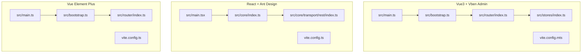
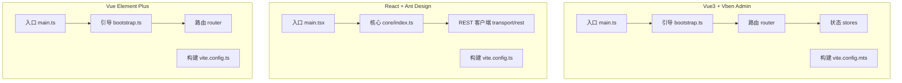
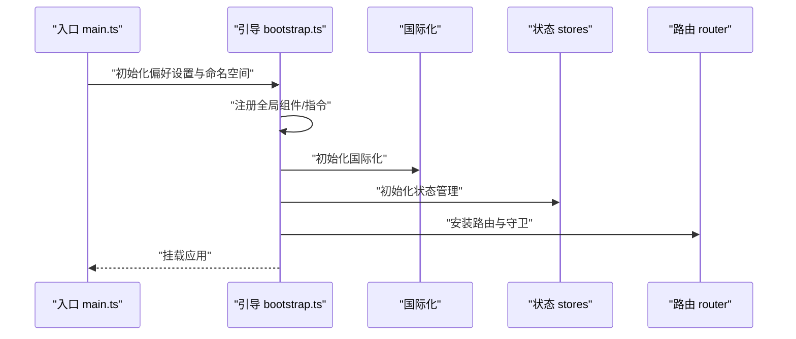
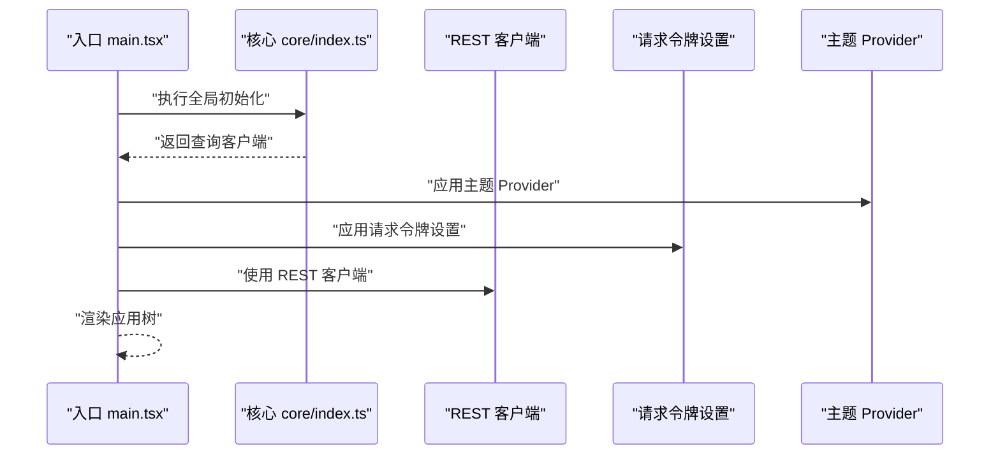
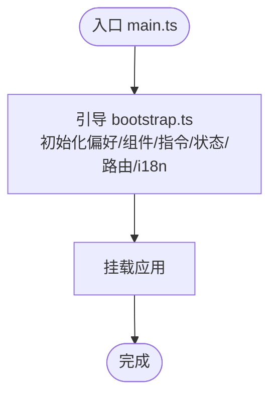
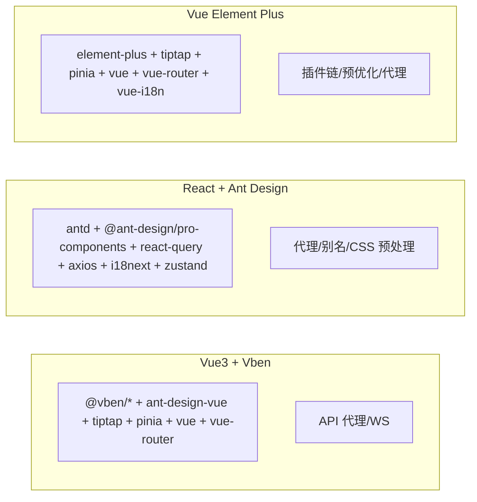

# 前端开发

<cite>
**本文引用的文件**
- [frontend/admin/vue-vben/apps/admin/package.json](file://frontend/admin/vue-vben/apps/admin/package.json)
- [frontend/admin/react/package.json](file://frontend/admin/react/package.json)
- [frontend/admin/vue-element/package.json](file://frontend/admin/vue-element/package.json)
- [frontend/admin/vue-vben/apps/admin/src/main.ts](file://frontend/admin/vue-vben/apps/admin/src/main.ts)
- [frontend/admin/react/src/main.tsx](file://frontend/admin/react/src/main.tsx)
- [frontend/admin/vue-element/src/main.ts](file://frontend/admin/vue-element/src/main.ts)
- [frontend/admin/vue-vben/apps/admin/src/bootstrap.ts](file://frontend/admin/vue-vben/apps/admin/src/bootstrap.ts)
- [frontend/admin/vue-element/src/bootstrap.ts](file://frontend/admin/vue-element/src/bootstrap.ts)
- [frontend/admin/vue-vben/apps/admin/src/router/index.ts](file://frontend/admin/vue-vben/apps/admin/src/router/index.ts)
- [frontend/admin/vue-element/src/router/index.ts](file://frontend/admin/vue-element/src/router/index.ts)
- [frontend/admin/vue-vben/apps/admin/src/stores/index.ts](file://frontend/admin/vue-vben/apps/admin/src/stores/index.ts)
- [frontend/admin/react/src/core/index.ts](file://frontend/admin/react/src/core/index.ts)
- [frontend/admin/react/src/core/transport/rest/index.ts](file://frontend/admin/react/src/core/transport/rest/index.ts)
- [frontend/admin/vue-vben/apps/admin/vite.config.mts](file://frontend/admin/vue-vben/apps/admin/vite.config.mts)
- [frontend/admin/react/vite.config.ts](file://frontend/admin/react/vite.config.ts)
- [frontend/admin/vue-element/vite.config.ts](file://frontend/admin/vue-element/vite.config.ts)
</cite>

## 目录
1. [简介](#简介)
2. [项目结构](#项目结构)
3. [核心组件](#核心组件)
4. [架构总览](#架构总览)
5. [详细组件分析](#详细组件分析)
6. [依赖分析](#依赖分析)
7. [性能考虑](#性能考虑)
8. [故障排查指南](#故障排查指南)
9. [结论](#结论)
10. [附录](#附录)

## 简介
本文件面向 GoWind Admin 的前端开发，围绕三种可选前端框架（Vue3 + Vben Admin、React + Ant Design、Vue Element Plus）提供系统性指导。内容涵盖组件架构设计、状态管理模式、路由配置策略、TypeScript 类型体系、API 客户端封装与调用（含 REST 与 SSE）、组件开发最佳实践（样式系统、国际化、主题定制），并给出具体开发示例与调试技巧，帮助开发者高效开展前端工作。

## 项目结构
三个前端子项目分别位于：
- Vue3 + Vben Admin：frontend/admin/vue-vben/apps/admin
- React + Ant Design：frontend/admin/react
- Vue Element Plus：frontend/admin/vue-element

每个子项目均包含独立的包管理配置、构建配置、入口文件、引导流程、路由与状态管理模块、国际化与主题相关配置等。整体采用多包/多应用组织，便于按需选择与维护。

图表来源
- [frontend/admin/vue-vben/apps/admin/src/main.ts:1-32](file://frontend/admin/vue-vben/apps/admin/src/main.ts#L1-L32)
- [frontend/admin/vue-vben/apps/admin/src/bootstrap.ts:1-53](file://frontend/admin/vue-vben/apps/admin/src/bootstrap.ts#L1-L53)
- [frontend/admin/vue-vben/apps/admin/src/router/index.ts:1-38](file://frontend/admin/vue-vben/apps/admin/src/router/index.ts#L1-L38)
- [frontend/admin/vue-vben/apps/admin/src/stores/index.ts:1-136](file://frontend/admin/vue-vben/apps/admin/src/stores/index.ts#L1-L136)
- [frontend/admin/vue-vben/apps/admin/vite.config.mts:1-21](file://frontend/admin/vue-vben/apps/admin/vite.config.mts#L1-L21)
- [frontend/admin/react/src/main.tsx:1-46](file://frontend/admin/react/src/main.tsx#L1-L46)
- [frontend/admin/react/src/core/index.ts:1-8](file://frontend/admin/react/src/core/index.ts#L1-L8)
- [frontend/admin/react/src/core/transport/rest/index.ts:1-10](file://frontend/admin/react/src/core/transport/rest/index.ts#L1-L10)
- [frontend/admin/vue-element/src/main.ts:1-25](file://frontend/admin/vue-element/src/main.ts#L1-L25)
- [frontend/admin/vue-element/src/bootstrap.ts:1-55](file://frontend/admin/vue-element/src/bootstrap.ts#L1-L55)
- [frontend/admin/vue-element/src/router/index.ts:1-38](file://frontend/admin/vue-element/src/router/index.ts#L1-L38)
- [frontend/admin/vue-element/vite.config.ts:1-240](file://frontend/admin/vue-element/vite.config.ts#L1-L240)

章节来源
- [frontend/admin/vue-vben/apps/admin/package.json:1-78](file://frontend/admin/vue-vben/apps/admin/package.json#L1-L78)
- [frontend/admin/react/package.json:1-82](file://frontend/admin/react/package.json#L1-L82)
- [frontend/admin/vue-element/package.json:1-173](file://frontend/admin/vue-element/package.json#L1-L173)

## 核心组件
- 入口与引导
  - Vue3 + Vben Admin：通过入口文件初始化偏好设置与应用引导，随后挂载应用。
  - React + Ant Design：入口文件执行全局初始化后，以 Provider 包裹渲染应用树，并启用查询客户端与开发工具。
  - Vue Element Plus：入口文件同样通过异步引导完成应用挂载。
- 路由与守卫
  - 三套方案均基于 vue-router 或等价机制，支持 hash 与 history 两种历史模式，具备滚动行为与守卫配置。
- 状态管理
  - Vue3 + Vben Admin：集中导出多个业务领域 store，提供通用枚举与状态映射工具。
  - React + Ant Design：通过核心模块导出认证、用户、页签等状态模块。
  - Vue Element Plus：提供统一的 store 初始化与模块导出。
- 构建与开发服务器
  - 三套项目均提供独立的 vite 配置，包含代理、插件、别名、CSS 预处理器、构建优化等。

章节来源
- [frontend/admin/vue-vben/apps/admin/src/main.ts:1-32](file://frontend/admin/vue-vben/apps/admin/src/main.ts#L1-L32)
- [frontend/admin/react/src/main.tsx:1-46](file://frontend/admin/react/src/main.tsx#L1-L46)
- [frontend/admin/vue-element/src/main.ts:1-25](file://frontend/admin/vue-element/src/main.ts#L1-L25)
- [frontend/admin/vue-vben/apps/admin/src/router/index.ts:1-38](file://frontend/admin/vue-vben/apps/admin/src/router/index.ts#L1-L38)
- [frontend/admin/vue-element/src/router/index.ts:1-38](file://frontend/admin/vue-element/src/router/index.ts#L1-L38)
- [frontend/admin/vue-vben/apps/admin/src/stores/index.ts:1-136](file://frontend/admin/vue-vben/apps/admin/src/stores/index.ts#L1-L136)
- [frontend/admin/react/src/core/index.ts:1-8](file://frontend/admin/react/src/core/index.ts#L1-L8)
- [frontend/admin/vue-vben/apps/admin/vite.config.mts:1-21](file://frontend/admin/vue-vben/apps/admin/vite.config.mts#L1-L21)
- [frontend/admin/react/vite.config.ts:1-47](file://frontend/admin/react/vite.config.ts#L1-L47)
- [frontend/admin/vue-element/vite.config.ts:1-240](file://frontend/admin/vue-element/vite.config.ts#L1-L240)

## 架构总览
下图展示三套前端框架的总体架构关系与关键交互：

图表来源
- [frontend/admin/vue-vben/apps/admin/src/main.ts:1-32](file://frontend/admin/vue-vben/apps/admin/src/main.ts#L1-L32)
- [frontend/admin/vue-vben/apps/admin/src/bootstrap.ts:1-53](file://frontend/admin/vue-vben/apps/admin/src/bootstrap.ts#L1-L53)
- [frontend/admin/vue-vben/apps/admin/src/router/index.ts:1-38](file://frontend/admin/vue-vben/apps/admin/src/router/index.ts#L1-L38)
- [frontend/admin/vue-vben/apps/admin/src/stores/index.ts:1-136](file://frontend/admin/vue-vben/apps/admin/src/stores/index.ts#L1-L136)
- [frontend/admin/vue-vben/apps/admin/vite.config.mts:1-21](file://frontend/admin/vue-vben/apps/admin/vite.config.mts#L1-L21)
- [frontend/admin/react/src/main.tsx:1-46](file://frontend/admin/react/src/main.tsx#L1-L46)
- [frontend/admin/react/src/core/index.ts:1-8](file://frontend/admin/react/src/core/index.ts#L1-L8)
- [frontend/admin/react/src/core/transport/rest/index.ts:1-10](file://frontend/admin/react/src/core/transport/rest/index.ts#L1-L10)
- [frontend/admin/vue-element/src/main.ts:1-25](file://frontend/admin/vue-element/src/main.ts#L1-L25)
- [frontend/admin/vue-element/src/bootstrap.ts:1-55](file://frontend/admin/vue-element/src/bootstrap.ts#L1-L55)
- [frontend/admin/vue-element/src/router/index.ts:1-38](file://frontend/admin/vue-element/src/router/index.ts#L1-L38)
- [frontend/admin/vue-element/vite.config.ts:1-240](file://frontend/admin/vue-element/vite.config.ts#L1-L240)

## 详细组件分析

### Vue3 + Vben Admin
- 组件架构与引导
  - 入口文件负责初始化偏好设置、应用命名空间与引导流程，随后调用引导模块完成组件注册、国际化、状态初始化、权限指令与路由安装。
  - 引导模块动态更新页面标题，结合路由元信息与偏好设置生成最终标题。
- 路由配置
  - 支持 hash 与 history 两种模式，具备滚动行为与守卫创建。
- 状态管理
  - 集中导出多个业务 store，并提供通用枚举列表与状态到颜色/名称的映射工具，便于 UI 展示与复用。
- 构建与代理
  - 提供统一的 vite 配置，内置 API 代理与 WebSocket 支持，便于本地联调后端服务。

图表来源
- [frontend/admin/vue-vben/apps/admin/src/main.ts:1-32](file://frontend/admin/vue-vben/apps/admin/src/main.ts#L1-L32)
- [frontend/admin/vue-vben/apps/admin/src/bootstrap.ts:1-53](file://frontend/admin/vue-vben/apps/admin/src/bootstrap.ts#L1-L53)

章节来源
- [frontend/admin/vue-vben/apps/admin/src/main.ts:1-32](file://frontend/admin/vue-vben/apps/admin/src/main.ts#L1-L32)
- [frontend/admin/vue-vben/apps/admin/src/bootstrap.ts:1-53](file://frontend/admin/vue-vben/apps/admin/src/bootstrap.ts#L1-L53)
- [frontend/admin/vue-vben/apps/admin/src/router/index.ts:1-38](file://frontend/admin/vue-vben/apps/admin/src/router/index.ts#L1-L38)
- [frontend/admin/vue-vben/apps/admin/src/stores/index.ts:1-136](file://frontend/admin/vue-vben/apps/admin/src/stores/index.ts#L1-L136)
- [frontend/admin/vue-vben/apps/admin/vite.config.mts:1-21](file://frontend/admin/vue-vben/apps/admin/vite.config.mts#L1-L21)

### React + Ant Design
- 组件架构与引导
  - 入口文件执行全局初始化，随后以 Provider 层级包裹应用树，依次注入主题、请求令牌设置、查询客户端与开发工具。
  - 核心模块统一导出 REST/SSE 传输层与查询客户端，便于在页面与组件中直接消费。
- 状态管理
  - 通过核心模块导出认证、用户、页签等状态模块，便于按需引入与组合。
- 构建与代理
  - 提供灵活的 vite 配置，支持代理、别名、CSS 预处理器与开发服务器优化。

图表来源
- [frontend/admin/react/src/main.tsx:1-46](file://frontend/admin/react/src/main.tsx#L1-L46)
- [frontend/admin/react/src/core/index.ts:1-8](file://frontend/admin/react/src/core/index.ts#L1-L8)
- [frontend/admin/react/src/core/transport/rest/index.ts:1-10](file://frontend/admin/react/src/core/transport/rest/index.ts#L1-L10)

章节来源
- [frontend/admin/react/src/main.tsx:1-46](file://frontend/admin/react/src/main.tsx#L1-L46)
- [frontend/admin/react/src/core/index.ts:1-8](file://frontend/admin/react/src/core/index.ts#L1-L8)
- [frontend/admin/react/src/core/transport/rest/index.ts:1-10](file://frontend/admin/react/src/core/transport/rest/index.ts#L1-L10)
- [frontend/admin/react/vite.config.ts:1-47](file://frontend/admin/react/vite.config.ts#L1-L47)

### Vue Element Plus
- 组件架构与引导
  - 入口文件通过异步引导完成偏好设置、全局组件注册、指令、状态初始化、路由与国际化，最后挂载应用。
- 路由配置
  - 支持 hash 与 history 两种模式，具备滚动行为与守卫创建。
- 构建与代理
  - 提供丰富的 vite 插件链（自动导入、组件解析、UnoCSS、Mock 开发服务器等），并配置代理与预优化依赖。

图表来源
- [frontend/admin/vue-element/src/main.ts:1-25](file://frontend/admin/vue-element/src/main.ts#L1-L25)
- [frontend/admin/vue-element/src/bootstrap.ts:1-55](file://frontend/admin/vue-element/src/bootstrap.ts#L1-L55)

章节来源
- [frontend/admin/vue-element/src/main.ts:1-25](file://frontend/admin/vue-element/src/main.ts#L1-L25)
- [frontend/admin/vue-element/src/bootstrap.ts:1-55](file://frontend/admin/vue-element/src/bootstrap.ts#L1-L55)
- [frontend/admin/vue-element/src/router/index.ts:1-38](file://frontend/admin/vue-element/src/router/index.ts#L1-L38)
- [frontend/admin/vue-element/vite.config.ts:1-240](file://frontend/admin/vue-element/vite.config.ts#L1-L240)

## 依赖分析
- Vue3 + Vben Admin
  - 依赖 ant-design-vue、@vben/* 工作区包、@microsoft/fetch-event-source、@tiptap 系列、pinia、vue、vue-router 等。
  - 构建配置提供 API 代理与 WebSocket 支持。
- React + Ant Design
  - 依赖 antd、@ant-design/pro-components、@tanstack/react-query、axios、i18next 生态、zustand 等。
  - 构建配置支持 Less、别名、代理与开发优化。
- Vue Element Plus
  - 依赖 element-plus、@tanstack/vue-store、@tiptap、pinia、vue、vue-router、vue-i18n 等。
  - 构建配置集成自动导入、组件解析、UnoCSS、Mock 开发服务器与大量 Element Plus 组件预优化。

图表来源
- [frontend/admin/vue-vben/apps/admin/package.json:1-78](file://frontend/admin/vue-vben/apps/admin/package.json#L1-L78)
- [frontend/admin/react/package.json:1-82](file://frontend/admin/react/package.json#L1-L82)
- [frontend/admin/vue-element/package.json:1-173](file://frontend/admin/vue-element/package.json#L1-L173)
- [frontend/admin/vue-vben/apps/admin/vite.config.mts:1-21](file://frontend/admin/vue-vben/apps/admin/vite.config.mts#L1-L21)
- [frontend/admin/react/vite.config.ts:1-47](file://frontend/admin/react/vite.config.ts#L1-L47)
- [frontend/admin/vue-element/vite.config.ts:1-240](file://frontend/admin/vue-element/vite.config.ts#L1-L240)

章节来源
- [frontend/admin/vue-vben/apps/admin/package.json:1-78](file://frontend/admin/vue-vben/apps/admin/package.json#L1-L78)
- [frontend/admin/react/package.json:1-82](file://frontend/admin/react/package.json#L1-L82)
- [frontend/admin/vue-element/package.json:1-173](file://frontend/admin/vue-element/package.json#L1-L173)

## 性能考虑
- 依赖预优化与按需加载
  - Vue Element Plus 的 vite 配置对大量 Element Plus 组件与图标进行了预优化，有助于首屏与切换性能。
- 构建优化
  - 生产环境启用 Terser 压缩，移除 console 与 debugger；文件命名采用哈希，利于缓存控制。
- 开发体验
  - React 项目开启 React Query Devtools（仅开发环境），提升调试效率；Vue 项目提供全局 Loading 销毁时机，避免首屏闪烁。
- 代理与热更新
  - 三套项目均提供代理与 HMR 优化，降低开发时切换卡顿与跨域问题。

章节来源
- [frontend/admin/vue-element/vite.config.ts:193-234](file://frontend/admin/vue-element/vite.config.ts#L193-L234)
- [frontend/admin/react/src/main.tsx:8-10](file://frontend/admin/react/src/main.tsx#L8-L10)

## 故障排查指南
- 路由与导航
  - 若出现路由跳转异常或标题不更新，检查路由守卫与动态标题逻辑是否正确执行。
- 状态与权限
  - 若权限指令无效或状态不更新，确认引导阶段是否正确注册指令与初始化状态。
- API 与代理
  - 若本地联调失败，检查代理规则与目标地址是否匹配；确认 WebSocket 代理已启用。
- 国际化与主题
  - 若语言切换无效或主题不生效，检查国际化初始化顺序与主题 Provider 的包裹层级。
- 开发工具
  - React 项目可在开发环境启用 React Query Devtools 辅助排查；Vue 项目可关注全局 Loading 的销毁时机。

章节来源
- [frontend/admin/vue-vben/apps/admin/src/bootstrap.ts:39-47](file://frontend/admin/vue-vben/apps/admin/src/bootstrap.ts#L39-L47)
- [frontend/admin/vue-vben/apps/admin/vite.config.mts:7-16](file://frontend/admin/vue-vben/apps/admin/vite.config.mts#L7-L16)
- [frontend/admin/react/src/main.tsx:8-10](file://frontend/admin/react/src/main.tsx#L8-L10)

## 结论
三套前端框架均提供了完善的引导流程、路由与状态管理、国际化与主题能力，并针对开发体验与性能做了针对性优化。开发者可根据团队技术栈与产品需求选择合适方案：Vue3 + Vben Admin 适合快速搭建与统一生态；React + Ant Design 适合复杂数据场景与查询状态管理；Vue Element Plus 适合中后台与组件丰富度要求较高的场景。建议在实际项目中结合本指南的架构与最佳实践，持续完善类型体系、API 封装与组件库治理。

## 附录
- TypeScript 应用建议
  - 使用严格模式与合理的 tsconfig 分层，确保类型安全与编译性能。
  - 为 API 返回值与表单数据建立清晰的接口定义，配合泛型提升复用性。
- 组件开发最佳实践
  - 样式系统：统一使用原子化工具（UnoCSS）或 CSS Modules，避免样式冲突。
  - 国际化：集中管理文案键值，遵循命名规范，避免硬编码文本。
  - 主题定制：通过 CSS 变量与主题 Provider 统一管理明暗主题与品牌色。
- API 客户端封装与调用
  - REST：统一拦截器、错误处理与分页参数，提供通用 Hook/Store 消费。
  - SSE：封装事件源连接、重连策略与错误回调，确保实时消息稳定接收。
- 开发示例与调试技巧
  - 示例：在路由守卫中注入权限校验，在状态 store 中抽象通用枚举与映射方法。
  - 调试：利用 React Query Devtools、浏览器 Network 面板与日志分级，定位问题根因。