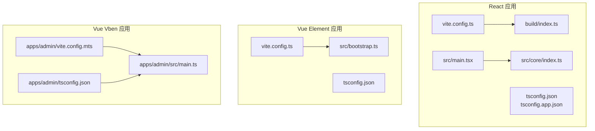
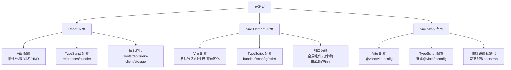
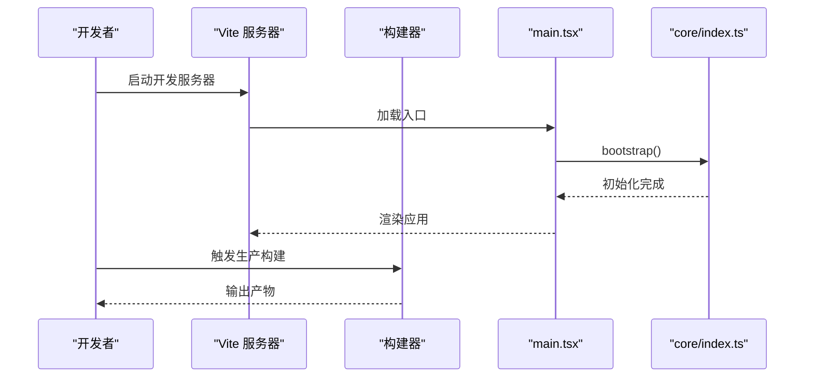
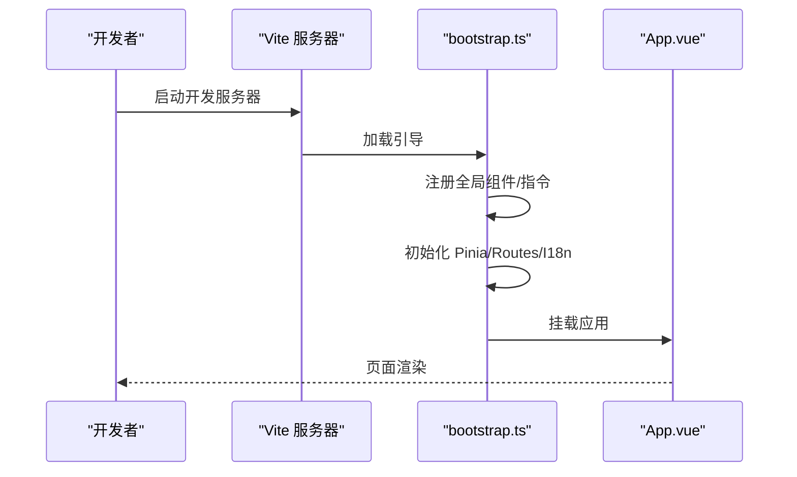
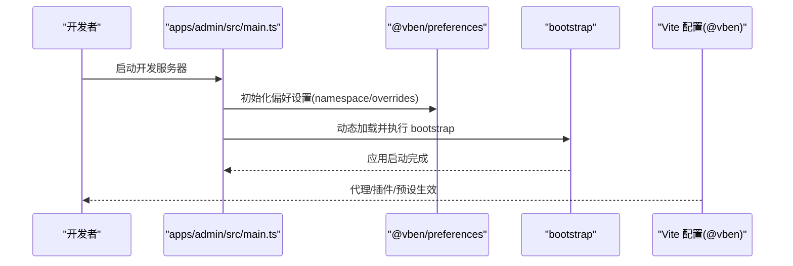
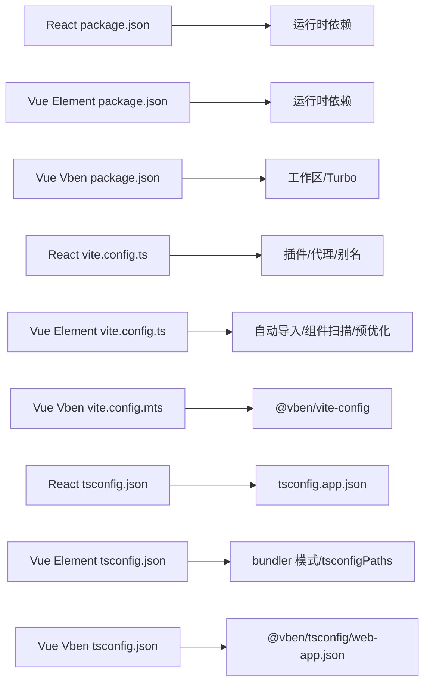

# 前端架构设计

<cite>
**本文引用的文件**
- [frontend/admin/react/vite.config.ts](file://frontend/admin/react/vite.config.ts)
- [frontend/admin/react/package.json](file://frontend/admin/react/package.json)
- [frontend/admin/react/tsconfig.json](file://frontend/admin/react/tsconfig.json)
- [frontend/admin/react/tsconfig.app.json](file://frontend/admin/react/tsconfig.app.json)
- [frontend/admin/react/src/main.tsx](file://frontend/admin/react/src/main.tsx)
- [frontend/admin/react/src/core/index.ts](file://frontend/admin/react/src/core/index.ts)
- [frontend/admin/react/build/index.ts](file://frontend/admin/react/build/index.ts)
- [frontend/admin/vue-element/vite.config.ts](file://frontend/admin/vue-element/vite.config.ts)
- [frontend/admin/vue-element/package.json](file://frontend/admin/vue-element/package.json)
- [frontend/admin/vue-element/tsconfig.json](file://frontend/admin/vue-element/tsconfig.json)
- [frontend/admin/vue-element/src/bootstrap.ts](file://frontend/admin/vue-element/src/bootstrap.ts)
- [frontend/admin/vue-vben/apps/admin/vite.config.mts](file://frontend/admin/vue-vben/apps/admin/vite.config.mts)
- [frontend/admin/vue-vben/apps/admin/src/main.ts](file://frontend/admin/vue-vben/apps/admin/src/main.ts)
- [frontend/admin/vue-vben/apps/admin/tsconfig.json](file://frontend/admin/vue-vben/apps/admin/tsconfig.json)
- [frontend/admin/vue-vben/package.json](file://frontend/admin/vue-vben/package.json)
- [frontend/admin/vue-vben/internal/vite-config/src/index.ts](file://frontend/admin/vue-vben/internal/vite-config/src/index.ts)
</cite>

## 目录
1. [引言](#引言)
2. [项目结构](#项目结构)
3. [核心组件](#核心组件)
4. [架构总览](#架构总览)
5. [详细组件分析](#详细组件分析)
6. [依赖关系分析](#依赖关系分析)
7. [性能考量](#性能考量)
8. [故障排查指南](#故障排查指南)
9. [结论](#结论)
10. [附录](#附录)

## 引言
本文件面向前端架构设计，系统梳理并对比三种前端实现（React、Vue Element、Vue Vben）的整体架构与工程化实践，覆盖项目结构、TypeScript 配置、构建与开发环境、插件生态、代理与热重载、打包优化、以及跨框架的性能与开发体验差异。旨在帮助团队基于业务需求与技术栈偏好做出更合适的选择。

## 项目结构
三种前端框架均采用“多包/多应用”的组织方式，分别位于 frontend/admin 下的不同子目录中，便于独立开发、测试与发布。每个子项目包含独立的包管理、构建配置、TypeScript 配置与入口文件。

- React 实现
  - 构建与开发：Vite 配置集中于 vite.config.ts，通过 build/index.ts 汇聚插件与工具函数
  - 类型与脚本：根 tsconfig.json 通过 references 联合 tsconfig.app.json；应用入口 main.tsx
  - 依赖：React 19、Ant Design 6、React Router、Zustand、React Query 等
- Vue Element 实现
  - 构建与开发：Vite 配置集中于 vite.config.ts，集成自动导入、组件扫描、UnoCSS、Mock 开发服务等
  - 类型与脚本：tsconfig.json 使用 bundler 模式，支持 tsconfigPaths 自动读取别名
  - 依赖：Vue 3、Element Plus、Pinia、Vue Router、Vue I18n、Tiptap、VXE-Table 等
- Vue Vben 实现
  - 构建与开发：基于 @vben/vite-config 的统一配置，应用入口 main.ts 通过异步初始化偏好设置后启动
  - 类型与脚本：tsconfig.json 继承 @vben/tsconfig/web-app.json，路径别名通过 extends 配置
  - 依赖：pnpm 工作区、Turbo 构建、@vben 内部包与工具链

**图表来源**
- [frontend/admin/react/vite.config.ts:1-47](file://frontend/admin/react/vite.config.ts#L1-L47)
- [frontend/admin/react/tsconfig.json:1-8](file://frontend/admin/react/tsconfig.json#L1-L8)
- [frontend/admin/react/tsconfig.app.json:1-30](file://frontend/admin/react/tsconfig.app.json#L1-L30)
- [frontend/admin/react/src/main.tsx:1-46](file://frontend/admin/react/src/main.tsx#L1-L46)
- [frontend/admin/react/src/core/index.ts:1-8](file://frontend/admin/react/src/core/index.ts#L1-L8)
- [frontend/admin/react/build/index.ts:1-7](file://frontend/admin/react/build/index.ts#L1-L7)
- [frontend/admin/vue-element/vite.config.ts:1-240](file://frontend/admin/vue-element/vite.config.ts#L1-L240)
- [frontend/admin/vue-element/tsconfig.json:1-42](file://frontend/admin/vue-element/tsconfig.json#L1-L42)
- [frontend/admin/vue-element/src/bootstrap.ts:1-55](file://frontend/admin/vue-element/src/bootstrap.ts#L1-L55)
- [frontend/admin/vue-vben/apps/admin/vite.config.mts:1-21](file://frontend/admin/vue-vben/apps/admin/vite.config.mts#L1-L21)
- [frontend/admin/vue-vben/apps/admin/tsconfig.json:1-27](file://frontend/admin/vue-vben/apps/admin/tsconfig.json#L1-L27)
- [frontend/admin/vue-vben/apps/admin/src/main.ts:1-32](file://frontend/admin/vue-vben/apps/admin/src/main.ts#L1-L32)

**章节来源**
- [frontend/admin/react/vite.config.ts:1-47](file://frontend/admin/react/vite.config.ts#L1-L47)
- [frontend/admin/vue-element/vite.config.ts:1-240](file://frontend/admin/vue-element/vite.config.ts#L1-L240)
- [frontend/admin/vue-vben/apps/admin/vite.config.mts:1-21](file://frontend/admin/vue-vben/apps/admin/vite.config.mts#L1-L21)

## 核心组件
- React
  - 入口与初始化：main.tsx 负责样式引入、全局初始化与渲染树装配；核心能力通过 src/core/index.ts 暴露
  - 构建与插件：vite.config.ts 通过 build/index.ts 聚合插件与代理配置，支持 Less、别名、HMR、文件监听过滤
  - TypeScript：根 tsconfig.json 通过 references 联合应用与 Node 环境配置，app 配置启用 bundler 模式与 JSX
- Vue Element
  - 入口与初始化：src/bootstrap.ts 统一注册全局组件、指令、路由、国际化与 Pinia，最后挂载
  - 构建与插件：vite.config.ts 集成 Vue 插件、自动导入、组件扫描、UnoCSS、Mock 开发服务、预优化依赖列表
  - TypeScript：tsconfig.json 使用 bundler 模式，开启 tsconfigPaths，严格模式与类型声明覆盖
- Vue Vben
  - 入口与初始化：apps/admin/src/main.ts 在初始化偏好设置后动态加载 bootstrap 并挂载
  - 构建与插件：apps/admin/vite.config.mts 基于 @vben/vite-config，内置代理与服务配置
  - TypeScript：apps/admin/tsconfig.json 继承 @vben/tsconfig/web-app.json，路径别名通过 extends 配置

**章节来源**
- [frontend/admin/react/src/main.tsx:1-46](file://frontend/admin/react/src/main.tsx#L1-L46)
- [frontend/admin/react/src/core/index.ts:1-8](file://frontend/admin/react/src/core/index.ts#L1-L8)
- [frontend/admin/react/build/index.ts:1-7](file://frontend/admin/react/build/index.ts#L1-L7)
- [frontend/admin/vue-element/src/bootstrap.ts:1-55](file://frontend/admin/vue-element/src/bootstrap.ts#L1-L55)
- [frontend/admin/vue-vben/apps/admin/src/main.ts:1-32](file://frontend/admin/vue-vben/apps/admin/src/main.ts#L1-L32)

## 架构总览
三种框架在工程化层面均围绕 Vite 展开，但插件生态与初始化流程存在差异。React 以轻量插件与自研工具为主；Vue Element 强调自动导入与组件扫描；Vue Vben 采用统一配置与工作区管理。

**图表来源**
- [frontend/admin/react/vite.config.ts:1-47](file://frontend/admin/react/vite.config.ts#L1-L47)
- [frontend/admin/react/tsconfig.json:1-8](file://frontend/admin/react/tsconfig.json#L1-L8)
- [frontend/admin/react/tsconfig.app.json:1-30](file://frontend/admin/react/tsconfig.app.json#L1-L30)
- [frontend/admin/vue-element/vite.config.ts:1-240](file://frontend/admin/vue-element/vite.config.ts#L1-L240)
- [frontend/admin/vue-element/tsconfig.json:1-42](file://frontend/admin/vue-element/tsconfig.json#L1-L42)
- [frontend/admin/vue-vben/apps/admin/vite.config.mts:1-21](file://frontend/admin/vue-vben/apps/admin/vite.config.mts#L1-L21)
- [frontend/admin/vue-vben/apps/admin/tsconfig.json:1-27](file://frontend/admin/vue-vben/apps/admin/tsconfig.json#L1-L27)
- [frontend/admin/vue-element/src/bootstrap.ts:1-55](file://frontend/admin/vue-element/src/bootstrap.ts#L1-L55)
- [frontend/admin/vue-vben/apps/admin/src/main.ts:1-32](file://frontend/admin/vue-vben/apps/admin/src/main.ts#L1-L32)

## 详细组件分析

### React 架构与构建
- 入口与初始化
  - main.tsx 负责样式引入、全局初始化与渲染树装配，按需引入 React Query Devtools
  - 核心模块通过 src/core/index.ts 暴露 bootstrap、query-client、storage、REST/SSE 传输层
- 构建与开发
  - vite.config.ts 通过 build/index.ts 聚合插件与代理配置，支持 Less、别名、HMR、文件监听过滤
  - 服务器配置包含端口、跨域代理、HMR 覆盖与忽略目录
- TypeScript
  - 根 tsconfig.json 通过 references 联合 tsconfig.app.json，app 配置启用 bundler 模式与 JSX
- 依赖与脚本
  - package.json 包含 React 19、Ant Design 6、React Router、Zustand、React Query 等

**图表来源**
- [frontend/admin/react/src/main.tsx:1-46](file://frontend/admin/react/src/main.tsx#L1-L46)
- [frontend/admin/react/src/core/index.ts:1-8](file://frontend/admin/react/src/core/index.ts#L1-L8)
- [frontend/admin/react/vite.config.ts:1-47](file://frontend/admin/react/vite.config.ts#L1-L47)

**章节来源**
- [frontend/admin/react/src/main.tsx:1-46](file://frontend/admin/react/src/main.tsx#L1-L46)
- [frontend/admin/react/src/core/index.ts:1-8](file://frontend/admin/react/src/core/index.ts#L1-L8)
- [frontend/admin/react/vite.config.ts:1-47](file://frontend/admin/react/vite.config.ts#L1-L47)
- [frontend/admin/react/tsconfig.json:1-8](file://frontend/admin/react/tsconfig.json#L1-L8)
- [frontend/admin/react/tsconfig.app.json:1-30](file://frontend/admin/react/tsconfig.app.json#L1-L30)
- [frontend/admin/react/package.json:1-82](file://frontend/admin/react/package.json#L1-L82)

### Vue Element 架构与构建
- 入口与初始化
  - src/bootstrap.ts 统一注册全局组件、指令、路由、国际化与 Pinia，最后挂载
- 构建与开发
  - vite.config.ts 集成 Vue 插件、自动导入、组件扫描、UnoCSS、Mock 开发服务、预优化依赖列表
  - 服务器配置包含 host、端口、代理与 tsconfigPaths
- TypeScript
  - tsconfig.json 使用 bundler 模式，开启 tsconfigPaths，严格模式与类型声明覆盖
- 依赖与脚本
  - package.json 包含 Vue 3、Element Plus、Pinia、Vue Router、Vue I18n、Tiptap、VXE-Table 等

**图表来源**
- [frontend/admin/vue-element/src/bootstrap.ts:1-55](file://frontend/admin/vue-element/src/bootstrap.ts#L1-L55)
- [frontend/admin/vue-element/vite.config.ts:1-240](file://frontend/admin/vue-element/vite.config.ts#L1-L240)
- [frontend/admin/vue-element/tsconfig.json:1-42](file://frontend/admin/vue-element/tsconfig.json#L1-L42)

**章节来源**
- [frontend/admin/vue-element/src/bootstrap.ts:1-55](file://frontend/admin/vue-element/src/bootstrap.ts#L1-L55)
- [frontend/admin/vue-element/vite.config.ts:1-240](file://frontend/admin/vue-element/vite.config.ts#L1-L240)
- [frontend/admin/vue-element/tsconfig.json:1-42](file://frontend/admin/vue-element/tsconfig.json#L1-L42)
- [frontend/admin/vue-element/package.json:1-173](file://frontend/admin/vue-element/package.json#L1-L173)

### Vue Vben 架构与构建
- 入口与初始化
  - apps/admin/src/main.ts 在初始化偏好设置后动态加载 bootstrap 并挂载
- 构建与开发
  - apps/admin/vite.config.mts 基于 @vben/vite-config，内置代理与服务配置
  - internal/vite-config/src/index.ts 提供统一导出与环境变量加载工具
- TypeScript
  - apps/admin/tsconfig.json 继承 @vben/tsconfig/web-app.json，路径别名通过 extends 配置
- 依赖与脚本
  - package.json 采用 pnpm 工作区与 Turbo 构建，脚本涵盖开发、构建、测试、类型检查等

**图表来源**
- [frontend/admin/vue-vben/apps/admin/src/main.ts:1-32](file://frontend/admin/vue-vben/apps/admin/src/main.ts#L1-L32)
- [frontend/admin/vue-vben/apps/admin/vite.config.mts:1-21](file://frontend/admin/vue-vben/apps/admin/vite.config.mts#L1-L21)
- [frontend/admin/vue-vben/internal/vite-config/src/index.ts:1-5](file://frontend/admin/vue-vben/internal/vite-config/src/index.ts#L1-L5)
- [frontend/admin/vue-vben/apps/admin/tsconfig.json:1-27](file://frontend/admin/vue-vben/apps/admin/tsconfig.json#L1-L27)

**章节来源**
- [frontend/admin/vue-vben/apps/admin/src/main.ts:1-32](file://frontend/admin/vue-vben/apps/admin/src/main.ts#L1-L32)
- [frontend/admin/vue-vben/apps/admin/vite.config.mts:1-21](file://frontend/admin/vue-vben/apps/admin/vite.config.mts#L1-L21)
- [frontend/admin/vue-vben/internal/vite-config/src/index.ts:1-5](file://frontend/admin/vue-vben/internal/vite-config/src/index.ts#L1-L5)
- [frontend/admin/vue-vben/apps/admin/tsconfig.json:1-27](file://frontend/admin/vue-vben/apps/admin/tsconfig.json#L1-L27)
- [frontend/admin/vue-vben/package.json:1-118](file://frontend/admin/vue-vben/package.json#L1-L118)

## 依赖关系分析
- React
  - 依赖集中在前端运行时与 UI 生态，构建由 Vite 与 React 插件驱动
  - TypeScript 通过 references 解耦 app 与 node 配置，提升维护性
- Vue Element
  - 依赖丰富，涵盖编辑器、表格、图标、国际化、状态管理等，构建配置复杂度较高
  - 自动导入与组件扫描显著降低样板代码
- Vue Vben
  - 采用 pnpm 工作区与 Turbo，脚本体系完善，适合大型多包项目
  - 偏好设置与统一配置抽象提升了可扩展性

**图表来源**
- [frontend/admin/react/package.json:1-82](file://frontend/admin/react/package.json#L1-L82)
- [frontend/admin/vue-element/package.json:1-173](file://frontend/admin/vue-element/package.json#L1-L173)
- [frontend/admin/vue-vben/package.json:1-118](file://frontend/admin/vue-vben/package.json#L1-L118)
- [frontend/admin/react/vite.config.ts:1-47](file://frontend/admin/react/vite.config.ts#L1-L47)
- [frontend/admin/vue-element/vite.config.ts:1-240](file://frontend/admin/vue-element/vite.config.ts#L1-L240)
- [frontend/admin/vue-vben/apps/admin/vite.config.mts:1-21](file://frontend/admin/vue-vben/apps/admin/vite.config.mts#L1-L21)
- [frontend/admin/react/tsconfig.json:1-8](file://frontend/admin/react/tsconfig.json#L1-L8)
- [frontend/admin/react/tsconfig.app.json:1-30](file://frontend/admin/react/tsconfig.app.json#L1-L30)
- [frontend/admin/vue-element/tsconfig.json:1-42](file://frontend/admin/vue-element/tsconfig.json#L1-L42)
- [frontend/admin/vue-vben/apps/admin/tsconfig.json:1-27](file://frontend/admin/vue-vben/apps/admin/tsconfig.json#L1-L27)

**章节来源**
- [frontend/admin/react/package.json:1-82](file://frontend/admin/react/package.json#L1-L82)
- [frontend/admin/vue-element/package.json:1-173](file://frontend/admin/vue-element/package.json#L1-L173)
- [frontend/admin/vue-vben/package.json:1-118](file://frontend/admin/vue-vben/package.json#L1-L118)

## 性能考量
- 构建优化
  - React/Vue Element：通过预优化依赖列表与 Rollup 输出命名策略减少首屏体积与拆分成本
  - Vue Vben：采用 Turbo 构建与工作区缓存，提升增量构建效率
- 开发体验
  - React/Vue Element：HMR 与文件监听过滤减少切换卡顿；Vue Element 支持 Mock 开发服务
  - Vue Vben：统一配置与偏好设置初始化，减少重复配置
- 体积控制
  - Vue Element：terser 压缩移除 console/debugger；按文件类型分类命名资源
  - Vue Vben：工作区与依赖去重策略有助于减小最终包体

**章节来源**
- [frontend/admin/vue-element/vite.config.ts:192-234](file://frontend/admin/vue-element/vite.config.ts#L192-L234)
- [frontend/admin/vue-vben/package.json:1-118](file://frontend/admin/vue-vben/package.json#L1-L118)

## 故障排查指南
- 代理与跨域
  - React：通过 createProxy 生成代理规则，确保后端接口域名与路径正确
  - Vue Element：基于环境变量的代理规则，注意 rewrite 与 changeOrigin 配置
  - Vue Vben：基于 @vben/vite-config 的代理配置，确认 target 与 ws 设置
- 类型检查与模块解析
  - React：确保 tsconfig.app.json 的 bundler 模式与 JSX 配置一致
  - Vue Element：开启 tsconfigPaths，避免别名解析失败
  - Vue Vben：继承 @vben/tsconfig/web-app.json，校验路径别名映射
- 开发服务器问题
  - 文件监听：忽略 node_modules/.git/dist，降低 CPU 占用
  - HMR：overlay 开启便于快速定位错误

**章节来源**
- [frontend/admin/react/vite.config.ts:29-43](file://frontend/admin/react/vite.config.ts#L29-L43)
- [frontend/admin/vue-element/vite.config.ts:43-54](file://frontend/admin/vue-element/vite.config.ts#L43-L54)
- [frontend/admin/vue-vben/apps/admin/vite.config.mts:6-18](file://frontend/admin/vue-vben/apps/admin/vite.config.mts#L6-L18)
- [frontend/admin/react/tsconfig.app.json:14-26](file://frontend/admin/react/tsconfig.app.json#L14-L26)
- [frontend/admin/vue-element/tsconfig.json:3-28](file://frontend/admin/vue-element/tsconfig.json#L3-L28)
- [frontend/admin/vue-vben/apps/admin/tsconfig.json:4-13](file://frontend/admin/vue-vben/apps/admin/tsconfig.json#L4-L13)

## 结论
- React：适合追求简洁与可控的团队，Vite 插件与自研工具组合灵活，适合中小型到中大型项目
- Vue Element：生态丰富，自动导入与组件扫描显著提升开发效率，适合功能密集型后台管理
- Vue Vben：工作区与统一配置抽象强，适合大型多包协作与标准化工程化流程

## 附录
- TypeScript 配置要点
  - React：references + bundler 模式 + JSX
  - Vue Element：bundler 模式 + tsconfigPaths + 严格模式
  - Vue Vben：继承 @vben/tsconfig/web-app.json + 路径别名
- 构建与开发脚本
  - React：dev/build/preview/lint
  - Vue Element：dev/build/preview/type-check/lint
  - Vue Vben：dev/build/test/typecheck/preview/format/lint

**章节来源**
- [frontend/admin/react/package.json:7-11](file://frontend/admin/react/package.json#L7-L11)
- [frontend/admin/vue-element/package.json:7-17](file://frontend/admin/vue-element/package.json#L7-L17)
- [frontend/admin/vue-vben/package.json:7-33](file://frontend/admin/vue-vben/package.json#L7-L33)