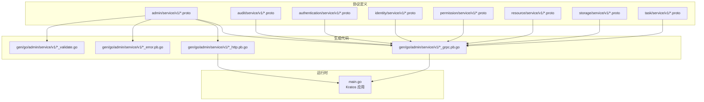
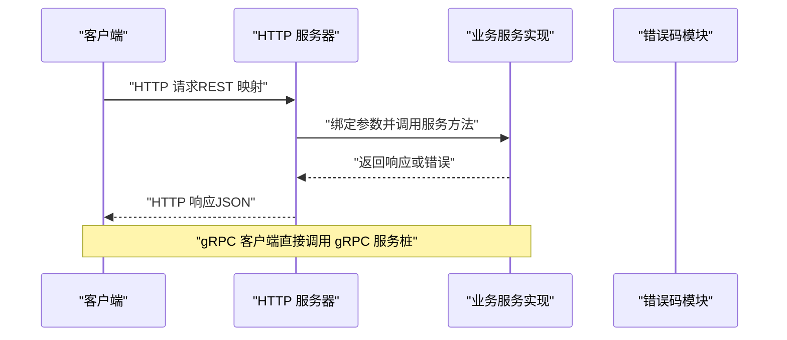
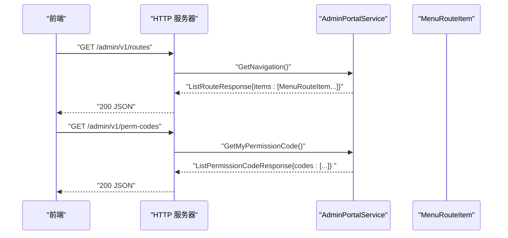
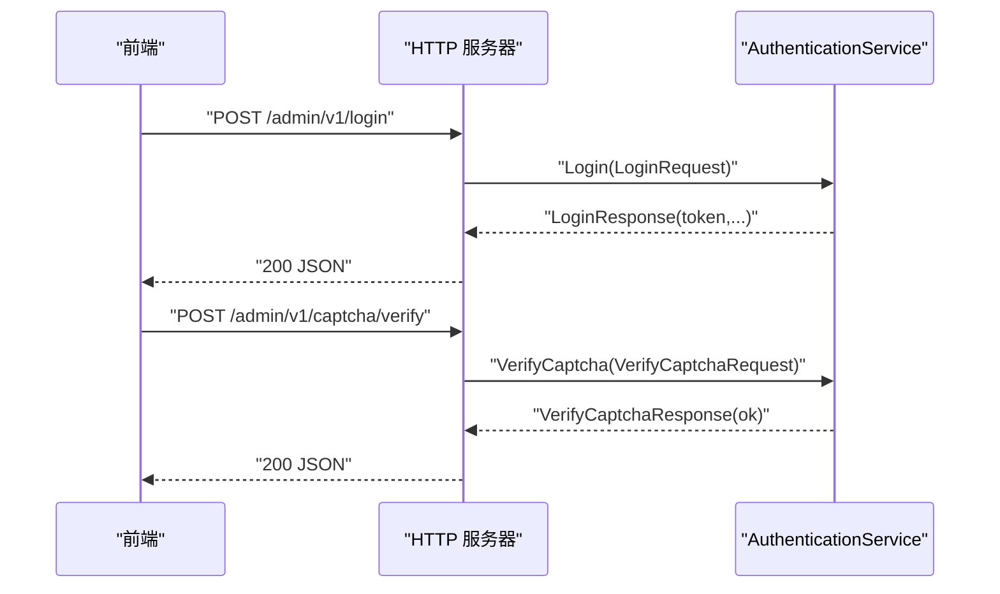
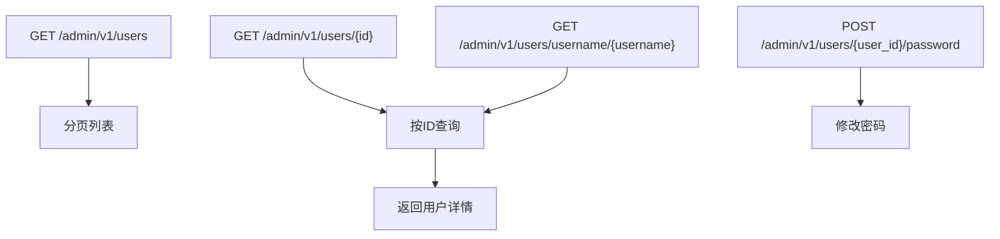
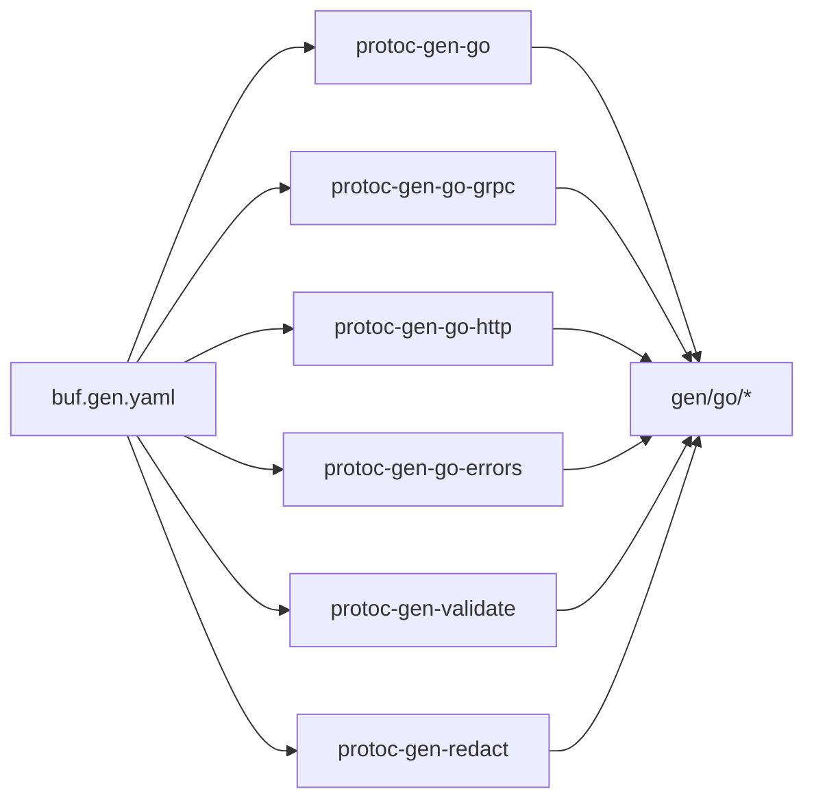

# API 接口设计

<cite>
**本文引用的文件**
- [i_admin_portal.proto](file://backend/api/protos/admin/service/v1/i_admin_portal.proto)
- [i_api.proto](file://backend/api/protos/admin/service/v1/i_api.proto)
- [i_authentication.proto](file://backend/api/protos/admin/service/v1/i_authentication.proto)
- [i_user.proto](file://backend/api/protos/admin/service/v1/i_user.proto)
- [admin_error.proto](file://backend/api/protos/admin/service/v1/admin_error.proto)
- [i_api_audit_log.proto](file://backend/api/protos/admin/service/v1/i_api_audit_log.proto)
- [i_permission.proto](file://backend/api/protos/admin/service/v1/i_permission.proto)
- [i_role.proto](file://backend/api/protos/admin/service/v1/i_role.proto)
- [buf.gen.yaml](file://backend/api/buf.gen.yaml)
- [buf.yaml](file://backend/api/buf.yaml)
- [i_admin_portal_grpc.pb.go](file://backend/api/gen/go/admin/service/v1/i_admin_portal_grpc.pb.go)
- [i_admin_portal_http.pb.go](file://backend/api/gen/go/admin/service/v1/i_admin_portal_http.pb.go)
- [main.go](file://backend/app/admin/service/cmd/server/main.go)
</cite>

## 目录
1. [引言](#引言)
2. [项目结构](#项目结构)
3. [核心组件](#核心组件)
4. [架构总览](#架构总览)
5. [详细组件分析](#详细组件分析)
6. [依赖关系分析](#依赖关系分析)
7. [性能考量](#性能考量)
8. [故障排查指南](#故障排查指南)
9. [结论](#结论)
10. [附录](#附录)

## 引言
本文件系统化梳理 GoWind Admin 的 API 接口设计，围绕 Protobuf 协议、gRPC 与 HTTP/JSON 两种传输形态、错误码体系、版本与兼容性策略、以及最佳实践展开，帮助前后端开发者快速理解并正确对接接口。

## 项目结构
- 接口协议层：位于 backend/api/protos 下，按业务域划分（如 admin、audit、authentication、identity、permission、resource、storage、task），每个域内以 v1 版本号组织。
- 生成代码层：位于 backend/api/gen/go 下，按域/版本生成 Go 语言客户端、服务端、HTTP 绑定、错误与校验代码。
- 构建与生成：通过 buf.yaml 与 buf.gen.yaml 管理 Lint/Breaking 检查与生成插件，确保一致性与可维护性。
- 运行时入口：后端服务启动入口位于 backend/app/admin/service/cmd/server/main.go，基于 Kratos 框架承载 HTTP、gRPC、异步任务与 SSE 等能力。



图表来源
- [i_admin_portal.proto:1-48](file://backend/api/protos/admin/service/v1/i_admin_portal.proto#L1-L48)
- [i_admin_portal_grpc.pb.go:1-200](file://backend/api/gen/go/admin/service/v1/i_admin_portal_grpc.pb.go#L1-L200)
- [i_admin_portal_http.pb.go:1-158](file://backend/api/gen/go/admin/service/v1/i_admin_portal_http.pb.go#L1-L158)
- [main.go:1-76](file://backend/app/admin/service/cmd/server/main.go#L1-L76)

章节来源
- [buf.yaml:1-26](file://backend/api/buf.yaml#L1-L26)
- [buf.gen.yaml:1-96](file://backend/api/buf.gen.yaml#L1-L96)
- [main.go:1-76](file://backend/app/admin/service/cmd/server/main.go#L1-L76)

## 核心组件
- 服务与消息
  - AdminPortalService：后台门户初始化数据与导航查询。
  - ApiService：API 资源的增删改查与同步。
  - AuthenticationService：登录、登出、注册、刷新令牌、验证码生成与校验。
  - UserService：用户列表、详情、创建、更新、删除、存在性检查、修改密码。
  - ApiAuditLogService：API 审计日志的查询。
  - PermissionService：权限点的增删改查与同步。
  - RoleService：角色的增删改查。
- 错误码体系
  - AdminErrorReason：统一映射 HTTP 状态码与语义化的错误原因枚举，便于前后端一致化处理。
- 生成产物
  - gRPC 服务桩：AdminPortalService_Grpc.pb.go
  - HTTP 绑定：AdminPortalService_Http.pb.go
  - 错误与校验：AdminError.pb.go、Validate 代码

章节来源
- [i_admin_portal.proto:1-48](file://backend/api/protos/admin/service/v1/i_admin_portal.proto#L1-L48)
- [i_api.proto:1-66](file://backend/api/protos/admin/service/v1/i_api.proto#L1-L66)
- [i_authentication.proto:1-75](file://backend/api/protos/admin/service/v1/i_authentication.proto#L1-L75)
- [i_user.proto:1-75](file://backend/api/protos/admin/service/v1/i_user.proto#L1-L75)
- [i_api_audit_log.proto:1-27](file://backend/api/protos/admin/service/v1/i_api_audit_log.proto#L1-L27)
- [i_permission.proto:1-60](file://backend/api/protos/admin/service/v1/i_permission.proto#L1-L60)
- [i_role.proto:1-51](file://backend/api/protos/admin/service/v1/i_role.proto#L1-L51)
- [admin_error.proto:1-152](file://backend/api/protos/admin/service/v1/admin_error.proto#L1-L152)
- [i_admin_portal_grpc.pb.go:1-200](file://backend/api/gen/go/admin/service/v1/i_admin_portal_grpc.pb.go#L1-L200)
- [i_admin_portal_http.pb.go:1-158](file://backend/api/gen/go/admin/service/v1/i_admin_portal_http.pb.go#L1-L158)

## 架构总览
- 协议驱动：所有服务均以 Protobuf 定义，结合 google.api.http 注解自动生成 REST 映射。
- 多传输形态：
  - gRPC：高性能、强类型、二进制序列化，适合内部微服务间调用。
  - HTTP/JSON：基于注解的 RESTful 映射，便于浏览器、移动端与第三方集成。
- 生成链路：buf 作为构建与校验工具，生成 Go 语言的 gRPC、HTTP、错误与校验代码。
- 运行时：Kratos 提供 HTTP、gRPC、异步任务与 SSE 等能力，统一注入到应用中。



图表来源
- [i_admin_portal_http.pb.go:36-98](file://backend/api/gen/go/admin/service/v1/i_admin_portal_http.pb.go#L36-L98)
- [i_admin_portal_grpc.pb.go:121-184](file://backend/api/gen/go/admin/service/v1/i_admin_portal_grpc.pb.go#L121-L184)

章节来源
- [buf.gen.yaml:56-96](file://backend/api/buf.gen.yaml#L56-L96)
- [main.go:46-75](file://backend/app/admin/service/cmd/server/main.go#L46-L75)

## 详细组件分析

### AdminPortalService（后台门户）
- 服务职责
  - 获取导航路由表、权限码列表、初始上下文（菜单树+权限码）。
- HTTP 映射
  - GET /admin/v1/routes
  - GET /admin/v1/perm-codes
  - GET /admin/v1/initial-context
- gRPC 方法
  - GetNavigation、GetMyPermissionCode、GetInitialContext
- 数据模型
  - ListRouteResponse、ListPermissionCodeResponse、InitialContextResponse



图表来源
- [i_admin_portal.proto:11-32](file://backend/api/protos/admin/service/v1/i_admin_portal.proto#L11-L32)
- [i_admin_portal_http.pb.go:36-98](file://backend/api/gen/go/admin/service/v1/i_admin_portal_http.pb.go#L36-L98)
- [i_admin_portal_grpc.pb.go:121-184](file://backend/api/gen/go/admin/service/v1/i_admin_portal_grpc.pb.go#L121-L184)

章节来源
- [i_admin_portal.proto:1-48](file://backend/api/protos/admin/service/v1/i_admin_portal.proto#L1-L48)
- [i_admin_portal_http.pb.go:1-158](file://backend/api/gen/go/admin/service/v1/i_admin_portal_http.pb.go#L1-L158)
- [i_admin_portal_grpc.pb.go:1-200](file://backend/api/gen/go/admin/service/v1/i_admin_portal_grpc.pb.go#L1-L200)

### ApiService（API 资源管理）
- 功能点
  - 分页查询、详情查询、创建、更新、删除、同步、步行路由数据查询。
- HTTP 映射
  - GET /admin/v1/apis
  - GET /admin/v1/apis/{id}
  - POST /admin/v1/apis
  - PUT /admin/v1/apis/{id}
  - DELETE /admin/v1/apis/{id}
  - POST /admin/v1/apis/sync
  - GET /admin/v1/apis/walk-route

```mermaid
flowchart TD
Start(["请求进入"]) --> Route{"HTTP 方法"}
Route --> |GET /admin/v1/apis| List["分页查询"]
Route --> |GET /admin/v1/apis/{id}| Get["详情查询"]
Route --> |POST /admin/v1/apis| Create["创建"]
Route --> |PUT /admin/v1/apis/{id}| Update["更新"]
Route --> |DELETE /admin/v1/apis/{id}| Delete["删除"]
Route --> |POST /admin/v1/apis/sync| Sync["同步"]
Route --> |GET /admin/v1/apis/walk-route| Walk["步行路由数据"]
List --> End(["返回结果"])
Get --> End
Create --> End
Update --> End
Delete --> End
Sync --> End
Walk --> End
```

图表来源
- [i_api.proto:13-65](file://backend/api/protos/admin/service/v1/i_api.proto#L13-L65)

章节来源
- [i_api.proto:1-66](file://backend/api/protos/admin/service/v1/i_api.proto#L1-L66)

### AuthenticationService（认证）
- 功能点
  - 登录、登出、注册、刷新令牌、验证码生成与校验。
- HTTP 映射
  - POST /admin/v1/login
  - POST /admin/v1/logout
  - POST /admin/v1/register
  - POST /admin/v1/refresh-token
  - GET /admin/v1/captcha
  - POST /admin/v1/captcha/verify



图表来源
- [i_authentication.proto:12-74](file://backend/api/protos/admin/service/v1/i_authentication.proto#L12-L74)
- [i_admin_portal_http.pb.go:36-98](file://backend/api/gen/go/admin/service/v1/i_admin_portal_http.pb.go#L36-L98)

章节来源
- [i_authentication.proto:1-75](file://backend/api/protos/admin/service/v1/i_authentication.proto#L1-L75)

### UserService（用户管理）
- 功能点
  - 列表、详情（支持按 id 或 username）、创建、更新、删除（支持按 id 或 username）、存在性检查、修改密码。
- HTTP 映射
  - GET /admin/v1/users
  - GET /admin/v1/users/{id}
  - GET /admin/v1/users/username/{username}
  - POST /admin/v1/users
  - PUT /admin/v1/users/{id}
  - DELETE /admin/v1/users/{id}
  - DELETE /admin/v1/users/username/{username}
  - GET /admin/v1/users:exists
  - POST /admin/v1/users/{user_id}/password



图表来源
- [i_user.proto:14-74](file://backend/api/protos/admin/service/v1/i_user.proto#L14-L74)

章节来源
- [i_user.proto:1-75](file://backend/api/protos/admin/service/v1/i_user.proto#L1-L75)

### ApiAuditLogService（API 审计日志）
- 功能点
  - 列表与详情查询。
- HTTP 映射
  - GET /admin/v1/api-audit-logs
  - GET /admin/v1/api-audit-logs/{id}

章节来源
- [i_api_audit_log.proto:1-27](file://backend/api/protos/admin/service/v1/i_api_audit_log.proto#L1-L27)

### PermissionService（权限点管理）
- 功能点
  - 列表、详情、创建、更新、删除、同步。
- HTTP 映射
  - GET /admin/v1/permissions
  - GET /admin/v1/permissions/{id}
  - POST /admin/v1/permissions
  - PUT /admin/v1/permissions/{id}
  - DELETE /admin/v1/permissions/{id}
  - POST /admin/v1/permissions/sync:perms

章节来源
- [i_permission.proto:1-60](file://backend/api/protos/admin/service/v1/i_permission.proto#L1-L60)

### RoleService（角色管理）
- 功能点
  - 列表、详情、创建、更新、删除。
- HTTP 映射
  - GET /admin/v1/roles
  - GET /admin/v1/roles/{id}
  - POST /admin/v1/roles
  - PUT /admin/v1/roles/{id}
  - DELETE /admin/v1/roles/{id}

章节来源
- [i_role.proto:1-51](file://backend/api/protos/admin/service/v1/i_role.proto#L1-L51)

### 错误码与向后兼容
- 错误码定义
  - AdminErrorReason 将错误原因与 HTTP 状态码一一映射，覆盖常见 4xx/5xx 场景，便于统一处理与前端提示。
- 兼容性策略
  - 使用 buf breaking 与 lint（FILE 级别）保障演进安全；新增枚举值需谨慎，避免破坏已有映射。
  - 通过 google.api.http 注解与 Kratos HTTP 适配器，REST 与 gRPC 同源同义，降低维护成本。

章节来源
- [admin_error.proto:1-152](file://backend/api/protos/admin/service/v1/admin_error.proto#L1-L152)
- [buf.yaml:8-21](file://backend/api/buf.yaml#L8-L21)

## 依赖关系分析
- 生成插件
  - go、go-grpc、go-http、go-errors、validate、redact 插件按需启用，统一输出到 gen/go。
- 包路径与 go_package
  - 通过 go_package_prefix 与 per-directory 覆盖，确保生成包名与导入路径稳定。
- 运行时依赖
  - Kratos 提供 HTTP、gRPC 服务器与中间件生态；生成的 HTTP 适配器与 gRPC 服务桩无缝接入。



图表来源
- [buf.gen.yaml:56-96](file://backend/api/buf.gen.yaml#L56-L96)

章节来源
- [buf.gen.yaml:1-96](file://backend/api/buf.gen.yaml#L1-L96)

## 性能考量
- 传输选择
  - 内部服务间优先使用 gRPC，减少序列化开销与提升吞吐。
  - 对外或跨语言集成使用 HTTP/JSON，借助注解自动映射，降低联调成本。
- 生成与编译
  - 使用 buf 管理依赖与生成，避免重复构建与不一致问题。
- 中间件与可观测性
  - Kratos 提供日志、指标、追踪等中间件，建议在生成的服务桩上统一挂载。

## 故障排查指南
- 常见问题
  - HTTP 404：确认路径是否符合 google.api.http 注解；核对生成的 HTTP 绑定注册位置。
  - gRPC 未实现：检查服务实现是否实现了对应接口，确保 Register*Server 正确注册。
  - 参数绑定失败：核对请求体字段名与 body:* 配置，或路径参数占位符是否匹配。
  - 错误码不一致：检查 AdminErrorReason 映射，确保前后端一致。
- 定位手段
  - 查看生成的 HTTP 适配器与 gRPC 服务桩，确认方法签名与路由注册。
  - 在 Kratos 中开启调试日志，观察中间件链路与错误传播。

章节来源
- [i_admin_portal_http.pb.go:36-98](file://backend/api/gen/go/admin/service/v1/i_admin_portal_http.pb.go#L36-L98)
- [i_admin_portal_grpc.pb.go:121-184](file://backend/api/gen/go/admin/service/v1/i_admin_portal_grpc.pb.go#L121-L184)
- [admin_error.proto:1-152](file://backend/api/protos/admin/service/v1/admin_error.proto#L1-L152)

## 结论
本设计以 Protobuf 为核心，结合 gRPC 与 HTTP/JSON 两种传输形态，形成高内聚、低耦合、易演进的 API 体系。通过统一错误码与生成链路，显著降低前后端协作成本；借助 Kratos 运行时与 buf 工具链，保障可维护性与稳定性。

## 附录

### API 设计最佳实践
- 命名规范
  - 服务名采用名词短语，动词在方法层面体现；消息名使用名词或形容词，保持简洁明确。
- 参数与路径
  - 使用 google.api.http 注解时，路径参数与请求体字段需严格匹配；必要时使用 additional_bindings 支持多查询形式。
- 错误处理
  - 使用 AdminErrorReason 统一错误语义，避免自定义错误码；在 HTTP 层正确设置状态码与错误体。
- 版本与兼容
  - 采用目录级版本（如 v1），新增字段使用可选语义，避免破坏现有客户端；通过 buf breaking 与 lint 严格把关。
- 生成与集成
  - 通过 buf.gen.yaml 统一生成策略；在 Kratos 中注册 HTTP 与 gRPC 服务桩，确保中间件与拦截器生效。

### Protobuf 示例与生成使用指引
- 示例文件
  - AdminPortalService：[i_admin_portal.proto:1-48](file://backend/api/protos/admin/service/v1/i_admin_portal.proto#L1-L48)
  - ApiService：[i_api.proto:1-66](file://backend/api/protos/admin/service/v1/i_api.proto#L1-L66)
  - AuthenticationService：[i_authentication.proto:1-75](file://backend/api/protos/admin/service/v1/i_authentication.proto#L1-L75)
  - UserService：[i_user.proto:1-75](file://backend/api/protos/admin/service/v1/i_user.proto#L1-L75)
  - ApiAuditLogService：[i_api_audit_log.proto:1-27](file://backend/api/protos/admin/service/v1/i_api_audit_log.proto#L1-L27)
  - PermissionService：[i_permission.proto:1-60](file://backend/api/protos/admin/service/v1/i_permission.proto#L1-L60)
  - RoleService：[i_role.proto:1-51](file://backend/api/protos/admin/service/v1/i_role.proto#L1-L51)
- 生成代码
  - gRPC 服务桩：[i_admin_portal_grpc.pb.go:1-200](file://backend/api/gen/go/admin/service/v1/i_admin_portal_grpc.pb.go#L1-L200)
  - HTTP 适配器：[i_admin_portal_http.pb.go:1-158](file://backend/api/gen/go/admin/service/v1/i_admin_portal_http.pb.go#L1-L158)
  - 错误码：[admin_error.proto:1-152](file://backend/api/protos/admin/service/v1/admin_error.proto#L1-L152)
- 运行时入口
  - Kratos 应用启动：[main.go:1-76](file://backend/app/admin/service/cmd/server/main.go#L1-L76)