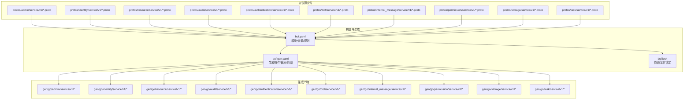
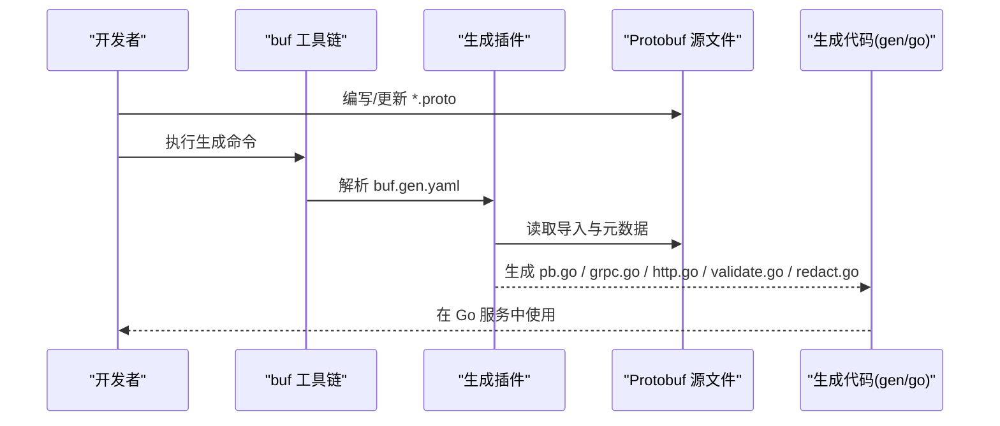
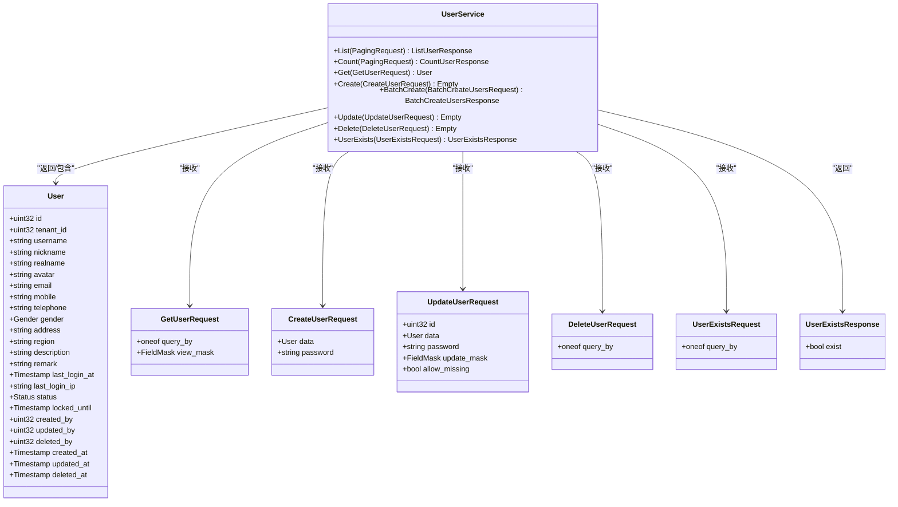
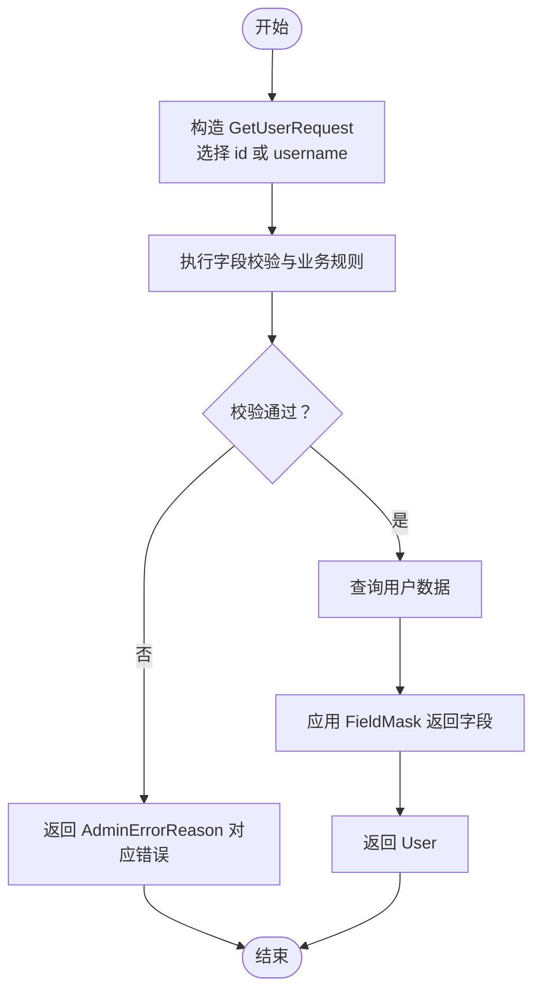
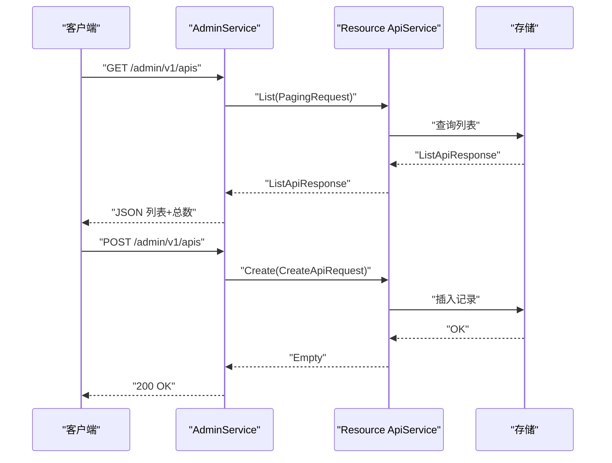
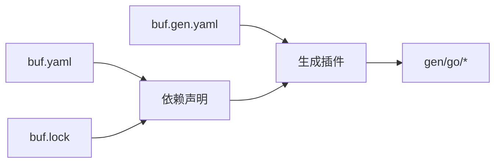

# 协议定义与设计

<cite>
**本文引用的文件**
- [backend/api/buf.yaml](file://backend/api/buf.yaml)
- [backend/api/buf.gen.yaml](file://backend/api/buf.gen.yaml)
- [backend/api/buf.lock](file://backend/api/buf.lock)
- [backend/api/protos/admin/service/v1/i_admin_portal.proto](file://backend/api/protos/admin/service/v1/i_admin_portal.proto)
- [backend/api/protos/admin/service/v1/admin_error.proto](file://backend/api/protos/admin/service/v1/admin_error.proto)
- [backend/api/protos/admin/service/v1/i_api.proto](file://backend/api/protos/admin/service/v1/i_api.proto)
- [backend/api/protos/admin/service/v1/i_user.proto](file://backend/api/protos/admin/service/v1/i_user.proto)
- [backend/api/protos/identity/service/v1/user.proto](file://backend/api/protos/identity/service/v1/user.proto)
- [backend/api/protos/resource/service/v1/api.proto](file://backend/api/protos/resource/service/v1/api.proto)
- [backend/api/protos/resource/service/v1/menu.proto](file://backend/api/protos/resource/service/v1/menu.proto)
</cite>

## 目录
1. [引言](#引言)
2. [项目结构](#项目结构)
3. [核心组件](#核心组件)
4. [架构总览](#架构总览)
5. [组件详解](#组件详解)
6. [依赖关系分析](#依赖关系分析)
7. [性能考量](#性能考量)
8. [故障排查指南](#故障排查指南)
9. [结论](#结论)
10. [附录](#附录)

## 引言
本文件面向 GoWind Admin 的后端协议设计与实现，系统化阐述基于 Protobuf 的接口定义范式、服务接口声明、消息类型与字段约束规则，并结合 buf.build 工具链（模块配置、代码生成、lint 规则、版本锁定与兼容性策略），给出面向工程落地的协议设计最佳实践与常见陷阱提示。读者无需深入 Go 或 gRPC 实现细节，即可理解并正确使用 Protobuf 设计稳定、可演进的 API。

## 项目结构
后端协议以 Protobuf 源文件为核心，按领域分层组织于 protos 目录；配套的 buf 构建配置统一管理 lint、breaking、生成插件与依赖锁定。生成代码位于 gen/go 下，按服务命名空间分层组织，便于在 Go 侧直接消费。

图表来源
- [backend/api/buf.yaml:1-26](file://backend/api/buf.yaml#L1-L26)
- [backend/api/buf.gen.yaml:1-96](file://backend/api/buf.gen.yaml#L1-L96)

章节来源
- [backend/api/buf.yaml:1-26](file://backend/api/buf.yaml#L1-L26)
- [backend/api/buf.gen.yaml:1-96](file://backend/api/buf.gen.yaml#L1-L96)
- [backend/api/buf.lock:1-22](file://backend/api/buf.lock#L1-L22)

## 核心组件
- 协议源文件：按领域划分的服务与消息定义，统一采用 proto3 语法，明确导入依赖与 OpenAPI 元数据标注。
- 构建配置：buf.yaml 定义模块、lint/breaking 规则与依赖；buf.gen.yaml 定义生成插件、输出路径与 go_package 前缀；buf.lock 锁定依赖版本。
- 生成代码：Go 侧通过生成的 pb、grpc、http、validator、redact 等代码消费协议，确保类型安全与一致性。

章节来源
- [backend/api/buf.yaml:1-26](file://backend/api/buf.yaml#L1-L26)
- [backend/api/buf.gen.yaml:1-96](file://backend/api/buf.gen.yaml#L1-L96)
- [backend/api/buf.lock:1-22](file://backend/api/buf.lock#L1-L22)

## 架构总览
下图展示了从 Protobuf 源到 Go 生成代码的关键流程，以及与 HTTP 注解、验证与敏感信息脱敏的集成点。

图表来源
- [backend/api/buf.gen.yaml:56-96](file://backend/api/buf.gen.yaml#L56-L96)
- [backend/api/buf.yaml:1-26](file://backend/api/buf.yaml#L1-L26)

## 组件详解

### 1) 协议设计范式与字段约束
- 语义化命名：消息与字段使用清晰的业务含义命名，配合 OpenAPI 属性标注提升文档质量。
- 字段行为：通过字段行为标注明确必填、只读等约束，辅助前端与服务端一致理解。
- 可空与可选：优先使用可选字段表达可缺省值，避免歧义。
- oneof 使用：对互斥查询条件进行封装，减少错误组合。
- 时间戳：统一使用标准时间戳类型，避免本地化与解析问题。
- 字段掩码：通过 FieldMask 控制返回字段集合，降低传输开销。
- 分页：引入分页请求模型，统一列表查询参数。

章节来源
- [backend/api/protos/identity/service/v1/user.proto:1-450](file://backend/api/protos/identity/service/v1/user.proto#L1-L450)
- [backend/api/protos/resource/service/v1/api.proto:1-169](file://backend/api/protos/resource/service/v1/api.proto#L1-L169)

### 2) 服务接口声明与 HTTP 映射
- gRPC 服务：每个服务定义一组 RPC 方法，方法签名明确请求/响应消息。
- HTTP 映射：通过 Google API 注解将 gRPC 映射为 REST 风格的 HTTP 接口，支持 GET/POST/PUT/DELETE 与路径参数、body 绑定。
- 多绑定：支持主绑定与附加绑定，满足同一资源多种查询方式。
- 无请求体场景：使用空消息作为请求体，保持接口一致性。

章节来源
- [backend/api/protos/admin/service/v1/i_admin_portal.proto:1-48](file://backend/api/protos/admin/service/v1/i_admin_portal.proto#L1-L48)
- [backend/api/protos/admin/service/v1/i_api.proto:1-66](file://backend/api/protos/admin/service/v1/i_api.proto#L1-L66)
- [backend/api/protos/admin/service/v1/i_user.proto:1-75](file://backend/api/protos/admin/service/v1/i_user.proto#L1-L75)

### 3) 错误处理与状态码
- 错误枚举：为各服务域定义专用错误原因枚举，统一映射 HTTP 状态码，便于客户端与网关一致处理。
- 默认码：为枚举设置默认错误码，避免遗漏。
- 语义化分类：按 4xx/5xx 区分客户端错误与服务端错误，细化子类。

章节来源
- [backend/api/protos/admin/service/v1/admin_error.proto:1-152](file://backend/api/protos/admin/service/v1/admin_error.proto#L1-L152)

### 4) 敏感信息脱敏
- 方法级脱敏：对涉及敏感字段的方法启用内部方法脱敏标记，确保日志与响应中敏感信息被遮蔽。
- 字段级脱敏：对邮箱等字段配置脱敏策略，防止泄露。

章节来源
- [backend/api/protos/admin/service/v1/i_user.proto:17-25](file://backend/api/protos/admin/service/v1/i_user.proto#L17-L25)
- [backend/api/protos/identity/service/v1/user.proto:143-147](file://backend/api/protos/identity/service/v1/user.proto#L143-L147)

### 5) 数据校验与验证
- 生成验证代码：通过验证插件生成消息级校验逻辑，保障入参合法性。
- 与 HTTP 结合：在生成的 HTTP 适配层中调用验证逻辑，提前拦截非法请求。

章节来源
- [backend/api/buf.gen.yaml:82-89](file://backend/api/buf.gen.yaml#L82-L89)

### 6) 实体模型示例
- 用户模型：包含基础信息、组织/岗位/角色关联、状态与时间戳等字段，提供批量创建、密码修改、联系方式绑定与验证等能力。
- API 资源模型：涵盖接口路径、方法、模块、作用域与状态，支持列表、详情、创建、更新、删除与统计。

章节来源
- [backend/api/protos/identity/service/v1/user.proto:41-211](file://backend/api/protos/identity/service/v1/user.proto#L41-L211)
- [backend/api/protos/resource/service/v1/api.proto:42-106](file://backend/api/protos/resource/service/v1/api.proto#L42-L106)

### 7) 请求/响应格式与路由
- 列表与详情：统一使用 PagingRequest 与 FieldMask，支持分页与字段裁剪。
- 路由表：后台门户服务提供导航、权限码与初始上下文接口，HTTP 映射清晰直观。
- 资源管理：API 资源管理服务提供 CRUD 与同步、步行路由查询等能力。

章节来源
- [backend/api/protos/admin/service/v1/i_admin_portal.proto:11-32](file://backend/api/protos/admin/service/v1/i_admin_portal.proto#L11-L32)
- [backend/api/protos/admin/service/v1/i_api.proto:13-66](file://backend/api/protos/admin/service/v1/i_api.proto#L13-L66)
- [backend/api/protos/admin/service/v1/i_user.proto:14-75](file://backend/api/protos/admin/service/v1/i_user.proto#L14-L75)

### 8) 类图：用户相关消息与服务

图表来源
- [backend/api/protos/identity/service/v1/user.proto:15-312](file://backend/api/protos/identity/service/v1/user.proto#L15-L312)

### 9) 流程图：用户查询与更新

图表来源
- [backend/api/protos/admin/service/v1/i_user.proto:22-32](file://backend/api/protos/admin/service/v1/i_user.proto#L22-L32)
- [backend/api/protos/identity/service/v1/user.proto:220-239](file://backend/api/protos/identity/service/v1/user.proto#L220-L239)

### 10) 时序图：API 资源管理

图表来源
- [backend/api/protos/admin/service/v1/i_api.proto:14-34](file://backend/api/protos/admin/service/v1/i_api.proto#L14-L34)
- [backend/api/protos/resource/service/v1/api.proto:15-39](file://backend/api/protos/resource/service/v1/api.proto#L15-L39)

## 依赖关系分析
- 依赖模块：通过 buf.yaml 声明依赖 googleapis、kratos/apis、gnostic、pagination、redact、protoc-gen-validate 等官方与社区模块，确保注解、OpenAPI、分页、脱敏与验证能力。
- 版本锁定：buf.lock 记录各依赖的提交与摘要，保证团队与 CI 环境一致性。
- 生成插件：本地插件（protoc-gen-go、protoc-gen-go-grpc、protoc-gen-go-http、protoc-gen-go-errors、protoc-gen-validate、protoc-gen-redact）与 managed 禁用项协同工作，统一生成产物风格。

图表来源
- [backend/api/buf.yaml:11-18](file://backend/api/buf.yaml#L11-L18)
- [backend/api/buf.lock:3-21](file://backend/api/buf.lock#L3-L21)
- [backend/api/buf.gen.yaml:56-96](file://backend/api/buf.gen.yaml#L56-L96)

章节来源
- [backend/api/buf.yaml:1-26](file://backend/api/buf.yaml#L1-L26)
- [backend/api/buf.gen.yaml:1-96](file://backend/api/buf.gen.yaml#L1-L96)
- [backend/api/buf.lock:1-22](file://backend/api/buf.lock#L1-L22)

## 性能考量
- 字段裁剪：通过 FieldMask 返回必要字段，减少序列化与传输开销。
- 分页查询：统一分页模型，避免一次性拉取海量数据。
- 验证前置：在 HTTP 层生成验证逻辑，尽早失败，降低后端压力。
- 生成代码优化：使用 source_relative 输出路径，便于定位与调试；按服务命名空间分层组织，利于模块化维护。

## 故障排查指南
- 生成失败：检查 buf.gen.yaml 中插件路径与选项是否正确，确认本地 protoc 与插件版本匹配。
- 依赖冲突：核对 buf.lock 与 buf.yaml 的依赖声明，避免重复或版本漂移。
- HTTP 映射异常：确认 google.api.annotations 是否正确导入，路径参数与 body 绑定是否与请求消息字段一致。
- 错误码不一致：核对服务域错误枚举与默认码，确保客户端与网关一致处理。
- 脱敏策略：检查方法级与字段级脱敏标记，避免生产环境泄露敏感信息。

章节来源
- [backend/api/buf.gen.yaml:56-96](file://backend/api/buf.gen.yaml#L56-L96)
- [backend/api/buf.yaml:1-26](file://backend/api/buf.yaml#L1-L26)
- [backend/api/protos/admin/service/v1/admin_error.proto:1-152](file://backend/api/protos/admin/service/v1/admin_error.proto#L1-L152)

## 结论
GoWind Admin 的协议体系以 Protobuf 为核心，结合 buf 工具链实现了高一致性、可演进与可维护的 API 设计。通过明确的消息模型、严谨的字段约束、完善的错误处理与生成工具链，项目在跨语言、跨团队协作与长期演进方面具备良好基础。建议持续遵循现有 lint/breaking 规则与生成约定，确保协议质量与团队效率。

## 附录

### A. 协议版本管理与向后兼容
- 版本策略：以服务命名空间中的版本号（如 v1）标识协议版本，变更遵循向后兼容原则。
- breaking 规则：使用 FILE 级别的 breaking 检查，禁止破坏性变更；新增字段需保持兼容。
- lint 规则：使用 STANDARD/DEFAULT 等预设规则，持续提升协议质量。
- 依赖锁定：通过 buf.lock 锁定依赖版本，避免环境差异导致的生成不一致。

章节来源
- [backend/api/buf.yaml:8-10](file://backend/api/buf.yaml#L8-L10)
- [backend/api/buf.yaml:19-21](file://backend/api/buf.yaml#L19-L21)
- [backend/api/buf.yaml:23-25](file://backend/api/buf.yaml#L23-L25)
- [backend/api/buf.lock:1-22](file://backend/api/buf.lock#L1-L22)

### B. 生成配置要点
- go_package 前缀与覆盖：统一前缀并按服务目录覆盖具体包名，确保生成代码组织清晰。
- 本地插件：使用本地 protoc-gen-* 插件，便于在不同环境中复现生成结果。
- 输出路径：采用 source_relative，便于与源文件同目录管理。

章节来源
- [backend/api/buf.gen.yaml:17-55](file://backend/api/buf.gen.yaml#L17-L55)
- [backend/api/buf.gen.yaml:56-96](file://backend/api/buf.gen.yaml#L56-L96)

### C. 示例文件索引
- 后台门户服务：导航、权限码、初始上下文接口
  - [i_admin_portal.proto:1-48](file://backend/api/protos/admin/service/v1/i_admin_portal.proto#L1-L48)
- 管理后台错误定义
  - [admin_error.proto:1-152](file://backend/api/protos/admin/service/v1/admin_error.proto#L1-L152)
- API 资源管理服务
  - [i_api.proto:1-66](file://backend/api/protos/admin/service/v1/i_api.proto#L1-L66)
  - [api.proto:1-169](file://backend/api/protos/resource/service/v1/api.proto#L1-L169)
- 用户管理服务
  - [i_user.proto:1-75](file://backend/api/protos/admin/service/v1/i_user.proto#L1-L75)
  - [user.proto:1-450](file://backend/api/protos/identity/service/v1/user.proto#L1-L450)
- 菜单路由模型
  - [menu.proto](file://backend/api/protos/resource/service/v1/menu.proto)