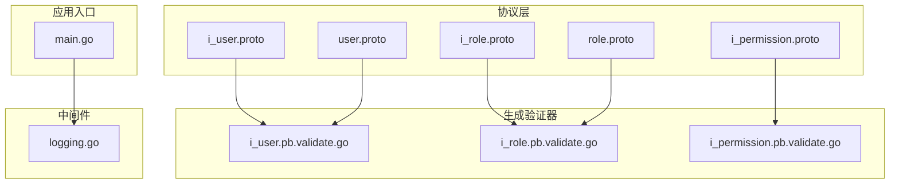
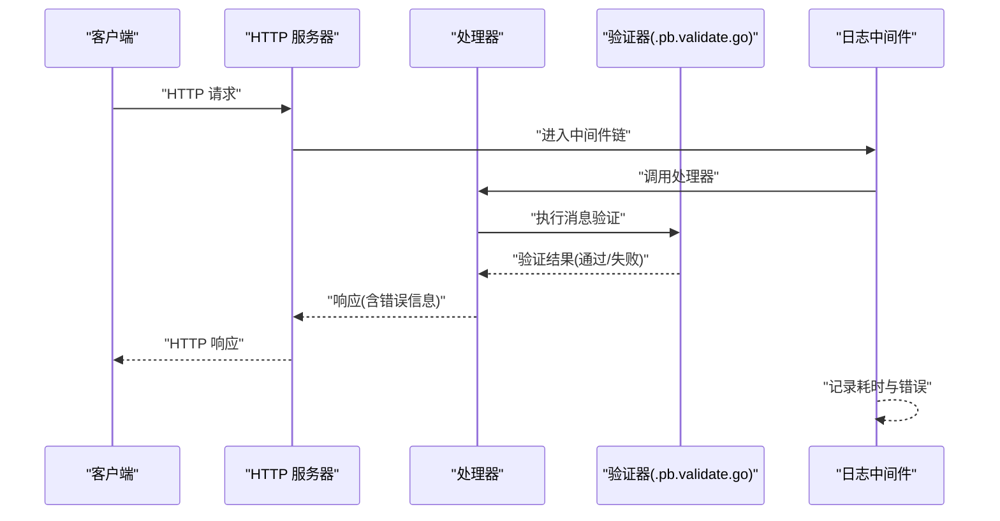
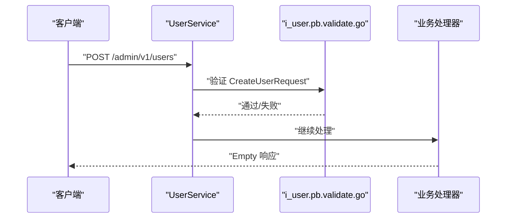
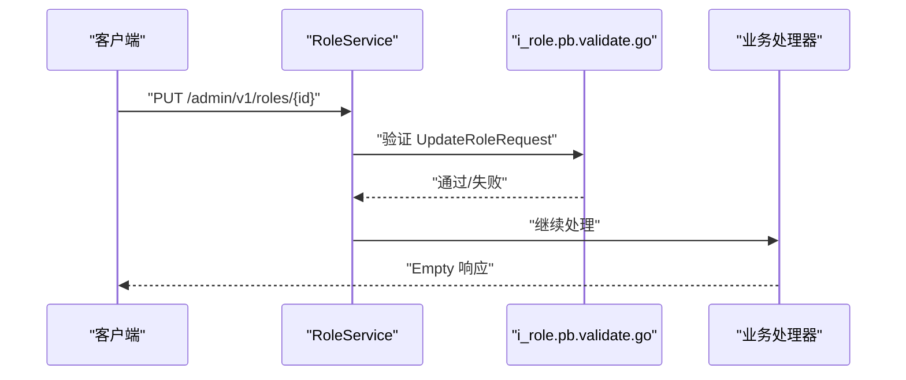
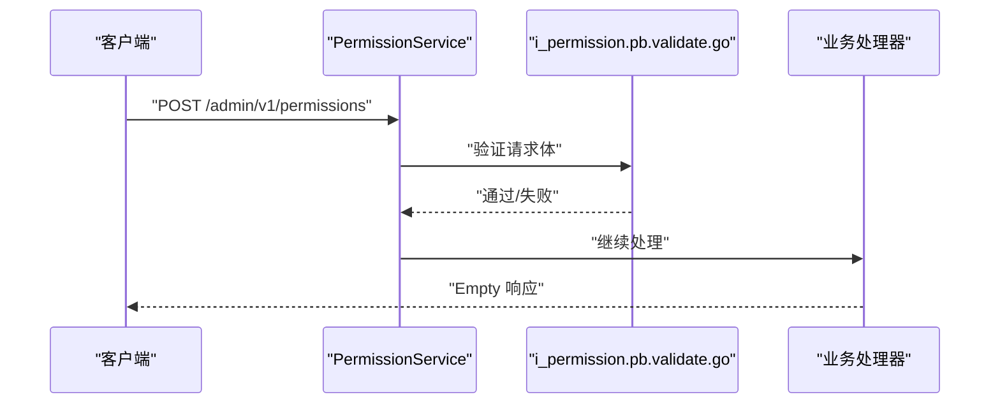
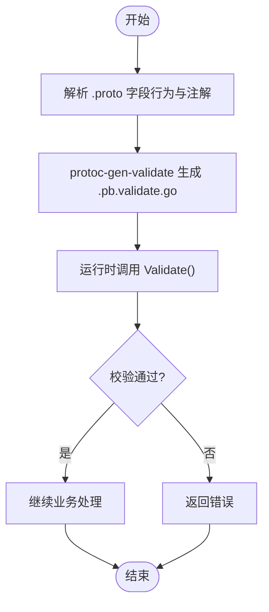
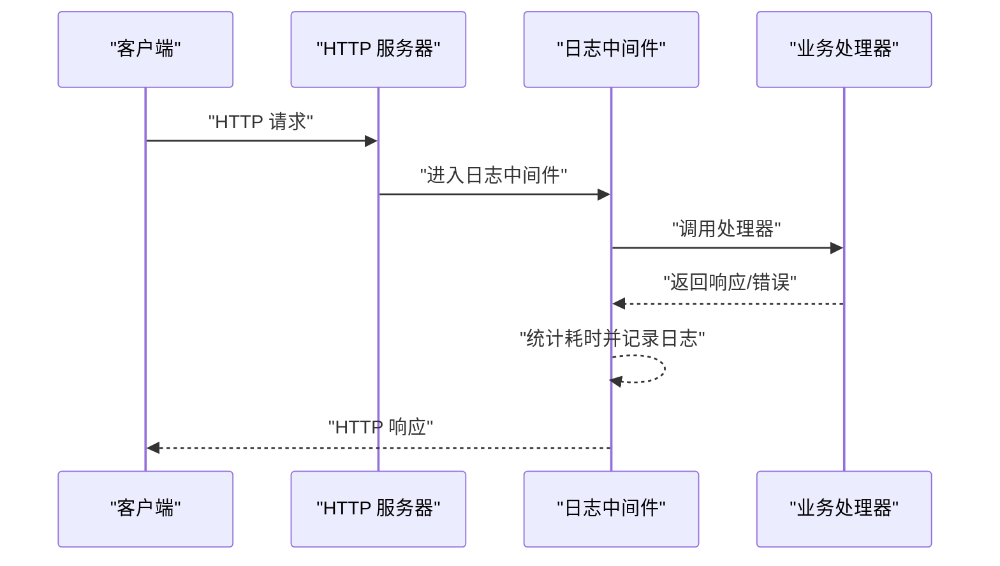
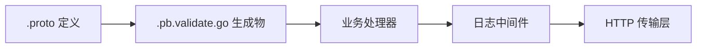

# 数据验证与约束

<cite>
**本文引用的文件**
- [main.go](file://backend/app/admin/service/cmd/server/main.go)
- [i_user.proto](file://backend/api/protos/admin/service/v1/i_user.proto)
- [i_role.proto](file://backend/api/protos/admin/service\v1\i_role.proto)
- [i_permission.proto](file://backend/api/protos/admin/service\v1\i_permission.proto)
- [user.proto](file://backend/api/protos/identity/service/v1/user.proto)
- [role.proto](file://backend/api/protos/permission/service/v1/role.proto)
- [i_user.pb.validate.go](file://backend/api/gen/go/admin/service/v1/i_user.pb.validate.go)
- [i_role.pb.validate.go](file://backend/api/gen/go/admin/service/v1/i_role.pb.validate.go)
- [i_permission.pb.validate.go](file://backend/api/gen/go/admin/service/v1/i_permission.pb.validate.go)
- [logging.go](file://backend/pkg/middleware/logging/logging.go)
</cite>

## 目录
1. [引言](#引言)
2. [项目结构](#项目结构)
3. [核心组件](#核心组件)
4. [架构总览](#架构总览)
5. [详细组件分析](#详细组件分析)
6. [依赖分析](#依赖分析)
7. [性能考虑](#性能考虑)
8. [故障排查指南](#故障排查指南)
9. [结论](#结论)
10. [附录](#附录)

## 引言
本文件聚焦于 GoWind Admin 的数据验证与约束体系，系统性阐述以下内容：
- Protobuf 验证规则的使用方式与生成产物，涵盖字段约束、格式校验、范围检查等。
- 自定义验证器的实现与使用路径，包括业务逻辑验证与跨字段验证。
- 中间件层的数据验证机制，包括请求参数验证与响应数据验证。
- 实战示例与最佳实践，覆盖性能优化、错误处理、国际化等主题。
- 常见验证场景的解决方案与调试技巧，帮助构建健壮的数据验证体系。

## 项目结构
GoWind Admin 的验证体系由“协议层（Protobuf）+ 生成验证器 + 业务中间件”三层构成：
- 协议层：在 .proto 文件中声明字段行为、OpenAPI 属性与 HTTP 映射。
- 生成验证器：基于 protoc-gen-validate 自动生成的 .pb.validate.go 文件，提供运行时校验能力。
- 业务中间件：在服务端对请求/响应进行统一审计与日志记录，辅助定位验证问题。

**图表来源**
- [i_user.proto:1-75](file://backend/api/protos/admin/service/v1/i_user.proto#L1-L75)
- [i_role.proto:1-51](file://backend/api/protos/admin/service\v1\i_role.proto#L1-L51)
- [i_permission.proto:1-60](file://backend/api/protos/admin/service\v1\i_permission.proto#L1-L60)
- [user.proto:1-450](file://backend/api/protos/identity/service/v1/user.proto#L1-L450)
- [role.proto:1-372](file://backend/api/protos/permission/service/v1/role.proto#L1-L372)
- [i_user.pb.validate.go:1-37](file://backend/api/gen/go/admin/service/v1/i_user.pb.validate.go#L1-L37)
- [i_role.pb.validate.go:1-37](file://backend/api/gen/go/admin/service/v1/i_role.pb.validate.go#L1-L37)
- [i_permission.pb.validate.go:1-37](file://backend/api/gen/go/admin/service/v1/i_permission.pb.validate.go#L1-L37)
- [main.go:1-76](file://backend/app/admin/service/cmd/server/main.go#L1-L76)
- [logging.go:1-52](file://backend/pkg/middleware/logging/logging.go#L1-L52)

**章节来源**
- [main.go:1-76](file://backend/app/admin/service/cmd/server/main.go#L1-L76)
- [i_user.proto:1-75](file://backend/api/protos/admin/service/v1/i_user.proto#L1-L75)
- [i_role.proto:1-51](file://backend/api/protos/admin/service\v1\i_role.proto#L1-L51)
- [i_permission.proto:1-60](file://backend/api/protos/admin/service\v1\i_permission.proto#L1-L60)
- [user.proto:1-450](file://backend/api/protos/identity/service/v1/user.proto#L1-L450)
- [role.proto:1-372](file://backend/api/protos/permission/service/v1/role.proto#L1-L372)
- [i_user.pb.validate.go:1-37](file://backend/api/gen/go/admin/service/v1/i_user.pb.validate.go#L1-L37)
- [i_role.pb.validate.go:1-37](file://backend/api/gen/go/admin/service/v1/i_role.pb.validate.go#L1-L37)
- [i_permission.pb.validate.go:1-37](file://backend/api/gen/go/admin/service/v1/i_permission.pb.validate.go#L1-L37)
- [logging.go:1-52](file://backend/pkg/middleware/logging/logging.go#L1-L52)

## 核心组件
- 协议与字段行为
  - 在用户、角色、权限等服务的 .proto 中，通过 OpenAPI 注解与字段行为标注，明确字段含义、只读属性、必填要求等，为后续验证提供契约基础。
- 生成验证器
  - 生成的 .pb.validate.go 文件包含针对消息体的运行时校验逻辑，覆盖字符串长度、格式、枚举取值、数值范围等。
- 业务中间件
  - 日志中间件在请求处理前后记录耗时、操作类型与错误信息，便于定位验证失败与异常。

**章节来源**
- [user.proto:242-278](file://backend/api/protos/identity/service/v1/user.proto#L242-L278)
- [role.proto:294-316](file://backend/api/protos/permission/service/v1/role.proto#L294-L316)
- [i_user.pb.validate.go:1-37](file://backend/api/gen/go/admin/service/v1/i_user.pb.validate.go#L1-L37)
- [i_role.pb.validate.go:1-37](file://backend/api/gen/go/admin/service/v1/i_role.pb.validate.go#L1-L37)
- [i_permission.pb.validate.go:1-37](file://backend/api/gen/go/admin/service/v1/i_permission.pb.validate.go#L1-L37)
- [logging.go:14-51](file://backend/pkg/middleware/logging/logging.go#L14-L51)

## 架构总览
下图展示了从 HTTP 请求到服务处理再到验证与日志的整体流程：

**图表来源**
- [main.go:46-57](file://backend/app/admin/service/cmd/server/main.go#L46-L57)
- [logging.go:31-50](file://backend/pkg/middleware/logging/logging.go#L31-L50)
- [i_user.pb.validate.go:1-37](file://backend/api/gen/go/admin/service/v1/i_user.pb.validate.go#L1-L37)
- [i_role.pb.validate.go:1-37](file://backend/api/gen/go/admin/service/v1/i_role.pb.validate.go#L1-L37)
- [i_permission.pb.validate.go:1-37](file://backend/api/gen/go/admin/service/v1/i_permission.pb.validate.go#L1-L37)

## 详细组件分析

### 用户管理服务（UserService）
- 协议要点
  - 列表、详情、创建、更新、删除、存在性检查、密码修改等 RPC，均通过 HTTP 映射暴露。
  - 请求消息中包含分页、查询条件、更新掩码等，为验证提供上下文。
- 验证要点
  - 字段行为标注与 OpenAPI 属性确保请求体字段的语义清晰，生成验证器可据此进行格式与范围校验。
- 示例路径
  - [i_user.proto:14-74](file://backend/api/protos/admin/service/v1/i_user.proto#L14-L74)
  - [user.proto:242-278](file://backend/api/protos/identity/service/v1/user.proto#L242-L278)

**图表来源**
- [i_user.proto:34-48](file://backend/api/protos/admin/service/v1/i_user.proto#L34-L48)
- [user.proto:242-249](file://backend/api/protos/identity/service/v1/user.proto#L242-L249)
- [i_user.pb.validate.go:1-37](file://backend/api/gen/go/admin/service/v1/i_user.pb.validate.go#L1-L37)

**章节来源**
- [i_user.proto:14-74](file://backend/api/protos/admin/service/v1/i_user.proto#L14-L74)
- [user.proto:242-278](file://backend/api/protos/identity/service/v1/user.proto#L242-L278)
- [i_user.pb.validate.go:1-37](file://backend/api/gen/go/admin/service/v1/i_user.pb.validate.go#L1-L37)

### 角色管理服务（RoleService）
- 协议要点
  - 角色的增删改查、批量操作、根据 ID/名称/编码查询等。
  - 更新请求支持 FieldMask 与 allow_missing，影响验证与业务处理。
- 验证要点
  - 生成验证器对角色消息中的枚举、状态、排序、租户等字段进行范围与取值校验。
- 示例路径
  - [i_role.proto:13-50](file://backend/api/protos/admin/service\v1\i_role.proto#L13-L50)
  - [role.proto:294-316](file://backend/api/protos/permission/service/v1/role.proto#L294-L316)

**图表来源**
- [i_role.proto:36-42](file://backend/api/protos/admin/service\v1\i_role.proto#L36-L42)
- [role.proto:299-316](file://backend/api/protos/permission/service/v1/role.proto#L299-L316)
- [i_role.pb.validate.go:1-37](file://backend/api/gen/go/admin/service/v1/i_role.pb.validate.go#L1-L37)

**章节来源**
- [i_role.proto:13-50](file://backend/api/protos/admin/service\v1\i_role.proto#L13-L50)
- [role.proto:294-316](file://backend/api/protos/permission/service/v1/role.proto#L294-L316)
- [i_role.pb.validate.go:1-37](file://backend/api/gen/go/admin/service/v1/i_role.pb.validate.go#L1-L37)

### 权限点管理服务（PermissionService）
- 协议要点
  - 权限点的增删改查与同步接口，请求体通过 HTTP body 传递。
- 验证要点
  - 生成验证器对权限点消息进行字段合法性校验。
- 示例路径
  - [i_permission.proto:14-58](file://backend/api/protos/admin/service\v1\i_permission.proto#L14-L58)

**图表来源**
- [i_permission.proto:29-35](file://backend/api/protos/admin/service\v1\i_permission.proto#L29-L35)
- [i_permission.pb.validate.go:1-37](file://backend/api/gen/go/admin/service/v1/i_permission.pb.validate.go#L1-L37)

**章节来源**
- [i_permission.proto:14-58](file://backend/api/protos/admin/service\v1\i_permission.proto#L14-L58)
- [i_permission.pb.validate.go:1-37](file://backend/api/gen/go/admin/service/v1/i_permission.pb.validate.go#L1-L37)

### Protobuf 验证规则与生成验证器
- 生成验证器的作用
  - 通过 protoc-gen-validate 生成的 .pb.validate.go 文件，提供针对消息体的运行时校验，覆盖字符串长度、格式、枚举取值、数值范围等。
- 使用建议
  - 在 .proto 中明确字段行为与 OpenAPI 属性，确保生成验证器能正确反映业务约束。
  - 对于复杂业务规则（如跨字段一致性），结合业务层自定义验证器实现。

**图表来源**
- [i_user.pb.validate.go:1-37](file://backend/api/gen/go/admin/service/v1/i_user.pb.validate.go#L1-L37)
- [i_role.pb.validate.go:1-37](file://backend/api/gen/go/admin/service/v1/i_role.pb.validate.go#L1-L37)
- [i_permission.pb.validate.go:1-37](file://backend/api/gen/go/admin/service/v1/i_permission.pb.validate.go#L1-L37)

**章节来源**
- [i_user.pb.validate.go:1-37](file://backend/api/gen/go/admin/service/v1/i_user.pb.validate.go#L1-L37)
- [i_role.pb.validate.go:1-37](file://backend/api/gen/go/admin/service/v1/i_role.pb.validate.go#L1-L37)
- [i_permission.pb.validate.go:1-37](file://backend/api/gen/go/admin/service/v1/i_permission.pb.validate.go#L1-L37)

### 自定义验证器与业务逻辑验证
- 设计原则
  - 将跨字段、跨实体、业务策略类的验证放在业务层，避免过度依赖生成验证器。
  - 对于复杂规则（如“密码强度 + 与确认密码一致”、“角色与租户范围匹配”），优先在服务处理器中实现。
- 实施建议
  - 在处理器入口处集中调用自定义验证函数，保证错误信息统一与可追踪。
  - 对于重复使用的规则，抽象为独立模块，便于测试与维护。

[本节为通用设计指导，不直接分析具体文件，故无“章节来源”]

### 中间件层的数据验证机制
- 日志中间件职责
  - 记录请求处理耗时、操作类型、错误信息，辅助定位验证失败与异常。
  - 通过 transport 上下文获取 HTTP 传输信息，实现登录审计与 API 审计日志。
- 集成方式
  - 在应用启动时注册中间件链，确保每个请求都经过统一的日志处理。

**图表来源**
- [logging.go:31-50](file://backend/pkg/middleware/logging/logging.go#L31-L50)

**章节来源**
- [logging.go:14-51](file://backend/pkg/middleware/logging/logging.go#L14-L51)

## 依赖分析
- 组件耦合
  - 协议层与生成验证器强耦合：.proto 的字段行为直接影响 .pb.validate.go 的校验逻辑。
  - 业务处理器依赖生成验证器与自定义验证器，共同完成数据完整性保障。
  - 中间件与业务处理器弱耦合，通过统一的中间件接口集成。
- 外部依赖
  - Kratos 中间件生态与 HTTP 传输层，支撑请求生命周期与日志记录。

**图表来源**
- [i_user.proto:1-75](file://backend/api/protos/admin/service/v1/i_user.proto#L1-L75)
- [i_user.pb.validate.go:1-37](file://backend/api/gen/go/admin/service/v1/i_user.pb.validate.go#L1-L37)
- [logging.go:1-52](file://backend/pkg/middleware/logging/logging.go#L1-L52)

**章节来源**
- [i_user.proto:1-75](file://backend/api/protos/admin/service/v1/i_user.proto#L1-L75)
- [i_user.pb.validate.go:1-37](file://backend/api/gen/go/admin/service/v1/i_user.pb.validate.go#L1-L37)
- [logging.go:1-52](file://backend/pkg/middleware/logging/logging.go#L1-L52)

## 性能考虑
- 生成验证器的开销
  - 生成验证器在运行时进行一次性校验，通常开销较小；建议在高频接口中避免重复校验。
- 中间件日志
  - 日志中间件仅做轻量统计与记录，对性能影响有限；可在高并发场景调整日志级别与采样率。
- 建议
  - 将昂贵的业务规则验证延迟至必要阶段，减少不必要的计算。
  - 对热点数据采用缓存与批量处理，降低整体验证成本。

[本节为通用性能指导，不直接分析具体文件，故无“章节来源”]

## 故障排查指南
- 常见问题
  - 字段缺失或类型不匹配：检查 .proto 中字段行为与 OpenAPI 属性，确认生成验证器是否覆盖相应规则。
  - 跨字段一致性错误：在业务处理器中补充自定义验证逻辑，并通过日志中间件定位失败点。
  - 响应数据异常：利用日志中间件记录的耗时与错误信息，快速定位问题环节。
- 调试技巧
  - 在本地启用更详细的日志级别，观察请求与响应的完整生命周期。
  - 对关键接口添加单元测试，覆盖边界条件与异常分支。
  - 使用 HTTP 工具（如 curl 或 Postman）构造最小化请求，逐步缩小问题范围。

**章节来源**
- [logging.go:31-50](file://backend/pkg/middleware/logging/logging.go#L31-L50)

## 结论
GoWind Admin 的数据验证体系以 Protobuf 为契约、生成验证器为基石、业务中间件为保障，形成了“协议即约束、生成即校验、日志即可观测”的闭环。通过合理划分协议约束与业务规则、在中间件中强化可观测性，能够有效提升系统的健壮性与可维护性。建议在后续迭代中持续完善自定义验证器与测试覆盖，确保复杂业务场景下的数据一致性与安全性。

## 附录
- 关键文件索引
  - 协议层：[i_user.proto:1-75](file://backend/api/protos/admin/service/v1/i_user.proto#L1-L75)、[i_role.proto:1-51](file://backend/api/protos/admin/service\v1\i_role.proto#L1-L51)、[i_permission.proto:1-60](file://backend/api/protos/admin/service\v1\i_permission.proto#L1-L60)、[user.proto:1-450](file://backend/api/protos/identity/service/v1/user.proto#L1-L450)、[role.proto:1-372](file://backend/api/protos/permission/service/v1/role.proto#L1-L372)
  - 生成验证器：[i_user.pb.validate.go:1-37](file://backend/api/gen/go/admin/service/v1/i_user.pb.validate.go#L1-L37)、[i_role.pb.validate.go:1-37](file://backend/api/gen/go/admin/service/v1/i_role.pb.validate.go#L1-L37)、[i_permission.pb.validate.go:1-37](file://backend/api/gen/go/admin/service/v1/i_permission.pb.validate.go#L1-L37)
  - 应用入口与中间件：[main.go:1-76](file://backend/app/admin/service/cmd/server/main.go#L1-L76)、[logging.go:1-52](file://backend/pkg/middleware/logging/logging.go#L1-L52)