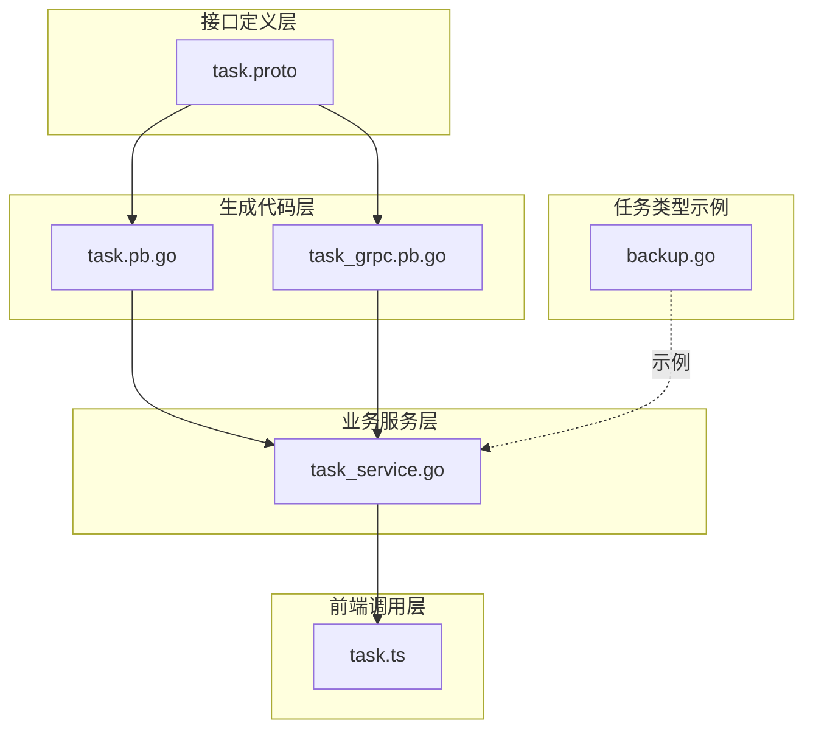
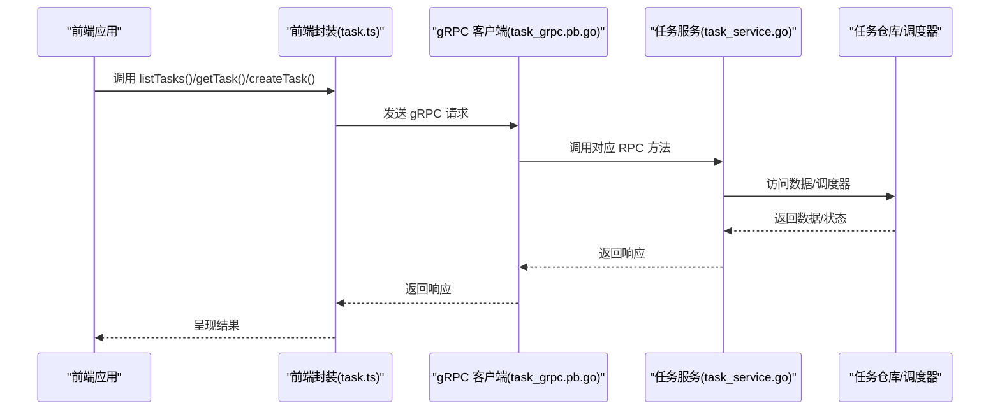
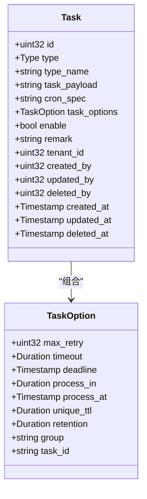
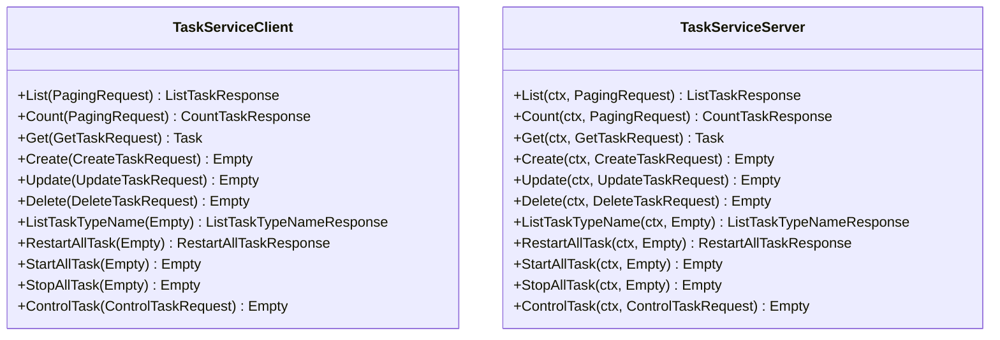
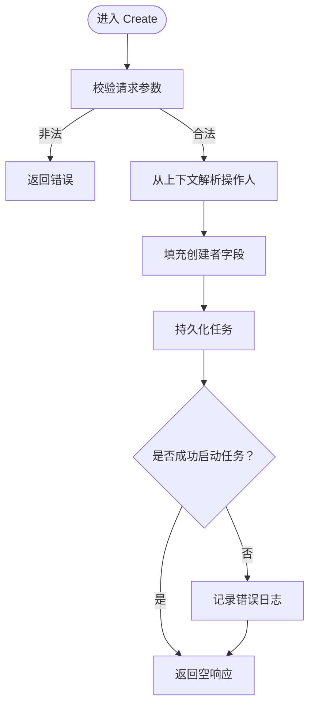
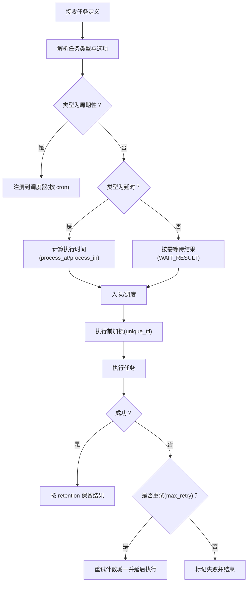
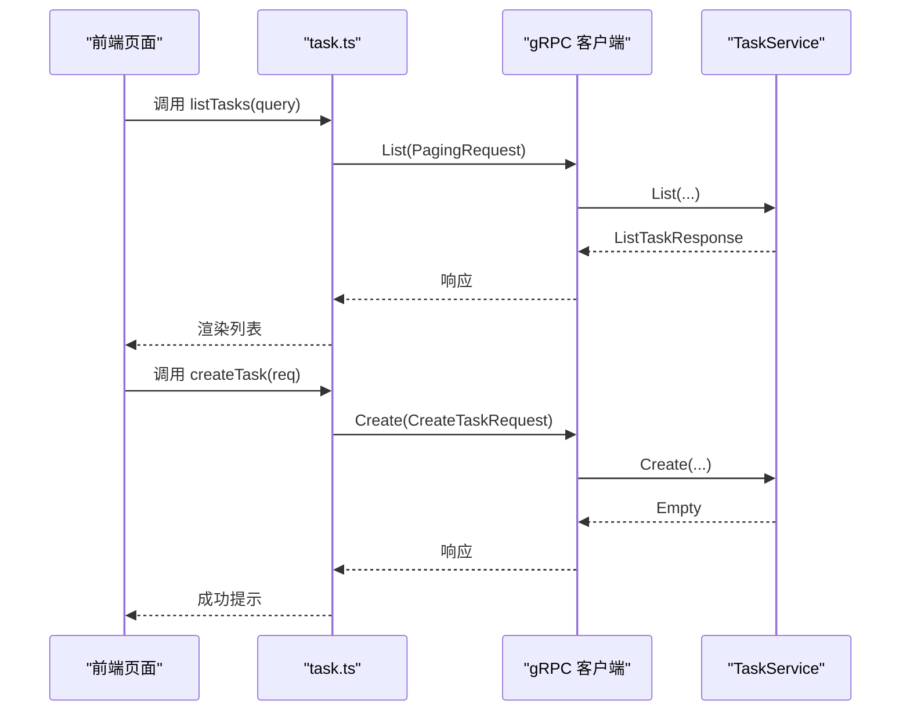
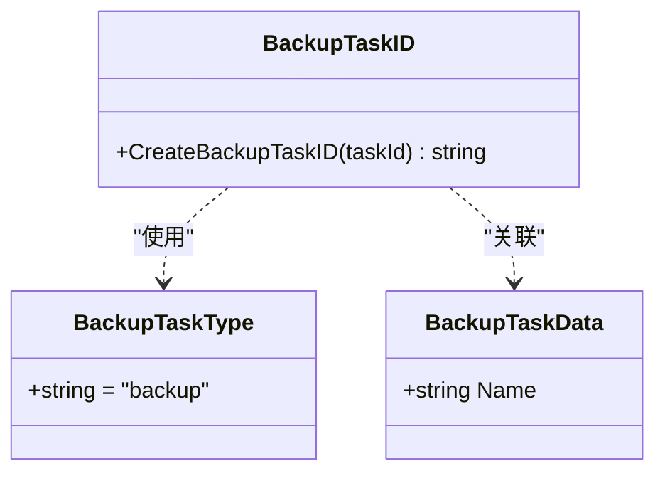
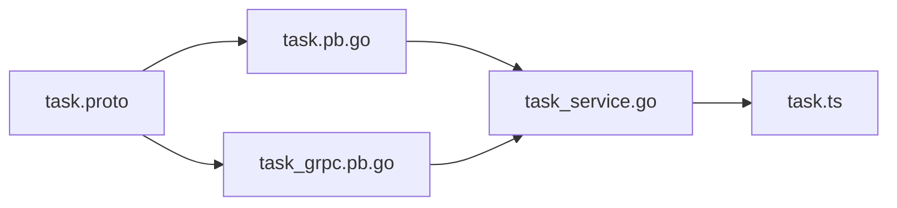

# 任务服务接口

<cite>
**本文引用的文件**
- [task.proto](file://backend/api/protos/task/service/v1/task.proto)
- [task.pb.go](file://backend/api/gen/go/task/service/v1/task.pb.go)
- [task_grpc.pb.go](file://backend/api/gen/go/task/service/v1/task_grpc.pb.go)
- [task_service.go](file://backend/app/admin/service/internal/service/task_service.go)
- [task.ts](file://frontend/admin/react/src/api/service/task.ts)
- [backup.go](file://backend/pkg/task/backup.go)
</cite>

## 目录
1. [简介](#简介)
2. [项目结构](#项目结构)
3. [核心组件](#核心组件)
4. [架构总览](#架构总览)
5. [详细组件分析](#详细组件分析)
6. [依赖关系分析](#依赖关系分析)
7. [性能考量](#性能考量)
8. [故障排查指南](#故障排查指南)
9. [结论](#结论)
10. [附录](#附录)

## 简介
本文件面向任务服务接口的使用者与维护者，系统化梳理任务管理接口的设计与实现，覆盖任务的创建、执行、监控与状态管理等能力，并给出任务调度、执行与结果查询的操作示例，阐述异步任务处理机制与任务队列管理策略。文档同时提供基于 gRPC 的接口调用流程图与时序图，帮助读者快速理解端到端的数据流与控制流。

## 项目结构
任务服务接口由以下层次构成：
- 接口定义层：使用 Protocol Buffers 定义服务契约与消息格式（含任务类型、选项、请求/响应体）。
- 生成代码层：通过编译器生成 Go 语言的 protobuf 与 gRPC stub，提供客户端与服务端接口。
- 业务服务层：在后端应用中实现 gRPC 服务接口，负责任务的持久化、调度器注册、启动与控制。
- 前端调用层：前端通过已生成的 gRPC-Web 客户端封装调用后端服务。
- 任务类型示例：提供具体任务类型的结构与唯一任务 ID 生成策略。

**图表来源**
- [task.proto:1-315](file://backend/api/protos/task/service/v1/task.proto#L1-L315)
- [task.pb.go:1-800](file://backend/api/gen/go/task/service/v1/task.pb.go#L1-L800)
- [task_grpc.pb.go:1-530](file://backend/api/gen/go/task/service/v1/task_grpc.pb.go#L1-L530)
- [task_service.go:60-110](file://backend/app/admin/service/internal/service/task_service.go#L60-L110)
- [task.ts:1-38](file://frontend/admin/react/src/api/service/task.ts#L1-L38)
- [backup.go:1-19](file://backend/pkg/task/backup.go#L1-L19)

**章节来源**
- [task.proto:1-315](file://backend/api/protos/task/service/v1/task.proto#L1-L315)
- [task.pb.go:1-800](file://backend/api/gen/go/task/service/v1/task.pb.go#L1-L800)
- [task_grpc.pb.go:1-530](file://backend/api/gen/go/task/service/v1/task_grpc.pb.go#L1-L530)
- [task_service.go:60-110](file://backend/app/admin/service/internal/service/task_service.go#L60-L110)
- [task.ts:1-38](file://frontend/admin/react/src/api/service/task.ts#L1-L38)
- [backup.go:1-19](file://backend/pkg/task/backup.go#L1-L19)

## 核心组件
- 任务模型与选项
  - 任务类型：周期性、延时、等待结果。
  - 任务选项：最大重试次数、超时、截止时间、延迟处理时间、执行时间点、唯一锁定时间、结果保留时间、分组、唯一任务 ID 等。
  - 任务实体：包含任务元数据（启用/禁用、备注、租户 ID、创建/更新/删除时间与用户等）。
- 服务契约
  - 列表/统计/详情：分页查询、总数统计、按 ID 或类型名查询。
  - CRUD：创建、更新、删除任务。
  - 调度控制：列出任务类型名、批量启停/重启、按类型名启停/重启单个任务。
- 生成的 gRPC 客户端与服务端接口
  - 提供 List、Count、Get、Create、Update、Delete、ListTaskTypeName、RestartAllTask、StartAllTask、StopAllTask、ControlTask 等方法。
- 前端封装
  - 封装 gRPC-Web 客户端，提供 listTasks、getTask、createTask、updateTask、deleteTask 等便捷函数。

**章节来源**
- [task.proto:127-208](file://backend/api/protos/task/service/v1/task.proto#L127-L208)
- [task.proto:52-125](file://backend/api/protos/task/service/v1/task.proto#L52-L125)
- [task_grpc.pb.go:23-65](file://backend/api/gen/go/task/service/v1/task_grpc.pb.go#L23-L65)
- [task.ts:1-38](file://frontend/admin/react/src/api/service/task.ts#L1-L38)

## 架构总览
任务服务采用“接口定义 + 生成代码 + 业务实现 + 前端调用”的分层架构。接口定义位于 task.proto，生成 Go 代码后，业务服务在 task_service.go 中实现 gRPC 方法；前端通过 task.ts 封装调用。

**图表来源**
- [task_grpc.pb.go:42-65](file://backend/api/gen/go/task/service/v1/task_grpc.pb.go#L42-L65)
- [task_service.go:67-110](file://backend/app/admin/service/internal/service/task_service.go#L67-L110)
- [task.ts:19-38](file://frontend/admin/react/src/api/service/task.ts#L19-L38)

## 详细组件分析

### 数据模型与枚举
- 任务类型枚举：周期性、延时、等待结果。
- 任务选项字段：max_retry、timeout、deadline、process_in、process_at、unique_ttl、retention、group、task_id。
- 任务实体字段：id、type、type_name、task_payload、cron_spec、task_options、enable、remark、tenant_id、以及审计字段 createdBy/updatedBy/deletedBy 与 createdAt/updatedAt/deletedAt。

**图表来源**
- [task.proto:52-125](file://backend/api/protos/task/service/v1/task.proto#L52-L125)
- [task.proto:127-208](file://backend/api/protos/task/service/v1/task.proto#L127-L208)

**章节来源**
- [task.proto:127-208](file://backend/api/protos/task/service/v1/task.proto#L127-L208)
- [task.proto:52-125](file://backend/api/protos/task/service/v1/task.proto#L52-L125)

### 服务接口与方法
- 任务管理接口：List、Count、Get、Create、Update、Delete。
- 调度控制接口：ListTaskTypeName、RestartAllTask、StartAllTask、StopAllTask、ControlTask。
- gRPC 客户端/服务端接口：生成代码提供强类型方法签名与序列化支持。

**图表来源**
- [task_grpc.pb.go:42-65](file://backend/api/gen/go/task/service/v1/task_grpc.pb.go#L42-L65)
- [task_grpc.pb.go:185-214](file://backend/api/gen/go/task/service/v1/task_grpc.pb.go#L185-L214)

**章节来源**
- [task_grpc.pb.go:42-65](file://backend/api/gen/go/task/service/v1/task_grpc.pb.go#L42-L65)
- [task_grpc.pb.go:185-214](file://backend/api/gen/go/task/service/v1/task_grpc.pb.go#L185-L214)

### 业务服务实现要点
- 注册任务调度器：通过 RegisterTaskScheduler 注入调度器实例，用于类型名查询与任务启动。
- 列表/详情：委托仓库完成数据访问。
- 创建任务：解析操作人、写入创建者字段、持久化后尝试启动任务（记录错误但不阻塞响应）。
- 更新/删除：参数校验与权限检查后，委托仓库执行。
- 控制任务：根据控制类型（启动/停止/重启）与类型名对调度器进行相应操作。

**图表来源**
- [task_service.go:82-105](file://backend/app/admin/service/internal/service/task_service.go#L82-L105)

**章节来源**
- [task_service.go:63-110](file://backend/app/admin/service/internal/service/task_service.go#L63-L110)

### 异步任务处理与队列管理策略
- 任务类型与触发方式
  - 周期性任务：通过 cron 表达式驱动定时触发。
  - 延时任务：在指定延迟或时间点后执行。
  - 等待结果：可能与其他任务存在依赖或结果收集逻辑（具体行为由任务类型实现决定）。
- 任务选项与生命周期
  - 通过 unique_ttl 实现任务唯一性锁定，避免重复执行。
  - 通过 retention 控制结果保留时间，便于后续查询与审计。
  - 通过 deadline 和 timeout 控制任务的截止与超时策略。
- 任务调度器集成
  - 通过 ListTaskTypeName 暴露已注册的任务类型，前端可据此选择任务类型。
  - 通过 ControlTask/StartAllTask/StopAllTask/RestartAllTask 对任务进行统一控制。

**图表来源**
- [task.proto:127-208](file://backend/api/protos/task/service/v1/task.proto#L127-L208)
- [task.proto:52-125](file://backend/api/protos/task/service/v1/task.proto#L52-L125)

**章节来源**
- [task.proto:127-208](file://backend/api/protos/task/service/v1/task.proto#L127-L208)
- [task.proto:52-125](file://backend/api/protos/task/service/v1/task.proto#L52-L125)

### 前端调用示例
- 列表与详情：通过封装的 listTasks 与 getTask 调用 gRPC 服务。
- 创建与更新：通过 createTask 与 updateTask 调用 gRPC 服务。
- 删除：通过 deleteTask 调用 gRPC 服务。

**图表来源**
- [task.ts:19-38](file://frontend/admin/react/src/api/service/task.ts#L19-L38)
- [task_grpc.pb.go:42-65](file://backend/api/gen/go/task/service/v1/task_grpc.pb.go#L42-L65)

**章节来源**
- [task.ts:1-38](file://frontend/admin/react/src/api/service/task.ts#L1-L38)

### 任务类型示例：备份任务
- 任务类型常量：backup。
- 任务数据结构：包含名称字段。
- 唯一任务 ID 生成：基于类型与任务 ID 组合，确保全局唯一性。

**图表来源**
- [backup.go:5-18](file://backend/pkg/task/backup.go#L5-L18)

**章节来源**
- [backup.go:1-19](file://backend/pkg/task/backup.go#L1-L19)

## 依赖关系分析
- 接口定义依赖：task.proto 依赖 pagination、google.protobuf 时间与掩码类型。
- 生成代码依赖：task.pb.go 与 task_grpc.pb.go 由 task.proto 编译生成。
- 业务服务依赖：task_service.go 依赖生成的 protobuf 类型与 gRPC 服务接口，同时依赖调度器与仓库。
- 前端依赖：task.ts 依赖已生成的 gRPC-Web 客户端。

**图表来源**
- [task.proto:1-315](file://backend/api/protos/task/service/v1/task.proto#L1-L315)
- [task.pb.go:1-800](file://backend/api/gen/go/task/service/v1/task.pb.go#L1-L800)
- [task_grpc.pb.go:1-530](file://backend/api/gen/go/task/service/v1/task_grpc.pb.go#L1-L530)
- [task_service.go:60-110](file://backend/app/admin/service/internal/service/task_service.go#L60-L110)
- [task.ts:1-38](file://frontend/admin/react/src/api/service/task.ts#L1-L38)

**章节来源**
- [task.proto:1-315](file://backend/api/protos/task/service/v1/task.proto#L1-L315)
- [task_grpc.pb.go:1-530](file://backend/api/gen/go/task/service/v1/task_grpc.pb.go#L1-L530)
- [task_service.go:60-110](file://backend/app/admin/service/internal/service/task_service.go#L60-L110)
- [task.ts:1-38](file://frontend/admin/react/src/api/service/task.ts#L1-L38)

## 性能考量
- 任务选项优化
  - 合理设置 max_retry、timeout、deadline，避免无限重试与长时间占用资源。
  - 使用 process_in/process_at 将高负载任务分散到非高峰时段。
  - unique_ttl 与 retention 需平衡一致性与存储开销。
- 分页与过滤
  - 列表查询使用分页请求，结合 FieldMask 过滤冗余字段，降低网络与序列化成本。
- 并发与锁
  - 唯一键与唯一 TTL 可有效避免重复执行，减少并发冲突。
- 批量控制
  - StartAllTask/StopAllTask/RestartAllTask 提供批量启停，适合运维场景下的快速调整。

[本节为通用指导，无需特定文件来源]

## 故障排查指南
- 常见错误
  - 参数非法：创建/更新时若请求体为空，服务端返回参数错误。
  - 方法未实现：若服务端未实现某 RPC，客户端将收到未实现错误。
- 日志与可观测性
  - 服务端在启动任务失败时记录错误日志，便于定位问题。
- 建议排查步骤
  - 检查请求参数与 FieldMask 是否正确。
  - 确认任务类型名存在于调度器注册列表。
  - 查看服务端日志中的错误信息与堆栈。

**章节来源**
- [task_service.go:82-105](file://backend/app/admin/service/internal/service/task_service.go#L82-L105)
- [task_grpc.pb.go:223-255](file://backend/api/gen/go/task/service/v1/task_grpc.pb.go#L223-L255)

## 结论
任务服务接口以清晰的协议定义与生成代码为基础，结合业务服务的仓库与调度器集成，提供了完整的任务生命周期管理能力。通过任务选项与控制接口，系统实现了灵活的调度策略与可观测性。前端封装进一步简化了调用流程，便于快速集成与扩展。

[本节为总结性内容，无需特定文件来源]

## 附录

### 接口清单与说明
- List/Paginated List：分页查询任务列表。
- Count：统计任务总数。
- Get：按 ID 或类型名查询任务详情。
- Create：创建新任务并尝试启动。
- Update：更新任务配置。
- Delete：删除任务。
- ListTaskTypeName：列出所有已注册的任务类型名。
- RestartAllTask/StartAllTask/StopAllTask：批量启停/重启任务。
- ControlTask：按类型名启停/重启单个任务。

**章节来源**
- [task_grpc.pb.go:42-65](file://backend/api/gen/go/task/service/v1/task_grpc.pb.go#L42-L65)
- [task.proto:17-50](file://backend/api/protos/task/service/v1/task.proto#L17-L50)