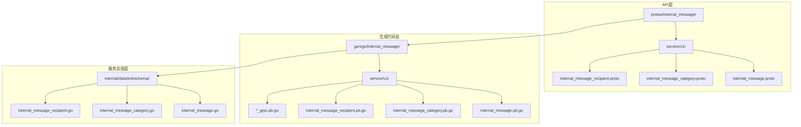
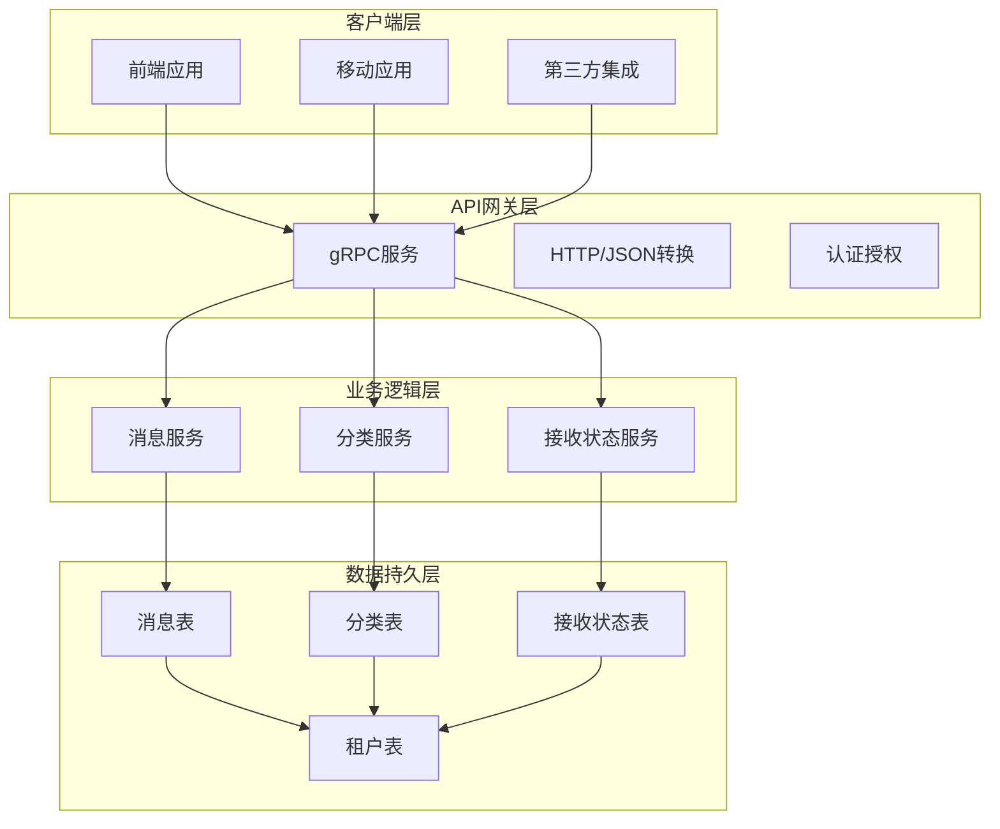
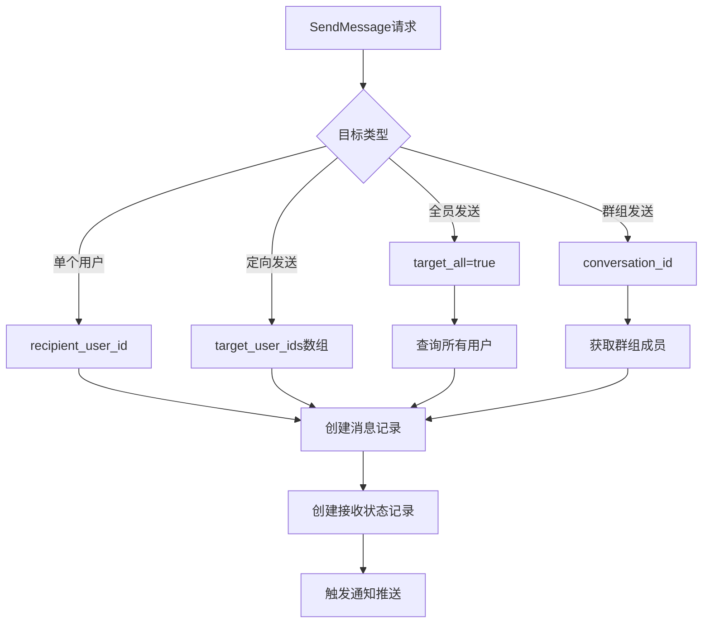
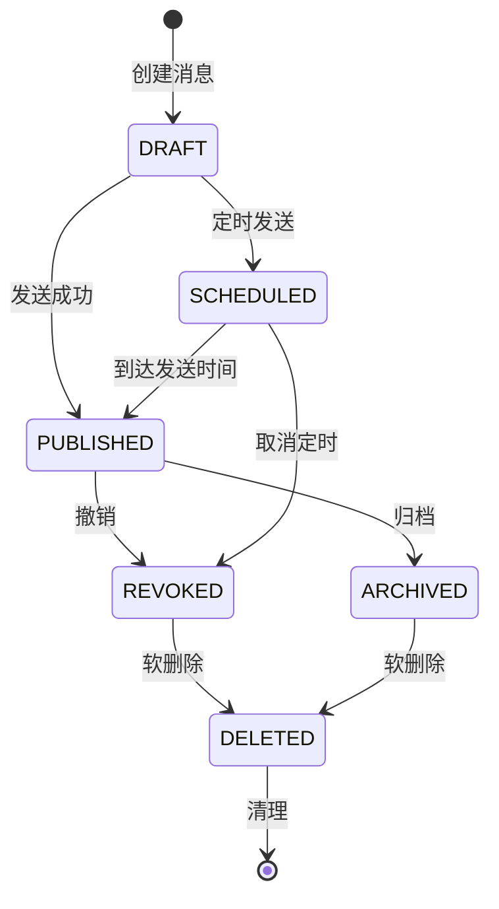
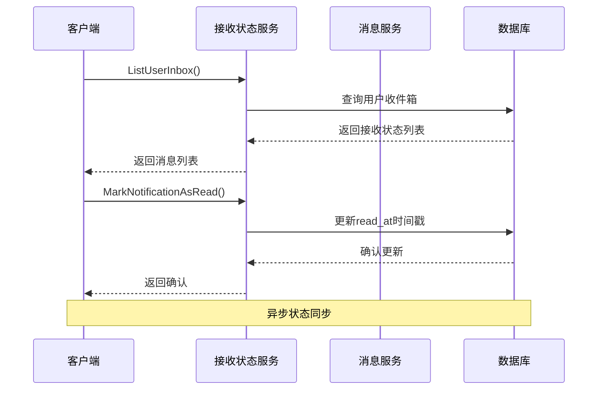
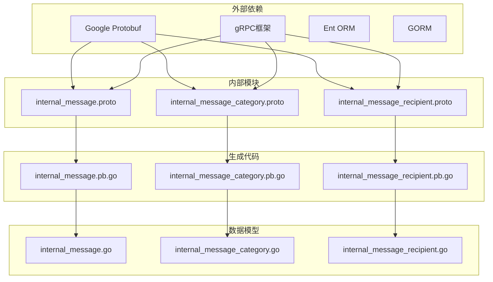

# 内部消息服务接口

<cite>
**本文档引用的文件**
- [internal_message.proto](file://backend/api/protos/internal_message/service/v1/internal_message.proto)
- [internal_message_category.proto](file://backend/api/protos/internal_message/service/v1/internal_message_category.proto)
- [internal_message_recipient.proto](file://backend/api/protos/internal_message/service/v1/internal_message_recipient.proto)
- [internal_message.pb.go](file://backend/api/gen/go/internal_message/service/v1/internal_message.pb.go)
- [internal_message_category.pb.go](file://backend/api/gen/go/internal_message/service/v1/internal_message_category.pb.go)
- [internal_message_recipient.pb.go](file://backend/api/gen/go/internal_message/service/v1/internal_message_recipient.pb.go)
- [internal_message_grpc.pb.go](file://backend/api/gen/go/internal_message/service/v1/internal_message_grpc.pb.go)
- [internal_message_category_grpc.pb.go](file://backend/api/gen/go/internal_message/service/v1/internal_message_category_grpc.pb.go)
- [internal_message_recipient_grpc.pb.go](file://backend/api/gen/go/internal_message/service/v1/internal_message_recipient_grpc.pb.go)
</cite>

## 目录
1. [简介](#简介)
2. [项目结构](#项目结构)
3. [核心组件](#核心组件)
4. [架构概览](#架构概览)
5. [详细组件分析](#详细组件分析)
6. [依赖关系分析](#依赖关系分析)
7. [性能考虑](#性能考虑)
8. [故障排除指南](#故障排除指南)
9. [结论](#结论)

## 简介

内部消息服务接口是企业级应用中用于处理站内信消息的核心服务模块。该服务提供了完整的消息管理功能，包括消息的创建、发送、接收、分类管理和状态跟踪。系统支持多种消息类型（通知、私信、群聊），并具备完善的权限控制和租户隔离机制。

本服务采用Protocol Buffers定义接口规范，通过gRPC提供高性能的远程过程调用能力，同时支持HTTP/JSON转换以便于前端集成。服务设计遵循微服务架构原则，具有良好的可扩展性和维护性。

## 项目结构

内部消息服务位于后端API的protos目录下，采用标准的分层架构组织：

**图表来源**
- [internal_message.proto:1-241](file://backend/api/protos/internal_message/service/v1/internal_message.proto#L1-L241)
- [internal_message_category.proto:1-145](file://backend/api/protos/internal_message/service/v1/internal_message_category.proto#L1-L145)
- [internal_message_recipient.proto:1-222](file://backend/api/protos/internal_message/service/v1/internal_message_recipient.proto#L1-L222)

**章节来源**
- [internal_message.proto:1-241](file://backend/api/protos/internal_message/service/v1/internal_message.proto#L1-L241)
- [internal_message_category.proto:1-145](file://backend/api/protos/internal_message/service/v1/internal_message_category.proto#L1-L145)
- [internal_message_recipient.proto:1-222](file://backend/api/protos/internal_message/service/v1/internal_message_recipient.proto#L1-L222)

## 核心组件

内部消息服务由三个核心组件构成，每个组件都有其特定的功能职责：

### 1. InternalMessage - 站内信消息实体

InternalMessage是消息系统的核心数据模型，包含了消息的所有基本信息和元数据：

- **消息标识**: 唯一的消息ID，用于消息的识别和关联
- **内容信息**: 标题和内容，支持富文本格式
- **状态管理**: 完整的消息生命周期状态（草稿、已发布、定时发布、已撤销、已归档、已删除）
- **类型分类**: 支持通知、私信、群聊三种消息类型
- **发送信息**: 发送者ID和名称，支持系统消息
- **分类关联**: 与消息分类的关联关系
- **租户隔离**: 支持多租户环境下的消息隔离

### 2. InternalMessageCategory - 消息分类管理

消息分类系统提供了对不同类型消息进行逻辑分组的能力：

- **分类标识**: 唯一的分类ID和编码
- **视觉元素**: 支持图标URL配置
- **排序机制**: 通过sort_order字段控制显示优先级
- **启用状态**: is_enabled字段控制分类的可用性
- **租户属性**: 支持租户级别的分类管理

### 3. InternalMessageRecipient - 消息接收状态

消息接收状态跟踪了每条消息在不同用户处的接收和阅读情况：

- **接收状态**: SENT、RECEIVED、READ、REVOKED、DELETED五种状态
- **时间戳**: 记录消息到达和阅读的具体时间
- **用户关联**: 明确的消息接收者用户ID
- **消息映射**: 与原始消息的关联关系

**章节来源**
- [internal_message.proto:40-121](file://backend/api/protos/internal_message/service/v1/internal_message.proto#L40-L121)
- [internal_message_category.proto:34-82](file://backend/api/protos/internal_message/service/v1/internal_message_category.proto#L34-L82)
- [internal_message_recipient.proto:48-108](file://backend/api/protos/internal_message/service/v1/internal_message_recipient.proto#L48-L108)

## 架构概览

内部消息服务采用分层架构设计，确保了系统的可维护性和扩展性：

**图表来源**
- [internal_message_grpc.pb.go:55-312](file://backend/api/gen/go/internal_message/service/v1/internal_message_grpc.pb.go#L55-L312)
- [internal_message_category_grpc.pb.go](file://backend/api/gen/go/internal_message/service/v1/internal_message_category_grpc.pb.go)
- [internal_message_recipient_grpc.pb.go](file://backend/api/gen/go/internal_message/service/v1/internal_message_recipient_grpc.pb.go)

系统采用事件驱动架构，支持异步消息处理和实时通知推送。每个服务都实现了完整的CRUD操作，并提供了专门的查询和统计功能。

## 详细组件分析

### InternalMessageService - 消息服务

InternalMessageService提供了完整的消息管理功能，支持以下核心操作：

#### 1. 基础CRUD操作

- **ListMessage**: 支持分页查询所有消息，包含条件筛选和排序功能
- **GetMessage**: 通过ID获取单个消息详情，支持FieldMask字段过滤
- **CreateMessage**: 创建新消息，自动设置创建时间和创建者信息
- **UpdateMessage**: 更新现有消息，支持部分字段更新和全量更新
- **DeleteMessage**: 软删除消息，保留历史记录用于审计

#### 2. 高级消息操作

- **SendMessage**: 发送消息到指定用户或用户组，支持多种发送模式
- **RevokeMessage**: 撤销已发送但未处理的消息

#### 3. 发送模式详解

SendMessage请求支持多种发送模式：

**图表来源**
- [internal_message.proto:181-221](file://backend/api/protos/internal_message/service/v1/internal_message.proto#L181-L221)

#### 4. 状态流转管理

消息状态在系统中有明确的流转规则：

**图表来源**
- [internal_message.proto:43-50](file://backend/api/protos/internal_message/service/v1/internal_message.proto#L43-L50)

**章节来源**
- [internal_message.proto:16-38](file://backend/api/protos/internal_message/service/v1/internal_message.proto#L16-L38)
- [internal_message.pb.go:621-720](file://backend/api/gen/go/internal_message/service/v1/internal_message.pb.go#L621-L720)

### InternalMessageCategoryService - 分类服务

InternalMessageCategoryService专注于消息分类的管理：

#### 1. 分类管理功能

- **List**: 分页列出所有分类，支持条件查询
- **Count**: 统计分类总数
- **Get**: 获取单个分类详情
- **Create**: 创建新分类
- **Update**: 更新分类信息
- **Delete**: 删除分类

#### 2. 分类特性

每个分类包含以下关键属性：
- **唯一标识**: id和code确保分类的唯一性
- **视觉配置**: icon_url支持自定义图标
- **排序控制**: sort_order决定显示顺序
- **状态管理**: is_enabled控制分类的启用状态
- **租户隔离**: 支持多租户环境下的分类管理

**章节来源**
- [internal_message_category.proto:14-32](file://backend/api/protos/internal_message/service/v1/internal_message_category.proto#L14-L32)
- [internal_message_category.pb.go:602-697](file://backend/api/gen/go/internal_message/service/v1/internal_message_category.pb.go#L602-L697)

### InternalMessageRecipientService - 接收状态服务

InternalMessageRecipientService负责跟踪消息的接收和阅读状态：

#### 1. 接收状态管理

- **List**: 分页查询接收状态列表
- **Count**: 统计接收状态总数
- **Get**: 获取单个接收状态详情
- **Create**: 创建新的接收状态记录
- **Update**: 更新接收状态
- **Delete**: 删除接收状态记录

#### 2. 批量操作功能

- **GetInternalMessageRecipientsByIds**: 根据ID列表批量获取接收状态
- **ListUserInbox**: 获取用户的收件箱列表
- **DeleteNotificationFromInbox**: 从收件箱删除通知
- **MarkNotificationAsRead**: 将通知标记为已读
- **MarkNotificationsStatus**: 批量修改通知状态

#### 3. 状态同步机制

**图表来源**
- [internal_message_recipient.proto:14-46](file://backend/api/protos/internal_message/service/v1/internal_message_recipient.proto#L14-L46)

**章节来源**
- [internal_message_recipient.proto:13-46](file://backend/api/protos/internal_message/service/v1/internal_message_recipient.proto#L13-L46)
- [internal_message_recipient.pb.go:250-807](file://backend/api/gen/go/internal_message/service/v1/internal_message_recipient.pb.go#L250-L807)

## 依赖关系分析

内部消息服务的依赖关系体现了清晰的分层架构：

**图表来源**
- [internal_message.pb.go:9-21](file://backend/api/gen/go/internal_message/service/v1/internal_message.pb.go#L9-L21)
- [internal_message_category.pb.go:9-20](file://backend/api/gen/go/internal_message/service/v1/internal_message_category.pb.go#L9-L20)
- [internal_message_recipient.pb.go:9-20](file://backend/api/gen/go/internal_message/service/v1/internal_message_recipient.pb.go#L9-L20)

### 关键依赖说明

1. **Protobuf依赖**: 使用Google Protobuf作为序列化和接口定义工具
2. **gRPC集成**: 提供高性能的RPC通信能力
3. **数据库ORM**: Ent和GORM分别用于不同的数据访问场景
4. **时间戳处理**: 使用google.protobuf.Timestamp确保时间精度
5. **字段掩码**: 支持FieldMask实现灵活的字段选择

**章节来源**
- [internal_message.pb.go:9-21](file://backend/api/gen/go/internal_message/service/v1/internal_message.pb.go#L9-L21)
- [internal_message_category.pb.go:9-20](file://backend/api/gen/go/internal_message/service/v1/internal_message_category.pb.go#L9-L20)
- [internal_message_recipient.pb.go:9-20](file://backend/api/gen/go/internal_message/service/v1/internal_message_recipient.pb.go#L9-L20)

## 性能考虑

内部消息服务在设计时充分考虑了性能优化：

### 1. 查询优化

- **分页查询**: 所有列表查询都支持分页，避免大数据量查询
- **索引设计**: 关键字段（如用户ID、消息ID、状态）建立适当索引
- **字段选择**: 支持FieldMask减少不必要的数据传输

### 2. 缓存策略

- **分类缓存**: 消息分类信息相对稳定，适合缓存
- **用户偏好**: 用户的收件箱配置可以缓存
- **租户配置**: 租户级别的消息配置可以缓存

### 3. 异步处理

- **消息发送**: 发送操作采用异步处理，提高响应速度
- **通知推送**: 通过事件总线实现松耦合的通知推送
- **批量操作**: 支持批量处理大量消息状态更新

### 4. 连接池管理

- **数据库连接**: 合理配置连接池大小，避免连接争用
- **gRPC连接**: 复用gRPC连接，减少连接开销
- **内存管理**: 优化对象生命周期，减少GC压力

## 故障排除指南

### 常见问题及解决方案

#### 1. 消息发送失败

**问题症状**: SendMessage返回错误，消息未到达接收者

**可能原因**:
- 目标用户不存在或已被禁用
- 网络连接异常
- 数据库写入失败
- 权限不足

**解决步骤**:
1. 验证用户ID的有效性
2. 检查网络连接状态
3. 查看数据库连接日志
4. 确认发送者的权限

#### 2. 消息状态不一致

**问题症状**: 接收者看到的消息状态与预期不符

**可能原因**:
- 客户端状态同步延迟
- 并发更新冲突
- 数据库事务问题

**解决步骤**:
1. 强制刷新客户端状态
2. 检查并发更新逻辑
3. 验证数据库事务完整性

#### 3. 查询性能问题

**问题症状**: 列表查询响应缓慢

**可能原因**:
- 缺少必要的索引
- 查询条件过于复杂
- 数据量过大

**解决步骤**:
1. 添加适当的数据库索引
2. 优化查询条件
3. 实施分页和限制结果集大小

**章节来源**
- [internal_message_grpc.pb.go:163-186](file://backend/api/gen/go/internal_message/service/v1/internal_message_grpc.pb.go#L163-L186)
- [internal_message_recipient_grpc.pb.go](file://backend/api/gen/go/internal_message/service/v1/internal_message_recipient_grpc.pb.go)

## 结论

内部消息服务接口设计合理，功能完整，具有良好的扩展性和维护性。系统通过清晰的分层架构、完善的数据模型和高效的实现方式，为企业级应用提供了可靠的站内信解决方案。

### 主要优势

1. **完整的功能覆盖**: 从基础的消息管理到高级的状态跟踪，功能齐全
2. **灵活的发送模式**: 支持单用户、定向发送、全员发送等多种模式
3. **完善的权限控制**: 基于租户和用户的角色权限管理
4. **高性能实现**: 采用gRPC和优化的数据库设计
5. **易于扩展**: 模块化设计便于功能扩展和维护

### 应用场景

- 企业内部通知系统
- 用户间私信交流
- 群组消息管理
- 系统公告发布
- 业务流程通知

该服务为构建现代化的企业应用提供了坚实的基础，能够满足各种复杂的业务需求。