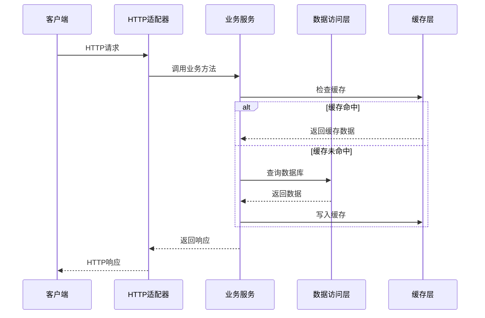
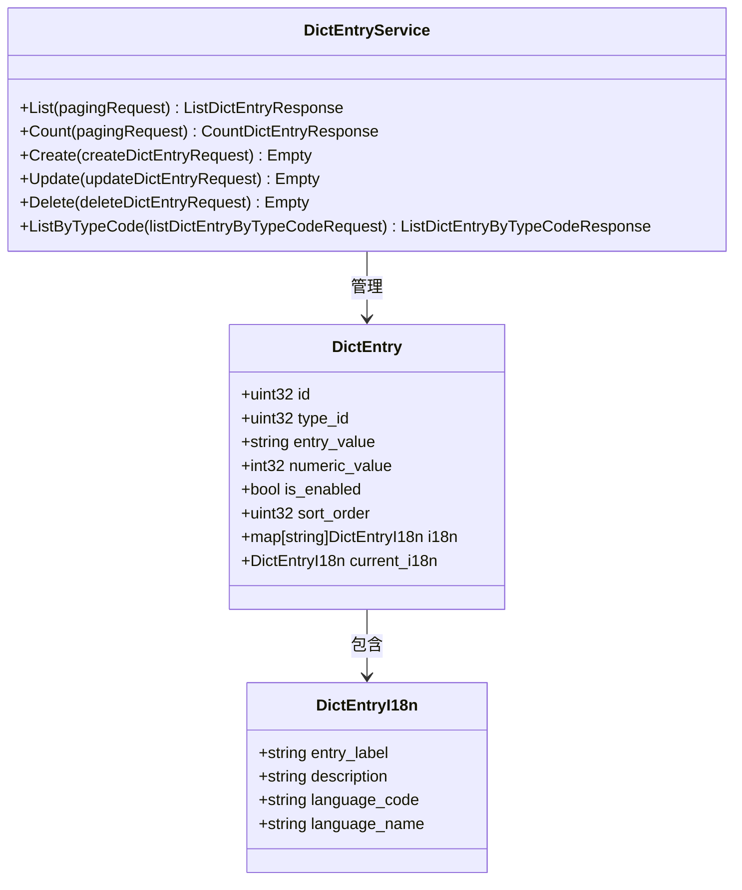
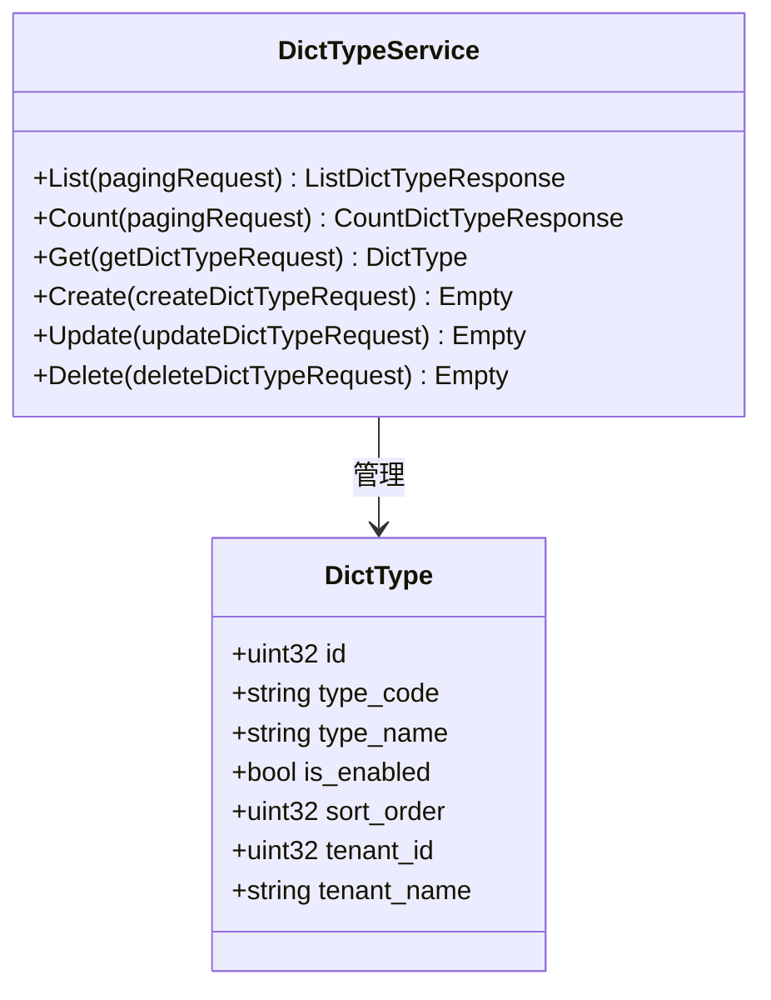
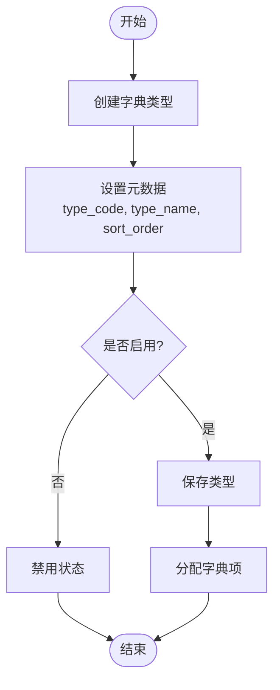
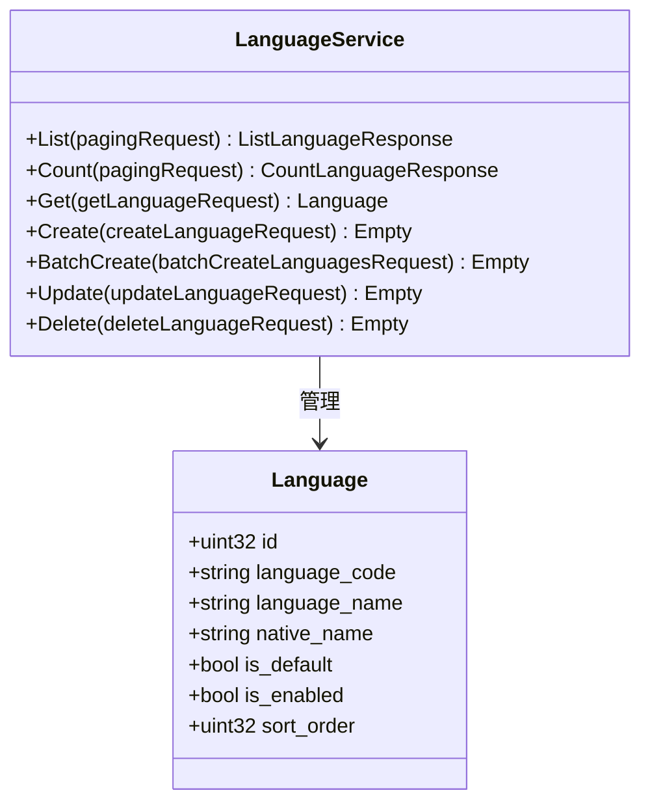
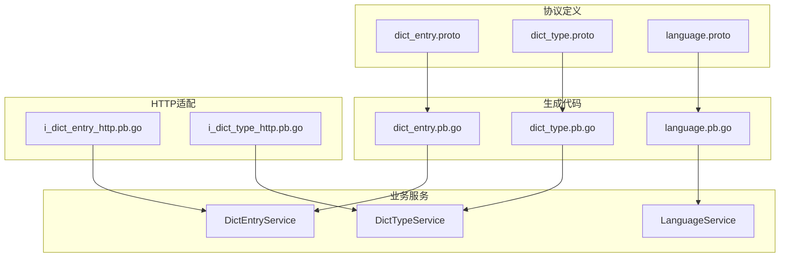

# 字典服务接口

<cite>
**本文档引用的文件**
- [dict_entry.proto](file://backend/api/protos/dict/service/v1/dict_entry.proto)
- [dict_type.proto](file://backend/api/protos/dict/service/v1/dict_type.proto)
- [language.proto](file://backend/api/protos/dict/service/v1/language.proto)
- [dict_entry.pb.go](file://backend/api/gen/go/dict/service/v1/dict_entry.pb.go)
- [dict_type.pb.go](file://backend/api/gen/go/dict/service/v1/dict_type.pb.go)
- [language.pb.go](file://backend/api/gen/go/dict/service/v1/language.pb.go)
- [i_dict_entry_http.pb.go](file://backend/api/gen/go/admin/service/v1/i_dict_entry_http.pb.go)
- [i_dict_type_http.pb.go](file://backend/api/gen/go/admin/service/v1/i_dict_type_http.pb.go)
</cite>

## 目录
1. [简介](#简介)
2. [项目结构](#项目结构)
3. [核心组件](#核心组件)
4. [架构概览](#架构概览)
5. [详细组件分析](#详细组件分析)
6. [依赖关系分析](#依赖关系分析)
7. [性能考虑](#性能考虑)
8. [故障排除指南](#故障排除指南)
9. [结论](#结论)

## 简介

字典服务接口是Go-Wind管理系统中的核心数据字典管理模块，提供了完整的字典类型管理、字典项管理和多语言支持功能。该服务采用Protocol Buffers定义接口规范，支持GRPC和HTTP两种传输协议，实现了标准化的数据字典管理能力。

本服务主要包含三个核心实体：
- **DictType（字典类型）**：定义字典的分类和元数据
- **DictEntry（字典项）**：具体的数据字典条目，支持多语言国际化
- **Language（语言）**：系统支持的语言配置管理

## 项目结构

字典服务接口采用分层架构设计，主要分为以下层次：

**图表来源**
- [dict_entry.proto:1-203](file://backend/api/protos/dict/service/v1/dict_entry.proto#L1-L203)
- [dict_type.proto:1-135](file://backend/api/protos/dict/service/v1/dict_type.proto#L1-L135)
- [language.proto:1-172](file://backend/api/protos/dict/service/v1/language.proto#L1-L172)

**章节来源**
- [dict_entry.proto:1-203](file://backend/api/protos/dict/service/v1/dict_entry.proto#L1-L203)
- [dict_type.proto:1-135](file://backend/api/protos/dict/service/v1/dict_type.proto#L1-L135)
- [language.proto:1-172](file://backend/api/protos/dict/service/v1/language.proto#L1-L172)

## 核心组件

### DictType（字典类型）

DictType是字典系统的分类基础，定义了字典的元数据和属性：

| 字段名 | 类型 | 必填 | 描述 |
|--------|------|------|------|
| id | uint32 | 否 | 字典类型ID |
| type_code | string | 否 | 字典类型唯一编码，如app_type、platform、risk_type |
| type_name | string | 否 | 字典类型名称（中文，仅后台用） |
| is_enabled | bool | 否 | 是否启用 |
| sort_order | uint32 | 否 | 排序号，越小越靠前 |
| tenant_id | uint32 | 否 | 租户ID，0代表系统全局角色 |
| tenant_name | string | 否 | 租户名称 |
| created_by | uint32 | 否 | 创建者用户ID |
| updated_by | uint32 | 否 | 更新者用户ID |
| deleted_by | uint32 | 否 | 删除者用户ID |
| created_at | Timestamp | 否 | 创建时间 |
| updated_at | Timestamp | 否 | 更新时间 |
| deleted_at | Timestamp | 否 | 删除时间 |

### DictEntry（字典项）

DictEntry是具体的字典条目，支持多语言国际化：

| 字段名 | 类型 | 必填 | 描述 |
|--------|------|------|------|
| id | uint32 | 否 | 字典项ID |
| type_id | uint32 | 否 | 字典类型ID |
| entry_value | string | 否 | 字典项的实际值（在字典类型内唯一） |
| numeric_value | int32 | 否 | 数值型值（用于排序、计算等） |
| is_enabled | bool | 否 | 是否启用 |
| sort_order | uint32 | 否 | 排序顺序，值越小越靠前 |
| i18n | map[string]DictEntryI18n | 否 | 多语言信息，key为BCP-47语言标签 |
| current_i18n | DictEntryI18n | 否 | 当前语言的翻译（由服务端自动填充） |
| tenant_id | uint32 | 否 | 租户ID，0代表系统全局角色 |
| tenant_name | string | 否 | 租户名称 |
| created_by | uint32 | 否 | 创建者用户ID |
| updated_by | uint32 | 否 | 更新者用户ID |
| deleted_by | uint32 | 否 | 删除者用户ID |
| created_at | Timestamp | 否 | 创建时间 |
| updated_at | Timestamp | 否 | 更新时间 |
| deleted_at | Timestamp | 否 | 删除时间 |

### DictEntryI18N（字典项多语言）

| 字段名 | 类型 | 必填 | 描述 |
|--------|------|------|------|
| entry_label | string | 是 | 显示标签 |
| description | string | 否 | 描述信息 |
| language_code | string | 否 | 语言代码，如zh-CN、en-US等 |
| language_name | string | 否 | 语言名称 |

### Language（语言）

| 字段名 | 类型 | 必填 | 描述 |
|--------|------|------|------|
| id | uint32 | 否 | 语言ID |
| language_code | string | 否 | 标准语言代码 |
| language_name | string | 否 | 语言名称 |
| native_name | string | 否 | 本地语言名称 |
| is_default | bool | 否 | 是否为默认语言 |
| is_enabled | bool | 否 | 是否启用 |
| sort_order | uint32 | 否 | 排序顺序，值越小越靠前 |
| created_by | uint32 | 否 | 创建者ID |
| updated_by | uint32 | 否 | 更新者ID |
| deleted_by | uint32 | 否 | 删除者用户ID |
| created_at | Timestamp | 否 | 创建时间 |
| updated_at | Timestamp | 否 | 更新时间 |
| deleted_at | Timestamp | 否 | 删除时间 |

**章节来源**
- [dict_entry.proto:34-131](file://backend/api/protos/dict/service/v1/dict_entry.proto#L34-L131)
- [dict_type.proto:34-79](file://backend/api/protos/dict/service/v1/dict_type.proto#L34-L79)
- [language.proto:36-92](file://backend/api/protos/dict/service/v1/language.proto#L36-L92)

## 架构概览

字典服务采用分层架构，从接口定义到实现的完整流程如下：

**图表来源**
- [i_dict_entry_http.pb.go:53-92](file://backend/api/gen/go/admin/service/v1/i_dict_entry_http.pb.go#L53-L92)
- [i_dict_type_http.pb.go:54-137](file://backend/api/gen/go/admin/service/v1/i_dict_type_http.pb.go#L54-L137)

## 详细组件分析

### DictEntryService（字典项服务）

DictEntryService提供了完整的字典项管理功能：

**图表来源**
- [dict_entry.proto:14-32](file://backend/api/protos/dict/service/v1/dict_entry.proto#L14-L32)
- [dict_entry.proto:34-131](file://backend/api/protos/dict/service/v1/dict_entry.proto#L34-L131)

#### 增删改查操作示例

**创建字典项**
1. 准备DictEntry对象，设置type_id、entry_value等基本信息
2. 可选设置numeric_value进行排序
3. 配置i18n多语言信息
4. 调用Create方法创建

**查询字典项**
- 使用List方法进行分页查询
- 使用Get方法根据ID或value查询
- 使用ListByTypeCode按类型编码查询

**更新字典项**
- 支持部分字段更新，通过update_mask指定更新字段
- 支持allow_missing参数进行智能创建/更新

**删除字典项**
- 支持单个删除和批量删除

**章节来源**
- [dict_entry.proto:14-32](file://backend/api/protos/dict/service/v1/dict_entry.proto#L14-L32)
- [dict_entry.pb.go:797-804](file://backend/api/gen/go/dict/service/v1/dict_entry.pb.go#L797-L804)

### DictTypeService（字典类型服务）

DictTypeService负责字典类型的生命周期管理：

**图表来源**
- [dict_type.proto:14-32](file://backend/api/protos/dict/service/v1/dict_type.proto#L14-L32)
- [dict_type.proto:34-79](file://backend/api/protos/dict/service/v1/dict_type.proto#L34-L79)

#### 字典类型管理流程

**章节来源**
- [dict_type.proto:14-32](file://backend/api/protos/dict/service/v1/dict_type.proto#L14-L32)
- [dict_type.pb.go:586-594](file://backend/api/gen/go/dict/service/v1/dict_type.pb.go#L586-L594)

### LanguageService（语言服务）

LanguageService管理系统的多语言配置：

**图表来源**
- [language.proto:14-34](file://backend/api/protos/dict/service/v1/language.proto#L14-L34)
- [language.proto:36-92](file://backend/api/protos/dict/service/v1/language.proto#L36-L92)

#### 国际化字典使用方法

1. **配置语言**：通过LanguageService配置系统支持的语言
2. **设置默认语言**：通过is_default标记设置系统默认语言
3. **配置字典项多语言**：在DictEntry的i18n字段中添加各语言的entry_label
4. **动态切换语言**：通过ListByTypeCode接口的local参数指定语言环境

**章节来源**
- [language.proto:14-34](file://backend/api/protos/dict/service/v1/language.proto#L14-L34)
- [language.pb.go:702-711](file://backend/api/gen/go/dict/service/v1/language.pb.go#L702-L711)

## 依赖关系分析

字典服务各组件之间的依赖关系如下：

**图表来源**
- [dict_entry.proto:1-203](file://backend/api/protos/dict/service/v1/dict_entry.proto#L1-L203)
- [dict_type.proto:1-135](file://backend/api/protos/dict/service/v1/dict_type.proto#L1-L135)
- [language.proto:1-172](file://backend/api/protos/dict/service/v1/language.proto#L1-L172)

**章节来源**
- [i_dict_entry_http.pb.go:53-92](file://backend/api/gen/go/admin/service/v1/i_dict_entry_http.pb.go#L53-L92)
- [i_dict_type_http.pb.go:54-137](file://backend/api/gen/go/admin/service/v1/i_dict_type_http.pb.go#L54-L137)

## 性能考虑

### 缓存策略

字典服务采用了多层次的缓存策略来提升性能：

1. **内存缓存**：热点字典数据缓存在内存中
2. **分布式缓存**：支持Redis等分布式缓存
3. **数据库查询优化**：使用索引和预加载机制

### 查询优化

- **分页查询**：默认使用分页机制避免大数据量查询
- **字段选择**：支持FieldMask只返回需要的字段
- **批量操作**：提供批量创建和删除接口

### 并发处理

- **读写分离**：查询和写入操作分离处理
- **连接池**：数据库连接池管理
- **异步处理**：非关键操作异步执行

## 故障排除指南

### 常见问题及解决方案

**1. 字典项重复错误**
- 检查entry_value在相同type_id下是否唯一
- 验证字典类型配置

**2. 多语言显示异常**
- 确认language_code格式符合BCP-47标准
- 检查i18n字段数据完整性

**3. 查询结果为空**
- 验证分页参数设置
- 检查过滤条件是否正确

**4. 性能问题**
- 检查缓存配置
- 优化数据库索引
- 调整批量操作大小

**章节来源**
- [dict_entry.proto:76-82](file://backend/api/protos/dict/service/v1/dict_entry.proto#L76-L82)
- [language.proto:74-83](file://backend/api/protos/dict/service/v1/language.proto#L74-L83)

## 结论

字典服务接口提供了完整、标准化的数据字典管理能力，具有以下特点：

1. **标准化接口**：基于Protocol Buffers定义，支持多种编程语言
2. **国际化支持**：内置多语言管理机制
3. **高性能设计**：采用缓存和优化策略
4. **易扩展性**：清晰的分层架构便于功能扩展

该服务为Go-Wind管理系统提供了坚实的数据字典基础，支持各种业务场景下的配置管理和数据维护需求。