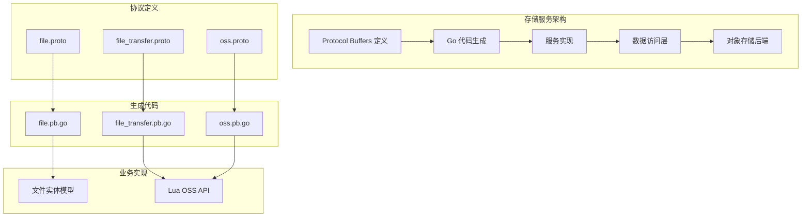
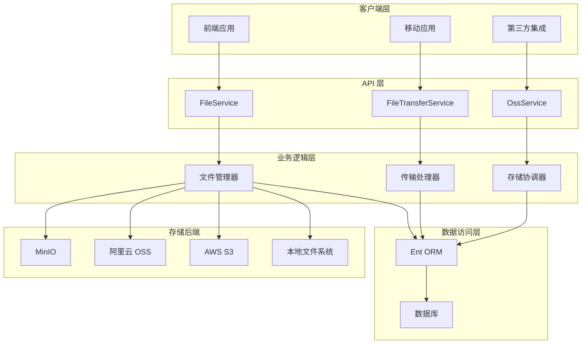
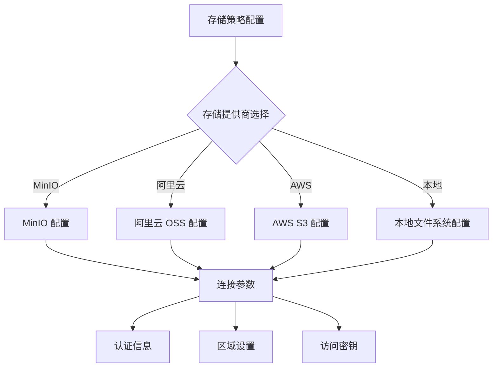
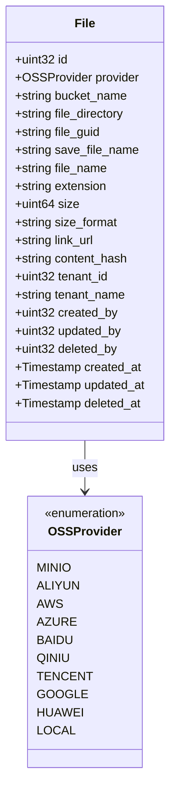
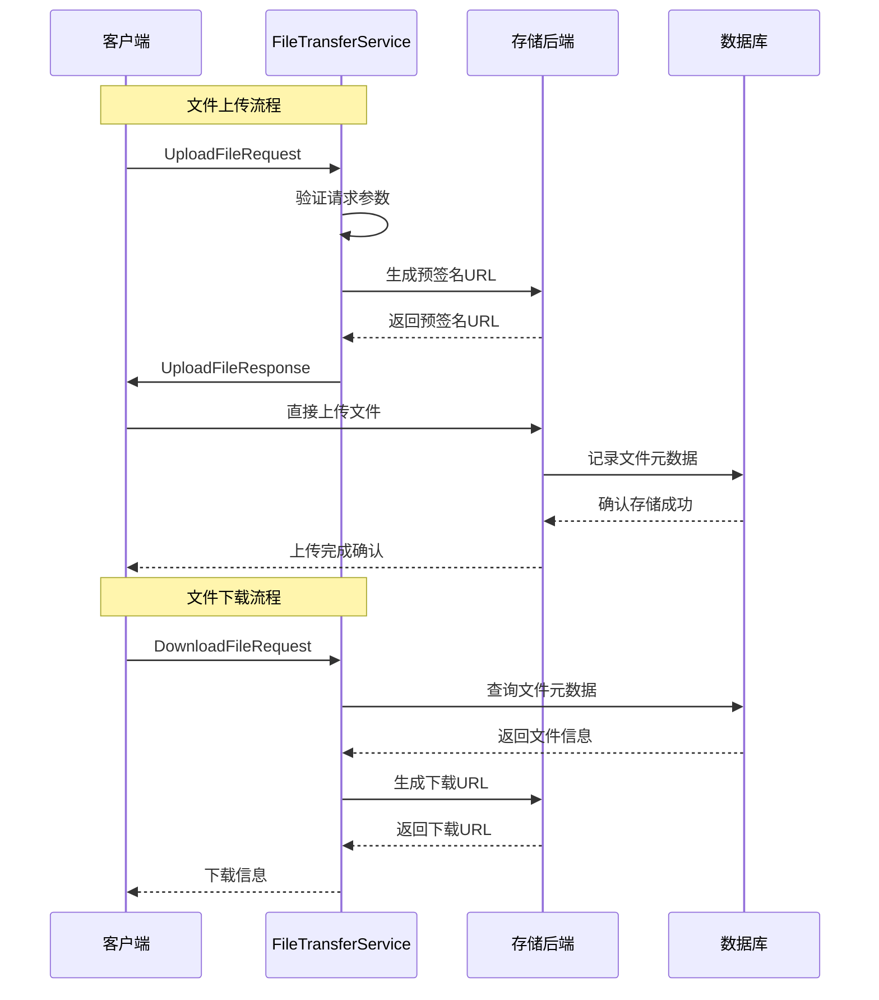
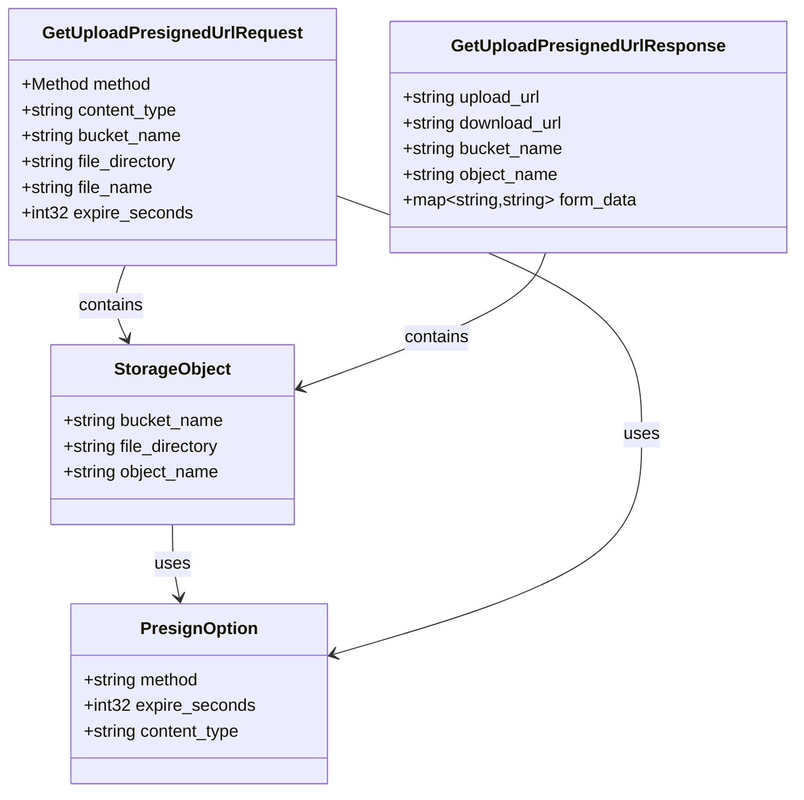
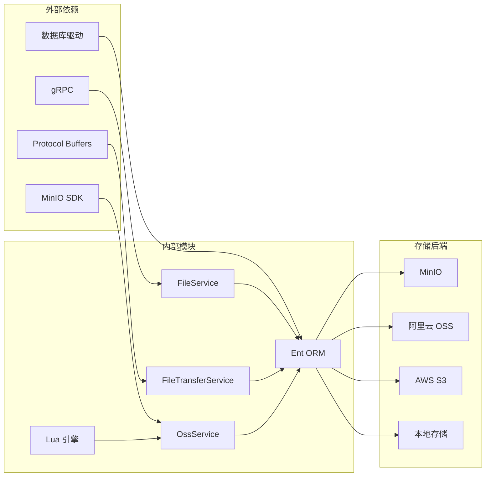

# 存储服务接口

<cite>
**本文档引用的文件**
- [file.proto](file://backend/api/protos/storage/service/v1/file.proto)
- [file_transfer.proto](file://backend/api/protos/storage/service/v1/file_transfer.proto)
- [oss.proto](file://backend/api/protos/storage/service/v1/oss.proto)
- [file.pb.go](file://backend/api/gen/go/storage/service/v1/file.pb.go)
- [file_transfer.pb.go](file://backend/api/gen/go/storage/service/v1/file_transfer.pb.go)
- [oss.pb.go](file://backend/api/gen/go/storage/service/v1/oss.pb.go)
- [file.go](file://backend/app/admin/service/internal/data/ent/schema/file.go)
- [oss.go](file://backend/pkg/lua/api/oss.go)
</cite>

## 目录
1. [简介](#简介)
2. [项目结构](#项目结构)
3. [核心组件](#核心组件)
4. [架构概览](#架构概览)
5. [详细组件分析](#详细组件分析)
6. [依赖关系分析](#依赖关系分析)
7. [性能考虑](#性能考虑)
8. [故障排除指南](#故障排除指南)
9. [结论](#结论)

## 简介

存储服务接口是 Go-Wind 系统中的核心组件，负责管理文件上传、下载、删除和元数据管理等核心功能。该服务提供了统一的对象存储抽象层，支持多种云存储提供商（如阿里云、AWS、Azure、百度云、七牛云、腾讯云、谷歌云、华为云）以及本地文件系统。

存储服务采用 Protocol Buffers 定义接口规范，通过 gRPC 提供高性能的远程过程调用能力。服务设计遵循微服务架构原则，实现了存储策略配置和对象存储集成的灵活性。

## 项目结构

存储服务接口主要由以下三个核心部分组成：

**图表来源**
- [file.proto:1-208](file://backend/api/protos/storage/service/v1/file.proto#L1-L208)
- [file_transfer.proto:1-164](file://backend/api/protos/storage/service/v1/file_transfer.proto#L1-L164)
- [oss.proto:1-276](file://backend/api/protos/storage/service/v1/oss.proto#L1-L276)

**章节来源**
- [file.proto:1-208](file://backend/api/protos/storage/service/v1/file.proto#L1-L208)
- [file_transfer.proto:1-164](file://backend/api/protos/storage/service/v1/file_transfer.proto#L1-L164)
- [oss.proto:1-276](file://backend/api/protos/storage/service/v1/oss.proto#L1-L276)

## 核心组件

### 文件服务 (FileService)

文件服务提供完整的文件生命周期管理功能，包括文件的增删改查操作。

**核心功能特性：**
- 文件列表查询和分页
- 文件数量统计
- 文件元数据管理
- 支持字段级更新和视图过滤

**关键接口：**
- `List`: 获取文件列表
- `Count`: 统计文件数量  
- `Get`: 获取单个文件详情
- `Create`: 创建新文件记录
- `Update`: 更新文件元数据
- `Delete`: 删除文件记录

### 文件传输服务 (FileTransferService)

文件传输服务专注于文件的上传和下载操作，提供灵活的传输机制。

**核心功能特性：**
- 支持直接文件传输和预签名 URL 两种模式
- 断点续传支持
- 分段下载功能
- 多种上传方式（PUT/POST）

**关键接口：**
- `DownloadFile`: 文件下载
- `PutUploadFile`: PUT 方式上传
- `PostUploadFile`: POST 方式上传

### 对象存储服务 (OssService)

对象存储服务提供与各种云存储提供商的集成能力。

**核心功能特性：**
- 多云存储提供商支持
- 预签名 URL 生成
- 文件列表管理和删除
- 自动桶创建和管理

**关键接口：**
- `GetUploadPresignedUrl`: 获取上传预签名 URL
- `GetDownloadUrl`: 获取下载信息
- `ListOssFile`: 列出存储文件
- `DeleteOssFile`: 删除存储文件

**章节来源**
- [file.proto:15-34](file://backend/api/protos/storage/service/v1/file.proto#L15-L34)
- [file_transfer.proto:11-21](file://backend/api/protos/storage/service/v1/file_transfer.proto#L11-L21)
- [oss.proto:8-21](file://backend/api/protos/storage/service/v1/oss.proto#L8-L21)

## 架构概览

存储服务采用分层架构设计，实现了清晰的职责分离和良好的可扩展性。

**图表来源**
- [file.proto:15-34](file://backend/api/protos/storage/service/v1/file.proto#L15-L34)
- [file_transfer.proto:11-21](file://backend/api/protos/storage/service/v1/file_transfer.proto#L11-L21)
- [oss.proto:8-21](file://backend/api/protos/storage/service/v1/oss.proto#L8-L21)

### 存储策略配置

存储策略通过配置文件实现灵活的存储后端切换：

**图表来源**
- [oss.proto:37-49](file://backend/api/protos/storage/service/v1/oss.proto#L37-L49)

**章节来源**
- [oss.proto:1-276](file://backend/api/protos/storage/service/v1/oss.proto#L1-L276)

## 详细组件分析

### 文件实体模型

文件实体模型定义了存储文件的完整元数据结构，支持多租户环境下的文件管理。

**图表来源**
- [file.proto:51-145](file://backend/api/protos/storage/service/v1/file.proto#L51-L145)
- [file.pb.go:101-126](file://backend/api/gen/go/storage/service/v1/file.pb.go#L101-L126)

**核心字段说明：**

| 字段名 | 类型 | 描述 | 用途 |
|--------|------|------|------|
| id | uint32 | 文件ID | 主键标识 |
| provider | OSSProvider | 存储提供商 | 云存储类型标识 |
| bucket_name | string | 存储桶名称 | 云存储桶标识 |
| file_directory | string | 文件目录 | 文件存储路径 |
| file_guid | string | 文件GUID | 唯一文件标识符 |
| save_file_name | string | 实际存储文件名 | 防止文件冲突 |
| file_name | string | 原始文件名 | 用户可见文件名 |
| extension | string | 文件扩展名 | 文件类型识别 |
| size | uint64 | 文件大小 | 存储空间计算 |
| size_format | string | 格式化大小 | 用户界面显示 |
| link_url | string | 链接地址 | 文件访问URL |
| content_hash | string | 内容哈希 | 去重和完整性校验 |
| tenant_id | uint32 | 租户ID | 多租户隔离 |
| tenant_name | string | 租户名称 | 租户标识 |

**章节来源**
- [file.proto:51-145](file://backend/api/protos/storage/service/v1/file.proto#L51-L145)
- [file.pb.go:101-296](file://backend/api/gen/go/storage/service/v1/file.pb.go#L101-L296)
- [file.go:31-101](file://backend/app/admin/service/internal/data/ent/schema/file.go#L31-L101)

### 文件传输流程

文件传输服务提供了灵活的上传下载机制，支持多种传输模式：

**图表来源**
- [file_transfer.proto:11-21](file://backend/api/protos/storage/service/v1/file_transfer.proto#L11-L21)
- [file_transfer.pb.go:528-533](file://backend/api/gen/go/storage/service/v1/file_transfer.pb.go#L528-L533)

**上传场景支持：**

1. **直接上传模式**：客户端直接向存储后端上传文件
2. **预签名URL模式**：服务端生成临时访问凭证，客户端通过预签名URL上传
3. **批量上传模式**：支持多个文件的并发上传处理

**下载场景支持：**

1. **直接下载模式**：服务端直接返回文件内容
2. **预签名URL模式**：服务端生成临时下载链接
3. **分段下载模式**：支持HTTP Range请求实现断点续传

**章节来源**
- [file_transfer.proto:23-164](file://backend/api/protos/storage/service/v1/file_transfer.proto#L23-L164)
- [file_transfer.pb.go:27-421](file://backend/api/gen/go/storage/service/v1/file_transfer.pb.go#L27-L421)

### 对象存储集成

对象存储服务提供了统一的云存储抽象层，支持多种存储提供商：

**图表来源**
- [oss.proto:23-130](file://backend/api/protos/storage/service/v1/oss.proto#L23-L130)

**支持的存储提供商：**

| 供应商 | 代码枚举 | 特点 |
|--------|----------|------|
| MinIO | MINIO | 开源对象存储 |
| 阿里云 | ALIYUN | 中国主流云存储 |
| AWS | AWS | 国际云存储标准 |
| Azure | AZURE | 微软云平台 |
| 百度云 | BAIDU | 本土云服务 |
| 七牛云 | QINIU | 专业对象存储 |
| 腾讯云 | TENCENT | 企业级云存储 |
| 谷歌云 | GOOGLE | Google Cloud Platform |
| 华为云 | HUAWEI | 华为云服务 |
| 本地 | LOCAL | 本地文件系统 |

**章节来源**
- [oss.proto:36-102](file://backend/api/protos/storage/service/v1/oss.proto#L36-L102)
- [oss.pb.go:73-194](file://backend/api/gen/go/storage/service/v1/oss.pb.go#L73-L194)

## 依赖关系分析

存储服务的依赖关系体现了清晰的分层架构：

**图表来源**
- [oss.go:1-223](file://backend/pkg/lua/api/oss.go#L1-L223)

**依赖特点：**

1. **接口定义独立**：Protocol Buffers 定义与具体实现解耦
2. **存储后端可插拔**：通过接口抽象支持多种存储提供商
3. **Lua 脚本集成**：提供脚本化存储操作能力
4. **ORM 抽象**：使用 Ent ORM 统一数据访问层

**章节来源**
- [oss.go:1-223](file://backend/pkg/lua/api/oss.go#L1-L223)

## 性能考虑

存储服务在设计时充分考虑了性能优化：

### 缓存策略
- 文件元数据缓存：热点文件元数据缓存减少数据库查询
- 预签名URL缓存：降低频繁生成URL的开销
- 对象存储连接池：复用存储连接提高吞吐量

### 并发处理
- 异步上传处理：支持多文件并发上传
- 流式下载：大文件分块传输避免内存占用
- 连接池管理：合理配置连接数避免资源耗尽

### 存储优化
- 分布式存储：支持水平扩展的存储架构
- 数据压缩：可选的数据压缩减少存储空间
- 去重机制：基于内容哈希的内容去重

## 故障排除指南

### 常见问题及解决方案

**文件上传失败**
- 检查存储桶权限配置
- 验证预签名URL的有效期
- 确认网络连接稳定性

**文件下载异常**
- 验证文件是否存在且可访问
- 检查预签名URL的过期时间
- 确认客户端的HTTP头设置

**存储后端连接问题**
- 检查存储服务的可用性
- 验证认证凭据的正确性
- 确认防火墙和网络策略

**性能问题诊断**
- 监控存储后端的响应时间
- 分析数据库查询性能
- 检查网络带宽使用情况

**章节来源**
- [oss.go:1-223](file://backend/pkg/lua/api/oss.go#L1-L223)

## 结论

存储服务接口通过精心设计的架构和完善的接口规范，为 Go-Wind 系统提供了强大而灵活的文件管理能力。服务支持多种存储提供商，具备良好的可扩展性和性能表现。

关键优势包括：
- **统一抽象**：通过 Protocol Buffers 提供一致的接口体验
- **多云支持**：灵活的对象存储集成能力
- **高性能**：优化的传输机制和缓存策略
- **易扩展**：模块化的架构便于功能扩展
- **安全可靠**：完善的权限控制和错误处理机制

该存储服务为构建现代化的应用程序提供了坚实的基础，能够满足从个人应用到企业级应用的各种存储需求。