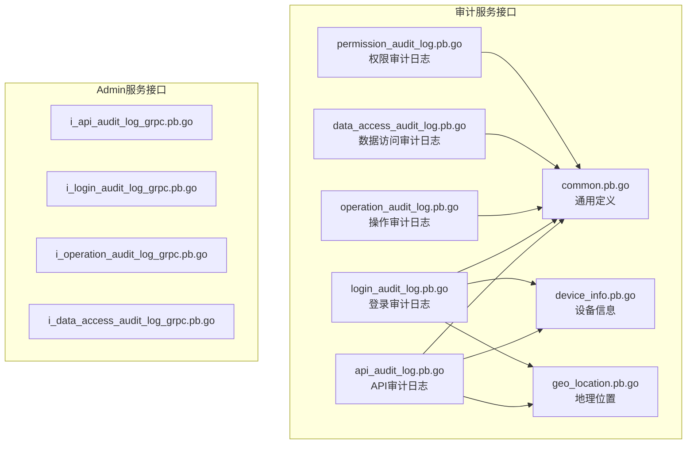
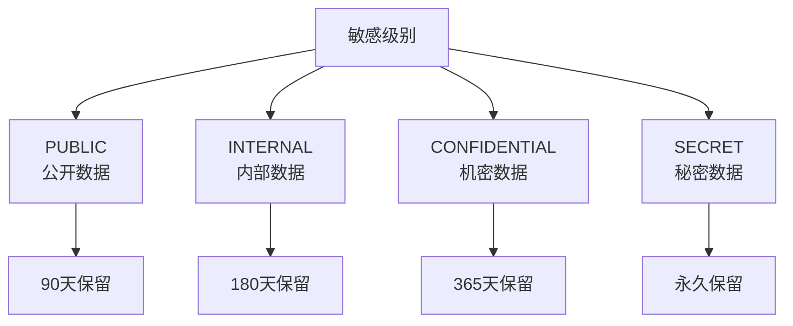
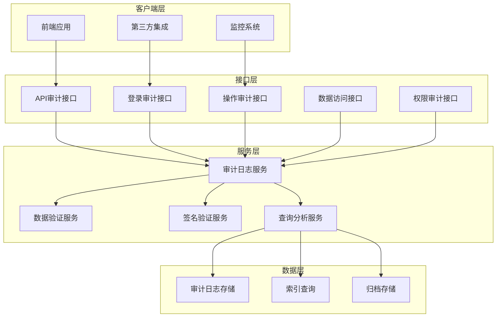
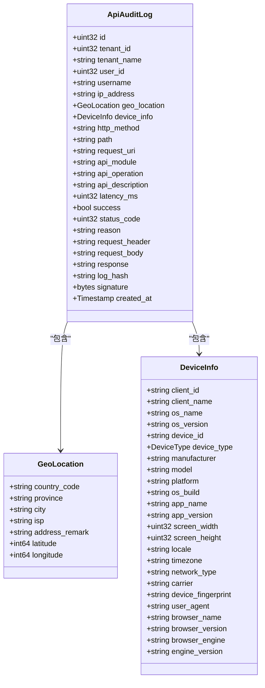
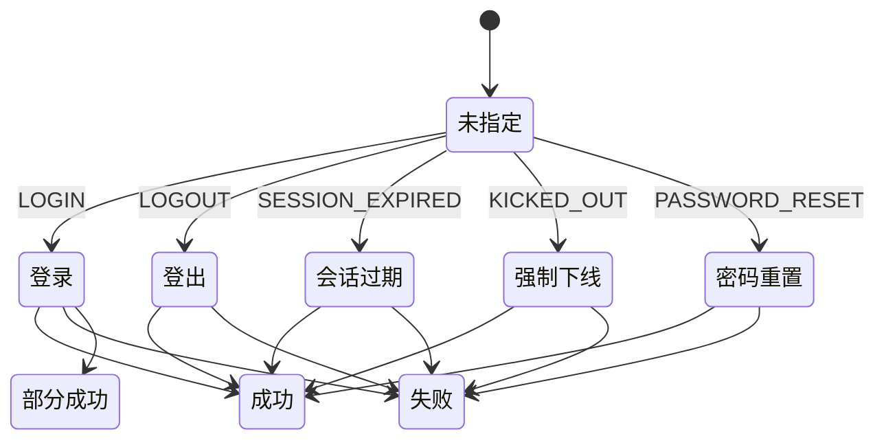
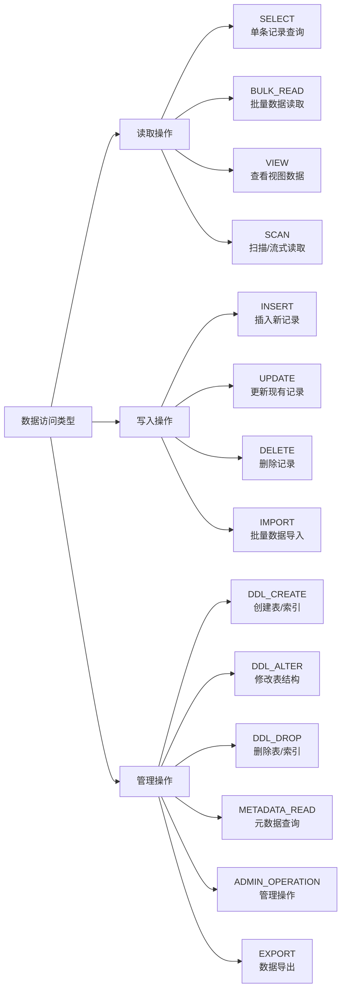
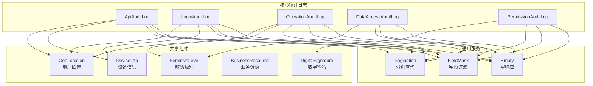
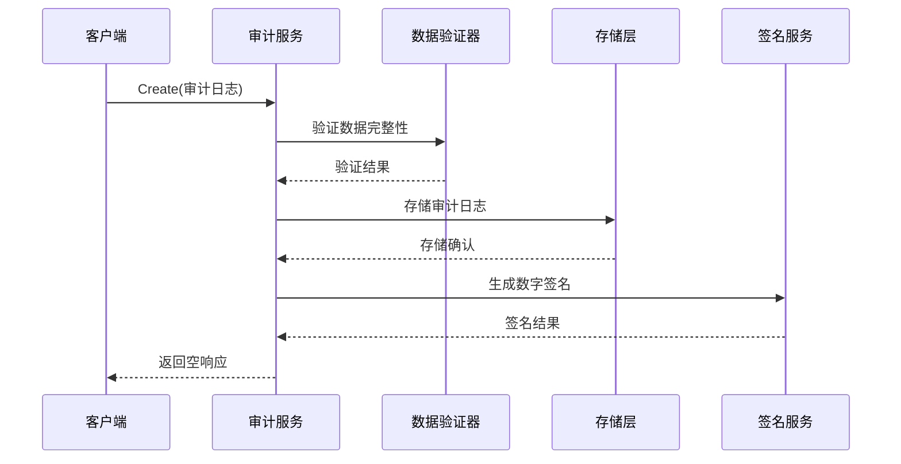

# 审计服务接口

<cite>
**本文档引用的文件**
- [api_audit_log.pb.go](file://backend/api/gen/go/audit/service/v1/api_audit_log.pb.go)
- [login_audit_log.pb.go](file://backend/api/gen/go/audit/service/v1/login_audit_log.pb.go)
- [operation_audit_log.pb.go](file://backend/api/gen/go/audit/service/v1/operation_audit_log.pb.go)
- [data_access_audit_log.pb.go](file://backend/api/gen/go/audit/service/v1/data_access_audit_log.pb.go)
- [permission_audit_log.pb.go](file://backend/api/gen/go/audit/service/v1/permission_audit_log.pb.go)
- [common.pb.go](file://backend/api/gen/go/audit/service/v1/common.pb.go)
- [device_info.pb.go](file://backend/api/gen/go/audit/service/v1/device_info.pb.go)
- [geo_location.pb.go](file://backend/api/gen/go/audit/service/v1/geo_location.pb.go)
- [i_api_audit_log_grpc.pb.go](file://backend/api/gen/go/admin/service/v1/i_api_audit_log_grpc.pb.go)
- [i_login_audit_log_grpc.pb.go](file://backend/api/gen/go/admin/service/v1/i_login_audit_log_grpc.pb.go)
- [i_operation_audit_log_grpc.pb.go](file://backend/api/gen/go/admin/service/v1/i_operation_audit_log_grpc.pb.go)
- [i_data_access_audit_log_grpc.pb.go](file://backend/api/gen/go/admin/service/v1/i_data_access_audit_log_grpc.pb.go)
</cite>

## 目录
1. [简介](#简介)
2. [项目结构](#项目结构)
3. [核心组件](#核心组件)
4. [架构概览](#架构概览)
5. [详细组件分析](#详细组件分析)
6. [依赖关系分析](#依赖关系分析)
7. [性能考虑](#性能考虑)
8. [故障排除指南](#故障排除指南)
9. [结论](#结论)

## 简介

审计服务接口是Go-Wind系统中的重要组成部分，负责收集、存储和管理各种类型的审计日志信息。该服务提供了完整的API审计、登录审计、操作审计、数据访问审计和权限变更审计等功能，确保系统的安全性和合规性。

系统采用Protocol Buffers定义数据结构，通过gRPC提供高性能的远程过程调用接口，并支持HTTP/JSON转换。所有审计日志都包含数字签名和哈希校验，确保数据的完整性和不可篡改性。

## 项目结构

审计服务接口主要位于`backend/api/gen/go/audit/service/v1/`目录下，包含以下核心文件：

**图表来源**
- [api_audit_log.pb.go:30-64](file://backend/api/gen/go/audit/service/v1/api_audit_log.pb.go#L30-L64)
- [login_audit_log.pb.go:259-286](file://backend/api/gen/go/audit/service/v1/login_audit_log.pb.go#L259-L286)
- [operation_audit_log.pb.go:100-125](file://backend/api/gen/go/audit/service/v1/operation_audit_log.pb.go#L100-L125)

**章节来源**
- [api_audit_log.pb.go:1-648](file://backend/api/gen/go/audit/service/v1/api_audit_log.pb.go#L1-L648)
- [login_audit_log.pb.go:1-800](file://backend/api/gen/go/audit/service/v1/login_audit_log.pb.go#L1-L800)
- [operation_audit_log.pb.go:1-644](file://backend/api/gen/go/audit/service/v1/operation_audit_log.pb.go#L1-L644)

## 核心组件

### 审计日志基础模型

所有审计日志都继承自统一的基础架构，包含以下核心字段：

| 字段名称 | 类型 | 描述 | 必填 |
|---------|------|------|------|
| id | uint32 | 审计日志ID | 否 |
| tenant_id | uint32 | 租户ID | 否 |
| tenant_name | string | 租户名称 | 否 |
| user_id | uint32 | 用户ID | 否 |
| username | string | 用户账号名 | 否 |
| request_id | string | 全局请求ID | 否 |
| trace_id | string | 全局链路追踪ID | 否 |
| created_at | Timestamp | 日志创建时间 | 否 |
| log_hash | string | 日志内容哈希 | 否 |
| signature | bytes | 数字签名 | 否 |

### 敏感级别定义

系统定义了四级敏感级别，用于标识数据的敏感程度：

**图表来源**
- [common.pb.go:26-53](file://backend/api/gen/go/audit/service/v1/common.pb.go#L26-L53)

**章节来源**
- [common.pb.go:1-335](file://backend/api/gen/go/audit/service/v1/common.pb.go#L1-L335)

## 架构概览

审计服务采用分层架构设计，包含以下主要层次：

**图表来源**
- [i_api_audit_log_grpc.pb.go:97-113](file://backend/api/gen/go/admin/service/v1/i_api_audit_log_grpc.pb.go#L97-L113)
- [i_login_audit_log_grpc.pb.go:97-113](file://backend/api/gen/go/admin/service/v1/i_login_audit_log_grpc.pb.go#L97-L113)

## 详细组件分析

### API审计日志服务

API审计日志服务负责记录所有API接口的调用情况，包括请求和响应的详细信息。

#### 数据结构定义

**图表来源**
- [api_audit_log.pb.go:30-64](file://backend/api/gen/go/audit/service/v1/api_audit_log.pb.go#L30-L64)
- [geo_location.pb.go:25-37](file://backend/api/gen/go/audit/service/v1/geo_location.pb.go#L25-L37)
- [device_info.pb.go:84-113](file://backend/api/gen/go/audit/service/v1/device_info.pb.go#L84-L113)

#### 核心功能特性

1. **地理位置追踪**: 通过IP地址解析获取精确的地理位置信息
2. **设备指纹识别**: 收集设备特征信息用于安全分析
3. **请求响应记录**: 完整记录HTTP请求和响应的详细信息
4. **性能监控**: 记录API调用的延迟时间和成功率
5. **安全审计**: 提供完整的安全事件追踪能力

**章节来源**
- [api_audit_log.pb.go:30-297](file://backend/api/gen/go/audit/service/v1/api_audit_log.pb.go#L30-L297)

### 登录审计日志服务

登录审计日志服务专门记录用户的登录和登出活动，提供详细的安全事件追踪。

#### 登录事件类型

**图表来源**
- [login_audit_log.pb.go:29-59](file://backend/api/gen/go/audit/service/v1/login_audit_log.pb.go#L29-L59)

#### 风险评估机制

系统内置多维度的风险评估算法，包括：

| 风险因素 | 描述 | 风险等级 |
|---------|------|----------|
| 异地登录 | IP地址与常用位置不符 | HIGH |
| 新设备登录 | 从未见过的设备特征 | MEDIUM |
| 密码尝试次数过多 | 短时间内多次登录失败 | HIGH |
| 异常时间段登录 | 非工作时间或节假日登录 | LOW |
| 异常频率 | 登录频率异常 | MEDIUM |

**章节来源**
- [login_audit_log.pb.go:259-470](file://backend/api/gen/go/audit/service/v1/login_audit_log.pb.go#L259-L470)

### 操作审计日志服务

操作审计日志服务记录用户对业务资源的操作行为，提供细粒度的操作追踪。

#### 操作类型定义

| 操作类型 | 描述 | 示例 |
|---------|------|------|
| CREATE | 创建资源 | 创建用户、订单、产品 |
| UPDATE | 更新资源 | 修改用户信息、更新订单状态 |
| DELETE | 删除资源 | 删除用户、取消订单 |
| READ | 读取资源 | 查看用户详情、查询订单列表 |
| ASSIGN | 分配资源 | 分配角色、授权权限 |
| UNASSIGN | 取消分配 | 取消角色分配、撤销授权 |
| EXPORT | 导出资源 | 导出用户数据、报表导出 |
| IMPORT | 导入资源 | 批量导入用户、数据导入 |
| OTHER | 其他操作 | 特殊业务操作 |

**章节来源**
- [operation_audit_log.pb.go:100-225](file://backend/api/gen/go/audit/service/v1/operation_audit_log.pb.go#L100-L225)

### 数据访问审计日志服务

数据访问审计日志服务专门记录对底层数据存储的访问操作，提供数据库级别的安全监控。

#### 数据访问类型

**图表来源**
- [data_access_audit_log.pb.go:30-53](file://backend/api/gen/go/audit/service/v1/data_access_audit_log.pb.go#L30-L53)

**章节来源**
- [data_access_audit_log.pb.go:122-357](file://backend/api/gen/go/audit/service/v1/data_access_audit_log.pb.go#L122-L357)

### 权限变更审计日志服务

权限变更审计日志服务记录系统中所有权限相关的变更操作，确保权限管理的可追溯性。

#### 权限变更操作

| 操作类型 | 描述 | 使用场景 |
|---------|------|----------|
| GRANT | 授予权限/角色 | 给用户分配新权限 |
| REVOKE | 回收权限/角色 | 撤销用户的某些权限 |
| UPDATE | 修改权限属性 | 更新权限的有效期或条件 |
| RESET | 重置权限 | 将权限恢复到默认状态 |
| CREATE | 创建角色/权限模板 | 新建权限配置模板 |
| DELETE | 删除角色/权限资源 | 移除不再使用的权限 |
| ASSIGN | 分配资源 | 将角色或权限指派给用户或组 |
| UNASSIGN | 取消分配 | 从用户或组移除角色或权限 |
| BULK_GRANT | 批量授予 | 一次性给多个用户授予权限 |
| BULK_REVOKE | 批量回收 | 一次性撤销多个用户的权限 |
| EXPIRE | 权限到期失效 | 系统自动处理过期权限 |
| SUSPEND | 暂停/冻结权限 | 暂时禁用某些权限 |
| RESUME | 恢复已暂停的权限 | 解除权限冻结状态 |
| ROLLBACK | 回滚先前的变更 | 撤销最近的权限变更操作 |

**章节来源**
- [permission_audit_log.pb.go:118-281](file://backend/api/gen/go/audit/service/v1/permission_audit_log.pb.go#L118-L281)

## 依赖关系分析

### 数据模型依赖关系

**图表来源**
- [api_audit_log.pb.go:588-606](file://backend/api/gen/go/audit/service/v1/api_audit_log.pb.go#L588-L606)
- [login_audit_log.pb.go:772-798](file://backend/api/gen/go/audit/service/v1/login_audit_log.pb.go#L772-L798)
- [operation_audit_log.pb.go:580-600](file://backend/api/gen/go/audit/service/v1/operation_audit_log.pb.go#L580-L600)

### 服务接口依赖

所有审计服务都遵循统一的接口模式，提供一致的CRUD操作：

**图表来源**
- [i_api_audit_log_grpc.pb.go:104-113](file://backend/api/gen/go/admin/service/v1/i_api_audit_log_grpc.pb.go#L104-L113)

**章节来源**
- [common.pb.go:252-335](file://backend/api/gen/go/audit/service/v1/common.pb.go#L252-L335)

## 性能考虑

### 存储优化策略

1. **分层存储架构**
   - 热数据：最近30天的审计日志存储在高性能SSD
   - 温数据：30-365天的数据迁移到标准存储
   - 冷数据：超过1年的数据归档到低成本存储

2. **索引优化**
   - 按时间范围建立复合索引
   - 对常用查询字段建立单独索引
   - 实施分区表策略按月或按季度分区

3. **查询优化**
   - 支持字段过滤，减少不必要的数据传输
   - 提供聚合查询接口，支持统计分析
   - 实施查询缓存机制

### 安全保障措施

1. **数据完整性保护**
   - SHA-256哈希算法确保数据完整性
   - ECDSA数字签名防止数据篡改
   - 唯一性约束防止重复记录

2. **隐私保护机制**
   - 敏感字段自动脱敏处理
   - 最小化数据收集原则
   - 合规的数据保留策略

3. **访问控制**
   - 基于角色的权限控制
   - 审计日志的只读访问
   - 操作权限分离

## 故障排除指南

### 常见问题及解决方案

#### 1. 审计日志丢失问题

**症状**: 查询不到预期的审计日志记录

**可能原因**:
- 数据保留期已过期
- 查询条件过于严格
- 存储系统故障

**解决步骤**:
1. 检查数据保留策略配置
2. 验证查询时间范围
3. 确认存储系统状态
4. 检查索引完整性

#### 2. 数字签名验证失败

**症状**: 审计日志显示为未验证状态

**可能原因**:
- 签名算法不匹配
- 时间戳超出允许范围
- 数据被意外修改

**解决步骤**:
1. 验证签名算法配置
2. 检查系统时间同步
3. 确认数据完整性
4. 重新生成签名

#### 3. 性能问题

**症状**: 审计查询响应缓慢

**可能原因**:
- 缺少必要的索引
- 查询条件不优化
- 存储空间不足

**解决步骤**:
1. 分析查询执行计划
2. 添加适当的索引
3. 优化查询条件
4. 清理历史数据

**章节来源**
- [common.pb.go:82-136](file://backend/api/gen/go/audit/service/v1/common.pb.go#L82-L136)

## 结论

审计服务接口为Go-Wind系统提供了全面、可靠、安全的审计能力。通过标准化的数据模型、完善的接口设计和严格的安全保障，系统能够满足各种合规要求和安全审计需求。

### 主要优势

1. **完整性**: 提供从API调用到权限变更的全方位审计覆盖
2. **安全性**: 数字签名和哈希校验确保数据不可篡改
3. **可扩展性**: 模块化的架构设计便于功能扩展
4. **合规性**: 符合各种行业标准和法规要求
5. **性能**: 优化的存储和查询机制保证高效运行

### 未来发展方向

1. **AI驱动的安全分析**: 集成机器学习算法进行异常检测
2. **实时告警**: 建立实时威胁检测和告警机制
3. **可视化分析**: 提供直观的审计数据分析界面
4. **自动化合规**: 自动生成合规报告和审计证据

通过持续优化和改进，审计服务接口将继续为Go-Wind系统的安全稳定运行提供坚实保障。