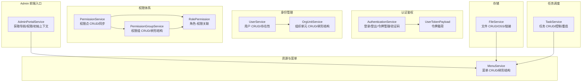
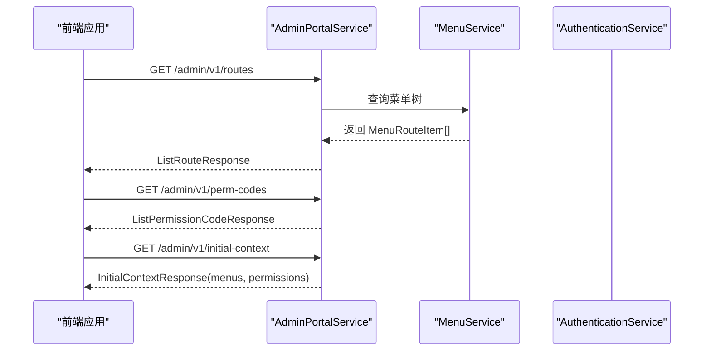
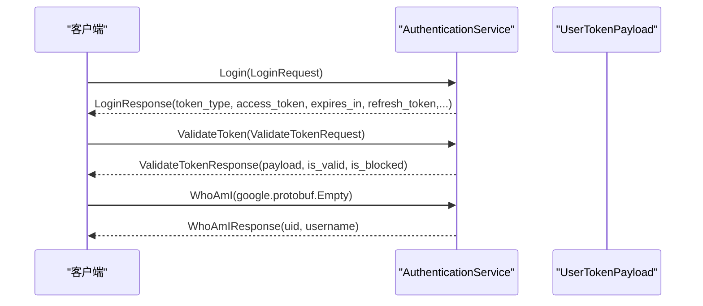
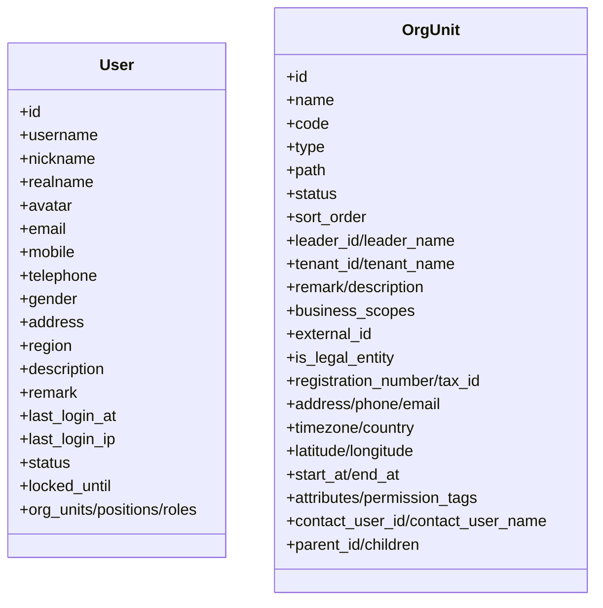
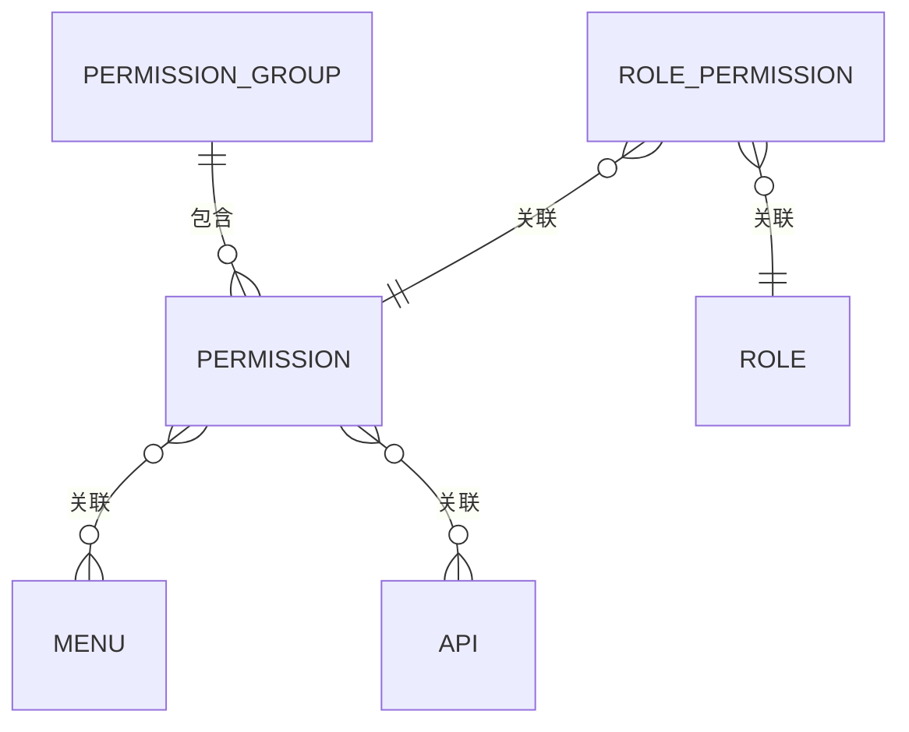
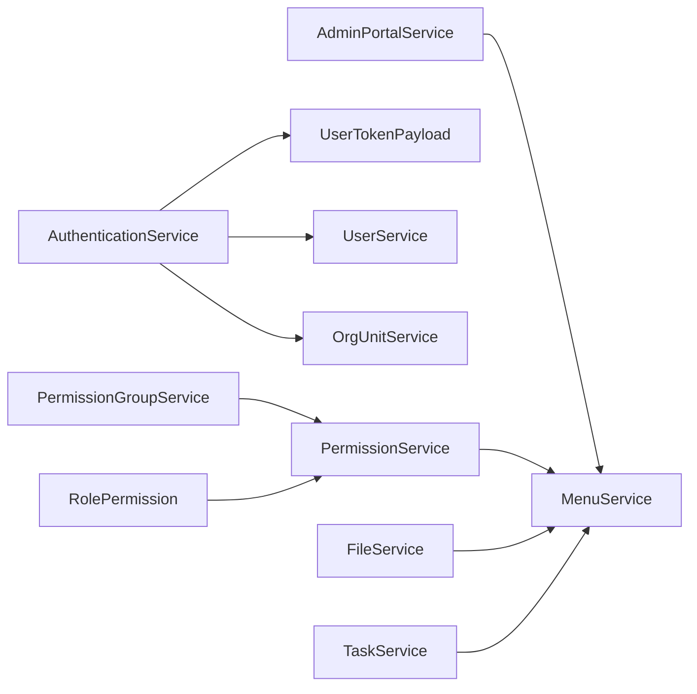

# 服务接口规范

<cite>
**本文引用的文件**
- [i_admin_portal.proto](file://backend/api/protos/admin/service/v1/i_admin_portal.proto)
- [authentication.proto](file://backend/api/protos/authentication/service/v1/authentication.proto)
- [user_token.proto](file://backend/api/protos/authentication/service/v1/user_token.proto)
- [user.proto](file://backend/api/protos/identity/service/v1/user.proto)
- [org_unit.proto](file://backend/api/protos/identity/service/v1/org_unit.proto)
- [permission.proto](file://backend/api/protos/permission/service/v1/permission.proto)
- [permission_group.proto](file://backend/api/protos/permission/service/v1/permission_group.proto)
- [role_permission.proto](file://backend/api/protos/permission/service/v1/role_permission.proto)
- [menu.proto](file://backend/api/protos/resource/service/v1/menu.proto)
- [file.proto](file://backend/api/protos/storage/service/v1/file.proto)
- [task.proto](file://backend/api/protos/task/service/v1/task.proto)
</cite>

## 目录
1. [简介](#简介)
2. [项目结构](#项目结构)
3. [核心组件](#核心组件)
4. [架构总览](#架构总览)
5. [详细组件分析](#详细组件分析)
6. [依赖关系分析](#依赖关系分析)
7. [性能考量](#性能考量)
8. [故障排查指南](#故障排查指南)
9. [结论](#结论)
10. [附录](#附录)

## 简介
本文件面向 GoWind Admin 的后端服务接口规范，覆盖 Admin Portal、Authentication、Identity、Permission、Storage、Task 等核心服务的 gRPC 接口定义与 HTTP/JSON 映射机制。文档从接口设计原则、请求响应模式、流式处理、参数校验、错误码与异常处理等方面进行系统化说明，并提供调用示例与最佳实践，帮助开发者正确集成与扩展。

## 项目结构
- 接口定义采用 Protocol Buffers（proto3），按领域拆分为多个子目录，每个服务对应独立的 proto 文件。
- 使用 Google APIs 注解将 gRPC 映射为 RESTful HTTP 接口，便于前端直连与网关代理。
- 通用分页模型与字段掩码（FieldMask）广泛用于查询与更新场景，提升灵活性与性能。

图表来源
- [i_admin_portal.proto:11-32](file://backend/api/protos/admin/service/v1/i_admin_portal.proto#L11-L32)
- [authentication.proto:21-60](file://backend/api/protos/authentication/service/v1/authentication.proto#L21-L60)
- [user_token.proto:10-87](file://backend/api/protos/authentication/service/v1/user_token.proto#L10-L87)
- [user.proto:15-38](file://backend/api/protos/identity/service/v1/user.proto#L15-L38)
- [org_unit.proto:13-34](file://backend/api/protos/identity/service/v1/org_unit.proto#L13-L34)
- [permission.proto:14-35](file://backend/api/protos/permission/service/v1/permission.proto#L14-L35)
- [permission_group.proto:14-32](file://backend/api/protos/permission/service/v1/permission_group.proto#L14-L32)
- [role_permission.proto:9-70](file://backend/api/protos/permission/service/v1/role_permission.proto#L9-L70)
- [menu.proto:16-34](file://backend/api/protos/resource/service/v1/menu.proto#L16-L34)
- [file.proto:16-34](file://backend/api/protos/storage/service/v1/file.proto#L16-L34)
- [task.proto:17-50](file://backend/api/protos/task/service/v1/task.proto#L17-L50)

章节来源
- [i_admin_portal.proto:11-32](file://backend/api/protos/admin/service/v1/i_admin_portal.proto#L11-L32)
- [authentication.proto:21-60](file://backend/api/protos/authentication/service/v1/authentication.proto#L21-L60)
- [user.proto:15-38](file://backend/api/protos/identity/service/v1/user.proto#L15-L38)
- [permission.proto:14-35](file://backend/api/protos/permission/service/v1/permission.proto#L14-L35)
- [menu.proto:16-34](file://backend/api/protos/resource/service/v1/menu.proto#L16-L34)
- [file.proto:16-34](file://backend/api/protos/storage/service/v1/file.proto#L16-L34)
- [task.proto:17-50](file://backend/api/protos/task/service/v1/task.proto#L17-L50)

## 核心组件
- Admin Portal：提供前端初始化所需的数据与配置，包括导航路由、权限码与初始上下文。
- Authentication：提供登录、登出、令牌刷新、令牌校验、访问令牌列表、令牌拉黑/解封、验证码生/验等功能。
- Identity：提供用户与组织单元的增删改查、批量创建、存在性判断等能力。
- Permission：提供权限点与权限组的增删改查、树形结构、同步能力，以及角色-权限关联。
- Resource/Menu：提供菜单树与路由元信息，支撑前端路由与权限控制。
- Storage/File：提供文件元数据管理、OSS 提供商抽象、链接生成与内容哈希。
- Task：提供调度任务的增删改查、类型名枚举、全量启停与控制。

章节来源
- [i_admin_portal.proto:11-47](file://backend/api/protos/admin/service/v1/i_admin_portal.proto#L11-L47)
- [authentication.proto:21-60](file://backend/api/protos/authentication/service/v1/authentication.proto#L21-L60)
- [user.proto:15-38](file://backend/api/protos/identity/service/v1/user.proto#L15-L38)
- [permission.proto:14-35](file://backend/api/protos/permission/service/v1/permission.proto#L14-L35)
- [menu.proto:16-34](file://backend/api/protos/resource/service/v1/menu.proto#L16-L34)
- [file.proto:16-34](file://backend/api/protos/storage/service/v1/file.proto#L16-L34)
- [task.proto:17-50](file://backend/api/protos/task/service/v1/task.proto#L17-L50)

## 架构总览
- gRPC 服务通过 Google APIs 注解暴露 HTTP/JSON 接口，遵循 REST 映射约定，便于跨语言与跨系统集成。
- 令牌与鉴权通过 UserTokenPayload 统一承载用户身份、角色、数据范围等信息，支持多租户与多客户端场景。
- 权限体系采用树形结构（菜单、权限组、角色-权限）实现灵活的权限编排与继承。
- 存储与任务服务与资源服务协同，形成完整的后台管理闭环。

图表来源
- [i_admin_portal.proto:13-31](file://backend/api/protos/admin/service/v1/i_admin_portal.proto#L13-L31)
- [menu.proto:317-367](file://backend/api/protos/resource/service/v1/menu.proto#L317-L367)

章节来源
- [i_admin_portal.proto:11-47](file://backend/api/protos/admin/service/v1/i_admin_portal.proto#L11-L47)
- [menu.proto:16-34](file://backend/api/protos/resource/service/v1/menu.proto#L16-L34)

## 详细组件分析

### Admin Portal 服务接口
- 服务方法
  - GetNavigation：返回前端路由表（MenuRouteItem 列表）
  - GetMyPermissionCode：返回当前用户权限码列表
  - GetInitialContext：一次性返回菜单树与权限码集合，供前端初始化
- HTTP 映射
  - GET /admin/v1/routes
  - GET /admin/v1/perm-codes
  - GET /admin/v1/initial-context
- 参数与返回
  - 请求均为 Empty，返回分别为 ListRouteResponse、ListPermissionCodeResponse、InitialContextResponse
- 使用建议
  - 前端在进入后台时先调用 GetInitialContext，再按需调用其他接口
  - 权限码用于前端按钮级权限控制

章节来源
- [i_admin_portal.proto:11-47](file://backend/api/protos/admin/service/v1/i_admin_portal.proto#L11-L47)

### Authentication 认证服务接口
- 服务方法
  - Login：用户名/邮箱/手机 + 密码登录，支持多种授权类型
  - Logout：用户登出
  - RefreshToken：刷新访问令牌
  - ValidateToken：校验令牌有效性与黑名单状态
  - GetAccessTokens：获取用户所有访问令牌
  - RevokeTokenById：按令牌 JTI 撤销（管理员）
  - BlockToken/UnblockToken：令牌拉黑/解封
  - WhoAmI：获取当前用户身份
  - GenerateCaptcha/VerifyCaptcha：图形验证码生/验
- HTTP 映射
  - 通过 google.api.http 注解映射为 REST 接口（具体路径以各服务实现为准）
- 关键参数与约束
  - LoginRequest 支持 password、authorization_code、refresh_token 等授权类型，oneof 标识用户名/邮箱/手机三选一
  - ValidateTokenRequest 支持跳过 Redis 校验与黑名单校验的开关
  - BlockTokenRequest 支持明文 token 或 token_id（推荐）两种目标形式
- 令牌载荷
  - UserTokenPayload 统一承载 uid、tid、cid、device_id、roles、data_scope、org_unit_id、is_platform_admin、is_tenant_admin、jti 等字段

图表来源
- [authentication.proto:21-60](file://backend/api/protos/authentication/service/v1/authentication.proto#L21-L60)
- [authentication.proto:262-329](file://backend/api/protos/authentication/service/v1/authentication.proto#L262-L329)
- [authentication.proto:376-391](file://backend/api/protos/authentication/service/v1/authentication.proto#L376-L391)
- [user_token.proto:10-87](file://backend/api/protos/authentication/service/v1/user_token.proto#L10-L87)

章节来源
- [authentication.proto:21-60](file://backend/api/protos/authentication/service/v1/authentication.proto#L21-L60)
- [authentication.proto:262-329](file://backend/api/protos/authentication/service/v1/authentication.proto#L262-L329)
- [authentication.proto:376-391](file://backend/api/protos/authentication/service/v1/authentication.proto#L376-L391)
- [user_token.proto:10-87](file://backend/api/protos/authentication/service/v1/user_token.proto#L10-L87)

### Identity 身份管理接口
- UserService
  - List/Count/Get/Create/BatchCreate/Update/Delete/UserExists
  - 支持 FieldMask 控制返回字段，allow_missing 控制缺失资源时的插入行为
- OrgUnitService
  - List/Count/Get/Create/Update/Delete/BatchCreate
  - 支持树形结构（children）、外部 ID、法定主体、地理坐标、时区、业务范围等扩展属性
- 关键字段
  - User：包含组织/职位/角色/状态/最近登录信息等
  - OrgUnit：包含类型、路径、负责人、业务范围、外部 ID、法定主体、地址/电话/邮箱、时区/国家、经纬度、生效时间、自定义属性等

图表来源
- [user.proto:41-211](file://backend/api/protos/identity/service/v1/user.proto#L41-L211)
- [org_unit.proto:37-182](file://backend/api/protos/identity/service/v1/org_unit.proto#L37-L182)

章节来源
- [user.proto:15-38](file://backend/api/protos/identity/service/v1/user.proto#L15-L38)
- [org_unit.proto:13-34](file://backend/api/protos/identity/service/v1/org_unit.proto#L13-L34)

### Permission 权限体系接口
- PermissionService
  - List/Count/Get/Create/Update/Delete/SyncPermissions
- PermissionGroupService
  - List/Count/Get/Create/Update/Delete（树形结构）
- RolePermission
  - 角色-权限关联，支持 ALLOW/DENY、优先级、状态、租户、时间戳等
- 使用要点
  - 权限点与菜单/API 资源可建立关联，支持细粒度权限控制
  - 支持按组聚合与树形展示，便于管理与审计

图表来源
- [permission.proto:14-35](file://backend/api/protos/permission/service/v1/permission.proto#L14-L35)
- [permission_group.proto:14-32](file://backend/api/protos/permission/service/v1/permission_group.proto#L14-L32)
- [role_permission.proto:9-70](file://backend/api/protos/permission/service/v1/role_permission.proto#L9-L70)

章节来源
- [permission.proto:14-35](file://backend/api/protos/permission/service/v1/permission.proto#L14-L35)
- [permission_group.proto:14-32](file://backend/api/protos/permission/service/v1/permission_group.proto#L14-L32)
- [role_permission.proto:9-70](file://backend/api/protos/permission/service/v1/role_permission.proto#L9-L70)

### Resource/Menu 菜单接口
- MenuService
  - List/Count/Get/Create/Update/Delete
  - 支持树形结构（children）、路由元信息（meta）等
- MenuRouteItem
  - 用于 Admin Portal 的前端路由表输出，包含 path/name/component/meta 等

章节来源
- [menu.proto:16-34](file://backend/api/protos/resource/service/v1/menu.proto#L16-L34)
- [menu.proto:317-367](file://backend/api/protos/resource/service/v1/menu.proto#L317-L367)

### Storage/File 文件接口
- FileService
  - List/Count/Get/Create/Update/Delete
  - 支持 OSS 提供商枚举、桶名、目录、GUID、存储名、原始名、扩展名、大小、链接、内容哈希、租户等
- 使用建议
  - 通过 provider/bucket/file_directory/file_guid/save_file_name/file_name/extension/size/link_url/content_hash 等字段统一管理文件生命周期与访问

章节来源
- [file.proto:16-34](file://backend/api/protos/storage/service/v1/file.proto#L16-L34)
- [file.proto:52-145](file://backend/api/protos/storage/service/v1/file.proto#L52-L145)

### Task 任务调度接口
- TaskService
  - List/Count/Get/Create/Update/Delete
  - ListTaskTypeName/RestartAllTask/StartAllTask/StopAllTask/ControlTask
- Task/TaskOption
  - 支持类型（周期/延时/等待结果）、cron 表达式、选项（重试/超时/截止/延迟/唯一锁/保留/分组/任务ID）、启用状态、备注、租户等
- 使用建议
  - 通过 type_name 与 cron_spec 精准调度任务，结合 task_options 控制重试与超时策略

章节来源
- [task.proto:17-50](file://backend/api/protos/task/service/v1/task.proto#L17-L50)
- [task.proto:128-208](file://backend/api/protos/task/service/v1/task.proto#L128-L208)
- [task.proto:52-125](file://backend/api/protos/task/service/v1/task.proto#L52-L125)

## 依赖关系分析
- Admin Portal 依赖 MenuService 输出前端路由与菜单树。
- Authentication 依赖 UserTokenPayload 与 UserService/OrgUnitService 的用户/组织信息。
- Permission 与 Resource/Menu 协同，形成菜单-权限-资源的闭环。
- Storage/File 与 Task 可能作为后台任务的输入/输出对象，参与异步处理流程。

图表来源
- [i_admin_portal.proto:11-32](file://backend/api/protos/admin/service/v1/i_admin_portal.proto#L11-L32)
- [authentication.proto:21-60](file://backend/api/protos/authentication/service/v1/authentication.proto#L21-L60)
- [user_token.proto:10-87](file://backend/api/protos/authentication/service/v1/user_token.proto#L10-L87)
- [user.proto:15-38](file://backend/api/protos/identity/service/v1/user.proto#L15-L38)
- [org_unit.proto:13-34](file://backend/api/protos/identity/service/v1/org_unit.proto#L13-L34)
- [permission.proto:14-35](file://backend/api/protos/permission/service/v1/permission.proto#L14-L35)
- [permission_group.proto:14-32](file://backend/api/protos/permission/service/v1/permission_group.proto#L14-L32)
- [role_permission.proto:9-70](file://backend/api/protos/permission/service/v1/role_permission.proto#L9-L70)
- [menu.proto:16-34](file://backend/api/protos/resource/service/v1/menu.proto#L16-L34)
- [file.proto:16-34](file://backend/api/protos/storage/service/v1/file.proto#L16-L34)
- [task.proto:17-50](file://backend/api/protos/task/service/v1/task.proto#L17-L50)

章节来源
- [i_admin_portal.proto:11-47](file://backend/api/protos/admin/service/v1/i_admin_portal.proto#L11-L47)
- [authentication.proto:21-60](file://backend/api/protos/authentication/service/v1/authentication.proto#L21-L60)
- [user_token.proto:10-87](file://backend/api/protos/authentication/service/v1/user_token.proto#L10-L87)
- [user.proto:15-38](file://backend/api/protos/identity/service/v1/user.proto#L15-L38)
- [org_unit.proto:13-34](file://backend/api/protos/identity/service/v1/org_unit.proto#L13-L34)
- [permission.proto:14-35](file://backend/api/protos/permission/service/v1/permission.proto#L14-L35)
- [permission_group.proto:14-32](file://backend/api/protos/permission/service/v1/permission_group.proto#L14-L32)
- [role_permission.proto:9-70](file://backend/api/protos/permission/service/v1/role_permission.proto#L9-L70)
- [menu.proto:16-34](file://backend/api/protos/resource/service/v1/menu.proto#L16-L34)
- [file.proto:16-34](file://backend/api/protos/storage/service/v1/file.proto#L16-L34)
- [task.proto:17-50](file://backend/api/protos/task/service/v1/task.proto#L17-L50)

## 性能考量
- 分页与字段掩码
  - 使用 pagination.PagingRequest 与 google.protobuf.FieldMask 控制查询规模与返回字段，降低网络与序列化开销。
- 缓存与黑名单
  - ValidateToken 支持跳过 Redis 校验与黑名单校验的开关，便于在特定场景优化性能。
- 任务调度
  - 通过 cron_spec 与 task_options（重试/超时/唯一锁/保留）合理配置任务，避免重复执行与资源浪费。
- 存储
  - FileService 提供 content_hash 与 link_url，便于去重与直链访问，减少二次处理成本。

[本节为通用指导，无需列出章节来源]

## 故障排查指南
- 认证相关
  - ValidateToken 返回 is_valid=false 或 is_blocked=true 时，检查令牌是否被拉黑、是否过期、是否跳过了必要的校验。
  - RefreshToken 失败时，确认 refresh_token 有效且未被撤销。
- 用户与组织
  - UserExists/Get/Update/Delete 失败时，核对查询条件（id/username）与 FieldMask 的使用。
- 权限与菜单
  - 权限点/组/角色关联异常时，检查 Effect（ALLOW/DENY）、Priority、Status 与租户范围。
- 文件与任务
  - FileService 返回链接为空或哈希不一致时，检查 provider/bucket/file_directory/file_guid 等字段一致性。
  - TaskService 控制失败时，确认 type_name 与控制类型（Start/Stop/Restart）正确。

章节来源
- [authentication.proto:262-329](file://backend/api/protos/authentication/service/v1/authentication.proto#L262-L329)
- [user.proto:295-312](file://backend/api/protos/identity/service/v1/user.proto#L295-L312)
- [permission.proto:149-167](file://backend/api/protos/permission/service/v1/permission.proto#L149-L167)
- [role_permission.proto:9-70](file://backend/api/protos/permission/service/v1/role_permission.proto#L9-L70)
- [file.proto:169-203](file://backend/api/protos/storage/service/v1/file.proto#L169-L203)
- [task.proto:267-302](file://backend/api/protos/task/service/v1/task.proto#L267-L302)

## 结论
本规范基于 proto3 的强类型定义与 Google APIs 注解，提供了清晰的 gRPC/HTTP 接口契约。通过 Admin Portal、Authentication、Identity、Permission、Resource/Menu、Storage、Task 的协同，构建了完整的后台管理能力。建议在实际开发中严格遵循参数校验、分页与字段掩码、令牌与权限模型，确保系统的安全性、可维护性与高性能。

[本节为总结性内容，无需列出章节来源]

## 附录

### gRPC 接口设计原则
- 方法命名
  - 使用动词短语（如 List/Get/Create/Update/Delete/Count），保持一致性与可读性。
- 请求/响应模式
  - 查询类：以 PagingRequest 作为分页输入，返回 {items,total} 结构。
  - 更新类：以 {id,data,update_mask,allow_missing} 组合，支持部分字段更新与缺失插入。
  - 批量类：以 {items} 输入，返回 {created_ids}。
- 流式处理
  - 当前 proto 定义未见服务级流式 RPC；如需流式传输，可在业务层通过外部协议或扩展实现。

章节来源
- [user.proto:15-38](file://backend/api/protos/identity/service/v1/user.proto#L15-L38)
- [permission.proto:14-35](file://backend/api/protos/permission/service/v1/permission.proto#L14-L35)
- [file.proto:16-34](file://backend/api/protos/storage/service/v1/file.proto#L16-L34)
- [task.proto:17-50](file://backend/api/protos/task/service/v1/task.proto#L17-L50)

### HTTP/JSON 映射机制
- 通过 google.api.http 注解将 gRPC 方法映射为 REST 接口，典型映射如下：
  - GET /admin/v1/routes → AdminPortalService.GetNavigation
  - GET /admin/v1/perm-codes → AdminPortalService.GetMyPermissionCode
  - GET /admin/v1/initial-context → AdminPortalService.GetInitialContext
- 映射规则
  - 使用 get/post/put/delete/patch 等 HTTP 方法与路径占位符
  - 请求体与响应体遵循 proto 字段的 JSON 名称映射（json_name）

章节来源
- [i_admin_portal.proto:13-31](file://backend/api/protos/admin/service/v1/i_admin_portal.proto#L13-L31)

### 接口调用示例与参数说明
- Admin Portal
  - GET /admin/v1/routes：请求体为空，返回菜单路由树
  - GET /admin/v1/perm-codes：请求体为空，返回权限码数组
  - GET /admin/v1/initial-context：请求体为空，返回菜单树与权限码集合
- Authentication
  - Login：必填 grant_type/password 之一；可选 username/email/mobile 三选一；可选 client_id/client_secret/scope/redirect_uri/user_id/refresh_token/code/client_type/device_id/jti
  - ValidateToken：必填 token/client_type；可选 token_category/user_id/skip_redis/skip_blacklist
  - WhoAmI：无请求体
  - GenerateCaptcha/VerifyCaptcha：分别返回验证码图片与校验结果
- Identity
  - UserService：List/Count/Get/Create/BatchCreate/Update/Delete/UserExists；Get/Update 支持 viewMask；Update 支持 updateMask/allowMissing
  - OrgUnitService：List/Count/Get/Create/Update/Delete/BatchCreate；支持树形 children、外部 ID、法定主体、地理与业务范围等
- Permission
  - PermissionService：List/Count/Get/Create/Update/Delete/SyncPermissions；Get/Update 支持 viewMask；Update 支持 updateMask/allowMissing
  - PermissionGroupService：List/Count/Get/Create/Update/Delete；支持树形 children
  - RolePermission：支持 effect（ALLOW/DENY）、priority、status、租户与时间戳
- Resource/Menu
  - MenuService：List/Count/Get/Create/Update/Delete；支持树形 children 与路由元信息
- Storage/File
  - FileService：List/Count/Get/Create/Update/Delete；支持 provider/bucket/file_directory/file_guid/save_file_name/file_name/extension/size/link_url/content_hash/tenant
- Task
  - TaskService：List/Count/Get/Create/Update/Delete/ListTaskTypeName/RestartAllTask/StartAllTask/StopAllTask/ControlTask；支持 type_name/cron_spec/task_options/enable/remark/tenant

章节来源
- [i_admin_portal.proto:11-47](file://backend/api/protos/admin/service/v1/i_admin_portal.proto#L11-L47)
- [authentication.proto:92-190](file://backend/api/protos/authentication/service/v1/authentication.proto#L92-L190)
- [authentication.proto:262-329](file://backend/api/protos/authentication/service/v1/authentication.proto#L262-L329)
- [authentication.proto:376-391](file://backend/api/protos/authentication/service/v1/authentication.proto#L376-L391)
- [user.proto:214-312](file://backend/api/protos/identity/service/v1/user.proto#L214-L312)
- [org_unit.proto:185-256](file://backend/api/protos/identity/service/v1/org_unit.proto#L185-L256)
- [permission.proto:97-172](file://backend/api/protos/permission/service/v1/permission.proto#L97-L172)
- [permission_group.proto:87-147](file://backend/api/protos/permission/service/v1/permission_group.proto#L87-L147)
- [role_permission.proto:9-70](file://backend/api/protos/permission/service/v1/role_permission.proto#L9-L70)
- [menu.proto:369-435](file://backend/api/protos/resource/service/v1/menu.proto#L369-L435)
- [file.proto:147-208](file://backend/api/protos/storage/service/v1/file.proto#L147-L208)
- [task.proto:210-315](file://backend/api/protos/task/service/v1/task.proto#L210-L315)

### 错误码定义与异常处理机制
- 错误码
  - 各服务定义了专用的错误消息类型（如 authentication_error、user_error、permission_error、file_error、task_error 等），用于统一错误描述与传播。
- 异常处理
  - 建议在网关或中间件层将 gRPC 状态码映射为 HTTP 状态码与标准错误体，包含错误码、错误信息与可选的上下文字段。
  - 对于令牌相关错误（黑名单、过期、无效），建议在返回体中明确标注 is_valid/is_blocked 并提供处理指引。

章节来源
- [authentication.proto:21-60](file://backend/api/protos/authentication/service/v1/authentication.proto#L21-L60)
- [user.proto:15-38](file://backend/api/protos/identity/service/v1/user.proto#L15-L38)
- [permission.proto:14-35](file://backend/api/protos/permission/service/v1/permission.proto#L14-L35)
- [file.proto:16-34](file://backend/api/protos/storage/service/v1/file.proto#L16-L34)
- [task.proto:17-50](file://backend/api/protos/task/service/v1/task.proto#L17-L50)