# 权限管理服务接口

<cite>
**本文档引用的文件**
- [permission.proto](file://backend/api/protos/permission/service/v1/permission.proto)
- [role.proto](file://backend/api/protos/permission/service/v1/role.proto)
- [membership_role.proto](file://backend/api/protos/permission/service/v1/membership_role.proto)
- [permission.pb.go](file://backend/api/gen/go/permission/service/v1/permission.pb.go)
- [role.pb.go](file://backend/api/gen/go/permission/service/v1/role.pb.go)
- [membership_role.pb.go](file://backend/api/gen/go/permission/service/v1/membership_role.pb.go)
- [permission_grpc.pb.go](file://backend/api/gen/go/permission/service/v1/permission_grpc.pb.go)
- [role_grpc.pb.go](file://backend/api/gen/go/permission/service/v1/role_grpc.pb.go)
</cite>

## 目录
1. [简介](#简介)
2. [项目结构](#项目结构)
3. [核心组件](#核心组件)
4. [架构概览](#架构概览)
5. [详细组件分析](#详细组件分析)
6. [RBAC 权限模型实现](#rbac-权限模型实现)
7. [接口调用示例](#接口调用示例)
8. [权限验证机制](#权限验证机制)
9. [性能考虑](#性能考虑)
10. [故障排除指南](#故障排除指南)
11. [结论](#结论)

## 简介

权限管理服务接口是基于 RBAC（基于角色的访问控制）模型构建的完整权限管理系统。该系统提供了完整的权限管理功能，包括权限点管理、角色管理、用户角色绑定等核心功能。

RBAC 模型通过三个基本概念实现细粒度的访问控制：
- **用户（User）**：系统的使用者
- **角色（Role）**：一组权限的集合
- **权限（Permission）**：系统中的具体操作能力

该接口设计遵循现代微服务架构原则，采用 gRPC 协议，支持高效的跨服务通信。

## 项目结构

权限管理服务位于 `backend/api/protos/permission/service/v1/` 目录下，包含以下核心文件：

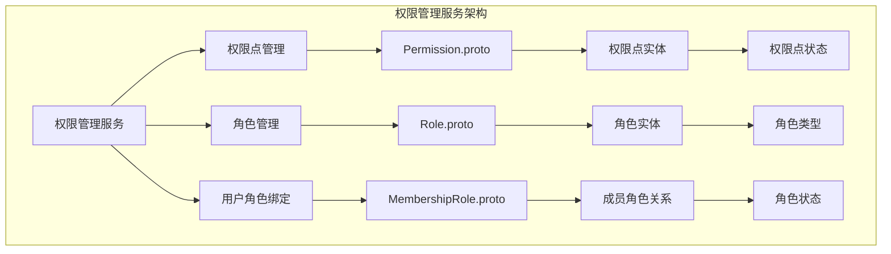

**图表来源**
- [permission.proto:1-172](file://backend/api/protos/permission/service/v1/permission.proto#L1-L172)
- [role.proto:1-372](file://backend/api/protos/permission/service/v1/role.proto#L1-L372)
- [membership_role.proto:1-83](file://backend/api/protos/permission/service/v1/membership_role.proto#L1-L83)

**章节来源**
- [permission.proto:1-172](file://backend/api/protos/permission/service/v1/permission.proto#L1-L172)
- [role.proto:1-372](file://backend/api/protos/permission/service/v1/role.proto#L1-L372)
- [membership_role.proto:1-83](file://backend/api/protos/permission/service/v1/membership_role.proto#L1-L83)

## 核心组件

### 权限点（Permission）

权限点是系统中最基本的权限单元，代表具体的系统操作能力。

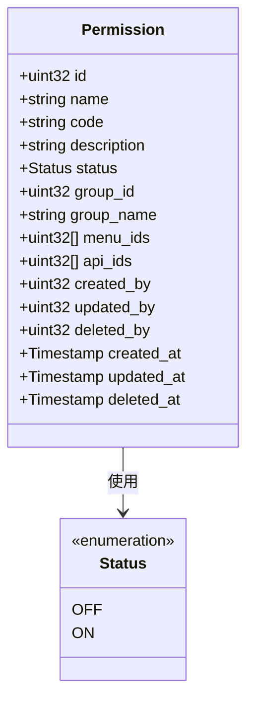

**图表来源**
- [permission.pb.go:77-96](file://backend/api/gen/go/permission/service/v1/permission.pb.go#L77-L96)

### 角色（Role）

角色是权限的集合，可以包含多个权限点，并具有不同的属性和约束。

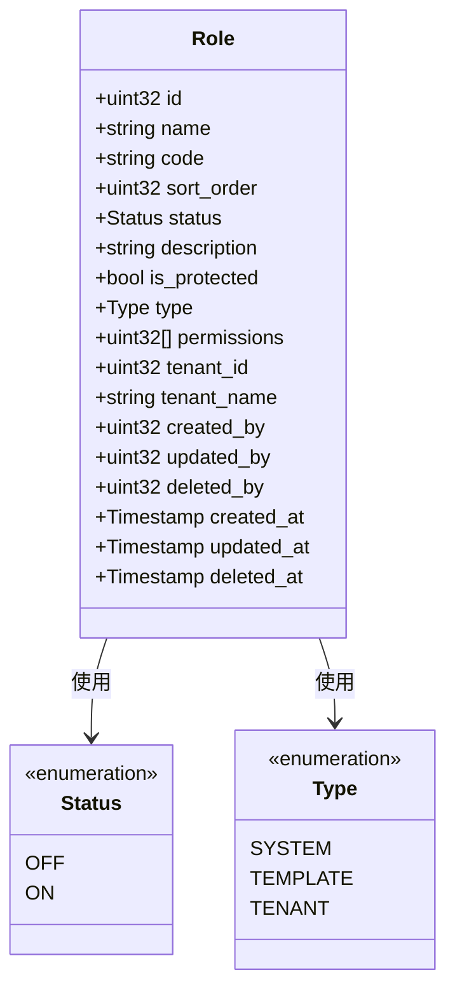

**图表来源**
- [role.pb.go:224-245](file://backend/api/gen/go/permission/service/v1/role.pb.go#L224-L245)

### 成员角色关系（MembershipRole）

成员角色关系表记录了用户与角色之间的绑定关系，支持多角色管理和状态控制。

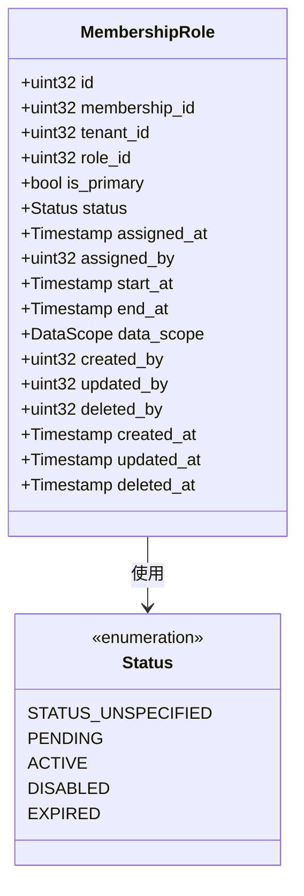

**图表来源**
- [membership_role.pb.go:84-105](file://backend/api/gen/go/permission/service/v1/membership_role.pb.go#L84-L105)

**章节来源**
- [permission.pb.go:77-96](file://backend/api/gen/go/permission/service/v1/permission.pb.go#L77-L96)
- [role.pb.go:224-245](file://backend/api/gen/go/permission/service/v1/role.pb.go#L224-L245)
- [membership_role.pb.go:84-105](file://backend/api/gen/go/permission/service/v1/membership_role.pb.go#L84-L105)

## 架构概览

权限管理服务采用分层架构设计，包含以下主要层次：

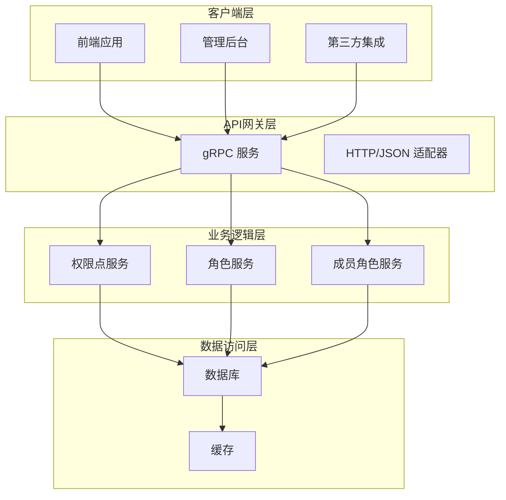

**图表来源**
- [permission_grpc.pb.go:33-53](file://backend/api/gen/go/permission/service/v1/permission_grpc.pb.go#L33-L53)
- [role_grpc.pb.go:36-62](file://backend/api/gen/go/permission/service/v1/role_grpc.pb.go#L36-L62)

该架构支持多种访问模式：
- **gRPC 直连**：高性能的内部服务通信
- **HTTP/JSON 适配**：兼容传统 Web 应用
- **异步处理**：支持批量操作和后台任务

## 详细组件分析

### 权限点管理服务

权限点管理服务提供了完整的 CRUD 操作和查询功能：

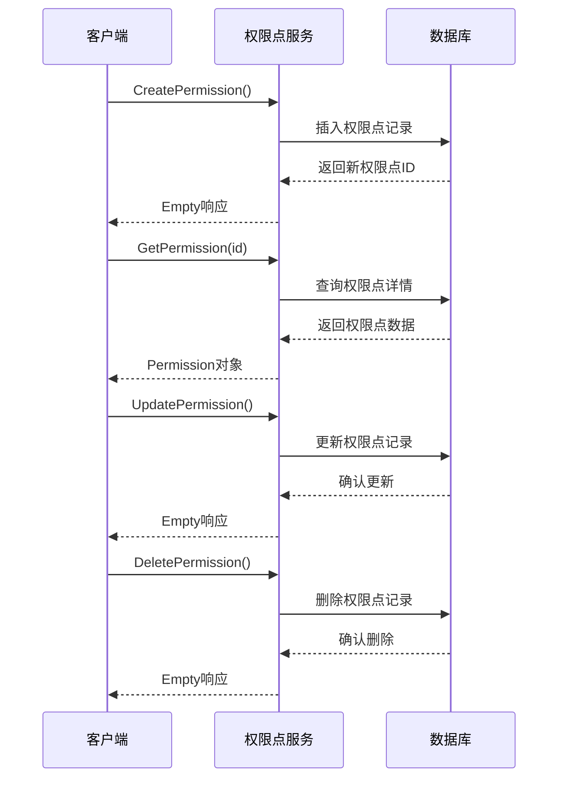

**图表来源**
- [permission.proto:14-35](file://backend/api/protos/permission/service/v1/permission.proto#L14-L35)

### 角色管理服务

角色管理服务支持复杂的角色操作，包括批量创建和查询转换：

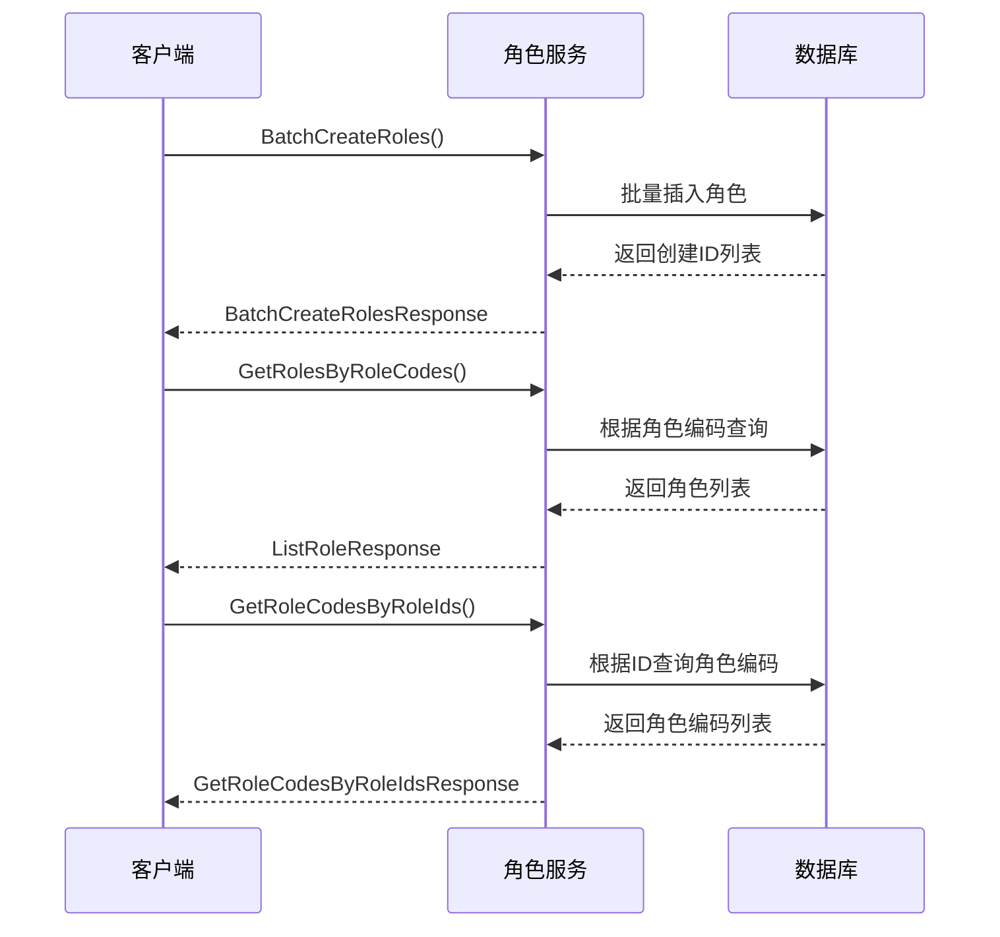

**图表来源**
- [role.proto:13-43](file://backend/api/protos/permission/service/v1/role.proto#L13-L43)

### 成员角色绑定服务

成员角色绑定服务管理用户与角色的动态关系：

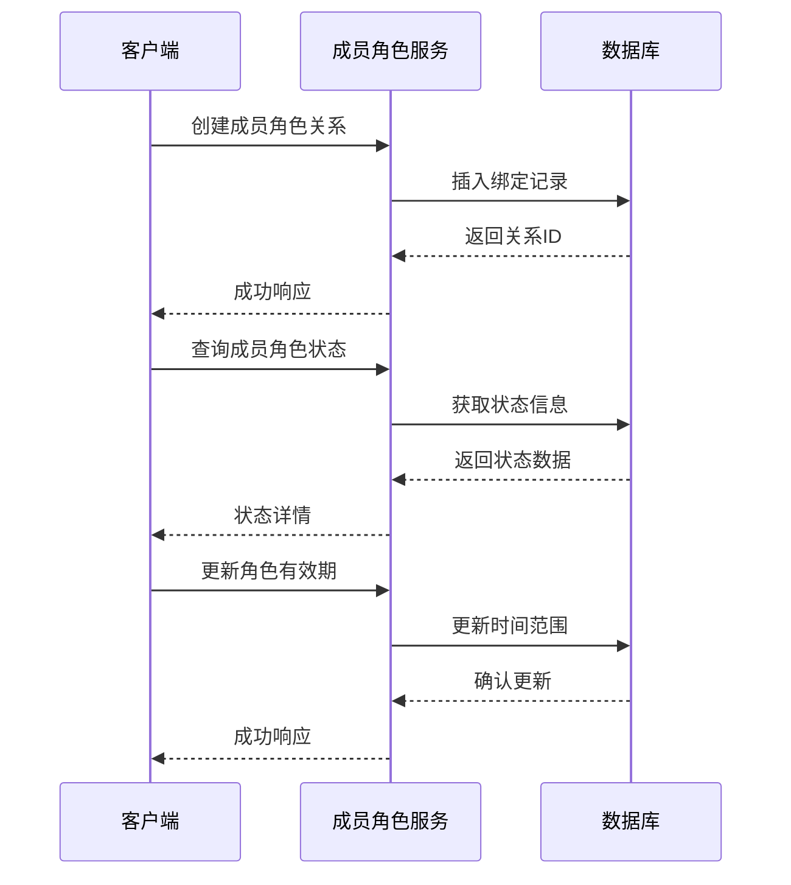

**图表来源**
- [membership_role.proto:10-83](file://backend/api/protos/permission/service/v1/membership_role.proto#L10-L83)

**章节来源**
- [permission.proto:14-35](file://backend/api/protos/permission/service/v1/permission.proto#L14-L35)
- [role.proto:13-43](file://backend/api/protos/permission/service/v1/role.proto#L13-L43)
- [membership_role.proto:10-83](file://backend/api/protos/permission/service/v1/membership_role.proto#L10-L83)

## RBAC 权限模型实现

### 角色层次结构

系统支持多层级的角色继承和组合：

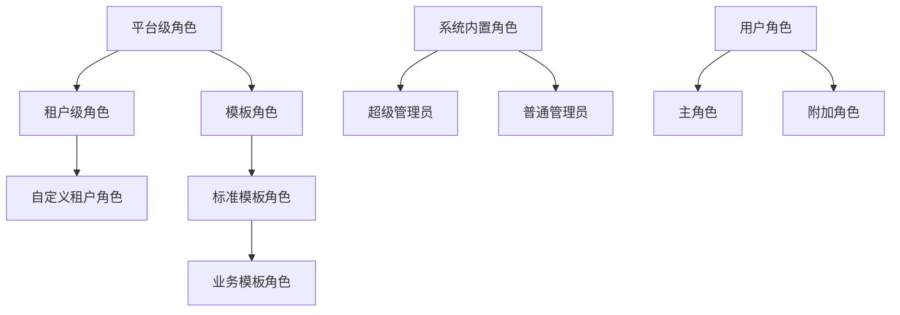

### 权限继承机制

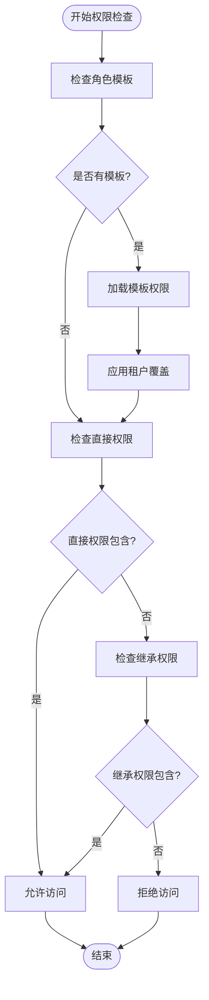

### 数据权限控制

系统支持基于数据范围的细粒度权限控制：

| 数据范围类型 | 说明 | 应用场景 |
|------------|------|----------|
| 全部数据 | 访问所有数据 | 系统管理员 |
| 本部门数据 | 仅访问所属部门数据 | 部门主管 |
| 本人数据 | 仅访问个人相关数据 | 普通员工 |
| 自定义范围 | 通过条件表达式定义 | 特殊业务需求 |

**章节来源**
- [role.proto:180-257](file://backend/api/protos/permission/service/v1/role.proto#L180-L257)
- [membership_role.proto:70-73](file://backend/api/protos/permission/service/v1/membership_role.proto#L70-L73)

## 接口调用示例

### 权限点操作示例

以下展示常见的权限点操作流程：

#### 创建权限点
```javascript
// 创建新的权限点
const createPermission = {
  data: {
    name: "删除用户",
    code: "user.delete",
    description: "允许删除系统用户",
    groupId: 1,
    menuIds: [101, 102],
    apiIds: [201, 202]
  }
};

// 调用 CreatePermission 方法
await permissionService.Create(createPermission);
```

#### 查询权限点
```javascript
// 通过ID查询
const permissionById = await permissionService.Get({
  id: 123
});

// 通过编码查询
const permissionByCode = await permissionService.Get({
  code: "user.delete"
});
```

#### 更新权限点
```javascript
// 更新部分字段
const updatePermission = {
  id: 123,
  data: {
    description: "更新后的权限描述",
    status: "ON"
  },
  updateMask: ["description", "status"]
};
```

### 角色操作示例

#### 创建角色
```javascript
// 创建角色并分配权限
const createRole = {
  data: {
    name: "高级管理员",
    code: "admin.senior",
    type: "TENANT",
    permissions: [1, 2, 3, 4, 5],
    tenantId: 1,
    isProtected: true
  }
};
```

#### 批量创建角色
```javascript
// 批量创建多个角色
const batchCreate = {
  items: [
    { name: "角色1", code: "role1", permissions: [1, 2] },
    { name: "角色2", code: "role2", permissions: [3, 4] }
  ]
};
```

### 用户角色绑定示例

#### 绑定用户角色
```javascript
// 为用户分配角色
const assignRole = {
  userId: 1001,
  roleId: 5,
  tenantId: 1,
  isPrimary: true,
  startAt: new Date(),
  endAt: new Date(Date.now() + 365 * 24 * 60 * 60 * 1000),
  dataScope: "DEPARTMENT_SCOPE"
};
```

## 权限验证机制

### 权限检查流程

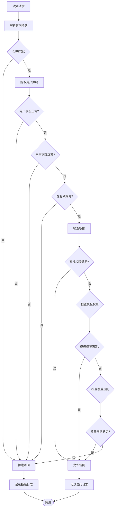

### 安全策略

系统实现了多层次的安全防护机制：

#### 1. 认证层
- JWT 令牌验证
- 令牌过期检查
- 令牌撤销列表

#### 2. 授权层
- RBAC 权限检查
- 数据范围限制
- 动态权限评估

#### 3. 会话管理
- 会话超时控制
- 多设备登录限制
- 强制下线机制

#### 4. 审计日志
- 所有权限操作记录
- 用户行为追踪
- 异常访问告警

**章节来源**
- [permission_grpc.pb.go:133-154](file://backend/api/gen/go/permission/service/v1/permission_grpc.pb.go#L133-L154)
- [role_grpc.pb.go:172-199](file://backend/api/gen/go/permission/service/v1/role_grpc.pb.go#L172-L199)

## 性能考虑

### 缓存策略

系统采用多级缓存优化性能：

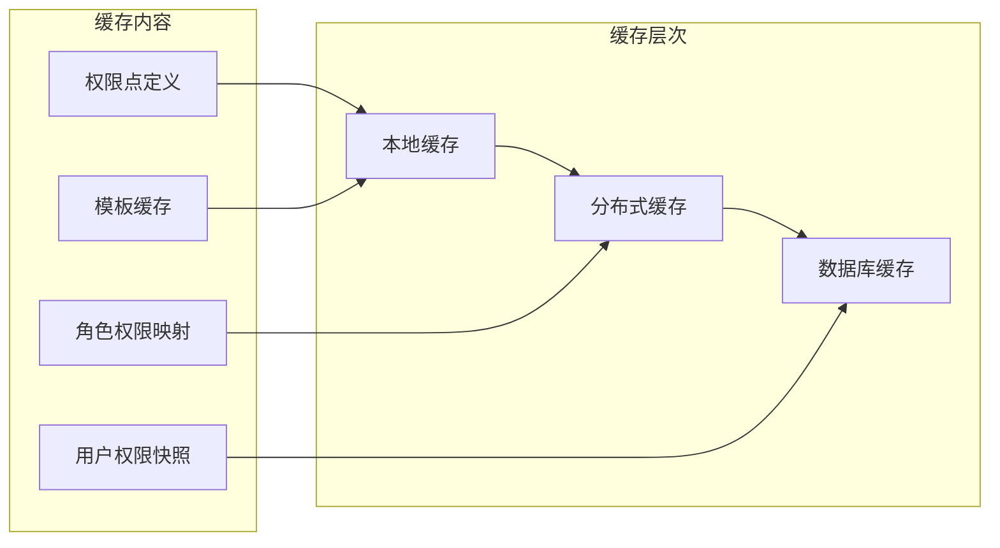

### 查询优化

- **批量查询**：支持批量获取权限点和角色信息
- **分页查询**：大数据集的高效分页
- **索引优化**：对常用查询字段建立索引
- **查询缓存**：热点数据缓存

### 并发控制

- **乐观锁**：防止并发更新冲突
- **事务管理**：确保数据一致性
- **读写分离**：分离读写压力

## 故障排除指南

### 常见问题及解决方案

#### 1. 权限检查失败
**症状**：用户无法执行预期操作
**排查步骤**：
1. 检查用户是否处于激活状态
2. 验证角色是否在有效期内
3. 确认权限点状态是否启用
4. 检查数据范围限制

#### 2. 角色分配异常
**症状**：用户角色变更不生效
**排查步骤**：
1. 验证角色模板是否正确
2. 检查租户覆盖配置
3. 确认主角色设置
4. 验证时间范围配置

#### 3. 性能问题
**症状**：接口响应缓慢
**排查步骤**：
1. 检查缓存命中率
2. 分析数据库查询计划
3. 监控并发连接数
4. 优化批量操作

### 错误码定义

| 错误码 | 含义 | 处理建议 |
|--------|------|----------|
| 1001 | 用户未找到 | 检查用户ID有效性 |
| 1002 | 角色未找到 | 验证角色是否存在 |
| 1003 | 权限不足 | 检查用户权限链 |
| 1004 | 数据冲突 | 检查并发更新 |
| 1005 | 参数错误 | 验证请求参数 |

**章节来源**
- [permission_grpc.pb.go:163-183](file://backend/api/gen/go/permission/service/v1/permission_grpc.pb.go#L163-L183)
- [role_grpc.pb.go:208-237](file://backend/api/gen/go/permission/service/v1/role_grpc.pb.go#L208-L237)

## 结论

权限管理服务接口提供了一个完整、灵活且高性能的 RBAC 权限控制系统。通过清晰的接口设计、完善的权限模型和强大的扩展能力，该系统能够满足各种复杂的权限管理需求。

### 主要优势

1. **模块化设计**：清晰的职责分离，易于维护和扩展
2. **高性能架构**：多级缓存和优化的查询机制
3. **灵活配置**：支持复杂的权限继承和覆盖规则
4. **安全可靠**：多层次的安全防护和审计机制
5. **易于集成**：标准化的 gRPC 接口，便于第三方集成

### 未来发展方向

- **AI 辅助权限管理**：基于机器学习的权限推荐
- **实时权限同步**：支持动态权限变更的实时传播
- **权限可视化**：提供权限关系的图形化展示
- **合规性增强**：支持更严格的审计和合规要求

该权限管理服务接口为构建安全可靠的业务系统奠定了坚实的基础，能够有效保障系统的数据安全和访问控制。