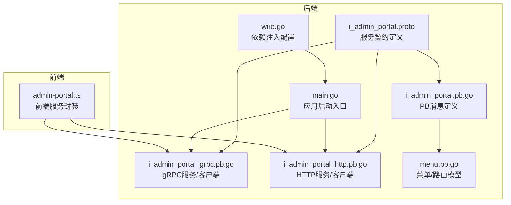
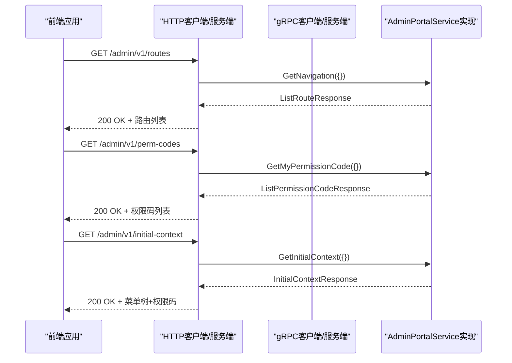
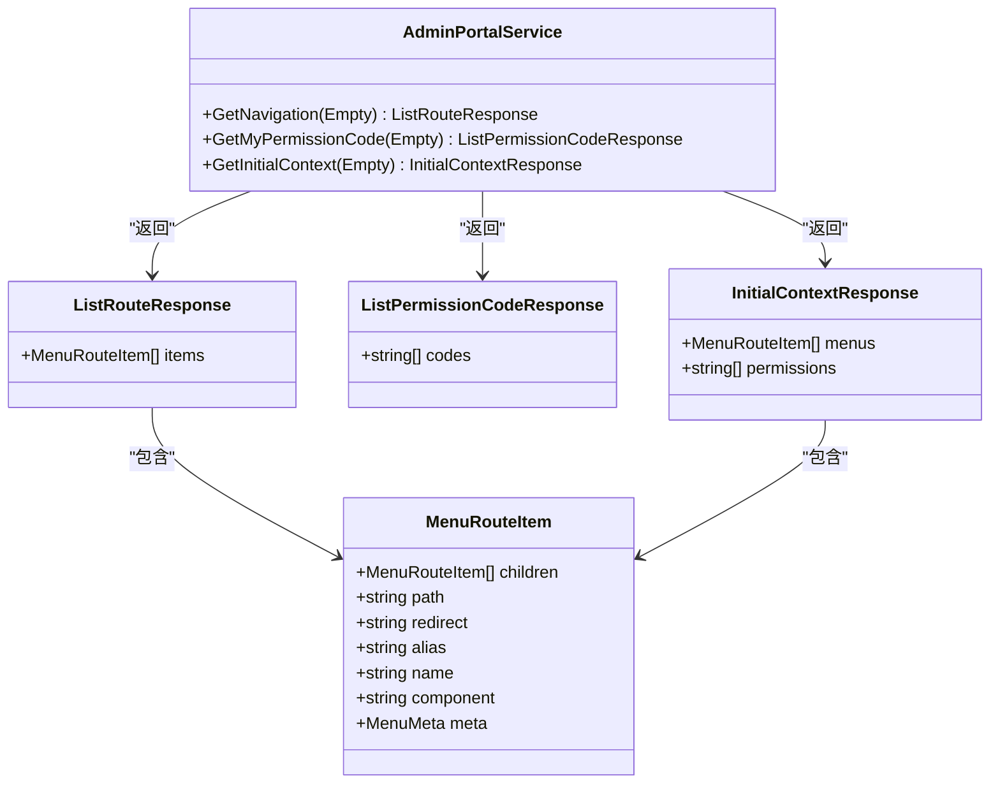
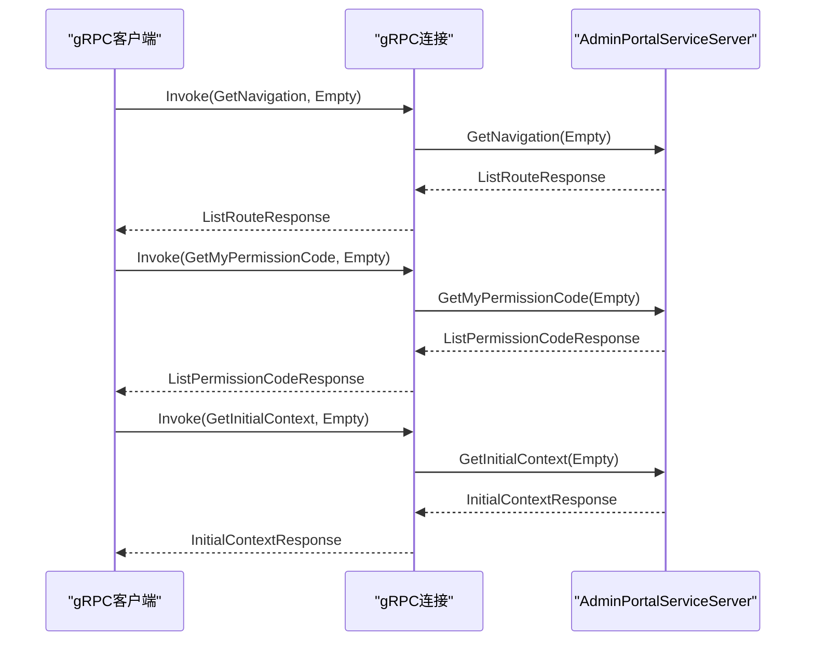
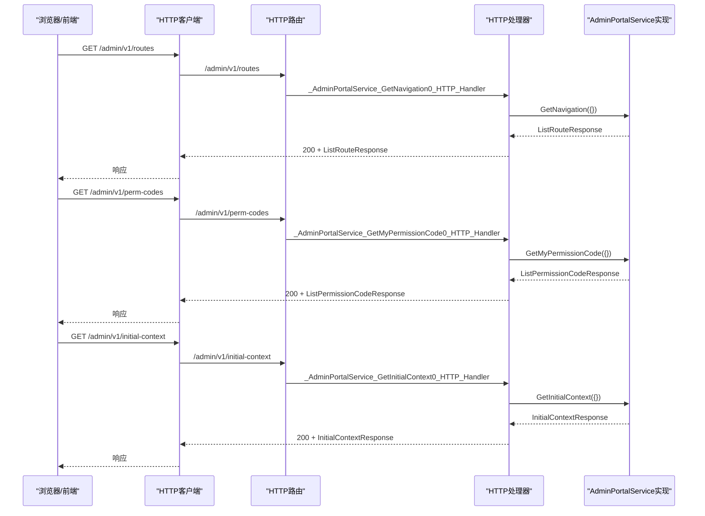
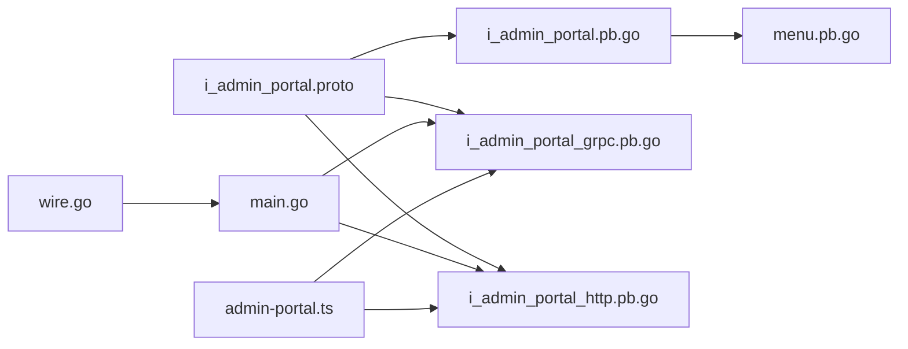

# 管理门户服务接口

<cite>
**本文档引用的文件**
- [i_admin_portal.proto](file://backend/api/protos/admin/service/v1/i_admin_portal.proto)
- [i_admin_portal.pb.go](file://backend/api/gen/protobuf/go/admin/service/v1/i_admin_portal.pb.go)
- [i_admin_portal_grpc.pb.go](file://backend/api/gen/protobuf/go/admin/service/v1/i_admin_portal_grpc.pb.go)
- [i_admin_portal_http.pb.go](file://backend/api/gen/protobuf/go/admin/service/v1/i_admin_portal_http.pb.go)
- [menu.pb.go](file://backend/api/gen/protobuf/go/resource/service/v1/menu.pb.go)
- [main.go](file://backend/app/admin/service/cmd/server/main.go)
- [wire.go](file://backend/app/admin/service/cmd/server/wire.go)
- [admin-portal.ts](file://frontend/admin/react/src/api/service/admin-portal.ts)
</cite>

## 目录
1. [简介](#简介)
2. [项目结构](#项目结构)
3. [核心组件](#核心组件)
4. [架构总览](#架构总览)
5. [详细组件分析](#详细组件分析)
6. [依赖分析](#依赖分析)
7. [性能考虑](#性能考虑)
8. [故障排除指南](#故障排除指南)
9. [结论](#结论)

## 简介
本文件面向管理门户服务接口的使用者与维护者，系统性阐述 IAdminPortal 接口的设计与实现，重点覆盖以下方面：
- 管理门户的核心功能接口：导航查询、权限码查询、初始上下文一次性获取
- 文档管理接口：基于菜单路由模型的文档化能力
- 接口方法的功能、参数定义、返回值格式
- 具体的调用示例与错误处理机制
- 管理门户在系统中的作用以及与前端、其他服务的交互关系

## 项目结构
管理门户服务接口位于后端 API 定义层，通过 Protocol Buffers 定义服务契约，并自动生成 gRPC 与 HTTP 适配层。前端通过已生成的客户端发起请求。

**图表来源**
- [i_admin_portal.proto:1-48](file://backend/api/protos/admin/service/v1/i_admin_portal.proto#L1-L48)
- [i_admin_portal.pb.go:1-246](file://backend/api/gen/protobuf/go/admin/service/v1/i_admin_portal.pb.go#L1-L246)
- [i_admin_portal_grpc.pb.go:1-209](file://backend/api/gen/protobuf/go/admin/service/v1/i_admin_portal_grpc.pb.go#L1-L209)
- [i_admin_portal_http.pb.go:1-158](file://backend/api/gen/protobuf/go/admin/service/v1/i_admin_portal_http.pb.go#L1-L158)
- [menu.pb.go:1-800](file://backend/api/gen/protobuf/go/resource/service/v1/menu.pb.go#L1-L800)
- [main.go:1-76](file://backend/app/admin/service/cmd/server/main.go#L1-L76)
- [wire.go:1-47](file://backend/app/admin/service/cmd/server/wire.go#L1-L47)
- [admin-portal.ts:1-25](file://frontend/admin/react/src/api/service/admin-portal.ts#L1-L25)

**章节来源**
- [i_admin_portal.proto:1-48](file://backend/api/protos/admin/service/v1/i_admin_portal.proto#L1-L48)
- [i_admin_portal.pb.go:1-246](file://backend/api/gen/protobuf/go/admin/service/v1/i_admin_portal.pb.go#L1-L246)
- [i_admin_portal_grpc.pb.go:1-209](file://backend/api/gen/protobuf/go/admin/service/v1/i_admin_portal_grpc.pb.go#L1-L209)
- [i_admin_portal_http.pb.go:1-158](file://backend/api/gen/protobuf/go/admin/service/v1/i_admin_portal_http.pb.go#L1-L158)
- [menu.pb.go:1-800](file://backend/api/gen/protobuf/go/resource/service/v1/menu.pb.go#L1-L800)
- [main.go:1-76](file://backend/app/admin/service/cmd/server/main.go#L1-L76)
- [wire.go:1-47](file://backend/app/admin/service/cmd/server/wire.go#L1-L47)
- [admin-portal.ts:1-25](file://frontend/admin/react/src/api/service/admin-portal.ts#L1-L25)

## 核心组件
- 服务契约：AdminPortalService（在 i_admin_portal.proto 中定义）
- 数据模型：ListRouteResponse、ListPermissionCodeResponse、InitialContextResponse（在 i_admin_portal.pb.go 中生成）
- 菜单/路由模型：MenuRouteItem（在 menu.pb.go 中生成）

关键要点：
- 所有接口均以空消息 Empty 作为输入参数
- 返回值分别为路由列表、权限码列表、菜单树+权限码的组合
- 支持 gRPC 与 HTTP 两种传输协议

**章节来源**
- [i_admin_portal.proto:10-32](file://backend/api/protos/admin/service/v1/i_admin_portal.proto#L10-L32)
- [i_admin_portal.pb.go:27-167](file://backend/api/gen/protobuf/go/admin/service/v1/i_admin_portal.pb.go#L27-L167)
- [menu.pb.go:527-539](file://backend/api/gen/protobuf/go/resource/service/v1/menu.pb.go#L527-L539)

## 架构总览
管理门户服务在系统中的定位是“后台前端初始化数据与配置服务”，负责为管理后台前端提供启动所需的导航、权限与上下文信息。其典型交互流程如下：

**图表来源**
- [i_admin_portal_http.pb.go:36-98](file://backend/api/gen/protobuf/go/admin/service/v1/i_admin_portal_http.pb.go#L36-L98)
- [i_admin_portal_grpc.pb.go:28-93](file://backend/api/gen/protobuf/go/admin/service/v1/i_admin_portal_grpc.pb.go#L28-L93)
- [i_admin_portal.proto:12-31](file://backend/api/protos/admin/service/v1/i_admin_portal.proto#L12-L31)

## 详细组件分析

### AdminPortalService 接口定义
- 服务名称：AdminPortalService
- 方法：
  - GetNavigation：查询前端路由表
  - GetMyPermissionCode：查询权限码列表
  - GetInitialContext：一次性获取进入后台所需的所有上下文

**图表来源**
- [i_admin_portal.proto:11-32](file://backend/api/protos/admin/service/v1/i_admin_portal.proto#L11-L32)
- [i_admin_portal.pb.go:27-167](file://backend/api/gen/protobuf/go/admin/service/v1/i_admin_portal.pb.go#L27-L167)
- [menu.pb.go:527-539](file://backend/api/gen/protobuf/go/resource/service/v1/menu.pb.go#L527-L539)

**章节来源**
- [i_admin_portal.proto:10-32](file://backend/api/protos/admin/service/v1/i_admin_portal.proto#L10-L32)
- [i_admin_portal.pb.go:27-167](file://backend/api/gen/protobuf/go/admin/service/v1/i_admin_portal.pb.go#L27-L167)
- [menu.pb.go:527-539](file://backend/api/gen/protobuf/go/resource/service/v1/menu.pb.go#L527-L539)

### gRPC 实现与客户端
- gRPC 客户端接口：AdminPortalServiceClient
- gRPC 服务端接口：AdminPortalServiceServer
- 默认方法名映射：
  - GetNavigation → /admin.service.v1.AdminPortalService/GetNavigation
  - GetMyPermissionCode → /admin.service.v1.AdminPortalService/GetMyPermissionCode
  - GetInitialContext → /admin.service.v1.AdminPortalService/GetInitialContext

**图表来源**
- [i_admin_portal_grpc.pb.go:28-93](file://backend/api/gen/protobuf/go/admin/service/v1/i_admin_portal_grpc.pb.go#L28-L93)

**章节来源**
- [i_admin_portal_grpc.pb.go:28-93](file://backend/api/gen/protobuf/go/admin/service/v1/i_admin_portal_grpc.pb.go#L28-L93)

### HTTP 实现与客户端
- HTTP 路由映射：
  - GET /admin/v1/routes → GetNavigation
  - GET /admin/v1/perm-codes → GetMyPermissionCode
  - GET /admin/v1/initial-context → GetInitialContext
- HTTP 客户端/服务端接口：AdminPortalServiceHTTPServer/AdminPortalServiceHTTPClient

**图表来源**
- [i_admin_portal_http.pb.go:36-98](file://backend/api/gen/protobuf/go/admin/service/v1/i_admin_portal_http.pb.go#L36-L98)

**章节来源**
- [i_admin_portal_http.pb.go:36-98](file://backend/api/gen/protobuf/go/admin/service/v1/i_admin_portal_http.pb.go#L36-L98)

### 数据模型与复杂度分析
- MenuRouteItem：包含子节点、路由路径、组件、元信息等字段，支持树形结构
- ListRouteResponse：包含若干 MenuRouteItem，适合前端路由树渲染
- ListPermissionCodeResponse：字符串数组，表示可用权限码集合
- InitialContextResponse：同时包含菜单树与权限码，便于前端一次性初始化

复杂度分析（以单次请求为粒度）：
- 时间复杂度：O(n)，n 为菜单/权限条目数量
- 空间复杂度：O(n)，存储响应对象

**章节来源**
- [menu.pb.go:527-539](file://backend/api/gen/protobuf/go/resource/service/v1/menu.pb.go#L527-L539)
- [i_admin_portal.pb.go:27-167](file://backend/api/gen/protobuf/go/admin/service/v1/i_admin_portal.pb.go#L27-L167)

### 文档管理接口（概念性说明）
管理门户接口本身不直接提供文档增删改查操作，但其返回的菜单/路由模型具备完善的元信息字段，可用于：
- 路由元信息（如标题、图标、权限、是否缓存等）
- 权限控制（通过权限码列表进行细粒度授权）
- 导航结构（父子关系、重定向、外链等）

这些能力可作为“文档化”的基础：前端根据返回的菜单树渲染导航，结合权限码控制可见性与可访问性。

[本节为概念性内容，不直接分析具体文件，故无“章节来源”]

## 依赖分析
- 协议与生成：
  - i_admin_portal.proto → i_admin_portal.pb.go（PB消息）、i_admin_portal_grpc.pb.go（gRPC）、i_admin_portal_http.pb.go（HTTP）
  - menu.pb.go 提供 MenuRouteItem 等模型
- 运行时集成：
  - main.go 作为应用启动入口，集成 HTTP、gRPC、任务队列等服务
  - wire.go 通过依赖注入装配服务、数据与服务器组件
- 前端集成：
  - admin-portal.ts 封装前端服务调用，统一获取导航、权限与上下文

**图表来源**
- [i_admin_portal.proto:1-48](file://backend/api/protos/admin/service/v1/i_admin_portal.proto#L1-L48)
- [i_admin_portal.pb.go:1-246](file://backend/api/gen/protobuf/go/admin/service/v1/i_admin_portal.pb.go#L1-L246)
- [i_admin_portal_grpc.pb.go:1-209](file://backend/api/gen/protobuf/go/admin/service/v1/i_admin_portal_grpc.pb.go#L1-L209)
- [i_admin_portal_http.pb.go:1-158](file://backend/api/gen/protobuf/go/admin/service/v1/i_admin_portal_http.pb.go#L1-L158)
- [menu.pb.go:1-800](file://backend/api/gen/protobuf/go/resource/service/v1/menu.pb.go#L1-L800)
- [main.go:1-76](file://backend/app/admin/service/cmd/server/main.go#L1-L76)
- [wire.go:1-47](file://backend/app/admin/service/cmd/server/wire.go#L1-L47)
- [admin-portal.ts:1-25](file://frontend/admin/react/src/api/service/admin-portal.ts#L1-L25)

**章节来源**
- [main.go:59-75](file://backend/app/admin/service/cmd/server/main.go#L59-L75)
- [wire.go:37-46](file://backend/app/admin/service/cmd/server/wire.go#L37-L46)
- [admin-portal.ts:1-25](file://frontend/admin/react/src/api/service/admin-portal.ts#L1-L25)

## 性能考虑
- 单次请求聚合：InitialContextResponse 将菜单树与权限码合并返回，减少前端多次往返，提升初始化性能
- 路由树结构：MenuRouteItem 支持多层级子节点，建议前端按需懒加载或分页渲染
- 权限码列表：权限码数组通常较小，适合全量下发；若权限体系庞大，可考虑分组或增量策略
- 传输协议：gRPC 在高并发场景下延迟更低；HTTP 适配便于浏览器直连与调试

[本节提供通用指导，不直接分析具体文件，故无“章节来源”]

## 故障排除指南
- gRPC 未实现错误：当服务端未实现某方法时，会返回未实现错误。请确认服务端实现了 AdminPortalServiceServer 接口并正确注册。
- HTTP 路由未匹配：确保前端请求路径与 HTTP 映射一致（/admin/v1/routes、/admin/v1/perm-codes、/admin/v1/initial-context）。
- 认证与鉴权：前端应在请求头中携带必要的认证信息（如令牌），否则后端可能拒绝访问。
- 超时与重试：网络不稳定时，建议前端对关键接口增加超时与指数退避重试逻辑。

**章节来源**
- [i_admin_portal_grpc.pb.go:102-111](file://backend/api/gen/protobuf/go/admin/service/v1/i_admin_portal_grpc.pb.go#L102-L111)
- [i_admin_portal_http.pb.go:43-98](file://backend/api/gen/protobuf/go/admin/service/v1/i_admin_portal_http.pb.go#L43-L98)

## 结论
IAdminPortal 接口通过简洁的三类方法，为管理后台前端提供了启动期所需的关键数据：导航路由、权限码与初始上下文。借助 PB 协议与自动生成的 gRPC/HTTP 适配层，接口具备良好的跨语言与跨平台能力。配合菜单/路由模型的丰富元信息，可在不直接暴露“文档管理”接口的情况下，实现对导航与权限的“文档化”管理。建议在生产环境中优先使用 InitialContextResponse 进行一次性初始化，并结合前端缓存与权限校验，获得更佳的用户体验与安全性。