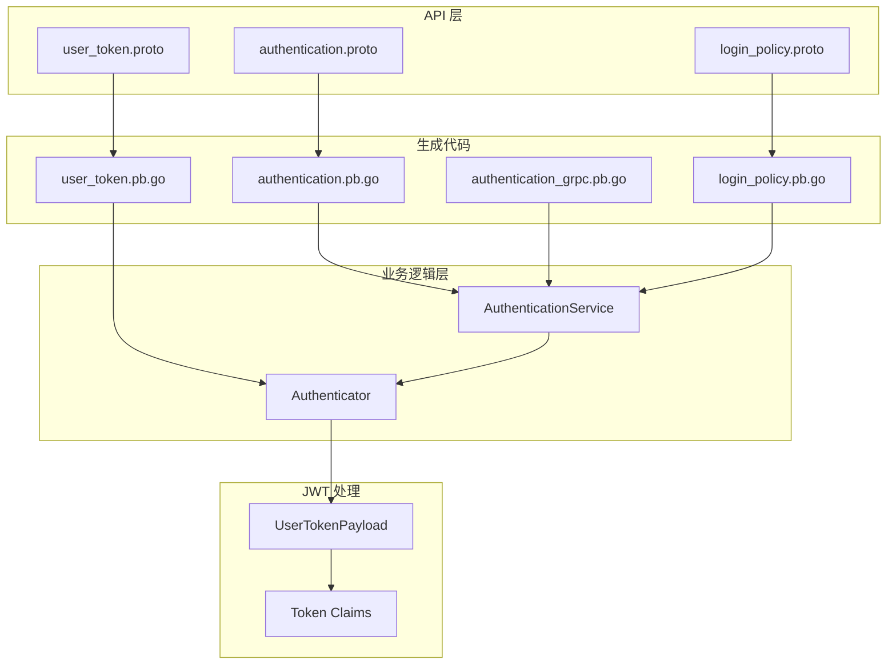
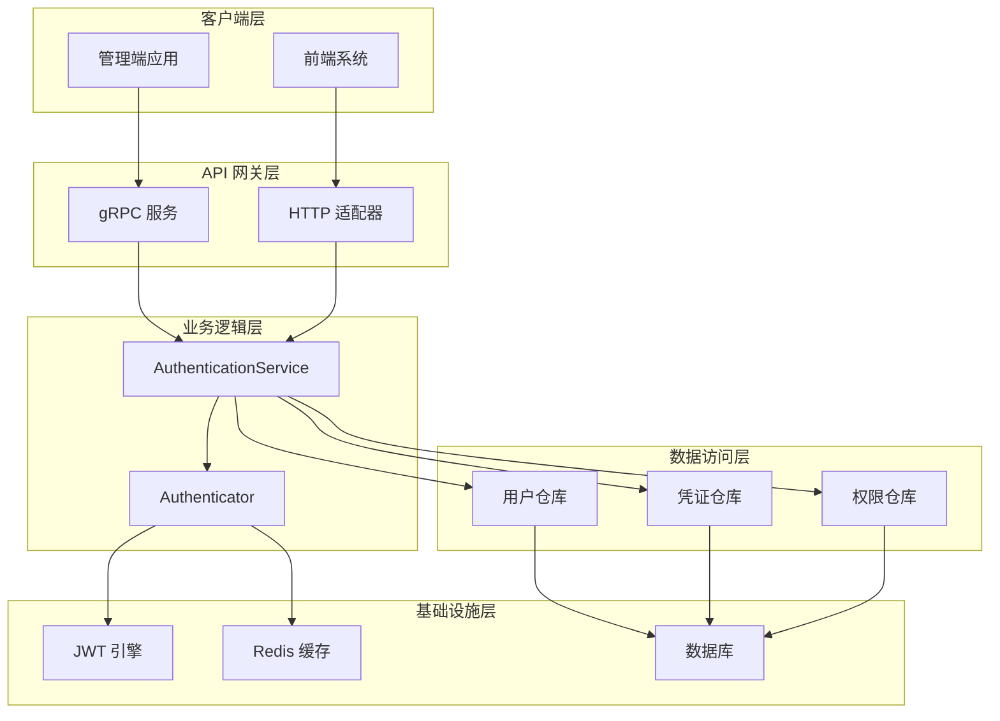
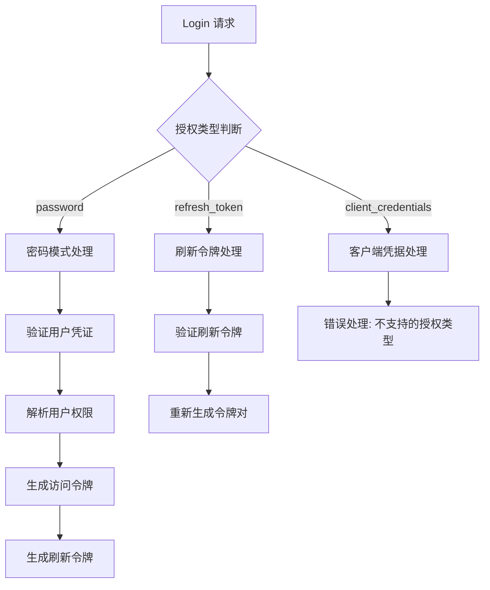
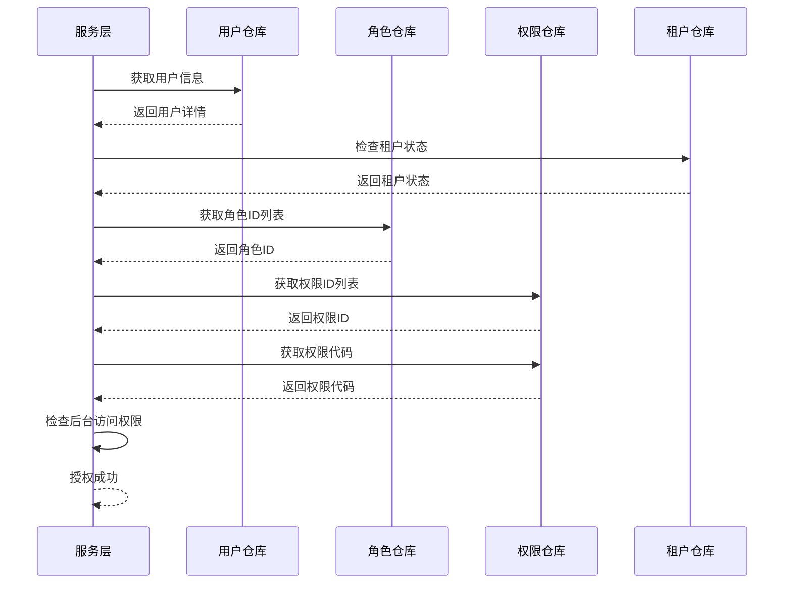
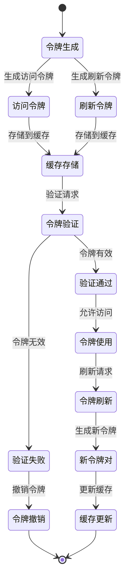
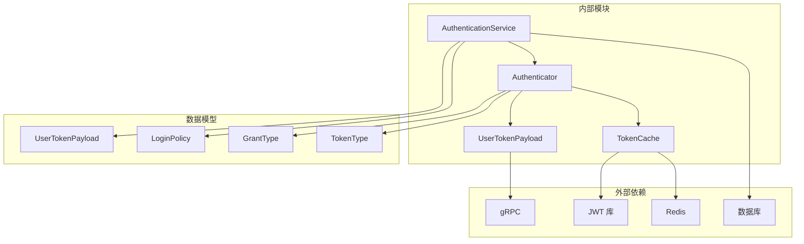

# 认证服务接口

<cite>
**本文档引用的文件**
- [authentication.pb.go](file://backend/api/gen/go/authentication/service/v1/authentication.pb.go)
- [authentication_grpc.pb.go](file://backend/api/gen/go/authentication/service/v1/authentication_grpc.pb.go)
- [user_token.pb.go](file://backend/api/gen/go/authentication/service/v1/user_token.pb.go)
- [login_policy.pb.go](file://backend/api/gen/go/authentication/service/v1/login_policy.pb.go)
- [authentication_service.go](file://backend/app/admin/service/internal/service/authentication_service.go)
- [authenticator.go](file://backend/app/admin/service/internal/data/authenticator.go)
- [user_token_payload.go](file://backend/pkg/jwt/user_token_payload.go)
</cite>

## 目录
1. [简介](#简介)
2. [项目结构](#项目结构)
3. [核心组件](#核心组件)
4. [架构概览](#架构概览)
5. [详细组件分析](#详细组件分析)
6. [依赖关系分析](#依赖关系分析)
7. [性能考虑](#性能考虑)
8. [故障排除指南](#故障排除指南)
9. [结论](#结论)

## 简介

认证服务接口是 Go-Wind 管理系统的安全基础设施核心，负责处理用户身份验证、令牌管理和访问控制。该服务基于 gRPC 协议构建，提供了完整的 OAuth 2.0 授权框架支持，包括多种授权模式、令牌生命周期管理、登录策略控制和安全验证机制。

本认证服务主要面向后台管理系统用户，提供安全可靠的认证授权能力，支持多租户环境下的复杂权限管理需求。

## 项目结构

认证服务在项目中的组织结构如下：

**图表来源**
- [authentication.pb.go:1-800](file://backend/api/gen/go/authentication/service/v1/authentication.pb.go#L1-L800)
- [authentication_grpc.pb.go:1-569](file://backend/api/gen/go/authentication/service/v1/authentication_grpc.pb.go#L1-L569)
- [user_token.pb.go:1-234](file://backend/api/gen/go/authentication/service/v1/user_token.pb.go#L1-L234)

**章节来源**
- [authentication.pb.go:1-800](file://backend/api/gen/go/authentication/service/v1/authentication.pb.go#L1-L800)
- [authentication_grpc.pb.go:1-569](file://backend/api/gen/go/authentication/service/v1/authentication_grpc.pb.go#L1-L569)

## 核心组件

### Authentication 服务接口

Authentication 服务是认证系统的核心接口，提供以下主要功能：

- **用户登录认证**：支持多种授权模式的用户身份验证
- **令牌管理**：完整的访问令牌和刷新令牌生命周期管理
- **令牌验证**：实时令牌有效性检查和权限验证
- **用户管理**：用户注册和身份信息查询
- **安全控制**：令牌撤销、封禁和解封功能

### UserToken 数据模型

UserTokenPayload 是认证服务的核心数据结构，承载用户身份信息和权限上下文：

- **用户标识**：用户ID、用户名、租户ID
- **设备信息**：客户端ID、设备ID
- **权限信息**：角色代码列表、数据权限范围
- **安全标识**：JWT ID（令牌唯一标识）

### LoginPolicy 登录策略

LoginPolicy 提供灵活的登录控制机制：

- **策略类型**：黑名单和白名单两种模式
- **限制方式**：IP地址、MAC地址、地区、时间、设备等多种限制
- **目标管理**：针对特定用户或全局策略的管理
- **租户支持**：多租户环境下的策略隔离

**章节来源**
- [authentication.pb.go:231-800](file://backend/api/gen/go/authentication/service/v1/authentication.pb.go#L231-L800)
- [user_token.pb.go:26-149](file://backend/api/gen/go/authentication/service/v1/user_token.pb.go#L26-L149)
- [login_policy.pb.go:139-286](file://backend/api/gen/go/authentication/service/v1/login_policy.pb.go#L139-L286)

## 架构概览

认证服务采用分层架构设计，确保了良好的可维护性和扩展性：

**图表来源**
- [authentication_service.go:25-71](file://backend/app/admin/service/internal/service/authentication_service.go#L25-L71)
- [authenticator.go:30-58](file://backend/app/admin/service/internal/data/authenticator.go#L30-L58)

## 详细组件分析

### Authentication 服务实现

AuthenticationService 是认证服务的主要业务逻辑实现：

#### 授权类型处理

**图表来源**
- [authentication_service.go:82-97](file://backend/app/admin/service/internal/service/authentication_service.go#L82-L97)
- [authentication_service.go:336-446](file://backend/app/admin/service/internal/service/authentication_service.go#L336-L446)

#### 权限解析机制

服务实现了灵活的用户权限解析机制，支持一对一和一对多的用户-租户关系：

**图表来源**
- [authentication_service.go:171-320](file://backend/app/admin/service/internal/service/authentication_service.go#L171-L320)

**章节来源**
- [authentication_service.go:82-582](file://backend/app/admin/service/internal/service/authentication_service.go#L82-L582)

### Authenticator 认证器

Authenticator 是认证服务的核心实现类，负责具体的令牌生成和验证逻辑：

#### 令牌生命周期管理

**图表来源**
- [authenticator.go:173-215](file://backend/app/admin/service/internal/data/authenticator.go#L173-L215)
- [authenticator.go:217-295](file://backend/app/admin/service/internal/data/authenticator.go#L217-L295)

#### JWT Claims 结构

Authenticator 使用标准化的 JWT Claims 结构：

| Claims 名称 | 字段类型 | 描述 | 必需性 |
|------------|----------|------|--------|
| sub | string | 用户名 | 可选 |
| uid | number | 用户ID | 必需 |
| tid | number | 租户ID | 可选 |
| cid | string | 客户端ID | 可选 |
| did | string | 设备ID | 可选 |
| roc | array | 角色代码列表 | 可选 |
| ds | enum | 数据范围 | 可选 |
| ouid | number | 组织单元ID | 可选 |
| jti | string | JWT ID | 必需 |

**章节来源**
- [authenticator.go:30-58](file://backend/app/admin/service/internal/data/authenticator.go#L30-L58)
- [user_token_payload.go:17-100](file://backend/pkg/jwt/user_token_payload.go#L17-L100)

### UserTokenPayload 数据模型

UserTokenPayload 是认证服务的核心数据结构，定义了令牌载荷的标准格式：

#### 字段定义

| 字段名称 | 类型 | 描述 | 约束条件 |
|----------|------|------|----------|
| user_id | uint32 | 用户ID | 必需 |
| tenant_id | uint32 | 租户ID | 可选 |
| client_id | string | 客户端ID | 可选 |
| device_id | string | 设备ID | 可选 |
| username | string | 用户名 | 可选 |
| roles | array[string] | 角色代码列表 | 可选 |
| data_scope | enum | 数据权限范围 | 可选 |
| org_unit_id | uint32 | 组织单元ID | 可选 |
| is_platform_admin | boolean | 是否平台超级管理员 | 可选 |
| is_tenant_admin | boolean | 是否租户管理员 | 可选 |
| jti | string | 令牌唯一标识 | 必需 |

**章节来源**
- [user_token.pb.go:26-149](file://backend/api/gen/go/authentication/service/v1/user_token.pb.go#L26-L149)

### LoginPolicy 登录策略

LoginPolicy 提供了灵活的登录控制机制：

#### 策略类型

| 类型 | 描述 | 用途 |
|------|------|------|
| BLACKLIST | 黑名单 | 拒绝特定用户或IP的登录 |
| WHITELIST | 白名单 | 仅允许特定用户或IP的登录 |

#### 限制方式

| 方式 | 描述 | 示例值 |
|------|------|--------|
| IP | IP地址限制 | 192.168.1.100 |
| MAC | MAC地址限制 | 00:1A:2B:3C:4D:5E |
| REGION | 地区限制 | CN, US, JP |
| TIME | 时间限制 | 09:00-18:00 |
| DEVICE | 设备限制 | PC, Mobile, Tablet |

**章节来源**
- [login_policy.pb.go:30-137](file://backend/api/gen/go/authentication/service/v1/login_policy.pb.go#L30-L137)
- [login_policy.pb.go:139-286](file://backend/api/gen/go/authentication/service/v1/login_policy.pb.go#L139-L286)

## 依赖关系分析

认证服务的依赖关系体现了清晰的分层架构：

**图表来源**
- [authentication_grpc.pb.go:9-15](file://backend/api/gen/go/authentication/service/v1/authentication_grpc.pb.go#L9-L15)
- [authenticator.go:3-20](file://backend/app/admin/service/internal/data/authenticator.go#L3-L20)

### 关键依赖说明

1. **gRPC 通信协议**：提供高性能的远程过程调用
2. **JWT 库**：实现标准的 JSON Web Token 规范
3. **Redis 缓存**：提供快速的令牌存储和验证
4. **数据库**：持久化用户和权限数据
5. **Kratos 框架**：提供微服务基础设施支持

**章节来源**
- [authentication_grpc.pb.go:1-569](file://backend/api/gen/go/authentication/service/v1/authentication_grpc.pb.go#L1-L569)
- [authenticator.go:1-440](file://backend/app/admin/service/internal/data/authenticator.go#L1-L440)

## 性能考虑

### 令牌缓存策略

认证服务采用了多级缓存策略来优化性能：

- **内存缓存**：本地内存存储最近使用的令牌
- **Redis 缓存**：分布式缓存支持高可用部署
- **数据库缓存**：定期同步用户和权限数据

### 并发处理

服务实现了高效的并发处理机制：

- **连接池管理**：优化数据库连接使用
- **异步操作**：非阻塞的令牌验证和存储
- **批量操作**：支持批量令牌撤销和验证

### 安全优化

- **令牌过期自动清理**：定期清理过期令牌
- **防重放攻击**：JWT ID 的唯一性保证
- **速率限制**：防止暴力破解攻击

## 故障排除指南

### 常见错误类型

| 错误代码 | 错误类型 | 描述 | 解决方案 |
|----------|----------|------|----------|
| 400 | BadRequest | 请求参数错误 | 检查请求格式和必需字段 |
| 401 | Unauthorized | 令牌无效或过期 | 重新登录获取新令牌 |
| 403 | Forbidden | 权限不足 | 检查用户角色和权限 |
| 404 | NotFound | 资源不存在 | 验证用户ID和令牌ID |
| 500 | InternalServerError | 服务器内部错误 | 检查服务日志和依赖项 |

### 调试建议

1. **启用详细日志**：在开发环境中启用调试日志
2. **监控令牌状态**：定期检查令牌缓存状态
3. **验证依赖服务**：确保 Redis 和数据库正常运行
4. **测试边界条件**：验证各种异常情况的处理

**章节来源**
- [authentication_service.go:171-320](file://backend/app/admin/service/internal/service/authentication_service.go#L171-L320)
- [authenticator.go:80-171](file://backend/app/admin/service/internal/data/authenticator.go#L80-L171)

## 结论

认证服务接口为 Go-Wind 管理系统提供了完整、安全、可扩展的身份认证解决方案。通过采用现代化的架构设计和最佳实践，该服务能够满足复杂的企业级应用需求。

### 主要优势

1. **安全性**：基于 JWT 标准的令牌机制，支持多种安全特性
2. **灵活性**：支持多种授权模式和登录策略配置
3. **可扩展性**：模块化的架构设计便于功能扩展
4. **高性能**：多级缓存和优化的并发处理机制
5. **易用性**：清晰的 API 设计和完善的错误处理

### 未来发展方向

- **多因子认证**：集成短信验证码和邮箱验证
- **OAuth 2.0 扩展**：支持第三方身份提供商
- **审计日志**：完整的认证操作审计功能
- **监控告警**：实时的安全事件监控和告警

该认证服务为整个系统的安全奠定了坚实的基础，是构建可靠企业应用的重要组成部分。