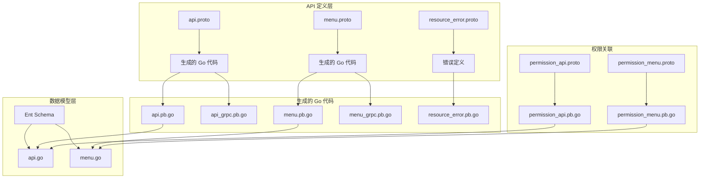
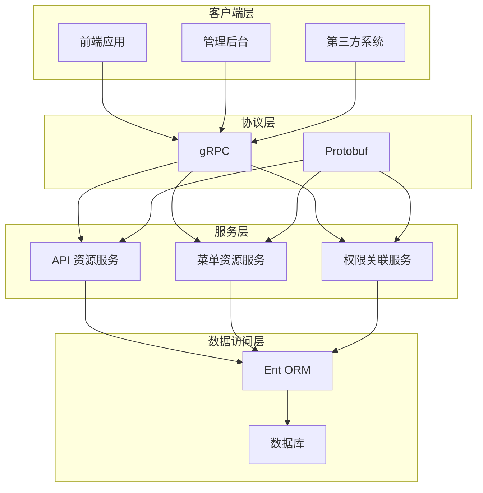
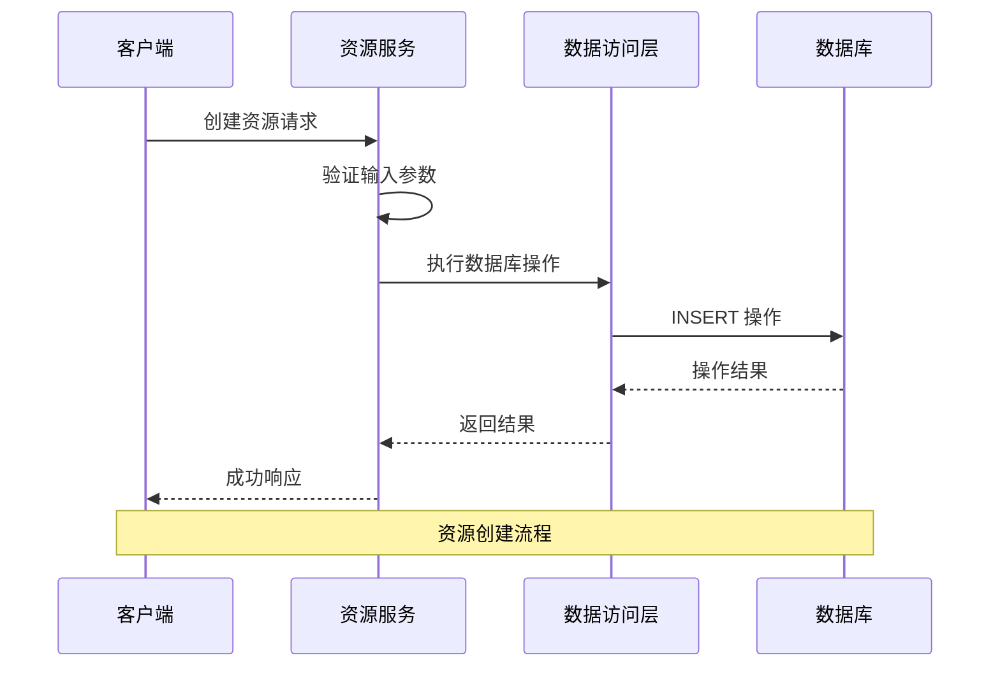
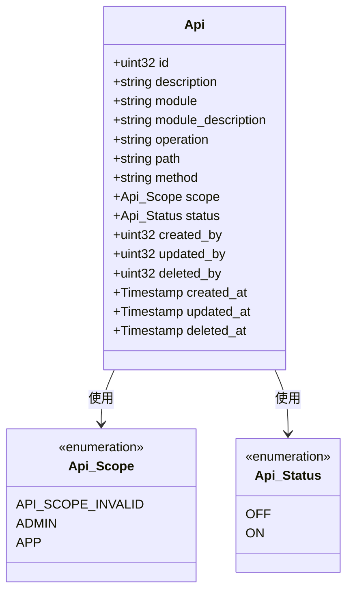
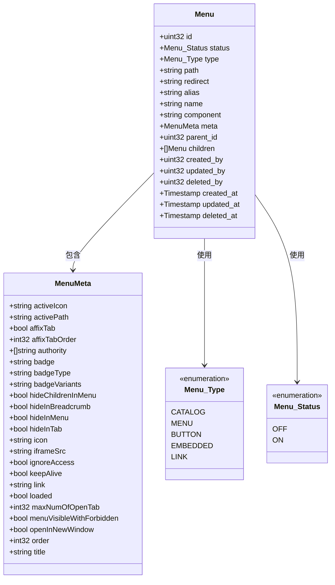
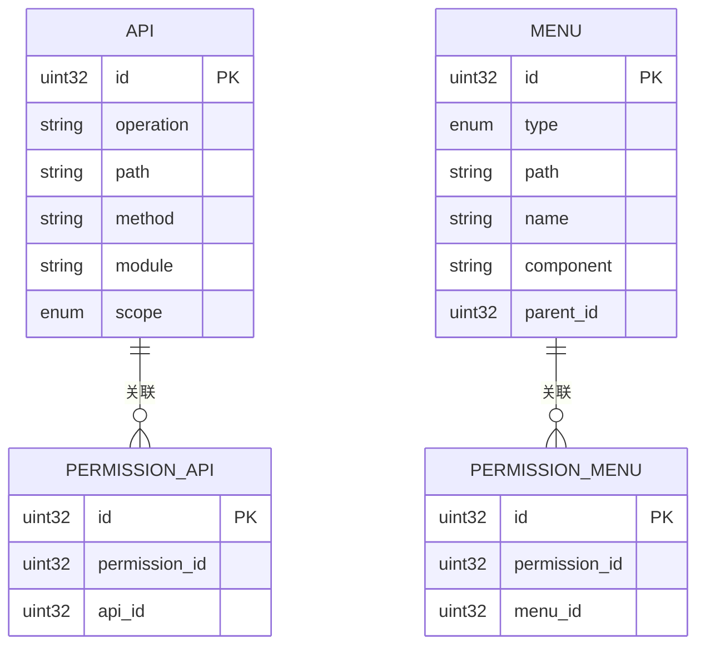
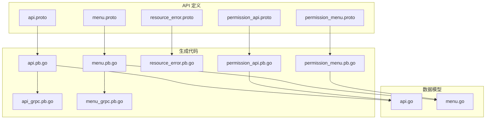
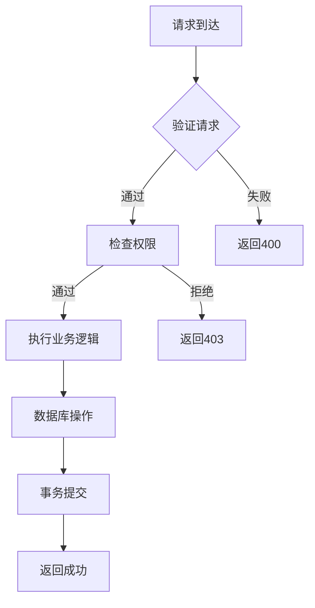

# 资源服务接口

<cite>
**本文档引用的文件**
- [api.proto](file://backend/api/protos/resource/service/v1/api.proto)
- [menu.proto](file://backend/api/protos/resource/service/v1/menu.proto)
- [api.pb.go](file://backend/api/gen/go/resource/service/v1/api.pb.go)
- [menu.pb.go](file://backend/api/gen/go/resource/service/v1/menu.pb.go)
- [resource_error.pb.go](file://backend/api/gen/go/resource/service/v1/resource_error.pb.go)
- [api_grpc.pb.go](file://backend/api/gen/go/resource/service/v1/api_grpc.pb.go)
- [menu_grpc.pb.go](file://backend/api/gen/go/resource/service/v1/menu_grpc.pb.go)
- [permission_api.pb.go](file://backend/api/gen/go/permission/permission_api.pb.go)
- [permission_menu.pb.go](file://backend/api/gen/go/permission/permission_menu.pb.go)
- [api.go](file://backend/app/admin/service/internal/data/ent/schema/api.go)
- [menu.go](file://backend/app/admin/service/internal/data/ent/schema/menu.go)
</cite>

## 目录
1. [简介](#简介)
2. [项目结构](#项目结构)
3. [核心组件](#核心组件)
4. [架构概览](#架构概览)
5. [详细组件分析](#详细组件分析)
6. [依赖关系分析](#依赖关系分析)
7. [性能考虑](#性能考虑)
8. [故障排除指南](#故障排除指南)
9. [结论](#结论)

## 简介

资源服务接口是 go-wind 系统中的核心组件，负责管理 API 资源和菜单资源。该服务提供了完整的 CRUD 操作，支持资源注册、权限绑定和菜单配置等功能。系统采用 gRPC 协议进行服务间通信，使用 Protobuf 进行数据序列化，并通过 Ent ORM 进行数据库操作。

资源服务主要包含两个核心实体：
- **API 资源**：管理系统中的各种接口资源，包括 RESTful API 和内部服务接口
- **菜单资源**：管理前端路由菜单、按钮权限等界面资源

## 项目结构

资源服务接口位于以下目录结构中：

**图表来源**
- [api.proto:1-169](file://backend/api/protos/resource/service/v1/api.proto#L1-L169)
- [menu.proto:1-435](file://backend/api/protos/resource/service/v1/menu.proto#L1-L435)
- [api.pb.go:1-823](file://backend/api/gen/go/resource/service/v1/api.pb.go#L1-L823)
- [menu.pb.go:1-1252](file://backend/api/gen/go/resource/service/v1/menu.pb.go#L1-L1252)

**章节来源**
- [api.proto:1-169](file://backend/api/protos/resource/service/v1/api.proto#L1-L169)
- [menu.proto:1-435](file://backend/api/protos/resource/service/v1/menu.proto#L1-L435)

## 核心组件

### API 资源服务

API 资源服务提供对系统接口资源的完整管理能力：

#### 主要功能
- **资源注册**：注册新的 API 接口到系统中
- **资源查询**：支持按 ID、路径、方法等多种方式查询
- **资源更新**：动态更新 API 资源的配置信息
- **资源删除**：移除不再使用的 API 资源
- **批量同步**：同步外部系统的 API 资源到本地

#### 数据模型
API 资源包含以下关键属性：
- `id`: 资源唯一标识符
- `operation`: 接口操作名称
- `path`: 接口路径
- `method`: HTTP 请求方法
- `module`: 所属业务模块
- `scope`: API 作用域（管理后台/前台应用）
- `status`: 资源状态（启用/禁用）

### 菜单资源服务

菜单资源服务负责管理前端界面的导航结构：

#### 菜单类型
- **目录 (CATALOG)**：用于组织其他菜单的容器
- **菜单 (MENU)**：标准的导航菜单项
- **按钮 (BUTTON)**：页面上的具体操作按钮
- **内嵌 (EMBEDDED)**：嵌入式内容区域
- **外链 (LINK)**：外部链接跳转

#### 菜单元信息
菜单元信息支持丰富的界面配置：
- `authority`: 权限标识列表
- `icon`: 菜单图标
- `title`: 菜单标题
- `order`: 排序编号
- `keepAlive`: KeepAlive 缓存设置

**章节来源**
- [api.pb.go:126-281](file://backend/api/gen/go/resource/service/v1/api.pb.go#L126-L281)
- [menu.pb.go:133-304](file://backend/api/gen/go/resource/service/v1/menu.pb.go#L133-L304)

## 架构概览

资源服务采用分层架构设计，确保了良好的可维护性和扩展性：

**图表来源**
- [api_grpc.pb.go:34-56](file://backend/api/gen/go/resource/service/v1/api_grpc.pb.go#L34-L56)
- [menu_grpc.pb.go:32-50](file://backend/api/gen/go/resource/service/v1/menu_grpc.pb.go#L32-L50)

### 服务接口设计

每个服务都提供了标准的 CRUD 操作接口：

**图表来源**
- [api.proto:25-32](file://backend/api/protos/resource/service/v1/api.proto#L25-L32)
- [menu.proto:26-33](file://backend/api/protos/resource/service/v1/menu.proto#L26-L33)

**章节来源**
- [api_grpc.pb.go:146-169](file://backend/api/gen/go/resource/service/v1/api_grpc.pb.go#L146-L169)
- [menu_grpc.pb.go:120-139](file://backend/api/gen/go/resource/service/v1/menu_grpc.pb.go#L120-L139)

## 详细组件分析

### API 资源管理

#### 数据模型设计

API 资源使用 Ent ORM 进行持久化存储，具有以下特点：

**图表来源**
- [api.pb.go:29-124](file://backend/api/gen/go/resource/service/v1/api.pb.go#L29-L124)
- [api.go:30-81](file://backend/app/admin/service/internal/data/ent/schema/api.go#L30-L81)

#### 索引优化策略

API 资源表建立了多个复合索引以优化查询性能：

| 索引名称 | 字段组合 | 用途 | 存储键 |
|---------|---------|------|--------|
| idx_sys_api_res_module_path_method_scope | module, path, method, scope | 防止重复注册 | unique |
| idx_sys_api_res_module | module | 按模块快速检索 | normal |
| idx_sys_api_res_scope | scope | 按作用域过滤 | normal |
| idx_sys_api_res_path_method | path, method | 快速定位接口 | normal |
| idx_sys_api_res_created_by_created_at | created_by, created_at | 审计回溯 | normal |
| idx_sys_api_res_created_at | created_at | 分页查询 | normal |

**章节来源**
- [api.go:84-112](file://backend/app/admin/service/internal/data/ent/schema/api.go#L84-L112)

### 菜单资源管理

#### 菜单树形结构

菜单资源支持树形结构存储，便于构建复杂的导航层次：

**图表来源**
- [menu.pb.go:133-314](file://backend/api/gen/go/resource/service/v1/menu.pb.go#L133-L314)
- [menu.go:32-92](file://backend/app/admin/service/internal/data/ent/schema/menu.go#L32-L92)

#### 菜单索引设计

菜单表同样采用了多维度索引优化：

| 索引名称 | 字段组合 | 用途 | 存储键 |
|---------|---------|------|--------|
| idx_sys_menu_parent_name | parent_id, name | 同级名称唯一 | unique |
| idx_sys_menu_parent_path | parent_id, path | 同级路径唯一 | unique |
| idx_sys_menu_path | path | 全局路径查找 | normal |
| idx_sys_menu_alias | alias | 别名定位 | normal |
| idx_sys_menu_component | component | 组件聚合 | normal |
| idx_sys_menu_type | type | 类型过滤 | normal |
| idx_sys_menu_status | status | 状态过滤 | normal |
| idx_sys_menu_parent | parent_id | 树结构查询 | normal |
| idx_sys_menu_created_by_created_at | created_by, created_at | 审计回溯 | normal |
| idx_sys_menu_created_at | created_at | 分页查询 | normal |

**章节来源**
- [menu.go:95-140](file://backend/app/admin/service/internal/data/ent/schema/menu.go#L95-L140)

### 权限绑定机制

资源服务与权限系统通过关联表实现松耦合的权限绑定：

**图表来源**
- [permission_api.pb.go:25-84](file://backend/api/gen/go/permission/permission_api.pb.go#L25-L84)
- [permission_menu.pb.go:25-84](file://backend/api/gen/go/permission/permission_menu.pb.go#L25-L84)

#### 权限关联表结构

| 表名 | 字段 | 类型 | 约束 | 说明 |
|------|------|------|------|------|
| permission_api | id | uint32 | PK | 关联记录ID |
| permission_api | permission_id | uint32 | FK | 权限点ID |
| permission_api | api_id | uint32 | FK | API资源ID |
| permission_menu | id | uint32 | PK | 关联记录ID |
| permission_menu | permission_id | uint32 | FK | 权限点ID |
| permission_menu | menu_id | uint32 | FK | 菜单资源ID |

**章节来源**
- [permission_api.pb.go:86-148](file://backend/api/gen/go/permission/permission_api.pb.go#L86-L148)
- [permission_menu.pb.go:86-149](file://backend/api/gen/go/permission/permission_menu.pb.go#L86-L149)

## 依赖关系分析

资源服务接口之间的依赖关系体现了清晰的分层架构：

**图表来源**
- [api.proto:1-12](file://backend/api/protos/resource/service/v1/api.proto#L1-L12)
- [menu.proto:1-13](file://backend/api/protos/resource/service/v1/menu.proto#L1-L13)

### 外部依赖

资源服务依赖以下外部组件：

| 组件 | 版本 | 用途 |
|------|------|------|
| gRPC | v1.64.0+ | 服务通信框架 |
| Protobuf | v3 | 数据序列化 |
| Ent ORM | v0.11+ | 对象关系映射 |
| MySQL | 8.0+ | 数据存储 |
| PostgreSQL | 13+ | 数据存储 |

**章节来源**
- [api_grpc.pb.go:9-16](file://backend/api/gen/go/resource/service/v1/api_grpc.pb.go#L9-L16)
- [menu_grpc.pb.go:9-16](file://backend/api/gen/go/resource/service/v1/menu_grpc.pb.go#L9-L16)

## 性能考虑

### 查询优化

资源服务针对高频查询场景进行了专门的性能优化：

1. **索引策略**
   - API 资源：基于模块、路径、方法的复合索引
   - 菜单资源：基于父子关系的树形索引
   - 支持快速的分页查询和范围扫描

2. **缓存机制**
   - 配置了合理的数据库连接池
   - 支持查询结果的短期缓存
   - 减少重复查询的开销

3. **批量操作**
   - 提供批量同步接口减少网络往返
   - 支持批量删除和更新操作

### 并发控制

系统采用了多种并发控制机制：

**图表来源**
- [resource_error.pb.go:25-117](file://backend/api/gen/go/resource/service/v1/resource_error.pb.go#L25-L117)

## 故障排除指南

### 常见错误类型

资源服务定义了完整的错误码体系：

| 错误类别 | 状态码 | 描述 | 常见场景 |
|----------|--------|------|----------|
| 请求错误 | 400 | 错误请求 | 参数验证失败 |
| 未授权 | 401 | 未授权 | 认证失败 |
| 禁止访问 | 403 | 禁止访问 | 权限不足 |
| 资源不存在 | 404 | 找不到资源 | ID 不存在 |
| 方法不允许 | 405 | 方法不允许 | HTTP 方法错误 |
| 服务器错误 | 500 | 内部服务器错误 | 系统异常 |

### 调试建议

1. **日志分析**
   - 启用详细的访问日志
   - 监控错误率和响应时间
   - 分析慢查询日志

2. **性能监控**
   - 监控数据库连接数
   - 跟踪 API 响应时间
   - 分析内存使用情况

3. **配置检查**
   - 验证数据库连接配置
   - 检查索引完整性
   - 确认权限配置正确

**章节来源**
- [resource_error.pb.go:25-323](file://backend/api/gen/go/resource/service/v1/resource_error.pb.go#L25-L323)

## 结论

资源服务接口为 go-wind 系统提供了完整的资源管理能力。通过精心设计的数据模型、完善的权限机制和高性能的查询优化，该服务能够有效支撑复杂的业务场景。

### 主要优势

1. **模块化设计**：清晰的职责分离，便于维护和扩展
2. **性能优化**：合理的索引策略和查询优化
3. **权限控制**：灵活的权限绑定机制
4. **协议标准化**：基于 gRPC 和 Protobuf 的标准接口
5. **数据一致性**：通过事务保证数据完整性

### 发展方向

未来可以在以下方面进一步改进：
- 增加更多的查询过滤选项
- 优化大数据量场景下的性能表现
- 扩展更多类型的资源管理
- 增强监控和诊断能力