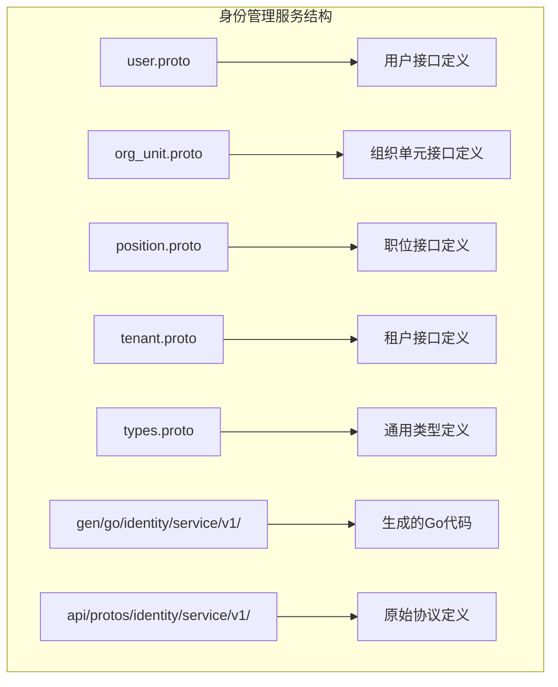
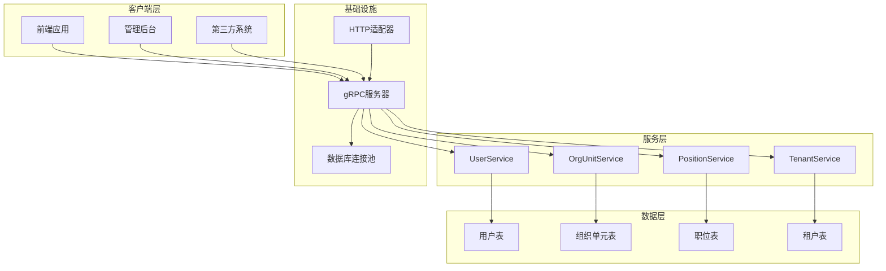
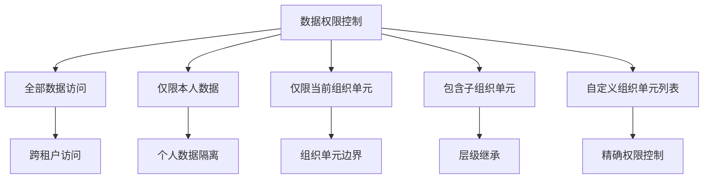
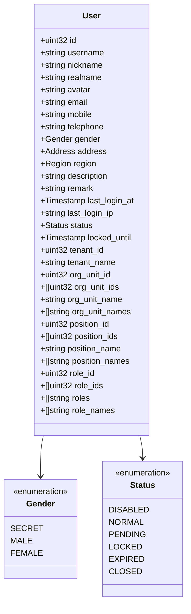
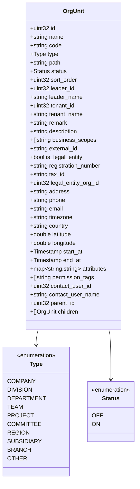
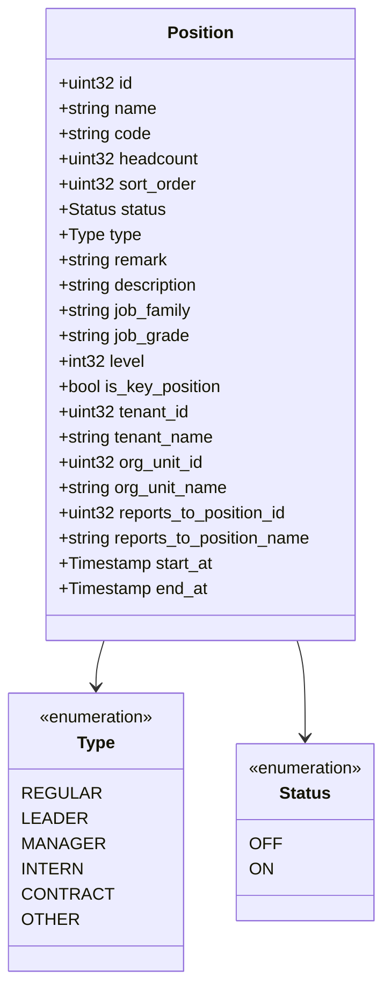
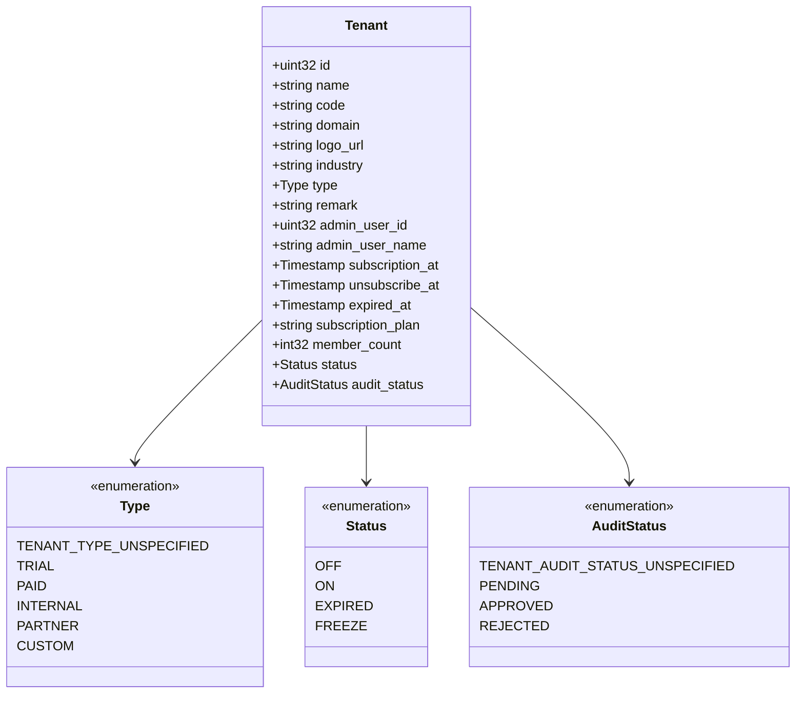
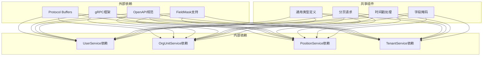
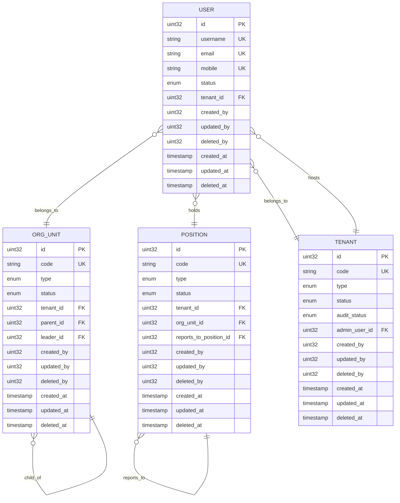

# 身份管理服务接口

<cite>
**本文档引用的文件**
- [user.proto](file://backend/api/protos/identity/service/v1/user.proto)
- [org_unit.proto](file://backend/api/protos/identity/service/v1/org_unit.proto)
- [position.proto](file://backend/api/protos/identity/service/v1/position.proto)
- [tenant.proto](file://backend/api/protos/identity/service/v1/tenant.proto)
- [types.proto](file://backend/api/protos/identity/service/v1/types.proto)
- [user.pb.go](file://backend/api/gen/go/identity/service/v1/user.pb.go)
- [org_unit.pb.go](file://backend/api/gen/go/identity/service/v1/org_unit.pb.go)
- [position.pb.go](file://backend/api/gen/go/identity/service/v1/position.pb.go)
- [tenant.pb.go](file://backend/api/gen/go/identity/service/v1/tenant.pb.go)
- [types.pb.go](file://backend/api/gen/go/identity/service/v1/types.pb.go)
</cite>

## 目录
1. [简介](#简介)
2. [项目结构](#项目结构)
3. [核心组件](#核心组件)
4. [架构概览](#架构概览)
5. [详细组件分析](#详细组件分析)
6. [依赖关系分析](#依赖关系分析)
7. [性能考虑](#性能考虑)
8. [故障排除指南](#故障排除指南)
9. [结论](#结论)

## 简介

身份管理服务接口是Go-Wind系统中的核心模块，负责管理用户、组织架构、职位和租户等身份相关信息。该服务采用Protocol Buffers定义接口规范，提供完整的CRUD操作能力，支持批量操作、数据权限控制和多租户架构。

本服务基于gRPC协议实现，提供高性能的微服务通信能力，支持HTTP/JSON转换，便于前端应用集成。服务设计遵循RESTful原则，同时充分利用gRPC的优势，提供双向流式通信和强类型消息传递。

## 项目结构

身份管理服务位于`backend/api/protos/identity/service/v1/`目录下，包含以下核心文件：

**图表来源**
- [user.proto:1-450](file://backend/api/protos/identity/service/v1/user.proto#L1-L450)
- [org_unit.proto:1-257](file://backend/api/protos/identity/service/v1/org_unit.proto#L1-L257)
- [position.proto:1-230](file://backend/api/protos/identity/service/v1/position.proto#L1-L230)
- [tenant.proto:1-278](file://backend/api/protos/identity/service/v1/tenant.proto#L1-L278)

**章节来源**
- [user.proto:1-450](file://backend/api/protos/identity/service/v1/user.proto#L1-L450)
- [org_unit.proto:1-257](file://backend/api/protos/identity/service/v1/org_unit.proto#L1-L257)
- [position.proto:1-230](file://backend/api/protos/identity/service/v1/position.proto#L1-L230)
- [tenant.proto:1-278](file://backend/api/protos/identity/service/v1/tenant.proto#L1-L278)

## 核心组件

身份管理服务包含四个核心组件，每个组件都提供完整的CRUD操作：

### 用户管理组件
- **UserService**: 提供用户生命周期管理
- 支持单个用户查询、批量查询、统计
- 支持用户创建、更新、删除
- 支持密码管理和联系方式绑定

### 组织架构管理组件
- **OrgUnitService**: 管理组织单元层级结构
- 支持树形组织结构管理
- 支持组织单元的启用/禁用状态
- 支持多类型组织单元定义

### 职位管理组件
- **PositionService**: 管理职位信息和层级关系
- 支持职位类型分类
- 支持汇报关系管理
- 支持编制人数控制

### 租户管理组件
- **TenantService**: 管理多租户环境
- 支持租户状态和审核状态
- 支持租户管理员分配
- 支持订阅和有效期管理

**章节来源**
- [user.proto:14-38](file://backend/api/protos/identity/service/v1/user.proto#L14-L38)
- [org_unit.proto:12-34](file://backend/api/protos/identity/service/v1/org_unit.proto#L12-L34)
- [position.proto:12-33](file://backend/api/protos/identity/service/v1/position.proto#L12-L33)
- [tenant.proto:14-41](file://backend/api/protos/identity/service/v1/tenant.proto#L14-L41)

## 架构概览

身份管理服务采用分层架构设计，确保各组件职责清晰、耦合度低：

**图表来源**
- [user.proto:1-450](file://backend/api/protos/identity/service/v1/user.proto#L1-L450)
- [org_unit.proto:1-257](file://backend/api/protos/identity/service/v1/org_unit.proto#L1-L257)
- [position.proto:1-230](file://backend/api/protos/identity/service/v1/position.proto#L1-L230)
- [tenant.proto:1-278](file://backend/api/protos/identity/service/v1/tenant.proto#L1-L278)

### 数据权限模型

服务支持灵活的数据权限控制，通过DataScope枚举实现不同级别的数据访问控制：

**图表来源**
- [types.proto:5-16](file://backend/api/protos/identity/service/v1/types.proto#L5-L16)

**章节来源**
- [types.proto:1-17](file://backend/api/protos/identity/service/v1/types.proto#L1-L17)

## 详细组件分析

### 用户管理接口详解

用户管理服务提供完整的企业级用户管理功能：

#### 核心数据模型

**图表来源**
- [user.pb.go:140-182](file://backend/api/gen/go/identity/service/v1/user.pb.go#L140-L182)
- [user.proto:40-211](file://backend/api/protos/identity/service/v1/user.proto#L40-L211)

#### 主要接口规范

| 接口名称 | 方法 | 请求参数 | 返回值 | 功能描述 |
|---------|------|----------|--------|----------|
| List | GET | pagination.PagingRequest | ListUserResponse | 获取用户列表 |
| Count | GET | pagination.PagingRequest | CountUserResponse | 统计用户数量 |
| Get | GET | GetUserRequest | User | 获取用户详情 |
| Create | POST | CreateUserRequest | Empty | 创建用户 |
| BatchCreate | POST | BatchCreateUsersRequest | BatchCreateUsersResponse | 批量创建用户 |
| Update | PUT | UpdateUserRequest | Empty | 更新用户 |
| Delete | DELETE | DeleteUserRequest | Empty | 删除用户 |
| UserExists | GET | UserExistsRequest | UserExistsResponse | 检查用户是否存在 |

#### CRUD操作示例

**查询操作示例**
- 获取用户列表：`GET /api/users?page=1&size=10`
- 获取用户详情：`GET /api/users/{id}` 或 `GET /api/users?username={username}`
- 统计用户数量：`GET /api/users/count`

**创建操作示例**
- 创建单个用户：`POST /api/users`，请求体包含User对象和密码
- 批量创建用户：`POST /api/users/batch-create`，请求体包含用户数组

**更新操作示例**
- 更新用户信息：`PUT /api/users/{id}`，支持部分字段更新
- 设置字段掩码：通过update_mask指定要更新的字段

**删除操作示例**
- 删除用户：`DELETE /api/users/{id}` 或 `DELETE /api/users?username={username}`

**章节来源**
- [user.proto:14-38](file://backend/api/protos/identity/service/v1/user.proto#L14-L38)
- [user.pb.go:526-800](file://backend/api/gen/go/identity/service/v1/user.pb.go#L526-L800)

### 组织单元管理接口详解

组织单元服务支持复杂的树形组织结构管理：

#### 核心数据模型

**图表来源**
- [org_unit.pb.go:147-192](file://backend/api/gen/go/identity/service/v1/org_unit.pb.go#L147-L192)
- [org_unit.proto:36-182](file://backend/api/protos/identity/service/v1/org_unit.proto#L36-L182)

#### 组织单元类型定义

| 类型代码 | 类型名称 | 描述 |
|---------|----------|------|
| 0 | COMPANY | 公司 |
| 1 | DIVISION | 分部 |
| 2 | DEPARTMENT | 部门 |
| 3 | TEAM | 团队 |
| 4 | PROJECT | 项目 |
| 5 | COMMITTEE | 委员会 |
| 6 | REGION | 区域 |
| 7 | SUBSIDIARY | 子公司 |
| 8 | BRANCH | 分支机构 |
| 100 | OTHER | 其他 |

#### 主要接口规范

| 接口名称 | 方法 | 请求参数 | 返回值 | 功能描述 |
|---------|------|----------|--------|----------|
| List | GET | pagination.PagingRequest | ListOrgUnitResponse | 获取组织单元列表 |
| Count | GET | pagination.PagingRequest | CountOrgUnitResponse | 统计组织单元数量 |
| Get | GET | GetOrgUnitRequest | OrgUnit | 获取组织单元详情 |
| Create | POST | CreateOrgUnitRequest | Empty | 创建组织单元 |
| Update | PUT | UpdateOrgUnitRequest | Empty | 更新组织单元 |
| Delete | DELETE | DeleteOrgUnitRequest | Empty | 删除组织单元 |
| BatchCreate | POST | BatchCreateOrgUnitsRequest | BatchCreateOrgUnitsResponse | 批量创建组织单元 |

**章节来源**
- [org_unit.proto:12-34](file://backend/api/protos/identity/service/v1/org_unit.proto#L12-L34)
- [org_unit.pb.go:557-800](file://backend/api/gen/go/identity/service/v1/org_unit.pb.go#L557-L800)

### 职位管理接口详解

职位服务管理企业的职位体系和汇报关系：

#### 核心数据模型

**图表来源**
- [position.pb.go:135-167](file://backend/api/gen/go/identity/service/v1/position.pb.go#L135-L167)
- [position.proto:35-145](file://backend/api/protos/identity/service/v1/position.proto#L35-L145)

#### 职位类型定义

| 类型代码 | 类型名称 | 描述 |
|---------|----------|------|
| 0 | REGULAR | 普通职位 |
| 1 | LEADER | 领导职位 |
| 2 | MANAGER | 管理职位 |
| 3 | INTERN | 实习职位 |
| 4 | CONTRACT | 合同职位 |
| 100 | OTHER | 其他职位 |

#### 主要接口规范

| 接口名称 | 方法 | 请求参数 | 返回值 | 功能描述 |
|---------|------|----------|--------|----------|
| List | GET | pagination.PagingRequest | ListPositionResponse | 获取职位列表 |
| Count | GET | pagination.PagingRequest | CountPositionResponse | 统计职位数量 |
| Get | GET | GetPositionRequest | Position | 获取职位详情 |
| Create | POST | CreatePositionRequest | Empty | 创建职位 |
| BatchCreate | POST | BatchCreatePositionsRequest | BatchCreatePositionsResponse | 批量创建职位 |
| Update | PUT | UpdatePositionRequest | Empty | 更新职位 |
| Delete | DELETE | DeletePositionRequest | Empty | 删除职位 |

**章节来源**
- [position.proto:12-33](file://backend/api/protos/identity/service/v1/position.proto#L12-L33)
- [position.pb.go:441-728](file://backend/api/gen/go/identity/service/v1/position.pb.go#L441-L728)

### 租户管理接口详解

租户服务支持多租户架构下的租户生命周期管理：

#### 核心数据模型

**图表来源**
- [tenant.pb.go:194-222](file://backend/api/gen/go/identity/service/v1/tenant.pb.go#L194-L222)
- [tenant.proto:43-156](file://backend/api/protos/identity/service/v1/tenant.proto#L43-L156)

#### 租户类型定义

| 类型代码 | 类型名称 | 描述 |
|---------|----------|------|
| 0 | TENANT_TYPE_UNSPECIFIED | 未指定 |
| 1 | TRIAL | 试用 |
| 2 | PAID | 付费 |
| 3 | INTERNAL | 内部 |
| 4 | PARTNER | 合作伙伴 |
| 5 | CUSTOM | 定制 |

#### 主要接口规范

| 接口名称 | 方法 | 请求参数 | 返回值 | 功能描述 |
|---------|------|----------|--------|----------|
| List | GET | pagination.PagingRequest | ListTenantResponse | 获取租户列表 |
| Count | GET | pagination.PagingRequest | CountTenantResponse | 统计租户数量 |
| Get | GET | GetTenantRequest | Tenant | 获取租户详情 |
| Create | POST | CreateTenantRequest | Empty | 创建租户 |
| BatchCreate | POST | BatchCreateTenantsRequest | BatchCreateTenantsResponse | 批量创建租户 |
| Update | PUT | UpdateTenantRequest | Empty | 更新租户 |
| Delete | DELETE | DeleteTenantRequest | Empty | 删除租户 |
| TenantExists | GET | TenantExistsRequest | TenantExistsResponse | 检查租户是否存在 |
| AssignTenantAdmin | POST | AssignTenantAdminRequest | Empty | 分配租户管理员 |

**章节来源**
- [tenant.proto:14-41](file://backend/api/protos/identity/service/v1/tenant.proto#L14-L41)
- [tenant.pb.go:468-754](file://backend/api/gen/go/identity/service/v1/tenant.pb.go#L468-L754)

## 依赖关系分析

身份管理服务的依赖关系体现了清晰的分层架构：

**图表来源**
- [user.proto:1-12](file://backend/api/protos/identity/service/v1/user.proto#L1-L12)
- [org_unit.proto:1-10](file://backend/api/protos/identity/service/v1/org_unit.proto#L1-L10)
- [position.proto:1-10](file://backend/api/protos/identity/service/v1/position.proto#L1-L10)
- [tenant.proto:1-12](file://backend/api/protos/identity/service/v1/tenant.proto#L1-L12)

### 数据模型关系

**图表来源**
- [user.pb.go:140-182](file://backend/api/gen/go/identity/service/v1/user.pb.go#L140-L182)
- [org_unit.pb.go:147-192](file://backend/api/gen/go/identity/service/v1/org_unit.pb.go#L147-L192)
- [position.pb.go:135-167](file://backend/api/gen/go/identity/service/v1/position.pb.go#L135-L167)
- [tenant.pb.go:194-222](file://backend/api/gen/go/identity/service/v1/tenant.pb.go#L194-L222)

**章节来源**
- [user.proto:40-211](file://backend/api/protos/identity/service/v1/user.proto#L40-L211)
- [org_unit.proto:36-182](file://backend/api/protos/identity/service/v1/org_unit.proto#L36-L182)
- [position.proto:35-145](file://backend/api/protos/identity/service/v1/position.proto#L35-L145)
- [tenant.proto:43-156](file://backend/api/protos/identity/service/v1/tenant.proto#L43-L156)

## 性能考虑

身份管理服务在设计时充分考虑了性能优化：

### 查询优化策略
- **索引设计**: 关键字段建立适当索引，支持快速查询
- **分页机制**: 默认支持分页查询，避免大数据量传输
- **字段选择**: 支持FieldMask选择性返回字段，减少网络传输

### 缓存策略
- **热点数据缓存**: 经常访问的用户信息、组织结构进行缓存
- **配置数据缓存**: 租户配置、职位类型等静态数据缓存
- **会话管理**: 用户登录状态和权限信息缓存

### 并发处理
- **连接池**: 数据库连接池管理，支持高并发访问
- **异步处理**: 批量操作采用异步处理，提升用户体验
- **锁机制**: 关键操作使用适当的锁机制保证数据一致性

## 故障排除指南

### 常见问题及解决方案

**用户相关问题**
- 用户名重复: 系统会返回唯一约束冲突错误
- 密码验证失败: 检查密码复杂度和历史密码策略
- 登录锁定: 账户因多次失败登录被暂时锁定

**组织架构问题**
- 组织单元层级错误: 检查父子关系和树形结构完整性
- 权限继承问题: 验证组织单元权限继承规则
- 数据同步问题: 检查外部系统ID映射关系

**职位管理问题**
- 汇报关系循环: 系统会检测并阻止循环汇报关系
- 编制人数超限: 超出编制人数的职位分配会被拒绝
- 职位类型冲突: 不同类型的职位不能在同一组织单元中存在

**租户管理问题**
- 租户状态异常: 检查订阅状态和到期时间
- 管理员权限不足: 验证租户管理员的权限级别
- 多租户隔离问题: 确认租户间数据隔离配置

**章节来源**
- [user.proto:295-312](file://backend/api/protos/identity/service/v1/user.proto#L295-L312)
- [org_unit.proto:232-240](file://backend/api/protos/identity/service/v1/org_unit.proto#L232-L240)
- [position.proto:205-213](file://backend/api/protos/identity/service/v1/position.proto#L205-L213)
- [tenant.proto:216-224](file://backend/api/protos/identity/service/v1/tenant.proto#L216-L224)

## 结论

身份管理服务接口提供了完整的企业级身份管理解决方案，具有以下特点：

### 技术优势
- **标准化接口**: 基于Protocol Buffers定义，支持多语言客户端
- **强类型系统**: 编译时类型检查，减少运行时错误
- **高性能通信**: gRPC提供高效的二进制协议和流式通信
- **灵活的数据权限**: 支持多种数据访问控制模式

### 功能完整性
- **完整的CRUD操作**: 每个实体都支持创建、读取、更新、删除
- **批量操作支持**: 支持批量创建和批量更新操作
- **多租户架构**: 完整的多租户支持和租户间隔离
- **权限管理**: 与权限系统的深度集成

### 扩展性设计
- **模块化架构**: 各组件职责清晰，易于扩展和维护
- **插件化支持**: 支持自定义扩展和第三方集成
- **监控和日志**: 完善的监控指标和日志记录

该服务为现代企业提供了可靠的身份管理基础设施，支持从初创公司到大型企业的各种规模需求。