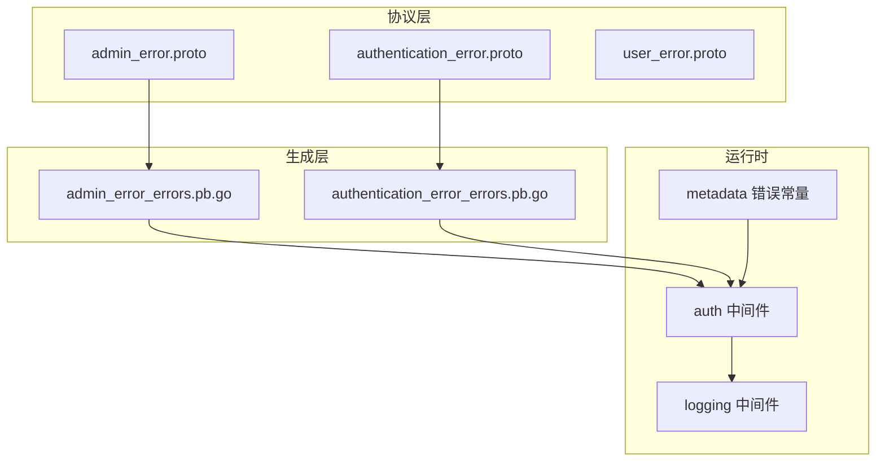
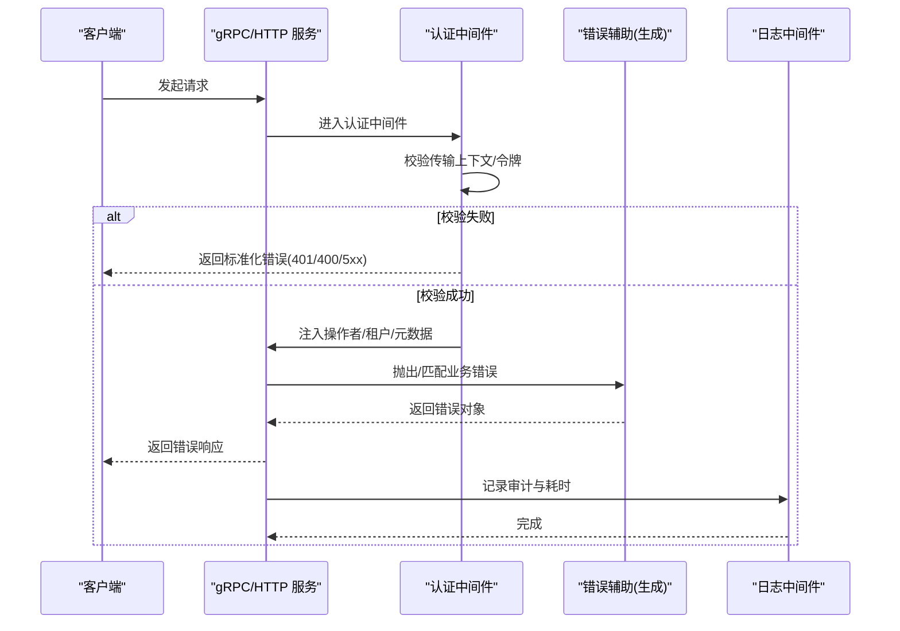
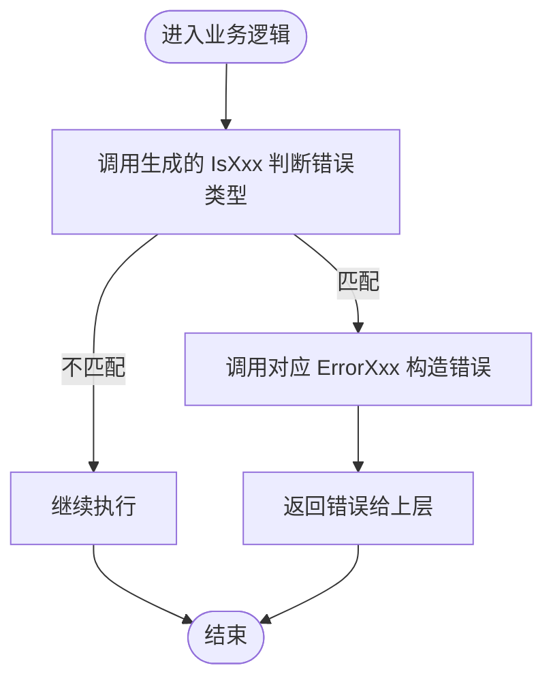
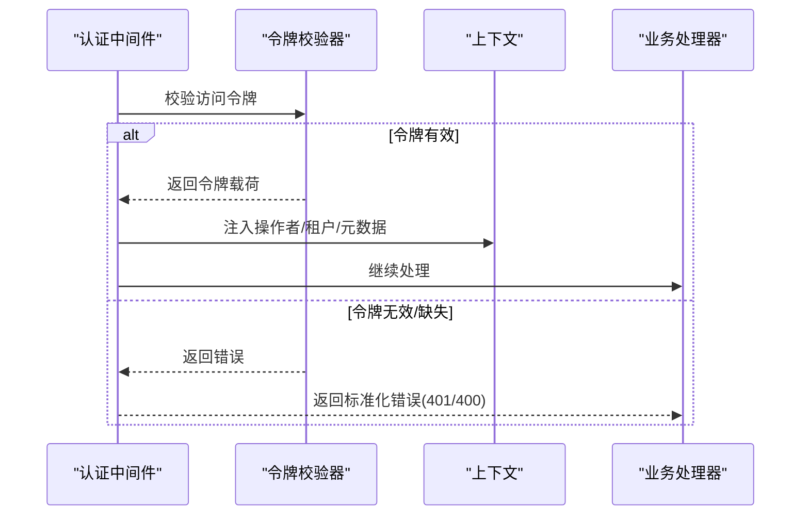
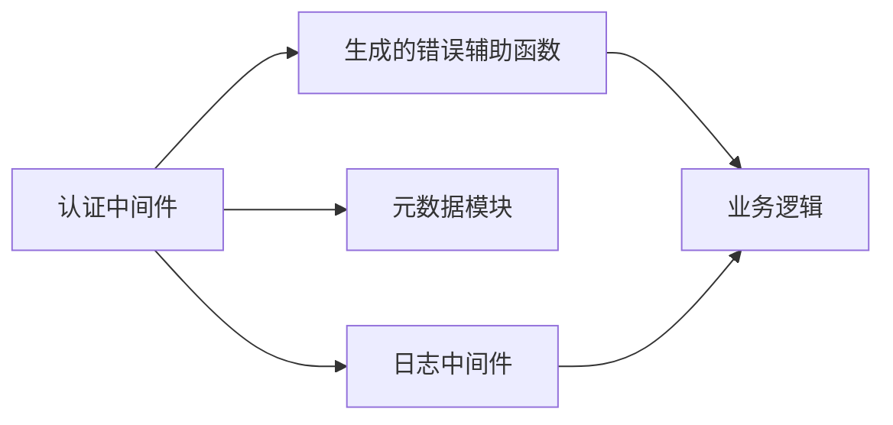

# 错误处理机制

<cite>
**本文档引用的文件**
- [admin_error.proto](file://backend/api/protos/admin/service/v1/admin_error.proto)
- [authentication_error.proto](file://backend/api/protos/authentication/service/v1/authentication_error.proto)
- [user_error.proto](file://backend/api/protos/identity/service/v1/user_error.proto)
- [admin_error_errors.pb.go](file://backend/api/gen/go/admin/service/v1/admin_error_errors.pb.go)
- [authentication_error_errors.pb.go](file://backend/api/gen/go/authentication/service/v1/authentication_error_errors.pb.go)
- [errors.go](file://backend/pkg/metadata/errors.go)
- [auth.go](file://backend/pkg/middleware/auth/auth.go)
- [errors.go](file://backend/pkg/middleware/auth/errors.go)
- [logging.go](file://backend/pkg/middleware/logging/logging.go)
</cite>

## 目录
1. [简介](#简介)
2. [项目结构](#项目结构)
3. [核心组件](#核心组件)
4. [架构总览](#架构总览)
5. [详细组件分析](#详细组件分析)
6. [依赖关系分析](#依赖关系分析)
7. [性能考量](#性能考量)
8. [故障排查指南](#故障排查指南)
9. [结论](#结论)

## 简介
本文件系统性梳理 GoWind Admin 的错误处理机制，重点覆盖以下方面：
- 统一错误码体系：基于 protobuf 定义的错误枚举与生成器，确保 gRPC 错误与 HTTP 映射的一致性
- 错误分类与错误码定义：按 HTTP 状态码分组，覆盖常见业务与非标准场景
- gRPC 错误处理模式：标准错误类型、自定义错误、元数据传递
- HTTP 错误映射机制：将 gRPC 错误转换为 HTTP 状态码
- 最佳实践：错误传播、日志记录、用户友好提示
- 实战示例与调试方法：帮助开发者快速定位与修复问题

## 项目结构
围绕错误处理的关键目录与文件如下：
- Protobuf 错误定义：位于 backend/api/protos/*/service/v1/*.proto
- 生成的错误辅助代码：backend/api/gen/go/*/*/errors.pb.go
- 中间件与元数据：backend/pkg/middleware/* 与 backend/pkg/metadata/*
- 日志中间件：backend/pkg/middleware/logging/logging.go



**图表来源**
- [admin_error.proto](file://backend/api/protos/admin/service/v1/admin_error.proto)
- [authentication_error.proto](file://backend/api/protos/authentication/service/v1/authentication_error.proto)
- [user_error.proto](file://backend/api/protos/identity/service/v1/user_error.proto)
- [admin_error_errors.pb.go](file://backend/api/gen/go/admin/service/v1/admin_error_errors.pb.go)
- [authentication_error_errors.pb.go](file://backend/api/gen/go/authentication/service/v1/authentication_error_errors.pb.go)
- [auth.go](file://backend/pkg/middleware/auth/auth.go)
- [logging.go](file://backend/pkg/middleware/logging/logging.go)
- [errors.go](file://backend/pkg/metadata/errors.go)

**章节来源**
- [admin_error.proto](file://backend/api/protos/admin/service/v1/admin_error.proto)
- [authentication_error.proto](file://backend/api/protos/authentication/service/v1/authentication_error.proto)
- [user_error.proto](file://backend/api/protos/identity/service/v1/user_error.proto)
- [admin_error_errors.pb.go](file://backend/api/gen/go/admin/service/v1/admin_error_errors.pb.go)
- [authentication_error_errors.pb.go](file://backend/api/gen/go/authentication/service/v1/authentication_error_errors.pb.go)
- [errors.go](file://backend/pkg/metadata/errors.go)
- [auth.go](file://backend/pkg/middleware/auth/auth.go)
- [logging.go](file://backend/pkg/middleware/logging/logging.go)

## 核心组件
- 统一错误码定义（Protobuf）
  - 在各服务的 proto 文件中通过枚举定义错误原因，并使用注解为每个枚举项绑定 HTTP 状态码
  - 默认码由 option 设置，便于在未显式指定时回退
- 生成的错误辅助函数
  - 通过生成器为每个枚举项生成判断函数与构造函数，便于在业务逻辑中进行错误匹配与抛出
- 中间件与元数据
  - 认证中间件负责令牌校验、注入操作者信息与租户信息，并在异常时返回标准化错误
  - 元数据模块提供缺失或非法元数据的标准化错误
- 日志中间件
  - 对登录与 API 调用进行审计与耗时统计，便于问题定位

**章节来源**
- [admin_error.proto](file://backend/api/protos/admin/service/v1/admin_error.proto)
- [authentication_error.proto](file://backend/api/protos/authentication/service/v1/authentication_error.proto)
- [user_error.proto](file://backend/api/protos/identity/service/v1/user_error.proto)
- [admin_error_errors.pb.go](file://backend/api/gen/go/admin/service/v1/admin_error_errors.pb.go)
- [authentication_error_errors.pb.go](file://backend/api/gen/go/authentication/service/v1/authentication_error_errors.pb.go)
- [errors.go](file://backend/pkg/metadata/errors.go)
- [auth.go](file://backend/pkg/middleware/auth/auth.go)
- [logging.go](file://backend/pkg/middleware/logging/logging.go)

## 架构总览
下图展示从请求进入服务端到错误处理与日志记录的整体流程。



**图表来源**
- [auth.go](file://backend/pkg/middleware/auth/auth.go)
- [admin_error_errors.pb.go](file://backend/api/gen/go/admin/service/v1/admin_error_errors.pb.go)
- [authentication_error_errors.pb.go](file://backend/api/gen/go/authentication/service/v1/authentication_error_errors.pb.go)
- [logging.go](file://backend/pkg/middleware/logging/logging.go)

## 详细组件分析

### 统一错误码体系设计
- 错误分类
  - 按 HTTP 状态码分组：4xx（客户端相关）、5xx（服务端相关）以及若干非标准场景
  - 常见错误如 UNAUTHORIZED、FORBIDDEN、NOT_FOUND、INTERNAL_SERVER_ERROR 等均有明确枚举项
- 错误码定义
  - 使用注解将枚举值与 HTTP 状态码绑定，保证 gRPC 错误与 HTTP 映射一致
  - 默认码通过 option 指定，便于在未显式标注时保持一致性
- 错误消息国际化
  - 当前仓库未直接提供多语言错误消息；建议在前端或网关层根据错误码映射本地化文案
  - 生成的错误对象包含 Reason 与 Code，便于前端按 Code 分类展示

```mermaid
classDiagram
class AdminErrorReason {
+BAD_REQUEST
+UNAUTHORIZED
+FORBIDDEN
+NOT_FOUND
+INTERNAL_SERVER_ERROR
+...
}
class AuthenticationErrorReason {
+BAD_REQUEST
+UNAUTHORIZED
+USER_NOT_FOUND
+TOKEN_EXPIRED
+...
}
class UserErrorReason {
+BAD_REQUEST
+UNAUTHORIZED
+USER_NOT_FOUND
+ROLE_NOT_FOUND
+...
}
AdminErrorReason --> "映射 HTTP 状态码" : "注解绑定"
AuthenticationErrorReason --> "映射 HTTP 状态码" : "注解绑定"
UserErrorReason --> "映射 HTTP 状态码" : "注解绑定"
```

**图表来源**
- [admin_error.proto](file://backend/api/protos/admin/service/v1/admin_error.proto)
- [authentication_error.proto](file://backend/api/protos/authentication/service/v1/authentication_error.proto)
- [user_error.proto](file://backend/api/protos/identity/service/v1/user_error.proto)

**章节来源**
- [admin_error.proto](file://backend/api/protos/admin/service/v1/admin_error.proto)
- [authentication_error.proto](file://backend/api/protos/authentication/service/v1/authentication_error.proto)
- [user_error.proto](file://backend/api/protos/identity/service/v1/user_error.proto)

### 生成的错误辅助函数
- 功能概览
  - 为每个枚举项生成 IsXxx 与 ErrorXxx 函数，便于在业务层进行错误匹配与构造
  - 通过统一的错误库创建带 Code 与 Reason 的错误对象
- 使用建议
  - 在业务逻辑中优先使用生成的 ErrorXxx 创建错误
  - 使用 IsXxx 进行错误类型判断，避免字符串比较
- 示例路径
  - [admin_error_errors.pb.go](file://backend/api/gen/go/admin/service/v1/admin_error_errors.pb.go)
  - [authentication_error_errors.pb.go](file://backend/api/gen/go/authentication/service/v1/authentication_error_errors.pb.go)



**图表来源**
- [admin_error_errors.pb.go](file://backend/api/gen/go/admin/service/v1/admin_error_errors.pb.go)
- [authentication_error_errors.pb.go](file://backend/api/gen/go/authentication/service/v1/authentication_error_errors.pb.go)

**章节来源**
- [admin_error_errors.pb.go](file://backend/api/gen/go/admin/service/v1/admin_error_errors.pb.go)
- [authentication_error_errors.pb.go](file://backend/api/gen/go/authentication/service/v1/authentication_error_errors.pb.go)

### gRPC 错误处理模式
- 标准错误类型
  - 使用统一错误库创建带 Code 与 Reason 的错误对象
  - 认证中间件在令牌缺失、过期、无效等场景返回标准化错误
- 自定义错误
  - 通过 Protobuf 枚举定义业务错误原因，结合生成的辅助函数实现强类型错误处理
- 元数据传递
  - 认证中间件将操作者 ID、租户 ID、组织单位 ID、数据范围等注入上下文，供后续处理使用
  - 元数据模块提供缺失或非法元数据的标准化错误



**图表来源**
- [auth.go](file://backend/pkg/middleware/auth/auth.go)
- [errors.go](file://backend/pkg/middleware/auth/errors.go)
- [errors.go](file://backend/pkg/metadata/errors.go)

**章节来源**
- [auth.go](file://backend/pkg/middleware/auth/auth.go)
- [errors.go](file://backend/pkg/middleware/auth/errors.go)
- [errors.go](file://backend/pkg/metadata/errors.go)

### HTTP 错误映射机制
- 映射策略
  - 由于错误码在 Protobuf 中已与 HTTP 状态码绑定，因此在 gRPC/HTTP 网关层可直接使用 Code 映射到 HTTP 状态码
  - 建议在网关或拦截器中统一处理，将 gRPC 错误转换为 HTTP 响应
- 建议实现点
  - 在网关层捕获 gRPC 错误，提取 Code 与 Message，设置 HTTP 状态码并返回统一 JSON 错误格式
  - 对于 401/403 等鉴权相关错误，可结合前端路由守卫进行重定向或跳转至登录页

[本节为概念性说明，无需“章节来源”]

### 最佳实践
- 错误传播
  - 仅在边界处包装错误，内部尽量保持原始错误类型，便于上层使用生成的 IsXxx 进行精确判断
- 日志记录
  - 使用日志中间件记录请求耗时、审计事件与错误上下文，便于问题追踪
- 用户友好提示
  - 前端根据错误码映射本地化文案；对敏感错误（如令牌过期）避免泄露具体细节
- 元数据与上下文
  - 在认证中间件中严格校验与注入元数据，确保后续处理能获取到必要的操作者与租户信息

**章节来源**
- [logging.go](file://backend/pkg/middleware/logging/logging.go)
- [auth.go](file://backend/pkg/middleware/auth/auth.go)

## 依赖关系分析
- 组件耦合
  - 业务层依赖生成的错误辅助函数进行错误构造与匹配
  - 中间件依赖统一错误库与元数据模块，负责错误的早期拦截与上下文注入
- 外部依赖
  - 错误库：用于创建标准化错误对象
  - 日志库：用于记录审计与耗时
  - 令牌校验器：用于访问令牌有效性校验



**图表来源**
- [admin_error_errors.pb.go](file://backend/api/gen/go/admin/service/v1/admin_error_errors.pb.go)
- [authentication_error_errors.pb.go](file://backend/api/gen/go/authentication/service/v1/authentication_error_errors.pb.go)
- [auth.go](file://backend/pkg/middleware/auth/auth.go)
- [errors.go](file://backend/pkg/metadata/errors.go)
- [logging.go](file://backend/pkg/middleware/logging/logging.go)

**章节来源**
- [admin_error_errors.pb.go](file://backend/api/gen/go/admin/service/v1/admin_error_errors.pb.go)
- [authentication_error_errors.pb.go](file://backend/api/gen/go/authentication/service/v1/authentication_error_errors.pb.go)
- [auth.go](file://backend/pkg/middleware/auth/auth.go)
- [errors.go](file://backend/pkg/metadata/errors.go)
- [logging.go](file://backend/pkg/middleware/logging/logging.go)

## 性能考量
- 错误构造与匹配成本低：生成的 IsXxx 与 ErrorXxx 基于枚举名与整数 Code，判断与构造开销极小
- 中间件链路短：认证与日志中间件仅在必要时进行额外处理，避免对正常路径造成明显延迟
- 建议
  - 将复杂错误处理下沉至业务层，减少中间件中的分支判断
  - 对高频错误（如令牌过期）可在网关层进行缓存与快速拒绝，降低后端压力

[本节为通用指导，无需“章节来源”]

## 故障排查指南
- 常见错误与定位
  - 401 未授权：检查令牌是否存在、是否过期、是否与当前用户匹配
  - 403 禁止访问：检查权限策略与角色/租户范围
  - 404 资源不存在：核对 ID 是否正确、是否已被删除
  - 500 内部错误：查看日志中间件输出的耗时与审计信息，定位具体业务处理环节
- 调试步骤
  - 在认证中间件中确认令牌校验结果与上下文注入是否成功
  - 使用生成的 IsXxx 函数在业务层打印错误类型，缩小问题范围
  - 通过日志中间件查看请求耗时与审计事件，结合 TraceID 追踪请求链路

**章节来源**
- [auth.go](file://backend/pkg/middleware/auth/auth.go)
- [errors.go](file://backend/pkg/middleware/auth/errors.go)
- [logging.go](file://backend/pkg/middleware/logging/logging.go)

## 结论
GoWind Admin 的错误处理机制以 Protobuf 统一错误码为核心，配合生成的强类型辅助函数与中间件，实现了从 gRPC 到 HTTP 的一致映射与可追踪的日志记录。建议在实际落地中：
- 在网关层完成 gRPC/HTTP 错误映射与统一响应格式
- 在前端按错误码进行本地化提示
- 严格遵循中间件链路，确保认证与元数据注入的可靠性
- 持续完善审计与日志，提升问题定位效率