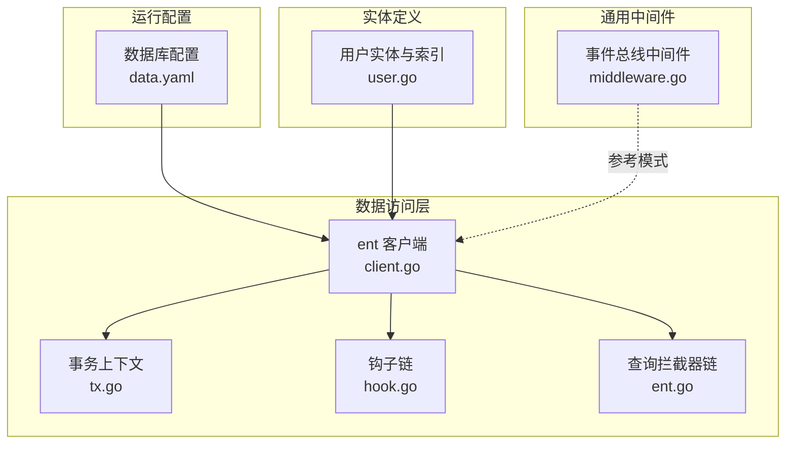
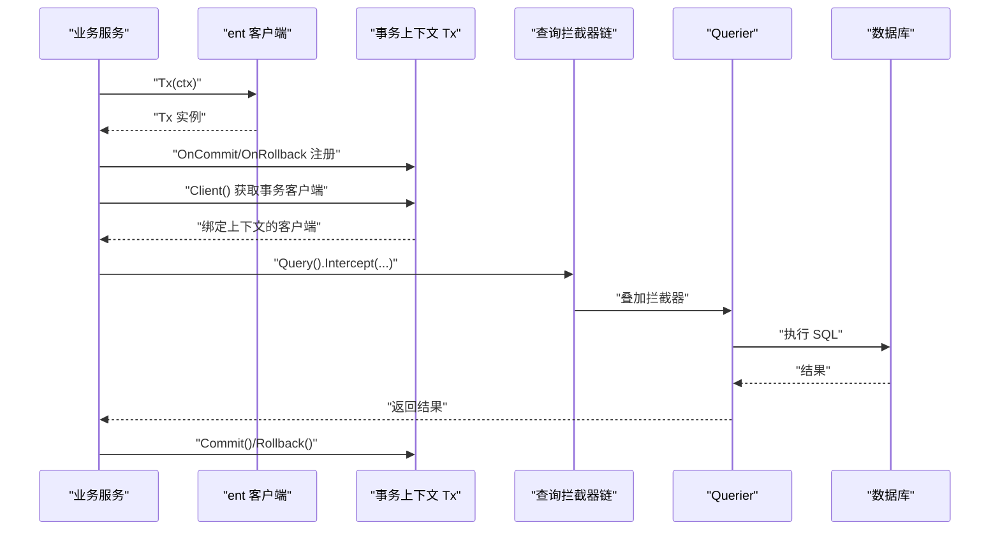
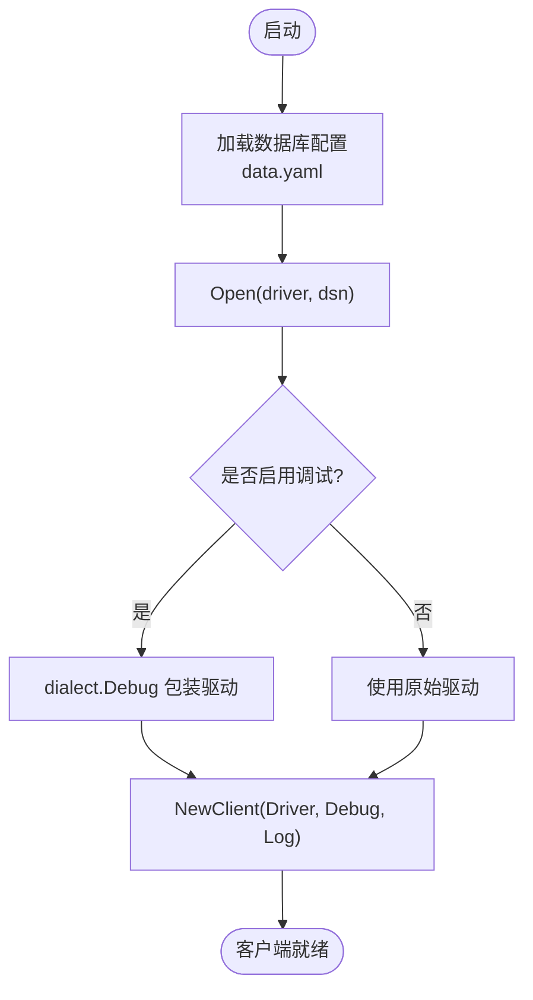
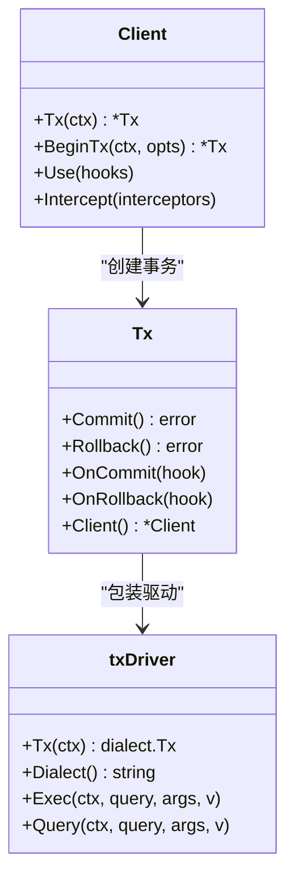
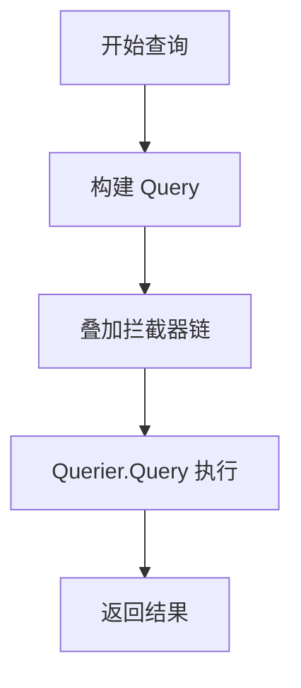
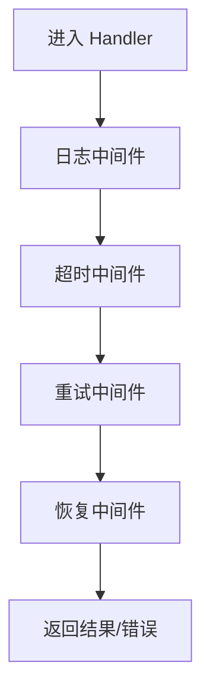
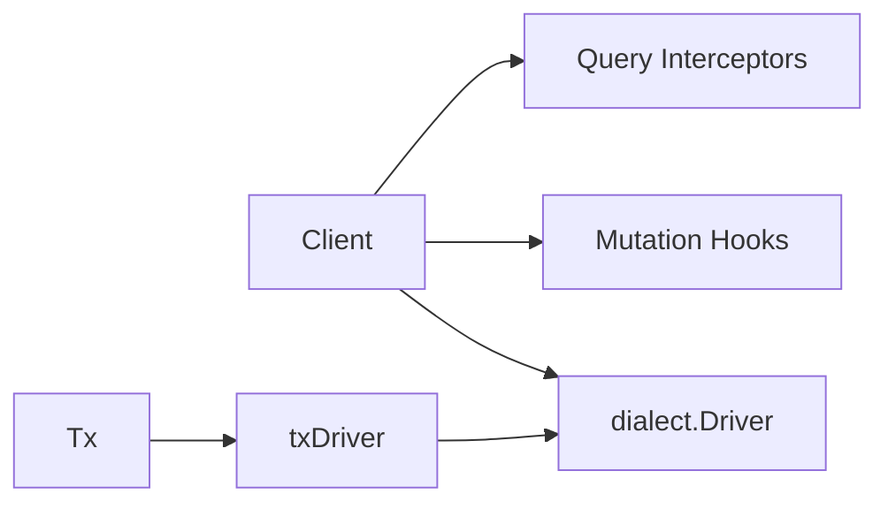

# Ent ORM 中间件

<cite>
**本文引用的文件**
- [client.go](file://backend/app/admin/service/internal/data/ent/client.go)
- [tx.go](file://backend/app/admin/service/internal/data/ent/tx.go)
- [hook.go](file://backend/app/admin/service/internal/data/ent/hook/hook.go)
- [ent.go](file://backend/app/admin/service/internal/data/ent/ent.go)
- [user.go](file://backend/app/admin/service/internal/data/ent/schema/user.go)
- [data.yaml](file://backend/app/admin/service/configs/data.yaml)
- [middleware.go](file://backend/pkg/eventbus/middleware.go)
</cite>

## 目录
1. [简介](#简介)
2. [项目结构](#项目结构)
3. [核心组件](#核心组件)
4. [架构总览](#架构总览)
5. [详细组件分析](#详细组件分析)
6. [依赖分析](#依赖分析)
7. [性能考虑](#性能考虑)
8. [故障排查指南](#故障排查指南)
9. [结论](#结论)
10. [附录](#附录)

## 简介
本文件系统性阐述在本项目中如何将 Ent ORM 作为数据访问层的核心组件，并通过“中间件”式的设计理念实现统一的数据库连接管理、事务处理、查询拦截与修改、以及与业务服务的协作模式。文档重点覆盖以下方面：
- 数据库连接与客户端初始化：驱动选择、连接池参数、调试与日志选项。
- 事务管理：事务开启、提交、回滚、钩子链与中间件式扩展。
- 查询拦截与修改：全局拦截器注册、查询执行链路、拦截器叠加顺序。
- 权限与数据隔离：基于租户字段的索引设计与查询约束思路。
- 错误处理与可观测性：调试日志、超时与重试策略、事件总线中间件。

## 项目结构
围绕 Ent ORM 的关键位置如下：
- 客户端与驱动：ent 客户端、驱动配置、Open/Debug/Close 等入口。
- 事务：Tx 结构体、commit/rollback 钩子、txDriver 包装。
- 钩子与拦截器：Mutation 钩子链、Query 拦截器链、条件化执行。
- 架构注解与索引：实体注解、索引设计体现多维查询与数据隔离。
- 运行配置：数据库连接字符串、连接池参数、调试开关。
- 事件总线中间件：日志、超时、重试、恢复等通用中间件模式，可借鉴到数据访问层。

**图表来源**
- [client.go:142-399](file://backend/app/admin/service/internal/data/ent/client.go#L142-L399)
- [tx.go:12-98](file://backend/app/admin/service/internal/data/ent/tx.go#L12-L98)
- [hook.go:608-642](file://backend/app/admin/service/internal/data/ent/hook/hook.go#L608-L642)
- [ent.go:608-645](file://backend/app/admin/service/internal/data/ent/ent.go#L608-L645)
- [user.go:13-171](file://backend/app/admin/service/internal/data/ent/schema/user.go#L13-L171)
- [data.yaml:1-20](file://backend/app/admin/service/configs/data.yaml#L1-L20)
- [middleware.go:10-114](file://backend/pkg/eventbus/middleware.go#L10-L114)

**章节来源**
- [client.go:142-399](file://backend/app/admin/service/internal/data/ent/client.go#L142-L399)
- [tx.go:12-98](file://backend/app/admin/service/internal/data/ent/tx.go#L12-L98)
- [hook.go:608-642](file://backend/app/admin/service/internal/data/ent/hook/hook.go#L608-L642)
- [ent.go:608-645](file://backend/app/admin/service/internal/data/ent/ent.go#L608-L645)
- [user.go:13-171](file://backend/app/admin/service/internal/data/ent/schema/user.go#L13-L171)
- [data.yaml:1-20](file://backend/app/admin/service/configs/data.yaml#L1-L20)
- [middleware.go:10-114](file://backend/pkg/eventbus/middleware.go#L10-L114)

## 核心组件
- 客户端与驱动
  - 支持 MySQL、Postgres、SQLite 驱动，Open 函数负责打开连接并返回客户端。
  - Debug 选项启用调试日志；Log 可自定义日志函数；Driver 注入底层驱动。
  - Close 关闭数据库连接。
- 事务
  - Tx 为事务上下文，封装 Commit/Rollback 钩子链，支持 OnCommit/OnRollback 注册。
  - txDriver 包装底层 dialect.Tx，使内部构建器不直接操作提交/回滚，统一由 Tx 控制。
- 钩子与拦截器
  - Mutation 钩子链：Use 注册到各实体客户端，支持条件化执行（If/On/Unless）与组合（Chain）。
  - Query 拦截器链：Intercept 注册到各实体客户端，拦截器以链式叠加，最终由 Querier 执行。
- 实体与索引
  - 用户实体包含多维索引，覆盖租户维度的唯一性与常用查询场景，便于实现数据隔离与高效检索。

**章节来源**
- [client.go:191-245](file://backend/app/admin/service/internal/data/ent/client.go#L191-L245)
- [client.go:247-261](file://backend/app/admin/service/internal/data/ent/client.go#L247-L261)
- [client.go:379-399](file://backend/app/admin/service/internal/data/ent/client.go#L379-L399)
- [tx.go:133-154](file://backend/app/admin/service/internal/data/ent/tx.go#L133-L154)
- [tx.go:189-210](file://backend/app/admin/service/internal/data/ent/tx.go#L189-L210)
- [tx.go:262-321](file://backend/app/admin/service/internal/data/ent/tx.go#L262-L321)
- [hook.go:560-585](file://backend/app/admin/service/internal/data/ent/hook/hook.go#L560-L585)
- [hook.go:608-642](file://backend/app/admin/service/internal/data/ent/hook/hook.go#L608-L642)
- [ent.go:608-645](file://backend/app/admin/service/internal/data/ent/ent.go#L608-L645)
- [user.go:136-171](file://backend/app/admin/service/internal/data/ent/schema/user.go#L136-L171)

## 架构总览
下图展示从应用到数据库的调用路径，以及事务与拦截器的协作关系：

**图表来源**
- [client.go:266-320](file://backend/app/admin/service/internal/data/ent/client.go#L266-L320)
- [tx.go:133-154](file://backend/app/admin/service/internal/data/ent/tx.go#L133-L154)
- [tx.go:189-210](file://backend/app/admin/service/internal/data/ent/tx.go#L189-L210)
- [ent.go:632-645](file://backend/app/admin/service/internal/data/ent/ent.go#L632-L645)

## 详细组件分析

### 数据库连接与客户端初始化
- 驱动选择与连接
  - Open 根据驱动名创建 sql 驱动并包装为 ent 驱动，随后通过 Driver 选项注入客户端。
  - 支持 MySQL、Postgres、SQLite 三类驱动。
- 调试与日志
  - Debug 启用后，通过 dialect.Debug 包装底层驱动，输出 SQL 与执行耗时。
  - Log 可替换默认日志函数，便于接入业务日志系统。
- 连接池与生命周期
  - 连接池参数在配置文件中集中管理，如最大空闲连接数、最大连接数、连接最大存活时间等。
  - 客户端 Close 关闭底层连接，避免资源泄漏。

**图表来源**
- [client.go:247-261](file://backend/app/admin/service/internal/data/ent/client.go#L247-L261)
- [client.go:226-238](file://backend/app/admin/service/internal/data/ent/client.go#L226-L238)
- [data.yaml:1-20](file://backend/app/admin/service/configs/data.yaml#L1-L20)

**章节来源**
- [client.go:247-261](file://backend/app/admin/service/internal/data/ent/client.go#L247-L261)
- [client.go:226-238](file://backend/app/admin/service/internal/data/ent/client.go#L226-L238)
- [data.yaml:1-20](file://backend/app/admin/service/configs/data.yaml#L1-L20)

### 事务处理与中间件式钩子
- 事务开启
  - Client.Tx/BeginTx 返回 Tx 实例，内部通过 txDriver 包装底层事务，确保构建器不直接提交或回滚。
- 提交与回滚
  - Commit/Rollback 内部维护 CommitHook/RollbackHook 列表，采用“包裹器”模式，从尾到头叠加，形成中间件式链路。
  - OnCommit/OnRollback 用于注册回调，适合做审计、清理、通知等横切逻辑。
- 并发与安全
  - txDriver 非 goroutine-safe，需在单协程内使用；钩子注册使用互斥锁保护。

**图表来源**
- [client.go:266-377](file://backend/app/admin/service/internal/data/ent/client.go#L266-L377)
- [tx.go:133-210](file://backend/app/admin/service/internal/data/ent/tx.go#L133-L210)
- [tx.go:262-321](file://backend/app/admin/service/internal/data/ent/tx.go#L262-L321)

**章节来源**
- [client.go:266-377](file://backend/app/admin/service/internal/data/ent/client.go#L266-L377)
- [tx.go:133-210](file://backend/app/admin/service/internal/data/ent/tx.go#L133-L210)
- [tx.go:262-321](file://backend/app/admin/service/internal/data/ent/tx.go#L262-L321)

### 查询拦截与修改机制
- 全局拦截器注册
  - Client.Intercept 将拦截器注册到所有实体客户端；也可对特定实体调用其 Intercept。
- 拦截器链叠加
  - withInterceptors 从尾到头叠加拦截器，最终由 Querier.Query 执行，返回期望类型。
- 使用场景
  - 可在拦截器中注入查询条件（如按租户过滤）、记录审计日志、统计查询耗时等。

**图表来源**
- [ent.go:632-645](file://backend/app/admin/service/internal/data/ent/ent.go#L632-L645)
- [client.go:419-435](file://backend/app/admin/service/internal/data/ent/client.go#L419-L435)

**章节来源**
- [ent.go:632-645](file://backend/app/admin/service/internal/data/ent/ent.go#L632-L645)
- [client.go:419-435](file://backend/app/admin/service/internal/data/ent/client.go#L419-L435)

### 权限控制与数据过滤
- 租户隔离
  - 用户实体索引包含 tenant_id 字段，结合查询拦截器可在查询时自动注入租户过滤条件，实现天然的数据隔离。
- 常用索引
  - username/email/mobile/last_login_at/last_login_ip/created_by/created_at 等多维索引，支撑高并发下的精确与范围查询。
- 实践建议
  - 在拦截器中统一注入 tenant_id 条件；对敏感字段更新增加条件化钩子；对删除操作使用软删除钩子链。

**章节来源**
- [user.go:136-171](file://backend/app/admin/service/internal/data/ent/schema/user.go#L136-L171)

### 钩子链与条件化执行
- 钩子注册
  - Client.Use 对所有实体注册 Mutation 钩子；也可针对具体实体调用其 Use。
- 条件化执行
  - If/On/Unless 提供基于操作类型与字段状态的条件判断，支持 And/Or/Not 组合。
- 组合与扩展
  - Chain 提供钩子链组合能力，便于复用与模块化。

**章节来源**
- [client.go:401-417](file://backend/app/admin/service/internal/data/ent/client.go#L401-L417)
- [hook.go:560-585](file://backend/app/admin/service/internal/data/ent/hook/hook.go#L560-L585)
- [hook.go:608-642](file://backend/app/admin/service/internal/data/ent/hook/hook.go#L608-L642)

### 事件总线中间件模式（参考）
虽然事件总线中间件并非 Ent ORM 的直接实现，但其“中间件链”思想可迁移至数据访问层：
- 日志中间件：记录请求与响应。
- 超时中间件：为长查询设置超时。
- 重试中间件：对可重试错误进行退避重试。
- 恢复中间件：捕获 panic 并转换为错误。

**图表来源**
- [middleware.go:10-114](file://backend/pkg/eventbus/middleware.go#L10-L114)

**章节来源**
- [middleware.go:10-114](file://backend/pkg/eventbus/middleware.go#L10-L114)

## 依赖分析
- 组件耦合
  - Client 依赖 dialect.Driver；Tx 依赖 txDriver；拦截器与钩子分别作用于 Query/Mutation。
- 外部依赖
  - ent/dialect/sql 驱动栈；Go 标准库 context 与 sync。
- 潜在风险
  - txDriver 非 goroutine-safe，跨协程共享会引发竞态；应避免在事务外复用 txDriver。

**图表来源**
- [client.go:191-245](file://backend/app/admin/service/internal/data/ent/client.go#L191-L245)
- [tx.go:262-321](file://backend/app/admin/service/internal/data/ent/tx.go#L262-L321)

**章节来源**
- [client.go:191-245](file://backend/app/admin/service/internal/data/ent/client.go#L191-L245)
- [tx.go:262-321](file://backend/app/admin/service/internal/data/ent/tx.go#L262-L321)

## 性能考虑
- 连接池参数
  - 根据业务并发与数据库承载能力调整最大空闲/最大连接数与连接最大存活时间，避免频繁创建销毁连接。
- 查询优化
  - 充分利用实体索引，减少全表扫描；在拦截器中注入必要的过滤条件，避免越权与冗余数据传输。
- 事务边界
  - 将相关写操作放入同一事务，减少锁竞争；避免长事务持有大范围锁。
- 调试与观测
  - 在开发环境启用 Debug，生产环境关闭；结合拦截器记录慢查询与异常。

**章节来源**
- [data.yaml:11-13](file://backend/app/admin/service/configs/data.yaml#L11-L13)
- [user.go:148-171](file://backend/app/admin/service/internal/data/ent/schema/user.go#L148-L171)
- [ent.go:632-645](file://backend/app/admin/service/internal/data/ent/ent.go#L632-L645)

## 故障排查指南
- 事务相关
  - 无法在事务内再次开启事务：检查是否重复调用 Client.Tx 或 BeginTx。
  - 提交/回滚失败：确认 OnCommit/OnRollback 链中是否有错误；必要时在拦截器中记录上下文信息。
- 查询异常
  - 拦截器导致类型不匹配：核对 withInterceptors 的返回类型与期望一致。
  - 权限问题：检查拦截器是否正确注入了租户过滤条件。
- 连接问题
  - 连接池耗尽：增大最大连接数或缩短连接最大存活时间；检查是否存在未关闭的客户端。
  - 超时：为长查询设置超时，或优化 SQL 与索引。

**章节来源**
- [client.go:263-265](file://backend/app/admin/service/internal/data/ent/client.go#L263-L265)
- [tx.go:133-154](file://backend/app/admin/service/internal/data/ent/tx.go#L133-L154)
- [ent.go:632-645](file://backend/app/admin/service/internal/data/ent/ent.go#L632-L645)

## 结论
通过将 Ent ORM 与中间件式的设计相结合，本项目实现了：
- 统一的数据库连接与客户端生命周期管理；
- 可插拔的事务钩子链，支持审计、清理与通知；
- 查询拦截器链，实现条件注入、权限控制与可观测性；
- 基于实体索引的数据隔离与高效检索。

建议在生产环境中：
- 明确事务边界与超时策略；
- 严格控制拦截器与钩子数量，避免过度叠加；
- 结合监控与日志，持续优化查询与索引。

## 附录
- 配置项说明（摘自配置文件）
  - driver：数据库驱动名称（postgres/mysql/sqlite）
  - source：数据源连接串
  - migrate：是否自动迁移
  - debug：是否启用调试日志
  - enable_trace / enable_metrics：预留追踪与指标开关
  - max_idle_connections / max_open_connections / connection_max_lifetime：连接池参数

**章节来源**
- [data.yaml:1-20](file://backend/app/admin/service/configs/data.yaml#L1-L20)