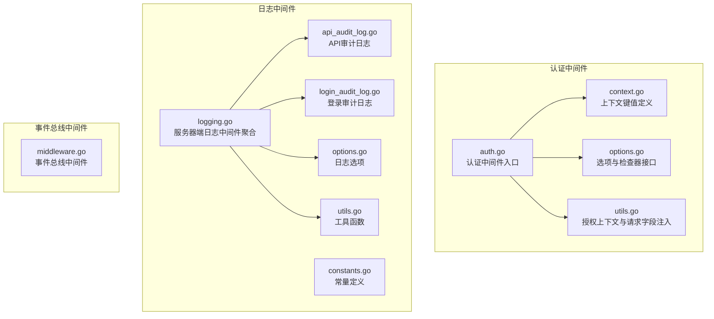
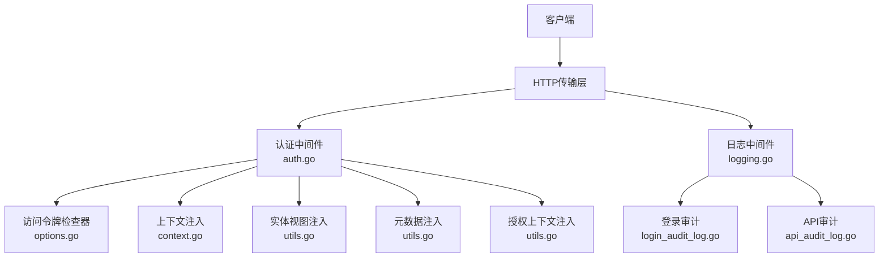
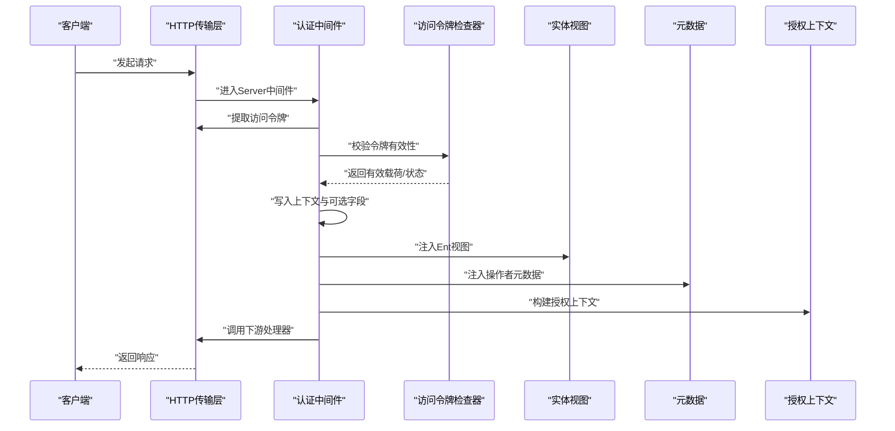
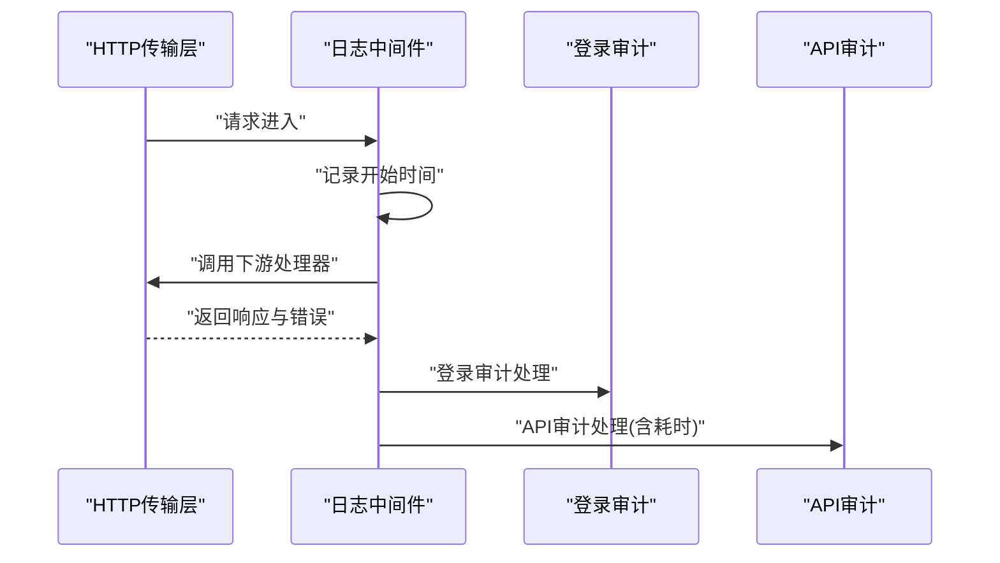
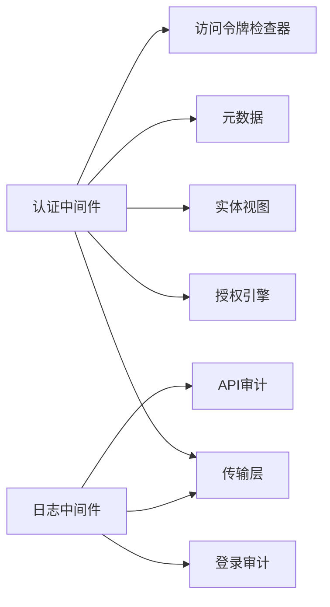

# 中间件系统

<cite>
**本文引用的文件**
- [auth.go](file://backend/pkg/middleware/auth/auth.go)
- [context.go](file://backend/pkg/middleware/auth/context.go)
- [options.go](file://backend/pkg/middleware/auth/options.go)
- [utils.go](file://backend/pkg/middleware/auth/utils.go)
- [logging.go](file://backend/pkg/middleware/logging/logging.go)
- [api_audit_log.go](file://backend/pkg/middleware/logging/api_audit_log.go)
- [login_audit_log.go](file://backend/pkg/middleware/logging/login_audit_log.go)
- [constants.go](file://backend/pkg/middleware/logging/constants.go)
- [options.go](file://backend/pkg/middleware/logging/options.go)
- [utils.go](file://backend/pkg/middleware/logging/utils.go)
- [middleware.go](file://backend/pkg/eventbus/middleware.go)
</cite>

## 目录
1. [引言](#引言)
2. [项目结构](#项目结构)
3. [核心组件](#核心组件)
4. [架构总览](#架构总览)
5. [详细组件分析](#详细组件分析)
6. [依赖分析](#依赖分析)
7. [性能考虑](#性能考虑)
8. [故障排查指南](#故障排查指南)
9. [结论](#结论)
10. [附录](#附录)

## 引言
本文件面向中间件系统的实现与使用，重点覆盖以下方面：
- 认证中间件：基于访问令牌的验证流程、角色与资源授权上下文注入、请求对象字段注入（操作员ID、租户ID）、元数据注入与可观测性追踪集成。
- 日志中间件：登录审计、API审计、请求耗时统计与统一输出。
- 其他通用中间件：事件总线中间件用于服务生命周期钩子。

通过代码级分析与可视化图示，帮助开发者理解中间件的控制流、数据流与扩展点，并提供最佳实践建议。

## 项目结构
中间件相关代码主要位于 backend/pkg/middleware 下，按功能划分为认证与日志两大模块；同时在 backend/pkg/eventbus 提供事件总线中间件以支持服务启动/停止等钩子。

图表来源
- [auth.go:1-122](file://backend/pkg/middleware/auth/auth.go#L1-L122)
- [context.go:1-26](file://backend/pkg/middleware/auth/context.go#L1-L26)
- [options.go:1-146](file://backend/pkg/middleware/auth/options.go#L1-L146)
- [utils.go:1-74](file://backend/pkg/middleware/auth/utils.go#L1-L74)
- [logging.go:1-52](file://backend/pkg/middleware/logging/logging.go#L1-L52)
- [api_audit_log.go](file://backend/pkg/middleware/logging/api_audit_log.go)
- [login_audit_log.go](file://backend/pkg/middleware/logging/login_audit_log.go)
- [constants.go](file://backend/pkg/middleware/logging/constants.go)
- [options.go](file://backend/pkg/middleware/logging/options.go)
- [utils.go](file://backend/pkg/middleware/logging/utils.go)
- [middleware.go](file://backend/pkg/eventbus/middleware.go)

章节来源
- [auth.go:1-122](file://backend/pkg/middleware/auth/auth.go#L1-L122)
- [logging.go:1-52](file://backend/pkg/middleware/logging/logging.go#L1-L52)
- [middleware.go](file://backend/pkg/eventbus/middleware.go)

## 核心组件
- 认证中间件：负责从传输层提取访问令牌、校验有效性、构建授权上下文、注入操作员/租户信息、元数据以及可选的鉴权引擎上下文。
- 日志中间件：在请求完成后统计耗时，分别调用登录审计与API审计中间件进行记录。
- 事件总线中间件：为服务生命周期提供统一的中间件钩子，便于扩展启动/停止逻辑。

章节来源
- [auth.go:24-121](file://backend/pkg/middleware/auth/auth.go#L24-L121)
- [logging.go:14-51](file://backend/pkg/middleware/logging/logging.go#L14-L51)
- [middleware.go](file://backend/pkg/eventbus/middleware.go)

## 架构总览
下图展示了认证与日志中间件在Kratos框架中的协作关系，以及与传输层、授权引擎、实体视图（Ent Viewer）和元数据的交互。

图表来源
- [auth.go:38-119](file://backend/pkg/middleware/auth/auth.go#L38-L119)
- [options.go:11-75](file://backend/pkg/middleware/auth/options.go#L11-L75)
- [context.go:15-25](file://backend/pkg/middleware/auth/context.go#L15-L25)
- [utils.go:17-45](file://backend/pkg/middleware/auth/utils.go#L17-L45)
- [logging.go:31-50](file://backend/pkg/middleware/logging/logging.go#L31-L50)
- [login_audit_log.go](file://backend/pkg/middleware/logging/login_audit_log.go)
- [api_audit_log.go](file://backend/pkg/middleware/logging/api_audit_log.go)

## 详细组件分析

### 认证中间件（JWT/授权上下文）
- 功能要点
  - 从传输上下文中提取访问令牌（支持多种载体格式），并委托AccessTokenChecker进行有效性与阻断状态检查。
  - 将用户令牌载荷写入上下文，支持后续业务逻辑读取。
  - 可选地向请求对象注入操作员ID与租户ID（通过反射设置字段）。
  - 注入Ent客户端视图（UserViewer），结合TraceID与数据范围，实现数据隔离与审计。
  - 注入OperatorMetadata到上下文，便于下游服务读取当前操作者信息。
  - 可选启用授权引擎上下文，将路径模板、HTTP方法映射为资源与动作，形成Subject（角色集合）与Resource/Action的授权声明。

- 关键流程（序列图）

图表来源
- [auth.go:38-119](file://backend/pkg/middleware/auth/auth.go#L38-L119)
- [options.go:11-75](file://backend/pkg/middleware/auth/options.go#L11-L75)
- [utils.go:17-45](file://backend/pkg/middleware/auth/utils.go#L17-L45)

- 数据结构与复杂度
  - AccessTokenChecker接口提供两阶段能力：有效性检查与阻断检查，便于与缓存/数据库解耦。
  - 请求字段注入采用反射，时间复杂度O(1)，对单个请求对象字段设置开销极低。
  - 授权上下文构建基于路径模板与HTTP方法，映射为资源与动作，复杂度O(1)。

- 错误处理
  - 缺失传输上下文、缺失Bearer令牌、检查器未配置、令牌无效、请求对象为空等均返回明确错误码，便于上层统一处理。

- 扩展点
  - 可替换AccessTokenChecker实现（如Redis黑名单、远程校验、多因子校验）。
  - 可自定义注入策略（仅注入必要字段，避免过度反射）。
  - 可接入更多授权策略（RBAC/ABAC），通过授权上下文扩展。

章节来源
- [auth.go:24-121](file://backend/pkg/middleware/auth/auth.go#L24-L121)
- [context.go:15-25](file://backend/pkg/middleware/auth/context.go#L15-L25)
- [options.go:11-146](file://backend/pkg/middleware/auth/options.go#L11-L146)
- [utils.go:17-74](file://backend/pkg/middleware/auth/utils.go#L17-L74)

### 日志中间件（登录审计与API审计）
- 功能要点
  - 在请求完成后统计耗时（毫秒），并根据传输类型（HTTP）分别触发登录审计与API审计。
  - 登录审计：识别登录/登出操作，记录登录结果与失败原因。
  - API审计：记录API调用、用户、租户、IP、耗时、状态码、错误信息等，支持异步落库与告警。

- 流程（序列图）

图表来源
- [logging.go:31-50](file://backend/pkg/middleware/logging/logging.go#L31-L50)
- [login_audit_log.go](file://backend/pkg/middleware/logging/login_audit_log.go)
- [api_audit_log.go](file://backend/pkg/middleware/logging/api_audit_log.go)

- 性能与可观测性
  - 耗时统计在中间件层完成，避免重复计算；日志写入建议异步化，降低对主链路影响。
  - 可结合OpenTelemetry TraceID，将日志与链路追踪关联，提升问题定位效率。

章节来源
- [logging.go:14-52](file://backend/pkg/middleware/logging/logging.go#L14-L52)

### 事件总线中间件
- 功能要点
  - 提供服务生命周期中间件钩子，便于在启动/停止阶段执行自定义逻辑（如初始化配置、清理资源）。
  - 与Kratos中间件机制集成，支持顺序编排与错误传播。

章节来源
- [middleware.go](file://backend/pkg/eventbus/middleware.go)

## 依赖分析
- 认证中间件依赖
  - 传输层：从上下文提取传输信息，解析HTTP路径模板与方法。
  - 授权引擎：将资源与动作映射为授权上下文。
  - 实体视图：注入用户视角（含租户、组织单元、数据范围、TraceID）。
  - 元数据：注入操作者元数据，便于下游读取。
  - 访问令牌检查器：可插拔的令牌有效性与阻断检查。

- 日志中间件依赖
  - HTTP传输层：用于获取路径模板、方法、请求头等信息。
  - 登录/API审计模块：分别处理登录与API调用审计。
  - ECDSA密钥对：用于审计签名（若未显式提供则自动生成）。

图表来源
- [auth.go:38-119](file://backend/pkg/middleware/auth/auth.go#L38-L119)
- [logging.go:31-50](file://backend/pkg/middleware/logging/logging.go#L31-L50)

章节来源
- [auth.go:38-119](file://backend/pkg/middleware/auth/auth.go#L38-L119)
- [logging.go:31-50](file://backend/pkg/middleware/logging/logging.go#L31-L50)

## 性能考虑
- 中间件顺序
  - 认证中间件应尽早执行，以便在后续中间件中直接读取用户上下文与元数据。
  - 日志中间件置于链路末端，确保能捕获完整错误与耗时。
- 反射注入
  - 仅在必要时注入字段，避免对所有请求对象进行反射扫描。
- 异步日志
  - 审计日志建议异步写入，减少对请求延迟的影响。
- 授权上下文
  - 资源与动作映射应尽量简单，避免复杂规则导致的匹配开销。
- 令牌校验
  - 使用缓存（如Redis）加速令牌有效性与阻断检查，降低数据库压力。

## 故障排查指南
- 常见错误与定位
  - 缺失传输上下文：检查上游是否正确传递Kratos传输上下文。
  - 缺失Bearer令牌：确认客户端是否携带Authorization头。
  - 访问令牌检查器未配置：确保通过选项注入有效的AccessTokenChecker。
  - 令牌无效或过期：检查令牌签发方与有效期，必要时开启刷新令牌检查。
  - 请求对象为空：确认请求消息结构包含目标字段名（如OperatorId、tenantId）。
- 日志审计
  - 登录/API审计未记录：检查HTTP传输类型与操作标识是否正确。
  - 耗时不准确：确认统计起始时间与结束时间点一致，避免并发场景下的竞态。

章节来源
- [auth.go:42-61](file://backend/pkg/middleware/auth/auth.go#L42-L61)
- [utils.go:47-73](file://backend/pkg/middleware/auth/utils.go#L47-L73)
- [logging.go:32-48](file://backend/pkg/middleware/logging/logging.go#L32-L48)

## 结论
该中间件系统以Kratos中间件为核心，围绕“认证—授权—审计”形成闭环：
- 认证中间件提供灵活的令牌校验与上下文注入能力；
- 日志中间件覆盖登录与API审计，支持耗时统计与异步落库；
- 事件总线中间件为服务生命周期提供扩展点。

通过合理的中间件顺序与可插拔组件设计，系统具备良好的可维护性与扩展性。

## 附录
- 最佳实践
  - 中间件顺序：认证 → 鉴权（可选）→ 业务处理 → 日志。
  - 可扩展性：将令牌校验、审计存储抽象为接口，便于替换实现。
  - 性能：异步日志、缓存令牌校验、最小化反射注入。
  - 安全：严格校验令牌来源与签名，审计日志脱敏敏感字段。
- 配置建议
  - 认证中间件：启用必要的注入项（操作员ID、租户ID、元数据），按需启用授权上下文。
  - 日志中间件：配置审计存储（数据库/消息队列），设置合理的采样率与保留周期。