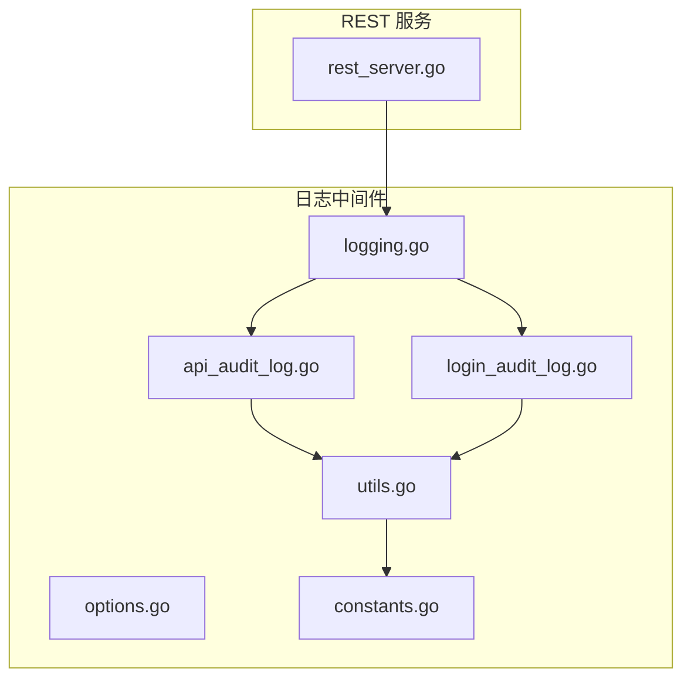
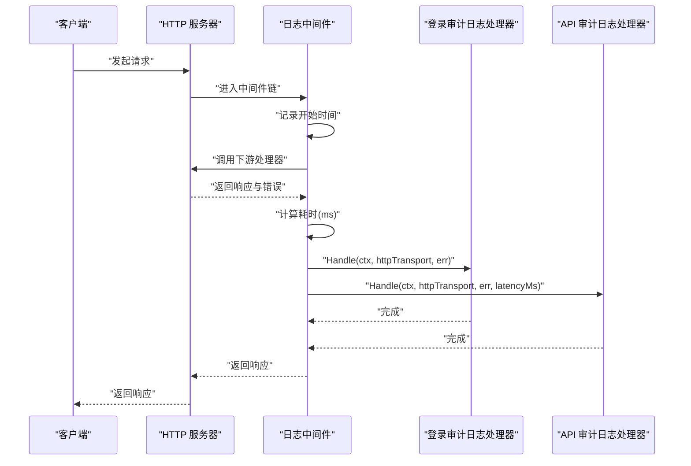
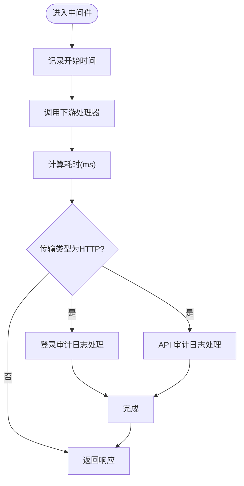
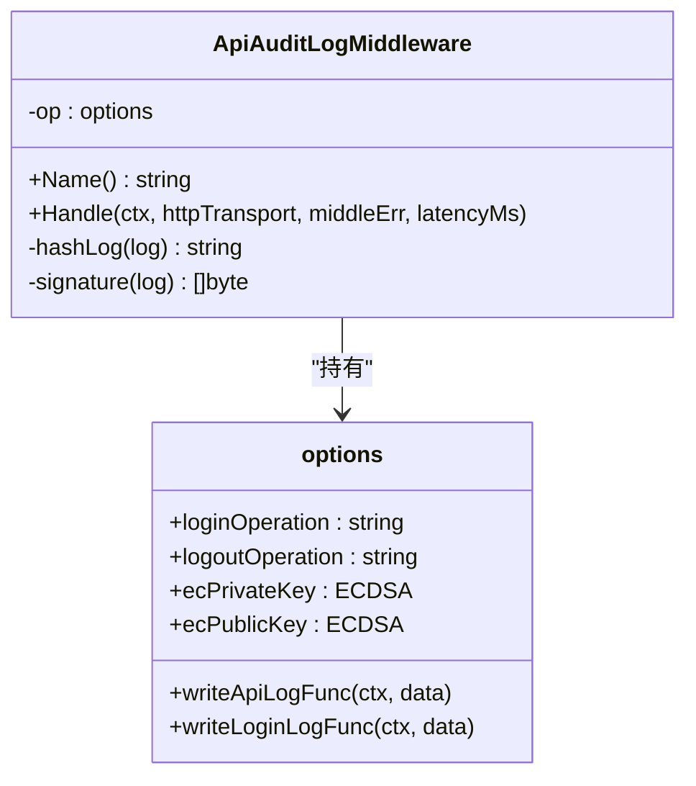
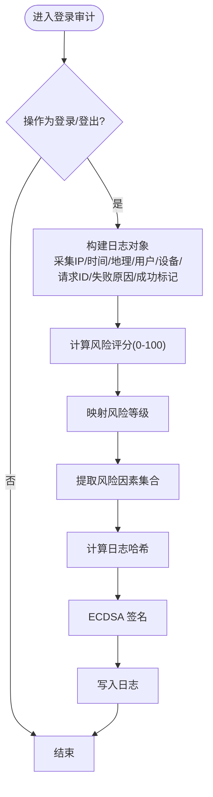
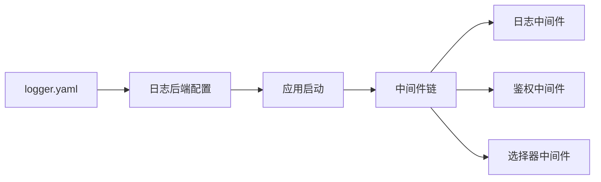
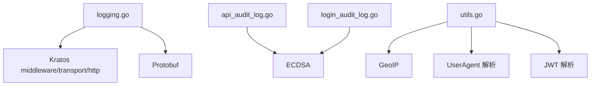

# 日志中间件

<cite>
**本文引用的文件**
- [logging.go](file://backend/pkg/middleware/logging/logging.go)
- [options.go](file://backend/pkg/middleware/logging/options.go)
- [api_audit_log.go](file://backend/pkg/middleware/logging/api_audit_log.go)
- [login_audit_log.go](file://backend/pkg/middleware/logging/login_audit_log.go)
- [utils.go](file://backend/pkg/middleware/logging/utils.go)
- [constants.go](file://backend/pkg/middleware/logging/constants.go)
- [rest_server.go](file://backend/app/admin/service/internal/server/rest_server.go)
- [logger.yaml](file://backend/app/admin/service/configs/logger.yaml)
</cite>

## 目录
1. [简介](#简介)
2. [项目结构](#项目结构)
3. [核心组件](#核心组件)
4. [架构总览](#架构总览)
5. [详细组件分析](#详细组件分析)
6. [依赖分析](#依赖分析)
7. [性能考量](#性能考量)
8. [故障排查指南](#故障排查指南)
9. [结论](#结论)
10. [附录](#附录)

## 简介
本文件面向“日志中间件”的实现与使用，围绕以下目标展开：
- 请求日志记录：请求参数、响应结果、耗时统计
- 性能监控：API 调用统计、错误率监控、响应时间分析
- 审计追踪：操作日志记录、用户行为追踪、安全事件监控
- 配置选项：日志级别、敏感信息过滤、日志格式定制
- 示例与优化建议：日志记录示例、性能优化策略

该中间件基于 Kratos 中间件框架实现，支持 HTTP 服务器侧的统一日志采集与签名校验，同时提供登录与 API 两类审计日志能力。

## 项目结构
日志中间件位于 backend/pkg/middleware/logging 下，核心文件如下：
- logging.go：中间件入口，负责拦截请求、统计耗时、调度两类审计日志
- options.go：配置项与注入接口，支持写入函数、操作名、密钥对等
- api_audit_log.go：API 审计日志实现，采集请求上下文、地理与设备信息、计算哈希与签名
- login_audit_log.go：登录审计日志实现，计算风险评分与风险等级、风险因素集合
- utils.go：通用工具函数，如 IP 解析、UA 解析、设备与地理信息填充、签名编码等
- constants.go：HTTP 头部键常量定义

REST 服务侧通过中间件组合启用日志中间件，并注入写入函数以持久化审计日志。

**图表来源**
- [logging.go:1-52](file://backend/pkg/middleware/logging/logging.go#L1-L52)
- [options.go:1-61](file://backend/pkg/middleware/logging/options.go#L1-L61)
- [api_audit_log.go:1-162](file://backend/pkg/middleware/logging/api_audit_log.go#L1-L162)
- [login_audit_log.go:1-364](file://backend/pkg/middleware/logging/login_audit_log.go#L1-L364)
- [utils.go:1-471](file://backend/pkg/middleware/logging/utils.go#L1-L471)
- [constants.go:1-15](file://backend/pkg/middleware/logging/constants.go#L1-L15)
- [rest_server.go:32-77](file://backend/app/admin/service/internal/server/rest_server.go#L32-L77)

**章节来源**
- [logging.go:1-52](file://backend/pkg/middleware/logging/logging.go#L1-L52)
- [rest_server.go:32-77](file://backend/app/admin/service/internal/server/rest_server.go#L32-L77)

## 核心组件
- 中间件入口 Server：创建并返回 Kratos 中间件，统计请求耗时，调用登录与 API 审计日志处理器
- API 审计日志处理器：采集请求元数据、用户令牌信息、地理与设备信息、错误状态、耗时、计算哈希与签名
- 登录审计日志处理器：识别登录/登出操作，计算风险评分与等级、风险因素集合，计算哈希与签名
- 通用工具：IP 解析、UA 解析、设备与地理信息填充、签名编码、风险评分与因素计算
- 配置选项：写入函数注入、操作名配置、ECDSA 密钥对注入、默认密钥对生成

**章节来源**
- [logging.go:14-51](file://backend/pkg/middleware/logging/logging.go#L14-L51)
- [api_audit_log.go:23-88](file://backend/pkg/middleware/logging/api_audit_log.go#L23-L88)
- [login_audit_log.go:25-114](file://backend/pkg/middleware/logging/login_audit_log.go#L25-L114)
- [utils.go:38-351](file://backend/pkg/middleware/logging/utils.go#L38-L351)
- [options.go:13-60](file://backend/pkg/middleware/logging/options.go#L13-L60)

## 架构总览
下图展示一次 HTTP 请求在中间件中的处理流程，包括耗时统计、登录与 API 审计日志的触发条件与数据采集路径。

**图表来源**
- [logging.go:31-50](file://backend/pkg/middleware/logging/logging.go#L31-L50)
- [login_audit_log.go:39-114](file://backend/pkg/middleware/logging/login_audit_log.go#L39-L114)
- [api_audit_log.go:37-88](file://backend/pkg/middleware/logging/api_audit_log.go#L37-L88)

## 详细组件分析

### 中间件入口与控制流
- 中间件在每次请求进入时记录开始时间，调用下游处理器后计算耗时（毫秒）
- 仅当传输类型为 HTTP 时，分别调用登录与 API 审计日志处理器
- 登录审计日志跳过非登录/登出操作，API 审计日志跳过登录操作

**图表来源**
- [logging.go:31-50](file://backend/pkg/middleware/logging/logging.go#L31-L50)

**章节来源**
- [logging.go:14-51](file://backend/pkg/middleware/logging/logging.go#L14-L51)

### API 审计日志处理器
- 数据采集：HTTP 方法、操作名、路径模板、Referer、客户端 IP、请求 ID、请求 URI、请求体
- 用户与租户：从 JWT 提取用户信息（用户ID、租户ID、用户名）
- 地理与设备：IP 查询地理信息、UA 解析设备类型、浏览器与操作系统、平台、客户端ID
- 错误与成功：根据错误转换状态码、原因与成功标记
- 安全与完整性：计算 Protobuf 确定性序列化后的 SHA256 哈希，使用 ECDSA 对关键字段签名
- 写入：通过注入的写入函数持久化

**图表来源**
- [api_audit_log.go:23-88](file://backend/pkg/middleware/logging/api_audit_log.go#L23-L88)
- [options.go:13-22](file://backend/pkg/middleware/logging/options.go#L13-L22)

**章节来源**
- [api_audit_log.go:37-88](file://backend/pkg/middleware/logging/api_audit_log.go#L37-L88)
- [utils.go:38-101](file://backend/pkg/middleware/logging/utils.go#L38-L101)
- [utils.go:310-351](file://backend/pkg/middleware/logging/utils.go#L310-L351)
- [utils.go:58-60](file://backend/pkg/middleware/logging/utils.go#L58-L60)

### 登录审计日志处理器
- 触发条件：仅处理登录与登出操作
- 数据采集：IP、时间、地理信息、用户名（请求体或令牌）、用户ID/租户ID/用户名（令牌）、设备信息、请求ID、失败原因、成功/失败标记
- 风险评估：基于失败状态、未知用户、匿名登录、未知设备、MFA 状态、IP 类型、失败原因关键词、会话/请求ID、风险评分映射
- 安全与完整性：计算哈希与签名，签名内容包含租户ID、用户ID、用户名、创建时间、日志哈希

**图表来源**
- [login_audit_log.go:39-114](file://backend/pkg/middleware/logging/login_audit_log.go#L39-L114)
- [login_audit_log.go:192-251](file://backend/pkg/middleware/logging/login_audit_log.go#L192-L251)
- [login_audit_log.go:273-363](file://backend/pkg/middleware/logging/login_audit_log.go#L273-L363)

**章节来源**
- [login_audit_log.go:39-114](file://backend/pkg/middleware/logging/login_audit_log.go#L39-L114)
- [login_audit_log.go:192-251](file://backend/pkg/middleware/logging/login_audit_log.go#L192-L251)
- [login_audit_log.go:273-363](file://backend/pkg/middleware/logging/login_audit_log.go#L273-L363)

### 通用工具与常量
- 请求头键常量：User-Agent、Referer、Authorization、X-Request-ID、X-Correlation-ID、X-Forwarded-For、X-Real-IP、X-Client-IP
- IP 解析：优先 X-Forwarded-For 第一个有效IP，其次 X-Real-IP，最后 RemoteAddr
- 请求ID：优先 X-Request-ID，其次 X-Correlation-ID，再次 x-fc-request-id，最后生成 GUID
- 客户端ID：优先 X-Client-IP，其次从令牌提取
- 状态码：从错误转换为状态码、原因与成功标记
- UA 解析：设备类型、浏览器与系统、平台检测
- 地理位置：基于 IP 查询国家/省/市/ISP
- ECDSA：密钥对生成、DER 编码签名
- 风险评分与因素：失败登录、未知用户/匿名、未知设备、MFA 状态、IP 类型、失败原因关键词、会话/请求ID、风险等级映射

**章节来源**
- [constants.go:3-14](file://backend/pkg/middleware/logging/constants.go#L3-L14)
- [utils.go:62-152](file://backend/pkg/middleware/logging/utils.go#L62-L152)
- [utils.go:174-186](file://backend/pkg/middleware/logging/utils.go#L174-L186)
- [utils.go:217-256](file://backend/pkg/middleware/logging/utils.go#L217-L256)
- [utils.go:310-351](file://backend/pkg/middleware/logging/utils.go#L310-L351)
- [utils.go:353-368](file://backend/pkg/middleware/logging/utils.go#L353-L368)
- [utils.go:273-308](file://backend/pkg/middleware/logging/utils.go#L273-L308)
- [utils.go:394-470](file://backend/pkg/middleware/logging/utils.go#L394-L470)

### 配置与集成
- 中间件注入：在 REST 服务中通过 NewRestMiddleware 组合中间件链，注入 API 与登录审计日志写入函数
- 写入策略：注释提示可采用同步写入（低负载）或异步写入（高负载，投递至队列）
- 白名单：对鉴权相关操作加入白名单，避免重复审计
- 日志配置：logger.yaml 支持多种日志后端（std/file/fluent/zap/logrus/aliyun/tencent），可独立配置级别与格式

**图表来源**
- [logger.yaml:1-32](file://backend/app/admin/service/configs/logger.yaml#L1-L32)
- [rest_server.go:32-77](file://backend/app/admin/service/internal/server/rest_server.go#L32-L77)

**章节来源**
- [rest_server.go:32-77](file://backend/app/admin/service/internal/server/rest_server.go#L32-L77)
- [logger.yaml:1-32](file://backend/app/admin/service/configs/logger.yaml#L1-L32)

## 依赖分析
- Kratos 中间件与 HTTP 传输：中间件依赖 Kratos 的 middleware 与 transport/http
- Protobuf 与确定性序列化：用于日志对象的哈希计算
- ECDSA 与 DER 编码：用于数字签名
- GeoIP 与 UA 解析：用于地理与设备信息填充
- JWT 解析：从 Authorization 头提取用户令牌载荷

**图表来源**
- [logging.go:3-12](file://backend/pkg/middleware/logging/logging.go#L3-L12)
- [api_audit_log.go:3-21](file://backend/pkg/middleware/logging/api_audit_log.go#L3-L21)
- [login_audit_log.go:3-23](file://backend/pkg/middleware/logging/login_audit_log.go#L3-L23)
- [utils.go:3-34](file://backend/pkg/middleware/logging/utils.go#L3-L34)

**章节来源**
- [logging.go:3-12](file://backend/pkg/middleware/logging/logging.go#L3-L12)
- [api_audit_log.go:3-21](file://backend/pkg/middleware/logging/api_audit_log.go#L3-L21)
- [login_audit_log.go:3-23](file://backend/pkg/middleware/logging/login_audit_log.go#L3-L23)
- [utils.go:3-34](file://backend/pkg/middleware/logging/utils.go#L3-L34)

## 性能考量
- 耗时统计：中间件在每次请求完成后计算耗时（毫秒），可用于响应时间分析与性能监控
- 异步写入：写入函数注释建议在高负载场景采用异步写入（如投递到队列），以降低对主请求路径的影响
- 资源消耗：地理查询、UA 解析、ECDSA 签名均有一定开销，建议结合业务负载选择合适的采样策略
- 日志级别：通过 logger.yaml 调整日志级别与输出格式，平衡可观测性与性能

**章节来源**
- [logging.go:37-38](file://backend/pkg/middleware/logging/logging.go#L37-L38)
- [rest_server.go:43-52](file://backend/app/admin/service/internal/server/rest_server.go#L43-L52)
- [logger.yaml:1-32](file://backend/app/admin/service/configs/logger.yaml#L1-L32)

## 故障排查指南
- 无法解析客户端 IP：检查代理配置，确保 X-Forwarded-For/X-Real-IP 设置正确
- 无法提取用户信息：确认 Authorization 头格式为 Bearer Token，且令牌有效
- 地理位置为空：检查 GeoIP 数据库可用性与 IP 合法性
- 签名失败：确认 ECDSA 密钥对已正确注入或生成
- 风险评分异常：检查失败原因关键词匹配与设备/IP 判定逻辑

**章节来源**
- [utils.go:62-101](file://backend/pkg/middleware/logging/utils.go#L62-L101)
- [utils.go:38-60](file://backend/pkg/middleware/logging/utils.go#L38-L60)
- [utils.go:116-118](file://backend/pkg/middleware/logging/utils.go#L116-L118)
- [utils.go:273-280](file://backend/pkg/middleware/logging/utils.go#L273-L280)
- [login_audit_log.go:139-190](file://backend/pkg/middleware/logging/login_audit_log.go#L139-L190)

## 结论
该日志中间件提供了完整的请求日志与审计能力，涵盖请求参数、响应结果、耗时统计、地理与设备信息、风险评估与数字签名。通过可插拔的写入函数与配置选项，可在不同负载与合规要求下灵活部署。建议在高并发场景采用异步写入，并结合日志级别与采样策略优化性能。

## 附录
- 配置项一览
  - 日志后端类型：std、file、fluent、zap、logrus、aliyun、tencent
  - zap 配置：level、filename、max_size、max_age、max_backups
  - logrus 配置：level、formatter、timestamp_format、disable_colors、disable_timestamp
  - 云厂商配置：endpoint、project、topic_id、access_key、access_secret

**章节来源**
- [logger.yaml:1-32](file://backend/app/admin/service/configs/logger.yaml#L1-L32)