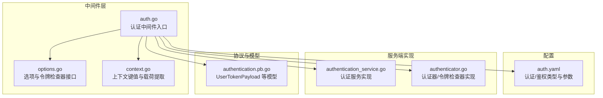
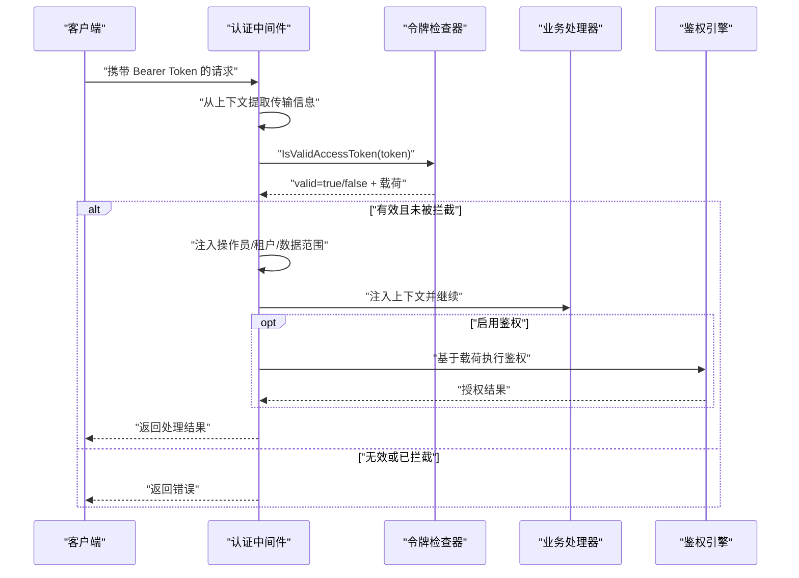
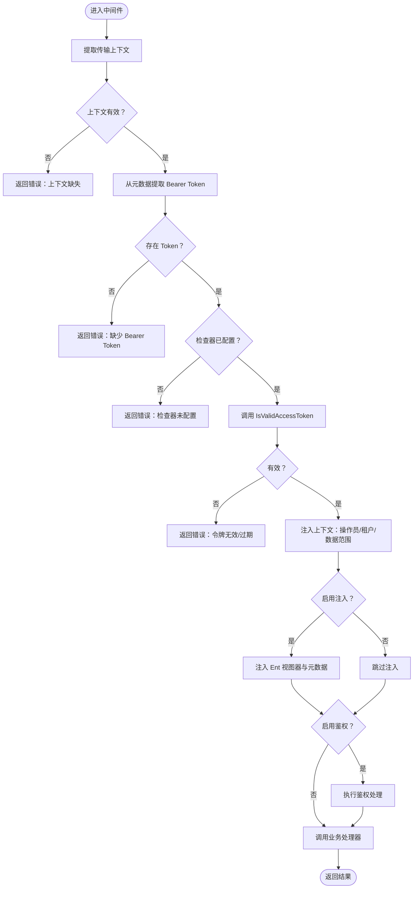
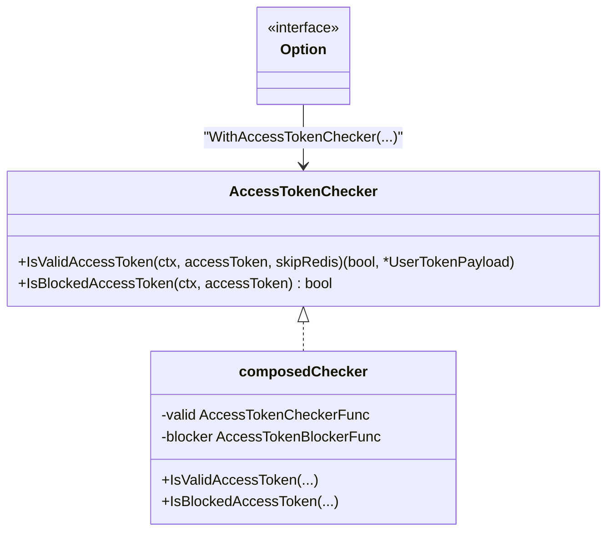
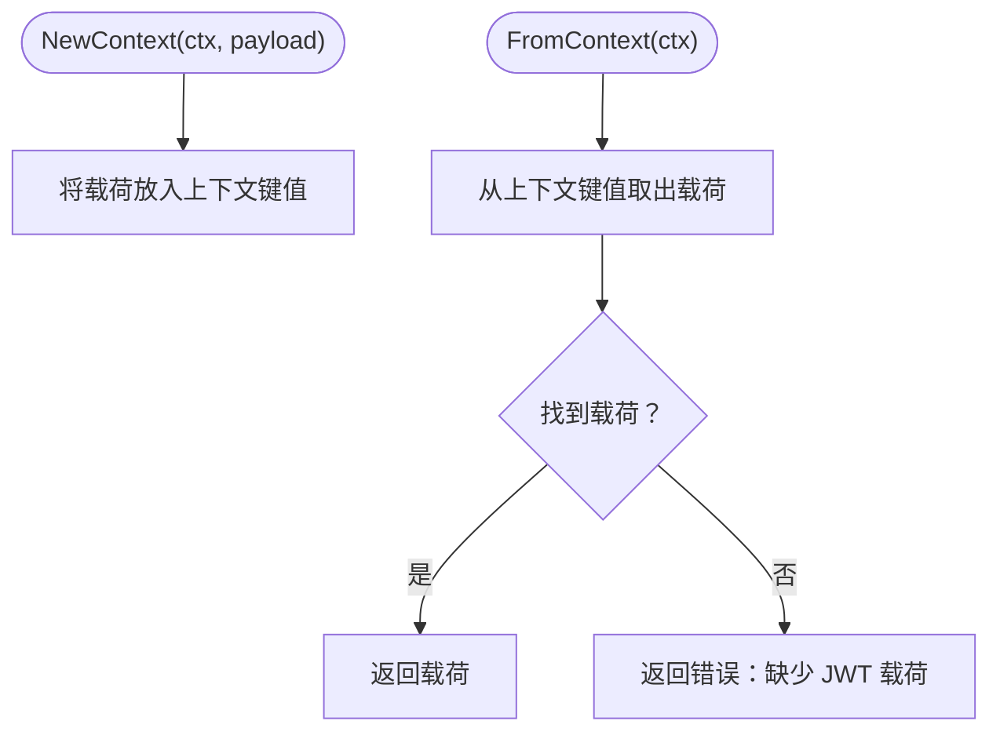
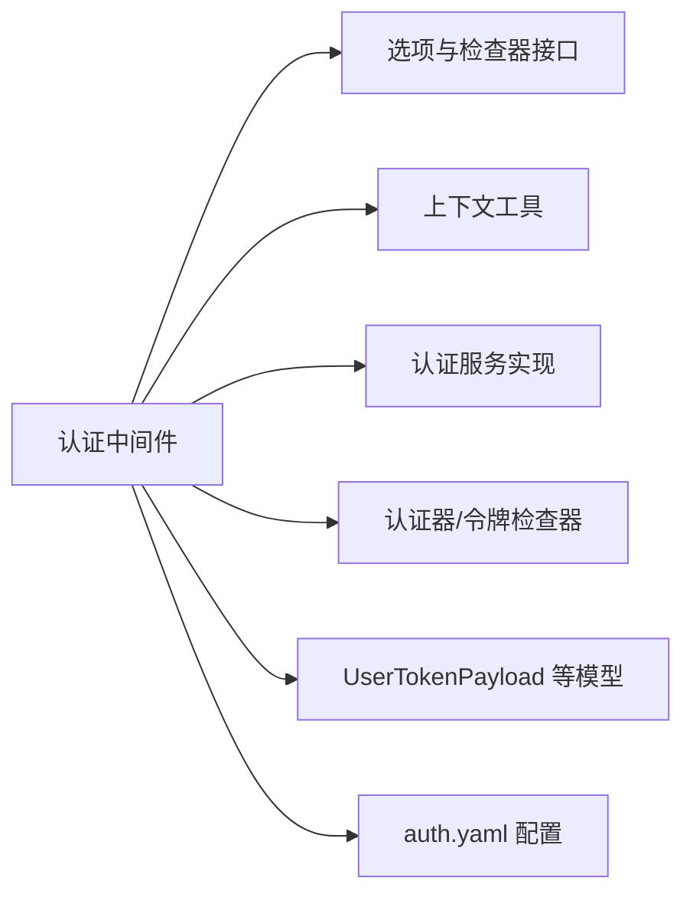

# 认证中间件

<cite>
**本文引用的文件**
- [backend/pkg/middleware/auth/auth.go](file://backend/pkg/middleware/auth/auth.go)
- [backend/pkg/middleware/auth/options.go](file://backend/pkg/middleware/auth/options.go)
- [backend/pkg/middleware/auth/context.go](file://backend/pkg/middleware/auth/context.go)
- [backend/app/admin/service/configs/auth.yaml](file://backend/app/admin/service/configs/auth.yaml)
- [backend/app/admin/service/internal/data/authenticator.go](file://backend/app/admin/service/internal/data/authenticator.go)
- [backend/app/admin/service/internal/service/authentication_service.go](file://backend/app/admin/service/internal/service/authentication_service.go)
- [backend/api/gen/go/authentication/service/v1/authentication.pb.go](file://backend/api/gen/go/authentication/service/v1/authentication.pb.go)
</cite>

## 目录
1. [简介](#简介)
2. [项目结构](#项目结构)
3. [核心组件](#核心组件)
4. [架构总览](#架构总览)
5. [详细组件分析](#详细组件分析)
6. [依赖分析](#依赖分析)
7. [性能考虑](#性能考虑)
8. [故障排查指南](#故障排查指南)
9. [结论](#结论)
10. [附录](#附录)

## 简介
本文件系统性阐述认证中间件的实现与使用，重点覆盖以下方面：
- JWT Token 验证机制：Token 提取、签名与算法校验、过期时间检查、载荷注入与上下文传递。
- OAuth2/OIDC 集成：授权码流程、访问令牌获取、用户信息获取与中间件集成方式。
- 会话管理：基于 JWT 的无状态会话模型、令牌黑名单与拦截、审计与追踪。
- 中间件配置：白名单策略、认证策略选择、可插拔的令牌检查器、鉴权开关与上下文注入。

## 项目结构
认证中间件位于后端包路径中，配合服务端配置与数据层实现共同完成认证链路。

图示来源
- [backend/pkg/middleware/auth/auth.go:1-122](file://backend/pkg/middleware/auth/auth.go#L1-L122)
- [backend/pkg/middleware/auth/options.go:1-146](file://backend/pkg/middleware/auth/options.go#L1-L146)
- [backend/pkg/middleware/auth/context.go:1-26](file://backend/pkg/middleware/auth/context.go#L1-L26)
- [backend/app/admin/service/configs/auth.yaml:1-37](file://backend/app/admin/service/configs/auth.yaml#L1-L37)
- [backend/app/admin/service/internal/service/authentication_service.go](file://backend/app/admin/service/internal/service/authentication_service.go)
- [backend/app/admin/service/internal/data/authenticator.go](file://backend/app/admin/service/internal/data/authenticator.go)
- [backend/api/gen/go/authentication/service/v1/authentication.pb.go](file://backend/api/gen/go/authentication/service/v1/authentication.pb.go)

章节来源
- [backend/pkg/middleware/auth/auth.go:1-122](file://backend/pkg/middleware/auth/auth.go#L1-L122)
- [backend/pkg/middleware/auth/options.go:1-146](file://backend/pkg/middleware/auth/options.go#L1-L146)
- [backend/pkg/middleware/auth/context.go:1-26](file://backend/pkg/middleware/auth/context.go#L1-L26)
- [backend/app/admin/service/configs/auth.yaml:1-37](file://backend/app/admin/service/configs/auth.yaml#L1-L37)

## 核心组件
- 认证中间件：从请求上下文中提取 Bearer Token，调用令牌检查器进行有效性与过期检查，并将用户载荷注入到上下文与 Ent 视图器、元数据中。
- 令牌检查器接口：抽象出 IsValidAccessToken 与 IsBlockedAccessToken，支持函数式组合与自定义实现。
- 上下文工具：提供令牌载荷在上下文中的存取能力，便于后续处理链读取。
- 配置：通过 YAML 配置认证类型（JWT/ OIDC/ 预共享密钥）与鉴权类型（CASBin/ OPA/ Zanzibar/ noop），为中间件提供策略依据。

章节来源
- [backend/pkg/middleware/auth/auth.go:24-121](file://backend/pkg/middleware/auth/auth.go#L24-L121)
- [backend/pkg/middleware/auth/options.go:11-75](file://backend/pkg/middleware/auth/options.go#L11-L75)
- [backend/pkg/middleware/auth/context.go:15-25](file://backend/pkg/middleware/auth/context.go#L15-L25)
- [backend/app/admin/service/configs/auth.yaml:1-37](file://backend/app/admin/service/configs/auth.yaml#L1-L37)

## 架构总览
认证中间件在服务端拦截请求，完成令牌解析与校验后，将用户身份与权限上下文注入到后续处理链，同时可选地接入鉴权引擎与 Ent 视图器。

图示来源
- [backend/pkg/middleware/auth/auth.go:38-118](file://backend/pkg/middleware/auth/auth.go#L38-L118)
- [backend/pkg/middleware/auth/options.go:11-18](file://backend/pkg/middleware/auth/options.go#L11-L18)

## 详细组件分析

### 组件一：认证中间件（auth.go）
职责与流程
- 从服务端传输上下文提取请求元信息。
- 从元数据中提取 Bearer Token。
- 调用令牌检查器进行有效性与过期检查。
- 将用户载荷注入上下文，按需注入操作员 ID、租户 ID、数据范围、Ent 视图器与元数据。
- 可选启用鉴权处理，基于动作与资源进行授权判断。
- 返回业务处理器结果或错误。

关键点
- 令牌来源：通过传输上下文与元数据提取 Bearer Token。
- 错误处理：缺失上下文、缺少 Bearer、检查器未配置、令牌无效或过期、注入失败等均有明确错误返回。
- 可扩展性：通过选项控制是否注入、是否启用鉴权、是否注入 Ent 视图器与元数据。

图示来源
- [backend/pkg/middleware/auth/auth.go:38-118](file://backend/pkg/middleware/auth/auth.go#L38-L118)

章节来源
- [backend/pkg/middleware/auth/auth.go:24-121](file://backend/pkg/middleware/auth/auth.go#L24-L121)

### 组件二：令牌检查器接口与选项（options.go）
职责与设计
- 抽象 AccessTokenChecker 接口，统一 IsValidAccessToken 与 IsBlockedAccessToken 的行为。
- 支持函数式组合，将独立的有效性与拦截函数组合为单一检查器。
- 通过 Option 模式提供丰富的配置项，如启用刷新令牌过期检查、启用作用域检查、注入操作员/租户/Ent/元数据、启用鉴权等。

图示来源
- [backend/pkg/middleware/auth/options.go:11-75](file://backend/pkg/middleware/auth/options.go#L11-L75)

章节来源
- [backend/pkg/middleware/auth/options.go:11-146](file://backend/pkg/middleware/auth/options.go#L11-L146)

### 组件三：上下文工具（context.go）
职责与用法
- 定义上下文键值，用于存放 JWT 载荷。
- 提供 NewContext 与 FromContext 方法，便于在中间件与后续处理链之间传递用户身份信息。

图示来源
- [backend/pkg/middleware/auth/context.go:15-25](file://backend/pkg/middleware/auth/context.go#L15-L25)

章节来源
- [backend/pkg/middleware/auth/context.go:1-26](file://backend/pkg/middleware/auth/context.go#L1-L26)

### 组件四：配置（auth.yaml）
配置要点
- 认证类型：支持 jwt、oidc、preshared_key。
- JWT 参数：算法（HS256/ HS384/ HS512/ RS256/ RS384/ RS512/ ES256/ ES384/ ES512/ Ed25519）、密钥。
- OIDC 参数：issuer_url、audience、method。
- 鉴权类型：支持 casbin、opa、zanzibar（keto 或 open_fga）、noop。
- Zanzibar 参数：keto 的写/读地址与 gRPC 使用；open_fga 的 API 地址、store_id、token。

章节来源
- [backend/app/admin/service/configs/auth.yaml:1-37](file://backend/app/admin/service/configs/auth.yaml#L1-L37)

### 组件五：服务端实现与数据层
- 认证服务实现：负责登录、登出、刷新令牌等业务逻辑，生成或验证 JWT 并返回 UserTokenPayload。
- 认证器/令牌检查器：具体实现 IsValidAccessToken 与 IsBlockedAccessToken，结合配置与存储（如 Redis）完成令牌有效性与拦截判断。
- 协议模型：UserTokenPayload 等由 protobuf 生成，承载用户 ID、租户 ID、组织单位 ID、数据范围等信息。

章节来源
- [backend/app/admin/service/internal/service/authentication_service.go](file://backend/app/admin/service/internal/service/authentication_service.go)
- [backend/app/admin/service/internal/data/authenticator.go](file://backend/app/admin/service/internal/data/authenticator.go)
- [backend/api/gen/go/authentication/service/v1/authentication.pb.go](file://backend/api/gen/go/authentication/service/v1/authentication.pb.go)

## 依赖分析
- 中间件依赖 Kratos 中间件框架、传输上下文、OpenTelemetry 追踪、元数据注入、Ent 视图器。
- 令牌检查器通过接口解耦，可替换为不同实现（本地校验、Redis 黑名单、远程 OIDC 发行者）。
- 鉴权引擎可按配置切换，支持多种策略与后端。

图示来源
- [backend/pkg/middleware/auth/auth.go:1-122](file://backend/pkg/middleware/auth/auth.go#L1-L122)
- [backend/pkg/middleware/auth/options.go:1-146](file://backend/pkg/middleware/auth/options.go#L1-L146)
- [backend/pkg/middleware/auth/context.go:1-26](file://backend/pkg/middleware/auth/context.go#L1-L26)
- [backend/app/admin/service/configs/auth.yaml:1-37](file://backend/app/admin/service/configs/auth.yaml#L1-L37)
- [backend/app/admin/service/internal/service/authentication_service.go](file://backend/app/admin/service/internal/service/authentication_service.go)
- [backend/app/admin/service/internal/data/authenticator.go](file://backend/app/admin/service/internal/data/authenticator.go)
- [backend/api/gen/go/authentication/service/v1/authentication.pb.go](file://backend/api/gen/go/authentication/service/v1/authentication.pb.go)

## 性能考虑
- 令牌检查应尽量本地化，避免频繁远程调用；必要时引入缓存与批量校验。
- 鉴权处理可能成为热点路径，建议对常用策略进行预热与缓存。
- 注入 Ent 视图器与元数据会增加上下文构建成本，按需开启以平衡功能与性能。
- 对于 OIDC，建议复用连接池与缓存 JWK，减少网络开销。

## 故障排查指南
常见问题与定位
- 缺少传输上下文：中间件无法从上下文提取请求元信息，返回“上下文缺失”错误。
- 缺少 Bearer Token：从元数据中未发现 Token，返回“缺少 Bearer Token”。
- 检查器未配置：未设置 AccessTokenChecker，返回“检查器未配置”。
- 令牌无效或过期：IsValidAccessToken 返回 false，返回“令牌无效/过期”。
- 注入失败：操作员/租户/数据范围注入过程中出现异常，返回相应错误。
- 鉴权失败：启用鉴权时，鉴权引擎判定拒绝，返回授权错误。

排查步骤
- 检查 auth.yaml 中认证类型与参数是否正确。
- 确认 AccessTokenChecker 已通过 Option 注入中间件。
- 核对 Token 的签发方、算法与密钥是否与配置一致。
- 查看中间件日志输出，定位具体错误分支。
- 对于 OIDC，确认发行者端点可达、JWK 可获取、audience 匹配。

章节来源
- [backend/pkg/middleware/auth/auth.go:42-61](file://backend/pkg/middleware/auth/auth.go#L42-L61)
- [backend/pkg/middleware/auth/options.go:79-90](file://backend/pkg/middleware/auth/options.go#L79-L90)

## 结论
该认证中间件采用可插拔设计，围绕 JWT 令牌的提取、校验与上下文注入构建，同时提供灵活的鉴权开关与注入策略。通过配置文件可快速切换认证与鉴权方案，满足多租户、多组织单元与细粒度数据范围的场景需求。建议在生产环境结合缓存、限流与可观测性完善整体安全与性能表现。

## 附录

### 配置与使用清单
- 认证类型与参数
  - 类型：jwt / oidc / preshared_key
  - JWT：method、key
  - OIDC：issuer_url、audience、method
  - 预共享密钥：valid_keys 列表
- 鉴权类型与参数
  - 类型：casbin / opa / zanzibar(noop)
  - Zanzibar：keto（write_url/read_url/use_grpc）或 open_fga（api_url/store_id/token）

章节来源
- [backend/app/admin/service/configs/auth.yaml:1-37](file://backend/app/admin/service/configs/auth.yaml#L1-L37)

### 最佳实践
- 明确白名单：对公开接口与健康检查放行，其余接口强制认证。
- 严格令牌策略：使用强密钥与合适算法；定期轮换；启用黑名单拦截。
- 分层鉴权：先认证再鉴权，优先使用本地快速策略，必要时回退到远程引擎。
- 上下文最小化：仅注入必要的用户标识与数据范围，降低传播成本。
- 可观测性：记录认证与鉴权事件，便于审计与排障。