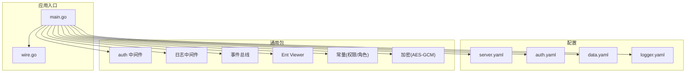
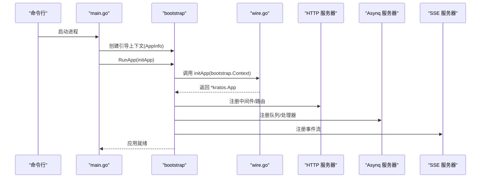
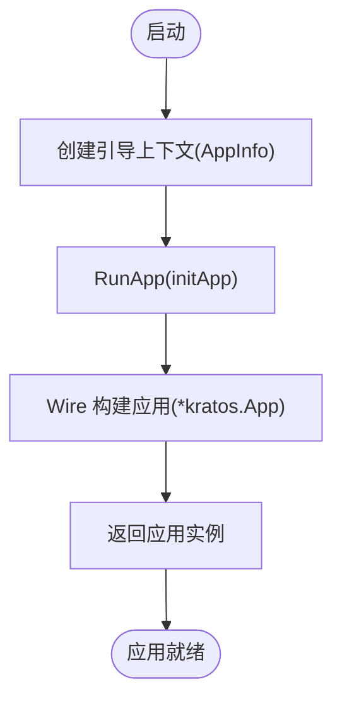
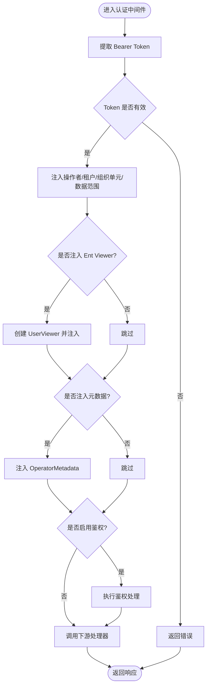
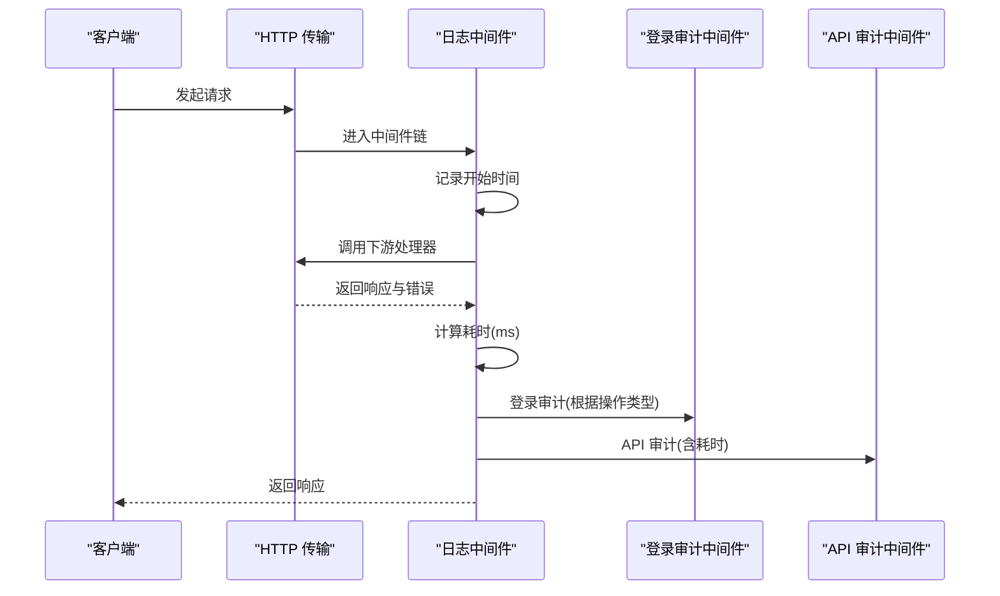
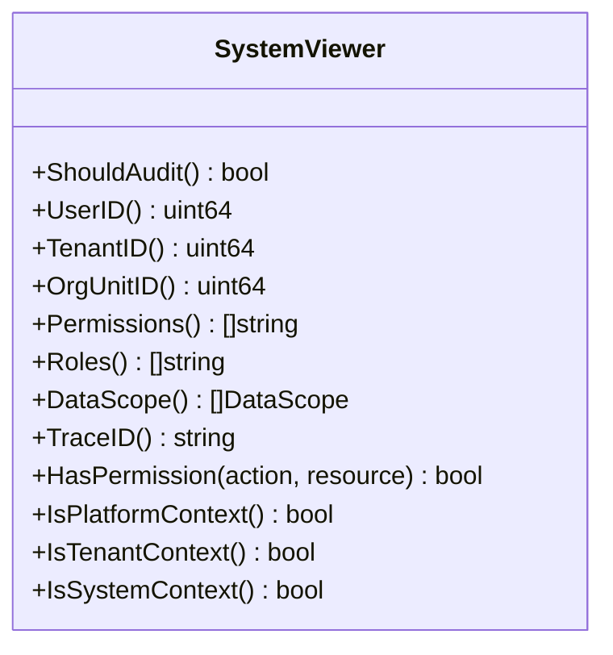
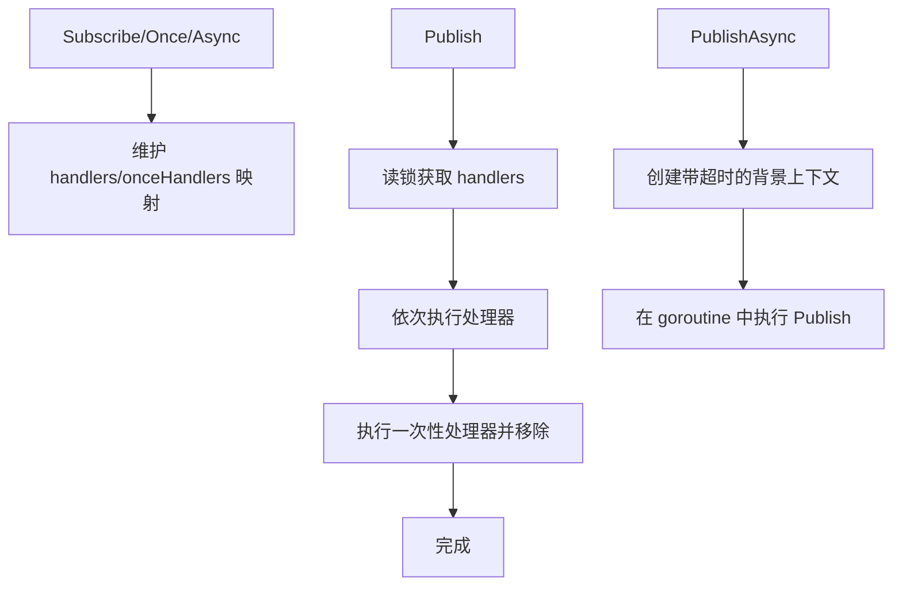
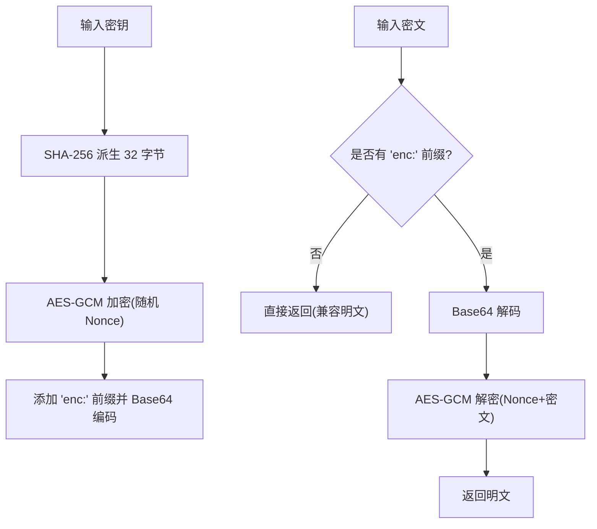
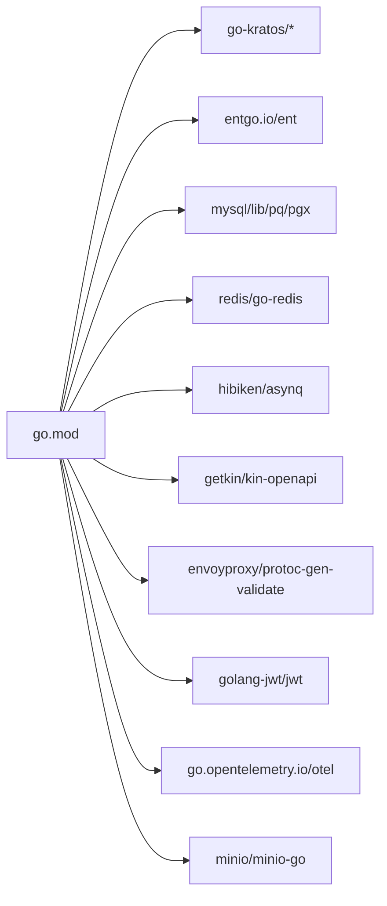

# 后端开发

<cite>
**本文引用的文件**
- [go.mod](file://backend/go.mod)
- [main.go](file://backend/app/admin/service/cmd/server/main.go)
- [wire.go](file://backend/app/admin/service/cmd/server/wire.go)
- [logging.go](file://backend/pkg/middleware/logging/logging.go)
- [auth.go](file://backend/pkg/middleware/auth/auth.go)
- [system_viewer.go](file://backend/pkg/entgo/viewer/system_viewer.go)
- [eventbus.go](file://backend/pkg/eventbus/eventbus.go)
- [permission.go](file://backend/pkg/constants/permission.go)
- [role.go](file://backend/pkg/constants/role.go)
- [aes_gcm.go](file://backend/pkg/crypto/aes_gcm.go)
- [server.yaml](file://backend/app/admin/service/configs/server.yaml)
- [auth.yaml](file://backend/app/admin/service/configs/auth.yaml)
- [data.yaml](file://backend/app/admin/service/configs/data.yaml)
- [logger.yaml](file://backend/app/admin/service/configs/logger.yaml)
</cite>

## 目录
1. [简介](#简介)
2. [项目结构](#项目结构)
3. [核心组件](#核心组件)
4. [架构总览](#架构总览)
5. [详细组件分析](#详细组件分析)
6. [依赖分析](#依赖分析)
7. [性能考量](#性能考量)
8. [故障排查指南](#故障排查指南)
9. [结论](#结论)
10. [附录](#附录)

## 简介
本指南面向使用 Go 与 Kratos 微服务框架的后端开发者，围绕 GoWind Admin 的后端实现，系统讲解服务接口定义、依赖注入配置、服务生命周期管理、Protobuf 协议与版本策略、Ent ORM 使用、中间件体系（认证、日志、CORS 等）、事件总线、加密工具以及最佳实践（错误处理、性能优化、安全）。文档以仓库实际源码为依据，辅以可视化图示，帮助快速上手与深入理解。

## 项目结构
后端采用多模块分层组织：应用入口与引导、协议与生成代码、通用包（中间件、常量、事件总线、加密、Lua 脚本引擎等）、数据库与缓存配置、服务配置与脚本等。关键路径如下：
- 应用入口与引导：backend/app/admin/service/cmd/server
- 生成的 API 与 Protobuf：backend/api/gen/go 与 backend/api/protos
- 通用包：backend/pkg/*
- 配置：backend/app/admin/service/configs/*
- 数据库与缓存：backend/app/admin/service/configs/data.yaml、backend/app/admin/service/configs/server.yaml

图表来源
- [main.go:1-76](file://backend/app/admin/service/cmd/server/main.go#L1-L76)
- [wire.go:1-47](file://backend/app/admin/service/cmd/server/wire.go#L1-L47)
- [server.yaml:1-49](file://backend/app/admin/service/configs/server.yaml#L1-L49)
- [auth.yaml:1-37](file://backend/app/admin/service/configs/auth.yaml#L1-L37)
- [data.yaml:1-21](file://backend/app/admin/service/configs/data.yaml#L1-L21)
- [logger.yaml:1-32](file://backend/app/admin/service/configs/logger.yaml#L1-L32)
- [auth.go:1-122](file://backend/pkg/middleware/auth/auth.go#L1-L122)
- [logging.go:1-52](file://backend/pkg/middleware/logging/logging.go#L1-L52)
- [eventbus.go:1-214](file://backend/pkg/eventbus/eventbus.go#L1-L214)
- [system_viewer.go:1-79](file://backend/pkg/entgo/viewer/system_viewer.go#L1-L79)
- [permission.go:1-39](file://backend/pkg/constants/permission.go#L1-L39)
- [role.go:1-49](file://backend/pkg/constants/role.go#L1-L49)
- [aes_gcm.go:1-154](file://backend/pkg/crypto/aes_gcm.go#L1-L154)

章节来源
- [main.go:1-76](file://backend/app/admin/service/cmd/server/main.go#L1-L76)
- [wire.go:1-47](file://backend/app/admin/service/cmd/server/wire.go#L1-L47)
- [server.yaml:1-49](file://backend/app/admin/service/configs/server.yaml#L1-L49)
- [auth.yaml:1-37](file://backend/app/admin/service/configs/auth.yaml#L1-L37)
- [data.yaml:1-21](file://backend/app/admin/service/configs/data.yaml#L1-L21)
- [logger.yaml:1-32](file://backend/app/admin/service/configs/logger.yaml#L1-L32)

## 核心组件
- 服务引导与生命周期
  - 应用入口通过引导上下文初始化 Kratos 应用，并集成 HTTP、Asynq、SSE 传输层。
  - 依赖注入使用 Wire，通过 ProviderSet 组合 server、service、data 层，集中管理服务生命周期。
- 中间件体系
  - 认证中间件：从元数据提取 Bearer Token，校验有效性，注入操作者信息、租户信息、Ent Viewer、元数据上下文，并可选启用鉴权引擎。
  - 日志中间件：记录请求耗时、登录登出审计、API 调用审计，支持 ECDSA 密钥对生成与审计日志写入。
- ORM 与数据访问
  - 使用 Ent 作为 ORM，结合 Viewer 上下文进行数据权限控制；系统级 Viewer 提供平台视角能力。
- 事件总线
  - 提供同步/异步订阅、一次性订阅、发布、关闭等能力，支持超时背景上下文保障异步发布不被调用方取消。
- 加密与安全
  - AES-GCM 加密器，自动派生 32 字节密钥，支持前缀识别与解密失败处理。
- 配置与部署
  - server.yaml 控制 REST、CORS、中间件开关、Asynq/SSE；auth.yaml 控制认证与鉴权类型；data.yaml 控制数据库与 Redis；logger.yaml 控制日志输出方式。

章节来源
- [main.go:46-75](file://backend/app/admin/service/cmd/server/main.go#L46-L75)
- [wire.go:27-46](file://backend/app/admin/service/cmd/server/wire.go#L27-L46)
- [auth.go:23-121](file://backend/pkg/middleware/auth/auth.go#L23-L121)
- [logging.go:14-51](file://backend/pkg/middleware/logging/logging.go#L14-L51)
- [system_viewer.go:9-79](file://backend/pkg/entgo/viewer/system_viewer.go#L9-L79)
- [eventbus.go:12-214](file://backend/pkg/eventbus/eventbus.go#L12-L214)
- [aes_gcm.go:26-154](file://backend/pkg/crypto/aes_gcm.go#L26-L154)
- [server.yaml:1-49](file://backend/app/admin/service/configs/server.yaml#L1-L49)
- [auth.yaml:1-37](file://backend/app/admin/service/configs/auth.yaml#L1-L37)
- [data.yaml:1-21](file://backend/app/admin/service/configs/data.yaml#L1-L21)
- [logger.yaml:1-32](file://backend/app/admin/service/configs/logger.yaml#L1-L32)

## 架构总览
下图展示应用启动、依赖注入、传输层与中间件的交互关系。

图表来源
- [main.go:59-75](file://backend/app/admin/service/cmd/server/main.go#L59-L75)
- [wire.go:37-46](file://backend/app/admin/service/cmd/server/wire.go#L37-L46)

章节来源
- [main.go:46-75](file://backend/app/admin/service/cmd/server/main.go#L46-L75)
- [wire.go:27-46](file://backend/app/admin/service/cmd/server/wire.go#L27-L46)

## 详细组件分析

### 服务引导与生命周期
- 引导上下文包含项目名、应用 ID、版本号，便于统一追踪与治理。
- Kratos 应用通过 bootstrap.NewApp 组合 HTTP、Asynq、SSE 三种传输层。
- Wire 通过 ProviderSet 将 server、service、data 层聚合，避免手动样板代码。

图表来源
- [main.go:59-75](file://backend/app/admin/service/cmd/server/main.go#L59-L75)
- [wire.go:37-46](file://backend/app/admin/service/cmd/server/wire.go#L37-L46)

章节来源
- [main.go:46-75](file://backend/app/admin/service/cmd/server/main.go#L46-L75)
- [wire.go:27-46](file://backend/app/admin/service/cmd/server/wire.go#L27-L46)

### 中间件：认证与鉴权
- 认证中间件从传输上下文中提取 Bearer Token，校验后注入操作者、租户、组织单元、数据范围等上下文，支持 Ent Viewer 与元数据注入，并可选启用鉴权引擎。
- 支持动态设置是否注入操作者 ID、租户 ID、是否启用鉴权、是否注入 Ent Viewer、是否注入元数据。

图表来源
- [auth.go:38-121](file://backend/pkg/middleware/auth/auth.go#L38-L121)

章节来源
- [auth.go:23-121](file://backend/pkg/middleware/auth/auth.go#L23-L121)

### 中间件：日志与审计
- 日志中间件统计请求耗时，基于传输上下文区分 HTTP，分别触发登录审计与 API 审计。
- 默认生成 ECDSA 密钥对用于审计相关场景，确保审计链路完整性。

图表来源
- [logging.go:31-51](file://backend/pkg/middleware/logging/logging.go#L31-L51)

章节来源
- [logging.go:14-51](file://backend/pkg/middleware/logging/logging.go#L14-L51)

### Ent ORM 与 Viewer
- Viewer 提供统一的数据权限抽象，支持用户 ID、租户 ID、组织单元 ID、权限集合、角色集合、数据范围、Trace ID 等。
- 系统级 Viewer 提供平台视角能力，适用于后台任务与系统管理场景。

图表来源
- [system_viewer.go:9-79](file://backend/pkg/entgo/viewer/system_viewer.go#L9-L79)

章节来源
- [system_viewer.go:1-79](file://backend/pkg/entgo/viewer/system_viewer.go#L1-L79)

### 事件总线
- 提供订阅/取消订阅、一次性订阅、同步/异步发布、关闭等能力。
- 异步发布使用独立背景上下文与超时，避免被调用方取消导致丢失事件。

图表来源
- [eventbus.go:54-167](file://backend/pkg/eventbus/eventbus.go#L54-L167)

章节来源
- [eventbus.go:12-214](file://backend/pkg/eventbus/eventbus.go#L12-L214)

### 加密工具：AES-GCM
- 自动将任意长度密钥通过 SHA-256 派生为 32 字节，支持“enc:”前缀识别与解密失败处理。
- 提供加密/解密、是否已加密检测、测试辅助方法。

图表来源
- [aes_gcm.go:33-130](file://backend/pkg/crypto/aes_gcm.go#L33-L130)

章节来源
- [aes_gcm.go:1-154](file://backend/pkg/crypto/aes_gcm.go#L1-L154)

### 权限与角色常量
- 权限常量定义系统权限前缀、受保护权限列表、模块标识等。
- 角色常量定义角色前缀、默认角色名称、角色代码解析与模板角色转换。

章节来源
- [permission.go:1-39](file://backend/pkg/constants/permission.go#L1-L39)
- [role.go:1-49](file://backend/pkg/constants/role.go#L1-L49)

## 依赖分析
- 外部依赖
  - Kratos 生态：go-kratos、kratos-authn、kratos-authz、kratos-bootstrap、kratos-transport 等。
  - ORM：entgo.io/ent。
  - 数据库驱动：mysql、lib/pq、pgx。
  - 缓存与消息：redis/go-redis、hibiken/asynq。
  - OpenAPI/验证：getkin/kin-openapi、envoyproxy/protoc-gen-validate。
  - 其他：minio、jwt、opentelemetry、yml 解析等。
- 内部模块耦合
  - 应用入口依赖引导与 Wire；中间件依赖传输上下文与元数据；事件总线为松耦合扩展点；加密与常量为通用工具。

图表来源
- [go.mod:5-65](file://backend/go.mod#L5-L65)

章节来源
- [go.mod:1-290](file://backend/go.mod#L1-L290)

## 性能考量
- 中间件链顺序
  - 认证与鉴权应尽量前置，尽早失败以减少后续开销。
  - 日志中间件统计耗时，建议在认证之后、业务处理之前，避免统计到鉴权失败的短路路径。
- Asynq 队列
  - 合理设置并发与队列优先级，避免低优先级任务饥饿；开启优雅关闭与超时控制。
- 数据库连接池
  - 根据峰值 QPS 调整最大空闲/活动连接数与生命周期，避免连接抖动。
- 缓存与序列化
  - Redis 读写超时需平衡延迟与吞吐；JSON 编解码可考虑压缩或二进制格式。
- 日志与审计
  - 审计写入建议异步化，避免阻塞主请求路径；注意磁盘 IO 与网络日志收集的背压。

## 故障排查指南
- 认证失败
  - 检查 Bearer Token 是否存在、是否过期、签名算法与密钥是否匹配。
  - 确认注入的操作者/租户 ID 是否正确，必要时开启元数据中间件调试。
- 鉴权异常
  - 若启用鉴权引擎，确认策略配置与资源/动作映射是否一致。
- 日志与审计
  - 若审计缺失，检查日志中间件是否启用、操作类型是否命中登录/API 审计分支。
- 事件总线
  - 异步发布无响应时，查看异步处理器错误日志与总线关闭状态；确认一次性处理器是否被提前移除。
- 数据库/Redis
  - 连接池耗尽或超时：增大连接数或优化查询；检查慢查询与索引。
- 配置问题
  - CORS 未生效：核对 server.yaml 中 headers/methods/origins 设置；浏览器预检请求需允许 OPTIONS。
  - Swagger/pprof：确认 enable_swagger/enable_pprof 开关与端口映射。

章节来源
- [auth.go:46-61](file://backend/pkg/middleware/auth/auth.go#L46-L61)
- [logging.go:31-49](file://backend/pkg/middleware/logging/logging.go#L31-L49)
- [eventbus.go:107-151](file://backend/pkg/eventbus/eventbus.go#L107-L151)
- [server.yaml:7-28](file://backend/app/admin/service/configs/server.yaml#L7-L28)
- [data.yaml:1-21](file://backend/app/admin/service/configs/data.yaml#L1-L21)

## 结论
本指南基于 GoWind Admin 实际代码，梳理了基于 Kratos 的微服务架构实现要点：服务引导与依赖注入、传输层与中间件、ORM 与权限控制、事件总线与加密工具，并结合配置文件给出部署与运维建议。遵循本文最佳实践，可快速搭建稳定、可观测、可扩展的后端服务。

## 附录
- Protobuf 协议与 API 版本管理
  - 项目采用按服务分组的 Protobuf 定义，版本号位于目录层级（如 v1），便于语义化版本管理与向后兼容。
  - 建议在新增字段时保持向后兼容，旧字段标记弃用而非删除；变更字段类型或删除字段时，升级至新版本目录并迁移客户端。
- 生成代码与 API 文档
  - 生成代码位于 backend/api/gen/go 下，Swagger UI 可在 REST 服务中启用以自动生成 API 文档。
- 配置与环境
  - server.yaml、auth.yaml、data.yaml、logger.yaml 分别控制传输层、认证鉴权、数据库与缓存、日志输出，建议通过环境变量或外部配置中心覆盖敏感参数。