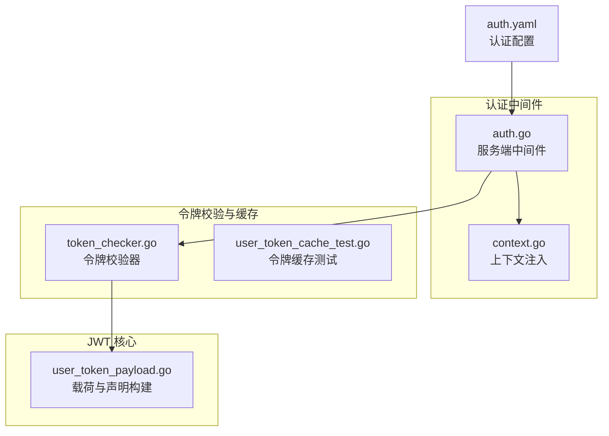
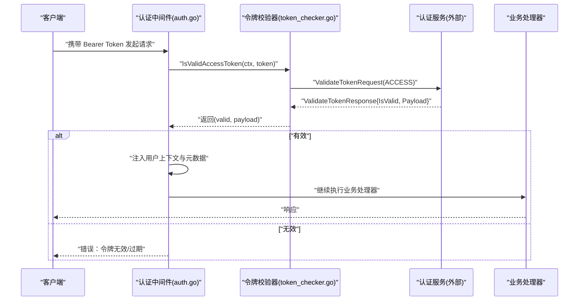
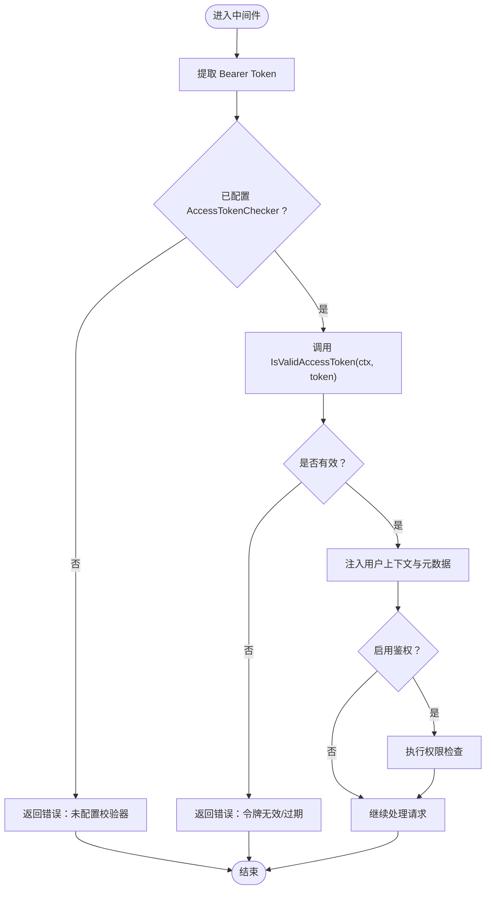
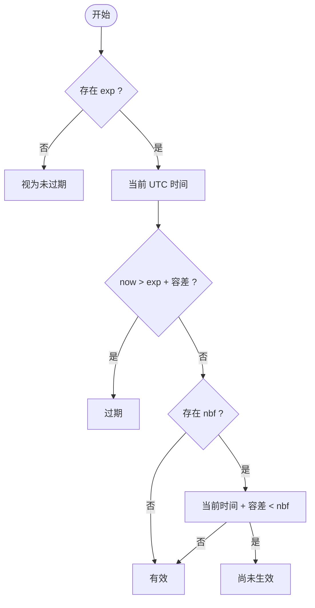
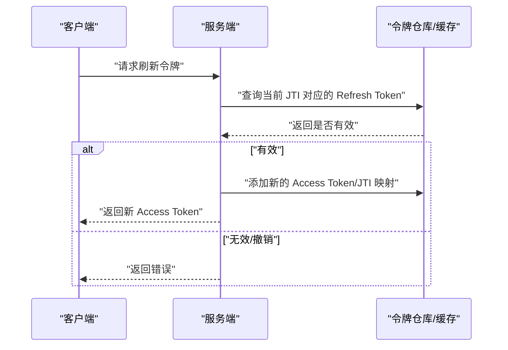
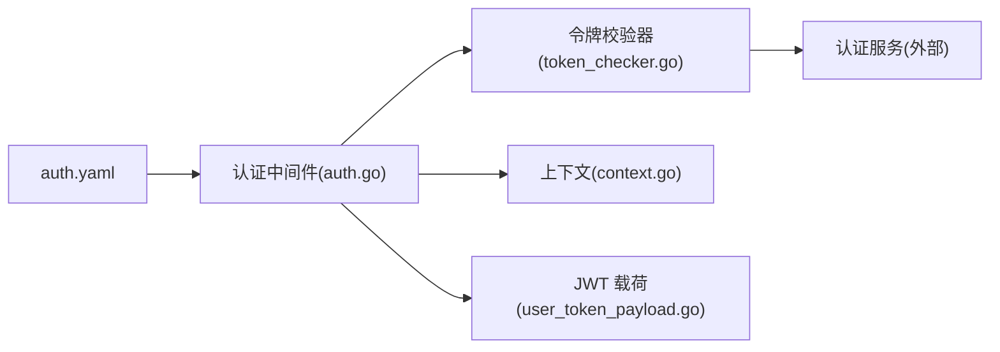

# JWT 认证机制

<cite>
**本文引用的文件**
- [backend/pkg/jwt/user_token_payload.go](file://backend/pkg/jwt/user_token_payload.go)
- [backend/pkg/middleware/auth/auth.go](file://backend/pkg/middleware/auth/auth.go)
- [backend/pkg/middleware/auth/context.go](file://backend/pkg/middleware/auth/context.go)
- [backend/app/admin/service/internal/data/token_checker.go](file://backend/app/admin/service/internal/data/token_checker.go)
- [backend/app/admin/service/internal/data/user_token_cache_test.go](file://backend/app/admin/service/internal/data/user_token_cache_test.go)
- [backend/app/admin/service/configs/auth.yaml](file://backend/app/admin/service/configs/auth.yaml)
</cite>

## 目录
1. [简介](#简介)
2. [项目结构](#项目结构)
3. [核心组件](#核心组件)
4. [架构总览](#架构总览)
5. [详细组件分析](#详细组件分析)
6. [依赖分析](#依赖分析)
7. [性能考虑](#性能考虑)
8. [故障排查指南](#故障排查指南)
9. [结论](#结论)
10. [附录](#附录)

## 简介
本文件系统性阐述本项目中的 JWT 认证机制，覆盖以下主题：
- JWT Token 的生成、验证与刷新流程
- UserTokenPayload 结构设计与字段语义
- Token 生命周期管理（过期时间、自动刷新）
- 认证中间件工作原理（Token 提取、验证、用户上下文注入）
- 使用示例（登录获取 Token、Token 验证、权限检查）
- 安全最佳实践与常见问题排查

## 项目结构
围绕 JWT 认证的关键代码分布在如下位置：
- JWT 载荷与声明构建：backend/pkg/jwt/user_token_payload.go
- 认证中间件：backend/pkg/middleware/auth/auth.go、backend/pkg/middleware/auth/context.go
- 访问令牌校验器与缓存：backend/app/admin/service/internal/data/token_checker.go、测试用例 backend/app/admin/service/internal/data/user_token_cache_test.go
- 认证配置：backend/app/admin/service/configs/auth.yaml



图表来源
- [backend/pkg/jwt/user_token_payload.go:1-279](file://backend/pkg/jwt/user_token_payload.go#L1-L279)
- [backend/pkg/middleware/auth/auth.go:1-122](file://backend/pkg/middleware/auth/auth.go#L1-L122)
- [backend/pkg/middleware/auth/context.go:1-26](file://backend/pkg/middleware/auth/context.go#L1-L26)
- [backend/app/admin/service/internal/data/token_checker.go:46-65](file://backend/app/admin/service/internal/data/token_checker.go#L46-L65)
- [backend/app/admin/service/internal/data/user_token_cache_test.go:58-93](file://backend/app/admin/service/internal/data/user_token_cache_test.go#L58-L93)
- [backend/app/admin/service/configs/auth.yaml:1-37](file://backend/app/admin/service/configs/auth.yaml#L1-L37)

章节来源
- [backend/pkg/jwt/user_token_payload.go:1-279](file://backend/pkg/jwt/user_token_payload.go#L1-L279)
- [backend/pkg/middleware/auth/auth.go:1-122](file://backend/pkg/middleware/auth/auth.go#L1-L122)
- [backend/pkg/middleware/auth/context.go:1-26](file://backend/pkg/middleware/auth/context.go#L1-L26)
- [backend/app/admin/service/internal/data/token_checker.go:46-65](file://backend/app/admin/service/internal/data/token_checker.go#L46-L65)
- [backend/app/admin/service/internal/data/user_token_cache_test.go:58-93](file://backend/app/admin/service/internal/data/user_token_cache_test.go#L58-L93)
- [backend/app/admin/service/configs/auth.yaml:1-37](file://backend/app/admin/service/configs/auth.yaml#L1-L37)

## 核心组件
- UserTokenPayload 构建与声明映射：负责将用户信息封装为 JWT 载荷，并将其转换为认证声明；同时支持从声明或 MapClaims 反向还原载荷。
- 认证中间件：在服务端拦截请求，提取 Bearer Token，调用令牌校验器进行验证，成功后将用户上下文注入到请求中，供后续处理器与鉴权模块使用。
- 令牌校验器：通过认证服务对 Access Token 进行验证，支持黑名单/撤销检查，并返回有效载荷。
- 配置：在配置文件中指定认证类型与算法密钥，确保中间件与认证服务一致。

章节来源
- [backend/pkg/jwt/user_token_payload.go:39-100](file://backend/pkg/jwt/user_token_payload.go#L39-L100)
- [backend/pkg/middleware/auth/auth.go:23-121](file://backend/pkg/middleware/auth/auth.go#L23-L121)
- [backend/app/admin/service/internal/data/token_checker.go:46-65](file://backend/app/admin/service/internal/data/token_checker.go#L46-L65)
- [backend/app/admin/service/configs/auth.yaml:1-37](file://backend/app/admin/service/configs/auth.yaml#L1-L37)

## 架构总览
下图展示了从客户端发起请求到服务端完成认证与上下文注入的整体流程。



图表来源
- [backend/pkg/middleware/auth/auth.go:38-121](file://backend/pkg/middleware/auth/auth.go#L38-L121)
- [backend/app/admin/service/internal/data/token_checker.go:46-65](file://backend/app/admin/service/internal/data/token_checker.go#L46-L65)

## 详细组件分析

### UserTokenPayload 结构与字段设计
- 字段来源与映射
  - 用户名、用户ID、租户ID、组织单元ID、角色码列表、设备ID、客户端ID、数据范围等均来自 UserTokenPayload，并映射到标准与自定义声明键。
  - 关键声明键包括：用户名（标准 sub）、用户ID、租户ID、客户端ID、设备ID、角色码列表、数据范围、组织单元ID等。
- 载荷构造
  - NewUserTokenPayload：将输入参数封装为 UserTokenPayload。
  - NewUserTokenAuthClaims：将 UserTokenPayload 转换为认证声明，填充标准与自定义字段，并可选设置过期时间。
  - NewUserTokenPayloadWithClaims/NewUserTokenPayloadWithJwtMapClaims：从认证声明或 MapClaims 反向还原 UserTokenPayload。
- 生命周期辅助函数
  - IsTokenExpired/IsTokenNotValidYet：基于声明中的 exp/nbf 与默认时间容差判断是否过期或尚未生效。

```mermaid
classDiagram
class UserTokenPayload {
+string Username
+uint32 UserId
+uint32 TenantId
+uint32 OrgUnitId
+[]string Roles
+string ClientId
+string DeviceId
+DataScope DataScope
}
class AuthClaims {
+string Subject
+uint64 IssuedAt
+uint64 ExpirationTime
+uint64 JwtID
+map[string]interface{} CustomFields
}
class ClaimsBuilder {
+NewUserTokenPayload(...)
+NewUserTokenAuthClaims(...)
+NewUserTokenPayloadWithClaims(...)
+NewUserTokenPayloadWithJwtMapClaims(...)
+IsTokenExpired(...)
+IsTokenNotValidYet(...)
}
ClaimsBuilder --> UserTokenPayload : "构建/反向解析"
ClaimsBuilder --> AuthClaims : "转换为声明"
```

图表来源
- [backend/pkg/jwt/user_token_payload.go:39-100](file://backend/pkg/jwt/user_token_payload.go#L39-L100)
- [backend/pkg/jwt/user_token_payload.go:102-182](file://backend/pkg/jwt/user_token_payload.go#L102-L182)
- [backend/pkg/jwt/user_token_payload.go:184-246](file://backend/pkg/jwt/user_token_payload.go#L184-L246)
- [backend/pkg/jwt/user_token_payload.go:248-278](file://backend/pkg/jwt/user_token_payload.go#L248-L278)

章节来源
- [backend/pkg/jwt/user_token_payload.go:17-37](file://backend/pkg/jwt/user_token_payload.go#L17-L37)
- [backend/pkg/jwt/user_token_payload.go:39-100](file://backend/pkg/jwt/user_token_payload.go#L39-L100)
- [backend/pkg/jwt/user_token_payload.go:102-182](file://backend/pkg/jwt/user_token_payload.go#L102-L182)
- [backend/pkg/jwt/user_token_payload.go:184-246](file://backend/pkg/jwt/user_token_payload.go#L184-L246)
- [backend/pkg/jwt/user_token_payload.go:248-278](file://backend/pkg/jwt/user_token_payload.go#L248-L278)

### 认证中间件工作原理
- 请求拦截与 Token 提取
  - 中间件从传输上下文中提取 Bearer Token。
- 令牌验证
  - 调用 AccessTokenChecker 的 IsValidAccessToken 对 Access Token 进行验证。
- 上下文注入
  - 成功后将 UserTokenPayload 注入到上下文，同时可选注入操作者ID、租户ID、数据范围、组织单元ID等。
  - 同时注入 Ent Viewer 与 Metadata，便于后续处理器与审计/权限模块使用。
- 权限检查
  - 若启用鉴权，则进一步进行权限判定。



图表来源
- [backend/pkg/middleware/auth/auth.go:23-121](file://backend/pkg/middleware/auth/auth.go#L23-L121)
- [backend/pkg/middleware/auth/context.go:15-25](file://backend/pkg/middleware/auth/context.go#L15-L25)

章节来源
- [backend/pkg/middleware/auth/auth.go:23-121](file://backend/pkg/middleware/auth/auth.go#L23-L121)
- [backend/pkg/middleware/auth/context.go:15-25](file://backend/pkg/middleware/auth/context.go#L15-L25)

### 令牌生命周期管理
- 默认过期时间
  - 访问令牌默认过期时间为 2 小时；刷新令牌默认过期时间为 7 天。
- 时间容差
  - 默认时间容差为 60 秒，用于缓解时钟偏差导致的验证失败。
- 过期与未生效判断
  - 基于声明中的 exp 与 nbf 字段，结合默认容差判断是否过期或尚未生效。



图表来源
- [backend/pkg/jwt/user_token_payload.go:248-278](file://backend/pkg/jwt/user_token_payload.go#L248-L278)

章节来源
- [backend/pkg/jwt/user_token_payload.go:28-37](file://backend/pkg/jwt/user_token_payload.go#L28-L37)
- [backend/pkg/jwt/user_token_payload.go:248-278](file://backend/pkg/jwt/user_token_payload.go#L248-L278)

### 刷新令牌流程与撤销控制
- 刷新令牌存储与校验
  - 令牌缓存测试显示：Access Token 与 Refresh Token 均以 JTI 作为键进行存储与校验。
  - 支持添加、查询、撤销 Access/Refresh Token。
- 黑名单/撤销检查
  - 令牌校验器提供 IsBlockedAccessToken，用于检查令牌是否被撤销。



图表来源
- [backend/app/admin/service/internal/data/user_token_cache_test.go:58-93](file://backend/app/admin/service/internal/data/user_token_cache_test.go#L58-L93)
- [backend/app/admin/service/internal/data/token_checker.go:54-65](file://backend/app/admin/service/internal/data/token_checker.go#L54-L65)

章节来源
- [backend/app/admin/service/internal/data/user_token_cache_test.go:58-93](file://backend/app/admin/service/internal/data/user_token_cache_test.go#L58-L93)
- [backend/app/admin/service/internal/data/token_checker.go:54-65](file://backend/app/admin/service/internal/data/token_checker.go#L54-L65)

### 使用示例（流程说明）
- 登录获取 Token
  - 客户端提交凭据，服务端生成 Access Token 与 Refresh Token，并以 JTI 为键进行持久化。
  - 返回给客户端的应包含 Access Token（短期）与 Refresh Token（长期）。
- Token 验证
  - 客户端在后续请求头中携带 Bearer Token。
  - 服务端中间件提取 Token 并调用令牌校验器进行验证。
- 权限检查
  - 中间件在注入用户上下文后，可结合鉴权模块进行权限判定。

章节来源
- [backend/pkg/middleware/auth/auth.go:38-121](file://backend/pkg/middleware/auth/auth.go#L38-L121)
- [backend/app/admin/service/internal/data/token_checker.go:46-65](file://backend/app/admin/service/internal/data/token_checker.go#L46-L65)

## 依赖分析
- 组件耦合
  - 认证中间件依赖令牌校验器接口，具体实现由认证服务提供。
  - 令牌校验器依赖认证服务的 ValidateTokenRequest/Response。
  - JWT 载荷与声明构建独立于具体加密算法，仅依赖声明键常量与数据模型。
- 外部依赖
  - 认证引擎与鉴权引擎接口用于声明提取与权限判定。
  - 配置文件决定认证类型与算法密钥。



图表来源
- [backend/pkg/middleware/auth/auth.go:23-121](file://backend/pkg/middleware/auth/auth.go#L23-L121)
- [backend/pkg/middleware/auth/context.go:15-25](file://backend/pkg/middleware/auth/context.go#L15-L25)
- [backend/pkg/jwt/user_token_payload.go:39-100](file://backend/pkg/jwt/user_token_payload.go#L39-L100)
- [backend/app/admin/service/configs/auth.yaml:1-37](file://backend/app/admin/service/configs/auth.yaml#L1-L37)

章节来源
- [backend/pkg/middleware/auth/auth.go:23-121](file://backend/pkg/middleware/auth/auth.go#L23-L121)
- [backend/pkg/middleware/auth/context.go:15-25](file://backend/pkg/middleware/auth/context.go#L15-L25)
- [backend/pkg/jwt/user_token_payload.go:39-100](file://backend/pkg/jwt/user_token_payload.go#L39-L100)
- [backend/app/admin/service/configs/auth.yaml:1-37](file://backend/app/admin/service/configs/auth.yaml#L1-L37)

## 性能考虑
- 声明解析与上下文注入
  - 中间件在每次请求都会进行 Token 校验与上下文注入，建议在网关或统一入口处减少不必要的中间件链路。
- 缓存策略
  - Access Token 可采用内存缓存或分布式缓存，结合 JTI 作为键，提升校验效率。
- 过期时间与刷新频率
  - 合理设置 Access Token 过期时间与刷新周期，平衡安全与用户体验。
- 时间容差
  - 默认容差为 60 秒，建议根据网络抖动与服务器时钟同步情况调整。

## 故障排查指南
- 常见错误与定位
  - 未配置 AccessTokenChecker：中间件会直接返回错误，检查中间件选项配置。
  - 缺失 Bearer Token：中间件返回缺失 Token 错误，确认客户端请求头格式。
  - 令牌无效/过期：中间件返回令牌无效错误，检查令牌是否被撤销或已过期。
  - 上下文缺失：从上下文读取用户信息时报错，确认中间件是否正确注入。
- 排查步骤
  - 检查 auth.yaml 中认证类型与算法配置是否与服务端一致。
  - 在令牌校验器处增加日志，记录 ValidateTokenRequest 的返回状态。
  - 使用测试用例中的 JTI 存储模式验证 Access/Refresh Token 的添加、查询与撤销流程。

章节来源
- [backend/pkg/middleware/auth/auth.go:46-61](file://backend/pkg/middleware/auth/auth.go#L46-L61)
- [backend/pkg/middleware/auth/context.go:19-25](file://backend/pkg/middleware/auth/context.go#L19-L25)
- [backend/app/admin/service/internal/data/token_checker.go:46-65](file://backend/app/admin/service/internal/data/token_checker.go#L46-L65)
- [backend/app/admin/service/configs/auth.yaml:1-37](file://backend/app/admin/service/configs/auth.yaml#L1-L37)

## 结论
本项目通过明确的 JWT 载荷结构、声明映射与中间件集成，实现了可扩展的认证与授权能力。配合令牌缓存与撤销控制，可在保证安全性的同时提升系统性能。建议在生产环境中严格管理密钥与过期策略，并完善监控与日志以便快速定位问题。

## 附录
- 配置项说明（摘自配置文件）
  - 认证类型：jwt
  - JWT 算法：HS256
  - 密钥：some_api_key
  - 鉴权类型：noop（可替换为 casbin/opa/zanzibar）

章节来源
- [backend/app/admin/service/configs/auth.yaml:1-37](file://backend/app/admin/service/configs/auth.yaml#L1-L37)