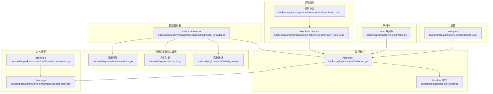
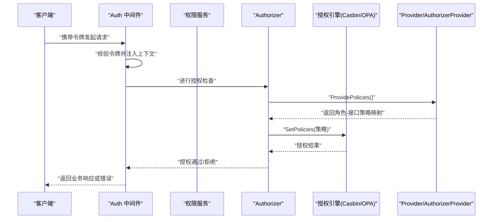
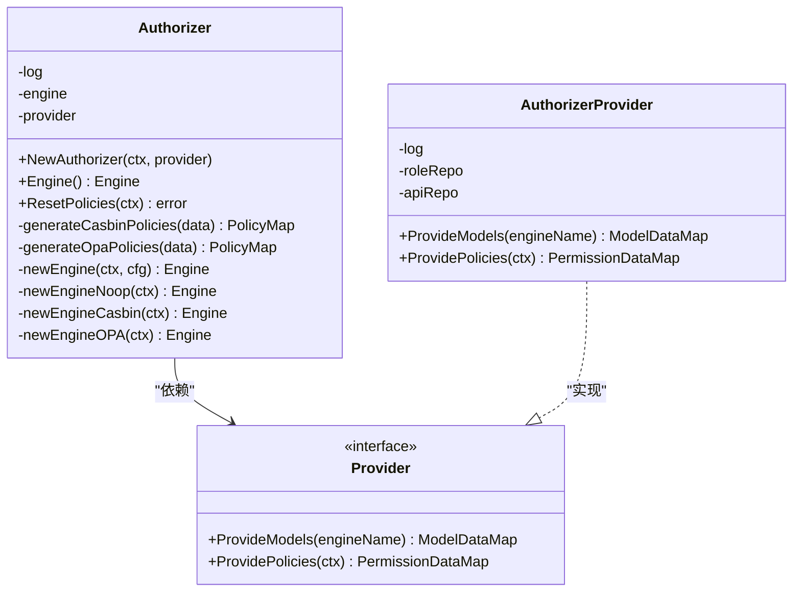
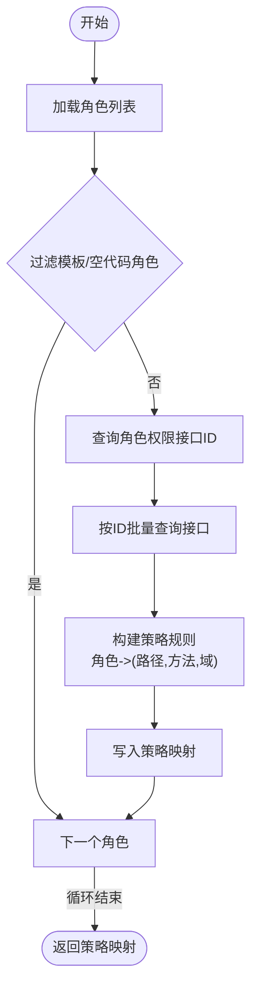
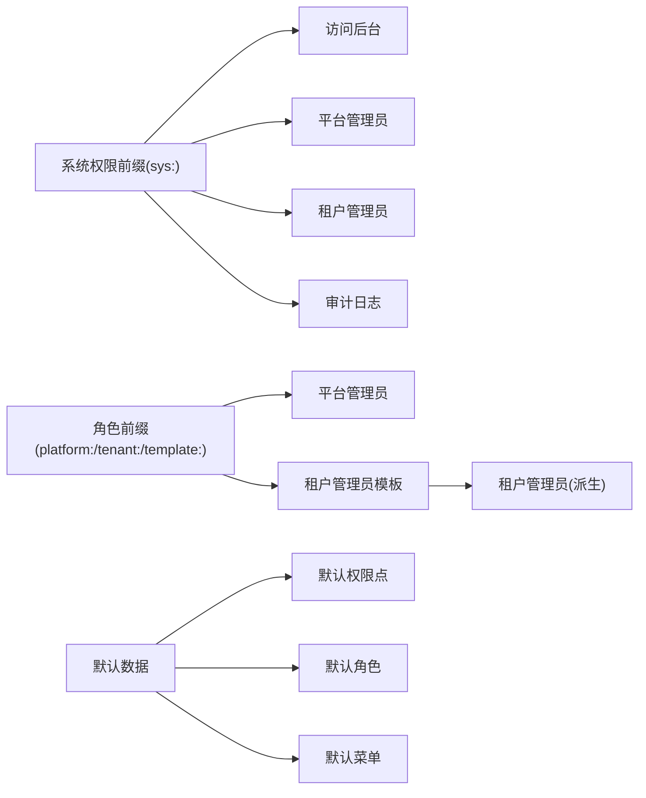
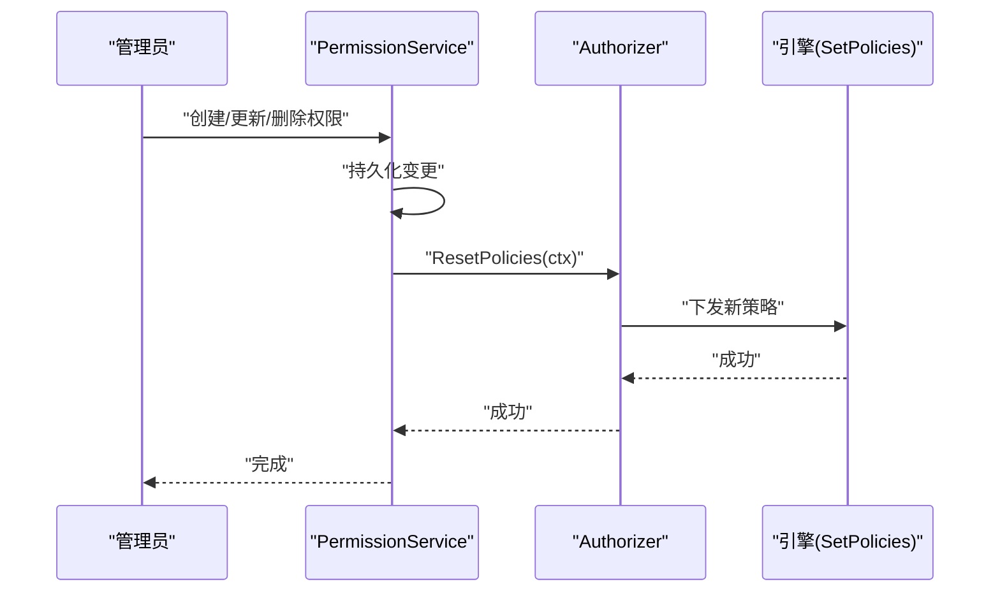
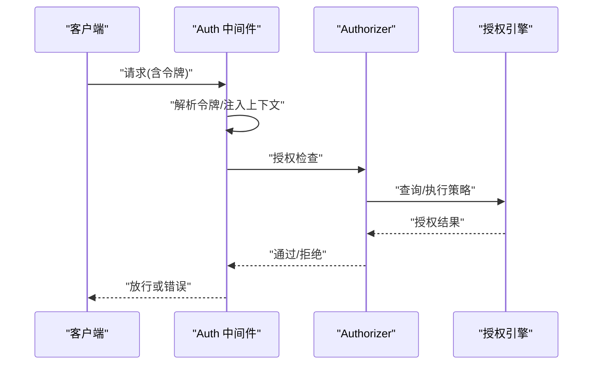
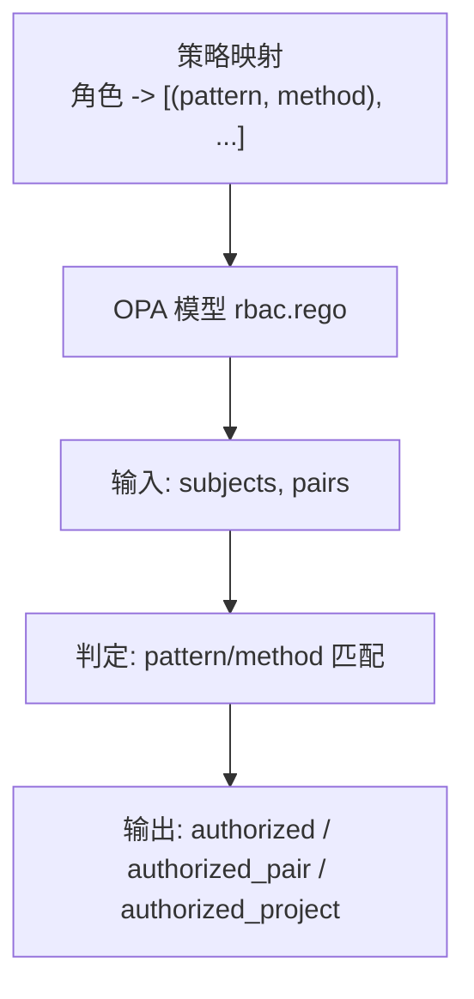
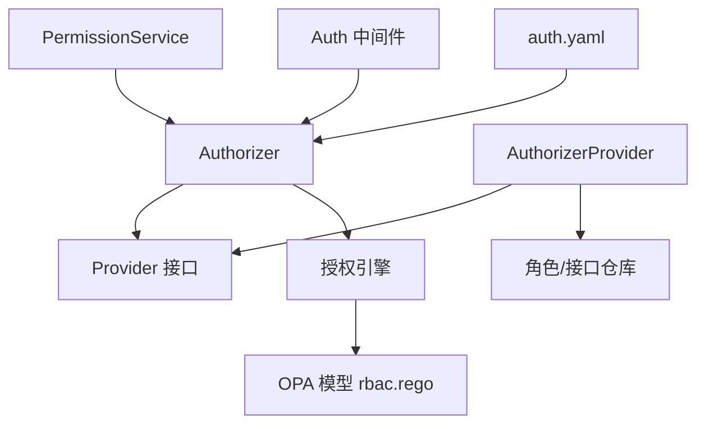

# RBAC 权限控制

<cite>
**本文引用的文件**
- [backend/pkg/authorizer/authorizer.go](file://backend/pkg/authorizer/authorizer.go)
- [backend/pkg/authorizer/provider.go](file://backend/pkg/authorizer/provider.go)
- [backend/app/admin/service/internal/data/authorizer_provider.go](file://backend/app/admin/service/internal/data/authorizer_provider.go)
- [backend/pkg/constants/permission.go](file://backend/pkg/constants/permission.go)
- [backend/pkg/constants/role.go](file://backend/pkg/constants/role.go)
- [backend/pkg/constants/default_data.go](file://backend/pkg/constants/default_data.go)
- [backend/app/admin/service/internal/service/permission_service.go](file://backend/app/admin/service/internal/service/permission_service.go)
- [backend/pkg/middleware/auth/auth.go](file://backend/pkg/middleware/auth/auth.go)
- [backend/app/admin/service/cmd/server/assets/rbac.rego](file://backend/app/admin/service/cmd/server/assets/rbac.rego)
- [backend/app/admin/service/cmd/server/assets/assets.go](file://backend/app/admin/service/cmd/server/assets/assets.go)
- [backend/app/admin/service/configs/auth.yaml](file://backend/app/admin/service/configs/auth.yaml)
- [backend/api/protos/permission/service/v1/permission.proto](file://backend/api/protos/permission/service/v1/permission.proto)
</cite>

## 目录
1. [简介](#简介)
2. [项目结构](#项目结构)
3. [核心组件](#核心组件)
4. [架构总览](#架构总览)
5. [详细组件分析](#详细组件分析)
6. [依赖分析](#依赖分析)
7. [性能考虑](#性能考虑)
8. [故障排查指南](#故障排查指南)
9. [结论](#结论)
10. [附录](#附录)

## 简介
本文件面向 RBAC 权限控制系统，围绕“基于角色的访问控制”模型，系统化阐述权限检查机制、Authorizer 组件工作原理与配置方法、权限常量与权限树结构、权限配置示例、调试工具与常见问题处理，以及权限审计与安全监控最佳实践。该系统采用多引擎支持（noop、casbin、opa、zanzibar），通过 Provider 将角色-接口权限映射注入到具体引擎，实现灵活可插拔的授权能力。

## 项目结构
RBAC 权限控制相关代码主要分布在以下位置：
- 授权核心与引擎桥接：backend/pkg/authorizer
- 权限常量与默认数据：backend/pkg/constants
- 权限服务与仓库：backend/app/admin/service/internal/service 与 internal/data
- 中间件鉴权：backend/pkg/middleware/auth
- OPA 模型与资源：backend/app/admin/service/cmd/server/assets
- 配置：backend/app/admin/service/configs/auth.yaml
- 权限服务协议：backend/api/protos/permission/service/v1/permission.proto

**图表来源**
- [backend/pkg/authorizer/authorizer.go:1-241](file://backend/pkg/authorizer/authorizer.go#L1-L241)
- [backend/pkg/authorizer/provider.go:1-28](file://backend/pkg/authorizer/provider.go#L1-L28)
- [backend/app/admin/service/internal/data/authorizer_provider.go:1-116](file://backend/app/admin/service/internal/data/authorizer_provider.go#L1-L116)
- [backend/pkg/constants/permission.go:1-39](file://backend/pkg/constants/permission.go#L1-L39)
- [backend/pkg/constants/role.go:1-49](file://backend/pkg/constants/role.go#L1-L49)
- [backend/pkg/constants/default_data.go:1-790](file://backend/pkg/constants/default_data.go#L1-L790)
- [backend/app/admin/service/internal/service/permission_service.go:1-552](file://backend/app/admin/service/internal/service/permission_service.go#L1-L552)
- [backend/pkg/middleware/auth/auth.go:1-122](file://backend/pkg/middleware/auth/auth.go#L1-L122)
- [backend/app/admin/service/cmd/server/assets/rbac.rego:1-40](file://backend/app/admin/service/cmd/server/assets/rbac.rego#L1-L40)
- [backend/app/admin/service/cmd/server/assets/assets.go:1-9](file://backend/app/admin/service/cmd/server/assets/assets.go#L1-L9)
- [backend/app/admin/service/configs/auth.yaml:1-37](file://backend/app/admin/service/configs/auth.yaml#L1-L37)
- [backend/api/protos/permission/service/v1/permission.proto:1-172](file://backend/api/protos/permission/service/v1/permission.proto#L1-L172)

**章节来源**
- [backend/pkg/authorizer/authorizer.go:1-241](file://backend/pkg/authorizer/authorizer.go#L1-L241)
- [backend/app/admin/service/internal/data/authorizer_provider.go:1-116](file://backend/app/admin/service/internal/data/authorizer_provider.go#L1-L116)
- [backend/pkg/constants/permission.go:1-39](file://backend/pkg/constants/permission.go#L1-L39)
- [backend/pkg/constants/role.go:1-49](file://backend/pkg/constants/role.go#L1-L49)
- [backend/pkg/constants/default_data.go:1-790](file://backend/pkg/constants/default_data.go#L1-L790)
- [backend/app/admin/service/internal/service/permission_service.go:1-552](file://backend/app/admin/service/internal/service/permission_service.go#L1-L552)
- [backend/pkg/middleware/auth/auth.go:1-122](file://backend/pkg/middleware/auth/auth.go#L1-L122)
- [backend/app/admin/service/cmd/server/assets/rbac.rego:1-40](file://backend/app/admin/service/cmd/server/assets/rbac.rego#L1-L40)
- [backend/app/admin/service/cmd/server/assets/assets.go:1-9](file://backend/app/admin/service/cmd/server/assets/assets.go#L1-L9)
- [backend/app/admin/service/configs/auth.yaml:1-37](file://backend/app/admin/service/configs/auth.yaml#L1-L37)
- [backend/api/protos/permission/service/v1/permission.proto:1-172](file://backend/api/protos/permission/service/v1/permission.proto#L1-L172)

## 核心组件
- Authorizer：统一授权入口，负责根据配置选择引擎（noop/casbin/opa/zanzibar），拉取策略数据并下发到引擎。
- Provider 接口：抽象策略与模型数据提供者，Authorizer 通过它获取角色-接口映射与引擎模型。
- AuthorizerProvider：具体实现，从角色与接口仓库中构建策略数据；同时提供 OPA 模型。
- 权限常量与默认数据：定义系统级权限代码、角色前缀、默认权限/角色/菜单等。
- 权限服务：提供权限点的增删改查与同步能力，变更后触发 Authorizer 重载策略。
- 中间件：在请求进入业务处理前完成认证与鉴权（可选启用）。
- OPA 模型：内置 rbac.rego，定义授权判定逻辑。

**章节来源**
- [backend/pkg/authorizer/authorizer.go:1-241](file://backend/pkg/authorizer/authorizer.go#L1-L241)
- [backend/pkg/authorizer/provider.go:1-28](file://backend/pkg/authorizer/provider.go#L1-L28)
- [backend/app/admin/service/internal/data/authorizer_provider.go:1-116](file://backend/app/admin/service/internal/data/authorizer_provider.go#L1-L116)
- [backend/pkg/constants/permission.go:1-39](file://backend/pkg/constants/permission.go#L1-L39)
- [backend/pkg/constants/role.go:1-49](file://backend/pkg/constants/role.go#L1-L49)
- [backend/pkg/constants/default_data.go:1-790](file://backend/pkg/constants/default_data.go#L1-L790)
- [backend/app/admin/service/internal/service/permission_service.go:1-552](file://backend/app/admin/service/internal/service/permission_service.go#L1-L552)
- [backend/pkg/middleware/auth/auth.go:1-122](file://backend/pkg/middleware/auth/auth.go#L1-L122)
- [backend/app/admin/service/cmd/server/assets/rbac.rego:1-40](file://backend/app/admin/service/cmd/server/assets/rbac.rego#L1-L40)

## 架构总览
下图展示从请求到授权决策的整体流程，以及策略数据如何从 Provider 注入到不同引擎。

**图表来源**
- [backend/pkg/middleware/auth/auth.go:1-122](file://backend/pkg/middleware/auth/auth.go#L1-L122)
- [backend/pkg/authorizer/authorizer.go:62-109](file://backend/pkg/authorizer/authorizer.go#L62-L109)
- [backend/app/admin/service/internal/data/authorizer_provider.go:56-115](file://backend/app/admin/service/internal/data/authorizer_provider.go#L56-L115)

## 详细组件分析

### Authorizer 组件
- 初始化与引擎选择：根据配置类型创建对应引擎（noop/casbin/opa/zanzibar），并延迟加载。
- 策略重载：调用 Provider 获取最新策略映射，按引擎格式转换后 SetPolicies。
- OPA 模型加载：从 Provider 的模型映射中读取 rbac.rego，初始化模块。

**图表来源**
- [backend/pkg/authorizer/authorizer.go:18-241](file://backend/pkg/authorizer/authorizer.go#L18-L241)
- [backend/pkg/authorizer/provider.go:20-27](file://backend/pkg/authorizer/provider.go#L20-L27)
- [backend/app/admin/service/internal/data/authorizer_provider.go:23-115](file://backend/app/admin/service/internal/data/authorizer_provider.go#L23-L115)

**章节来源**
- [backend/pkg/authorizer/authorizer.go:26-109](file://backend/pkg/authorizer/authorizer.go#L26-L109)
- [backend/pkg/authorizer/authorizer.go:162-183](file://backend/pkg/authorizer/authorizer.go#L162-L183)
- [backend/pkg/authorizer/authorizer.go:210-240](file://backend/pkg/authorizer/authorizer.go#L210-L240)

### AuthorizerProvider 数据提供
- 角色遍历：列出所有非模板角色，跳过空代码或模板角色。
- 接口收集：按角色权限关联的接口 ID 批量查询接口，过滤空路径/方法。
- 策略组装：将每个角色的接口（路径+方法+域）构造成策略数组，形成角色到策略映射。

**图表来源**
- [backend/app/admin/service/internal/data/authorizer_provider.go:56-115](file://backend/app/admin/service/internal/data/authorizer_provider.go#L56-L115)

**章节来源**
- [backend/app/admin/service/internal/data/authorizer_provider.go:56-115](file://backend/app/admin/service/internal/data/authorizer_provider.go#L56-L115)

### 权限常量与权限树
- 权限常量：系统权限前缀与受保护权限代码集合，确保关键权限不可删除。
- 角色常量：角色前缀（平台/租户/模板）、默认角色代码与辅助判断函数。
- 默认数据：系统/租户/审计/安全等权限组与权限点、默认角色与用户、菜单与 API 的默认映射。

**图表来源**
- [backend/pkg/constants/permission.go:3-39](file://backend/pkg/constants/permission.go#L3-L39)
- [backend/pkg/constants/role.go:3-49](file://backend/pkg/constants/role.go#L3-L49)
- [backend/pkg/constants/default_data.go:29-215](file://backend/pkg/constants/default_data.go#L29-L215)

**章节来源**
- [backend/pkg/constants/permission.go:1-39](file://backend/pkg/constants/permission.go#L1-L39)
- [backend/pkg/constants/role.go:1-49](file://backend/pkg/constants/role.go#L1-L49)
- [backend/pkg/constants/default_data.go:1-790](file://backend/pkg/constants/default_data.go#L1-L790)

### 权限服务与策略重载
- 权限 CRUD：创建/更新/删除后调用 Authorizer.ResetPolicies，使新策略生效。
- 租户隔离：租户用户仅能访问其角色所拥有的权限点。
- 同步能力：根据已存在的菜单/API 自动补齐权限点与关联。

**图表来源**
- [backend/app/admin/service/internal/service/permission_service.go:224-277](file://backend/app/admin/service/internal/service/permission_service.go#L224-L277)
- [backend/pkg/authorizer/authorizer.go:62-109](file://backend/pkg/authorizer/authorizer.go#L62-L109)

**章节来源**
- [backend/app/admin/service/internal/service/permission_service.go:188-290](file://backend/app/admin/service/internal/service/permission_service.go#L188-L290)

### 中间件鉴权流程
- 令牌解析：从传输层元数据提取 Bearer 令牌，校验有效性。
- 上下文注入：注入操作人、租户、组织单元、数据范围等信息。
- 授权检查：可选启用授权中间件，结合 Authorizer 进行授权判定。

**图表来源**
- [backend/pkg/middleware/auth/auth.go:23-122](file://backend/pkg/middleware/auth/auth.go#L23-L122)
- [backend/pkg/authorizer/authorizer.go:62-109](file://backend/pkg/authorizer/authorizer.go#L62-L109)

**章节来源**
- [backend/pkg/middleware/auth/auth.go:1-122](file://backend/pkg/middleware/auth/auth.go#L1-L122)

### OPA 模型与策略格式
- 模型：rbac.rego 定义 subjects 与 pairs 的授权判定，输出 authorized、authorized_pair、authorized_project。
- Authorizer：从 Provider 获取模型字节串，初始化 OPA 引擎模块。
- 策略格式：角色到路径+方法对的映射，OPA 侧按 pattern/method 匹配。

**图表来源**
- [backend/app/admin/service/cmd/server/assets/rbac.rego:1-40](file://backend/app/admin/service/cmd/server/assets/rbac.rego#L1-L40)
- [backend/pkg/authorizer/authorizer.go:210-240](file://backend/pkg/authorizer/authorizer.go#L210-L240)
- [backend/app/admin/service/cmd/server/assets/assets.go:1-9](file://backend/app/admin/service/cmd/server/assets/assets.go#L1-L9)

**章节来源**
- [backend/app/admin/service/cmd/server/assets/rbac.rego:1-40](file://backend/app/admin/service/cmd/server/assets/rbac.rego#L1-L40)
- [backend/pkg/authorizer/authorizer.go:210-240](file://backend/pkg/authorizer/authorizer.go#L210-L240)
- [backend/app/admin/service/cmd/server/assets/assets.go:1-9](file://backend/app/admin/service/cmd/server/assets/assets.go#L1-L9)

## 依赖分析
- 组件耦合
  - Authorizer 依赖 Provider 接口，解耦策略来源。
  - AuthorizerProvider 实现 Provider，依赖角色/接口仓库。
  - 权限服务依赖 Authorizer，在变更后触发策略重载。
  - 中间件依赖 Authorizer 进行授权检查。
- 外部依赖
  - 引擎：noop、casbin、opa。
  - 模型：OPA rbac.rego。
  - 配置：auth.yaml 控制授权引擎类型与参数。

**图表来源**
- [backend/app/admin/service/internal/service/permission_service.go:224-277](file://backend/app/admin/service/internal/service/permission_service.go#L224-L277)
- [backend/pkg/middleware/auth/auth.go:110-116](file://backend/pkg/middleware/auth/auth.go#L110-L116)
- [backend/pkg/authorizer/authorizer.go:162-183](file://backend/pkg/authorizer/authorizer.go#L162-L183)
- [backend/app/admin/service/internal/data/authorizer_provider.go:23-115](file://backend/app/admin/service/internal/data/authorizer_provider.go#L23-L115)
- [backend/app/admin/service/configs/auth.yaml:18-37](file://backend/app/admin/service/configs/auth.yaml#L18-L37)

**章节来源**
- [backend/app/admin/service/internal/service/permission_service.go:1-552](file://backend/app/admin/service/internal/service/permission_service.go#L1-L552)
- [backend/pkg/middleware/auth/auth.go:1-122](file://backend/pkg/middleware/auth/auth.go#L1-L122)
- [backend/pkg/authorizer/authorizer.go:1-241](file://backend/pkg/authorizer/authorizer.go#L1-L241)
- [backend/app/admin/service/internal/data/authorizer_provider.go:1-116](file://backend/app/admin/service/internal/data/authorizer_provider.go#L1-L116)
- [backend/app/admin/service/configs/auth.yaml:1-37](file://backend/app/admin/service/configs/auth.yaml#L1-L37)

## 性能考虑
- 策略重载成本：策略重载涉及数据库查询与引擎 SetPolicies，建议在批量变更后集中触发一次重载，避免频繁抖动。
- 规则规模：角色-接口映射规模较大时，优先使用高性能引擎（如 Casbin）；OPA 适合复杂策略场景但需注意编译与执行开销。
- 缓存策略：当前实现未见显式缓存层，可在 Provider 层引入短期缓存（带失效策略）以降低重复查询成本。
- 并发与幂等：重载策略应保证幂等性，避免重复下发相同规则导致的引擎压力。

## 故障排查指南
- 授权中间件报错
  - 缺少传输上下文或令牌：检查中间件是否正确注入上下文与令牌。
  - 令牌无效：确认令牌签名、有效期与受众配置。
- 策略重载失败
  - Provider 查询异常：检查角色/接口仓库连接与权限数据完整性。
  - 引擎初始化失败：确认引擎类型与配置项正确，OPA 模型是否存在。
- 权限点访问受限
  - 租户用户只能看到其角色授予的权限点，确认用户角色与权限点映射。
  - 权限点被禁用或未同步：检查状态与同步流程。

**章节来源**
- [backend/pkg/middleware/auth/auth.go:40-61](file://backend/pkg/middleware/auth/auth.go#L40-L61)
- [backend/pkg/authorizer/authorizer.go:66-104](file://backend/pkg/authorizer/authorizer.go#L66-L104)
- [backend/app/admin/service/internal/service/permission_service.go:188-222](file://backend/app/admin/service/internal/service/permission_service.go#L188-L222)

## 结论
该 RBAC 系统通过 Authorizer 抽象与 Provider 解耦，实现了多引擎授权能力；配合权限服务的策略重载与中间件的统一鉴权，形成了完整的权限闭环。默认数据与常量保障了系统关键权限与角色的稳定性。建议在生产环境中结合缓存与审计日志完善性能与可观测性。

## 附录

### 权限常量与默认数据要点
- 系统权限前缀与受保护权限代码，确保关键权限不可删除。
- 角色前缀与默认角色代码，支持平台/租户/模板角色体系。
- 默认权限组、权限点、角色、用户、菜单与 API 的初始化数据，便于快速上线。

**章节来源**
- [backend/pkg/constants/permission.go:1-39](file://backend/pkg/constants/permission.go#L1-L39)
- [backend/pkg/constants/role.go:1-49](file://backend/pkg/constants/role.go#L1-L49)
- [backend/pkg/constants/default_data.go:29-215](file://backend/pkg/constants/default_data.go#L29-L215)

### 权限配置示例（步骤说明）
- 启用授权引擎
  - 在配置文件中设置授权类型（noop/casbin/opa/zanzibar），并按需配置子项。
- 定义权限点与菜单/API
  - 通过权限服务创建权限点，绑定菜单与接口资源 ID。
- 分配角色与权限
  - 为角色分配权限点，模板角色可用于租户级角色派生。
- 用户角色分配
  - 将用户加入角色，系统根据角色-接口映射生成策略。
- 重载策略
  - 修改权限或角色后，调用权限服务的同步或重载接口，使策略生效。

**章节来源**
- [backend/app/admin/service/configs/auth.yaml:18-37](file://backend/app/admin/service/configs/auth.yaml#L18-L37)
- [backend/api/protos/permission/service/v1/permission.proto:14-35](file://backend/api/protos/permission/service/v1/permission.proto#L14-L35)
- [backend/app/admin/service/internal/service/permission_service.go:300-350](file://backend/app/admin/service/internal/service/permission_service.go#L300-L350)

### 权限调试与审计
- 调试工具
  - OPA 测试模块：提供测试用例，验证授权判定逻辑。
  - 中间件日志：记录令牌校验与授权过程的关键信息。
- 审计与监控
  - 登录/操作/数据访问/权限审计日志服务，用于追踪授权事件与异常行为。
  - 建议在授权中间件中增加计数与慢查询告警，结合链路追踪定位瓶颈。

**章节来源**
- [backend/app/admin/service/cmd/server/assets/rbac_test.rego:1-59](file://backend/app/admin/service/cmd/server/assets/rbac_test.rego#L1-L59)
- [backend/pkg/middleware/auth/auth.go:38-122](file://backend/pkg/middleware/auth/auth.go#L38-L122)
- [backend/pkg/constants/default_data.go:574-790](file://backend/pkg/constants/default_data.go#L574-L790)