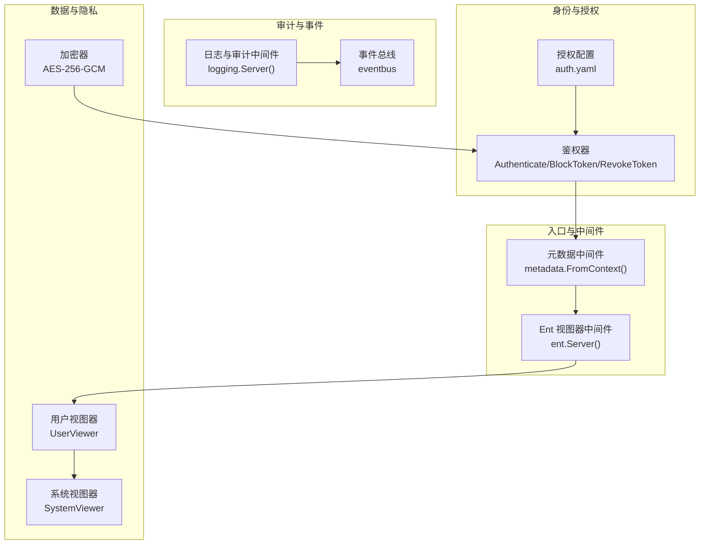
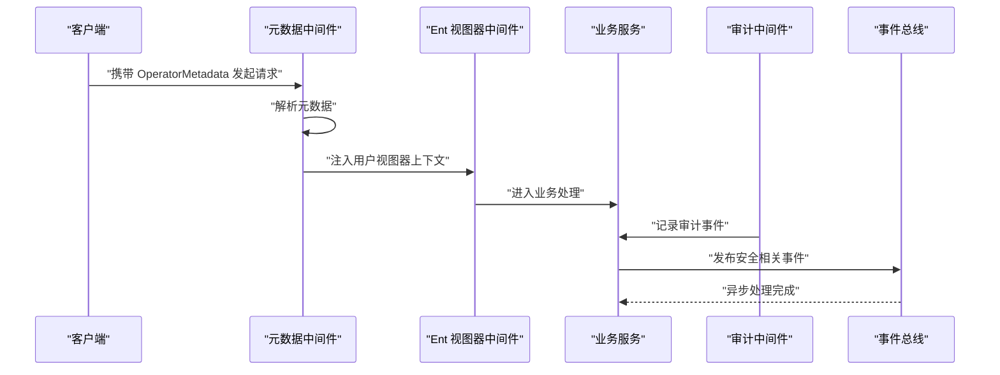
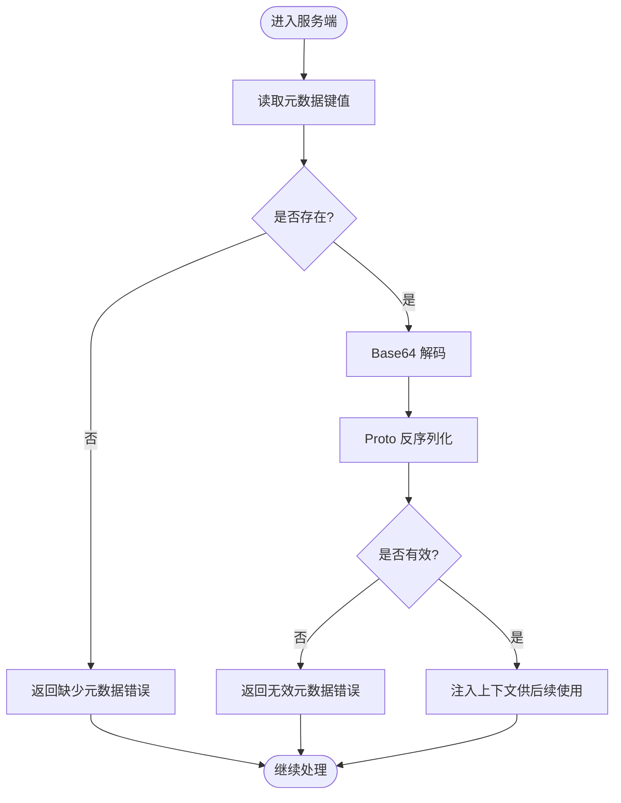
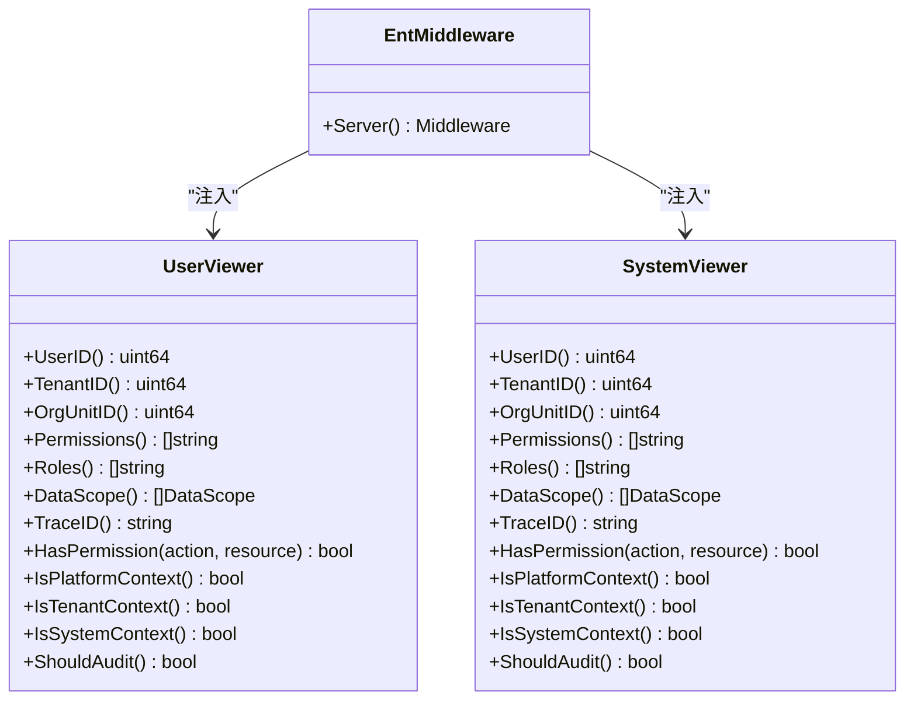
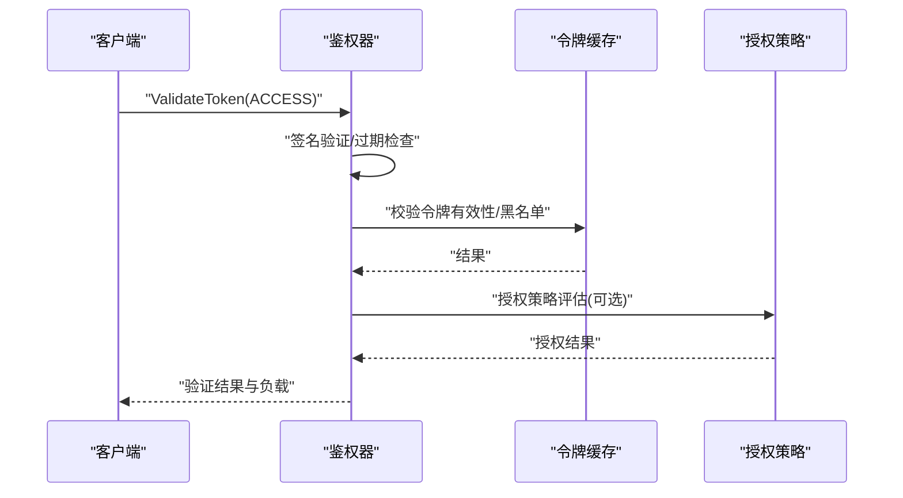
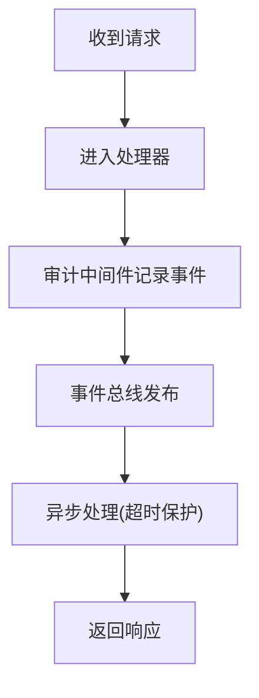
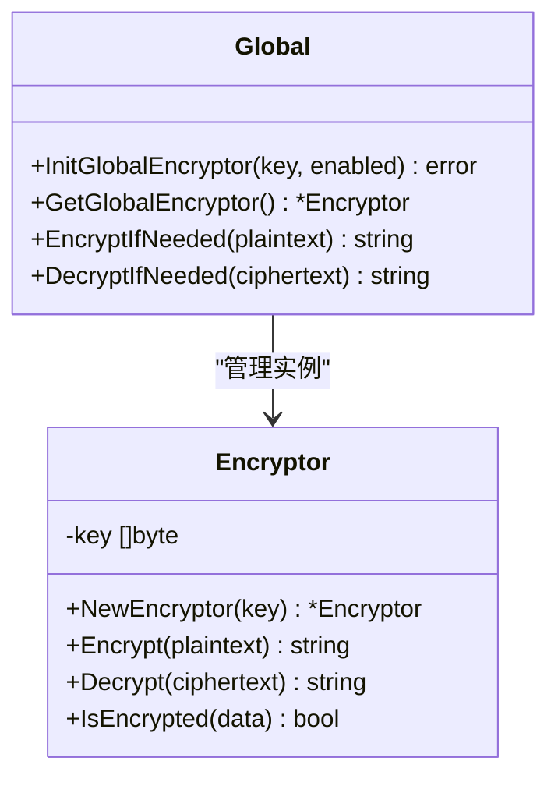
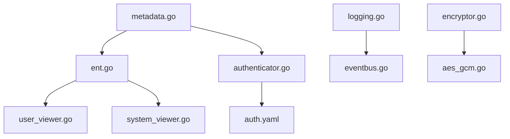

# 元数据安全

<cite>
**本文引用的文件**
- [metadata.go](file://backend/pkg/metadata/metadata.go)
- [errors.go](file://backend/pkg/metadata/errors.go)
- [system_viewer.go](file://backend/pkg/entgo/viewer/system_viewer.go)
- [user_viewer.go](file://backend/pkg/entgo/viewer/user_viewer.go)
- [ent.go](file://backend/pkg/middleware/ent/ent.go)
- [authenticator.go](file://backend/app/admin/service/internal/data/authenticator.go)
- [auth.yaml](file://backend/app/admin/service/configs/auth.yaml)
- [logging.go](file://backend/pkg/middleware/logging/logging.go)
- [eventbus.go](file://backend/pkg/eventbus/eventbus.go)
- [encryptor.go](file://backend/pkg/crypto/encryptor.go)
- [aes_gcm.go](file://backend/pkg/crypto/aes_gcm.go)
- [permission.go](file://backend/pkg/constants/permission.go)
- [main.go](file://backend/app/admin/service/cmd/server/main.go)
</cite>

## 目录
1. [引言](#引言)
2. [项目结构](#项目结构)
3. [核心组件](#核心组件)
4. [架构总览](#架构总览)
5. [详细组件分析](#详细组件分析)
6. [依赖分析](#依赖分析)
7. [性能考虑](#性能考虑)
8. [故障排查指南](#故障排查指南)
9. [结论](#结论)
10. [附录：配置与最佳实践](#附录配置与最佳实践)

## 引言
本文件聚焦于系统中“元数据”的安全设计与实现，涵盖元数据在系统中的作用与安全重要性、访问控制机制（敏感信息过滤、数据脱敏、隐私保护）、Ent ORM 的安全查询模式（数据访问审计、查询权限控制、批量操作安全）、错误处理的安全策略（错误信息脱敏、敏感信息隐藏、安全日志记录），以及数据泄露防护与合规性要求的实现方案。通过对仓库中元数据传递、鉴权与授权、审计与事件总线、加密存储等模块的深入分析，形成一套可落地的元数据安全技术文档。

## 项目结构
后端采用分层与按功能域划分的组织方式：
- 元数据与上下文：通过 Kratos metadata 在 gRPC/HTTP 层传递操作者元数据，供后续中间件与服务使用。
- 视图器（Viewer）：封装当前调用者的身份、租户、组织单元、数据范围、追踪ID等，作为 Ent 查询的上下文依据。
- 中间件：在进入业务逻辑前，从元数据构建 Viewer 并注入到上下文，统一进行权限与审计判定。
- 鉴权与授权：基于 JWT 的令牌校验、缓存校验、封禁与黑名单控制；授权策略配置支持多种后端。
- 审计与事件：登录、API 调用、操作等审计日志中间件；事件总线异步处理安全相关事件。
- 加密与隐私：全局可开关的 AES-256-GCM 加密器，用于敏感字段的存储与传输一致性处理。
- 权限常量：受保护的系统权限代码集合，防止误删与越权。

图表来源
- [metadata.go:30-47](file://backend/pkg/metadata/metadata.go#L30-L47)
- [ent.go:14-41](file://backend/pkg/middleware/ent/ent.go#L14-L41)
- [authenticator.go:80-171](file://backend/app/admin/service/internal/data/authenticator.go#L80-L171)
- [auth.yaml:1-37](file://backend/app/admin/service/configs/auth.yaml#L1-L37)
- [logging.go:14-51](file://backend/pkg/middleware/logging/logging.go#L14-L51)
- [eventbus.go:106-152](file://backend/pkg/eventbus/eventbus.go#L106-L152)
- [user_viewer.go:20-35](file://backend/pkg/entgo/viewer/user_viewer.go#L20-L35)
- [system_viewer.go:13-19](file://backend/pkg/entgo/viewer/system_viewer.go#L13-L19)
- [aes_gcm.go:26-44](file://backend/pkg/crypto/aes_gcm.go#L26-L44)

章节来源
- [main.go:59-76](file://backend/app/admin/service/cmd/server/main.go#L59-L76)
- [authenticator.go:30-58](file://backend/app/admin/service/internal/data/authenticator.go#L30-L58)
- [auth.yaml:1-37](file://backend/app/admin/service/configs/auth.yaml#L1-L37)

## 核心组件
- 元数据传递与解析：通过 Kratos metadata 在客户端与服务端之间传递 OperatorMetadata，并在服务端解析还原为结构化对象，用于后续鉴权与审计。
- 视图器（Viewer）：封装当前调用者的身份维度（用户ID、租户ID、组织单元ID、数据范围、追踪ID），作为 Ent 查询的上下文依据，支撑最小权限与数据隔离。
- 鉴权与授权：基于 JWT 的令牌验证、过期检查、缓存校验、封禁与黑名单控制；授权策略可配置为多种后端（CASBIN、OPA、Zanzibar 等）。
- 审计与事件：统一的日志与审计中间件，记录登录、API 调用、操作等事件；事件总线异步处理安全相关事件，降低主流程阻塞。
- 加密与隐私：全局可开关的 AES-256-GCM 加密器，支持对敏感字段进行透明加解密，避免明文泄露与误打印。
- 权限常量：受保护的系统权限代码集合，防止误删与越权。

章节来源
- [metadata.go:22-69](file://backend/pkg/metadata/metadata.go#L22-L69)
- [user_viewer.go:9-117](file://backend/pkg/entgo/viewer/user_viewer.go#L9-L117)
- [system_viewer.go:9-79](file://backend/pkg/entgo/viewer/system_viewer.go#L9-L79)
- [authenticator.go:80-171](file://backend/app/admin/service/internal/data/authenticator.go#L80-L171)
- [logging.go:14-51](file://backend/pkg/middleware/logging/logging.go#L14-L51)
- [eventbus.go:106-152](file://backend/pkg/eventbus/eventbus.go#L106-L152)
- [encryptor.go:12-54](file://backend/pkg/crypto/encryptor.go#L12-L54)
- [aes_gcm.go:26-135](file://backend/pkg/crypto/aes_gcm.go#L26-L135)
- [permission.go:31-39](file://backend/pkg/constants/permission.go#L31-L39)

## 架构总览
下图展示元数据在系统中的流转路径：客户端携带元数据发起请求，服务端中间件解析元数据并注入视图器上下文，随后进入业务逻辑；同时，审计中间件与事件总线协同记录与处理安全相关事件；鉴权器负责令牌验证与授权策略执行；加密器在必要时对敏感数据进行加解密。

图表来源
- [metadata.go:30-47](file://backend/pkg/metadata/metadata.go#L30-L47)
- [ent.go:14-41](file://backend/pkg/middleware/ent/ent.go#L14-L41)
- [logging.go:31-50](file://backend/pkg/middleware/logging/logging.go#L31-L50)
- [eventbus.go:106-152](file://backend/pkg/eventbus/eventbus.go#L106-L152)

## 详细组件分析

### 元数据传递与解析
- 元数据键名约定：使用全局键名承载 OperatorMetadata，序列化采用 proto 编解码，再以 Base64 传输，确保跨语言与跨协议的稳定性。
- 解析流程：服务端从上下文读取元数据，若缺失或格式不合法则返回明确的未授权错误，避免静默失败。
- 安全要点：仅在受信边界内传递元数据；对不可信输入进行严格校验与长度限制；避免在日志中输出原始元数据内容。

图表来源
- [metadata.go:30-47](file://backend/pkg/metadata/metadata.go#L30-L47)
- [errors.go:9-13](file://backend/pkg/metadata/errors.go#L9-L13)

章节来源
- [metadata.go:15-69](file://backend/pkg/metadata/metadata.go#L15-L69)
- [errors.go:5-13](file://backend/pkg/metadata/errors.go#L5-L13)

### 视图器（Viewer）与数据范围
- 用户视图器：封装用户ID、租户ID、组织单元ID、数据范围、追踪ID等，支持根据数据范围生成 SQL 过滤条件，实现最小权限与数据隔离。
- 系统视图器：用于系统级后台任务或平台管理场景，通常不启用审计与权限校验。
- 中间件集成：Ent 视图器中间件从元数据提取信息，构造用户视图器并注入上下文，供 Ent 查询钩子与业务逻辑使用。

图表来源
- [user_viewer.go:9-117](file://backend/pkg/entgo/viewer/user_viewer.go#L9-L117)
- [system_viewer.go:9-79](file://backend/pkg/entgo/viewer/system_viewer.go#L9-L79)
- [ent.go:14-41](file://backend/pkg/middleware/ent/ent.go#L14-L41)

章节来源
- [user_viewer.go:20-117](file://backend/pkg/entgo/viewer/user_viewer.go#L20-L117)
- [system_viewer.go:13-79](file://backend/pkg/entgo/viewer/system_viewer.go#L13-L79)
- [ent.go:14-41](file://backend/pkg/middleware/ent/ent.go#L14-L41)

### 鉴权与授权
- 令牌验证：支持访问令牌与刷新令牌两类，分别进行签名验证、过期检查、缓存有效性与黑名单校验。
- 令牌生命周期：访问令牌短周期、刷新令牌长周期；支持撤销、封禁与按 JTI 精确控制。
- 授权策略：授权类型可配置为多种后端（CASBIN、OPA、Zanzibar 等），默认为 noop，便于按需启用。

图表来源
- [authenticator.go:80-171](file://backend/app/admin/service/internal/data/authenticator.go#L80-L171)
- [authenticator.go:217-252](file://backend/app/admin/service/internal/data/authenticator.go#L217-L252)
- [authenticator.go:385-397](file://backend/app/admin/service/internal/data/authenticator.go#L385-L397)
- [auth.yaml:18-37](file://backend/app/admin/service/configs/auth.yaml#L18-L37)

章节来源
- [authenticator.go:30-58](file://backend/app/admin/service/internal/data/authenticator.go#L30-L58)
- [authenticator.go:80-171](file://backend/app/admin/service/internal/data/authenticator.go#L80-L171)
- [authenticator.go:217-252](file://backend/app/admin/service/internal/data/authenticator.go#L217-L252)
- [authenticator.go:385-397](file://backend/app/admin/service/internal/data/authenticator.go#L385-L397)
- [auth.yaml:18-37](file://backend/app/admin/service/configs/auth.yaml#L18-L37)

### 审计与事件总线
- 日志中间件：在 HTTP 传输层捕获登录与 API 调用事件，计算耗时并写入审计日志。
- 事件总线：支持同步与一次性订阅、异步发布，内置超时与错误容忍，适合发布安全事件（如封禁、撤销）。

图表来源
- [logging.go:31-50](file://backend/pkg/middleware/logging/logging.go#L31-L50)
- [eventbus.go:106-152](file://backend/pkg/eventbus/eventbus.go#L106-L152)
- [eventbus.go:154-167](file://backend/pkg/eventbus/eventbus.go#L154-L167)

章节来源
- [logging.go:14-51](file://backend/pkg/middleware/logging/logging.go#L14-L51)
- [eventbus.go:106-167](file://backend/pkg/eventbus/eventbus.go#L106-L167)

### 加密与隐私保护
- 全局加密器：支持按配置启用或禁用，禁用时提供空操作实现，保证行为一致。
- 加密算法：AES-256-GCM，自动处理随机 Nonce 与认证标签，输出带前缀的 Base64 字符串。
- 使用建议：对数据库中存储的敏感字段进行透明加解密；在日志与审计中避免直接输出密文或明文。

图表来源
- [aes_gcm.go:26-135](file://backend/pkg/crypto/aes_gcm.go#L26-L135)
- [encryptor.go:12-54](file://backend/pkg/crypto/encryptor.go#L12-L54)

章节来源
- [aes_gcm.go:15-135](file://backend/pkg/crypto/aes_gcm.go#L15-L135)
- [encryptor.go:12-54](file://backend/pkg/crypto/encryptor.go#L12-L54)

### 权限常量与受保护权限
- 系统权限代码前缀与模块标识，定义了平台管理员、租户管理、审计日志等关键权限。
- 受保护权限列表：禁止删除的关键权限代码集合，防止因误操作导致系统权限被移除。

章节来源
- [permission.go:3-39](file://backend/pkg/constants/permission.go#L3-L39)

## 依赖分析
- 元数据中间件依赖 Kratos metadata 与 proto 编解码，确保跨语言与跨协议的元数据一致性。
- Ent 视图器中间件依赖元数据解析结果与 OpenTelemetry 的 TraceID，将身份与审计上下文注入 Ent 查询链路。
- 鉴权器依赖 JWT 库与令牌缓存，实现令牌验证、撤销与封禁控制。
- 审计中间件依赖 HTTP 传输层与事件总线，实现登录与 API 调用的审计记录。
- 加密器独立于业务逻辑，通过全局初始化与条件启用，保证在不同环境下的兼容性。

图表来源
- [metadata.go:30-47](file://backend/pkg/metadata/metadata.go#L30-L47)
- [ent.go:14-41](file://backend/pkg/middleware/ent/ent.go#L14-L41)
- [user_viewer.go:20-35](file://backend/pkg/entgo/viewer/user_viewer.go#L20-L35)
- [system_viewer.go:13-19](file://backend/pkg/entgo/viewer/system_viewer.go#L13-L19)
- [authenticator.go:80-171](file://backend/app/admin/service/internal/data/authenticator.go#L80-L171)
- [auth.yaml:1-37](file://backend/app/admin/service/configs/auth.yaml#L1-L37)
- [logging.go:31-50](file://backend/pkg/middleware/logging/logging.go#L31-L50)
- [eventbus.go:106-152](file://backend/pkg/eventbus/eventbus.go#L106-L152)
- [encryptor.go:12-54](file://backend/pkg/crypto/encryptor.go#L12-L54)
- [aes_gcm.go:26-44](file://backend/pkg/crypto/aes_gcm.go#L26-L44)

章节来源
- [metadata.go:22-69](file://backend/pkg/metadata/metadata.go#L22-L69)
- [ent.go:14-41](file://backend/pkg/middleware/ent/ent.go#L14-L41)
- [authenticator.go:30-58](file://backend/app/admin/service/internal/data/authenticator.go#L30-L58)
- [logging.go:14-51](file://backend/pkg/middleware/logging/logging.go#L14-L51)
- [eventbus.go:106-167](file://backend/pkg/eventbus/eventbus.go#L106-L167)
- [encryptor.go:12-54](file://backend/pkg/crypto/encryptor.go#L12-L54)
- [aes_gcm.go:15-135](file://backend/pkg/crypto/aes_gcm.go#L15-L135)
- [permission.go:31-39](file://backend/pkg/constants/permission.go#L31-L39)

## 性能考虑
- 中间件链路：元数据解析与视图器注入开销极低，建议在所有入口中间件中保留，以确保一致的上下文。
- 审计与事件：异步事件发布具备超时保护，避免阻塞主请求；建议合理设置事件处理器数量与队列容量。
- 加密成本：AES-256-GCM 的 CPU 开销与内存分配可控，建议对热点字段进行批量加解密优化。
- 缓存命中：令牌验证与黑名单检查依赖缓存，建议使用高性能缓存并设置合理的过期策略。

## 故障排查指南
- 元数据缺失或无效：检查客户端是否正确设置元数据头，服务端解析错误码与日志定位问题。
- 令牌验证失败：确认 JWT 密钥、签名方法与过期时间配置；检查缓存状态与黑名单。
- 审计日志异常：核对审计中间件配置与事件总线订阅情况；关注异步发布错误日志。
- 加密异常：确认加密器初始化状态与密钥长度；检查密文格式与前缀。

章节来源
- [errors.go:9-13](file://backend/pkg/metadata/errors.go#L9-L13)
- [authenticator.go:80-171](file://backend/app/admin/service/internal/data/authenticator.go#L80-L171)
- [logging.go:31-50](file://backend/pkg/middleware/logging/logging.go#L31-L50)
- [eventbus.go:154-167](file://backend/pkg/eventbus/eventbus.go#L154-L167)
- [aes_gcm.go:80-130](file://backend/pkg/crypto/aes_gcm.go#L80-L130)

## 结论
本系统通过元数据传递、视图器上下文、鉴权与授权、审计与事件总线、加密与隐私保护等多层机制，实现了元数据安全的闭环设计。建议在生产环境中启用严格的授权策略、完善的审计与事件处理、以及透明的加密与脱敏策略，确保数据在传输与存储过程中的机密性与完整性。

## 附录：配置与最佳实践
- 元数据安全
  - 仅在可信网络内传递元数据，避免在日志中输出原始元数据。
  - 对元数据进行 Base64 编码与 proto 序列化，确保跨语言一致性。
- 访问控制与权限
  - 启用受保护权限列表，禁止删除关键系统权限。
  - 授权策略优先使用 CASBIN/OPA/Zanzibar 等成熟方案，结合数据范围最小化。
- 数据脱敏与隐私保护
  - 对数据库中的敏感字段启用全局加密器，统一加解密策略。
  - 在日志与审计中避免直接输出敏感字段明文或密文。
- 安全审计与事件
  - 所有登录与 API 调用均应记录审计日志，异步事件总线处理安全事件。
  - 为事件处理器设置超时与重试策略，确保高可用。
- 错误处理与日志
  - 对外错误响应不暴露内部细节，仅返回通用错误码。
  - 内部日志记录必要的上下文信息（TraceID），但不包含敏感数据。
- 配置示例
  - 鉴权配置示例参考：[auth.yaml:1-37](file://backend/app/admin/service/configs/auth.yaml#L1-L37)
  - 令牌验证与撤销接口参考：[authenticator.go:80-171](file://backend/app/admin/service/internal/data/authenticator.go#L80-L171)