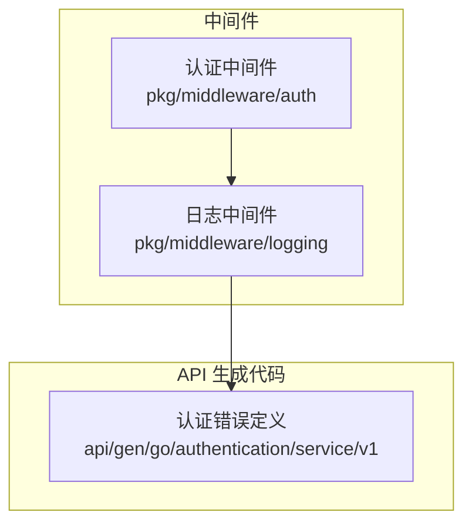
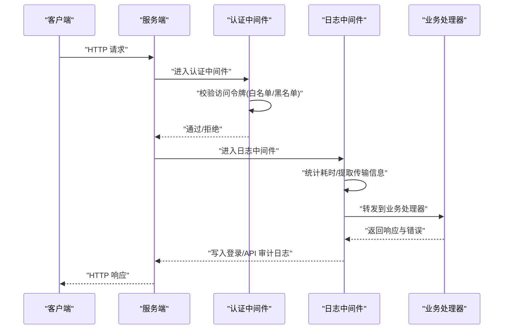
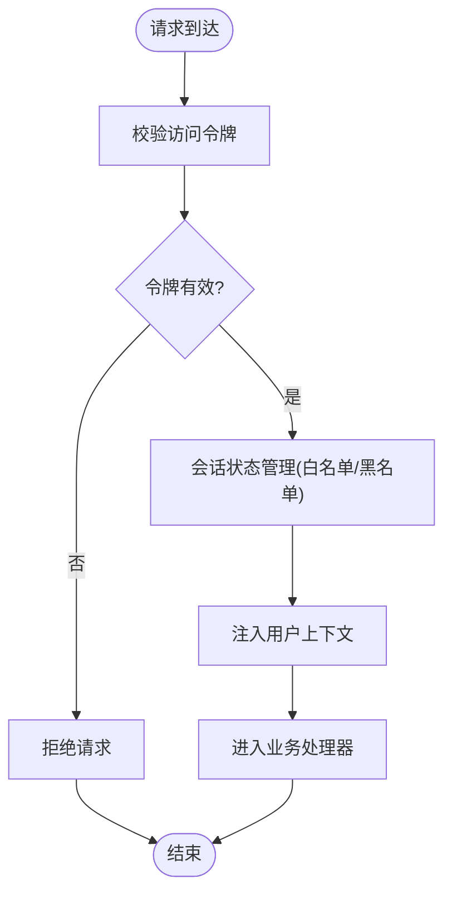
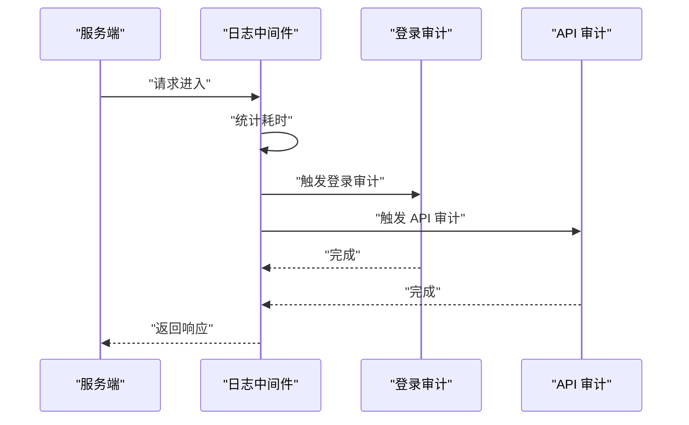
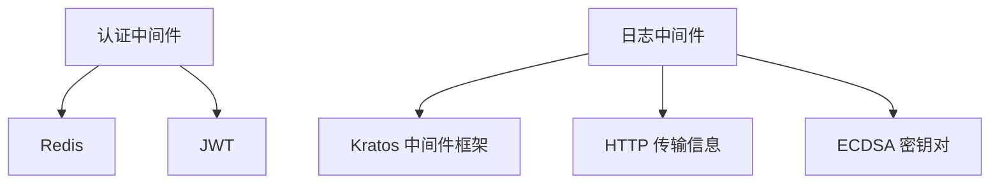

# 安全中间件

<cite>
**本文引用的文件**
- [认证权鉴中间件说明](file://backend/pkg/middleware/auth/README.md)
- [日志中间件入口](file://backend/pkg/middleware/logging/logging.go)
- [认证错误常量与工具](file://backend/api/gen/go/authentication/service/v1/authentication_error_errors.pb.go)
</cite>

## 目录
1. [简介](#简介)
2. [项目结构](#项目结构)
3. [核心组件](#核心组件)
4. [架构总览](#架构总览)
5. [详细组件分析](#详细组件分析)
6. [依赖分析](#依赖分析)
7. [性能考虑](#性能考虑)
8. [故障排查指南](#故障排查指南)
9. [结论](#结论)
10. [附录](#附录)

## 简介
本文件面向后端安全中间件的综合技术文档，聚焦以下主题：
- 认证中间件：基于 JWT 的访问令牌校验与会话管理策略（白名单/黑名单）
- 日志中间件：登录审计、API 调用审计与操作审计
- 安全特性：CORS 处理、跨站请求防护、请求频率限制等
- 中间件组合使用最佳实践与性能优化
- 安全配置示例与常见安全问题的防护措施

说明：当前仓库中已提供的认证与日志中间件代码片段展示了核心能力与调用流程；关于 CORS、跨站防护与频率限制的具体实现细节需结合服务端框架与路由层配置进行补充。

## 项目结构
安全中间件主要分布在以下位置：
- 认证中间件：位于 pkg/middleware/auth，包含使用说明与启用方式
- 日志中间件：位于 pkg/middleware/logging，提供登录与 API 审计日志的统一入口
- 错误码与业务语义：位于 api/gen/go/authentication/service/v1 下的错误定义文件

**图表来源**
- [认证权鉴中间件说明:1-16](file://backend/pkg/middleware/auth/README.md#L1-L16)
- [日志中间件入口:1-52](file://backend/pkg/middleware/logging/logging.go#L1-L52)
- [认证错误常量与工具:476-525](file://backend/api/gen/go/authentication/service/v1/authentication_error_errors.pb.go#L476-L525)

**章节来源**
- [认证权鉴中间件说明:1-16](file://backend/pkg/middleware/auth/README.md#L1-L16)
- [日志中间件入口:1-52](file://backend/pkg/middleware/logging/logging.go#L1-L52)
- [认证错误常量与工具:476-525](file://backend/api/gen/go/authentication/service/v1/authentication_error_errors.pb.go#L476-L525)

## 核心组件
- 认证中间件
  - 功能要点：通过 Redis 校验访问令牌有效性，支持白名单与黑名单两种模式；默认关闭令牌校验，可通过选项启用
  - 关键点：白名单机制可强制撤销用户登录态，提升安全性
- 日志中间件
  - 功能要点：在服务端拦截请求，统计耗时，按 HTTP 传输信息分别触发登录审计与 API 审计
  - 关键点：内置 ECDSA 密钥对生成逻辑，保障审计数据签名完整性

**章节来源**
- [认证权鉴中间件说明:7-16](file://backend/pkg/middleware/auth/README.md#L7-L16)
- [日志中间件入口:14-51](file://backend/pkg/middleware/logging/logging.go#L14-L51)

## 架构总览
下图展示服务端中间件在一次请求中的协作关系：认证中间件负责访问令牌校验与会话状态管理，日志中间件负责审计日志的采集与落库。

**图表来源**
- [日志中间件入口:31-50](file://backend/pkg/middleware/logging/logging.go#L31-L50)
- [认证权鉴中间件说明:7-16](file://backend/pkg/middleware/auth/README.md#L7-L16)

## 详细组件分析

### 认证中间件
- 实现原理
  - 访问令牌校验：登录成功后将 JWT Token 存入 Redis；后续请求携带 Token 时，从 Redis 校验其有效性，防止篡改与伪造
  - 会话管理策略
    - 白名单：默认启用，便于强制撤销用户登录态
    - 黑名单：可选启用，用于阻断特定 Token
- 配置选项
  - 启用访问令牌校验：WithAccessTokenChecker / WithAccessTokenCheckerFunc
  - 启用访问令牌阻断：WithAccessTokenBlocker / WithAccessTokenBlockerFunc
- 用户上下文注入
  - 在通过认证后，将用户标识与角色/权限等上下文信息注入到请求上下文中，供业务层使用

**图表来源**
- [认证权鉴中间件说明:7-16](file://backend/pkg/middleware/auth/README.md#L7-L16)

**章节来源**
- [认证权鉴中间件说明:7-16](file://backend/pkg/middleware/auth/README.md#L7-L16)

### 日志中间件
- 登录审计
  - 识别登录/登出操作，记录登录结果与失败原因
- API 审计
  - 记录 API 调用次数、成功率、耗时分布
- 操作审计
  - 结合业务操作类型，记录关键操作行为
- 安全审计
  - 内置 ECDSA 密钥对生成，用于审计数据签名，保障不可抵赖性

**图表来源**
- [日志中间件入口:31-50](file://backend/pkg/middleware/logging/logging.go#L31-L50)

**章节来源**
- [日志中间件入口:14-51](file://backend/pkg/middleware/logging/logging.go#L14-L51)

### 安全特性与防护
- CORS 处理
  - 在路由层或网关层设置允许的源、方法与头字段，避免跨域风险
- 跨站请求防护（CSRF）
  - 使用同源策略与安全头；对关键操作启用 CSRF Token 校验
- 请求频率限制（限流）
  - 在网关或路由层配置 IP/用户维度的速率限制，防止暴力破解与滥用
- Token 安全
  - 使用强随机数生成密钥，定期轮换；短有效期配合刷新机制；禁止在日志中明文输出 Token

说明：以上为通用安全实践建议，具体实现需结合服务端框架与部署环境进行配置。

## 依赖分析
- 认证中间件依赖
  - Redis：存储与校验访问令牌
  - JWT：生成与解析访问令牌
- 日志中间件依赖
  - Kratos 中间件框架：统一的中间件接口
  - HTTP 传输信息：提取请求路径、方法、状态码、IP 等
  - ECDSA 密钥对：审计数据签名

**图表来源**
- [认证权鉴中间件说明:7-16](file://backend/pkg/middleware/auth/README.md#L7-L16)
- [日志中间件入口:3-12](file://backend/pkg/middleware/logging/logging.go#L3-L12)

**章节来源**
- [认证权鉴中间件说明:7-16](file://backend/pkg/middleware/auth/README.md#L7-L16)
- [日志中间件入口:3-12](file://backend/pkg/middleware/logging/logging.go#L3-L12)

## 性能考虑
- 认证中间件
  - 将令牌校验前置，减少无效请求进入业务层
  - 使用连接池与超时控制访问 Redis，避免阻塞
- 日志中间件
  - 异步写入审计日志，降低对主链路的影响
  - 对高频接口进行采样记录，平衡审计完整性与性能
- 限流与熔断
  - 在网关层对登录接口与敏感 API 进行限流，防止攻击放大

## 故障排查指南
- 认证失败
  - 检查 Redis 是否可用、令牌是否过期或被撤销
  - 确认白名单/黑名单策略是否正确生效
- 审计日志异常
  - 核对 ECDSA 密钥对生成与加载逻辑
  - 检查日志中间件是否正确提取 HTTP 传输信息
- 错误码定位
  - 使用认证错误工具函数快速判断错误类型与状态码，辅助排障

**章节来源**
- [认证错误常量与工具:476-525](file://backend/api/gen/go/authentication/service/v1/authentication_error_errors.pb.go#L476-L525)

## 结论
本仓库的安全中间件以“认证 + 审计”为核心，通过 Redis 校验与白/黑名单机制强化访问控制，借助日志中间件实现登录与 API 行为的完整审计。结合 CORS、CSRF 与限流等通用安全措施，可构建稳健的后端安全体系。建议在生产环境中启用令牌校验、异步审计与限流策略，并定期轮换密钥与审查日志。

## 附录
- 中间件组合使用建议
  - 先认证后审计：认证中间件在前，日志中间件在后
  - 分层限流：网关层做粗粒度限流，业务层做细粒度限流
  - 审计采样：对高并发接口进行采样，降低开销
- 安全配置示例（概念性）
  - CORS：仅允许受信域名，严格限定方法与头
  - CSRF：关键操作要求携带一次性 Token
  - 限流：登录接口每 IP 每分钟不超过 N 次，超过则临时封禁
  - Token：短有效期、定期刷新、禁止明文日志输出