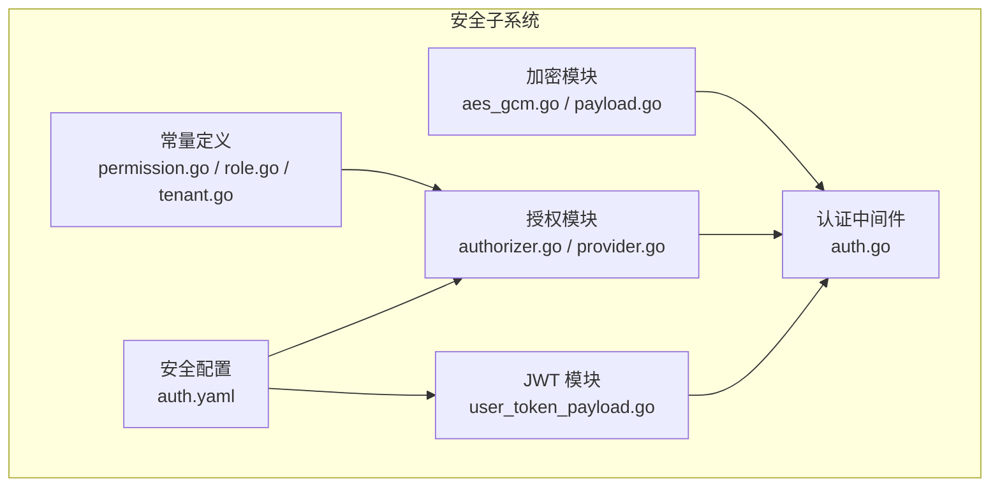
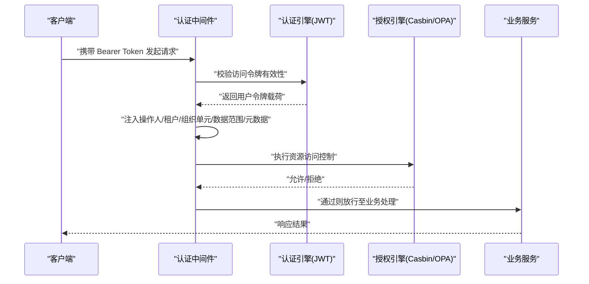
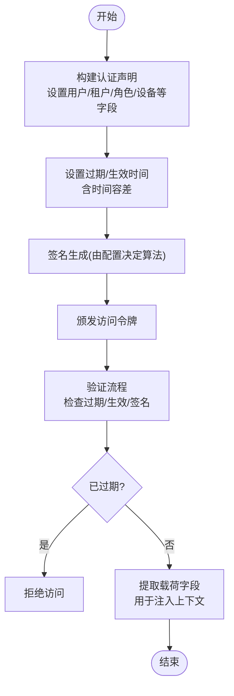
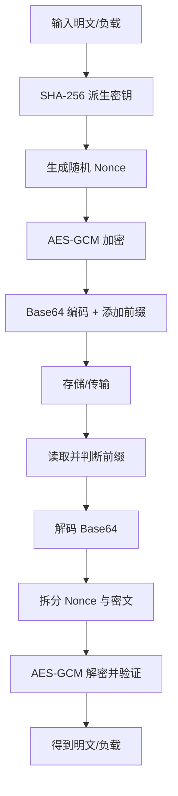
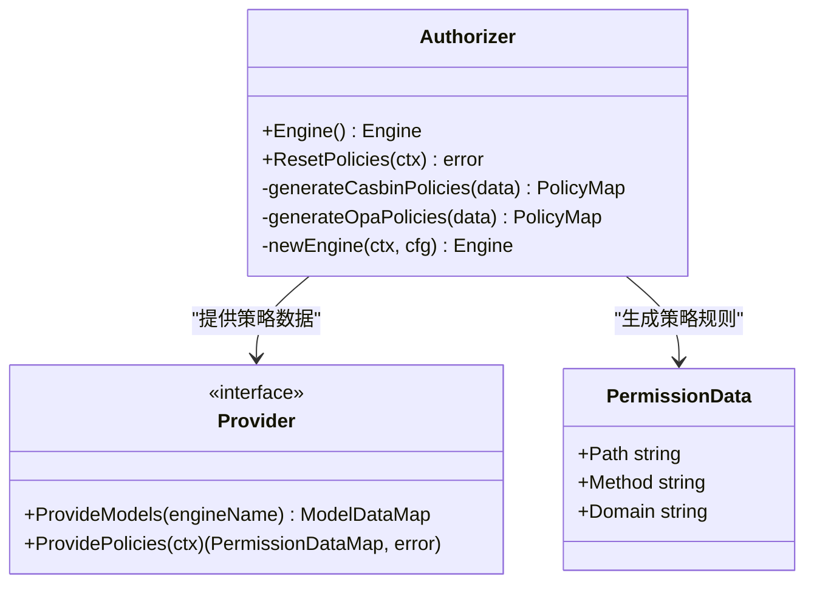
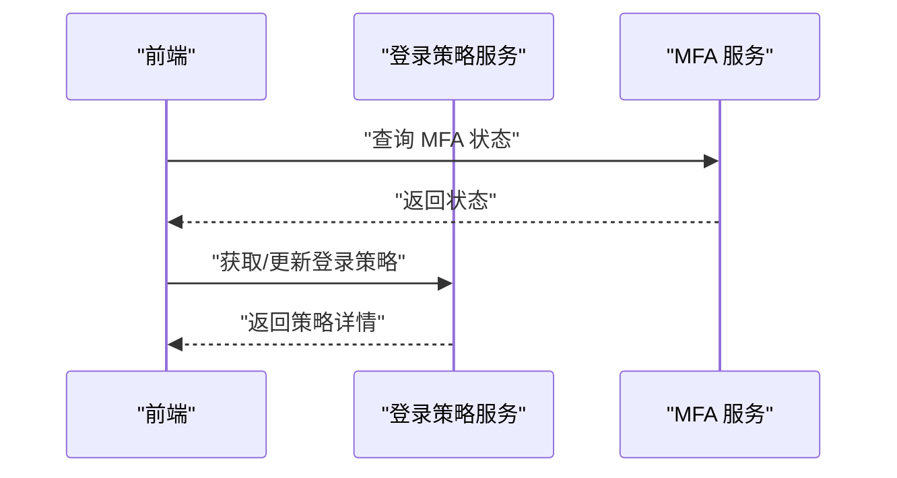
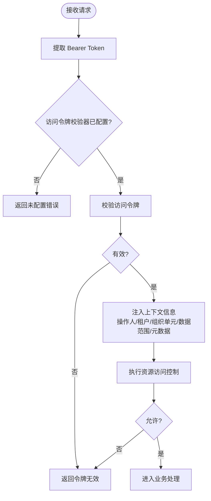
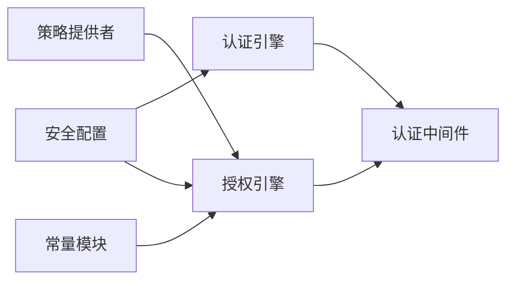

# 安全实现

<cite>
**本文引用的文件**
- [backend/pkg/crypto/aes_gcm.go](file://backend/pkg/crypto/aes_gcm.go)
- [backend/pkg/crypto/payload.go](file://backend/pkg/crypto/payload.go)
- [backend/pkg/jwt/user_token_payload.go](file://backend/pkg/jwt/user_token_payload.go)
- [backend/pkg/authorizer/authorizer.go](file://backend/pkg/authorizer/authorizer.go)
- [backend/pkg/authorizer/provider.go](file://backend/pkg/authorizer/provider.go)
- [backend/pkg/constants/permission.go](file://backend/pkg/constants/permission.go)
- [backend/pkg/constants/role.go](file://backend/pkg/constants/role.go)
- [backend/pkg/constants/tenant.go](file://backend/pkg/constants/tenant.go)
- [backend/pkg/middleware/auth/auth.go](file://backend/pkg/middleware/auth/auth.go)
- [backend/app/admin/service/configs/auth.yaml](file://backend/app/admin/service/configs/auth.yaml)
</cite>

## 目录
1. [引言](#引言)
2. [项目结构](#项目结构)
3. [核心组件](#核心组件)
4. [架构总览](#架构总览)
5. [详细组件分析](#详细组件分析)
6. [依赖分析](#依赖分析)
7. [性能考虑](#性能考虑)
8. [故障排查指南](#故障排查指南)
9. [结论](#结论)
10. [附录](#附录)

## 引言
本文件面向后端安全实现，系统性梳理并解释以下能力与机制：
- JWT Token 的生成、验证与管理
- 密码加密存储方案（AES-GCM）
- RBAC 权限控制（角色、权限、资源访问）
- 多因素认证（MFA）与登录策略
- 会话安全与中间件集成
- 安全开发最佳实践（输入校验、SQL 注入防护、XSS 防护）
- 安全配置示例与漏洞防护措施

## 项目结构
围绕安全主题的关键目录与文件如下：
- 加密与密钥派生：backend/pkg/crypto
- JWT 载荷与声明：backend/pkg/jwt
- 授权引擎与策略：backend/pkg/authorizer
- 权限/角色常量：backend/pkg/constants
- 认证中间件：backend/pkg/middleware/auth
- 安全配置：backend/app/admin/service/configs/auth.yaml

图表来源
- [backend/pkg/crypto/aes_gcm.go:1-154](file://backend/pkg/crypto/aes_gcm.go#L1-L154)
- [backend/pkg/crypto/payload.go:1-101](file://backend/pkg/crypto/payload.go#L1-L101)
- [backend/pkg/jwt/user_token_payload.go:1-279](file://backend/pkg/jwt/user_token_payload.go#L1-L279)
- [backend/pkg/authorizer/authorizer.go:1-241](file://backend/pkg/authorizer/authorizer.go#L1-L241)
- [backend/pkg/authorizer/provider.go:1-28](file://backend/pkg/authorizer/provider.go#L1-L28)
- [backend/pkg/constants/permission.go:1-39](file://backend/pkg/constants/permission.go#L1-L39)
- [backend/pkg/constants/role.go:1-49](file://backend/pkg/constants/role.go#L1-L49)
- [backend/pkg/constants/tenant.go:1-25](file://backend/pkg/constants/tenant.go#L1-L25)
- [backend/pkg/middleware/auth/auth.go:1-122](file://backend/pkg/middleware/auth/auth.go#L1-L122)
- [backend/app/admin/service/configs/auth.yaml:1-37](file://backend/app/admin/service/configs/auth.yaml#L1-L37)

章节来源
- [backend/pkg/crypto/aes_gcm.go:1-154](file://backend/pkg/crypto/aes_gcm.go#L1-L154)
- [backend/pkg/crypto/payload.go:1-101](file://backend/pkg/crypto/payload.go#L1-L101)
- [backend/pkg/jwt/user_token_payload.go:1-279](file://backend/pkg/jwt/user_token_payload.go#L1-L279)
- [backend/pkg/authorizer/authorizer.go:1-241](file://backend/pkg/authorizer/authorizer.go#L1-L241)
- [backend/pkg/authorizer/provider.go:1-28](file://backend/pkg/authorizer/provider.go#L1-L28)
- [backend/pkg/constants/permission.go:1-39](file://backend/pkg/constants/permission.go#L1-L39)
- [backend/pkg/constants/role.go:1-49](file://backend/pkg/constants/role.go#L1-L49)
- [backend/pkg/constants/tenant.go:1-25](file://backend/pkg/constants/tenant.go#L1-L25)
- [backend/pkg/middleware/auth/auth.go:1-122](file://backend/pkg/middleware/auth/auth.go#L1-L122)
- [backend/app/admin/service/configs/auth.yaml:1-37](file://backend/app/admin/service/configs/auth.yaml#L1-L37)

## 核心组件
- 加密与密钥派生：基于 AES-256-GCM 的对称加密，支持密钥哈希派生、随机 Nonce、Base64 编码封装、带前缀识别。
- JWT 令牌：标准化声明字段（用户、租户、设备、客户端、角色、数据范围），默认过期与刷新策略，时间容差处理。
- 授权引擎：支持 Casbin、OPA、Zanzibar（预留）、Noop，默认加载策略并注入到中间件。
- 中间件：统一接入认证与鉴权，注入操作人、租户、组织单元、数据范围、元数据，并进行资源访问控制。
- 常量：系统权限前缀、受保护权限集合、角色前缀与模板规则、多租户关系类型。

章节来源
- [backend/pkg/crypto/aes_gcm.go:15-154](file://backend/pkg/crypto/aes_gcm.go#L15-L154)
- [backend/pkg/jwt/user_token_payload.go:17-100](file://backend/pkg/jwt/user_token_payload.go#L17-L100)
- [backend/pkg/authorizer/authorizer.go:18-241](file://backend/pkg/authorizer/authorizer.go#L18-L241)
- [backend/pkg/middleware/auth/auth.go:23-122](file://backend/pkg/middleware/auth/auth.go#L23-L122)
- [backend/pkg/constants/permission.go:3-39](file://backend/pkg/constants/permission.go#L3-L39)
- [backend/pkg/constants/role.go:3-49](file://backend/pkg/constants/role.go#L3-L49)
- [backend/pkg/constants/tenant.go:3-25](file://backend/pkg/constants/tenant.go#L3-L25)

## 架构总览
下图展示安全相关模块在请求生命周期中的交互：

图表来源
- [backend/pkg/middleware/auth/auth.go:38-121](file://backend/pkg/middleware/auth/auth.go#L38-L121)
- [backend/pkg/jwt/user_token_payload.go:39-100](file://backend/pkg/jwt/user_token_payload.go#L39-L100)
- [backend/pkg/authorizer/authorizer.go:58-109](file://backend/pkg/authorizer/authorizer.go#L58-L109)

## 详细组件分析

### JWT 令牌生成、验证与管理
- 令牌载荷：包含用户名、用户 ID、租户 ID、组织单元 ID、角色码、客户端 ID、设备 ID、数据范围等。
- 声明构建：将自定义字段映射到标准 JWT 声明键，支持 JTI、签发时间、过期时间、生效时间等。
- 过期与生效：内置时间容差，避免网络或服务器时间偏差导致误判。
- 默认策略：访问令牌默认有效期与刷新令牌有效期，便于会话轮换与安全回收。

图表来源
- [backend/pkg/jwt/user_token_payload.go:39-100](file://backend/pkg/jwt/user_token_payload.go#L39-L100)
- [backend/pkg/jwt/user_token_payload.go:248-279](file://backend/pkg/jwt/user_token_payload.go#L248-L279)
- [backend/app/admin/service/configs/auth.yaml:4-6](file://backend/app/admin/service/configs/auth.yaml#L4-L6)

章节来源
- [backend/pkg/jwt/user_token_payload.go:17-100](file://backend/pkg/jwt/user_token_payload.go#L17-L100)
- [backend/pkg/jwt/user_token_payload.go:248-279](file://backend/pkg/jwt/user_token_payload.go#L248-L279)
- [backend/app/admin/service/configs/auth.yaml:4-6](file://backend/app/admin/service/configs/auth.yaml#L4-L6)

### 密码加密存储方案（AES-GCM）
- 密钥派生：任意长度密钥经 SHA-256 派生为 32 字节，确保 AES-256 兼容。
- 加密过程：随机 Nonce，GCM 模式密封，输出 Base64 编码并带固定前缀，便于识别。
- 解密过程：校验前缀、解码、拆分 Nonce 与密文、GCM 开启并验证认证标签。
- 任务负载加密：对任务负载整体 JSON 序列化后加密，保留路由所需字段，避免明文泄露。

图表来源
- [backend/pkg/crypto/aes_gcm.go:33-78](file://backend/pkg/crypto/aes_gcm.go#L33-L78)
- [backend/pkg/crypto/aes_gcm.go:82-130](file://backend/pkg/crypto/aes_gcm.go#L82-L130)
- [backend/pkg/crypto/payload.go:17-45](file://backend/pkg/crypto/payload.go#L17-L45)
- [backend/pkg/crypto/payload.go:49-76](file://backend/pkg/crypto/payload.go#L49-L76)

章节来源
- [backend/pkg/crypto/aes_gcm.go:15-154](file://backend/pkg/crypto/aes_gcm.go#L15-L154)
- [backend/pkg/crypto/payload.go:1-101](file://backend/pkg/crypto/payload.go#L1-L101)

### RBAC 权限控制（角色、权限、资源访问）
- 角色与权限：角色代码前缀区分平台/租户/模板；系统权限具有受保护集合，禁止删除。
- 授权引擎：支持 Casbin（策略 p 级规则）、OPA（路径+方法模式）、Zanzibar（预留）、Noop。
- 策略加载：从 Provider 获取策略数据，按引擎类型生成策略集合并注入。
- 中间件集成：在认证通过后执行鉴权，结合用户角色与资源路径/方法进行匹配。

图表来源
- [backend/pkg/authorizer/authorizer.go:18-241](file://backend/pkg/authorizer/authorizer.go#L18-L241)
- [backend/pkg/authorizer/provider.go:5-27](file://backend/pkg/authorizer/provider.go#L5-L27)
- [backend/pkg/constants/role.go:3-49](file://backend/pkg/constants/role.go#L3-L49)
- [backend/pkg/constants/permission.go:3-39](file://backend/pkg/constants/permission.go#L3-L39)

章节来源
- [backend/pkg/authorizer/authorizer.go:58-109](file://backend/pkg/authorizer/authorizer.go#L58-L109)
- [backend/pkg/authorizer/authorizer.go:111-160](file://backend/pkg/authorizer/authorizer.go#L111-L160)
- [backend/pkg/authorizer/authorizer.go:162-241](file://backend/pkg/authorizer/authorizer.go#L162-L241)
- [backend/pkg/authorizer/provider.go:20-27](file://backend/pkg/authorizer/provider.go#L20-L27)
- [backend/pkg/constants/role.go:27-49](file://backend/pkg/constants/role.go#L27-L49)
- [backend/pkg/constants/permission.go:31-39](file://backend/pkg/constants/permission.go#L31-L39)

### 多因素认证与登录策略
- MFA 协议：后端提供 MFA 服务的协议定义与 RPC 接口，前端可查询 MFA 状态。
- 登录策略：登录策略实体具备值、原因、租户信息、操作人与时间戳等字段，支持增删改查。
- 实现建议：登录策略可与 JWT 刷新令牌配合，实现登录限制、风险控制与审计追踪。

图表来源
- [backend/api/gen/go/authentication/service/v1/mfa_grpc.pb.go:258-274](file://backend/api/gen/go/authentication/service/v1/mfa_grpc.pb.go#L258-L274)
- [backend/api/gen/go/authentication/service/v1/login_policy_grpc.pb.go:80-88](file://backend/api/gen/go/authentication/service/v1/login_policy_grpc.pb.go#L80-L88)

章节来源
- [backend/api/gen/go/authentication/service/v1/mfa_grpc.pb.go:240-274](file://backend/api/gen/go/authentication/service/v1/mfa_grpc.pb.go#L240-L274)
- [backend/api/gen/go/authentication/service/v1/login_policy_grpc.pb.go:56-167](file://backend/api/gen/go/authentication/service/v1/login_policy_grpc.pb.go#L56-L167)

### 会话安全与中间件集成
- 中间件职责：从请求元数据中提取 Bearer Token，调用访问令牌校验器，校验失败直接拒绝。
- 上下文注入：成功后注入操作人 ID、租户 ID、组织单元 ID、数据范围、OpenTelemetry TraceID，以及元数据对象。
- 鉴权控制：根据用户角色与资源路径/方法进行授权判定，支持 ANY 动作默认值。

图表来源
- [backend/pkg/middleware/auth/auth.go:38-121](file://backend/pkg/middleware/auth/auth.go#L38-L121)

章节来源
- [backend/pkg/middleware/auth/auth.go:23-122](file://backend/pkg/middleware/auth/auth.go#L23-L122)

### 安全配置示例
- 认证配置：选择 JWT 类型，指定签名算法与密钥；可扩展 OIDC 或预共享密钥。
- 授权配置：选择 Casbin、OPA、Zanzibar 或 Noop；Zanzibar 示例给出 Keto/OpenFGA 的连接参数。

章节来源
- [backend/app/admin/service/configs/auth.yaml:1-37](file://backend/app/admin/service/configs/auth.yaml#L1-L37)

## 依赖分析
- 组件耦合：中间件依赖认证引擎与授权引擎；授权模块依赖 Provider 提供策略数据；常量模块为授权与策略提供语义约束。
- 外部依赖：JWT 声明与解析、Casbin/OPA 引擎、Kratos 认证/授权中间件生态。
- 循环依赖：当前结构以接口与配置驱动，未见循环导入迹象。

图表来源
- [backend/pkg/middleware/auth/auth.go:38-121](file://backend/pkg/middleware/auth/auth.go#L38-L121)
- [backend/pkg/authorizer/authorizer.go:58-109](file://backend/pkg/authorizer/authorizer.go#L58-L109)
- [backend/pkg/authorizer/provider.go:20-27](file://backend/pkg/authorizer/provider.go#L20-L27)
- [backend/app/admin/service/configs/auth.yaml:1-37](file://backend/app/admin/service/configs/auth.yaml#L1-L37)

章节来源
- [backend/pkg/middleware/auth/auth.go:1-122](file://backend/pkg/middleware/auth/auth.go#L1-L122)
- [backend/pkg/authorizer/authorizer.go:1-241](file://backend/pkg/authorizer/authorizer.go#L1-L241)
- [backend/pkg/authorizer/provider.go:1-28](file://backend/pkg/authorizer/provider.go#L1-L28)
- [backend/app/admin/service/configs/auth.yaml:1-37](file://backend/app/admin/service/configs/auth.yaml#L1-L37)

## 性能考虑
- JWT 验证：采用标准库与声明解析，时间容差最小化验证开销；建议缓存常用策略与角色映射。
- AES-GCM：Nonce 随机生成，加解密成本低；批量任务负载加密建议复用 Encryptor 实例。
- 授权引擎：Casbin/OPA 的策略规模与匹配复杂度需关注；建议按租户/模块拆分策略，减少全量扫描。
- 中间件链路：尽量减少重复解析与转换，统一在中间件层完成注入与校验。

## 故障排查指南
- 访问令牌无效
  - 检查 Bearer Token 是否正确传递与格式是否符合预期。
  - 核对 JWT 签名算法与密钥配置是否一致。
  - 关注过期/生效时间与时间容差设置。
- 授权被拒
  - 确认用户角色与目标资源路径/方法是否匹配。
  - 检查策略是否已成功加载并生效。
  - 对比 Casbin/OPA 的策略规则与实际请求。
- 加密/解密异常
  - 确认密钥长度与派生方式一致。
  - 校验前缀与 Base64 编码完整性。
  - 检查任务负载是否包含加密标记与必要字段。
- 多租户与数据范围
  - 核对用户-租户关系类型与默认配置。
  - 确保数据范围枚举与业务模型一致。

章节来源
- [backend/pkg/middleware/auth/auth.go:46-61](file://backend/pkg/middleware/auth/auth.go#L46-L61)
- [backend/pkg/jwt/user_token_payload.go:248-279](file://backend/pkg/jwt/user_token_payload.go#L248-L279)
- [backend/pkg/authorizer/authorizer.go:101-109](file://backend/pkg/authorizer/authorizer.go#L101-L109)
- [backend/pkg/crypto/aes_gcm.go:82-130](file://backend/pkg/crypto/aes_gcm.go#L82-L130)
- [backend/pkg/constants/tenant.go:3-25](file://backend/pkg/constants/tenant.go#L3-L25)

## 结论
本项目通过“认证中间件 + JWT + 授权引擎 + 加密模块”的组合，实现了从令牌签发、校验、上下文注入到资源访问控制的完整闭环。配合受保护权限与角色前缀规范，以及 AES-GCM 的敏感数据保护，满足企业级后端安全需求。建议在生产环境中：
- 使用强密钥与定期轮换
- 严格控制策略与角色边界
- 启用审计日志与异常监控
- 持续评估授权策略与加密强度

## 附录
- 安全最佳实践
  - 输入验证：对所有外部输入进行白名单校验与长度/格式限制。
  - SQL 注入防护：统一使用 ORM/查询构造器与参数绑定，避免动态拼接。
  - XSS 防护：对输出内容进行 HTML 转义，设置安全响应头。
  - 会话安全：短令牌+刷新令牌、强制登出、设备指纹与地理位置监控。
  - 日志与审计：记录关键操作与异常事件，脱敏敏感字段。
- 漏洞防护清单
  - 令牌泄露：限制令牌暴露面，启用 HTTPS 与安全头。
  - 权限提升：最小权限原则，定期审查角色与策略。
  - 重放攻击：引入一次性票据/JTI，严格时间容差。
  - 侧信道：避免泄露错误细节，统一错误响应格式。