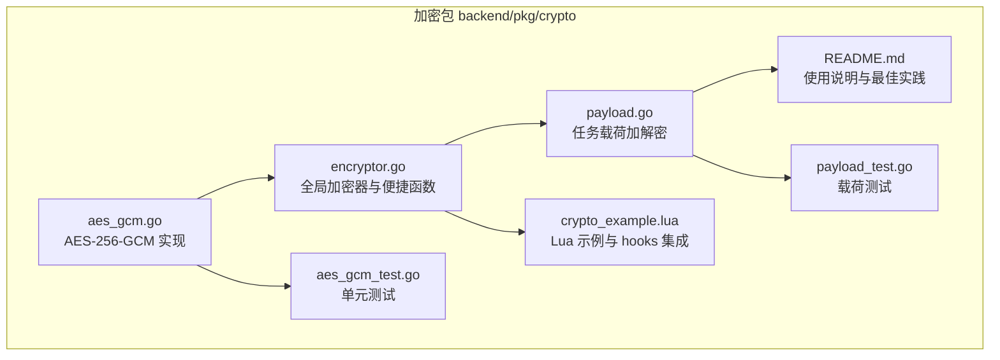
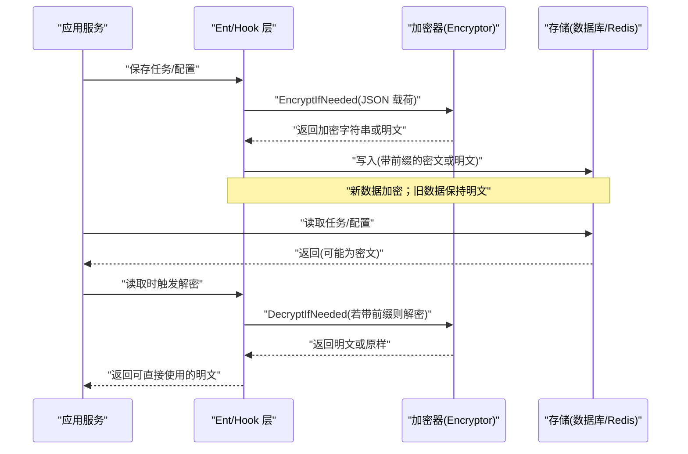
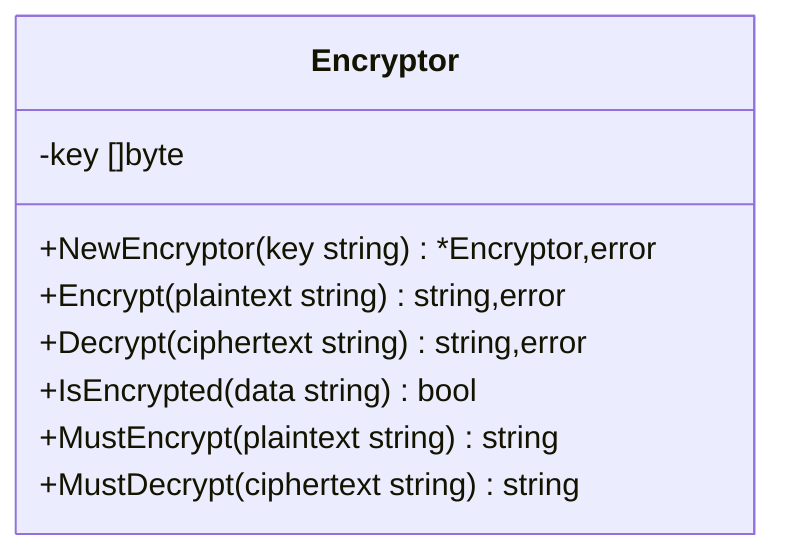
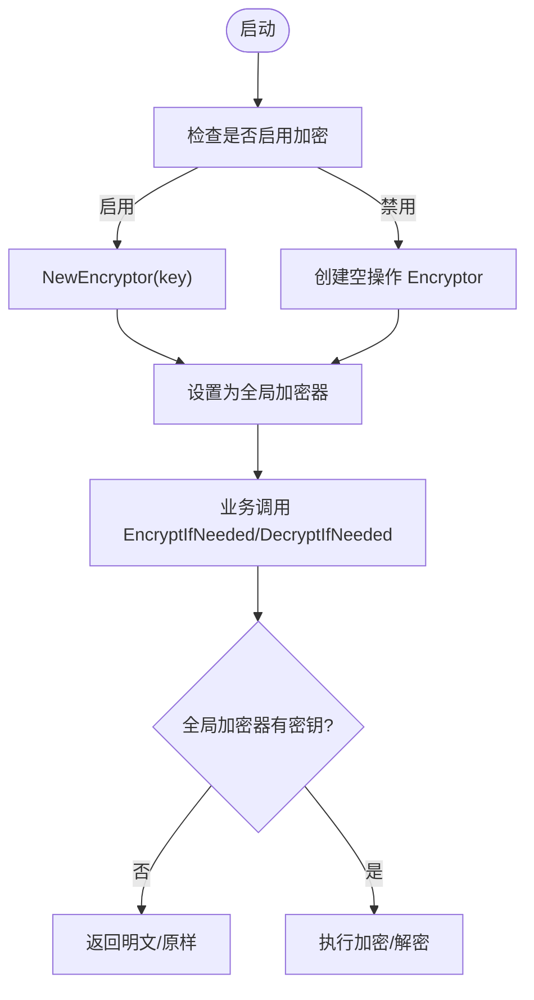
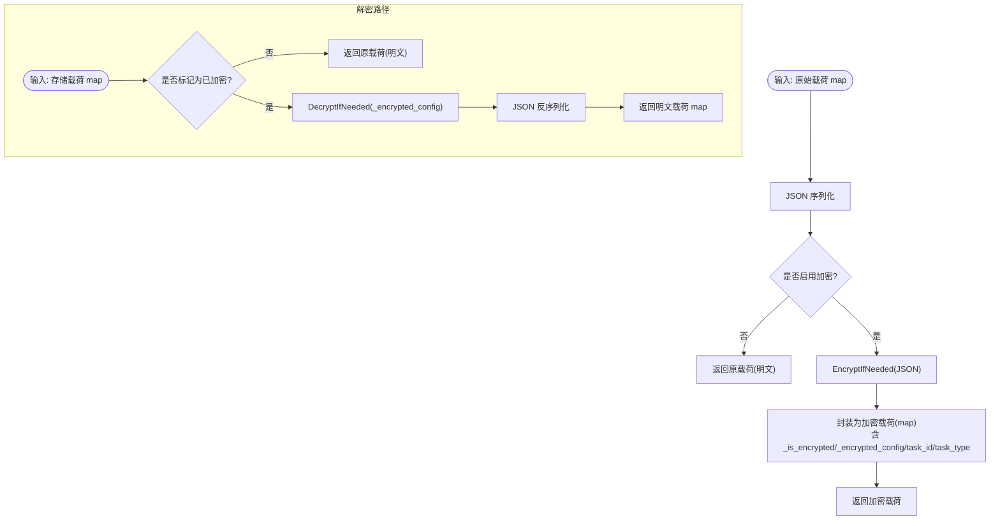
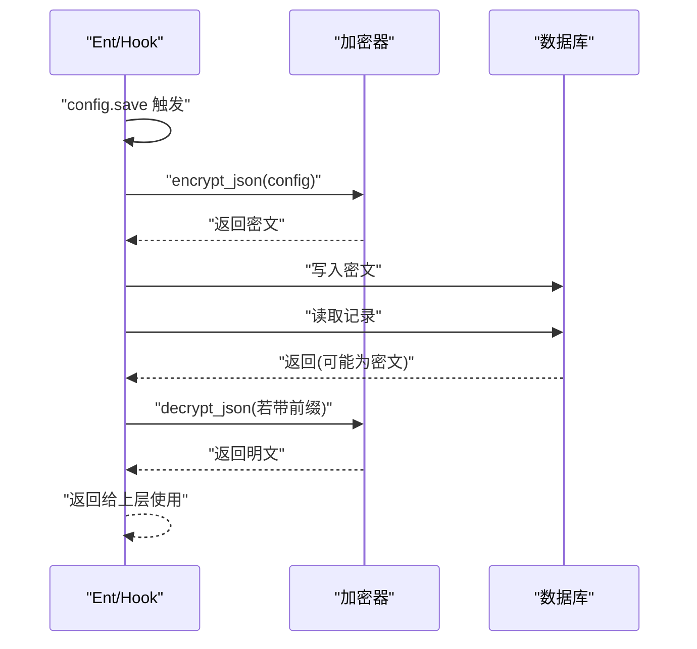
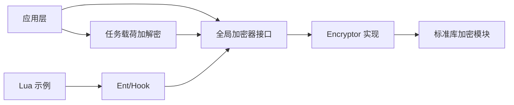

# 数据加密存储

<cite>
**本文引用的文件**
- [aes_gcm.go](file://backend/pkg/crypto/aes_gcm.go)
- [encryptor.go](file://backend/pkg/crypto/encryptor.go)
- [payload.go](file://backend/pkg/crypto/payload.go)
- [README.md](file://backend/pkg/crypto/README.md)
- [aes_gcm_test.go](file://backend/pkg/crypto/aes_gcm_test.go)
- [payload_test.go](file://backend/pkg/crypto/payload_test.go)
- [crypto_example.lua](file://backend/pkg/lua/examples/crypto_example.lua)
</cite>

## 目录
1. [简介](#简介)
2. [项目结构](#项目结构)
3. [核心组件](#核心组件)
4. [架构总览](#架构总览)
5. [组件详解](#组件详解)
6. [依赖关系分析](#依赖关系分析)
7. [性能考量](#性能考量)
8. [故障排查指南](#故障排查指南)
9. [结论](#结论)
10. [附录](#附录)

## 简介
本技术文档围绕后端加密存储能力，系统性阐述 AES-256-GCM 加密算法在项目中的实现与配置、加密器初始化与使用方式、透明加密机制（Ent hooks 的自动加解密）、加密数据格式、密钥管理与轮换策略、零停机迁移方案、性能与安全注意事项、错误处理与故障排查，以及生产环境部署与监控要点。目标是帮助开发者与运维人员在不改变业务逻辑的前提下，安全、稳定地启用与维护数据加密。

## 项目结构
加密相关能力集中在 backend/pkg/crypto 包中，核心文件包括：
- AES-256-GCM 实现与工具：aes_gcm.go、encryptor.go、payload.go
- 使用说明与最佳实践：README.md
- 测试用例：aes_gcm_test.go、payload_test.go
- Lua 示例脚本（展示与 hooks 集成）：crypto_example.lua

图表来源
- [aes_gcm.go:1-154](file://backend/pkg/crypto/aes_gcm.go#L1-L154)
- [encryptor.go:1-55](file://backend/pkg/crypto/encryptor.go#L1-L55)
- [payload.go:1-101](file://backend/pkg/crypto/payload.go#L1-L101)
- [README.md:1-300](file://backend/pkg/crypto/README.md#L1-L300)
- [aes_gcm_test.go:1-234](file://backend/pkg/crypto/aes_gcm_test.go#L1-L234)
- [payload_test.go:1-282](file://backend/pkg/crypto/payload_test.go#L1-L282)
- [crypto_example.lua:1-270](file://backend/pkg/lua/examples/crypto_example.lua#L1-L270)

章节来源
- [aes_gcm.go:1-154](file://backend/pkg/crypto/aes_gcm.go#L1-L154)
- [encryptor.go:1-55](file://backend/pkg/crypto/encryptor.go#L1-L55)
- [payload.go:1-101](file://backend/pkg/crypto/payload.go#L1-L101)
- [README.md:1-300](file://backend/pkg/crypto/README.md#L1-L300)

## 核心组件
- AES-256-GCM 加密器：负责密钥派生、随机 Nonce 生成、认证加密与解密。
- 全局加密器：支持按配置启用/禁用，提供便捷的 EncryptIfNeeded/DecryptIfNeeded。
- 任务载荷加解密：对完整任务载荷进行 JSON 序列化后整体加密，保留路由所需字段。
- 文档与示例：提供配置指引、迁移步骤、性能基准、错误处理与最佳实践。

章节来源
- [aes_gcm.go:26-154](file://backend/pkg/crypto/aes_gcm.go#L26-L154)
- [encryptor.go:12-55](file://backend/pkg/crypto/encryptor.go#L12-L55)
- [payload.go:15-101](file://backend/pkg/crypto/payload.go#L15-L101)
- [README.md:1-300](file://backend/pkg/crypto/README.md#L1-L300)

## 架构总览
下图展示了从应用层到数据库/消息队列的透明加密路径，以及迁移阶段的数据流。

图表来源
- [aes_gcm.go:46-130](file://backend/pkg/crypto/aes_gcm.go#L46-L130)
- [encryptor.go:36-54](file://backend/pkg/crypto/encryptor.go#L36-L54)
- [payload.go:15-76](file://backend/pkg/crypto/payload.go#L15-L76)
- [crypto_example.lua:188-220](file://backend/pkg/lua/examples/crypto_example.lua#L188-L220)

## 组件详解

### AES-256-GCM 加密器（Encryptor）
- 密钥派生：输入任意长度密钥，经 SHA-256 派生为 32 字节密钥，满足 AES-256 要求。
- 加密流程：AES-256 + GCM 模式，随机 12 字节 Nonce，自动包含 16 字节认证标签，输出 base64 编码并添加“enc:”前缀。
- 解密流程：校验前缀、base64 解码、分离 Nonce 与密文、GCM Open 验证并解密。
- 向后兼容：未带前缀的数据视为明文直接返回。
- 错误处理：定义了无效密钥、无效密文、解密失败等错误类型，并在各环节返回带上下文的错误。

图表来源
- [aes_gcm.go:26-154](file://backend/pkg/crypto/aes_gcm.go#L26-L154)

章节来源
- [aes_gcm.go:15-154](file://backend/pkg/crypto/aes_gcm.go#L15-L154)
- [aes_gcm_test.go:8-234](file://backend/pkg/crypto/aes_gcm_test.go#L8-L234)

### 全局加密器与便捷函数（Init/Get/EncryptIfNeeded/DecryptIfNeeded）
- 初始化：支持通过配置启用/禁用加密；禁用时提供“空操作”加密器，保证调用链一致。
- 获取实例：若未初始化，默认返回空操作加密器，避免空指针。
- 便捷接口：EncryptIfNeeded/DecryptIfNeeded 在未启用时直接返回明文，确保向后兼容。

图表来源
- [encryptor.go:12-54](file://backend/pkg/crypto/encryptor.go#L12-L54)

章节来源
- [encryptor.go:1-55](file://backend/pkg/crypto/encryptor.go#L1-L55)

### 任务载荷加解密（EncryptPayload/DecryptPayload）
- 加密：将原始载荷 JSON 序列化后整体加密，结果以键值形式返回，包含“已加密”标记与路由字段（如 task_id、task_type）。
- 解密：若载荷被标记为已加密，则解密后反序列化回 map；否则原样返回。
- 兼容性：未加密载荷可直接透传，便于渐进式迁移。

图表来源
- [payload.go:15-101](file://backend/pkg/crypto/payload.go#L15-L101)

章节来源
- [payload.go:1-101](file://backend/pkg/crypto/payload.go#L1-L101)
- [payload_test.go:8-282](file://backend/pkg/crypto/payload_test.go#L8-L282)

### 透明加密机制（Ent hooks 自动加解密）
- 保存阶段：在保存任务/配置前，自动对敏感字段进行加密，确保落库均为密文。
- 读取阶段：在读取时自动识别并解密密文，业务层拿到明文即可使用。
- 兼容性：未加密的历史数据可正常读取，保证平滑过渡。
- Lua 示例：crypto_example.lua 展示了如何在 hooks 中注册“保存/加载”事件，完成配置的加密与解密。

图表来源
- [crypto_example.lua:188-220](file://backend/pkg/lua/examples/crypto_example.lua#L188-L220)

章节来源
- [README.md:46-63](file://backend/pkg/crypto/README.md#L46-L63)
- [crypto_example.lua:188-220](file://backend/pkg/lua/examples/crypto_example.lua#L188-L220)

### 加密数据格式
- 前缀标识：所有密文均以“enc:”开头，用于区分明文与密文。
- 内容结构：base64 编码的字节串，包含 12 字节随机 Nonce、认证标签与密文。
- 迁移友好：前缀设计允许系统识别并安全迁移历史明文数据。

章节来源
- [aes_gcm.go:15-18](file://backend/pkg/crypto/aes_gcm.go#L15-L18)
- [aes_gcm.go:72-77](file://backend/pkg/crypto/aes_gcm.go#L72-L77)
- [README.md:128-143](file://backend/pkg/crypto/README.md#L128-L143)

### 密钥管理与密钥轮换
- 密钥要求：建议至少 32 字符，生产环境置于环境变量中，严禁提交至版本控制。
- 轮换流程：先以旧密钥部署并运行迁移工具重加密，再更新配置并重启生效。
- 备份与审计：密钥需安全备份并记录轮换日志。

章节来源
- [README.md:21-27](file://backend/pkg/crypto/README.md#L21-L27)
- [README.md:204-212](file://backend/pkg/crypto/README.md#L204-L212)

### 零停机迁移方案
- 分阶段迁移：启用加密 → 运行迁移工具 → 验证。
- 工具能力：跳过已加密与空载荷，报告进度与错误，支持预演模式。
- 运行窗口：迁移可在业务正常运行期间执行，不影响在线服务。

章节来源
- [README.md:90-127](file://backend/pkg/crypto/README.md#L90-L127)

## 依赖关系分析
- 模块内聚：aes_gcm.go 提供底层加解密能力；encryptor.go 提供全局与便捷接口；payload.go 提供任务载荷层面的加解密。
- 外部依赖：使用 Go 标准库 crypto/aes、cipher、rand、sha256、encoding/base64 等。
- 调用关系：业务层通过全局加密器接口调用；Ent hooks 在持久化前后自动调用；Lua 示例演示 hooks 集成。

图表来源
- [aes_gcm.go:3-13](file://backend/pkg/crypto/aes_gcm.go#L3-L13)
- [encryptor.go:3-5](file://backend/pkg/crypto/encryptor.go#L3-L5)
- [payload.go:3-6](file://backend/pkg/crypto/payload.go#L3-L6)
- [crypto_example.lua:1-10](file://backend/pkg/lua/examples/crypto_example.lua#L1-L10)

章节来源
- [aes_gcm.go:1-154](file://backend/pkg/crypto/aes_gcm.go#L1-L154)
- [encryptor.go:1-55](file://backend/pkg/crypto/encryptor.go#L1-L55)
- [payload.go:1-101](file://backend/pkg/crypto/payload.go#L1-L101)

## 性能考量
- 加解密吞吐：在现代硬件上，加密与解密均可达约每秒百万级操作，数据库额外开销小于 1ms/次。
- 建议：对高频小对象可批量处理；对大对象优先考虑分片或异步处理；合理设置并发与缓存策略。

章节来源
- [README.md:220-226](file://backend/pkg/crypto/README.md#L220-L226)

## 故障排查指南
- “无效密文”错误：通常由密钥变更或数据损坏导致，需核对密钥与日志。
- 任务无法解密：确认配置已启用加密、密钥正确、初始化调用正常。
- 迁移失败：检查数据库连通性、密钥正确性与迁移工具输出。
- 解密失败的容错：系统会记录错误但不阻断，返回密文以便调试。

章节来源
- [README.md:158-172](file://backend/pkg/crypto/README.md#L158-L172)
- [README.md:251-267](file://backend/pkg/crypto/README.md#L251-L267)

## 结论
该加密体系以 AES-256-GCM 为核心，结合全局加密器与任务载荷加解密，实现了对敏感数据的透明保护。通过“enc:”前缀与 hooks 自动化，系统在不侵入业务逻辑的前提下，提供了向后兼容、可迁移、可监控的加密能力。配合严格的密钥管理与轮换流程，能够在生产环境中安全、稳定地运行。

## 附录

### 配置与使用要点
- 环境变量：ENCRYPTION_KEY 必须设置且足够长。
- 配置文件：encryption.key 与 encryption.enabled 控制开关。
- 初始化：确保在应用启动时调用初始化函数，使全局加密器可用。

章节来源
- [README.md:29-43](file://backend/pkg/crypto/README.md#L29-L43)
- [README.md:160-172](file://backend/pkg/crypto/README.md#L160-L172)

### 生产部署与监控
- 安全配置：密钥仅存在于环境变量；定期轮换；严格访问控制。
- 监控指标：加密/解密错误率、迁移进度、数据库查询性能。
- 日志审计：记录密钥轮换、迁移执行与异常事件。

章节来源
- [README.md:213-219](file://backend/pkg/crypto/README.md#L213-L219)
- [README.md:175-197](file://backend/pkg/crypto/README.md#L175-L197)