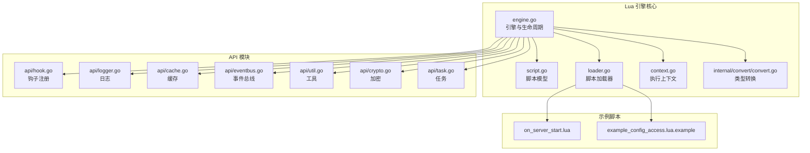
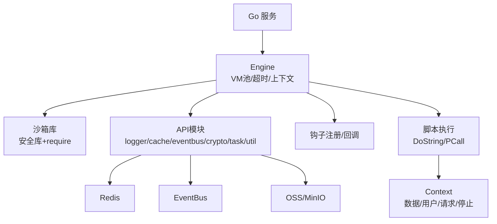
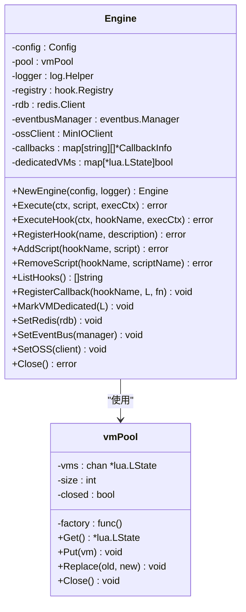
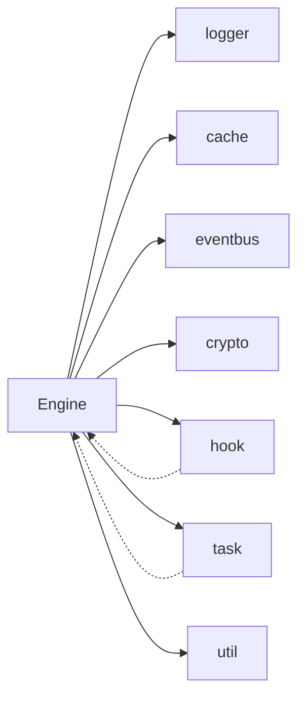

# Lua 脚本引擎

<cite>
**本文引用的文件**
- [engine.go](file://backend/pkg/lua/engine.go)
- [script.go](file://backend/pkg/lua/script.go)
- [loader.go](file://backend/pkg/lua/loader.go)
- [context.go](file://backend/pkg/lua/context.go)
- [api/hook.go](file://backend/pkg/lua/api/hook.go)
- [api/logger.go](file://backend/pkg/lua/api/logger.go)
- [api/cache.go](file://backend/pkg/lua/api/cache.go)
- [api/eventbus.go](file://backend/pkg/lua/api/eventbus.go)
- [api/util.go](file://backend/pkg/lua/api/util.go)
- [api/crypto.go](file://backend/pkg/lua/api/crypto.go)
- [api/task.go](file://backend/pkg/lua/api/task.go)
- [internal/convert/convert.go](file://backend/pkg/lua/internal/convert/convert.go)
- [on_server_start.lua](file://backend/app/admin/service/scripts/on_server_start.lua)
- [example_config_access.lua.example](file://backend/app/admin/service/scripts/example_config_access.lua.example)
</cite>

## 目录
1. [简介](#简介)
2. [项目结构](#项目结构)
3. [核心组件](#核心组件)
4. [架构总览](#架构总览)
5. [详细组件分析](#详细组件分析)
6. [依赖分析](#依赖分析)
7. [性能考量](#性能考量)
8. [故障排查指南](#故障排查指南)
9. [结论](#结论)
10. [附录：脚本开发最佳实践与示例](#附录脚本开发最佳实践与示例)

## 简介
本文件系统性阐述基于 gopher-lua 的 Lua 脚本引擎在后端服务中的架构设计与实现原理，覆盖脚本加载机制、执行上下文管理、API 调用接口、生命周期管理（注册、执行、缓存、销毁）、与 Go 代码的交互方式（函数调用、数据传递、错误处理），并提供最佳实践、性能优化、内存管理与安全建议，以及常见业务场景的脚本示例。

## 项目结构
Lua 引擎位于 backend/pkg/lua 目录，核心由以下模块组成：
- 引擎与生命周期管理：engine.go
- 脚本模型与校验：script.go
- 脚本加载器（文件/字符串）：loader.go
- 执行上下文：context.go
- 内部转换工具：internal/convert/convert.go
- API 模块（日志、缓存、事件总线、加密、任务、工具）：api/*.go
- 示例脚本：app/admin/service/scripts/*.lua



图表来源
- [engine.go:1-755](file://backend/pkg/lua/engine.go#L1-L755)
- [loader.go:1-126](file://backend/pkg/lua/loader.go#L1-L126)
- [api/hook.go:1-144](file://backend/pkg/lua/api/hook.go#L1-L144)
- [api/logger.go:1-111](file://backend/pkg/lua/api/logger.go#L1-L111)
- [api/cache.go:1-306](file://backend/pkg/lua/api/cache.go#L1-L306)
- [api/eventbus.go:1-286](file://backend/pkg/lua/api/eventbus.go#L1-L286)
- [api/util.go:1-65](file://backend/pkg/lua/api/util.go#L1-L65)
- [api/crypto.go:1-198](file://backend/pkg/lua/api/crypto.go#L1-L198)
- [api/task.go:1-171](file://backend/pkg/lua/api/task.go#L1-L171)
- [internal/convert/convert.go:1-277](file://backend/pkg/lua/internal/convert/convert.go#L1-L277)
- [on_server_start.lua:1-82](file://backend/app/admin/service/scripts/on_server_start.lua#L1-L82)
- [example_config_access.lua.example:1-141](file://backend/app/admin/service/scripts/example_config_access.lua.example#L1-L141)

章节来源
- [engine.go:1-755](file://backend/pkg/lua/engine.go#L1-L755)
- [loader.go:1-126](file://backend/pkg/lua/loader.go#L1-L126)

## 核心组件
- 引擎 Engine：负责 VM 池化、沙箱初始化、安全库加载、API 注册、脚本执行、超时控制、钩子执行、回调管理、资源关闭。
- 脚本 Script：描述单个可执行脚本，包含名称、钩子点、源码、启用状态、优先级、版本、作者、是否关键等字段。
- 上下文 Context：封装执行所需的输入输出数据、用户信息、HTTP 请求信息、取消上下文、停止标志与计时等。
- 加载器 Loader：从目录或字符串加载并执行 Lua 脚本，支持动态注册钩子与脚本。
- API 模块：为 Lua 提供日志、缓存、事件总线、加密、任务、工具等能力，并通过 package.preload 预加载。
- 类型转换：convert 包在 Go 与 Lua 值之间进行双向转换，支持基础类型、表、切片、映射与反射。

章节来源
- [engine.go:28-64](file://backend/pkg/lua/engine.go#L28-L64)
- [script.go:9-44](file://backend/pkg/lua/script.go#L9-L44)
- [context.go:13-54](file://backend/pkg/lua/context.go#L13-L54)
- [loader.go:11-126](file://backend/pkg/lua/loader.go#L11-L126)
- [internal/convert/convert.go:10-90](file://backend/pkg/lua/internal/convert/convert.go#L10-L90)

## 架构总览
引擎采用“沙箱 + 池化 + 预加载模块”的架构：
- VM 池：复用 LuaState，降低频繁创建销毁开销。
- 安全库：仅开放基础、表、字符串、数学库，禁用危险函数；自定义 require 实现模块预加载。
- API 注册：按需注册日志、缓存、事件总线、加密、任务、工具等模块。
- 钩子与回调：支持脚本注册与回调函数两种扩展方式，统一由引擎调度执行。
- 执行超时：每个执行均在超时上下文中运行，避免长时间阻塞。



图表来源
- [engine.go:99-261](file://backend/pkg/lua/engine.go#L99-L261)
- [api/logger.go:25-110](file://backend/pkg/lua/api/logger.go#L25-L110)
- [api/cache.go:15-305](file://backend/pkg/lua/api/cache.go#L15-L305)
- [api/eventbus.go:63-285](file://backend/pkg/lua/api/eventbus.go#L63-L285)
- [api/crypto.go:15-197](file://backend/pkg/lua/api/crypto.go#L15-L197)
- [api/task.go:37-60](file://backend/pkg/lua/api/task.go#L37-L60)
- [api/util.go:10-64](file://backend/pkg/lua/api/util.go#L10-L64)

## 详细组件分析

### 引擎 Engine
- 配置 Config：最大并发 VM 数、执行超时、内存限制、调试开关、脚本目录、允许模块、池大小。
- VM 创建与安全库：创建新 VM，仅打开安全标准库，移除危险函数，自定义 require。
- API 注册：按可用外部组件注册日志、缓存、事件总线、OSS、加密、钩子、任务、工具。
- 执行流程 Execute：从池取 VM、设置上下文、超时执行、可选调用 execute 函数、返回结果或错误。
- 钩子执行 ExecuteHook：先执行回调，再执行已注册脚本，支持关键脚本失败中断。
- 回调执行 executeCallback：与 Execute 类似，但直接调用回调函数。
- 生命周期 Close：关闭专用 VM 与池中 VM。
- VM 池 vmPool：带容量限制的通道池，支持替换失效 VM。



图表来源
- [engine.go:28-64](file://backend/pkg/lua/engine.go#L28-L64)
- [engine.go:674-755](file://backend/pkg/lua/engine.go#L674-L755)

章节来源
- [engine.go:66-97](file://backend/pkg/lua/engine.go#L66-L97)
- [engine.go:263-328](file://backend/pkg/lua/engine.go#L263-L328)
- [engine.go:330-398](file://backend/pkg/lua/engine.go#L330-L398)
- [engine.go:400-444](file://backend/pkg/lua/engine.go#L400-L444)
- [engine.go:646-672](file://backend/pkg/lua/engine.go#L646-L672)
- [engine.go:674-755](file://backend/pkg/lua/engine.go#L674-L755)

### 脚本模型 Script
- 字段：ID、名称、钩子点、源码、启用、优先级、描述、版本、作者、是否关键、创建/更新时间。
- 方法：Hash 计算源码哈希；Validate 校验必填字段；Clone 复制实例。

章节来源
- [script.go:9-63](file://backend/pkg/lua/script.go#L9-L63)

### 执行上下文 Context
- 字段：唯一 ID、钩子名、数据字典、用户信息、HTTP 请求、日志、取消上下文、停止标志、原因、开始时间、读写锁。
- 方法：Set/Get/Has/Delete/Clone；WithUser/WithRequest/WithLogger/WithContext；Stop 返回错误；Duration/ToMap 序列化。

章节来源
- [context.go:13-222](file://backend/pkg/lua/context.go#L13-L222)

### 脚本加载器 Loader
- LoadScriptsFromDir：遍历目录，过滤 .lua 文件，逐个加载。
- LoadScriptFile/LoadScriptString：获取 VM、设置上下文、执行脚本，支持动态注册钩子与脚本。
- 行为：非专用 VM 归还池；专用 VM（如任务处理器）不归还池。

章节来源
- [loader.go:11-126](file://backend/pkg/lua/loader.go#L11-L126)

### API 模块

#### 日志 API（logger）
- 提供 info/warn/error/debug 及格式化版本 infof/errorf/warnf/debugf。
- 通过 Kratos 日志记录，兼容 Lua 数值到 Go 整数的格式化转换。

章节来源
- [api/logger.go:25-110](file://backend/pkg/lua/api/logger.go#L25-L110)

#### 缓存 API（cache）
- 支持 get/set/delete/exists/expire/incr/decr/incrby/ttl/keys/hget/hset/hgetall。
- set 自动序列化复杂类型为 JSON；get 尝试 JSON 解码；错误返回值与错误消息。

章节来源
- [api/cache.go:15-305](file://backend/pkg/lua/api/cache.go#L15-L305)

#### 事件总线 API（eventbus）
- subscribe/subscribe_async/subscribe_once：订阅事件类型，包装 Lua 函数为处理器。
- publish/publish_async/create_event：发布事件，支持完整事件对象或简写形式。
- 事件对象转换：ID、类型、来源、优先级、时间戳、数据、元数据映射到 Lua 表。

章节来源
- [api/eventbus.go:15-285](file://backend/pkg/lua/api/eventbus.go#L15-L285)

#### 加密 API（crypto）
- 字符串：encrypt/decrypt/is_encrypted；JSON：encrypt_json/decrypt_json；负载：encrypt_payload/decrypt_payload/has_encrypted_payload；hash_sha256。
- 使用全局加密器，支持表到 JSON 的序列化与反序列化。

章节来源
- [api/crypto.go:15-197](file://backend/pkg/lua/api/crypto.go#L15-L197)

#### 钩子 API（hook）
- hook.register(hook_name, description?, callback?)：注册钩子点，可同时注册回调。
- hook.add_script(hook_name, script_table)：动态添加脚本。
- hook.list()：列出所有钩子。
- 通过 HookEngine 接口解耦，避免循环依赖。

章节来源
- [api/hook.go:8-143](file://backend/pkg/lua/api/hook.go#L8-L143)

#### 任务 API（task）
- task.register_handler(name, description, handler_func, options)：注册 Lua 任务处理器，支持 required/optional、timeout_secs、max_retries、priority。
- 注册后标记 VM 专用，确保处理器函数可用。
- 全局注册表集中管理。

章节来源
- [api/task.go:8-171](file://backend/pkg/lua/api/task.go#L8-L171)

#### 工具 API（util）
- sleep、time、timestamp、date：提供常用工具函数。

章节来源
- [api/util.go:10-64](file://backend/pkg/lua/api/util.go#L10-L64)

### 类型转换 convert
- Go → Lua：基础类型、映射、切片、反射结构体/映射/切片。
- Lua → Go：布尔、数字、字符串、表（数组/映射）。
- 辅助函数：ToString/ToNumber/ToBool；tableFromMap/tableFromSlice/tableToGo；reflectToLua 及其分支。

```mermaid
flowchart TD
A["Go 值"] --> B{"类型判断"}
B --> |基础类型| C["转为 lua.LValue"]
B --> |map[string]any| D["tableFromMap"]
B --> |[]any| E["tableFromSlice"]
B --> |struct/slice/map| F["reflectToLua"]
C --> G["Lua 表达式"]
D --> G
E --> G
F --> G
H["Lua 表达式"] --> I{"类型判断"}
I --> |LTTable| J["tableToGo"]
I --> |LTBool/LTNumber/LTString/LNil| K["原生类型"]
J --> L["Go 值"]
K --> L
```

图表来源
- [internal/convert/convert.go:10-138](file://backend/pkg/lua/internal/convert/convert.go#L10-L138)

章节来源
- [internal/convert/convert.go:10-277](file://backend/pkg/lua/internal/convert/convert.go#L10-L277)

## 依赖分析
- 组件耦合：Engine 依赖 API 模块、钩子注册表、Redis/EventBus/OSS 客户端；API 模块通过 HookEngine 与 Engine 解耦。
- 外部依赖：gopher-lua、redis/go-redis、Kratos 日志、go-utils/id。
- 潜在风险：回调与任务处理器持有 VM，需谨慎管理生命周期；超时与错误传播需一致处理。



图表来源
- [engine.go:191-261](file://backend/pkg/lua/engine.go#L191-L261)
- [api/hook.go:32-143](file://backend/pkg/lua/api/hook.go#L32-L143)
- [api/task.go:37-60](file://backend/pkg/lua/api/task.go#L37-L60)

章节来源
- [engine.go:191-261](file://backend/pkg/lua/engine.go#L191-L261)

## 性能考量
- VM 池：预创建固定数量 VM，减少频繁创建销毁成本；池满则关闭多余 VM。
- 超时控制：每个执行在超时上下文中运行，超时自动替换 VM 并返回错误。
- 数据传递：尽量使用表结构传递复杂数据，利用 convert 的高效映射。
- 模块预加载：通过 package.preload 减少 require 开销。
- 缓存与事件：合理使用 Redis 缓存与异步事件，避免同步阻塞。

[本节为通用指导，无需特定文件来源]

## 故障排查指南
- 脚本执行超时：检查配置的 VMTimeout；确认脚本中无死循环或长阻塞操作。
- 回调返回 false：钩子会中止后续执行；检查回调逻辑与返回值。
- Redis/事件总线/OSS 未配置：对应 API 不可用；通过 SetRedis/SetEventBus/SetOSS 注入。
- 类型转换异常：确认传入数据结构清晰；必要时在 Lua 侧进行显式类型检查。
- 日志定位：使用 log.infof/log.warnf 等格式化输出，结合上下文 ID 进行追踪。

章节来源
- [engine.go:317-327](file://backend/pkg/lua/engine.go#L317-L327)
- [engine.go:428-432](file://backend/pkg/lua/engine.go#L428-L432)
- [api/logger.go:61-102](file://backend/pkg/lua/api/logger.go#L61-L102)

## 结论
该 Lua 脚本引擎以沙箱与池化为核心，提供安全可控的扩展能力。通过钩子与回调机制，既支持静态脚本注册，也支持动态脚本与任务处理器注册。配合丰富的 API（日志、缓存、事件总线、加密、工具），能够满足多种业务场景的灵活扩展需求。建议在生产环境中严格配置超时与内存限制，规范数据传递与错误处理，并结合示例脚本进行最佳实践落地。

[本节为总结，无需特定文件来源]

## 附录：脚本开发最佳实践与示例

### 最佳实践
- 安全
  - 仅使用受控 API；避免访问危险函数。
  - 对外部输入进行严格校验与类型检查。
- 性能
  - 合理使用缓存；避免在钩子中执行耗时操作。
  - 控制脚本长度与复杂度；必要时拆分为多个脚本。
- 可维护性
  - 为脚本命名清晰、描述明确、版本化管理。
  - 在脚本中使用 log 输出关键路径与错误信息。
- 错误处理
  - 明确区分可恢复与不可恢复错误；对关键脚本设置 Critical。
  - 使用 ctx.stop 中断后续处理，提供清晰原因。

### 生命周期管理
- 注册：通过 hook.register 或 AddScript 注册脚本。
- 执行：Engine.Execute 或 ExecuteHook 触发；支持超时与返回值控制。
- 缓存：首次加载后由 VM 池复用；专用 VM（任务/回调）不归还池。
- 销毁：Engine.Close 关闭所有 VM。

章节来源
- [engine.go:446-554](file://backend/pkg/lua/engine.go#L446-L554)
- [engine.go:646-672](file://backend/pkg/lua/engine.go#L646-L672)

### 与 Go 代码交互
- 函数调用：Go 通过 API 模块向 Lua 暴露能力；Lua 通过 require 使用模块。
- 数据传递：使用 convert 在 Go 与 Lua 间转换；注意数组/映射差异。
- 错误处理：API 返回值携带错误消息；钩子与回调根据返回布尔值决定是否继续。

章节来源
- [engine.go:191-261](file://backend/pkg/lua/engine.go#L191-L261)
- [internal/convert/convert.go:10-138](file://backend/pkg/lua/internal/convert/convert.go#L10-L138)

### 示例脚本与场景

#### 服务器启动钩子（on_server_start）
- 场景：服务启动时初始化、加载配置、发布事件。
- 关键点：通过 hook.register 注册；使用 log 与可选的 cache/eventbus 能力；从上下文读取配置与服务信息。

章节来源
- [on_server_start.lua:1-82](file://backend/app/admin/service/scripts/on_server_start.lua#L1-L82)

#### 配置访问与校验
- 场景：读取配置、环境判断、条件初始化、关键字段校验。
- 关键点：ctx.get 获取配置；使用 ctx.stop 中断并给出原因；提供辅助函数安全访问嵌套字段。

章节来源
- [example_config_access.lua.example:1-141](file://backend/app/admin/service/scripts/example_config_access.lua.example#L1-L141)

### 钩子与回调机制
- 钩子：通过 RegisterHook/AddScript 注册；ExecuteHook 顺序执行回调与脚本。
- 回调：RegisterCallback 注册；executeCallback 超时执行；支持返回 false 中断。

章节来源
- [engine.go:446-449](file://backend/pkg/lua/engine.go#L446-L449)
- [engine.go:451-482](file://backend/pkg/lua/engine.go#L451-L482)
- [engine.go:330-398](file://backend/pkg/lua/engine.go#L330-L398)
- [engine.go:400-444](file://backend/pkg/lua/engine.go#L400-L444)

### 异步脚本执行
- 事件总线：通过 eventbus.subscribe_async 订阅异步事件；Lua 侧处理器在独立 goroutine 中执行。
- 任务处理器：通过 task.register_handler 注册，引擎标记 VM 专用，保证处理器可用。

章节来源
- [api/eventbus.go:109-134](file://backend/pkg/lua/api/eventbus.go#L109-L134)
- [api/task.go:62-153](file://backend/pkg/lua/api/task.go#L62-L153)