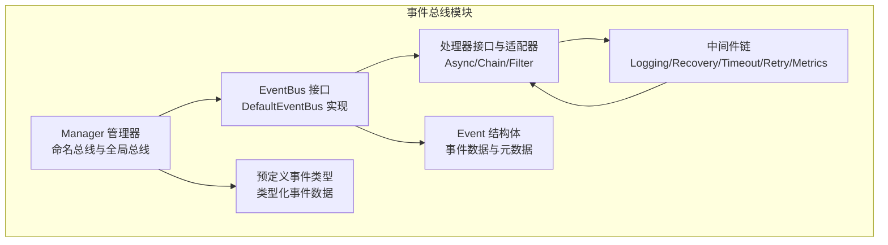
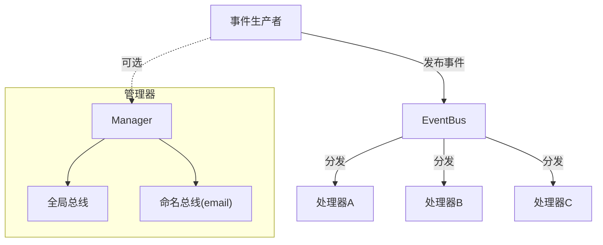
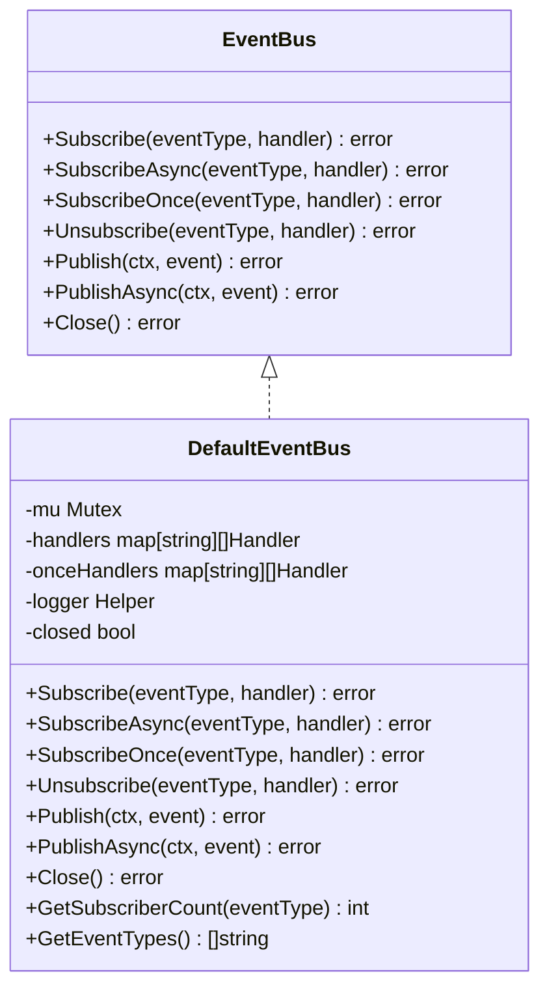
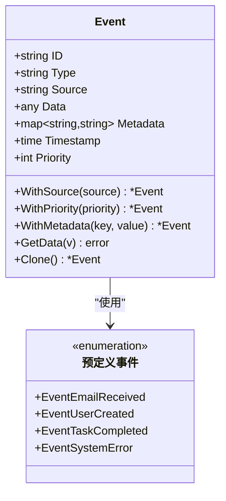
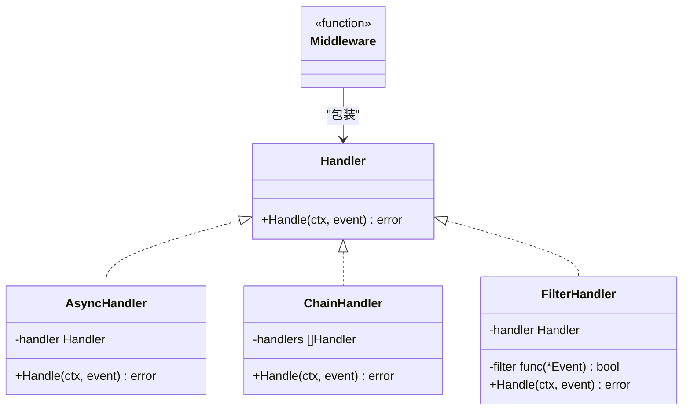
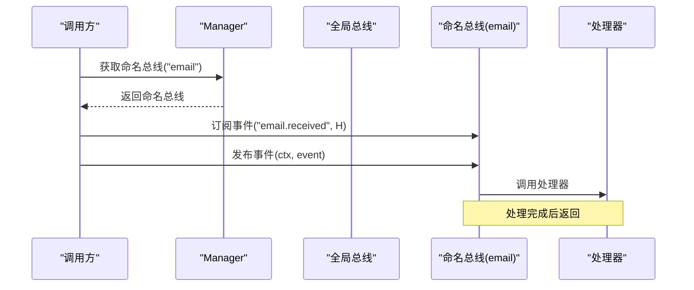
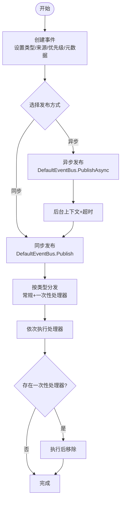
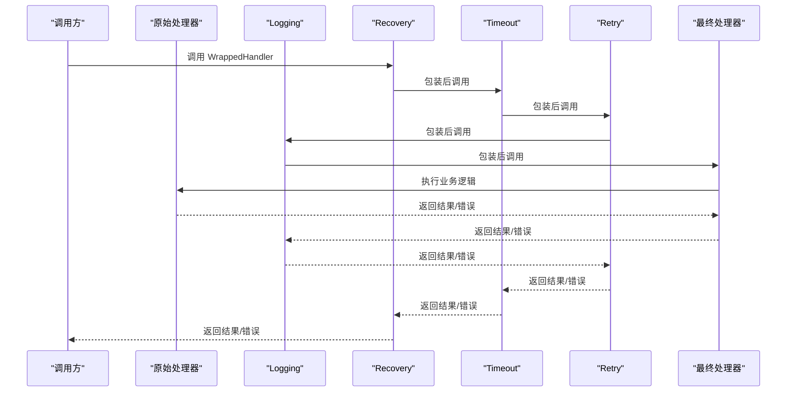
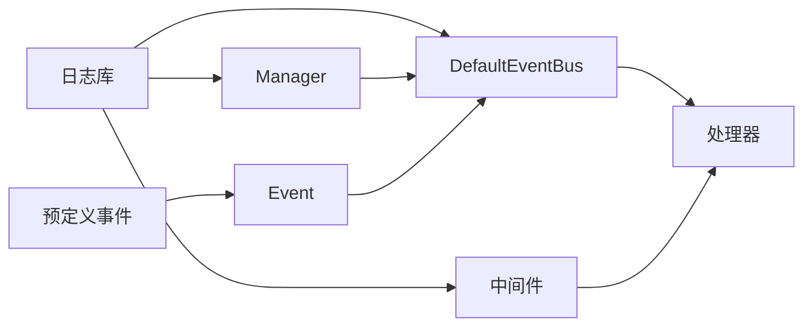

# 事件总线系统

<cite>
**本文引用的文件**   
- [eventbus.go](file://backend/pkg/eventbus/eventbus.go)
- [event.go](file://backend/pkg/eventbus/event.go)
- [events.go](file://backend/pkg/eventbus/events.go)
- [handler.go](file://backend/pkg/eventbus/handler.go)
- [manager.go](file://backend/pkg/eventbus/manager.go)
- [middleware.go](file://backend/pkg/eventbus/middleware.go)
- [example_test.go](file://backend/pkg/eventbus/example_test.go)
- [README.md](file://backend/pkg/eventbus/README.md)
- [INTEGRATION.md](file://backend/pkg/eventbus/INTEGRATION.md)
- [eventbus_test.go](file://backend/pkg/lua/api/eventbus_test.go)
</cite>

## 目录
1. [简介](#简介)
2. [项目结构](#项目结构)
3. [核心组件](#核心组件)
4. [架构总览](#架构总览)
5. [详细组件分析](#详细组件分析)
6. [依赖分析](#依赖分析)
7. [性能考虑](#性能考虑)
8. [故障排查指南](#故障排查指南)
9. [结论](#结论)
10. [附录](#附录)

## 简介
本文件为事件总线系统的详细技术文档，覆盖设计架构、实现原理与使用实践。事件总线采用发布-订阅模式，支持同步与异步事件发布、一次性订阅、中间件链式处理、多事件总线隔离与全局总线、以及丰富的事件数据模型与类型化事件定义。文档同时提供事件生命周期说明、中间件配置、处理器开发指南、性能优化策略、调试与监控方法，以及典型业务场景（如用户登录、权限变更、系统配置更新）的事件处理示例。

## 项目结构
事件总线相关代码集中在 backend/pkg/eventbus 目录，包含以下关键文件：
- eventbus.go：默认事件总线实现与接口定义
- event.go：通用事件结构体与工具方法
- events.go：常用事件类型与类型化事件数据结构
- handler.go：处理器接口、异步处理器、处理器链与过滤器
- manager.go：事件总线管理器，支持命名总线与全局总线
- middleware.go：日志、恢复、超时、重试、指标等中间件
- example_test.go：基础用法与高级特性的示例
- README.md：快速入门与最佳实践
- INTEGRATION.md：与邮件处理系统的集成指南
- eventbus_test.go：Lua API 对事件总线的测试，验证跨语言使用

**图表来源**
- [eventbus.go:12-34](file://backend/pkg/eventbus/eventbus.go#L12-L34)
- [event.go:8-30](file://backend/pkg/eventbus/event.go#L8-L30)
- [events.go:3-32](file://backend/pkg/eventbus/events.go#L3-L32)
- [handler.go:18-21](file://backend/pkg/eventbus/handler.go#L18-L21)
- [manager.go:10-16](file://backend/pkg/eventbus/manager.go#L10-L16)
- [middleware.go:10-11](file://backend/pkg/eventbus/middleware.go#L10-L11)

**章节来源**
- [eventbus.go:12-34](file://backend/pkg/eventbus/eventbus.go#L12-L34)
- [event.go:8-30](file://backend/pkg/eventbus/event.go#L8-L30)
- [events.go:3-32](file://backend/pkg/eventbus/events.go#L3-L32)
- [handler.go:18-21](file://backend/pkg/eventbus/handler.go#L18-L21)
- [manager.go:10-16](file://backend/pkg/eventbus/manager.go#L10-L16)
- [middleware.go:10-11](file://backend/pkg/eventbus/middleware.go#L10-L11)

## 核心组件
- 事件总线接口与默认实现
  - EventBus 接口定义了订阅、取消订阅、一次性订阅、发布、异步发布与关闭等能力
  - DefaultEventBus 提供线程安全的订阅表维护与事件分发逻辑
- 事件模型
  - Event 结构体包含唯一 ID、事件类型、来源、负载数据、元数据、时间戳与优先级
  - 提供构造函数、链式设置方法与数据反序列化工具
- 预定义事件与类型化事件
  - 常用事件类型常量（邮件、用户、任务、系统）
  - 类型化事件数据结构，便于强类型处理
- 处理器体系
  - Handler 接口与 EventHandlerFunc 适配器
  - AsyncHandler 异步执行包装
  - ChainHandler 顺序链式执行
  - FilterHandler 条件过滤
- 管理器
  - Manager 支持命名总线与全局总线，提供统计查询
- 中间件
  - 日志、异常恢复、超时、重试、指标收集等中间件，支持链式组合

**章节来源**
- [eventbus.go:12-34](file://backend/pkg/eventbus/eventbus.go#L12-L34)
- [eventbus.go:36-43](file://backend/pkg/eventbus/eventbus.go#L36-L43)
- [eventbus.go:106-152](file://backend/pkg/eventbus/eventbus.go#L106-L152)
- [eventbus.go:154-167](file://backend/pkg/eventbus/eventbus.go#L154-L167)
- [eventbus.go:169-184](file://backend/pkg/eventbus/eventbus.go#L169-L184)
- [event.go:8-30](file://backend/pkg/eventbus/event.go#L8-L30)
- [event.go:32-42](file://backend/pkg/eventbus/event.go#L32-L42)
- [event.go:65-79](file://backend/pkg/eventbus/event.go#L65-L79)
- [events.go:3-32](file://backend/pkg/eventbus/events.go#L3-L32)
- [handler.go:18-21](file://backend/pkg/eventbus/handler.go#L18-L21)
- [handler.go:23-39](file://backend/pkg/eventbus/handler.go#L23-L39)
- [handler.go:41-59](file://backend/pkg/eventbus/handler.go#L41-L59)
- [handler.go:61-81](file://backend/pkg/eventbus/handler.go#L61-L81)
- [manager.go:10-16](file://backend/pkg/eventbus/manager.go#L10-L16)
- [manager.go:28-43](file://backend/pkg/eventbus/manager.go#L28-L43)
- [manager.go:50-70](file://backend/pkg/eventbus/manager.go#L50-L70)
- [manager.go:93-118](file://backend/pkg/eventbus/manager.go#L93-L118)
- [middleware.go:10-11](file://backend/pkg/eventbus/middleware.go#L10-L11)
- [middleware.go:13-42](file://backend/pkg/eventbus/middleware.go#L13-L42)
- [middleware.go:44-68](file://backend/pkg/eventbus/middleware.go#L44-L68)
- [middleware.go:70-88](file://backend/pkg/eventbus/middleware.go#L70-L88)
- [middleware.go:90-104](file://backend/pkg/eventbus/middleware.go#L90-L104)
- [middleware.go:106-114](file://backend/pkg/eventbus/middleware.go#L106-L114)

## 架构总览
事件总线采用“发布-订阅”解耦架构，事件生产者通过 EventBus 发布事件；多个处理器按订阅关系接收事件。管理器支持多总线隔离与全局总线，中间件提供横切能力（日志、恢复、超时、重试、指标）。异步发布避免阻塞调用方，一次性订阅用于初始化场景。

**图表来源**
- [eventbus.go:26-34](file://backend/pkg/eventbus/eventbus.go#L26-L34)
- [manager.go:28-43](file://backend/pkg/eventbus/manager.go#L28-L43)
- [manager.go:50-70](file://backend/pkg/eventbus/manager.go#L50-L70)

## 详细组件分析

### 事件总线接口与默认实现
- 接口能力
  - 订阅/取消订阅/一次性订阅
  - 同步/异步发布
  - 关闭资源清理
- 默认实现要点
  - 使用读写锁保证并发安全
  - 分别维护常规处理器与一次性处理器列表
  - 发布时先执行常规处理器，再执行一次性处理器并清理
  - 异步发布使用独立后台上下文，带超时保护

**图表来源**
- [eventbus.go:12-34](file://backend/pkg/eventbus/eventbus.go#L12-L34)
- [eventbus.go:36-43](file://backend/pkg/eventbus/eventbus.go#L36-L43)

**章节来源**
- [eventbus.go:12-34](file://backend/pkg/eventbus/eventbus.go#L12-L34)
- [eventbus.go:54-104](file://backend/pkg/eventbus/eventbus.go#L54-L104)
- [eventbus.go:106-152](file://backend/pkg/eventbus/eventbus.go#L106-L152)
- [eventbus.go:154-167](file://backend/pkg/eventbus/eventbus.go#L154-L167)
- [eventbus.go:169-184](file://backend/pkg/eventbus/eventbus.go#L169-L184)
- [eventbus.go:186-213](file://backend/pkg/eventbus/eventbus.go#L186-L213)

### 事件模型与类型化事件
- 事件结构
  - 包含唯一标识、类型、来源、任意数据负载、元数据、时间戳与优先级
  - 工具方法支持链式设置与类型化数据提取
- 类型化事件
  - 定义邮件、用户、任务、系统等事件的数据结构，提升类型安全与可读性

**图表来源**
- [event.go:8-30](file://backend/pkg/eventbus/event.go#L8-L30)
- [event.go:32-42](file://backend/pkg/eventbus/event.go#L32-L42)
- [event.go:65-79](file://backend/pkg/eventbus/event.go#L65-L79)
- [events.go:3-32](file://backend/pkg/eventbus/events.go#L3-L32)

**章节来源**
- [event.go:8-30](file://backend/pkg/eventbus/event.go#L8-L30)
- [event.go:32-42](file://backend/pkg/eventbus/event.go#L32-L42)
- [event.go:65-79](file://backend/pkg/eventbus/event.go#L65-L79)
- [events.go:3-32](file://backend/pkg/eventbus/events.go#L3-L32)
- [events.go:34-76](file://backend/pkg/eventbus/events.go#L34-L76)

### 处理器体系与中间件
- 处理器
  - Handler 接口统一处理签名
  - AsyncHandler 将处理器包装为异步执行
  - ChainHandler 顺序执行多个处理器
  - FilterHandler 基于条件过滤事件
- 中间件
  - 支持日志、异常恢复、超时、重试、指标收集
  - Chain 组合多个中间件，形成处理流水线

**图表来源**
- [handler.go:18-21](file://backend/pkg/eventbus/handler.go#L18-L21)
- [handler.go:23-39](file://backend/pkg/eventbus/handler.go#L23-L39)
- [handler.go:41-59](file://backend/pkg/eventbus/handler.go#L41-L59)
- [handler.go:61-81](file://backend/pkg/eventbus/handler.go#L61-L81)
- [middleware.go:10-11](file://backend/pkg/eventbus/middleware.go#L10-L11)
- [middleware.go:106-114](file://backend/pkg/eventbus/middleware.go#L106-L114)

**章节来源**
- [handler.go:18-21](file://backend/pkg/eventbus/handler.go#L18-L21)
- [handler.go:23-39](file://backend/pkg/eventbus/handler.go#L23-L39)
- [handler.go:41-59](file://backend/pkg/eventbus/handler.go#L41-L59)
- [handler.go:61-81](file://backend/pkg/eventbus/handler.go#L61-L81)
- [middleware.go:13-42](file://backend/pkg/eventbus/middleware.go#L13-L42)
- [middleware.go:44-68](file://backend/pkg/eventbus/middleware.go#L44-L68)
- [middleware.go:70-88](file://backend/pkg/eventbus/middleware.go#L70-L88)
- [middleware.go:90-104](file://backend/pkg/eventbus/middleware.go#L90-L104)
- [middleware.go:106-114](file://backend/pkg/eventbus/middleware.go#L106-L114)

### 管理器与多总线
- 管理器职责
  - 创建与缓存命名总线，提供全局总线
  - 统一发布与订阅入口
  - 提供统计信息（各总线已订阅事件类型）
- 多总线隔离
  - 不同业务域使用不同命名总线，避免交叉影响
  - 全局总线用于跨域事件或系统级事件

**图表来源**
- [manager.go:18-26](file://backend/pkg/eventbus/manager.go#L18-L26)
- [manager.go:28-43](file://backend/pkg/eventbus/manager.go#L28-L43)
- [manager.go:50-70](file://backend/pkg/eventbus/manager.go#L50-L70)
- [manager.go:93-118](file://backend/pkg/eventbus/manager.go#L93-L118)

**章节来源**
- [manager.go:18-26](file://backend/pkg/eventbus/manager.go#L18-L26)
- [manager.go:28-43](file://backend/pkg/eventbus/manager.go#L28-L43)
- [manager.go:50-70](file://backend/pkg/eventbus/manager.go#L50-L70)
- [manager.go:93-118](file://backend/pkg/eventbus/manager.go#L93-L118)

### 事件生命周期与处理流程
- 生命周期阶段
  - 事件创建：设置类型、来源、优先级、元数据与数据负载
  - 发布：同步或异步发布至目标总线
  - 分发：按事件类型匹配订阅处理器
  - 执行：依次执行常规处理器与一次性处理器（一次性处理器在执行后移除）
  - 完成：记录日志与指标，释放资源
- 异步发布流程
  - 使用独立后台上下文与超时，避免调用方上下文取消影响异步处理

**图表来源**
- [event.go:32-42](file://backend/pkg/eventbus/event.go#L32-L42)
- [eventbus.go:106-152](file://backend/pkg/eventbus/eventbus.go#L106-L152)
- [eventbus.go:154-167](file://backend/pkg/eventbus/eventbus.go#L154-L167)

**章节来源**
- [event.go:32-42](file://backend/pkg/eventbus/event.go#L32-L42)
- [eventbus.go:106-152](file://backend/pkg/eventbus/eventbus.go#L106-L152)
- [eventbus.go:154-167](file://backend/pkg/eventbus/eventbus.go#L154-L167)

### 事件中间件与配置
- 中间件类型
  - LoggingMiddleware：记录事件处理开始与结果
  - RecoveryMiddleware：捕获处理器恐慌并返回统一错误
  - TimeoutMiddleware：为处理器执行设置超时
  - RetryMiddleware：失败自动重试（次数与延迟可配置）
  - MetricsMiddleware：统计处理耗时与成功状态
- 中间件链
  - 使用 Chain 组合多个中间件，建议将 Recovery 放在最外层，Timeout 和 Retry 次之，Logging 最内层

**图表来源**
- [middleware.go:13-42](file://backend/pkg/eventbus/middleware.go#L13-L42)
- [middleware.go:44-68](file://backend/pkg/eventbus/middleware.go#L44-L68)
- [middleware.go:70-88](file://backend/pkg/eventbus/middleware.go#L70-L88)
- [middleware.go:90-104](file://backend/pkg/eventbus/middleware.go#L90-L104)
- [middleware.go:106-114](file://backend/pkg/eventbus/middleware.go#L106-L114)

**章节来源**
- [middleware.go:13-42](file://backend/pkg/eventbus/middleware.go#L13-L42)
- [middleware.go:44-68](file://backend/pkg/eventbus/middleware.go#L44-L68)
- [middleware.go:70-88](file://backend/pkg/eventbus/middleware.go#L70-L88)
- [middleware.go:90-104](file://backend/pkg/eventbus/middleware.go#L90-L104)
- [middleware.go:106-114](file://backend/pkg/eventbus/middleware.go#L106-L114)

### 事件处理器开发指南
- 注册与监听
  - 使用 Subscribe 订阅事件类型
  - 使用 SubscribeAsync 进行非阻塞处理
  - 使用 SubscribeOnce 仅执行一次
- 处理器开发
  - 实现 Handler 或使用 EventHandlerFunc 适配普通函数
  - 在处理器内部进行数据提取、业务处理与必要时发布新事件
- 中间件应用
  - 为处理器包裹中间件链，确保可观测性与稳定性
- 示例参考
  - 基础用法、类型化事件、中间件链、多总线、异步处理、过滤器、一次性订阅、处理器链等均有示例

**章节来源**
- [handler.go:18-21](file://backend/pkg/eventbus/handler.go#L18-L21)
- [handler.go:23-39](file://backend/pkg/eventbus/handler.go#L23-L39)
- [handler.go:41-59](file://backend/pkg/eventbus/handler.go#L41-L59)
- [handler.go:61-81](file://backend/pkg/eventbus/handler.go#L61-L81)
- [example_test.go:12-32](file://backend/pkg/eventbus/example_test.go#L12-L32)
- [example_test.go:34-62](file://backend/pkg/eventbus/example_test.go#L34-L62)
- [example_test.go:64-93](file://backend/pkg/eventbus/example_test.go#L64-L93)
- [example_test.go:95-127](file://backend/pkg/eventbus/example_test.go#L95-L127)
- [example_test.go:129-153](file://backend/pkg/eventbus/example_test.go#L129-L153)
- [example_test.go:155-182](file://backend/pkg/eventbus/example_test.go#L155-L182)
- [example_test.go:184-207](file://backend/pkg/eventbus/example_test.go#L184-L207)
- [example_test.go:209-241](file://backend/pkg/eventbus/example_test.go#L209-L241)

### 典型业务场景示例
- 用户登录事件
  - 事件类型：用户登录成功
  - 处理器：记录审计日志、更新用户最后登录时间、触发权限刷新
- 权限变更事件
  - 事件类型：角色/权限更新
  - 处理器：清理用户会话缓存、推送权限变更通知、更新访问控制缓存
- 系统配置更新事件
  - 事件类型：系统配置变更
  - 处理器：广播配置变更、触发相关服务热更新、记录审计日志

以上场景可直接映射到事件总线的订阅与发布模型，结合中间件实现可观测与健壮性保障。

## 依赖分析
事件总线模块内部高度内聚，对外仅依赖日志库；管理器依赖事件总线接口；中间件依赖日志库；处理器与事件模型相互独立，便于扩展。

**图表来源**
- [eventbus.go:3](file://backend/pkg/eventbus/eventbus.go#L3-L10)
- [manager.go:3-8](file://backend/pkg/eventbus/manager.go#L3-L8)
- [middleware.go:3-8](file://backend/pkg/eventbus/middleware.go#L3-L8)
- [eventbus.go:37-43](file://backend/pkg/eventbus/eventbus.go#L37-L43)
- [manager.go:11-16](file://backend/pkg/eventbus/manager.go#L11-L16)
- [middleware.go:10-11](file://backend/pkg/eventbus/middleware.go#L10-L11)

**章节来源**
- [eventbus.go:3-10](file://backend/pkg/eventbus/eventbus.go#L3-L10)
- [manager.go:3-8](file://backend/pkg/eventbus/manager.go#L3-L8)
- [middleware.go:3-8](file://backend/pkg/eventbus/middleware.go#L3-L8)

## 性能考虑
- 并发与锁粒度
  - 使用读写锁分离读写路径，降低锁竞争
  - 发布阶段先读取处理器列表，再在必要时加写锁删除一次性处理器
- 异步处理
  - 异步发布使用独立后台上下文与超时，避免阻塞调用方
  - 异步处理器独立 goroutine 执行，适合非关键路径
- 内存管理
  - 事件克隆与元数据复制需注意大对象拷贝成本
  - 一次性处理器在执行后立即清理，避免长期持有
- 中间件顺序
  - Recovery 放置在外层，避免中间件内部异常被吞掉
  - Timeout 与 Retry 控制整体处理时延与重试成本
- 批处理与队列
  - 当前实现为逐条事件逐个处理器串行执行；若需要批处理，可在上层引入缓冲队列与批量提交策略（不在当前实现范围内）

**章节来源**
- [eventbus.go:106-152](file://backend/pkg/eventbus/eventbus.go#L106-L152)
- [eventbus.go:154-167](file://backend/pkg/eventbus/eventbus.go#L154-L167)
- [middleware.go:44-68](file://backend/pkg/eventbus/middleware.go#L44-L68)
- [middleware.go:70-88](file://backend/pkg/eventbus/middleware.go#L70-L88)

## 故障排查指南
- 常见问题定位
  - 事件未到达：检查事件类型是否正确、订阅是否成功、总线是否关闭
  - 处理器报错：查看日志中间件输出与恢复中间件捕获的异常
  - 超时与重试：确认 Timeout 设置与 Retry 次数配置，关注 Metrics 中的耗时统计
  - 异步未执行：确认 PublishAsync 是否被调用，检查后台上下文超时
- 调试技巧
  - 使用中间件链记录事件处理全过程
  - 利用管理器统计接口查看各总线已订阅事件类型
  - 在 Lua 测试中验证跨语言事件总线行为（订阅、一次性订阅、命名总线隔离、异步发布等）
- 监控与统计
  - 通过管理器 GetStats 获取总线数量与事件类型集合
  - 中间件 Metrics 输出事件处理耗时与成功率

**章节来源**
- [middleware.go:13-42](file://backend/pkg/eventbus/middleware.go#L13-L42)
- [middleware.go:90-104](file://backend/pkg/eventbus/middleware.go#L90-L104)
- [manager.go:93-118](file://backend/pkg/eventbus/manager.go#L93-L118)
- [eventbus_test.go:15-65](file://backend/pkg/lua/api/eventbus_test.go#L15-L65)
- [eventbus_test.go:67-114](file://backend/pkg/lua/api/eventbus_test.go#L67-L114)
- [eventbus_test.go:116-158](file://backend/pkg/lua/api/eventbus_test.go#L116-L158)
- [eventbus_test.go:300-327](file://backend/pkg/lua/api/eventbus_test.go#L300-L327)
- [eventbus_test.go:329-378](file://backend/pkg/lua/api/eventbus_test.go#L329-L378)
- [eventbus_test.go:380-426](file://backend/pkg/lua/api/eventbus_test.go#L380-L426)
- [eventbus_test.go:428-477](file://backend/pkg/lua/api/eventbus_test.go#L428-L477)

## 结论
事件总线系统提供了高内聚、低耦合的事件驱动架构，具备完善的发布-订阅模型、多总线隔离、中间件横切能力与丰富的处理器扩展点。通过合理的中间件配置与异步处理策略，可在保证性能的同时提升系统的可观测性与健壮性。结合预定义事件类型与类型化事件数据，开发者可以快速构建用户登录、权限变更、系统配置更新等常见业务场景的事件处理流程。

## 附录
- 快速开始与最佳实践参见 README
- 与邮件处理系统集成参见 INTEGRATION 文档
- 示例与测试覆盖基础用法、中间件、多总线、异步、过滤、一次性订阅与处理器链

**章节来源**
- [README.md:1-283](file://backend/pkg/eventbus/README.md#L1-L283)
- [INTEGRATION.md:1-327](file://backend/pkg/eventbus/INTEGRATION.md#L1-L327)